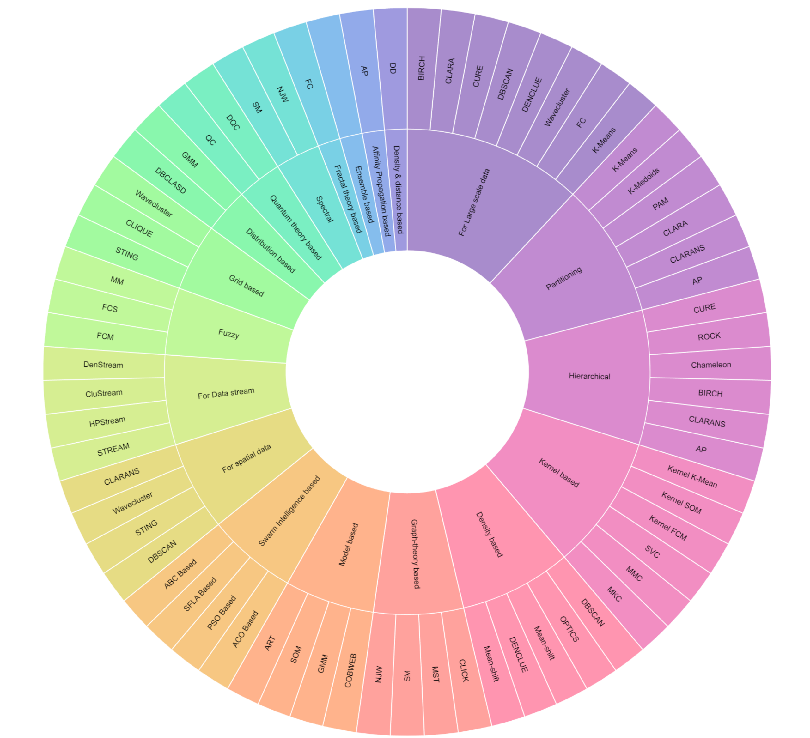

## A brief overview of different types of clustering techniques and their algorithms

<figure>

<figcaption>

Photo by [Andrea De Santis](https://unsplash.com/@santesson89?utm_source=medium&utm_medium=referral) on [Unsplash](https://unsplash.com/?utm_source=medium&utm_medium=referral)

</figcaption>

</figure>

# **Introduction**

Clustering is a fascinating technique used in machine learning, where patterns or data points are grouped based on their similarities. It’s like finding hidden connections among different data points without predefined labels. However, clustering comes with its fair share of challenges that make it more complex than supervised classification.

One major difficulty with clustering is the absence of labelled data. Unlike supervised learning, where patterns are already classified, clustering requires us to discover similarities without any prior knowledge. This lack of labelled data makes the clustering process inherently trickier.

Moreover, clustering heavily relies on numeric data to represent pattern features. This means that we can only extract information about relationships among patterns through mathematical operations. Unfortunately, this limitation hampers the ability of most clustering algorithms to capture intricate relationships or dependencies in non-numeric data.

Another factor contributing to the complexity of clustering is the absence of a precise definition of a “cluster.” Since we don’t have well-defined categories or pre-labelled data, the concept of clusters becomes subjective and dependent on the chosen algorithm and its parameters.

However, different clustering approaches have emerged to address these concerns and make clustering a more robust and versatile technique. These approaches strive to overcome the challenges posed by the lack of labelled data, the numerical nature of the features, and the subjective nature of clusters.

This article is about the most common, advanced and accessible clustering techniques. We have classified them based on the different characteristics of the method, limitations, and evaluation methods. These techniques include partitioning, hierarchical, density-based, distribution-based and spectral clustering to name a few.

# The 19 Clustering Techniques

With a comprehensive list of 19 different clustering techniques, each with its own advantages and disadvantages, you can find the ideal algorithm that suits your specific needs. Additionally, not only do these techniques offer a variety of options, but each also comes with multiple algorithms to choose from. The following is the list of the most common clustering categories. You can think about these as different classes of clustering techniques.

<figure>

<figcaption>

The 19 clustering techniques and their corresponding algorithms

</figcaption>

</figure>

## **Partitioning**

When you wish to group customers with similar purchasing behaviours, preferences, or demographics, helping businesses create targeted marketing strategies i.e. Customer Segmentation, or if you wish to perform image recognition, Partitioning Clustering is the way to go. This technique involves dividing a dataset into several disjoint partitions or clusters. Each data point is assigned to a specific cluster based on certain criteria. For example in k-means clustering, each cluster is represented by its center (i.e. _centroid_) which corresponds to the mean of points assigned to the cluster. The clusters are defined so that the points within a cluster are similar to each other and, different from the data points in another cluster.

Algorithms:

- [K-Means](https://www.javatpoint.com/k-means-clustering-algorithm-in-machine-learning)

- [K-Medoids](https://www.javatpoint.com/k-medoids-clustering-theoretical-explanation)

- [PAM](https://towardsdatascience.com/a-deep-dive-into-partitioning-around-medoids-a77d9b888881) — Partition Around Medoids

- [CLARA](https://www.datanovia.com/en/lessons/clara-in-r-clustering-large-applications/) — Clustering Large Applications

- [CLARANS](https://analyticsindiamag.com/comprehensive-guide-to-clarans-clustering-algorithm/) — Clustering Large Applications based upon RANdomized Search

- [AP](https://medium.com/serpdotai/affinity-propagation-13c43f2fd883) — Affinity Propagation

_More information about the technique is available_ [_here_](https://medium.com/analytics-vidhya/partitional-clustering-181d42049670)

## **Hierarchical**

Hierarchical clustering is a popular algorithm used in unsupervised machine learning for dividing a dataset into a hierarchy of clusters. It aims to organize the data points in a tree-like structure called a dendrogram, which represents the relationships between the points based on their similarities or dissimilarities. Each data point initially forms its own cluster, and then the algorithm repeatedly merges the most similar clusters together until there is only one cluster remaining. The similarity between clusters is often measured using methods such as Euclidean distance or correlation. This technique is great for classifying genes with similar expression patterns or grouping similar biological samples together.

Algorithms:

- [CURE](https://www.geeksforgeeks.org/basic-understanding-of-cure-algorithm/) — Clustering Using REpresentatives

- [ROCK](https://medium.com/geekculture/the-rock-algorithm-in-machine-learning-5fa152f34de7) — RObust Clustering using LinKs

- [Chameleon](https://www.tutorialspoint.com/what-is-a-chameleon)

- [BIRCH](https://medium.com/@noel.cs21/balanced-iterative-reducing-and-clustering-using-heirachies-birch-5680adffaa58) — Balanced Iterative Reducing and Clustering using Hierarchies

_More information about the technique is available_ [_here_](https://www.learndatasci.com/glossary/hierarchical-clustering/)

## **Density-based**

Density-based clustering is a technique used to discover clusters in a data collection based on the density of data points in their vicinity. It identifies areas with a higher density of data points compared to the surrounding areas. The clusters are defined as regions of high-density separated by regions of low-density. The points within a cluster are uniformly dense, and regions of low-density separate points in different clusters. This technique is commonly used in spatial datasets, such as GPS coordinates or geographical regions, to find clusters based on proximity.

Algorithms:

- [DBSCAN](https://www.kdnuggets.com/2020/04/dbscan-clustering-algorithm-machine-learning.html) — Density-Based Spatial Clustering of Applications with Noise

- [OPTICS](https://www.geeksforgeeks.org/ml-optics-clustering-explanation/) — Ordering Points To Identify Cluster Structure

- [Mean-shift](https://medium.com/@shruti.dhumne/mean-shift-clustering-a-powerful-technique-for-data-analysis-with-python-f0c26bfb808a)

- [DENCLUE](https://www.janbasktraining.com/tutorials/density-based-clustering/) — DENsity-Based CLUstering

_More information about the technique is available_ [_here_](https://pro.arcgis.com/en/pro-app/latest/tool-reference/spatial-statistics/how-density-based-clustering-works.htm)

## **Distribution based**

Distribution-based clustering algorithms offer a sophisticated approach to analyzing complex datasets where data points follow distinct probability distributions. Unlike traditional clustering methods that rely on proximity or density, distribution-based clustering excels in identifying varied cluster shapes and densities, making it particularly useful in datasets with heterogeneous characteristics. These algorithms operate on the principle that data points are not randomly scattered but adhere to specific statistical patterns, such as normal or Gaussian distributions. The main objective is to detect these underlying distributions in the dataset and group data points into clusters based on their statistical distribution. This methodology is a departure from conventional clustering techniques like K-means, which typically focus on distance metrics and assume homogeneity in cluster shapes and sizes.

In practical applications, distribution-based clustering is invaluable in areas like market research, where consumer behaviours may exhibit different patterns, or in biological research for analyzing gene expression data. The process involves assigning each data point to a cluster by determining the likelihood of it belonging to the distribution characteristic of that cluster. This advanced technique is adept at handling data where clusters differ significantly in size, shape, or density, thus providing a more nuanced and accurate clustering solution for complex datasets. The ability to identify and align with the intricate probability distributions within data makes distribution-based clustering a powerful tool in fields requiring detailed data analysis and pattern recognition.

Algorithms:

- [DBCLASD](http://10.0.4.85/ICDE.1998.655795) — Distribution-Based Clustering of LArge Spatial Databases

- [GMM](https://behesht.medium.com/unsupervised-learning-clustering-using-gaussian-mixture-model-gmm-c788b280932b) — Gaussian Mixture Model

_More information about the technique is available_ [_here_](https://en.wikipedia.org/wiki/Cluster_analysis#Distribution-based_clustering)

## **Spectral**

Spectral clustering is suited for complex datasets. This method is especially effective when the data is not straightforward and contains non-linear structures. It goes beyond surface-level analysis, diving deep into the data’s core structure to uncover connections and groupings that might not be immediately apparent. This ability to organize complex data patterns is what makes spectral clustering a powerful tool for various challenging clustering tasks.

Spectral clustering is extensively used in various domains such as computer vision, image segmentation, community detection in social networks, and text clustering. The core principle of this method is clustering data points based on their similarity, rather than on distance metrics used in methods like K-means.

The spectral clustering technique is fundamentally graph-based. It begins by constructing a similarity matrix, which represents the degree of similarity between each pair of data points in the dataset. The unique aspect of spectral clustering lies in its utilization of eigenvectors (or spectra) of this similarity matrix. By analyzing these eigenvectors, the algorithm effectively partitions the data into distinct clusters. This approach allows for the identification of clusters that are connected or grouped based on similarity in a higher-dimensional space, making it highly effective for data that forms complex shapes or structures. The technique is particularly adept at handling scenarios where the clusters are intertwined or not easily separable by linear boundaries.

In practical applications, spectral clustering’s ability to capture the essence of complex relationships within data makes it a popular choice for computer vision and image segmentation as it helps in identifying regions of images that are similar in texture or colour. In social network analysis, it is used for community detection, where it identifies groups of individuals with similar interests or connections. Similarly, in text clustering, spectral clustering aids in grouping documents or texts that are topically similar, even when the relationship between the texts is not straightforward.

Algorithms:

- [SM](https://sites.stat.washington.edu/spectral/papers/UW-CSE-03-05-01.pdf) — Shi and Malik

- [NJW](https://sites.stat.washington.edu/spectral/papers/UW-CSE-03-05-01.pdf) — Ng, Jordan and Weiss

_More information about the technique is available_ [_here_](https://en.wikipedia.org/wiki/Spectral_clustering)

## **Fuzzy**

Fuzzy clustering is a technique used in data analysis and data mining to classify data points into multiple clusters based on their similarity. Unlike traditional clustering algorithms, fuzzy clustering assigns a degree of membership to each data point, indicating the likelihood of that point belonging to each cluster.

In fuzzy clustering, every data point is associated with a membership value between 0 and 1 for each cluster. These membership values represent the degree of belongingness to each cluster. A data point can have a higher membership value for one cluster and a lower value for others, making it a more flexible approach compared to hard clustering techniques like K-means.

This algorithms following this technique work iteratively to optimize the memberships and cluster centers. They calculate the distance between data points and cluster centers and update the memberships based on these distances. Smaller the distance, higher the membership. The iteration continues until a certain convergence criterion is met, typically when the memberships or cluster centers do not significantly change.

Some common applications of fuzzy clustering include market segmentation, image segmentation, pattern recognition, and data compression. It enables a more nuanced understanding of complex datasets and provides probabilistic categorization rather than strict categorization into clusters.

Algorithms:

- [FCM](https://medium.com/geekculture/fuzzy-c-means-clustering-fcm-algorithm-in-machine-learning-c2e51e586fff) — Fuzzy C-Means

- [FCS](https://iopscience.iop.org/article/10.1088/1742-6596/1613/1/012006/pdf) — Fuzzy C-Shells

- [MM](https://doi.org/10.1007/s00500-021-06397-7) — Meskat-Mahmudul

_More information about the technique is available_ [_here_](https://www.geeksforgeeks.org/ml-fuzzy-clustering/)

## **Graph-theory based**

Graph theory-based clustering approaches data organization from a different perspective. It uses the concepts of graphs and networks to uncover clusters. The data points are the nodes (vertices) in a graph, while the connections (edges) represent relationships or similarities between them. The strength of edges can reflect the degree of similarity or connection strength. The nodes within each identified cluster represent data points that are more closely related to each other than to those in other clusters. The edges within clusters are generally stronger than those between clusters, indicating tighter connections. This creates a visual representation of the data’s structure, revealing patterns and community-like structures.

This technique handles complex relationships by capturing non-linear relationships and patterns that traditional distance-based clustering methods might miss. The graph construction can be tailored to reflect specific domain knowledge about relationships between data points. It discovers overlapping clusters(soft clustering) representing multiple facets or roles. Therefore, it is highly useful for social network analysis and protein interaction analysis in biological networks.

Algorithms:

- [CLICK](https://pubmed.ncbi.nlm.nih.gov/10977092)

- [MST](https://sites.google.com/site/dataclusteringalgorithms/mst-based-clustering-algorithm) — Minimum Spanning Tree

- [SM](https://sites.stat.washington.edu/spectral/papers/UW-CSE-03-05-01.pdf) — Shi and Malik

- [NJW](https://sites.stat.washington.edu/spectral/papers/UW-CSE-03-05-01.pdf) — Ng, Jordan and Weiss

_More information about the technique is available_ [_here_](https://www.cse.msu.edu/~cse802/S17/slides/Lec_20_21_22_Clustering.pdf)

## **Grid based**

Grid-based clustering is a technique used to group data points together based on their spatial proximity in a two-dimensional space. It uses a multi-resolution grid data structure to achieve this. It divides the space into a fixed number of equally sized grids and assigns data points to their respective grid cells. This approach provides a simple and efficient way to organize and analyze large datasets.

The first step in this technique is to create a grid over the two-dimensional space, subdividing it into a predetermined number of cells. Each data point is then assigned to its corresponding grid cell based on its location, and the density of each cell is calculated. If the density of the cell is below a certain threshold, it is eliminated from consideration. The adjacent groups of dense cells form clusters.

Grid-based clustering is especially useful in scenarios where the spatial distribution of data is important. It is commonly used in applications such as Image Segmentation, Spatial Data Analysis and Network Traffic Analysis.

Algorithms:

- [STING](https://www.tutorialspoint.com/what-is-sting-grid-based-clustering) — STatistical INformation Grid

- [CLIQUE](https://www.geeksforgeeks.org/clique-algorithm-in-data-mining/)

- [Wavecluster](https://www.vldb.org/conf/1998/p428.pdf)

_More information about the technique is available_ [_here_](https://nitsri.ac.in/Department/Computer%20Science%20&%20Engineering/BD28.pdf)

## **Model-based**

Model-based clustering takes a statistical approach. It assumes that the data points are drawn from a finite combination of component models. Each of these component models are probability distribution. It then finds the specific mixture and its parameters that best fit the data.

Initially, a suitable model is chosen to represent the data distribution. Commonly used models are [Gaussian mixture models](https://scikit-learn.org/stable/modules/mixture.html), [hidden Markov models](https://en.wikipedia.org/wiki/Hidden_Markov_model), or [finite mixture models](https://www.stata.com/features/overview/finite-mixture-models/). Then the parameters of the chosen model are estimated, typically using an iterative algorithm such as [Expectation-Maximization](https://en.wikipedia.org/wiki/Expectation%E2%80%93maximization_algorithm) (EM). Once the model parameters are estimated, each data point is assigned to the cluster that maximizes the likelihood of belonging to that cluster based on the model. The assignment of data points to clusters may not be perfect initially, so the process iterates by updating the model parameters and reassigning data points until convergence.

Model-based clustering is used in various domains, such as in exploratory data analysis, customer segmentation, image analysis, and bioinformatics. It is particularly useful when the data distribution is complex and requires a probabilistic description for clustering. Model-based clustering can identify clusters with different shapes, sizes, and densities, offering flexibility compared to other clustering techniques.

Algorithms:

- [COBWEB](https://doi.org/10.1515/JISYS.2009.18.3.229)

- [GMM](https://behesht.medium.com/unsupervised-learning-clustering-using-gaussian-mixture-model-gmm-c788b280932b) — Gaussian Mixture Model

- [SOM](https://medium.com/machine-learning-researcher/self-organizing-map-som-c296561e2117) — Self-Organizing Map

- [ART](http://10.0.4.85/INNOVATIONS.2008.4781647)

_More information about the technique is available_ [_here_](https://www.tutorialspoint.com/what-is-model-based-clustering)

## **Quantum theory based**

Quantum Clustering is a technique used to analyze a set of points in a multi-dimensional space. It represents each point with a Gaussian distribution centered at its location. These Gaussian distributions are added together to create a single distribution for the entire data set.

Quantum clustering is used in various scenarios, particularly in complex data clustering problems where traditional clustering algorithms struggle. It has been applied to fields such as image and pattern recognition, bioinformatics, network analysis, and anomaly detection. It offers a unique perspective on clustering data by exploiting the principles of quantum mechanics, aiming to find patterns and relationships that might not be easily discoverable with classical methods.

Algorithms:

- [QC](https://en.wikipedia.org/wiki/Quantum_clustering) — Quantum Clustering

- [DQC](https://doi.org/10.48550/arXiv.1310.2700) — Dynamic Quantum Clustering

_More information about the technique is available_ [_here_](https://doi.org/10.1007/s40745-015-0040-1)

## **Affinity Propagation based**

It is based on the concept of “message passing” between data points. It determines data point representatives, or exemplars, and assigns other data points to these exemplars like in K-Medoids algorithm.

This technique begins by calculating a similarity matrix between all pairs of data points. This matrix represents the similarity or dissimilarity between each data point. It then iteratively updates two matrices: the responsibility matrix and the availability matrix. The responsibility matrix contains a measure of the accumulated evidence that one data point should be an exemplar for another, while the availability matrix contains a measure of the accumulated evidence that a particular data point should choose another as its exemplar. AP performs multiple rounds of message passing between data points to update the responsibility and availability matrices. During each round, each data point sends its current values to all others, resulting in a series of message exchanges. After convergence, each data point selects the exemplar with the highest net responsibility for itself as its exemplar. Finally, AP assigns each data point to its corresponding exemplar, resulting in the formation of clusters.

It is a versatile clustering algorithm suitable for many applications where the number of clusters is not known in advance, and it allows for automatic identification of exemplars. It is used in scenarios such as Image Segmentation, Document Clustering, Gene Expression Analysis and Social Network Analysis.

Algorithms:

- [AP](https://medium.com/serpdotai/affinity-propagation-13c43f2fd883) — Affinitity Propagation

_More information about the technique is available_ [_here_](https://en.wikipedia.org/wiki/Affinity_propagation)

## **Spatial Clustering**

Spatial clustering is a technique used in data mining and geographic information systems (GIS) to classify and group spatial data(any type of data that directly or indirectly references a specific geographical area or location) into clusters based on their proximity to each other. It involves grouping similar objects that are close to each other in space.

In spatial clustering, a distance or similarity measure is used to determine the proximity between spatial objects. It can be based on [Euclidean distance](https://en.wikipedia.org/wiki/Euclidean_distance), [Manhattan distance](https://medium.com/analytics-vidhya/euclidean-and-manhattan-distance-metrics-in-machine-learning-a5942a8c9f2f#:~:text=Manhattan%20distance%20is%20a%20metric,%2Dcoordinates%20and%20y%2Dcoordinates.), or any other suitable metric. Several algorithms are available to perform spatial clustering, such as k-means, hierarchical clustering, density-based clustering (DBSCAN), etc. These algorithms employ different techniques for grouping objects based on their proximity. The algorithm is applied to the spatial data, and objects are assigned to different clusters based on their similarity and proximity to other objects. The goal is to maximize the similarity within clusters while maximizing the dissimilarity between clusters.

Spatial clustering is used in various domains and applications, including Geographic analysis where it helps identify spatial patterns, hotspots, and areas with high or low concentrations of specific phenomena, pattern recognition and urban planning and transportation.

Algorithms:

- [DBSCAN](https://www.kdnuggets.com/2020/04/dbscan-clustering-algorithm-machine-learning.html) — Density-Based Spatial Clustering of Applications with Noise

- [STING](https://www.tutorialspoint.com/what-is-sting-grid-based-clustering) — STatistical INformation Grid

- [Wavecluster](https://www.vldb.org/conf/1998/p428.pdf)

- [CLARANS](https://analyticsindiamag.com/comprehensive-guide-to-clarans-clustering-algorithm/) — Clustering Large Applications based upon RANdomized Search

_More information about the technique is available_ [_here_](https://kazumatsuda.medium.com/spatial-clustering-fa2ea5d035a3)

## **Data stream Clustering**

Data stream clustering is a technique used to analyze and group data points in real-time as they arrive in a stream. It is commonly employed in scenarios where data is continuously generated and needs to be processed online without storing the entire data set.

The working principle behind data stream clustering involves capturing a fixed-size window of incoming data points and performing clustering algorithms on this window. The window is updated by sliding it forward when new data points arrive and removing the oldest points. As new data points are added to the window, the clustering algorithm updates the existing clusters or creates new ones.

Data stream clustering is used in numerous domains, including online marketing, fraud detection, network traffic analysis, sensor networks, anomaly detection, and social network analysis. It has applications in tasks like real-time recommendations, continuous monitoring, pattern recognition, and exploring evolving trends in streaming data.

Algorithms:

- [STREAM](https://doi.org/10.1007/s10462-013-9398-7)

- [HPStream](https://doi.org/10.1186/s41044-016-0011-3) — High-dimensional Projected Stream

- [CluStream](https://sybernix.medium.com/clustream-a-framework-for-clustering-evolving-data-streams-b2f8b2d65ae)

- [DenStream](https://doi.org/10.1137/1.9781611972764.29) — Density-based data Stream

_More information about the technique is available_ [_here_](https://en.wikipedia.org/wiki/Data_stream_clustering)_._

**_There is a scarcity of online literature on the following techniques, as they pertain to relatively specific and less commonly used clustering options._**

## **Fractal-theory based**

Fractals are complex geometric shapes exhibiting self-similarity, meaning their patterns repeat at different scales. They are useful in modelling structures (such as snowflakes) in which similar patterns recur at progressively smaller scales. The complexity of fractals is characterized by “fractal dimension”. Fractal dimension goes beyond the usual dimensions (like length, width, and height) to capture how detailed and “crinkled” something is. For example, in a snowflake, similar patterns repeat at smaller and smaller scales. This self-similarity is what distinguishes fractals and defines their fractal dimension(complexity).

The underlying principle of fractals is that a simple process that goes through infinitely many iterations becomes a very complex process. Fractals attempt to model the complex process by searching for the simple process underneath. Most fractals operate on the principle of a feedback loop. The primary concept behind fractal clustering is to arrange points within a cluster in a manner that does not significantly alter the cluster’s intrinsic dimension. Each data point is assigned a fractal dimension using techniques like [box-counting](https://en.wikipedia.org/wiki/Box_counting#:~:text=Box%20counting%20is%20a%20method,pieces%20at%20each%20smaller%20scale.). Points with similar fractal dimensions tend to exhibit similar internal patterns, suggesting they belong to the same cluster. Clustering is then done using other techniques such as grid-based clustering where clusters are formed by grouping points with similar fractal dimensions within each grid cell.

Fractal-theory based clustering works well with complex data shapes and non-linear relationships and is efficient for large datasets due to its grid-based nature. It is used for medical image analysis, financial data analysis and biological data analysis.

Algorithms:

- [FC](https://doi.org/10.1007/0-387-25465-X_28) — Fractal Clustering

_More information about the technique is available_ [here](https://doi.org/10.1109/CSBW.2005.66)

## **Kernel based**

Consider your data points like dots on a flat surface. Traditional clustering methods might struggle to group them effectively if they form curvy clusters or spiral shapes. Kernel-based clustering takes your data to a higher-dimensional space where these clusters become more easily identifiable. Kernel-based clustering is thus a powerful technique for grouping data points when your data exhibits complex, non-linear relationships.

Kernel methods owe their name to the use of kernel functions, which enable them to operate in a high-dimensional, _implicit_ feature space without ever computing the coordinates of the data in that space, but rather by simply computing the inner products between the images of all pairs of data in the feature space. This operation is often computationally cheaper than the explicit computation of the coordinates. This approach is called the “**kernel trick**”.

A kernel function takes your data points from the original flat space and maps them to a new, higher-dimensional space. This transformation happens implicitly, without you needing to calculate the complex new coordinates directly. The key thing is that the kernel captures the similarities between data points in a way that accounts for their non-linear relationships. Once in the high-dimensional space, any standard clustering algorithm like K-means can be applied, to find groups of data points that are close together. These groups in the new space correspond to actual clusters in the original data, but their shapes might be much more complex now. So, after clustering in the new space, you map the data points back to the original space. This brings your clusters back to the real world while retaining their complex shapes.

Commonly used applications for this technique are bioinformatics, anomaly detection and gene expression analysis.

Algorithms:

- [Kernel K-Means](https://doi.org/10.48550/arXiv.2011.06461)

- [Kernel SOM](https://doi.org/10.1016/j.neucom.2005.10.003)

- [Kernel FCM](https://doi.org/10.3233/IDT-210091)

- [SVC](https://dl.acm.org/doi/10.5555/944790.944807) — Support Vector Clustering

- [MMC](http://luthuli.cs.uiuc.edu/~daf/courses/Opt-2017/Papers/max_margin_clustering.pdf) — Maximum Margin Clustering

- [MKC](https://doi.org/10.48550/arXiv.2207.06041) — Multiple Kernel Clustering

_More information about the technique is available_ [_here_](https://doi.org/10.1007/s40745-015-0040-1)

## **Ensemble based**

Ensemble clustering, also called consensus clustering aims to combine multiple base clustering algorithms to produce more consistent, reliable and accurate clustering results compared with the individual clustering algorithms. It leverages the idea that different algorithms may have different strengths and weaknesses, and by combining their outcomes, a more accurate and robust clustering solution can be obtained.

To perform this, multiple clustering algorithms are applied to the dataset resulting in multiple different clusterings. Each individual clustering represents a potential partitioning of the data points into clusters. The individual clusterings are then combined using an ensemble technique, such as [majority voting](https://www.javatpoint.com/majority-voting-algorithm-in-machine-learning#:~:text=The%20Majority%20Voting%20Algorithm%20is%20a%20straightforward%20yet%20powerful%20technique,valuable%20tool%20in%20various%20domains.), [weighted voting](https://doi.org/10.1016/j.optlastec.2022.109012), or [consensus functions](https://www.sciencedirect.com/topics/computer-science/consensus-function#:~:text=Given%20this%20background%2C%20a%20large,graph%2Dbased%20approaches%2C%20respectively.). These techniques assign weights to the individual clusterings based on their quality or similarity and produce a final integrated clustering solution. Once the ensemble combination step is complete, a final clustering solution is obtained. This solution represents an aggregation of the individual clusterings and should ideally capture the most accurate and stable clustering structure of the dataset.

Ensemble-based clustering is particularly useful in scenarios where the dataset is complex, high-dimensional, or noisy. It can handle a wide range of data types, including numerical, categorical, and mixed data. Ensemble-based clustering is applied when one wants to achieve better clustering performance and robustness by combining the outcomes of multiple clustering algorithms or multiple runs. It is also valuable when there is uncertainty in selecting the most appropriate clustering algorithm or setting parameters for a single algorithm.

Algorithms:

Mixture of algorithms based on trials

_More information about the technique is available_ [_here_](https://doi.org/10.1007/s13042-017-0756-7)

## **Swarm Intelligence based**

It is a clustering technique inspired by the collective behavior of social insect colonies, specifically the behaviour of swarms. It models the clustering process based on the principles of self-organization and emergence observed in natural swarm systems like bees, ants, or birds.

It can be used to form clusters in large-scale sensor networks, enabling efficient data aggregation and management or it can be adapted to solve optimization problems like facility location, vehicle routing, or graph partitioning. It is also used for applications such as data clustering and image segmentation.

Algorithms:

- [ACO Based](https://doi.org/10.1007/11839088_31) — Ant Colony Optimization for Clustering

- [PSO Based](http://10.0.4.85/CEC.2003.1299577) — Particle Swarm Optimization

- [SFLA Based](https://www.linkedin.com/pulse/shuffled-frog-leaping-algorithm-innovative-approach-problem-chan/) — Shuffled Leaping Frog Algorithm

- [ABC Based](https://doi.org/10.1016/j.asoc.2009.12.025) — Artificial Bee Colony

_More information about the technique is available_ [_here_](https://doi.org/10.1007/978-0-387-69935-6_12)

## **Density and distance-based**

Density and distance-based clustering is a technique introduced in a scientific paper in 2014. Its main concept is unique, and its defining characteristic is the way it describes cluster centers. According to this technique, a cluster center must meet two criteria:

1. It should be surrounded by a significant number of data points within a specific range, indicating a high local density

3. It should be distant from other data points that have a high local density and could potentially be cluster centers themselves.

To implement this approach, the local density of each data point is calculated and the shortest distance between each data point and others with a higher local density is determined. This information is used to create a decision graph, which is then used to identify cluster centers. The remaining data points are assigned to the nearest cluster with a higher local density.

This technique is used for data analysis and pattern recognition.

Algorithms:

- [DD](https://doi.org/10.1007/s40745-015-0040-1) — Density and Distance

_More information about the technique is available_ [_here_](https://doi.org/10.1007/s40745-015-0040-1)

## **For large-scale data**

Clustering for large scale data presents unique challenges. Traditional clustering techniques become computationally expensive with increasing data size, taking longer to execute and requiring more resources. Holding massive datasets in memory while clustering might not be feasible, leading to out-of-memory errors and hindering the process. Techniques need to be scalable to handle ever-growing datasets without sacrificing accuracy or performance. Large datasets often contain more noise and outliers, which can negatively impact clustering results if not effectively handled. To handle these concerns, specific techniques and tactics are required to effectively group data points without being overwhelmed by the huge volume.

Approaches for Large-Scale Clustering:

- Sampling: Instead of analyzing the entire dataset, representative samples are chosen for clustering, reducing computational burden while maintaining acceptable accuracy.

- Streaming algorithms: Data is processed one point at a time, avoiding holding the entire dataset in memory and adapting to continuously arriving data.

- Parallelization: Dividing the workload across multiple processors or machines can significantly speed up the clustering process for large datasets.

- Approximation algorithms: These techniques trade-off exactness for efficiency, offering approximate but fast clustering solutions for large data.

- Hierarchical clustering: Grouping data into a hierarchy of clusters can be more efficient than flat clustering for large datasets, allowing for exploration at different granularities.

Popular Large-Scale Clustering Techniques include K-means Clustering with Mini-batching, Streaming K-means etc.

A successful large-scale clustering project requires careful selection of an appropriate technique, efficient implementation, and consideration of the trade-offs between accuracy, performance, and resource constraints.

Algorithms:

- [BIRCH](https://medium.com/@noel.cs21/balanced-iterative-reducing-and-clustering-using-heirachies-birch-5680adffaa58) — Balanced Iterative Reducing and Clustering using Hierarchies

- [CLARA](https://www.datanovia.com/en/lessons/clara-in-r-clustering-large-applications/#google_vignette) — Clustering Large Applications

- [CURE](https://www.geeksforgeeks.org/basic-understanding-of-cure-algorithm/) — Clustering Using REpresentatives

- [DBSCAN](https://www.kdnuggets.com/2020/04/dbscan-clustering-algorithm-machine-learning.html) — Density-Based Spatial Clustering of Applications with Noise

- [DENCLUE](https://www.janbasktraining.com/tutorials/density-based-clustering/) — DENsity Based CLUstering

- [Wavecluster](https://www.vldb.org/conf/1998/p428.pdf)

- [FC](https://doi.org/10.1007/0-387-25465-X_28) — Fractal Clustering

- [K-Means](https://www.javatpoint.com/k-means-clustering-algorithm-in-machine-learning)

_More information about the technique is available_ [_here_](https://doi.org/10.1007/s40745-015-0040-1)_._

**_To access the table of clustering techniques, algorithms and their evaluation criteria, please follow the link:_**

##### [Excel/README.md at main · data-community-of-practice/Excel](https://github.com/data-community-of-practice/Excel/blob/main/README.md?source=post_page-----cd5dc3187f0d--------------------------------)

# **Conclusion**

Clustering is a captivating method in the world of machine learning. It allows data scientists to uncover hidden patterns within their data without the need for labelled examples. However, it can be quite difficult to master all relevant techniques.

The article provides a comprehensive overview of 19 different clustering techniques, categorized by their characteristics and applications. It showcases popular methods like partitioning, hierarchical, density-based, distribution-based, and spectral clustering. More advanced techniques like fuzzy, graph-theory based, grid-based, model-based, and quantum clustering are also explored, highlighting their unique capabilities for handling complex data structures and relationships. Each technique has its own pros and cons and is suitable for different types of data and applications. They can be used in a wide range of fields, including marketing, biology, spatial data analysis, and complex data analysis tasks. These advancements are opening up exciting possibilities for researchers and data scientists, enabling them to dig deeper into their data and unlock its true potential.

It is important to consider the specific requirements and characteristics of the data when selecting a clustering technique. There are various algorithms within each clustering technique category providing a range of options for different use cases. If there is confusion when deciding upon the most suitable clustering algorithm for your requirements, our informative table can be consulted to discover the ideal algorithm that resolves your distinctive data challenges.

