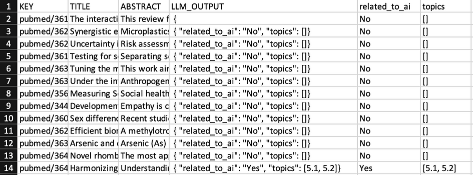

## Using Mistral for Data tagging

<figure>


<figcaption>

Source: Generated using DeviantArt’s DreamUp

</figcaption>

</figure>

# Author

· Xuzeng He (**ORCID:** [0009–0005–7317–7426](https://orcid.org/0009-0005-7317-7426))

# Introduction

Data tagging, in simple terms, is the process of assigning labels or tags to your data so that they are easier to retrieve or analyse. For example, when you are dealing with a database consisting of scientific journals, you may want to tag these documents with their relevant topics so that users can later easily find the journal they are interested in using some filter button without too much effort. To make things better, with the surge of Large Language Models (LLMs) nowadays (e.g. ChatGPT), one can now use them to tag huge amounts of data as long as you can deploy these models on your local computer.

In this post, we will show you how to use a popular large language model called Mistral to tag out a list of documents (in JSON format) from [PubMed](https://pubmed.ncbi.nlm.nih.gov/) whose topics are related to Artificial Intelligence (AI) by inspecting their titles and abstracts.

# Installation Guide

In this work, we use Ollama to install and run our LLMs locally and use Langchain to interact with our LLMs in a Python environment.

As a first step, we need to install Ollama from the [official website](https://ollama.com/). Once the installation is complete and Ollama is running (typically as an application), open the terminal and run the following command to download your preferred LLM onto your local computer (in this tutorial, we will use mistral as an example):

```
ollama pull mistral
```

As for the installation of Langchain, simply run:

```
pip install langchain
```

Now that the installation part is complete, you can safely close the terminal and turn to your favourite Python IDE for the next step. However, you need to make sure Ollama is still running in the background as Langchain needs to interact with the model with the help of Ollama.

# Input and Output

Before we move on to the coding part, we first take a look at our input file. As mentioned before, the input file is in JSON format as a list of JSON items, and an example item looks as below:

```
{
"last_updated": "2022–10–04",
"local_id": "36182134",
"pubmed_lang": "eng",
"authors_list": "Anwar Ul Haq Khan, Ravi Naidu, Raja Dharmarajan, Cheng Fang, Hokyong Shon, Zhaomin Dong, Yanju Liu",
"source": "pubmed.gov",
"abstract": "This review focuses on the occurrence and interactions of engineered nanoparticles (ENPs) and brominated flame retardants (BFRs) such as polybrominated diphenyl ethers (PBDEs) in water systems and the generation of highly complex compounds in the environment. The release of ENPs and BFRs (e.g. PBDEs) to aquatic environments during their usage and disposal are summarised together with their key interaction mechanisms. The major interaction mechanisms including electrostatic, van der Waals, hydrophobic, molecular bridging and steric, hydrogen and \u03c0-bonding, cation bridging and ligand exchange were identified. The presence of ENPs could influence the fate and behaviour of PBDEs through the interactions as well as induced reactions under certain conditions which increases the formation of complex compounds. The interaction leads to alteration of behaviour for PBDEs and their toxic effects to ecological receptors. The intermingled compound (ENPs-BFRs) would show different behaviour from the parental ENPs or BFRs, which are currently lack of investigation. This review provided insights on the interactions of ENPs and BFRs in artificial, environmental water systems and wastewater treatment plants (WWTPs), which are important for a comprehensive risk assessment.",
"type": "publication",
"title": "The interaction mechanisms of co-existing polybrominated diphenyl ethers and engineered nanoparticles in environmental waters: A critical review.",
"publication_year": "2023",
"pubmed_journal_title": "Journal of environmental sciences (China)",
"pubmed_journal_issn": "1001–0742",
"key": "pubmed/36182134",
"doi": "10.1016/j.jes.2021.10.018"
}
```

Here in this tutorial, we will only use the title and abstract as part of our prompt when using the LLM, along with the key to uniquely identify each of these documents.

We also have to think about what the output file looks like. In this work, the output file is in CSV format and has the following columns:

```
header = ['KEY', 'TITLE', 'ABSTRACT','LLM_OUTPUT', 'related_to_ai', 'topics']
```

Here, KEY, TITLE and ABSTRACT are properties from the input file, LLM\_OUTPUT is the response generated by LLM. _related\_to\_ai_ and _topics_, in this case, are both extracted from LLM\_OUTPUT (which will be covered in the next section) where _related\_to\_ai_ should either be Yes or No, and _topics_ mean some specific topics that LLM can find from a document when LLM is provided with a detailed taxonomy to work with. One can safely ignore topics if they are not interested in such details from a document.

# Using Mistral

Now that we have figured out what will be the format of our input and output, we can start working with the LLM that we have previously installed by writing prompts and feeding them into the model using Python. First, we import Langchain and Ollama as below:

```
from langchain_community.llms import Ollama
```

After that, we can write the entire prompting process as a function since we need to call it several times when dealing with more than one document:

```
def prompt_llm(model, title, abstract):
llm = Ollama(model=model, num_predict=128, stop=["}"])
res = llm.invoke(prompt.format(tags=tags, example=example, title=title, abstract=abstract))
return res
```

where the prompt mentioned above is structured as follows:

```
prompt = '''
#INSTRUCTIONS
Given the TITLE and ABSTRACT of an article, classify if the article is related to Artificial Intelligence.
If the article is related to Artificial Intelligence, provide a list of topic tags.
The tags are defined as below:
{tags}
#OUTPUT
The output must be in JSON format with only two keys: "related_to_ai" and "topics". Here are examples of outputs:
{example}
#TITLE
{title}
#ABSTRACT
{abstract}
'''
example = '''{ "related_to_ai": "Yes", "topics": [2.4] } , { "related_to_ai": "No", "topics": [] }, { "related_to_ai": "Yes", "topics": [4.3, 7.1] }'''
```

By using this prompt structure, we are asking the model to generate the response in a specific JSON format using the example we have provided. This can allow the extraction for _related\_to\_ai_ and _topics_ to be easier.

We also ask the model to provide a list of topic tags if the document or article is found to be related to AI by feeding the model with a detailed AI taxonomy named _tags_ (again, one can safely remove this part if they are not interested in doing this)

You may notice that we use two additional parameters (_num\_predict_ and _stop_) when setting up the LLM other than the model parameter. This is partially because the model installed by Ollama can sometimes have unexpected behaviour (e.g. response not matching with the given format, repeating response with the specified format) due to its rather small size of parameters. In this case, we need to further manipulate the model to reduce the possibility of receiving such responses with format errors.

Here, _num\_predict = 128_ means that we only want the model to produce a maximum number of 128 tokens when generating the response since a longer response usually means that it does not match with required JSON format. We also set a stop token of **}** by using stop = \[“}”\] so that the model can stop generating the response when the JSON format is complete and can thus move on to the next document (since } appears at the end of the JSON format)

You can also change other parameters to make sure the model produces functionally correct output by reading the [official document](https://api.python.langchain.com/en/latest/llms/langchain_community.llms.ollama.Ollama.html) provided by the Langchain community.

Now that we’ve defined prompt\_llm(), it’s time to tag some data! But before that, we first import some useful libraries and write the headers for the output file:

```
import csv
import json5
def write_row_to_csv(csv_file_path, row_data):
with open(csv_file_path, 'a', newline='', encoding="utf8") as csvfile:
csv_writer = csv.writer(csvfile)
csv_writer.writerow(row_data)
csv_file_path = 'output_file.csv'
header = ['KEY', 'TITLE', 'ABSTRACT','LLM_OUTPUT', 'related_to_ai', 'topics']
with open(csv_file_path, 'w', newline='') as csvfile:
csv_writer = csv.writer(csvfile)
csv_writer.writerow(header)
```

Now we can start tagging the document in the input file (named pubmed\_1000.json) and write the result into the output file as below:

```
MODEL_NAME = "mistral"
with open('pubmed_1000.json', 'r') as file:
count = 0
data_json = json5.load(file)
for data in data_json:
try:
output = prompt_llm(MODEL_NAME, data['title'], data['abstract']) + "}"
response = json5.loads(output)
except Exception as e:
response = json5.loads('{"related_to_ai": "Error", "topics": ["Error"]}')
print(e)
topics = []
if "related_to_ai" not in response:
response = json5.loads('{"related_to_ai": "Error", "topics": ["Error"]}')
print("Format Error")
else:
if response["related_to_ai"] == "Yes" and "topics" in response and len(response["topics"]) != 0:
topics = response["topics"]
elif response["related_to_ai"] != "No" and response["related_to_ai"] != "Yes":
response = json5.loads('{"related_to_ai": "Error", "topics": ["Error"]}')
print("Format Error")
csv_row = [data['key'], data['title'], data['abstract'], output, response["related_to_ai"], topics]
write_row_to_csv(csv_file_path, csv_row)
if count % 10 == 0:
print('Total records processed: ', count)
count += 1
```

Here we use multiple if conditions to make sure we can successfully extract related\_to\_ai and topics even with a partially correct format. (Yes for related\_to\_ai but no key-value pair for topics in generated response) We also use JSON5 instead of regular JSON because sometimes comments are generated inside the response and JSON5 can load these items without any errors. Eventually, if none of these tricks works, we will use a special JSON item as the output indicating format error.

Here’s what the output file looks like when it’s displayed using Excel (5.1 and 5.2 in the topics column is generated due to the AI taxonomy we input into the prompt in our work, where 5.1 refers to “AI Ethics and Society” and 5.2 refers to “Privacy and Security in AI System”. Again, you can safely ignore the topics column if you are not providing the LLM with a detailed taxonomy):



# Conclusion

In this post, we provide a complete tutorial about how to use the Mistral model to tag out documents that are related to AI using their title and abstract. Through continuous investigation and refinement, we believe that the use of Large Language Models can open up even more exciting opportunities for us in the future.

# References

- “Quickstart | LangChain.” _Python.langchain.com_, python.langchain.com/v0.1/docs/get\_started/quickstart/. Accessed 13 May 2024

- “Ollama/Ollama.” _GitHub_, 29 Feb. 2024, github.com/ollama/ollama

- “Models | Mistral AI Large Language Models.” _Docs.mistral.ai_, docs.mistral.ai/getting-started/models/
