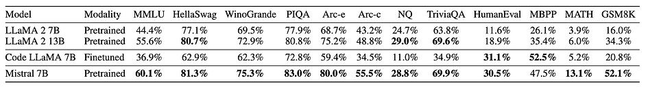
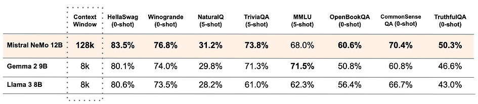
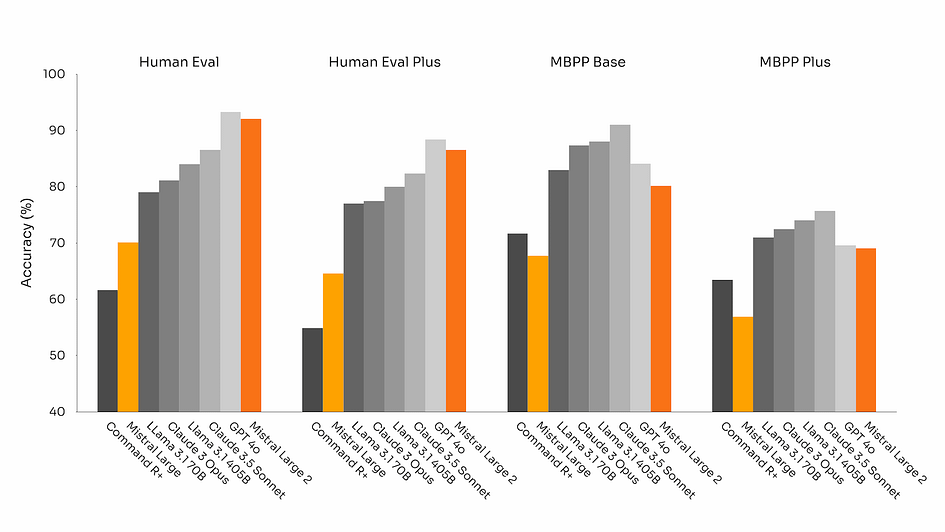
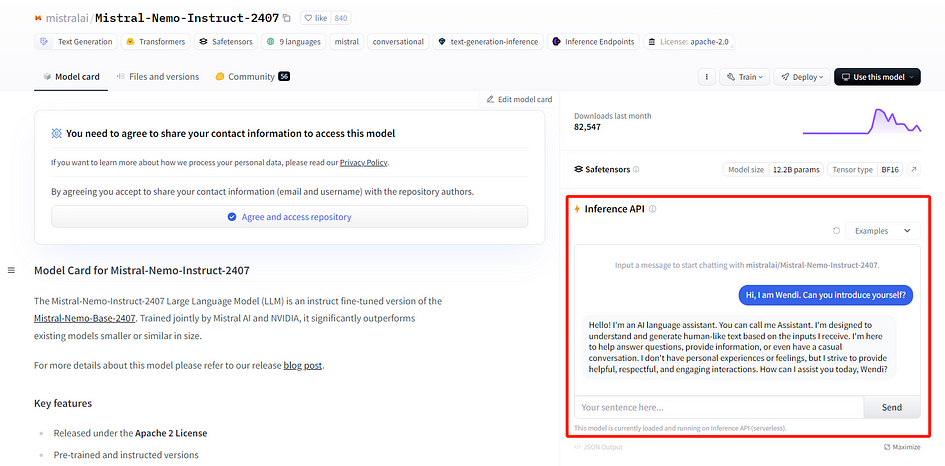
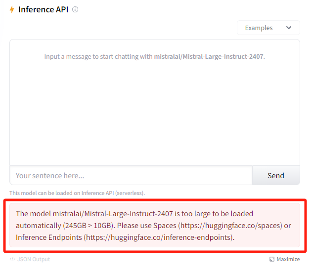
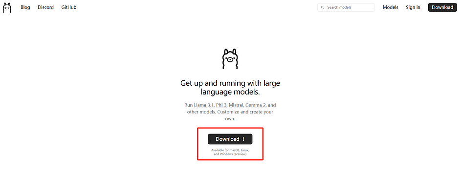
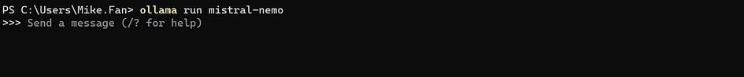
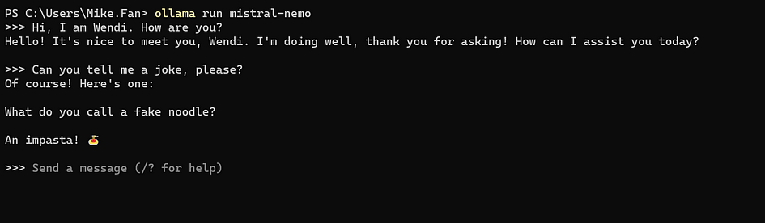
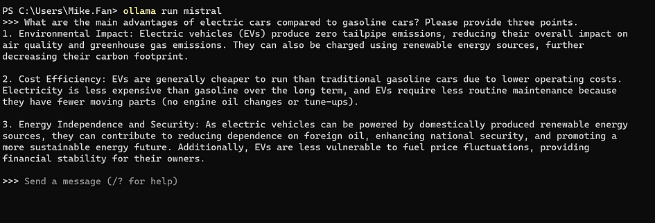
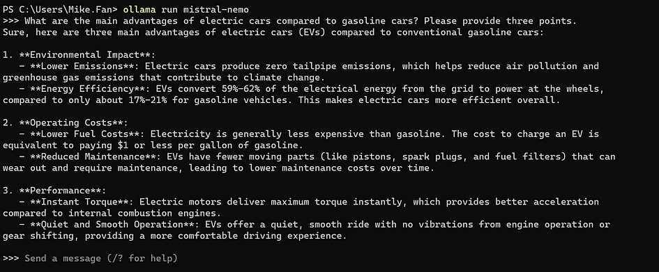

## A Step-by-Step Guide to try Mistral models[](https://medium.com/@researchgraph?source=post_page---byline--5bb63770d985--------------------------------)

<figure>


<figcaption>

Created using DALLE on July 31, 2024

</figcaption>

</figure>

# Introduction

Mistral is an open-source large language model (LLM) series developed by Mistral AI, designed to assist with various natural language processing (NLP) tasks. Mistral is renowned for its transparent, portable, customisable, user-friendly, and cost-effective models, which require less computational power when used on local systems. Several versions of Mistral LLMs have been released, but the most popular and widely used models are Mistral 7B, Mistral NeMo, and Mistral Large. These models are available on the Hugging Face Hub and Ollama platform, making them easy to integrate into your applications or your local systems.

# Different versions of Mistral models

# Mistral 7B

Mistral 7B is one of the best 7B models available today. Developed by Mistral AI and first released in 2023 under the Apache 2.0 license, it can be used without restrictions. Upon its release, Mistral 7B outperformed other 7B models, such as LLaMa 2, in various aspects including MMLU, knowledge, reasoning, and comprehension. The Mistral AI team continues to support and update Mistral 7B, with the latest version being v0.3.

<figure>



<figcaption>

Mistral 7B model performance compared to others, downloaded from Mistral AI hompage on July 31, 2024

</figcaption>

</figure>

# Mistral NeMo

Mistral NeMo is a brand new 12B model developed in collaboration with NVIDIA and released in 2024. It features an extensive context window of up to 128k tokens, providing state-of-the-art reasoning, world knowledge, and coding accuracy for its size category. The accuracy and performance of the Mistral NeMo model surpasses other recent open-source pre-trained models, such as Gemma 2 9B, and Llama 3 8B, in many aspects. Utilising a standard architecture, Mistral NeMo is user-friendly and can serve as a direct replacement for systems currently using Mistral 7B. However, it should be noted that Mistral NeMo requires higher hardware performance compared to Mistral 7B.

<figure>



<figcaption>

Mistral NeMo model performance compared to Gemma 2 9B and Llama 3 8B, downloaded from Mistral AI homepage on July 31, 2024

</figcaption>

</figure>

# Mistral Large

The latest version of Mistral Large is Mistral Large 2, released in 2024. Mistral Large 2 is an incredibly powerful model with a 128k context window and support for dozens of languages, including French, German, Spanish, Italian, Portuguese, Arabic, Hindi, Russian, Chinese, Japanese, and Korean. It also supports over 80 coding languages, including Python, Java, C, C++, JavaScript, and Bash. As shown in the figures below, this model is highly competitive in many aspects compared to its peers. Designed for single-node inference with long-context applications in mind, Mistral Large 2, with its 123 billion parameters, allows for large throughput on a single node.

<figure>



<figcaption>

Mistral Large model performance compared to other peers, downloaded from Mistral AI homepage on July 31, 2024

</figcaption>

</figure>

# Set up Mistral models on your local application or systems

Due to the high hardware performance requirements of running Mistral Large, it is not well-suited for personal computers. Therefore, the subsequent articles on the installation and running tutorials for Mistral models will focus more on Mistral 7B and Mistral NeMo. Currently, the mainstream methods for setting up Mistral models on your local application or systems primarily involve using Hugging Face or Ollama.

# Set up Mistral models using Hugging Face

## Step 1: Find the Mistral models on Hugging Face Hub

Go to the [Hugging Face homepage](https://huggingface.co/), register or sign in to your personal account. Then, click on the **Models** section and search for the Mistral models you need. Below are the links for Mistral 7B, Mistral NeMo, and Mistral Large:

- Mistral 7B: [https://huggingface.co/mistralai/Mistral-7B-Instruct-v0.3](https://huggingface.co/mistralai/Mistral-7B-Instruct-v0.3)

- Mistral NeMo: [https://huggingface.co/mistralai/Mistral-Nemo-Instruct-2407](https://huggingface.co/mistralai/Mistral-Nemo-Instruct-2407)

- Mistral Large: [https://huggingface.co/mistralai/Mistral-Large-Instruct-2407](https://huggingface.co/mistralai/Mistral-Large-Instruct-2407)

Using Hugging Face, you won’t run the Mistral models on your own systems. Therefore, you can test Mistral models, except for Mistral Large, even if you don’t have a high-end PC. Mistral Large is too large to be loaded automatically, even with Hugging Face. You can test the model using the **Inference API** on the website to see if this model meets your needs.

<figure>



<figcaption>

Testing Mistral NeMo on Hugging Face

</figcaption>

</figure>

<figure>



<figcaption>

Mistral Large is too large to be loaded automatically on Hugging Face

</figcaption>

</figure>

# Step 2: Set up Mistral models on your local applications using Hugging Face

Next, you need to create a Hugging Face API token to deploy Mistral models in your applications. I wrote an article before, that provides detailed instructions on how to get API tokens and set up models from Hugging Face for your local applications. You only need to replace the image-to-text model in this article with Mistral 7B or Mistral NeMo models. Check the article link [here](https://medium.com/@researchgraph/how-to-use-hugging-face-api-2942ea9da32a).

# Set up Mistral models using Ollama

Unlike Hugging Face, after setting up Mistral models on your local systems using Ollama, the model will run using your GPU without requiring an internet connection.

## Step 1: Check the hardware requirements

Based on the notes from Ollama, you should have at least 8 GB of RAM available to run the Mistral 7B model, and 16 GB to run the Mistral NeMo model. It is also recommended to have an NVIDIA GPU if you want to use Mistral NeMo, as this model was developed in collaboration with NVIDIA.

## Step 2: Install Ollama

Go to [Ollama homepage](https://ollama.com/) and click **Download**. Then, download the Ollama installer based on the system you use and install it.

<figure>



<figcaption>

Ollama homepage

</figcaption>

</figure>

# Step 3: Set up Mistral models on your local systems using Ollama

Setting up Mistral models on your local systems with Ollama is quite easy, you only need to run the command below to set up Mistral 7B. If you have already downloaded Mistral 7B, it will run immediately. If not, it will download it first and then run it.

```
ollama run mistral
```

Alternatively, you can use the command below to set up Mistral NeMo. However, please note that Mistral NeMo requires better hardware to run than Mistral 7B.

```
ollama run mistral-nemo
```

## Step 4: Test the Mistral models on your local systems

After setting up the Mistral models, you should see the model running in the terminal.

<figure>



<figcaption>

Mistral NeMo is running in the local systems

</figcaption>

</figure>

Feel free to ask your personal AI assistant questions! Here, we use Mistral NeMo as an example.

<figure>



<figcaption>

Tested Mistral NeMo with various questions

</figcaption>

</figure>

# The performance gap between Mistral 7B and Mistral NeMo

Since Mistral 7B has 7 billion parameters and Mistral NeMo has 12 billion parameters, it’s expected that Mistral NeMo performs better and can handle more complex tasks. To illustrate this, we asked both models the same question: “**What are the main advantages of electric cars compared to gasoline cars? Please provide three points.**” As shown in the image below, Mistral NeMo’s response is more detailed, with clearer subpoints and data references, making the result more convincing. However, Mistral 7B’s response is still quite good. Therefore, if you don’t have access to a high-performance computer, Mistral 7B remains a cost-effective choice.

<figure>



<figcaption>

Mistral 7B results

</figcaption>

</figure>

<figure>



<figcaption>

Mistral NeMo results

</figcaption>

</figure>

# Conclusion

Mistral models are highly convenient open-source large language models that support multi-platform usage. You can quickly deploy these models where you need them using Hugging Face or Ollama. By utilising Hugging Face, you can easily integrate Mistral models into your applications. On the other hand, using Ollama allows you to set up AI models running locally. These models are not only easy to deploy but also cost-effective, requiring less computational power, thus making them accessible for a variety of use cases.

# References

- Glover, E. “Mistral AI: What to Know About Europe’s OpenAI Rival.” _Builtin_, 23 Apr. 2024. [Read me](https://builtin.com/articles/mistral-ai). Accessed on 31 July 2024.

- _Ollama Models Webpage — Mistral, Mistral-NeMo, and Mistral Large._ [Read me](https://ollama.com/library).

- Mistral AI team. “Mistral 7B — The best 7B model to date, Apache 2.0.” 27 Sep. 2023. [Read me](https://mistral.ai/news/announcing-mistral-7b/). Accessed on 31 July 2024.

- Mistral AI team. “Mistral NeMo: Our new best small model.” 18 Jul. 2024. [Read me](https://mistral.ai/news/mistral-nemo/). Accessed on 31 July 2024.

- Mistral AI team. “Large Enough” 24 Jul. 2024. [Read me](https://mistral.ai/news/mistral-large-2407/). Accessed on 31 July 2024.
