Transform Your Ideas into High-Traffic Articles with Proven Strategies, Practical Tutorials, and SEO-Optimised Formats

# Authors

- [Zijian Yang](https://www.linkedin.com/in/zijian-yang/) (**ORCID:** [0009-0006-8301-7634](https://orcid.org/0009-0006-8301-7634))

# Introduction

In this tutorial, I will guide you through 8 sections to unveil the essential tools and strategies for content creation, helping you craft high-traffic articles from scratch. Whether you're a novice content creator or an experienced writer looking to enhance your writing and promotion skills, this article offers practical guidance. We will start by delving into the workings and unique appeal of the Medium platform, equipping you with the knowledge to quickly establish your brand presence in this globally renowned content-sharing community.

Next, I will provide an in-depth analysis of three fundamental types of articles—News, Tutorials, and Research & Tech Intro. This will help you understand the characteristics, applications, and topic selection for each style, enabling you to accurately capture the interests of your target audience. Additionally, we'll explore how to utilise diverse information sources to stay updated with the latest industry trends, infusing your content with a continuous stream of inspiration.

Moreover, I will share how to structure an SEO-friendly article, from crafting compelling titles and paragraph organisation to the strategic use of multimedia elements. These techniques will significantly enhance your article's visibility on search engines, ensuring more readers discover your content organically. Finally, I will recommend some efficient tools for creating high-quality images and GIFs, allowing you to present your content visually in a refined and professional manner, making your articles more eye-catching.

By the end of this tutorial, you will not only master a comprehensive set of techniques to boost your article's exposure and readership but also learn how to seamlessly integrate your professional knowledge with practical experience to write content that is both in-depth and capable of attracting substantial traffic. Join me on this journey to start a new chapter of creating impactful articles on Medium!

# What is Medium

Medium is a modern online platform for publishing articles and blogs, designed to provide a high-quality content-sharing community for creators and technology enthusiasts worldwide. Whether you're a developer, designer, or product manager, Medium helps you easily publish technical articles, share project experiences, and discuss industry trends. Below, we'll explore the core features and advantages of Medium from various perspectives.

## 1\. Platform Interface and Content Display

a. Home Feed

The left side of Medium's interface displays a list of articles intelligently recommended based on the user's reading history, interests, and interaction behavior. This feed not only helps users quickly capture trending technology topics but also enhances user engagement through precise content recommendations, forming a content ecosystem.

b. Article Display Page

Upon clicking into an article, users encounter a clean and intuitive page design, highlighted by the following elements:

- **Title and Subtitle**: The main title attracts users to click, while the subtitle provides additional background information, allowing readers to quickly grasp the article's theme.

- **Cover Image**: A high-quality cover image is not only aesthetically pleasing but also stands out on the homepage and article list, directly influencing click-through rates.

- **Body Content**: The body area is meticulously formatted to support code blocks, quotes, lists, and various other formats, making it particularly suitable for technical blogs.

- **Interaction Area**: The bottom of the page features a comment section for readers to exchange insights and supports real-time interaction.

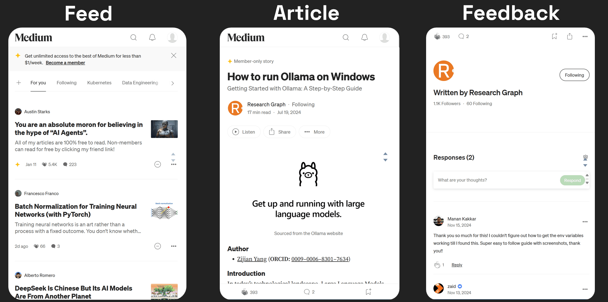

## 2\. Interaction Features and User Engagement

Medium's interaction mechanisms encourage exchanges between readers and authors, fostering an active community atmosphere:

- **Clap Feature**: Users can give up to 50 claps to articles they appreciate. This design allows readers to express their feelings more subtly and provides content creators with a quantifiable measure of popularity. While the number of claps doesn't fully reflect an article's depth and technical content, it remains an important indicator of immediate user response.

- **Comment System**: Through the comment section, technical blog authors can receive feedback from peers or readers, adjust their content timely, and even spark deeper technical discussions. This interaction not only boosts the article's visibility but also helps authors build professional influence.

## 3\. Article Structure and Optimisation Tips

On Medium, each article typically consists of the following components, whose optimisation is crucial for effective dissemination:

- **Title and Subtitle**
    - **Title**: Should be concise and clear, highlighting the article’s core technical aspect or innovation, and piquing readers' curiosity.
    
    - **Subtitle**: Provides additional context, offers background information, or previews the value points of the article, helping readers quickly identify the theme.

- **Cover Image**: The cover image is not only used to grab attention but also plays a key role in various display scenarios. For technical blogs, consider using technical illustrations, flowcharts, or project screenshots related to the content, ensuring the image aligns closely with the article's theme.

- **Body Content:** A clear structure and logical coherence are the soul of a technical blog. It's advisable to use distinct paragraphs, code examples, charts, and quotes to enhance readability and reference value. Additionally, embedding links and references appropriately can improve the article's SEO friendliness and professionalism.

## 4\. Data Metrics and Content Evaluation

Medium provides a comprehensive set of backend data metrics to help authors optimise content strategy from a data perspective:

- **Views:** This metric counts the total number of people who clicked and opened the article, reflecting its overall exposure. For technical blogs, a high view count often indicates a high level of interest in the topic or an attractive title.

- **Reads**: A read is counted only when a reader spends more than 30 seconds on the article. This metric more accurately reflects the content's appeal and depth, especially for long technical articles, effectively assessing whether readers are truly engaged.

- **Read Ratio:** This ratio shows the percentage of users who completed reading the article compared to those who viewed it, serving as an important parameter for evaluating article quality. Technical authors can improve the read ratio by optimising the article's structure and content arrangement, thereby enhancing the reader experience.

It's important to note that while these data metrics provide a basis for quantitative analysis, no single metric can comprehensively evaluate the quality of an article. High views don't necessarily mean high technical depth, and low reads don't imply poor content quality. What truly matters is continuously optimising content and format to attract and retain the target audience.

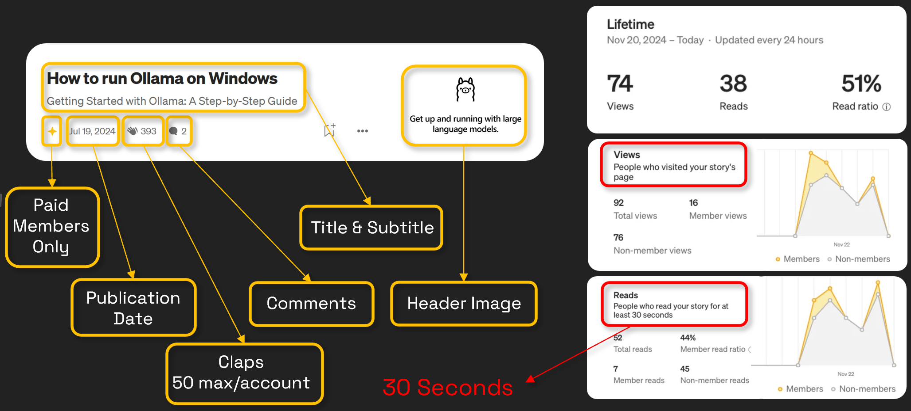

# What You'll Learn From Writing

Writing AI-related articles not only drives traffic but also serves as a process of self-improvement and professional development. Each writing endeavour is a deep dive into cutting-edge technology. By organising and sharing knowledge, we not only reinforce theoretical understanding but also identify areas for improvement through practice, thereby enhancing our skills. Utilising methods like the Feynman Technique, we can deconstruct and reorganise complex concepts, expressing them in a more intuitive manner. This process is both a relearning of knowledge and an optimisation of our cognitive approach.

More importantly, every article published opens a window for interaction with readers. When thousands of views and feedback culminate in affirmation, the sense of achievement motivates us to continuously pursue higher professional standards, creating a positive feedback loop where output drives further input. Thus, writing becomes not just a means of sharing knowledge but also a crucial way to foster personal growth and advance in technology.

# Audience

Based on our article data from last year, the majority of our readership comes from Google search engine traffic, indicating that users are actively seeking out specific topics when they land on our articles. Our audience is quite diverse, with many readers lacking a background in computer science or AI. This scenario necessitates a focus on clarity and accessibility in our technical writing, ensuring that the content is both accurate and broadly applicable.

To achieve this, it is advisable to avoid overly complex expressions and obscure technical jargon in the writing process. When dealing with specific terms, abbreviations, or complex concepts, providing clear and concise explanations and background information not only enhances the readability of the article but also benefits more non-specialist readers, thereby expanding the reach and impact of the content.

# Topic Selection Tools: SEO-Oriented Topic Selection

Choosing a compelling title and topic is often a shortcut to an article's popularity and a crucial step that requires careful consideration. An engaging title can directly increase the article's viewership and lay a solid foundation for subsequent content creation and dissemination. During the content creation process, using SEO tools for preliminary topic selection and keyword analysis is key to ensuring the article achieves good search rankings and high exposure. Below are some commonly used topic selection tools that assist in uncovering trending topics, optimising titles, and adjusting content strategies from various perspectives.

## Google Trends

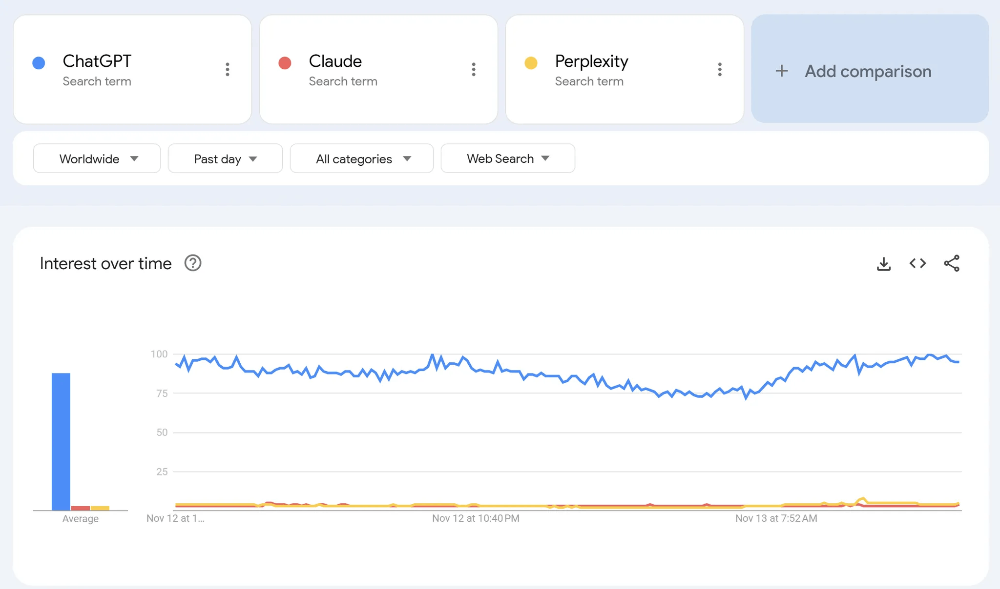

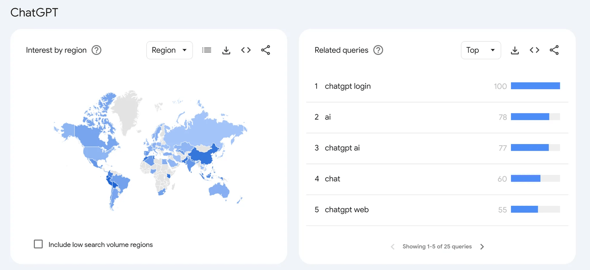

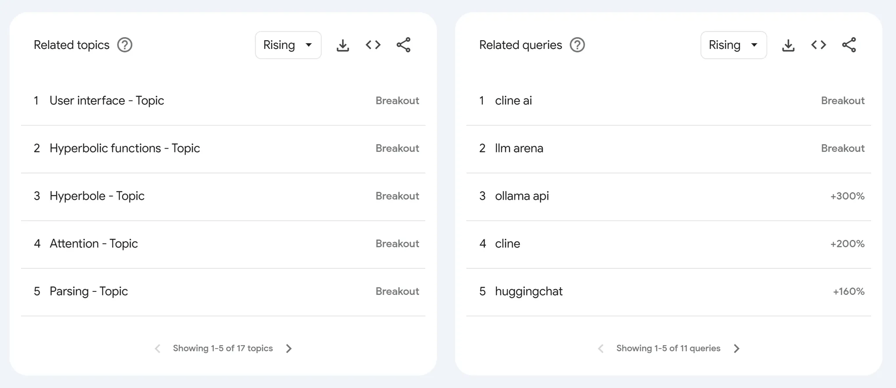

Google Trends is a free tool provided by Google that displays the changes in search frequency for specific terms over different periods. It helps users understand the popularity of various keywords worldwide and supports comparative analysis by region, time, and related search terms, making it highly beneficial for market research, content creation, and SEO optimisation.

- **Product Trends and Cycle Analysis**: By selecting data from the past month, 12 months, or the past 5 years, you can visually observe whether the interest in a product or topic is rising or declining. This is extremely helpful for product selection and determining content direction.

- **Keyword Popularity Comparison**: Google Trends allows you to input up to five keywords for comparison, helping you understand the search volume differences between different keywords and identify topics with high volume but moderate competition.

- **Regional Popularity Analysis**: The tool also shows the search popularity of keywords in different regions, helping you determine if a topic has regional influence, thereby allowing you to more accurately target your audience.

Using Google Trends, you can stay updated with trending search topics and keyword trends, providing data support for content creation and helping you identify which topics are most likely to capture user interest.

## Sermush

Sermush is a tool focused on keyword analysis, offering features such as displaying search volume, keyword difficulty, competitive advertising costs (CPC), potential traffic (Opportunity), and commercial intent. It also helps identify keyword gaps with competitors, providing strategic suggestions for content optimisation.

- **Keyword Analysis**: By examining the search volume and difficulty of keywords, you can quickly assess which keywords are highly competitive and which are suitable for a long-tail keyword strategy.

- **Strategy Adjustment**: Based on the commercial intent and potential traffic data of keywords, you can adjust optimisation goals appropriately. For high-difficulty keywords, adopt a long-tail optimisation strategy, while for medium to low-difficulty keywords, delve deeper to achieve better rankings and traffic.

- **Competitor Comparison**: Sermush can also help you understand how competitors perform on certain keywords, allowing you to identify content gaps and develop more targeted optimisation strategies.

Using Sermush enables you to precisely understand the competitive landscape of keywords, helping you consider both user search volume and competitive pressure when selecting topics, and to develop more advantageous content strategies.

## AnswerThePublic

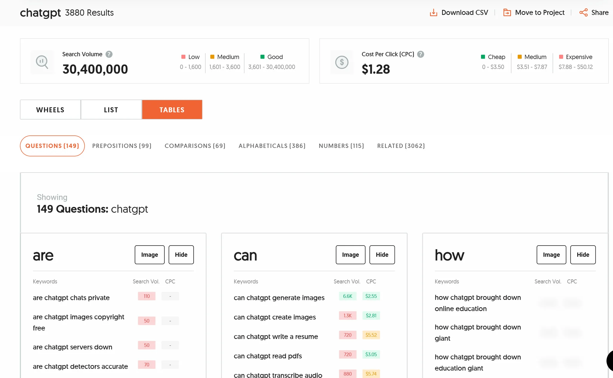

AnswerThePublic is a tool that helps users understand the questions and intentions of search engine users. By analysing auto-suggest results from Google and Bing, it generates various questions, phrases, and search suggestions related to specific keywords, providing a rich source of inspiration for content creation and SEO optimisation.

- **User Query Analysis**: This tool aggregates potential questions users might ask when searching for a keyword, offering clear entry points and focal points of interest for your articles.

- **Phrase and Long-Tail Keyword Generation**: AnswerThePublic can help expand your keyword library by generating more long-tail keywords and related phrases, aligning content better with user search habits and improving search rankings.

- **Content Creation Insights**: By organising user queries, you can understand the real needs of your target audience, allowing you to develop content and marketing strategies that better meet user demands.

Using AnswerThePublic, you can gain a deeper understanding of user search intent and uncover numerous potential topic points, providing rich material and direction for subsequent content creation.

Overall, these topic selection tools help you understand market trends, analyse keywords, and capture user needs from different dimensions, making them indispensable for SEO topic selection. By effectively utilising Google Trends, Sermush, and AnswerThePublic, you can thoroughly prepare for topic selection and title writing, attracting more target traffic to your articles and standing out in the competitive content landscape.

# Three Recommended Article Genres

In content creation, I categorise articles into two main directions: **what** and **how**, further divided into three specific genres: **News**, **Tutorials**, and **Research & Tech Intro**. It's important to note that these genres are not strictly separated and can indeed intersect and blend. This classification serves merely as a preliminary guide to help you better conceptualise your article framework, rather than restrict your writing. Let's explore the characteristics and writing requirements of the **News** genre as an example.

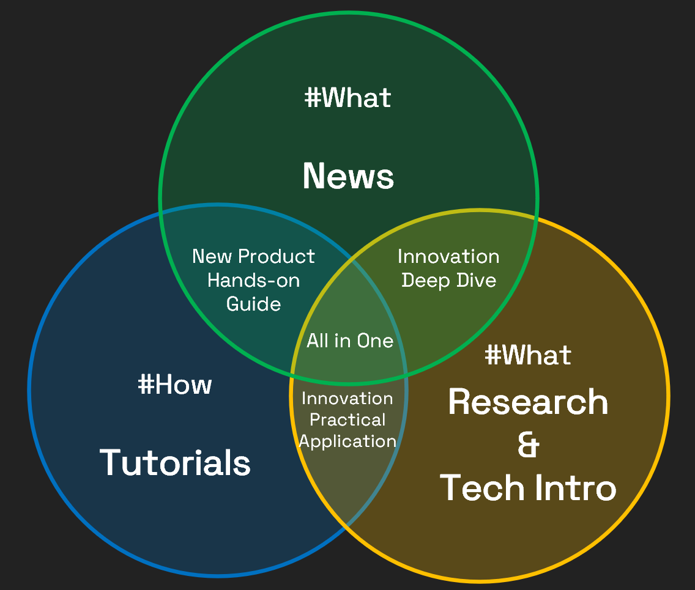

## News Articles

**News** articles focus on reporting the hottest and latest AI topics. When writing, you need to choose themes that captivate readers and help them quickly grasp developments in AI. These articles typically spotlight newly released models, products, or breakthrough technologies, with a core emphasis on being "new" and "attention-grabbing." For instance, a news article about new technology might feature titles like:

- _Google Just Dethroned ChatGPT with Gemini 2.0_

- _Sky-T1–32B-Preview: Open-Sourced LLM Outperforms OpenAI-o1_

- _#DailyNews 1 — Codestral: Coding with Mistral’s New AI Model_

- _ByteDance Released An Open-Source Lip Sync AI Model_

- _Microsoft Phi-4: A Small LLM in Complex Reasoning, Outperforming Qwen 2.5–14B and Performance Overview_

These titles focus on newly launched models or technological products, directly conveying the latest, cutting-edge information. To ensure content is engaging and unique, consider the following points during writing:

- **Attributes and Keywords**: The article should reflect characteristics like Latest, Trending, Cutting-edge, SOTA (State-of-the-Art), Game-changing, and Influential. Choose directions like News, Innovation, Product, Models, Technologies, and Findings.

- **Perspective and Angle**: Although news articles often have simple frameworks and high homogeneity, maintaining originality and finding a unique angle is crucial. Avoid merely replicating content from other articles; instead, infuse your distinct insights.

- **Clear Structure**: Excellent news articles typically have clear and concise titles and outlines, allowing readers to quickly grasp the main content from the title alone. For example, the following outline examples demonstrate how to construct a clearly structured news article:

- **Example 1: _Google Just Dethroned ChatGPT with Gemini 2.0_**
    
    1. Live Code TutoringAI Research AssistantInteractive MixologyReal-Time Piano InstructionSmart Kitchen AssistantInteractive Gaming CompanionLaundry Care GuidanceContextual MemoryUniversal Language SupportLooking Ahead
    
    **Example 2: _Sky-T1–32B-Preview: Open-Sourced LLM Outperforms OpenAI-o1_**

Such outlines not only make the article content clear but also enhance the reading experience, helping the article stand out among numerous news pieces.

In summary, News articles are a writing direction that tests both your ability to keenly capture industry trends and your capacity for original thought and expression. Whether reporting on the latest products, models, or technological breakthroughs, it is essential to inject personal unique perspectives while ensuring information is accurate and timely, forming a distinctive and in-depth reporting style. This approach not only satisfies readers' demands for fresh news but also helps establish your unique brand in the competitive content landscape.

## Tutorials

Tutorials are the most important type of article in the entire content system. Here, I will explain the characteristics and writing methods of this genre in detail. Below are some excellent tutorial articles I have created in the past for reference:

- **How to Run Ollama on Windows**

- **How to Run Llama 3.2 on Android Phone**

- **How to Install and Use DeepSeek R-1 on Your Local PC**

- **How to Use Deep Live Cam for Real-Time Face Swap and One-Click Video Deepfake with a Single Image**

- **The Ultimate FLUX.1 Hands-On Guide**

- **Local RAG From Scratch**

Excellent tutorial articles should have the following attributes:

- **Hands-on & Step-by-Step**: Each step is presented in detail, from initial installation to final debugging.

- **Practical & Real Experience**: The content must be based on real operational experience; only through personal practice can you write a convincing tutorial.

- **Detailed & DIY**: Provide detailed instructions for each step, enabling readers to start from scratch and practice on their own.

- **Original & Truly Helpful**: Maintain originality and offer genuinely useful solutions, rather than simply replicating existing content.

- **Well-Researched & Meaningful**: Ensure that the article is thoroughly researched in terms of content and logic, guaranteeing the accuracy and practicality of the information.

Based on past experience, tutorial articles often achieve higher readership but also entail higher creation costs. These articles not only require a topic with practical application value but also demand very detailed operational steps and guidance, ensuring each step has been personally verified. For instance, in my previous FLUX.1 tutorial, the article began with links to free experience sites to attract users to access resources. Each phase had distinct, independent headings, allowing readers to easily find the content they need by chapter. Any code sections must provide ready-to-use code, placed within Markdown code blocks. Operational steps can be listed using bullet points or numbered sequences. If any issues arise during testing, it's important to document the error phenomena and solutions to help readers avoid similar problems. Screenshots are also indispensable as auxiliary tools, requiring clarity and marked with arrows or boxes to highlight key points, facilitating quick understanding and imitation by readers.

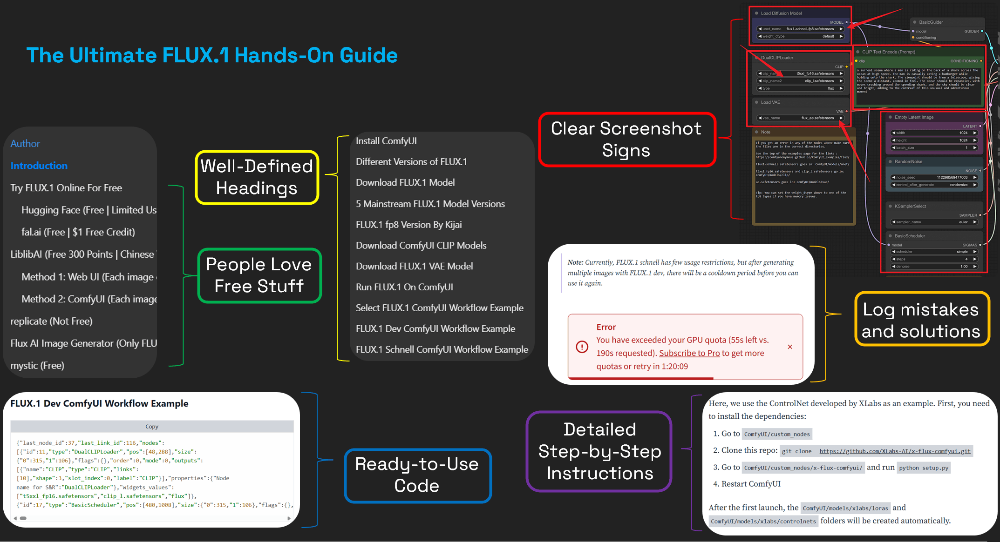

Here are some tips I've gathered to help you create high-quality tutorials:

- **Preparation**: Before you start, document the entire process. Conduct thorough preliminary research to ensure a clear understanding of the subject and gather enough information. This groundwork allows you to create a high-quality, unique tutorial that may surpass existing ones.

- **Detailed Documentation**: During the actual process, record every step (whether through screenshots, GIFs, or detailed descriptions) to help you recall and organise when writing the tutorial.

- **User-Friendliness**: Always prioritise the reader's convenience. When explaining steps and options, not only describe your choices but also provide alternative methods, helping readers understand different approaches and select the one that best suits them.

- **Explain Each Step**: Offer clear explanations for each step, detailing its purpose and impact. This helps build trust with readers and aids their understanding of why each step is necessary.

- **Targeted Navigation**: For lengthy tutorials, consider guiding readers to relevant sections based on their needs, helping them efficiently find the information they require. Strive to provide maximum convenience and service while being as thorough as possible.

Additionally, I'd like to share a story about finding a unique angle. Once, a classmate and I both wrote articles about Llama 3.2. She chose a news report approach, gaining an advantage in terms of trending topics. To avoid repetition and still gain attention, I focused on Llama 3.2's compatibility with edge devices, writing a tutorial on running it on a mobile phone. That week, my article received more views. This demonstrates that finding an innovative and unique angle can significantly enhance an article's impact.

In conclusion, the essence of tutorial articles is to "get hands dirty"—only through personal practice, meticulous documentation, and continuous refinement can you provide readers with a truly original, meaningful tutorial that helps solve real-world problems.

## Research & Tech Intro

Research & Tech Introduction articles cover a broad scope, focusing on in-depth analysis and introduction of research and technology. Unlike news articles that chase the latest updates, these articles emphasise depth, principle analysis, and building a knowledge framework. In other words, they are like an exploration into the world of technology, offering insights through paper analysis, principle discussions, and method comparisons, helping readers build a solid knowledge base.

In this category, you can write about technical principles, research methods, and paper interpretations, rather than simply reporting the latest developments. For example, you might choose to interpret a paper, exploring its innovations and limitations; compare current technological methods, discussing their pros and cons and applicable scenarios; or showcase the entire process from theory to practical application through case studies. Here are some example article titles illustrating the diversity and depth of this genre:

- _DeepSeek-R1 Paper Explained—A New RL LLMs Era in AI?_

- _The Limitations of Cosine Similarity and the Case for Knowledge Graphs in AI_

- _Automated Knowledge Graph Construction with Large Language Models_

- _The GAN is Dead; Long Live the GAN! A Modern GAN Baseline_

- _DeepSeekMoE: MoE with Segmented and Shared Experts_

- _KAG: A Better Alternative to RAG for Domain-Specific Knowledge Applications_

- _What is LLMLingua?_

- _12 NotebookLM Hacks That Will Change Your Life_

These articles go beyond merely conveying "who released what" by revealing the underlying technical logic, design thinking, and potential issues through in-depth analysis. Typically, these articles include the following aspects:

- **Theoretical Analysis and Background Introduction**: Provide a detailed introduction to the theoretical foundations, development history, and existing problems of the related technology or research, helping readers understand the field fundamentally.

- **Data Support and Case Analysis**: Use experimental data, real cases, or charts to quantitatively analyse the technology, verifying its effectiveness and limitations.

- **Comparative Discussion and Evaluation**: Compare the current technology with other solutions, discussing its strengths and weaknesses, providing readers with a comprehensive, objective perspective.

- **Future Trends and Insights**: Discuss potential future developments and areas for improvement in technology, inspiring further reflection among readers in light of current research dynamics.

In summary, Research & Tech Introduction articles aim to provide readers with a systematic, in-depth, and thoughtful technical analysis. They are suitable for readers with a certain technical background and help cross-disciplinary learners establish a basic understanding of complex technical issues. Writing such articles requires the author to have a solid theoretical foundation and keen analytical skills, while ensuring clarity and coherence in expression to truly achieve the goals of "imparting knowledge, teaching skills, and solving doubts."

# Sources of Information & Promotion

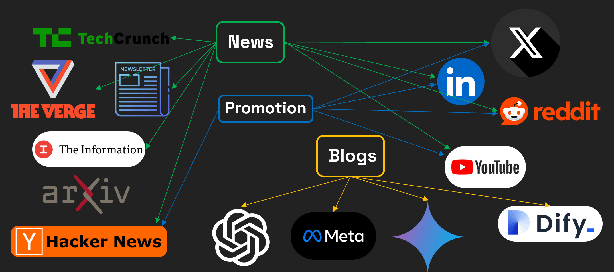

In the rapidly evolving field of artificial intelligence, staying attuned to the latest developments is crucial. At the same time, effectively promoting quality content to your target audience is key to building a personal brand and professional influence. This article will introduce some common and practical channels and strategies from the perspectives of information acquisition and content promotion.

First, in terms of information sources, the following types of channels can help you stay at the forefront of the industry:

- **News Media**: Renowned tech media outlets such as TechCrunch, The Verge, and The Information focus on reporting the latest technology trends and market dynamics. These platforms not only provide authoritative information but also often include in-depth analysis and commentary, helping you comprehensively understand the trajectory of technological evolution.

- **Social Media Platforms**: Platforms like X (formerly Twitter) are among the fastest channels for information dissemination. Here, you can follow renowned experts, research institutions, and tech companies in the AI field to quickly capture first-hand information. Additionally, these platforms are excellent venues for promoting articles, as sharing, commenting, and engaging can rapidly amplify your content's impact.

- **Professional Forums and Communities**: Platforms such as Hacker News, LinkedIn, and Reddit gather numerous tech professionals and enthusiasts. These are not only ideal places for discussing technical issues but also treasure troves for discovering industry hot topics and cutting-edge viewpoints. By participating in discussions and sharing experiences, you can gain inspiration and attract more professional readers to your articles.

- **Newsletters and Official Blogs**: Many leading tech companies (such as OpenAI, Meta, etc.) publish their latest research findings and product developments in official blogs and subscription emails. Subscribing to these resources allows you to access the most authoritative information promptly, providing solid data support and background material for your content creation.

While effectively acquiring information, promoting your articles is equally important. Utilising the aforementioned platforms, you can build an efficient network for information dissemination and content promotion. Here are some promotional strategy suggestions:

- **Social Platform Sharing**: Share article links on platforms like X and LinkedIn, using trending topic tags to enhance exposure. Also, participate in relevant field discussions to expand your readership through community engagement.

- **Community Interaction**: Post article summaries or related discussion threads in technical communities like Hacker News and Reddit, inviting professionals to share insights. Interaction enhances the article’s authority and credibility.

- **Official Channel Monitoring**: Closely follow the blogs and newsletters of major tech giants. Use their latest developments as content references and timely share your perspectives and interpretations. This not only demonstrates professionalism but also adds topicality to your articles.

In conclusion, establishing a comprehensive information acquisition and promotion system allows you to remain at the forefront of technology while ensuring that your quality content reaches more target readers. By integrating news media, social platforms, professional communities, and official resources, you will be able to quickly capture the latest developments and use diverse promotional methods to achieve both knowledge sharing and personal brand enhancement.

# SEO-Friendly Format

In addition to high-quality content, the format of an article plays a crucial role in Search Engine Optimisation (SEO). Considering that most readership comes from search engines, a carefully designed format can significantly enhance an article's ranking in search results, thereby increasing its visibility and click-through rate. Here are some key SEO optimisation techniques to help you balance content quality and format optimisation when writing tech blogs.

Firstly, the **title** of the article needs to be concise and clear, accurately reflecting the theme while skillfully incorporating primary keywords. A well-optimised title can attract readers' clicks and make it easier for search engines to capture the core information of the article.

Next, use a logical **subheading** structure (such as H2, H3) to segment the article content, which not only facilitates quick browsing for readers but also enhances SEO effects. It is advisable to embed relevant keywords in subheadings, but ensure the hierarchy is not too deep, usually staying within the range of H2 to H3.

In the main body, it is recommended to keep **paragraphs short** and express ideas with clear and concise sentences, avoiding overly complex sentence structures. For uncommon abbreviations or technical terms, be sure to provide the full name and a brief explanation to ensure that readers of all levels can quickly understand the content. The introduction should clearly inform readers of the benefits they can gain from the article, forming a clear guide.

Moreover, using **bullet points or numbers** to list key points can help readers quickly capture the main information while also aiding search engines in parsing the article's structure. Multimedia elements should not be overlooked: inserting relevant images (with descriptive alt tags), embedding videos, or charts can not only enrich the content format but also extend readers' engagement time, thereby enhancing SEO performance.

To further enhance the article's authority and credibility, appropriately include **external links** to authoritative resources. However, be mindful not to include too many links to avoid distracting readers.

Lastly, the conclusion should provide a concise summary of the core points to reinforce the reader's understanding. Proper use of tags and categories can help search engines better comprehend the article’s theme and make the content easier for target readers to discover.

In summary, here are the key points for enhancing an article's SEO friendliness:

1. **Title Optimisation**
    - **Concise and Clear**: Directly reflect the article's content and attract reader clicks.
    
    - **Keyword Integration**: Skillfully incorporate primary keywords to improve search engine rankings.

3. **Use of Clear Subheadings**
    - **Distinct Hierarchy**: Use H2, H3, etc., to divide content, facilitating quick browsing.
    
    - **Keyword Placement**: Embed related keywords in subheadings, but limit depth (suggest not exceeding H4).

5. **Paragraph and Sentence Optimisation**
    - **Short Paragraphs**: Avoid lengthy paragraphs to enhance overall readability.
    
    - **Clear Sentences**: Use straightforward sentence structures to reduce complexity.
    
    - **Term Explanation**: Provide full names and brief explanations for uncommon terms.
    
    - **Clear Introduction**: Clearly state the main benefits of the article at the beginning.

7. **Lists and Key Points**
    - **Use Bullet Points or Numbers**: Highlight key points to help readers quickly grasp information.

9. **Use of Multimedia Elements**
    - **Insert Images**: Enhance visual appeal with relevant images and alt tags.
    
    - **Embed Videos or Charts**: Enrich content formats and increase user engagement time.

11. **Appropriate Use of External Links**
    - **Cite Authoritative Resources**: Enhance credibility, but avoid excessive links that may disrupt the reading experience.

13. **Conclusion Summary**
    - **Summarise Key Points**: Recap core content at the end to reinforce reader impressions.

15. **Tags and Categories**
    - **Appropriate Tagging**: Add relevant tags and categories to help readers find content, enhancing visibility.

By applying these optimisation techniques, you can not only improve your article’s ranking in search engines but also provide readers with clear, readable, and well-structured content, thereby enhancing the overall reading experience. Adhering to a good SEO-friendly format is undoubtedly an important strategy for boosting the influence and exposure of tech blogs.

# GIF & Image Tools

When creating tutorials and demonstration documents, dynamic images and screenshots often convey operational details and concepts more intuitively. For this purpose, I frequently use specialised tools to record and edit GIFs, capture screenshots, and compress and annotate images. These tools not only enhance my work efficiency but also make the tutorial content easier to understand and share. Here are some of the tools I commonly use:

## GIF Creation Tool

- **ScreenToGif**: This is a powerful screen recording tool that can directly record screen operations into GIF animations. It comes with a built-in editor, allowing you to trim the recording, add text annotations, and adjust the frame rate, making it ideal for creating detailed demonstration effects.

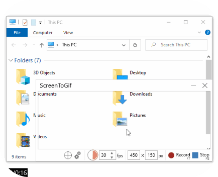

- **LICEcap**: LICEcap offers a simple and intuitive recording interface, perfect for quickly capturing screen operations and generating GIFs. Although its features are basic, its ease of use and efficiency make it an ideal choice for quick recordings and sharing.

## Screenshot and Annotation Tool

- **Snipaste**: Snipaste allows for quick screen capturing and supports annotating, doodling, and pinning images. Its convenient and flexible operation helps you highlight key steps and important content swiftly, making tutorials more intuitive and easier to understand.

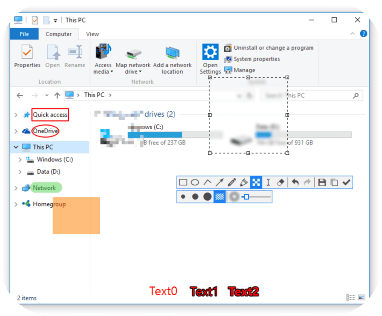

## Image Compression Tools

- **TinyPNG**: TinyPNG is a very popular online image compression tool, primarily for PNG and JPEG formats. It significantly reduces file size while maintaining high image quality, and optimising webpage loading speed, making it an excellent choice for image compression.

- **Imagine**: Imagine offers image compression and format conversion capabilities, allowing for quick optimisation of images. This tool is particularly useful in scenarios where reducing image size while maintaining quality is essential.

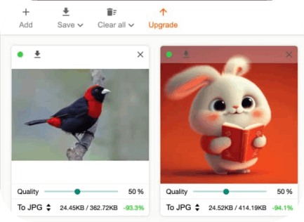

- **Ezgif.com**: Ezgif.com is a one-stop GIF processing platform that supports not only GIF compression but also cropping, conversion, optimisation, and adding special effects. It is suitable for multi-step processing of GIFs to meet various customisation needs.

It should be noted that most of the tools mentioned above are primarily for use on Windows platforms. Mac users may need to find corresponding alternative tools. However, there are many similar tools available on the market, and each platform generally has comparable solutions. I hope these recommendations will provide practical assistance in creating tutorials and demonstration materials, making your content more interactive and intuitive.

# **Conclusion**

This guide provides a comprehensive overview of how to create high-quality AI articles on Medium, covering everything from platform introduction, article genres, information sources, and SEO optimisation to auxiliary topic selection tools and multimedia production. Each section offers practical strategies and tool support. We explored three article genres—News, Tutorials, and Research & Tech Intro—to help you choose the right expression based on your target audience and content characteristics. Additionally, by analysing tools like Google Trends, Sermrush, and AnswerThePublic, you can do thorough research on topics and title writing to effectively enhance your article's search ranking and exposure.

Writing is not only a means of content output but also a path for personal growth and skill enhancement. Whether you are a novice or an experienced creator, through hands-on practice, meticulous documentation, and continuous content optimisation, you can accumulate experience, build a personal brand, and stand out in the competitive content landscape. I hope this guide provides inspiration and guidance for your content creation, helping you craft high-quality AI articles on Medium that are both professionally deep and easy to understand.

> _For Medium-version of this article, please visit this [link](https://www.youtube.com/watch?v=KcxKVqQaUYU)_
