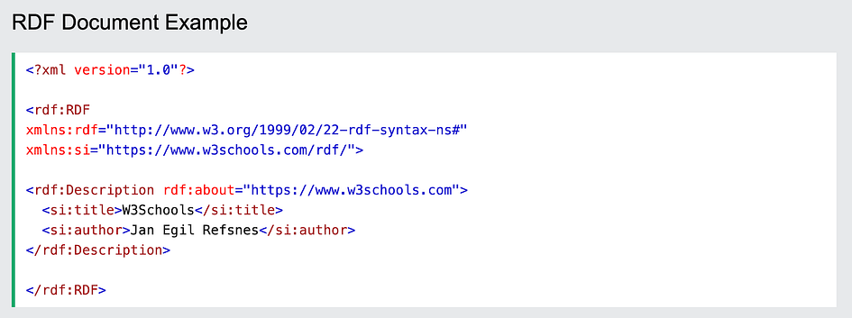

## An Overview of Constructing a Knowledge Graph

<figure>

<figcaption>

Image Created in [https://www.mage.space/](https://www.mage.space/)

</figcaption>

</figure>

# Author

· Qingqin Fang (**ORCID:** [0009–0003–5348–4264](https://orcid.org/0009-0003-5348-4264))

# 1\. Introduction

## 1.1 What is a Knowledge Graph

Knowledge Graphs are structured semantic knowledge bases used to rapidly describe concepts and their relationships in the physical world. By aggregating information, data, and linkages from the web, Knowledge Graphs make information resources more computable, understandable, and evaluable, enabling swift responses and inferences of knowledge.

In a knowledge graph, **nodes** represent **entities** in the real world, such as people, places, events, concepts, etc., while **edges** represent **relationships** between entities. By connecting nodes and edges, knowledge graphs can present rich semantic information and knowledge associations, helping computer systems better understand and infer knowledge. The basic unit of a knowledge graph is the **triplet** of “**Entity-Relationship-Entity**”, which is also the core of a knowledge graph.

## 1\. 2 Applications of Knowledge Graphs

The construction of knowledge graphs can be achieved through manual construction, automated extraction, and knowledge base integration. So far, knowledge graphs have a wide range of applications in various fields, in the search domain, [Google Search](https://support.google.com/knowledgepanel/answer/9787176?hl=en) and [Baidu Search](https://ai.baidu.com/broad/introduction?dataset=kg) utilize knowledge graphs to enhance the quality of search results. In the social domain, the [LinkedIn Economic Graph](https://economicgraph.linkedin.com/) depicts the professional relationship network. In the medical field, [IBM Watson for Oncology](https://www.ibm.com/watson?utm_content=SRCWW&p1=Search&p4=43700077679686292&p5=p&gad_source=1&gclid=CjwKCAjwzN-vBhAkEiwAYiO7oGWXmY0lMnDLacvFArGx5mVBuO_fA1543ZOys4D1XvlB5VTnJPCvmBoCu8MQAvD_BwE&gclsrc=aw.ds) assists in formulating cancer treatment plans. In industrial manufacturing, [Siemens Industrial Knowledge Graph](https://www.siemens.com/global/en/company/stories/research-technologies/artificial-intelligence/artificial-intelligence-industrial-knowledge-graph.html) supports product design, production, and manufacturing processes. They provide rich semantic information and knowledge background for computer systems, helping to improve their intelligence and semantic understanding capabilities.

# 2\. Data and Storage

The type and storage of data play a crucial role in the process of constructing a knowledge graph. Based on the content of this article, we can further explore how to effectively handle different types of data and choose appropriate storage methods to build a knowledge graph.

Generally speaking, there are three types of original data in the knowledge map (also three types of original data on the Internet):

- **Structured Data**, such as relational databases and linked data

- **Semi-Structured Data**, such as XML, JSON, Encyclopedia

- **Unstructured data**, such as images, audio, and videos

How do we store the three types of data mentioned above? Generally, there are two options:

Firstly, storage can be done through standardized storage formats such as [**RDF** (Resource Description Framework)](https://en.wikipedia.org/wiki/Resource_Description_Framework), which is a directed graph composed of triple statements written in XML. Commonly used tools for working with RDF include the [Jena API](https://en.wikipedia.org/wiki/Apache_Jena).

<figure>

<figcaption>

Example RDF Code provided by W3CSchools, Link: [https://www.w3schools.com/xml/xml\_rdf.asp](https://www.w3schools.com/xml/xml_rdf.asp).

</figcaption>

</figure>

In this example, the RDF description specifies information about the resource identified by the URI “https://www.w3schools.com". Within this description, two properties are defined: “si:title” with the value “W3Schools” and “si:author” with the value “Jan Egil Refsnes”. Each property-value pair forms an RDF statement or triple, consisting of a subject, predicate, and object. In this case, the subject is the resource itself, and the predicates are the properties “si:title” and “si:author”, with their respective values as objects.

Another method is to use **graph databases** for storage, commonly used methods include Neo4j.

<figure>

<figcaption>

Example Neo4j graph of network management, Link: [https://github.com/neo4j-graph-examples/network-management](https://github.com/neo4j-graph-examples/network-management).

</figcaption>

</figure>

This network management example utilizes the Neo4j graph database to model network endpoints in data centers, including servers, routers, firewalls, racks, and other devices, as nodes, and represents their interconnections as relationships. In doing so, it enables the analysis of dependencies among network devices and the identification of root causes, facilitating more effective network and IT management.

Effectively handling different types of data and selecting appropriate storage methods are key steps in building a high-quality knowledge graph. By transforming structured, semi-structured, and unstructured data into the form of a knowledge graph, intelligent data utilization and deep knowledge discovery can be achieved, providing robust support and advancement for applications in various fields.

# 3\. General Knowledge Graph Construction

Constructing a knowledge graph is an iterative updating process. According to the logic of knowledge acquisition, each iteration consists of three stages:

- **Knowledge Acquisition**: Extracting triplets of “**Entity-Relationship-Entity**” from various data sources to capture entities, attributes, and the relationships between them. This process forms a structured representation of knowledge based on the extracted information.

- **Knowledge Refinement**: After obtaining new knowledge, it needs to be integrated to eliminate contradictions and ambiguities. For example, some entities may have multiple representations, and a specific term may correspond to multiple different entities.

- **Knowledge Evolution**: The fused new knowledge after refinement, needs to undergo quality evaluation (some requiring manual involvement) before incorporating the qualified parts into the knowledge base to ensure the quality of the knowledge base.

<figure>

<figcaption>

Knowledge Graph Construction Process. Generated by Processon

</figcaption>

</figure>

## 3.1 Knowledge Acquisition

Knowledge Acquisition, also known as information extraction is the initial stage in constructing a knowledge graph, aiming to automatically extract structured information such as entities, relationships, and entity attributes from semi-structured and unstructured data sources to obtain candidate indicators. This process involves key technologies like **entity extraction**, **relationship extraction**, and **attribute extraction**, used for automatically extracting information from heterogeneous data sources.

## 3.1.1 Entity Extraction

Entity extraction, also known as Named Entity Recognition (**NER**), refers to automatically identifying named entities from a dataset like names of people, places, or organizations.

## 3.1.2 Relation Extraction

After entity extraction from the text corpus, a series of discrete named entities are obtained. Finding the names (entities) is important, but the real power comes from understanding how they connect. By uncovering the **relationships** between entities within the text corpus, we can create a mesh-like knowledge structure that captures the deeper meaning and connections within the text.

## 3.1.3 Attribute extraction

The goal of attribute extraction is to gather specific entity attribute information from different sources, such as obtaining a public figure’s nickname, birthday, nationality, educational background, and other information from publicly available sources on the internet.

<figure>

<figcaption>

Knowledge Acquisition Process. Generated by Processon.

</figcaption>

</figure>

For the above process, by performing entity extraction, relation extraction, and attribute extraction on the given data, key elements in the data such as people, organizations, locations, and their relationships and attributes can be identified. For example, in the picture above, the text corpus “John works as a software engineer at XYZ Company in New York”, through entity extraction, we can identify entities like John, XYZ Company, and New York; through relation extraction, we can determine the working relationship between John and XYZ Company, as well as the location relationship between XYZ Company and New York; through attribute extraction, we can understand the position held by John and the location of XYZ Company.

This extracted information can populate the entities, relationships, and attributes in the knowledge graph, helping to build a rich and accurate knowledge representation that serves as the foundation for further knowledge reasoning and applications.

# 3.2 Knowledge Refinement

Through the process of information extraction, we gather entities, relationships, and entity attribute information from raw unstructured and semi-structured data. If we were to compare this process to solving a jigsaw puzzle, the extracted information would represent the puzzle pieces. These pieces are scattered, sometimes including fragments from other puzzles, which can act as misleading elements that disrupt our puzzle-solving efforts.

In essence, the relationships between these puzzle pieces (information) are flat, lacking hierarchy and logical structure. The puzzle (knowledge) may also contain a significant amount of redundant and erroneous pieces of information. Therefore, addressing this issue is crucial in the knowledge fusion step.

Knowledge refinement involves two main components: **entity linking** and **knowledge fusion**. Entity linking aims to connect related entities across the dataset, while knowledge fusion focuses on integrating and consolidating information from various sources to enhance the overall quality and coherence of the knowledge graph.

<figure>

<figcaption>

Knowledge Refinement Process. Generated by Processon.

</figcaption>

</figure>

In the given example, “John works as a software engineer at XYZ Company in New York. He also owns a restaurant in New York”, after knowledge acquisition, we first perform Coreference Resolution to determine that “He” actually refers to the “John” mentioned earlier. Then, after Entity Disambiguation, the system merges the two Johns, originally considered as different entities, into a single entity, integrating information from two different roles, avoiding data redundancy and confusion, and ensuring the accuracy and consistency of the knowledge graph. Finally, after the Knowledge Fusion stage, matching external restaurant income and John’s salary, a more comprehensive knowledge graph is generated.

## 3.2.1 Entity Linking

Entity linking refers to the operation of linking extracted entity objects from text to the correct corresponding entity objects in a knowledge base. The basic idea is to first select a set of candidate entity objects from the knowledge base based on the given entity mentioned, and then link the mention to the correct entity object through similarity calculation.

**Entity Linking Process:**

1. Obtain entity mention items from text through entity extraction.

3. Perform **entity disambiguation** and **coreference resolution** to determine whether entities with the same name in the knowledge base represent different meanings and whether there are other named entities in the knowledge base that represent the same meaning.

5. After confirming the correct corresponding entity object in the knowledge base, link the entity mention item to the corresponding entity in the knowledge base.

**Coreference Resolution** is another essential step in the Entity Linking process, addressing the challenge of multiple mentions referring to the same entity object. Through coreference resolution techniques, mentions that relate to the same entity are identified and associated with the correct entity object. This process is crucial for maintaining coherence and accuracy in the knowledge graph.

**Entity Disambiguation** plays a key role in ensuring the correct mapping of entities with the same name to their respective meanings. By employing clustering methods and context-based classification techniques, entity disambiguation helps in disentangling entities with similar names but different contexts.

By integrating entity disambiguation and coreference resolution into the Entity Linking process, organizations can enhance the quality and reliability of their knowledge graphs. These techniques not only help in resolving ambiguity and linking entities accurately but also contribute to the overall coherence and logic of the knowledge representation.

## 3.2.2 Knowledge Fusion

In the preceding section on Entity Linking, we discussed the process of linking entities to the appropriate entity objects in the knowledge base. However, it is essential to recognize that entity linking establishes connections between data extracted from both semi-structured and unstructured data sources.

In addition to semi-structured and unstructured data, structured data sources such as external knowledge bases and relational databases offer a more organized and accessible data format. The integration of this structured data is the central focus of our discussion on Knowledge Fusion.

Knowledge Fusion usually involves combining information from different sources to improve the overall quality and completeness of a knowledge graph. This can be done in two main ways: merging external knowledge bases to resolve conflicts in data and structure, and merging relational databases using techniques like [RDB2RDF](https://www.w3.org/2001/sw/wiki/RDB2RDF), a technique to map the content of Relational Databases to RDF. By consolidating data from various sources, the goal is to make the knowledge graph more coherent and comprehensive.

# 3.3 Knowledge Evolution

Knowledge evolution refers to the process in which the content of a knowledge graph develops and evolves over time, conditions, or other factors.

<figure>

<figcaption>

Knowledge Evolution Process. Generated by Processon

</figcaption>

</figure>

In this case, we observe the evolution of knowledge. The initial knowledge graph contains information about John working as a software engineer at XYZ Company in New York. Subsequently, possible events such as the city being renamed to New City, John changing jobs to become a software development manager at ABC Company, lead to the need for concept drift and knowledge updates. With changes in industry standards and job requirements, the definition of a software engineer may also change, requiring updates to related concepts in the knowledge graph. Finally, the updated information is integrated with another knowledge graph, eliminating duplicates and conflicts through the process of knowledge fusion and integration to provide a more comprehensive and accurate knowledge representation.

In knowledge evolution, it includes but is not limited to the following aspects:

**Ontology Evolution**: Ontology is a formal representation of knowledge in a specific domain that includes concepts, properties, and relationships between those concepts. In the context of knowledge graphs, it defines the structure and semantics of the entities and their relationships within the graph. With the continuous accumulation of new knowledge and the evolution of domain concepts, the ontology structure of the knowledge graph also changes and expands. Ontology evolution involves updating, expanding, or adjusting concepts, properties, and relationships in the ontology to adapt to changes and developments in the content of the knowledge graph.

**Temporal Knowledge Modeling**: In knowledge graphs and data analysis, ‘temporal’ means information that is time-related or involves the aspect of time. Temporal data often includes timestamps, dates, durations, or any other information that indicates when an event occurred or how it changed over time.

By modeling and analyzing temporal information in the knowledge graph, the patterns and trends of knowledge evolution over time can be revealed. Temporal knowledge modeling helps understand the temporal relationships between pieces of knowledge, predict future trends in knowledge development, and support time-related reasoning and query operations.

**Concept Drift Detection**: In a knowledge graph, as domain knowledge is continuously updated and evolved, the associations and semantics between concepts may change. Concept drift detection aims to identify and monitor concept drift in the knowledge graph, and adjust knowledge representations and inference models in a timely manner to maintain the accuracy and effectiveness of the knowledge graph.

**Knowledge Fusion and Integration**: With interactions between different data sources and knowledge graphs, knowledge fusion and integration become crucial in the process of knowledge evolution. By fusing and integrating knowledge from various sources, a more comprehensive and consistent knowledge graph can be constructed, facilitating cross-referencing of knowledge and interdisciplinary applications.

Knowledge evolution is a significant topic in the field of knowledge graph research, with important implications for understanding dynamic changes in knowledge, driving knowledge applications, and innovation. Through in-depth research and analysis of the knowledge evolution process, continuous improvement of modeling and management methods for knowledge graphs can be achieved, promoting the application and development of knowledge graph technologies in various fields.

# 4\. Future Directions on KG Construction

In the field of knowledge graph construction, there are several important themes and directions that showcase cutting-edge research and future development trends. Firstly, we recognize the importance of long and complex contexts in knowledge graph construction, especially in tasks like relation extraction. Secondly, multimodal knowledge graph construction highlights the significance of integrating different types of information to achieve a more comprehensive knowledge representation. Federated learning, as an emerging technology, improves knowledge graph construction by involving multiple parties in a collaborative manner, leading to better quality and broader coverage of knowledge graphs.

In advanced semantic and dynamic knowledge graph construction tasks, researchers are exploring ways to combine human and machine intelligence (human-machine synergy) to discover unknown facts, making knowledge graph construction more powerful.

Cross-lingual knowledge graph construction involves multilingual knowledge representation and integration, providing new avenues for knowledge sharing across different languages and cultural backgrounds. Lastly, the proposal of an end-to-end unified framework offers new insights for the integration and automation of knowledge graph construction tasks, providing more effective solutions for building high-quality, comprehensive knowledge graphs.

The discussion of these topics provides a deep understanding of key issues and challenges in knowledge graph construction, while also offering important references and guidance for future research and practice.

# 5\. Conclusion

In conclusion, the construction of a knowledge graph represents a transformative journey from raw data to actionable intelligence. Through the meticulous aggregation, structuring, and refinement of information, knowledge graphs empower computer systems with the ability to comprehend and infer complex relationships within the world’s vast pool of data.

As we navigate this journey, it becomes evident that the future of knowledge graph construction holds tremendous promise. Emerging trends such as addressing long and complex contexts, embracing multimodal data integration, and leveraging technologies like federated learning and human-machine synergy, offer exciting avenues for further advancement.

Moreover, the recognition of advanced semantic and dynamic knowledge graph construction, the importance of cross-lingual representation, and the proposal of end-to-end unified frameworks underscore the ongoing evolution and innovation within this field.

By embracing these trends and addressing inherent challenges, such as data heterogeneity, ambiguity, and scalability, we can unlock the full potential of knowledge graphs. These dynamic structures not only enhance our understanding of the world but also serve as invaluable tools for decision-making, problem-solving, and innovation across a multitude of domains.

# **References**

- Zhong, L., Jia, W., Li, Q., Peng, H., & Wu, X. (2023). A comprehensive survey on Automatic Knowledge graph Construction. _arXiv (Cornell University)_. [https://doi.org/10.48550/arxiv.2302.05019](https://doi.org/10.48550/arxiv.2302.05019)

- Dredze, M., McNamee, P., Rao, D., Gerber, A., & Finin, T. (2010, August 1). _Entity disambiguation for knowledge base population_. ACL Anthology. [https://aclanthology.org/C10-1032/](https://aclanthology.org/C10-1032/)

- Liu, J., Ren, J., Zheng, W., Chi, L., Lee, I., & Xing, F. (2022). Web of Scholars: A Scholar Knowledge Graph. _arXiv (Cornell University)_. [https://doi.org/10.48550/arxiv.2202.11311](https://doi.org/10.48550/arxiv.2202.11311)
