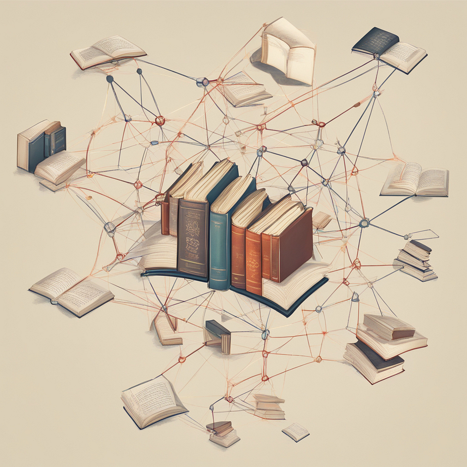
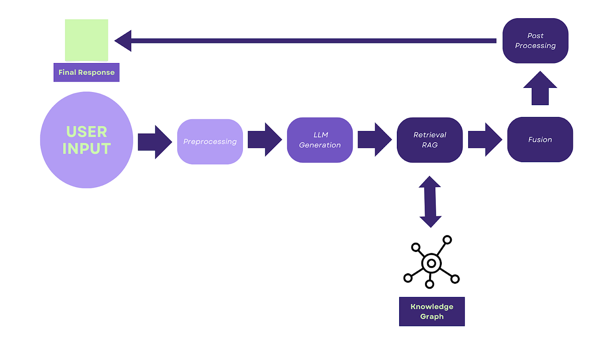
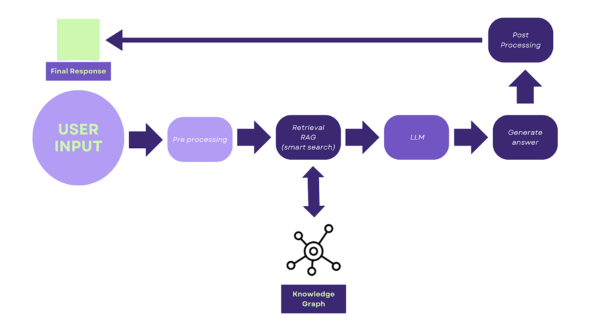

## **Tools and Platforms for Integration of Knowledge Graphs with RAG pipelines**

<figure>

<figcaption>

Image Created in [https://www.mage.space/](https://www.mage.space/)

</figcaption>

</figure>

# Authors

- [Aland Astudillo](https://www.linkedin.com/in/aland-astudillo/) (**ORCID:** [0009–0008–8672–3168](https://orcid.org/0009-0008-8672-3168))

- [Aishwarya Nambissan](https://www.linkedin.com/in/aishwarya-nambissan-127229200/) **(ORCID:** [0009–0003–3823–6609](https://orcid.org/0009-0003-3823-6609)**)**

# Introduction

Many users of chatbots such as ChatGPT, have encountered the problem of receiving inappropriate or incompatible responses. There are several reasons why this might happen.

One reason is the lack of appropriate training data, as chatbots are usually trained on large amounts of text and code. If the data is insufficient or of poor quality, the chatbot may misunderstand queries and provide inaccurate responses. Another reason is that some chatbots are designed for specific tasks or domains, which limits their ability to handle broader queries or understand subtle nuances in conversation. Additionally, chatbots may struggle with natural language, which is complex and often ambiguous. This can cause them to misunderstand a user’s query and provide irrelevant or off-topic responses. Finally, there are technical limitations, such as the chatbot’s inability to reason or make inferences.

This article explores a potential solution by combining two influential approaches in the field of Natural Language Processing (NLP) — Retrieval Augmented Generation (**RAG**) and Knowledge Graphs. We will delve into the partnership between these two entities, discuss the notable technologies and software used in their processes, and highlight various options for utilising their combined potential.

# Retrieval-Augmented Generation (**RAG)**

RAG is the process of optimising the output of a large language model (LLM) using a knowledge base outside of its training data sources before generating a response. It takes an input and retrieves a set of relevant/supporting documents given a source (e.g., Wikipedia). This can be thought of as a LLM not just putting words together, but carefully selecting relevant information from external sources and Knowledge Graphs to create well-informed and detailed responses.

# RAG Retrieval Techniques

The following are some crucial technologies that enable RAG’s impressive ability to retrieve and incorporate relevant information:

**Vector Search**: It transforms text into numerical vectors, capturing their meaning and nuances in a mathematical space, creating a map of relationships. Similar texts, like those discussing shared topics or using similar language, end up positioned close together in this space, allowing vector search to quickly identify them as related. This allows lightning-fast comparisons, finding similar texts based on meaning, not just keywords.

Algorithms like [**Faiss**](https://github.com/facebookresearch/faiss) and [**Annoy**](https://github.com/spotify/annoy) map text into dense vectors, enabling fast comparisons and retrieval of relevant passages based on semantic similarity.

**Passage Ranking**: It is an internal algorithm that scores candidate text passages based on their relevance to a query. It considers factors like keyword frequency, keyword overlap, and document structure to act like a judge, sifting through information to select the most fitting and informative passages.

Keyword overlap measures how often the same keywords appear in **both** the query and the candidate passage, emphasising shared vocabulary and potential relevance. It differs from keyword frequency, which simply counts how often individual keywords appear within a passage, regardless of their presence in the query.

Techniques like [**BM25**](https://github.com/getalp/wikIR) and [**TF-IDF**](https://github.com/marcocor/wikipedia-idf) score candidate passages based on keyword overlap and frequency, ensuring retrieved information truly fits the context.

**Graph Neural Networks** (**GNNs**): They are neural networks designed to explore and learn from interconnected data like maps, social networks, and other complex relationships. Unlike traditional processing methods that go through data in a linear fashion, GNNs are capable of recognising hidden patterns and understanding relationships like “who knows who” and “what connects to what” by “hopping” across connections in data.

Consider a graph as a network of dots(nodes) connected by lines (edges). Each dot represents some information, like a person, object, or concept. The lines tell you how these things relate to each other.

GNNs work in rounds. In each round:

1. Message Passing: Each node “talks” to its neighbors, sending messages along the edges. These messages contain information about the node itself and its features.

3. Node Update: Each node receives messages from all its neighbors and combines them with its own information. This update can involve calculations and applying a special function.

5. Output Calculation: Based on the updated information, the network calculates an output for each node. This output could be a prediction about the node’s category, its relationship to another node, or some other relevant information.

This process repeats for multiple rounds, allowing nodes to incorporate information from their entire neighborhood, not just their direct neighbors. As the rounds progress, the network learns to understand the relationships between nodes and the overall structure of the graph.

When dealing with Knowledge Graphs, frameworks like [**PyTorch-Geometric**](https://readthedocs.org/projects/pytorch-geometric/) and [**DeepMind’s GNN**](https://github.com/deepmind/deepmind-research/blob/master/learning_to_simulate/graph_network.py) library come into play. These frameworks allow GNNs to traverse interconnected entities and relationships within the graph, retrieve relevant knowledge fragments, and understand complex connections.

# **Knowledge Graphs: The Structured Wisdom Library**

A knowledge graph, also referred to as a semantic network, is a structure that represents a network of real-world entities such as objects, events, situations, or concepts. It helps to illustrate the constantly changing representations of the world, connecting entities (such as “Marie Curie”) and relationships (such as “won Nobel Prize”) to form a complex network of information. This information is typically stored in a graph database and visualised as a graph structure, thus the term knowledge “graph”.

Knowledge Graphs go beyond simply finding relevant facts and delve deeper into understanding the relationships and insights hidden within using these processes:

**Entity Linking**: Imagine a vast network of information, like a big puzzle of dots. Now imagine trying to connect specific names, places, and concepts to their corresponding dots in the puzzle. That is what entity linking does with text and knowledge graphs, connecting the specific components of the text to the corresponding nodes in the graph. They help systems understand the exact meaning of entities, and find relevant information from the graph.

Libraries like [**DGL-KeLP**](https://github.com/awslabs/dgl-ke) leverage GNNs to identify and link named entities (like “Marie Curie”) to their respective nodes within the Knowledge Graphs, enabling RAG to retrieve information that is directly relevant to the core subject of a search query

**Path Mining**: Path mining is a process of uncovering hidden relationships and patterns that are not easily noticeable. It involves exploring complicated networks of information and identifying and tracing connections between entities that may seem unrelated. By doing so, path mining reveals surprising insights and useful knowledge, improving our understanding of the complex structures within knowledge graphs.

Tools like [**Neo4j**](https://neo4j.com/) and [**Stanza**](https://github.com/stanfordnlp/stanza) allow traversing paths between entities, uncovering hidden relationships, and generating insightful responses based on this deeper understanding.

**Reasoning and Inference**: In the context of knowledge graphs, reasoning and inference are not just limited to discovering facts; they are also concerned with utilising them effectively. This involves integrating data, drawing meaningful connections, and using logical reasoning to resolve issues, foresee future occurrences, or even construct narratives leveraging the insights provided by the knowledge graph.

Consider the scenario of trying to find an organisation that works in specific sectors with the help of a knowledge graph. This analogy effectively highlights the active role of reasoning and inference in knowledge graphs:

1. **Gathering Facts**: Knowledge graphs collect and organise information from various sources, such as websites, databases, academic papers, and social media platforms. These facts are represented as structured data, with entities (e.g., organisations) and their attributes (e.g., sectors in which they operate) forming nodes and edges in the graph. By combining data about organisations and sectors, knowledge graphs enable the gathering of relevant facts for analysis.

3. **Integrating information**: By connecting an organisation’s relationships with specific sectors, such as partnerships, investments, or certifications, knowledge graphs reveal the scope and relevance of their work within those sectors. Links to related entities like employees, board members, or projects can further contribute to understanding an organisation’s involvement in specific sectors.

5. **Predicting and Creating**: Knowledge graphs can leverage machine learning and predictive models to infer missing or hidden information. By analysing the available facts and connections within the graph, these models can predict an organisation’s potential involvement in sectors that have common attributes with their known areas of operation. For example, if an organisation has expertise in renewable energy, predictive models could suggest their likely involvement in related sectors like clean transportation or sustainable infrastructure. Additionally, knowledge graphs facilitate the creation of new information and insights by combining existing facts with external data sources. For instance, by integrating real-time data on industry trends, market analysis, or news articles, knowledge graphs enable the discovery of emerging sectors or upcoming organisations that might align with the given parameters.

A framework like [**Atomspace**](https://github.com/opencog/atomspace) from [**OpenCog**](https://opencog.org/) empowers RAG to reason and infer new knowledge. By traversing paths and combining information from interconnected entities, the system can generate informed predictions or answer hypothetical questions.

# Purpose

The combination of RAG and Knowledge Graphs is beneficial for several reasons:

1. **Enhanced information retrieval**: Knowledge graphs provide structured and interconnected information that can significantly improve the effectiveness of information retrieval. By using Knowledge Graphs, RAG models can retrieve more accurate and relevant information, leading to better generation and response quality.

3. **Reliable and diverse information:** Knowledge Graphs are constructed from authoritative sources, making them reliable and trustworthy sources of information. RAG models can leverage this reliable information to generate more accurate responses. Additionally, Knowledge Graphs help in diversifying the generated responses by providing a broader pool of related facts and entities.

5. **Context-aware understanding**: Knowledge Graphs enable RAG models to understand and reason over the contextual information. By leveraging the relationships and semantic connections encoded in Knowledge Graphs, RAG models can better grasp the context of user queries or conversations, resulting in more coherent and appropriate responses.

7. **Handling complex queries**: Knowledge Graphs allow RAG models to tackle complex queries by breaking them down into smaller sub-queries, retrieving relevant pieces of information from the Knowledge Graph, and then generating a response based on the retrieved knowledge. This enables RAG models to handle a wide range of user queries effectively.

9. **Explainability and transparency**: Knowledge Graphs provide a transparent and interpretable representation of knowledge. By integrating Knowledge Graph-based retrieval into RAG models, the reasoning behind the generated responses becomes more explainable. Users can have a clear understanding of the knowledge sources and connections used to produce the response.

11. **Scalability**: Knowledge graphs act as large-scale repositories of information. RAG models can leverage Knowledge Graphs to generate responses to various queries or conversations without requiring additional supervised training data. This makes the RAG+Knowledge Graphs approach scalable to handle an extensive range of knowledge domains and user queries.

# **Pipeline Possibilities: Orchestrating RAG and** Knowledge Graphs

Let’s explore some exciting pipeline options for harnessing the combined power of RAG and Knowledge Graphs. There are two options in which either the LLM is prioritised or the Knowledge Graph is prioritised:

**Option 1: LLM-Centric Pipeline:**

The LLM-Centric pipeline is a RAG and Knowledge Graph combination that empowers LLMs to craft well-informed responses. Here’s how it works:

1. Start with the user’s question or statement

3. The LLM (like GPT-3) generates an initial draft response based on its internal knowledge. This draft may lack specific factual details or nuances that a knowledge graph can provide.

5. RAG kicks in, searching the text corpus or the Knowledge Graph for relevant passages that enrich the draft. During the retrieval process, RAG retrieval techniques are used to search not only text corpora but also knowledge graphs to find relevant information. This means that RAG can directly tap into the structured knowledge within the graph to retrieve facts, relationships, and entities that align with the user’s query and the LLM’s generated draft.

7. The retrieved information is carefully fused with the LLM’s output, creating a more factually accurate and insightful response

9. A final polishing step ensures the response is fluent, grammatically correct, and ready to show.

<figure>

<figcaption>

RAG LLM-centric generic scheme.

</figcaption>

</figure>

The basic steps to perform this are:

1. **Pre-processing**: Clean and tokenize user input to prepare for processing.

3. **LLM Generation**: Generate an initial draft response using an LLM like [**GPT-3**](https://openai.com/product) or [**Jurassic-1 Jumbo**](https://www.livescience.com/google-sentient-ai-lamda-lemoine).

5. **Retrieval**: Employ RAG techniques to retrieve relevant passages from a text corpus or Knowledge Graphs.

7. **Fusion**: Integrate retrieved information into the LLM-generated draft, creating a more informed and factually-grounded response.

9. **Post-processing**: Refine the final response for fluency, grammatical correctness, and overall coherence.

**Option 2: Knowledge Graphs-Centric Pipeline:**

In this approach, Knowledge Graphs take centre stage. In essence, this pipeline prioritises the structured knowledge within knowledge graphs, using RAG retrieval techniques to translate those insights into compelling and informative language. Here’s how it unfolds:

1. **User input**: The process begins with the user’s question or statement

3. **Graph exploration**: The knowledge graph is meticulously explored to identify relevant entities, relationships, and paths that align with the user’s input. This stage involves techniques like entity linking, path mining, and reasoning to uncover valuable information within the graph

5. **Response planning**: The insights extracted from the graph are used to create a structured response plan. This plan outlines the key points, facts, and logical flow that the final response should embody

7. **Language generation**: This is where RAG steps in. Its purpose is to create human-like text that follows the response plan. It uses LLMs to produce well-written sentences and paragraphs, combining the relevant information from the knowledge graph while maintaining cohesiveness and readability.

9. **Post-processing**: The generated response undergoes a final refinement process to ensure grammatical correctness, clarity, and overall quality

<figure>

<figcaption>

RAG Knowledge Graph-centric generic scheme.

</figcaption>

</figure>

The basic steps are:

1. **Query Formulation**: Transform the user input into a query suitable for Knowledge Graph’s exploration.

3. **Knowledge Graphs:** You can use either Neo4j or [NebulaGraph](https://www.nebula-graph.io/) to implement a retrieval enhancement technique. This technique involves utilising a knowledge graph to illustrate the connections between entities and relationships. Additionally, it incorporates a powerful language model to improve the retrieval process.

5. **Fact Selection**: Employ entity linking and reasoning algorithms to select and prioritise the most relevant facts based on the query and context.

7. **Natural Language Generation** (**NLG**): Utilise specialised NLG models like [BART](https://research.facebook.com/publications/controllable-abstractive-summarization/) to translate the extracted facts into a natural language response.

9. **Refinement**: Enhance the generated response for clarity and coherence.

# **Unveiling a Future of Intelligent Interaction**

The combination of RAG and Knowledge Graphs goes beyond just being a technological fusion. It paves the way for a future where the interaction between humans and computers goes beyond simple words and becomes a more informed and refined form of communication. As these technologies continue to develop, we can expect to witness a significant transformation in:

- AI-powered assistants that answer your questions with the confidence of a well-read friend, seamlessly combining relevant facts and insights gleaned from Knowledge Graphs.

- Next-generation search engines that go beyond keyword matching, understanding the deeper meaning behind your queries and delivering comprehensive, contextual results enriched with information from Knowledge Graphs.

- Creative writing tools that utilise RAG and Knowledge Graphs to generate stories that are both factually accurate and full of unexpected plot twists and character development, moving beyond clichéd patterns.

# **Conclusion**

The convergence of Retrieval Augmented Generation (RAG) and Knowledge Graphs brings about an exciting synergy in the world of Natural Language Processing (NLP). RAG enhances the output of large language models by carefully selecting relevant information from external sources and Knowledge Graphs, allowing for well-informed and detailed responses. KGs, on the other hand, provide a structured representation of real-world entities and their relationships, enabling the exploration of hidden insights and the discovery of complex connections.

The integration of RAG and Knowledge Graphs opens up two pipeline possibilities. The LLM-centric pipeline prioritises the language model’s output, which is then enriched with information retrieved from Knowledge Graphs. The Knowledge Graphs-centric pipeline, on the other hand, places Knowledge Graphs at the center, utilising RAG techniques to translate the structured insights into compelling and informative language.

While integrating LLMs and a knowledge graph for content retrieval requires careful planning, the reward is significant. You can gain access to hidden relationships within information, ultimately leading to higher-quality output information.

Tools like **OpenAI**, **Langchain**, and **LlamaIndex** provide ready-made pipelines to integrate knowledge graphs (like **Neo4j**) easily. Meanwhile, open-source LLMs like **Mistral**, **Llama**, and **Dolphin** are catching up to proprietary models in performance, making them attractive choices for building custom architectures. This open-source scenario allows for the exploration and examination of various methods before fully committing to a particular technological framework. So, it is crucial to evaluate your needs and choose the approach that best fits your use case.
