## The Next Evolution in Intelligent Code Editors

<figure>


<figcaption>

Cursor: The AI Editor Logo. Source: [Official website](https://www.cursor.com/)

</figcaption>

</figure>

# Introduction

In the ever-evolving world of software development, Cursor emerges as a game-changer — a revolutionary AI-powered code editor that’s blurring the line between human creativity and artificial intelligence. Imagine a coding environment that not only understands your project but actively assists you in writing, editing, and debugging. Cursor does just that, combining the familiar interface of a traditional code editor with the power of advanced AI models.

Whether you’re a seasoned developer looking to supercharge your workflow or a coding novice seeking a supportive learning tool, Cursor offers a glimpse into the future of programming. It’s not just about writing code faster; it’s about coding smarter. In this article, we’ll dive into what makes Cursor tick, exploring its key features and how it’s poised to transform the landscape of software development.

# The Evolution of Code Editors

Code editors have transformed dramatically since their inception. Early tools like Notepad offered basic text editing, while later programs such as Sublime Text introduced features like syntax highlighting and multi-cursor editing. Integrated Development Environments (IDEs) like Visual Studio and Eclipse took things further, providing comprehensive toolsets with built-in compilers, debuggers, and version control integration. These advancements steadily boosted developer productivity, but the fundamental approach remained unchanged — developers were still solely responsible for writing and structuring code.

The integration of AI has kickstarted a new chapter in coding tools. GitHub Copilot, launched in 2021, was a game-changer, offering AI-generated code suggestions directly within popular editors. Cursor builds on this foundation, taking the concept to new heights. By combining the familiar, extensible interface of VS Code with more advanced AI models, Cursor represents the next leap forward. It’s not just a tool that assists; it’s an intelligent environment that actively collaborates with developers in real-time, understanding context and offering sophisticated code generation and editing capabilities.

<figure>

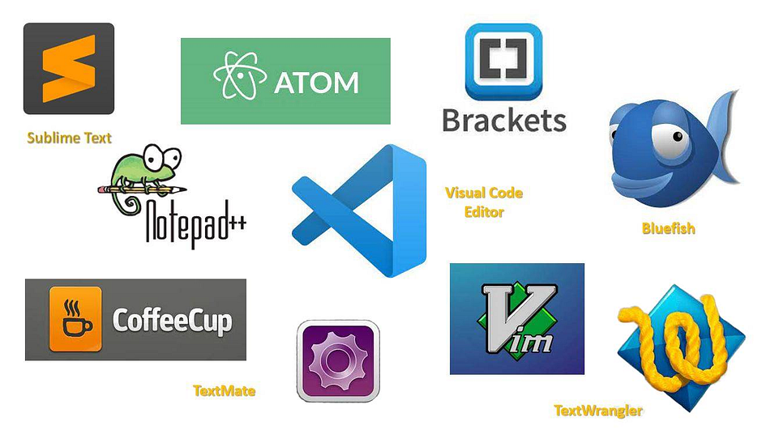

<figcaption>

Evolution of code editors: From basic text editors to AI-powered tools. This image showcases logos of popular code editors, illustrating the progression from simple text manipulation to intelligent, AI-Assisted coding environments like VS Code. Source: \[3\]

</figcaption>

</figure>

# The Basics of Cursor

At its core, Cursor is an AI-powered code editor that’s revolutionising the way developers interact with their code. But what exactly does this mean?

- **Definition**: Cursor is more than just a text editor for code. It’s an intelligent coding environment that leverages advanced AI models to assist developers in writing, editing, and understanding code. Think of it as having a knowledgeable coding partner always at your side, ready to offer suggestions, answer questions, and even predict your next moves.

- **Origin**: Cursor isn’t built from scratch. It’s forked from Visual Studio Code (VS Code), one of the most popular code editors in the world. This foundation provides Cursor with a familiar, robust editing experience while allowing its creators to focus on integrating cutting-edge AI capabilities. The result is a tool that feels familiar to VS Code users but offers significantly enhanced functionality.

- **Target Audience**: While Cursor’s advanced features might sound intimidating, it’s designed for developers of all levels. For seasoned programmers, Cursor can speed up workflows, assist with complex problem-solving, and even help explore new coding patterns. For beginners, it serves as an intelligent tutor, offering explanations, and suggestions, and helping to catch and explain errors. Even non-technical team members can benefit, using Cursor’s natural language interactions to better understand codebases.

**Note**: Visit the official Cursor website [here](https://markdown-to-medium.surge.sh/www.cursor.com) and select the Download button to obtain Cursor.

# Key Features of Cursor

Cursor sets itself apart with four game-changing features that make coding smarter and faster. Let’s explore each one with practical examples:

# Cursor Tab: Smart Code Completion

**How to use:** Cursor Tab is automatically enabled as you type. Just start coding, and Cursor will offer suggestions.

Cursor Tab doesn’t just complete simple lines — it can suggest complex, multi-line code structures and even refactor existing code. Imagine you’re writing a Python function to poll messages from aws SQS (simple queue service) and start typing:

```
def pollMessagesFromSQS
```

Cursor might suggest completing the function like this:

<figure>

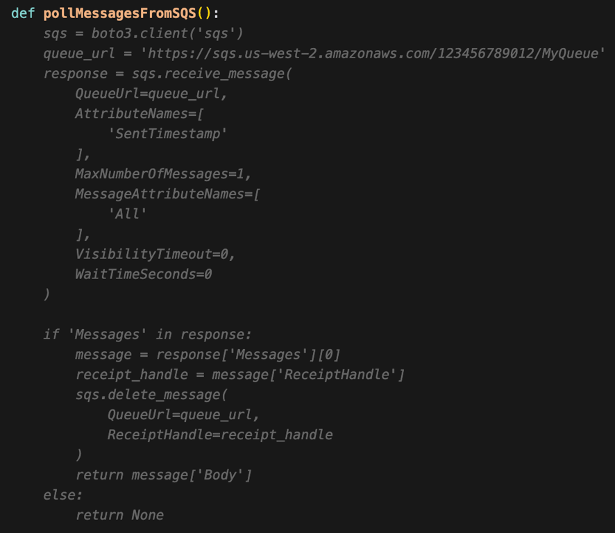

<figcaption>

Cursor’s smart code completion in action: Automatically generating a complex ‘pollMessagesFromSQS()’ function, including AWS SQS client setup, message retrieval, and deletion logic.

</figcaption>

</figure>

# Chat: AI Assistant for Coding Queries

**How to use:** Press Command+L (or Ctrl+L on Windows/Linux) to open the chat panel. Type your query and press Enter to submit.

Cursor’s chat can handle complex queries about your codebase, algorithms, and best practices. Now, let’s use the Chat feature to ask about improving this function we generated above:

```
How can I modify this function to handle multiple messages and implement error handling?
```

<figure>

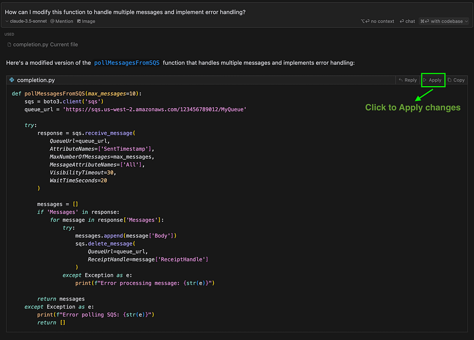

<figcaption>

Cursor’s AI assistant suggesting an improved ‘pollMessagesFromSQS’ function with multi-message handling and error management. The ‘Apply’ button allows for instant code integration.

</figcaption>

</figure>

# Cmd+K: AI-Powered Code Editing and Generation

**How to use:** Select the code you want to edit (or place your cursor where you want to generate new code), press Cmd+K (or Ctrl+K on Windows/Linux), and then type your instruction.

This powerful feature enables you to describe desired code changes or generate new code using natural language instructions. Cursor then intelligently interprets and implements these changes. Let’s demonstrate this capability by using Cmd+K (or Ctrl+K on Windows/Linux) to enhance our existing code:

```
Refactor this function to use async/await and implement exponential backoff for failed message deletions
```

<figure>

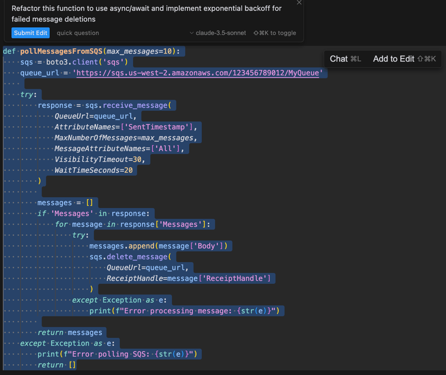

<figcaption>

he Cmd+K edit prompt, showing the original ‘pollMessagesFromSQS’ function before refactoring. This image demonstrates how users can select code and instruct Cursor to make specific improvements.

</figcaption>

</figure>

<figure>

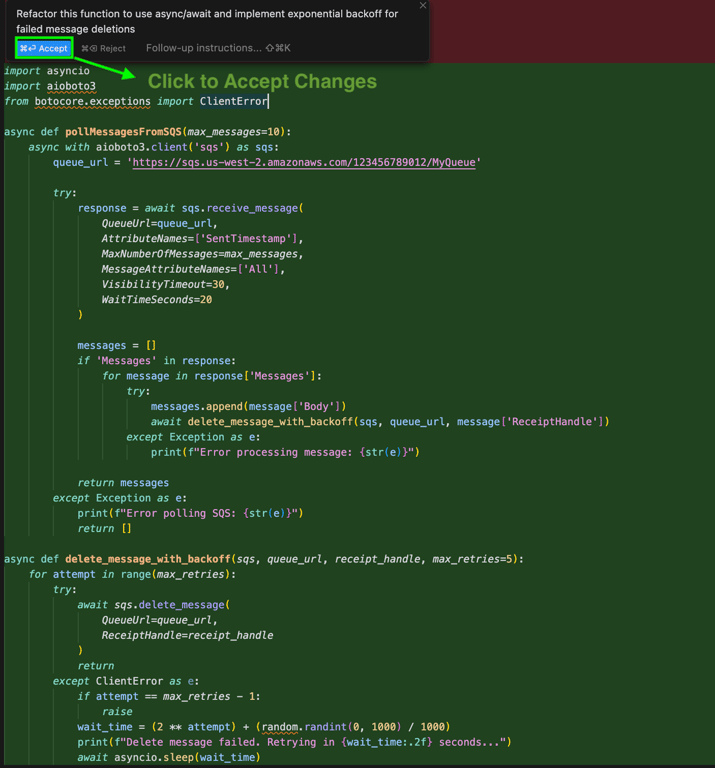

<figcaption>

Cursor’s Cmd+K feature in action: Refactoring the ‘pollMessagesFromSQS’ function to use async/await and implement exponential backoff. The ‘Accept’ button allows instant application of the AI-suggested changes.

</figcaption>

</figure>

# Codebase Understanding: Cursor “Knows” Your Project

**How to use**: This feature works automatically in the background. You can leverage it through chat queries about your project structure or by using `@Codebase` in your prompts.

This advanced capability empowers Cursor to comprehensively analyse and interpret your project’s structure, offering valuable insights and recommendations based on the holistic context of your codebase. It facilitates in-depth inquiries about your project’s architecture, intricate component interactions, and potential optimisations. To illustrate this feature’s prowess, let’s utilise the `@Codebase` functionality to delve into our SQS polling application:

```
@Codebase How does our application handle SQS message polling and processing? Can you suggest any improvements to make it more robust?
```

<figure>

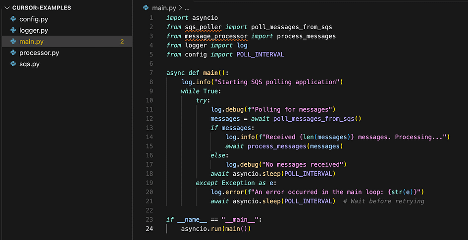

<figcaption>

The initial structure of the SQS polling application with asynchronous message polling and processing, serving as a reference point for AI-suggested improvements.

</figcaption>

</figure>

<figure>

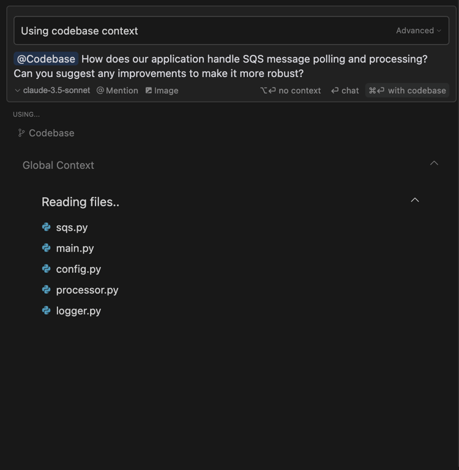

<figcaption>

Cursor’s @Codebase feature in action: Analysing multiple files (sqs.py, main.py, config.py, processor.py, and logger.py) to provide a comprehensive answer about the SQS polling application.

</figcaption>

</figure>

<figure>

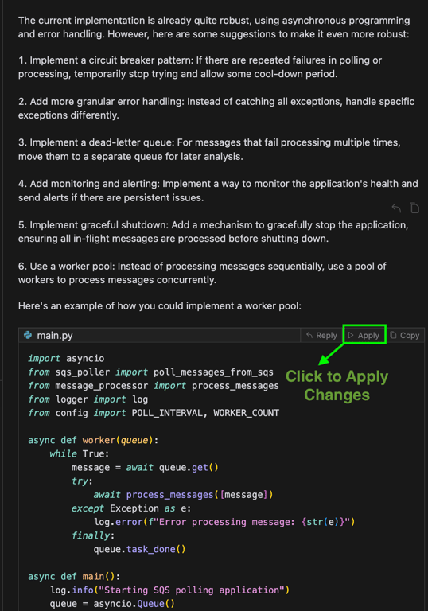

<figcaption>

Cursor’s AI-generated response, offering six detailed suggestions to enhance the application’s robustness, including an example of a worker pool implementation with an ‘Apply’ option for immediate code integration.

</figcaption>

</figure>

# What Sets Cursor Apart: A Developer’s Perspective

Having extensively utilised Visual Studio Code and Cursor in my development work, I’ve discovered several distinctive features that elevate it above other AI-enhanced coding tools. Here are the key aspects that make Cursor stand out:

1. **Built on Visual Studio Code**: Cursor’s foundation as a fork of Visual Studio Code offers a significant advantage. For developers well-versed in VS Code, the transition to Cursor is remarkably smooth. You can import your VS Code configuration into Cursor with one click. Navigate to `Cursor Settings` > `General` > `Account`. This allows you to:

- Leverage your existing VS Code shortcuts and workflows seamlessly

- Effortlessly integrate your preferred VS Code extensions, themes, and settings

- Experience the robust stability and high performance of VS Code while harnessing Cursor’s advanced AI capabilities

<figure>

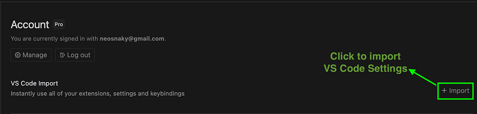

<figcaption>

Easy VS Code Settings Import in Cursor: the one-click import feature in Cursor that allows users to instantly bring in all their extensions, settings, and keybindings from VS Code.

</figcaption>

</figure>

**2\. Flexibility in AI Model Selection**: Cursor offers great flexibility in AI model selection, enabling developers to customise AI assistance based on specific project needs or preferences. This feature allows users to explore various AI capabilities, fostering innovation and efficiency in coding solutions:

- Select from a diverse range of built-in models, including cutting-edge options like GPT-4 and Claude 3.5

- Enhance capabilities by integrating your own API keys to access additional models

- Seamlessly switch between models to best suit your specific needs or task requirements, optimising your workflow

<figure>

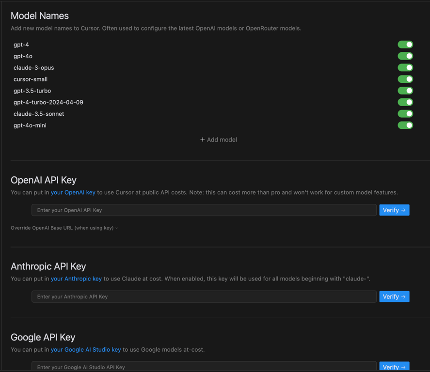

<figcaption>

Cursor’s Model Configuration and API Key Settings: various AI models are available in Cursor and options to add API keys for OpenAI, Anthropic, and Google AI services.

</figcaption>

</figure>

<figure>

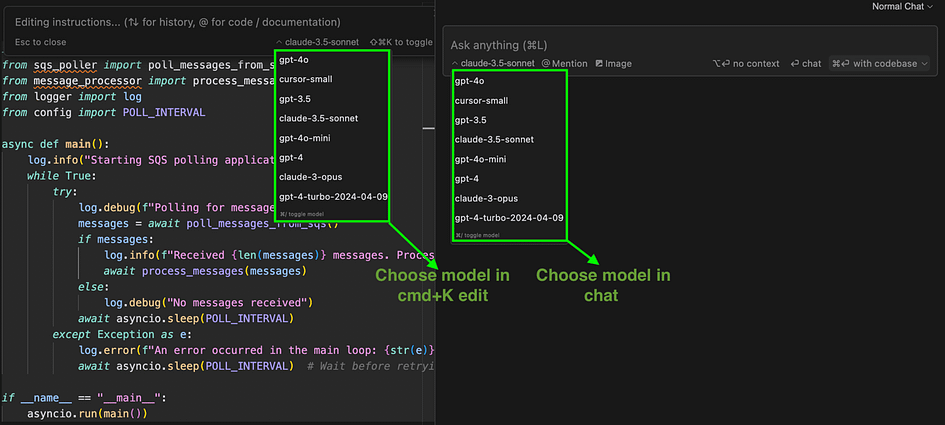

<figcaption>

Cursor’s Flexible Model Selection in Chat and Cmd+K: users can easily switch between different AI models when using Cursor’s chat feature or the Cmd+K edit function.

</figcaption>

</figure>

**3\. Remote Server Compatibility**: Cursor distinguishes itself with integration for remote server environments:

- Maintain uninterrupted access to Chat and Cmd+K functionalities when connected to servers via SSH

- Benefit from AI-powered assistance while working on remotely hosted codebases

- This functionality is notably missing in the combination of VS Code and GitHub Copilot

# Conclusion

Cursor represents an innovative leap forward in AI-assisted coding, combining the familiar environment of VS Code with powerful AI capabilities. Its standout features — smart code completion, context-aware chat, AI-powered editing, and comprehensive codebase understanding — streamline the development process and enhance productivity. The flexibility to choose AI models, seamless integration with existing workflows, and unique remote server compatibility make Cursor an invaluable tool for developers of all levels.

Whether you’re looking to accelerate your coding, gain deeper insights into complex projects, or simply explore the cutting edge of AI-assisted development, Cursor offers a compelling solution. I encourage you to give Cursor a try and experience firsthand how it can transform your coding workflow. As AI continues to evolve, tools like Cursor are shaping the future of software development, and now is the perfect time to be part of this revolution.

# References

\[1\] Cursor Official Documentation. [Read Documentation.](https://docs.cursor.com/)

\[2\] Cursor Feature Overview. [Explore Features.](https://www.cursor.com/features)

\[3\] Code Editors in 2024. [Read Article.](https://www.devopsschool.com/blog/code-editors-in-2024/)
