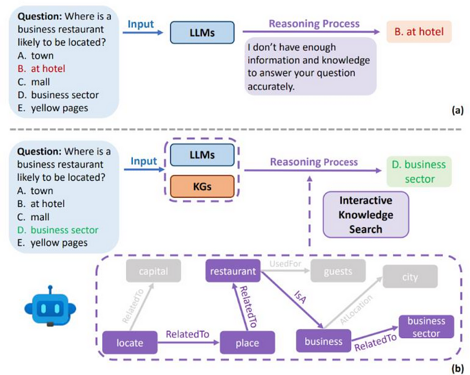

## **Harvesting the Power and Knowledge of Large Language Models**

<figure>

<figcaption>

Image generated with Google’s Gemini, 25 March 2024.

</figcaption>

</figure>

# **Author**

- Amanda Kau **(ORCID:** [0009–0004–4949–9284](https://orcid.org/0009-0004-4949-9284)**)**

# Introduction

Knowledge Graphs are networks that represent data in a graphical format. The beauty of Knowledge Graphs lies in their representation of concepts, events and entities as nodes, and the relationships between them as edges. These relationships determine the context of the node, and consequently, allow for better understanding of a word’s semantics and distinguishing between its multiple possible meanings. For example, Google’s Knowledge Graph supports Google Search, which can distinguish between the brand “Apple” and the fruit “apple”. Knowledge Graphs are applicable across a range of domains and applications, including product recommendations in retail, search engine optimisation, anti-money laundering initiatives, and healthcare.

However, the utilisation of Knowledge Graphs is hindered by their difficult, costly and time-consuming construction process. This challenge has spurred a new wave of research exploring automatic Knowledge Graph construction. Particularly, there is growing interest in integrating large language models (LLMs) like GPT-4 into the construction process due to their remarkable language processing abilities. In this article, we will begin by briefly examining the difficulties associated with Knowledge Graph construction. Then, we will compare Knowledge Graphs and LLMs as knowledge bases. Finally, we will review existing methods for automatic Knowledge Graph construction that utilise LLMs.

# Difficulties in Constructing Knowledge Graphs

Previous Knowledge Graph construction methods are based on crowdsourcing or text mining. Popular crowdsourcing-based Knowledge Graphs like [WordNet](https://wordnet.princeton.edu/) and [ConceptNet](https://conceptnet.io/) were constructed with significant human labour but are limited to predefined sets of relations. Meanwhile, text mining-based approaches extract knowledge from documents, but are limited to extracted relations stated explicitly within the text. This approach also involves many steps like coreference resolution, named entity recognition, and more. You are welcome to read more about the Knowledge Graph construction process in [this article](https://medium.com/@researchgraph/unlocking-intelligence-the-journey-from-data-to-knowledge-graph-4d7a08e5f4e0).

The difficulties are compounded by the fact that different Knowledge Graphs are constructed for each field or application. Given the various concepts and terminologies used in each field, there is no universal approach to create Knowledge Graphs. Specific domains also present their own challenges. For example, Knowledge Graphs are immensely useful in the service computing community as they assist in resource management, personalised recommendations and customer understanding. However, the Knowledge Graph in this context requires knowledge and concepts from diverse fields, and the data required to build the Knowledge Graph is both highly scattered and largely unannotated. These factors significantly increase the time, effort and costs involved in producing a Knowledge Graph.

# Knowledge Graphs versus Large Language Models

Both Knowledge Graphs and LLMs can be queried to retrieve knowledge. In the figure below, Knowledge Graphs locate answers by finding relevant connected nodes, while LLMs are prompted to fill in the \[MASK\] token to complete the sentence. LLMs like GPT-4 and BERT have recently gained lots of attention due to their impressive abilities to understand language. It is well-known that LLMs continue to grow in size every year and are trained on vast amounts of data, enabling them to possess immense knowledge. Many people might turn to ChatGPT to ask a question instead of searching for it on Google. Naturally, the next question for the research community was to explore if LLMs (like GPT) could replace Knowledge Graphs (like Google Knowledge Graph) as primary sources of knowledge.

<figure>

<figcaption>

Retrieving knowledge from knowledge graphs (left) and large language models (right). Source: Yang et al., 2023 [https://doi.org/10.48550/ARXIV.2306.11489](https://doi.org/10.48550/ARXIV.2306.11489)

</figcaption>

</figure>

Further research revealed that despite possessing more fundamental world knowledge, LLMs struggled to recall relational facts and deduce relationships between actions and events. Despite possessing numerous advantages, LLMs also suffer from challenges such as:

- **Hallucinations**: LLMs occasionally produce convincing but incorrect information. Conversely, Knowledge Graphs provide structured and explicit knowledge grounded in its factual data sources.

- **Limited reasoning abilities**: LLMs struggle to comprehend and use supporting evidence to draw conclusions, especially in numerical computation or symbolic reasoning. The relationships captured in Knowledge Graphs allow for better reasoning capabilities.

- **Lack of domain knowledge**: While LLMs are trained on vast amounts of general data, they lack knowledge from domain-specific data like medical or scientific reports with specific technical terms. Meanwhile, Knowledge Graphs can be constructed for specific domains.

- **Knowledge obsolescence**: LLMs are expensive to train and are not regularly updated, causing their knowledge to become outdated over time. Knowledge Graphs, on the other hand, have a more straightforward update process that does not require retraining.

- **Bias, privacy and toxicity**: LLMs may give biased or offensive responses, whereas Knowledge Graphs are typically built from reliable data sources devoid of these biases.

Knowledge Graphs do not encounter these same issues and exhibit better consistency, reasoning ability and interpretability, though they do have their own set of limitations. Aside from those discussed previously, Knowledge Graphs also lack the flexibility that LLMs enjoy from their unsupervised training process.

# Merging Knowledge Graphs and Large Language Models

Consequently, there have been numerous research efforts aimed at merging LLMs and Knowledge Graphs. While Knowledge Graphs possess the ability to guide LLMs toward better accuracy, LLMs can assist Knowledge Graphs in knowledge extraction during construction and improve the Knowledge Graph’s quality. There are a few approaches to merging these two concepts:

- **Employing LLMs to aid in automatic Knowledge Graph construction**: LLMs can extract knowledge from data to populate a Knowledge Graph. Further details on this method will be discussed below.

- **Teaching LLMs to search for knowledge from Knowledge Graphs**: As shown in the image below, Knowledge Graphs can enhance the reasoning processes of LLMs so that LLMs can arrive at more accurate answers.

- **Combining them into knowledge graph-enhanced pre-trained language models (KGPLMs)**: These methods aim to incorporate Knowledge Graphs into the LLM training process.

<figure>

<figcaption>

(a) LLMs alone might not be sufficient. (b) With Knowledge Graphs, the reasoning processes of LLMs can be enhanced. Source: Feng et al., 2023 [https://doi.org/10.48550/arXiv.2309.03118](https://doi.org/10.48550/arXiv.2309.03118)

</figcaption>

</figure>

# Automatic Knowledge Graph Construction with Large Language Models

## **Earlier methods**

One of the earlier methods proposed in 2019 was COMET (or COMmonsEnse Transformers), which used a fine-tuned generative LLM, GPT in this case, to construct Knowledge Graphs by generating tail entities given head entities and relations. Given the “seed” and “relation” in the image below, COMET generated the “completion” response, which was evaluated by humans to assess the plausibility of the responses. These seed-relation-completion triples could then be used to form Knowledge Graphs. For example, “piece” and “machine” could form two nodes connected by a “PartOf” relationship.

<figure>

<figcaption>

Responses in the “completion” column are generated by COMET, given the “seed” and “relation”. Source: Bosselut et al., 2019 [https://doi.org/10.48550/ARXIV.1906.05317](https://doi.org/10.48550/ARXIV.1906.05317)

</figcaption>

</figure>

## **Using ChatGPT as an information extractor**

A Knowledge Graph constructed specifically for the service domain, named BEAR, was developed using ChatGPT to avoid the effort and costs associated with manual data annotation. To do this, an ontology specific to the domain was created, which served as a base for the Knowledge Graph and identified the concepts and characteristics that the Knowledge Graph should be populated with later on. ChatGPT would then be prompted to extract the relevant content and relationships from unstructured text data, like in the image below. The automatically extracted information was subsequently incorporated into the Knowledge Graph to build it.

<figure>

<figcaption>

ChatGPT was used to extract information from text data in the BEAR model. Source: Yu et al., 2023 [https://doi.org/10.1007/978-3-031-48421-6\_23](https://doi.org/10.1007/978-3-031-48421-6_23)

</figcaption>

</figure>

## **Semi-automatic** Knowledge Graph **construction using LLMs**

Once again using ChatGPT as an information extractor, Kommineni et al. recently proposed using ChatGPT-3.5 in their Knowledge Graph construction method with human domain experts verifying results in two stages, as illustrated below. The difference between this method and the previous one is that LLMs play a more active role here. Beginning with specific datasets, ChatGPT was prompted to generate competency questions (CQs), which were abstract-level questions about the data. An ontology was created by extracting concepts and relationships from the CQs, again by prompting ChatGPT. Answers to the CQs were retrieved from the data and given to ChatGPT, which was instructed to extract key entities, relationships and concepts and map them onto the ontology to construct the Knowledge Graph.

<figure>

<figcaption>

A semi-automatic method for Knowledge Graph construction using LLMs. Source: Kommineni et al., 2024 [https://doi.org/10.48550/ARXIV.2403.08345](https://doi.org/10.48550/ARXIV.2403.08345)

</figcaption>

</figure>

## **Harvesting** Knowledge Graphs **from LLMs**

The final method discussed in this article sought to extract information directly from LLMs themselves. Hao et al. recognised that there was vast amounts of knowledge stored within LLMs from their initial training that could be put to use. The image below shows the steps to harvesting the LLM’s knowledge. The process started with an initial prompt and as few as two example entity pairs. A text paraphrase model was employed to paraphrase the prompt and derive modified prompts from the original one. Subsequently, the LLM was searched for entity pairs corresponding to this set of prompts. Using a search and re-scoring method, the most relevant pairs were extracted to form the Knowledge Graph, with the entities in the pairs as nodes and the prompts as relationships.

This approach allowed for better relation qualities in the resulting Knowledge Graphs as the derived relations possessed several characteristics unseen in traditionally constructed Knowledge Graphs:

1. Relations could be complex, for example, “A is capable of, but not good at, B”.

3. Relations could involve more than two entities, like “A can do B at C”.

Interestingly, forming Knowledge Graphs using LLMs also presented a new way to visualise and quantify the knowledge captured within a LLM.

<figure>

<figcaption>

The process of automatic Knowledge Graph construction in BertNet. Source: Hao et al., 2022 [https://doi.org/10.48550/ARXIV.2206.14268](https://doi.org/10.48550/ARXIV.2206.14268)

</figcaption>

</figure>

# Conclusion

In summary, we have discussed the potential of Knowledge Graphs and large language models (LLMs) as knowledge bases. Knowledge Graphs excel in capturing relationships and have greater reasoning abilities, but are difficult and costly to construct. On the other hand, LLMs contain extensive knowledge but are prone to bias, hallucinations and other issues. They are also computationally expensive to fine-tune or to adapt for specific domains. To harness the benefits of both methods, knowledge graphs and LLMs can be integrated together in several ways.

In this article, we focused on using LLMs to assist in automatic knowledge graph construction. In particular, we reviewed four examples, including the earlier COMET model, using ChatGPT as an information extractor in BEAR, and directly harvesting knowledge from LLMs. These methods represent a promising path forward in combining the strengths of knowledge graphs and LLMs to enhance knowledge representation.

# **References**

- What is a Knowledge Graph? | IBM. (n.d.). [Www.ibm.com](http://www.ibm.com/). [https://www.ibm.com/topics/knowledge-graph](https://www.ibm.com/topics/knowledge-graph)

- ‌Yang, L., Chen, H., Li, Z., Ding, X., & Wu, X. (2023). Give Us the Facts: Enhancing Large Language Models with Knowledge Graphs for Fact-aware Language Modeling (Version 2). arXiv. [https://doi.org/10.48550/ARXIV.2306.11489](https://doi.org/10.48550/ARXIV.2306.11489)

- Feng, C., Zhang, X., & Fei, Z. (2023). Knowledge Solver: Teaching LLMs to Search for Domain Knowledge from Knowledge Graphs (Version 1). arXiv. [https://doi.org/10.48550/ARXIV.2309.03118](https://doi.org/10.48550/ARXIV.2309.03118)

- Bosselut, A., Rashkin, H., Sap, M., Malaviya, C., Celikyilmaz, A., & Choi, Y. (2019). COMET: Commonsense Transformers for Automatic Knowledge Graph Construction (Version 2). arXiv. [https://doi.org/10.48550/ARXIV.1906.05317](https://doi.org/10.48550/ARXIV.1906.05317)

- Yu, S., Huang, T., Liu, M., & Wang, Z. (2023). BEAR: Revolutionizing Service Domain Knowledge Graph Construction with LLM. In Service-Oriented Computing (pp. 339–346). Springer Nature Switzerland. [https://doi.org/10.1007/978-3-031-48421-6\_23](https://doi.org/10.1007/978-3-031-48421-6_23)

- Kommineni, V. K., König-Ries, B., & Samuel, S. (2024). From human experts to machines: An LLM supported approach to ontology and knowledge graph construction (Version 1). arXiv. [https://doi.org/10.48550/ARXIV.2403.08345](https://doi.org/10.48550/ARXIV.2403.08345)

- Hao, S., Tan, B., Tang, K., Ni, B., Shao, X., Zhang, H., Xing, E. P., & Hu, Z. (2022). BertNet: Harvesting Knowledge Graphs with Arbitrary Relations from Pretrained Language Models (Version 3). arXiv. [https://doi.org/10.48550/ARXIV.2206.14268](https://doi.org/10.48550/ARXIV.2206.14268)

