## **Understanding how RNNs work and their applications**

<figure>

<figcaption>

Image created in [https://unsplash.com/](https://unsplash.com/)

</figcaption>

</figure>

# **Author**

- Wenyi Pi (**ORCID**: [0009–0002–2884–2771](https://orcid.org/0009-0002-2884-2771))

# Introduction

In the ever-evolving landscape of artificial intelligence (AI), bridging the gap between humans and machines has seen remarkable progress. Researchers and enthusiasts alike have tirelessly worked across numerous aspects of this field, bringing about amazing advancements. Among these domains, machine learning stands out as a pivotal area of exploration and innovation.

The agenda in the field of machine learning is multifaceted and aims to improve the ability of computers to learn from data and make predictions or decisions without explicit programming. This includes a wide array of tasks, including pattern recognition, predictive analytics, natural language processing (NLP), deep learning, etc. The evolution of applications in NLP, time series analysis, and sequential data processing has been significantly shaped by the refinement of **Recurrent Neural Networks (RNNs)**.

This article aims to provide a comprehensive introduction for understanding of how RNNs work and its applications.

# **What Is a Recurrent Neural Network (RNN)?**

Artificial Neural Networks (ANNs), inspired by the human brain, aim to teach computers to process data. This involves a machine learning process (deep learning) which uses interconnected nodes, or neurons, in a hierarchical structure similar to the human brain. It creates an adaptive system that computers use to learn from mistakes and constantly improve. As a result, ANNs attempt to solve complex problems, such as summarising documents or recognising faces, with greater precision.

A RNN is a special type of ANN adapted to work for time series data or data that involves sequences. It is trained to process and convert a sequential data input into a specific sequential data output. Sequential data is data such as words, sentences, time-series data where sequential components interrelate based on complex semantic and syntax rules.

# **Unfolding a Recurrent Neural Network**

A simple RNN has a feedback loop, as shown in the figure below. The feedback loop shown in the grey rectangle can be unrolled in three time steps to produce the second network below. We can also vary the architecture so that the network unroll _k-_time steps.

<figure>

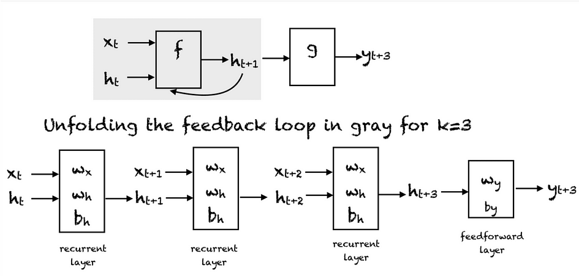

<figcaption>

_Compressed representation (top), unfolded network (bottom). Image from:_ [_RNN Introduction_](https://machinelearningmastery.com/an-introduction-to-recurrent-neural-networks-and-the-math-that-powers-them/)

</figcaption>

</figure>

At every time step, we can unfold the network for k time steps to get the output at time _k+1_. The unfolded network is similar to the feedforward neural network. In the feedforward pass of an RNN, the network computes the values of the hidden units and the output after _k-_time steps. The weights associated with the network are shared temporally. Each recurrent layer has two sets of weights: one for the input and the second for the hidden unit. The last feedforward layer, which computes the final output for the kth time step, is just like an ordinary layer of a traditional feedforward network.

<figure>

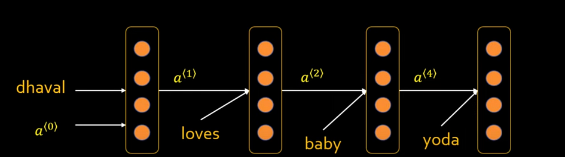

<figcaption>

_An Example of RNN. Image from:_[_https://www.youtube.com/watch?v=Y2wfIKQyd1I&t=526s_](https://www.youtube.com/watch?v=Y2wfIKQyd1I&t=526s)

</figcaption>

</figure>

These are four single same layers but show the status of different time steps. Supply the output of the previous word as an input to the second word to generate text in sequence.

# **Decoding RNN’s Operational Dynamics**

RNNs are made of neurons which are data-processing nodes that work together to perform complex tasks. There are typically four layers in RNN, the input layer, output layer, hidden layer and loss layer. The input layer receives information to process, the output layer provides the result. Positioned between the input and output layers, the hidden layer can remember and use previous inputs for future predictions based on the stored memory. The iterative processing unfolds as sequential data traverses through hidden layers, with each step bringing about incremental insights and computations.

<figure>

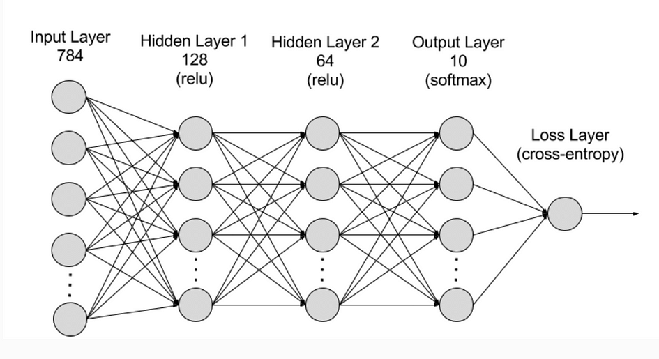

<figcaption>

_RNN network. Image from:_ [_https://aws.amazon.com/what-is/recurrent-neural-network/_](https://aws.amazon.com/what-is/recurrent-neural-network/)

</figcaption>

</figure>

# **The Activation Function**

Activation functions determine whether a neuron should be activated or not by calculating the weighted sum and further adding bias to it. It can introduce non-linearity that typically converts the output of a neuron to a value between 0 and 1 or -1 and 1.

Common activation functions that can be used are:

- Sigmoid function

- Tanh function

- ReLu function

<figure>

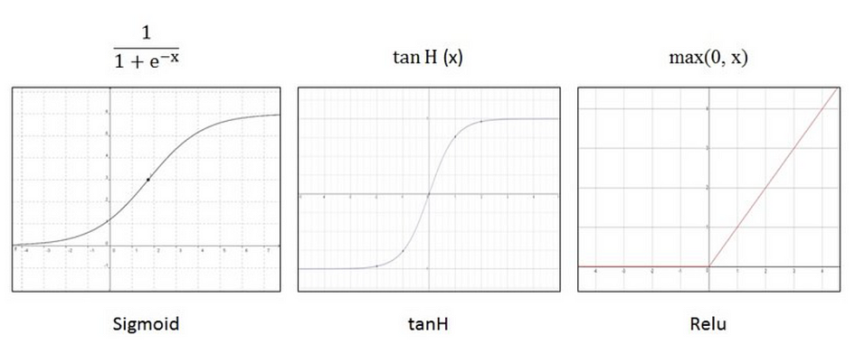

<figcaption>

_Activation functions. Image from Kazi,_ [_activation function_](https://www.researchgate.net/figure/This-figure-shows-three-different-activation-functions-graphs-and-its-equations-From_fig4_322537764)

</figcaption>

</figure>

# **Training a Recurrent Neural Network**

RNNs are trained by feeding with training data and refining its performance. Neurons have weights which are used to signal the importance of information when predicting the result during training. Weights are adjusted to improve prediction accuracy. A method called backpropagation through time (BPTT) can calculate model error and adjust weight relatively. BPTT moves from right to left through the graph that rolls back output to previous time step and recalculates the error rate to identify which hidden state is causing errors and adjust this weight to reduce the error, therefore improving prediction accuracy.

<figure>

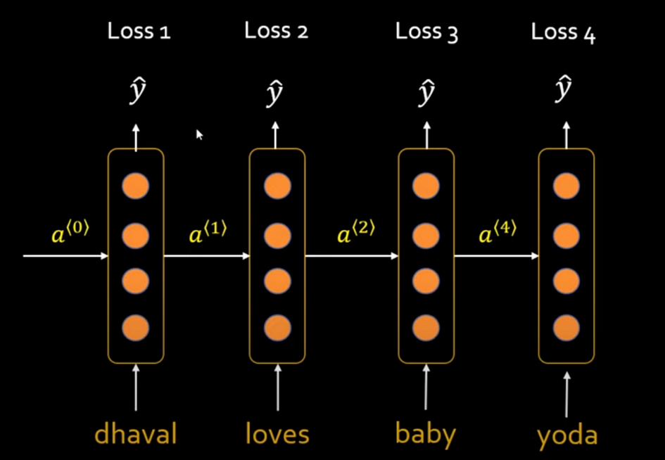

<figcaption>

_Training RNN. Image from:_ [_What is Recurrent Neural Network (RNN)?, codebasics_](https://www.youtube.com/watch?v=Y2wfIKQyd1I&t=526s)

</figcaption>

</figure>

The general steps are as follow:

1. Initialise the parameters of the neural network such as weight matrices _(U, V, W)_ and bias vector _(b, c)_.

3. Forward propagation to compute predictions. This involves computing the output of each layer in the network sequentially, using the current parameter values.

5. Compute the loss to measure the difference between the predicted output and the actual target value.

7. Back-propagation to compute gradients of the loss function. This involves propagating the error backward layer by layer through the network, and using the calculus chain rule to calculate the gradients.

9. Following gradient computation, adjust weights and biases using optimisation methods like **SGD** or **Adam** to minimise the loss function.

11. Repeat steps 2–5 until criterion is met.

Training result:

<figure>

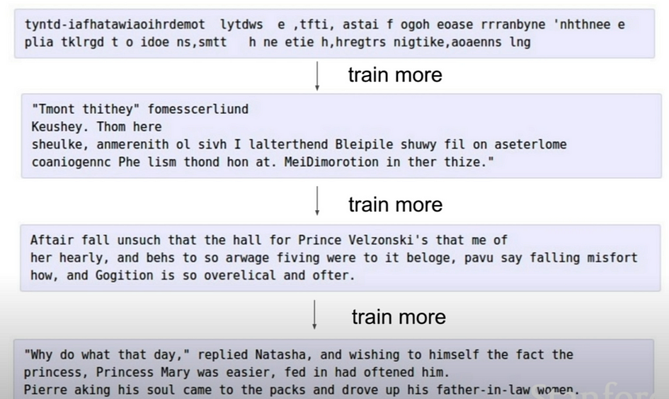

<figcaption>

_Training result example. Image from:_ [_Lecture 10 | Recurrent Neural Networks, Stanford University School of Engineering Youtube channel (12 ago 2017)_](https://www.youtube.com/watch?v=6niqTuYFZLQ)

</figcaption>

</figure>

Through the training process, the model gradually learns to make better predictions by adjusting its parameters based on the observed data and the computed gradients. As you can see from the image above, through gradual training, the result generated sentences that are more coherent, structured, and meaningful.

# **Types of RNNs**

<figure>

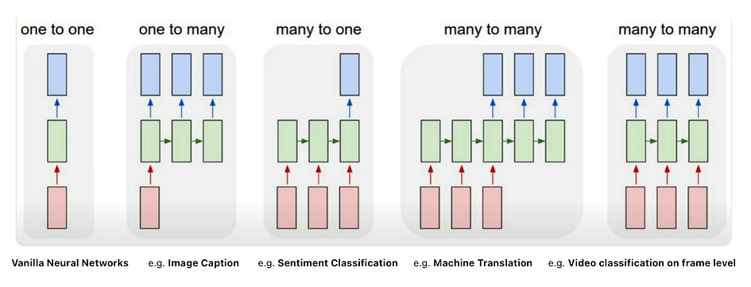

<figcaption>

_RNN Types. Source:_ [_Lecture 10 | Recurrent Neural Networks, Stanford University School of Engineering Youtube channel (12 ago 2017)_](https://www.youtube.com/watch?v=6niqTuYFZLQ)

</figcaption>

</figure>

Each rectangle is a vector and arrows represent functions. Input vectors are in red, output vectors are in blue and green vectors hold the RNN’s state. From left to right:

1. Traditional neural networks employ a **one-to-one** architecture. Vanilla neural networks, from fixed-sized input to fixed-sized output. e.g. image classification takes an image and outputs a single classification word.

3. **One-to-many** networks, a single input can produce multiple outputs. Sequence output, from fixed-sized input to sequence of variable length. e.g. image captioning takes an image and outputs a sentence of words.

5. **Many-to-one** networks, many inputs from different time steps produce a single output. Sequence input, from variable-sized input to fixed-sized output. e.g. sentiment analysis where a given sentence is classified as expressing positive or negative sentiment.

7. **Many-to-many** networks: Sequence input and sequence output, from variable-sized input to variable-sized output. e.g. Machine Translation, an RNN reads a sentence in English and then outputs a sentence in French.

9. **Many-to-many** networks with **synced** sequence: Synced sequence input and output, from variable-sized input to variable-sized output. e.g. video classification where we wish to label each frame of the video.

# **Real Life RNN Use Case**

The following are four useful sequence model applications.

## 1\. Google Gmail

<figure>

<figcaption>

_Google Gmail._

</figcaption>

</figure>

When you type a sentence, it will automatically complete it. Google has this RNN embedded in it.

<figure>

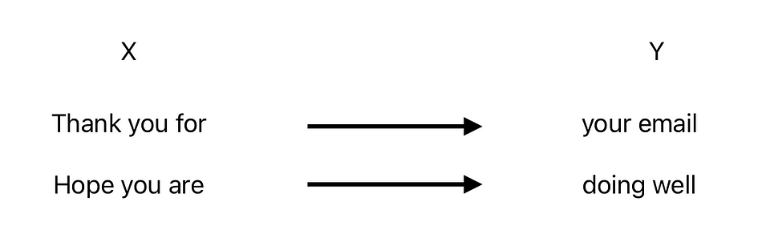

<figcaption>

_Autogenerate result._

</figcaption>

</figure>

## 2\. Google Translate

<figure>

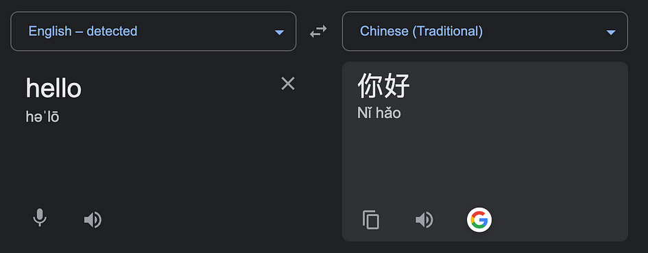

<figcaption>

Google Translate.

</figcaption>

</figure>

Translate sentence from one to another language

## 3\. Named entity recognition (NER)

<figure>

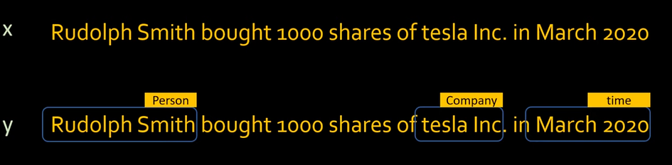

<figcaption>

_NER. Image from:_ [_What is Recurrent Neural Network (RNN)?, codebasics_](https://www.youtube.com/watch?v=Y2wfIKQyd1I&t=526s)

</figcaption>

</figure>

Given a statement, it will analyse the text to detect and classify entities.

## 4\. Sentiment Analysis

<figure>

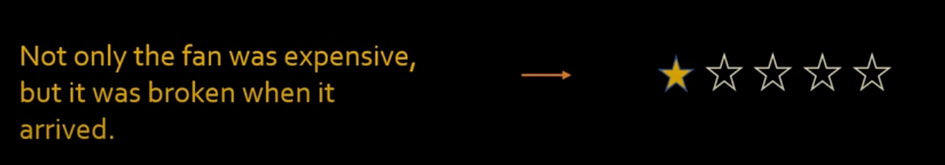

<figcaption>

_Sentiment Analysis. Image from:_ [_What is Recurrent Neural Network (RNN)?, codebasics_](https://www.youtube.com/watch?v=Y2wfIKQyd1I&t=526s)

</figcaption>

</figure>

Given a statement, it will analyse text to determine the sentiment or emotional tone expressed within it.

# **Two RNN Main Limitations**

- [**Exploding gradient**](https://deepai.org/machine-learning-glossary-and-terms/exploding-gradient-problem#:~:text=The%20exploding%20gradient%20problem%20is,\(weights\)%20become%20excessively%20large): When individual derivatives are large, the final derivative will also become huge and weights would change drastically.

- [**Vanishing gradient**](https://en.wikipedia.org/wiki/Vanishing_gradient_problem): As the number of hidden layers grows, the gradient becomes very small and weights will hardly change. This will hamper the learning process.

# **RNN Variants**

## **Bidirectional recurrent neural networks (BRNN)**

In [BRNN](https://en.wikipedia.org/wiki/Bidirectional_recurrent_neural_networks), data is processed in two directions with both forward and backward layers to consider past and future contexts. Combining both layers enables BRNN to have improved prediction accuracy compared to RNN which only has forward layers.

## **Long short-term memory (LSTM)**

In [LSTM](https://en.wikipedia.org/wiki/Long_short-term_memory), a model can expand its memory capacity to accommodate a longer timeline. It has a special memory block (cells) which is controlled by input gate, output gate and forget gate, therefore LSTM can remember more helpful information than RNN.

## **Gated recurrent units (GRU)**

In [GRU](https://en.wikipedia.org/wiki/Gated_recurrent_unit), it enables selective memory retention. The model has an update and forget gate which can store or remove information in the memory.

# **Conclusion**

In conclusion, Recurrent Neural Networks (RNNs) is a powerful and useful neural network for processing sequential data. With the ability to process sequence variables, RNN has a wide range of applications in text generation, text translation, speech recognition, sentiment analysis etc. Overall, RNNs continue to be a vital tool in the machine learning and natural language processing field.

# **References**

- Chen, Q. (2020) _Language models and RNN_, _Medium_. Available at: [https://medium.com/@rachel\_95942/language-models-and-rnn-c516fab9545b](https://medium.com/@rachel_95942/language-models-and-rnn-c516fab9545b) .

- Nabi, J. (2019) _Recurrent neural networks (RNNs)_, _Medium_. Available at: [https://towardsdatascience.com/recurrent-neural-networks-rnns-3f06d7653a85](https://towardsdatascience.com/recurrent-neural-networks-rnns-3f06d7653a85) .

- Saeed, M. (2023) An introduction to recurrent neural networks and the math that powers them, MachineLearningMastery.com. Available at: [https://machinelearningmastery.com/an-introduction-to-recurrent-neural-networks-and-the-math-that-powers-them](https://machinelearningmastery.com/an-introduction-to-recurrent-neural-networks-and-the-math-that-powers-them).

- _What is RNN? — Recurrent Neural Networks Explained — AWS_. Available at: [https://aws.amazon.com/what-is/recurrent-neural-network](https://aws.amazon.com/what-is/recurrent-neural-network).
