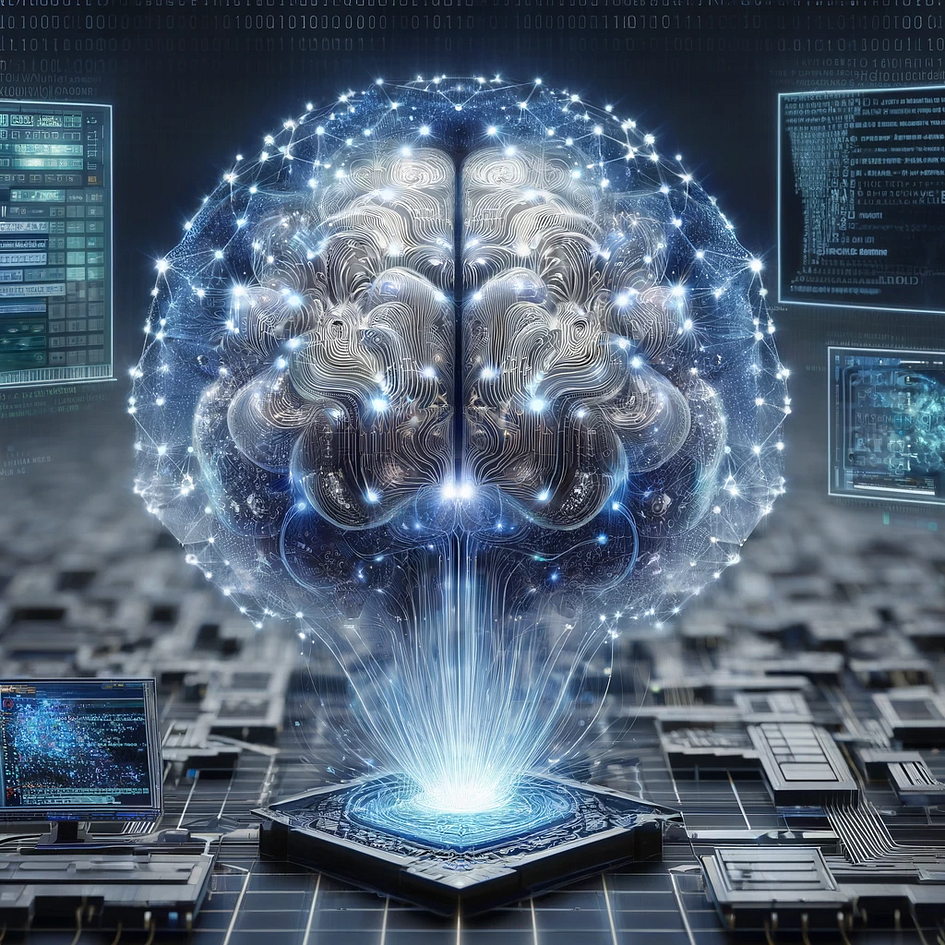
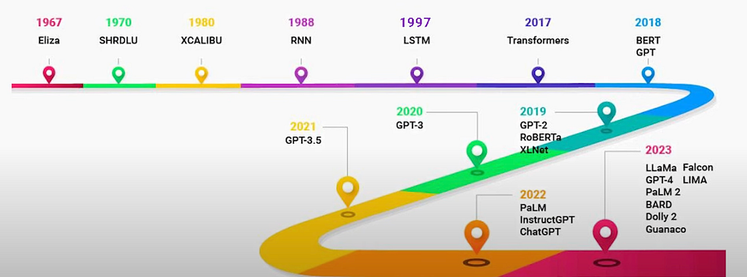
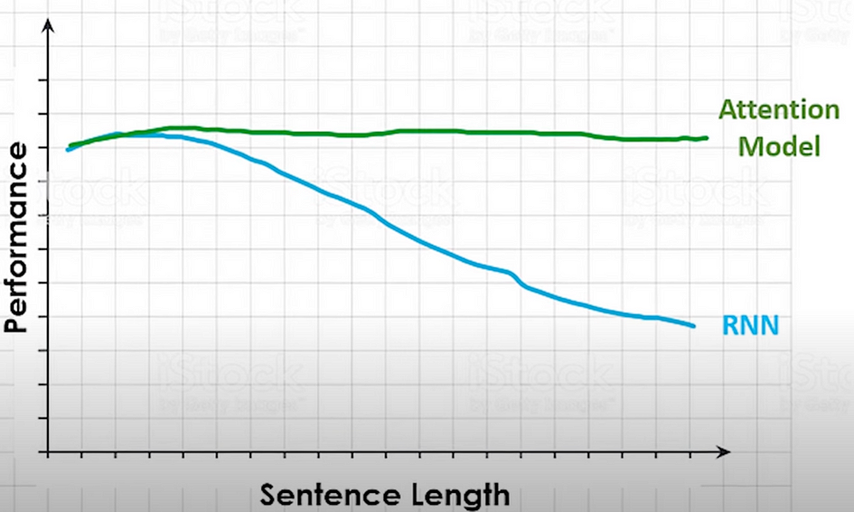
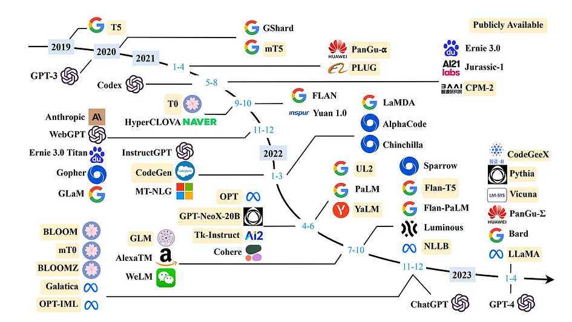

## Understanding the Evolutionary Journey of LLMs

<figure>

<figcaption>

Image generated in DALL-E 2.

</figcaption>

</figure>

# Author

- Wenyi Pi (**ORCID**: [0009–0002–2884–2771](https://orcid.org/0009-0002-2884-2771))

# Introduction

When we talk about large language models (LLMs), we are actually referring to a type of advanced software that can communicate in a human-like manner. These models have the amazing ability to understand complex contexts and generate content that is coherent and has a human feel.

If you’ve ever chatted with an AI chatbot or virtual assistant, you might actually interact with an LLM, probably without even realising it. These models are used far beyond chatbots and have a wide range of applications such as in text generation, automatic translation, sentiment analysis, document summarisation, and many other scenarios!

LLMs have become an essential part of the artificial intelligence (AI) landscape. In this article, we will delve into the world of LLMs, exploring their history and the evolution of LLMs.

# What Is a Large Language Model?

Large Language Models (LLMs) refer to large, general-purpose language processing models that are first pre-trained on extensive datasets covering a wide range of topics to learn and master the fundamental structures and semantics of human language. The term “large” in this context denotes both the substantial amount of data required for training and the billions or even trillions of parameters that the model contains. Pre-training equips the model to handle common language tasks such as text classification, question answering, and document summarisation, demonstrating its versatility.

After pre-training, these models are typically fine-tuned for specific applications, such as on smaller, specialised datasets targeted at particular domains like finance or medicine, to enhance accuracy and efficiency in addressing specific issues. This approach of pre-training followed by fine-tuning enables LLMs not only to solve a broad range of general problems but also to adapt to specific application requirements.

# Evolution of Large Language Models

<figure>

<figcaption>

Large language model (LLM) timeline. Source: [Brief History of Large Language Models & Generative AI | Evolution of NLP from Eliza to ChatGPT](https://www.youtube.com/watch?v=K7o5_Fj7_SY)

</figcaption>

</figure>

The image above provides an overview of the timeline for LLMs. We will discuss each important phase in detail in the following sections.

## Early Days: chatbots and rule-based systems (1960s)

Way back in 1966, the world witnessed the birth of ELIZA, which is considered to be the first chatbot ever built by humans. Created by Joseph Weizenbaum at MIT, ELIZA was a groundbreaking experiment of its time, enabling human-computer interaction. While it didn’t understand the conversation context like the way humans do or like ChatGPT does nowadays, it can create an illusion of a conversation by rephrasing user statements as questions using pattern matching and substitution methodology. At that time, many variations of the chatbot were made and one of the most well-known is called DOCTOR, this was made to respond like a Rogerian psychotherapist. In this instance, the therapist “reflects” on questions by turning the questions back at the patient. While ELIZA was a humble beginning, this surely paved the way for further research in the field of chatbots and natural language processing in the years to come. For a try out ELIZA, please use the following link: [ELIZA](https://web.njit.edu/~ronkowit/eliza.html).

## Rise of Recurrent Neural Networks (1980s)

Moving on into the late 20th century, we saw the emergence of neural networks, which were deeply inspired by the human brain and its interconnected neurons. Among these, Recurrent Neural Networks (RNN) were the first to come in 1986 and they gained instant popularity from the world. Unlike traditional feedforward neural networks, where the flow of information was in one direction, RNNs could remember previous inputs in their internal state or memory and answer questions based on context. They are trained to process and convert a sequential data input into a specific sequential data output and have a feedback loop, making them suitable for natural language processing (NLP) tasks. While RNNs were a significant step forward, they had limitations, especially with long sentences. In simple words, they are not good at retaining memory and suffer from long-term memory loss. In technical terms, RNNs had a problem of vanishing gradient. For a general description of RNNs, you can visit the following link: [RNN](https://medium.com/@researchgraph/an-introduction-to-recurrent-neural-networks-rnns-802fcfee3098).

## Rise of Long Short Term Memory (1990s)

Long Short-Term Memory (LSTM) came up in 1997. LSTM was a specialised type of RNN. Their primary advantage was their ability to remember information over long sequences. Thus, it overcame the short-term memory limitations of RNNs. LSTM has a unique architecture: they have an input gate, a forget gate, and an output gate. These gates determine how much information should be memorised, discarded, or output at each step. This selective ability to memorise or forget helped LSTMs maintain relevant information in their memory, making them more efficient at capturing long-term dependencies from sentences. For example, it is able to resolve the coreference resolution compared to RNNs.

## Gated Recurrent Network (2010s)

In 2014, Gated Recurrent Units (GRU) came. They were designed to solve some of the same problems as LSTMs but with a simple and more streamlined structure. Just like LSTMs, GRUs were designed to combat the vanishing gradient problem, allowing them to retain long-term dependencies in sentences. GRUs simplified the gating by using only two gates: an update gate which determined how much of the previous information to keep versus how much of the new information to consider; and a reset gate which determined how much of the previous information to forget. The reduced gating in GRUs made them more efficient in terms of computation.

## Rise of Attention Mechanism (2014)

As it turns out RNNs, as well as RNN-based variants LSTM and GRU, were not great at retaining the context when it was far away. The NLP world and their problems needed something more and that gave birth to the concept of attention. The introduction of the attention mechanism marked a significant paradigm shift in sequence modelling, offering a fresh perspective compared to previous architectures. RNN would process sentences with a fixed-size context vector that tries to cram all the information of a source sentence regardless of its length, into a single fixed-length vector and because of this, their performance deteriorates as the sentence length increases. In contrast, attention allows the model to look back to the entire source sequence dynamically, selecting different parts based on their relevance at each step of the output. This ensures that no crucial information is lost or diluted, especially in longer sequences.

<figure>

<figcaption>

Performance Comparison. Source: [Brief History of Large Language Models & Generative AI | Evolution of NLP from Eliza to ChatGPT](https://www.youtube.com/watch?v=K7o5_Fj7_SY)

</figcaption>

</figure>

The figure above illustrates the decline in RNN performance compared to the Attention Model as the length of the input sentence increases.

## The Invention of Transformers Architecture (2017)

Transformers came out in 2017 with the paper “_Attention is all you need_” from Vaswani and colleagues of a Google Team. This new type of architecture relied on an attention mechanism to process sequence. At its core, it is composed of an encoder and decoder, each with multiple stacked layers of self-attention and feed-forward neural networks. A standout feature is the “multi-head” attention, allowing it to focus on different parts of the input sentence simultaneously, capturing various contextual nuances. Another strength was its ability to process sequences in parallel rather than sequentially. These advantages enable transformers to lay the foundation for subsequent models like BERT, GPT and more, driving us into a new era of LLMs.

## Emergence of Large Language Models (2018-onwards)

With the success of transformers, the next logical step was scaling. This kickstarted with Google’s BERT model which was released in the year 2018. Unlike previous models that processed text either left-to-right or right-to-left, BERT was designed to consider both directions simultaneously, hence the name: Bidirectional Encoder Representations from Transformer (BERT). Pre-trained on vast amounts of text, BERT was the first proper foundational language model that could be fine-tuned for specific tasks, setting new performance standards across various benchmarks. With Open AI releasing its GPT-2 Model and Google releasing its T5 Model in 2019, thereafter GPT-3 came up in 2020, etc. These LLMs could perform innumerable tasks, marking a paradigm shift in AI capabilities.

<figure>

<figcaption>

Timeline of recent years' large language models. Source: [https://www.nextbigfuture.com/2023/04/timeline-of-open-and-proprietary-large-language-models.html](https://www.nextbigfuture.com/2023/04/timeline-of-open-and-proprietary-large-language-models.html)

</figcaption>

</figure>

# Conclusion

The evolution of language models from simple rule-based systems to complex intelligence models shows significant advances in AI technology. Today, large language models (LLMs) are more than just tools for enhancing text-based applications, they are increasingly capable of understanding and communicating with humans.

Additionally, these language models are also able to handle not just text but also images and sounds, known as multimodal LLMs. Capable of processing and generating multiple-mode data, these models integrate text, images, audio and video to comprehensively understand and analyse different forms of data. Multimodal LLMs have a range of applications including extracting text from digital images, understanding complex signs, deciphering ancient handwriting, and analysing speech files for summarisation, and transcription.

Through simplifying complex text, multimodal LLMs transform the way we interact with technology and could make it more accessible and responsive to human needs. In short, these LLMs are becoming powerful partners for humans, helping us tackle multiple tasks and simplifying our lives in multiple ways.

# References

- Brief History of Large Language Models & Generative AI | Evolution of NLP from Eliza to ChatGPT (no date) [www.youtube.com.](http://www.youtube.com./) Available at: [https://www.youtube.com/watch?v=K7o5\_Fj7\_SY](https://www.youtube.com/watch?v=K7o5_Fj7_SY) .

- Ibrahim, M. (2023) An Overview of Large Language Models (LLMs), W&B. Available at:[https://wandb.ai/mostafaibrahim17/ml-articles/reports/An-Overview-of-Large-Language-Models-LLMs---VmlldzozODA3MzQz?galleryTag=llm#what-is-a-large-language-model](https://wandb.ai/mostafaibrahim17/ml-articles/reports/An-Overview-of-Large-Language-Models-LLMs---VmlldzozODA3MzQz?galleryTag=llm#what-is-a-large-language-model)?.

- Vaswani, A., Shazeer, N., Parmar, N., Uszkoreit, J., Jones, L., Gomez, A. N., Kaiser, L., & Polosukhin, I. (2017). Attention Is All You Need (Version 7). arXiv. [https://doi.org/10.48550/ARXIV.1706.03762](https://doi.org/10.48550/ARXIV.1706.03762)
