## A Comprehensive Guide to Quick Start and Practical Implementation

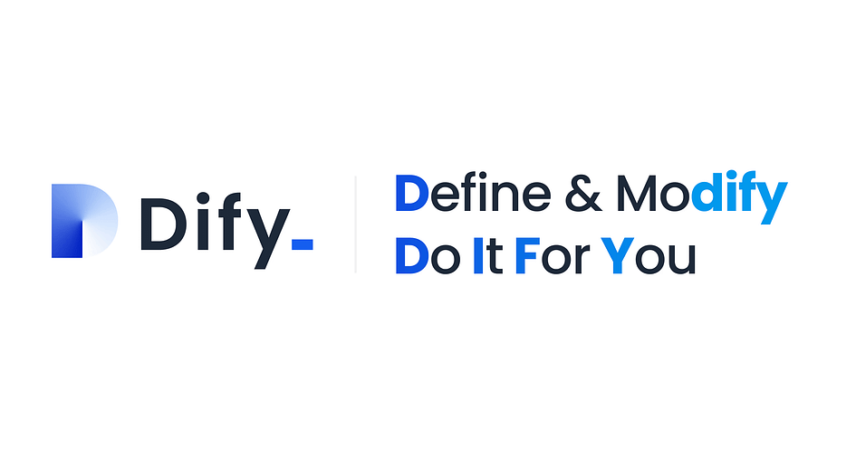

# Author

- [Zijian Yang](https://www.linkedin.com/in/zijian-yang/) (**ORCID:** [0009–0006–8301–7634](https://orcid.org/0009-0006-8301-7634))

# Introduction

Dify is an open-source large language model (LLM) application development platform. It combines the concepts of Backend-as-a-Service and LLMOps to enable developers to quickly build production-grade generative AI applications. Even non-technical people can participate in the definition and data operations of AI applications.

By integrating the key technology stacks required for building LLM applications, including support for hundreds of models, an intuitive Prompt orchestration interface, high-quality RAG engines, and a flexible Agent framework, while providing a set of easy-to-use interfaces and APIs, Dify saves developers a lot of time reinventing the wheel, allowing them to focus on innovation and business needs.

The name Dify comes from Define + Modify, referring to defining and continuously improving your AI applications.

# Why Use Dify?

You can think of libraries like LangChain as toolboxes with hammers, nails, etc. In comparison, Dify provides a more production-ready, complete solution — think of Dify as a scaffolding system with refined engineering design and software testing.

Importantly, Dify is **open source**, co-created by a professional full-time team and community. You can self-deploy capabilities similar to Assistants API and GPTs based on any model, maintaining full control over your data with flexible security, all on an easy-to-use interface.

# What Can Dify Do?

- **Workflow**: Dify offers a visual canvas to build and test robust AI workflows. This feature enables users to leverage the full range of Dify’s capabilities, including model integration and prompt crafting.

- **Comprehensive Model Support**: The platform supports seamless integration with hundreds of proprietary and open-source LLMs, including popular options like GPT, Mistral, Llama3, and any OpenAI API-compatible models. This wide range of supported models ensures flexibility and choice for developers.

- **Prompt IDE**: Dify includes an intuitive Prompt IDE, allowing users to craft prompts, compare model performance, and enhance applications with additional features like text-to-speech.

- **RAG Pipeline**: Dify’s RAG (Retrieval-Augmented Generation) capabilities cover everything from document ingestion to retrieval. It includes out-of-the-box support for extracting text from various document formats such as PDFs and PPTs.

- **Agent Capabilities**: Users can define agents using LLM Function Calling or ReAct, and integrate pre-built or custom tools. Dify provides over 50 built-in tools for AI agents, including Google Search, DALL·E, Stable Diffusion, and WolframAlpha.

- **LLMOps**: The platform includes observability features for monitoring and analysing application logs and performance over time. This allows for continuous improvement of prompts, datasets, and models based on real-world data and annotations.

- **Backend-as-a-Service**: Dify offers corresponding APIs for all its features, enabling effortless integration into existing business logic.

- **Cloud**: Dify provides a cloud service with zero setup, including all the capabilities of the self-hosted version. The Sandbox plan offers 200 free GPT-4 calls for experimentation.

- **Self-hosting**: Dify’s Community Edition can be quickly set up in any environment, with detailed documentation available for deeper customisation.

- **Enterprise Solutions**: Dify offers enterprise-centric features such as SSO and access control. It also provides a Dify Premium option on AWS Marketplace, which includes custom branding and logos for apps.

# What You Can Gain from This Article

By reading this article, you’ll gain a comprehensive understanding of how to leverage Dify, an open-source LLM app development platform, to create powerful AI applications without needing to write code.

You will learn how to build and deploy workflows using a visual interface, integrate a wide range of models, and implement advanced features like RAG pipelines and AI agents.

Additionally, the article provides practical guidance on setting up both cloud-based and self-hosted solutions, equipping you with the skills to deploy and manage AI applications efficiently.

Whether you are new to AI or an experienced developer, you will find valuable insights and practical steps to enhance your AI development capabilities with Dify.

# Selecting the Usage Method

## Cloud Service: Online Experience

Dify offers a cloud service for everyone, so you can use the full functionality of Dify without deploying it yourself.

Get started with the free plan, which includes a free trial of 200 OpenAI calls. To use the free plan of the cloud version, you will need a GitHub or Google account and an OpenAI API key. Here’s how you can get started:

1. Sign up to [Dify Cloud](https://cloud.dify.ai/) and create a new Workspace or join an existing one.

3. Configure your model provider or use the hosted model provider.

5. You can create an application now!

There are only two login options: GitHub and Google. You can choose either to log in.

<figure>

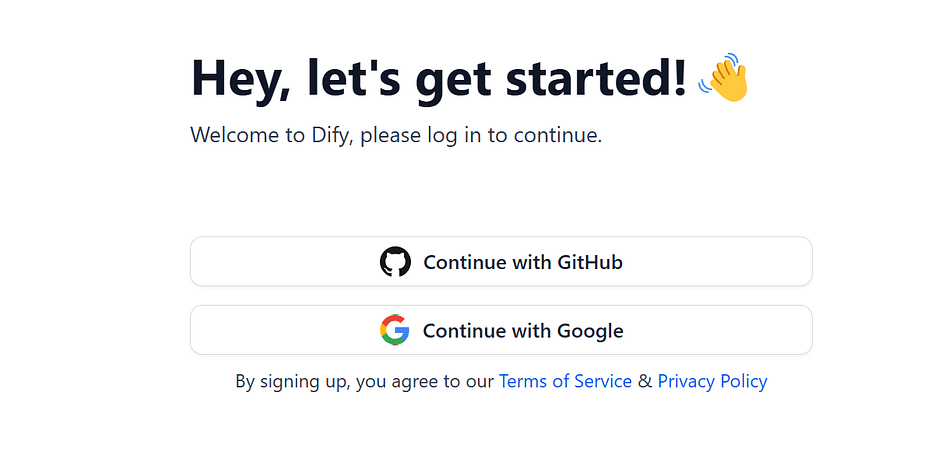

<figcaption>

Dify login

</figcaption>

</figure>

After logging in, you will see the Studio interface. You can skip the next section and go directly to the “Models” chapter.

# Deploying the Community Edition: Running Locally

If you want to run Dify locally, you can choose to deploy the Dify Community Edition, which is the open-source version. You can deploy it via Docker Compose or the local source code. This article will demonstrate the more convenient method of deploying Dify locally on Windows using Docker Compose.

First, install and run Docker Desktop and enable WSL 2. You can download it from the following link; the detailed installation process will not be covered in this article: [https://www.docker.com/products/docker-desktop/](https://www.docker.com/products/docker-desktop/)

Open a command prompt in the directory where you want to store Dify, and enter:

```
git clone https://github.com/langgenius/dify.git
```

You will see the following output:

```
D:\Joe\Project\Dify>git clone https://github.com/langgenius/dify.git
Cloning into 'dify'...
remote: Enumerating objects: 66122, done.
remote: Counting objects: 100% (10553/10553), done.
remote: Compressing objects: 100% (1540/1540), done.
remote: Total 66122 (delta 9611), reused 9196 (delta 9008), pack-reused 55569
Receiving objects: 100% (66122/66122), 38.65 MiB | 11.63 MiB/s, done.
Resolving deltas: 100% (47189/47189), done.
Updating files: 100% (5109/5109), done.
```

If you haven’t installed Git, you can download the entire project from Dify’s GitHub repository and extract it before proceeding with the following steps. However, this method is less convenient for future updates.

Navigate to the `docker` directory of the Dify source code and execute the one-click start command:

```
# Navigate to the docker directory
cd dify/docker
# Copy and rename the configuration file
cp .env.example .env
# If you are using Windows cmd, use the copy command instead of cp
copy .env.example .env
# Start docker compose
docker compose up -d
```

Deployment output:

```
D:\Joe\Project\Dify\dify\docker>docker compose up -d
[+] Running 75/9
 ✔ weaviate Pulled                                                                                                27.0s
 ✔ web Pulled                                                                                                     61.1s
 ✔ ssrf_proxy Pulled                                                                                              26.9s
 ✔ api Pulled                                                                                                     51.3s
 ✔ redis Pulled                                                                                                   27.3s
 ✔ sandbox Pulled                                                                                                 40.4s
 ✔ db Pulled                                                                                                      30.1s
 ✔ nginx Pulled                                                                                                   27.1s
 ✔ worker Pulled                                                                                                  51.3s
[+] Running 11/11
 ✔ Network docker_default             Created                                                                      0.0s
 ✔ Network docker_ssrf_proxy_network  Created                                                                      0.1s
 ✔ Container docker-sandbox-1         Started                                                                      2.1s
 ✔ Container docker-weaviate-1        Started                                                                      2.7s
 ✔ Container docker-db-1              Started                                                                      2.7s
 ✔ Container docker-ssrf_proxy-1      Started                                                                      2.7s
 ✔ Container docker-redis-1           Started                                                                      2.7s
 ✔ Container docker-web-1             Started                                                                      1.6s
 ✔ Container docker-api-1             Started                                                                      2.9s
 ✔ Container docker-worker-1          Started                                                                      2.9s
 ✔ Container docker-nginx-1           Started                                                                      3.3s
```

Finally, check if all containers are running correctly:

```
docker compose ps
```

Run output:

```
D:\Joe\Project\Dify\dify\docker>docker compose ps
NAME                  IMAGE                              COMMAND                  SERVICE      CREATED         STATUS                   PORTS
docker-api-1          langgenius/dify-api:0.6.15         "/bin/bash /entrypoi…"   api          3 minutes ago   Up 3 minutes             5001/tcp
docker-db-1           postgres:15-alpine                 "docker-entrypoint.s…"   db           3 minutes ago   Up 3 minutes (healthy)   5432/tcp
docker-nginx-1        nginx:latest                       "sh -c 'cp /docker-e…"   nginx        3 minutes ago   Up 3 minutes             0.0.0.0:80->80/tcp, 0.0.0.0:443->443/tcp
docker-redis-1        redis:6-alpine                     "docker-entrypoint.s…"   redis        3 minutes ago   Up 3 minutes (healthy)   6379/tcp
docker-sandbox-1      langgenius/dify-sandbox:0.2.1      "/main"                  sandbox      3 minutes ago   Up 3 minutes
docker-ssrf_proxy-1   ubuntu/squid:latest                "sh -c 'cp /docker-e…"   ssrf_proxy   3 minutes ago   Up 3 minutes             3128/tcp
docker-weaviate-1     semitechnologies/weaviate:1.19.0   "/bin/weaviate --hos…"   weaviate     3 minutes ago   Up 3 minutes
docker-web-1          langgenius/dify-web:0.6.15         "/bin/sh ./entrypoin…"   web          3 minutes ago   Up 3 minutes             3000/tcp
docker-worker-1       langgenius/dify-api:0.6.15         "/bin/bash /entrypoi…"   worker       3 minutes ago   Up 3 minutes             5001/tcp
```

The output should include 3 business services: api, worker, and web, as well as 6 foundational components: weaviate, db, redis, nginx, ssrf\_proxy, and sandbox.

Then, open your browser and go to `http://localhost` to access Dify. Enter the necessary information to complete user registration.

<figure>

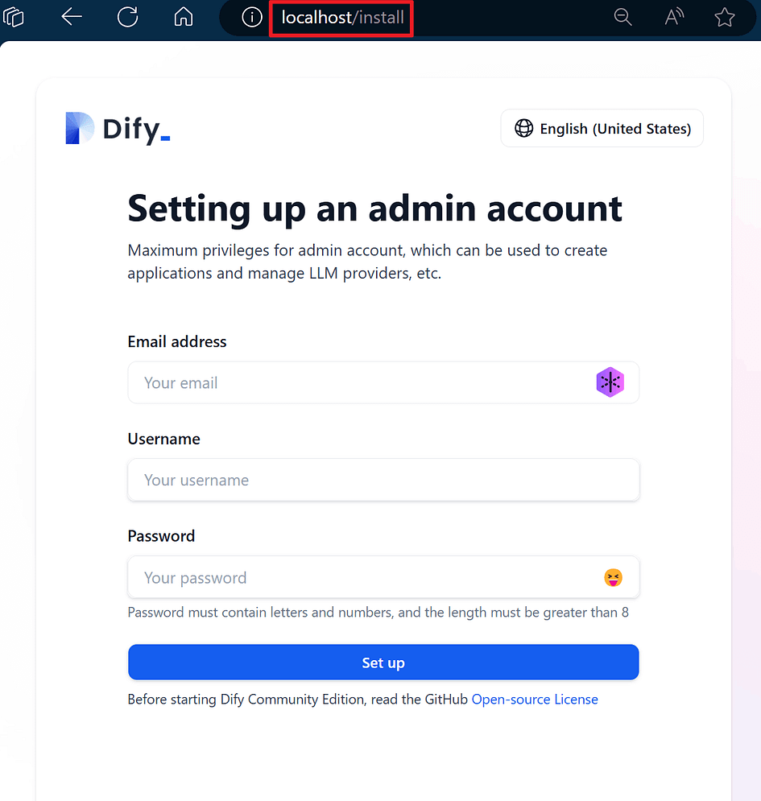

<figcaption>

Dify Registration

</figcaption>

</figure>

After filling in the registration information, click “Set up” to proceed to the login page. Enter the account information you just registered and sign in:

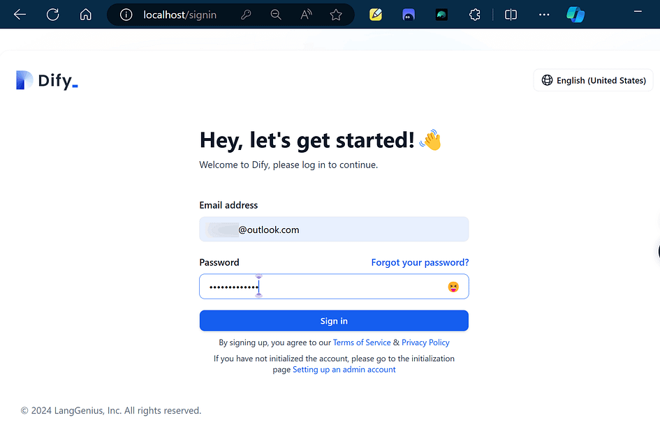

You should be able to log in successfully. At this point, your local deployment of Dify is ready for use.

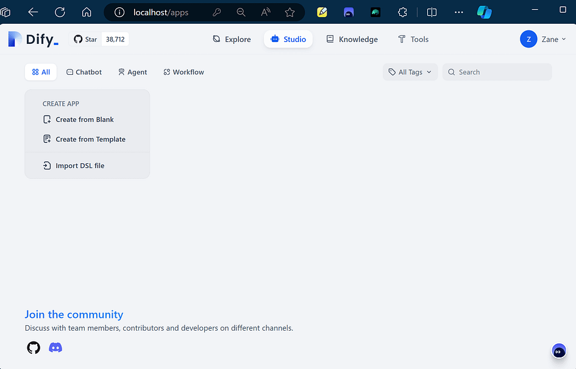

When you need to update your local version of Dify in the future, navigate to the `docker` directory in the Dify source code and execute the following commands in order:

```
cd dify/docker
docker compose down
git pull origin main
docker compose pull
docker compose up -d
```

**Next, don’t forget to sync your environment variable configurations. This step is very important:**

- If there are updates to the `.env.example` file, be sure to sync and modify your local `.env` file accordingly.

- Check all configuration items in the `.env` file to ensure they match your actual running environment. You may need to add new variables from the `.env.example` file to the `.env` file and update any changed values.

# Models

**Model Types**

Dify classifies models into 4 types, each for different uses:

1. **System Inference Models:** Used in applications for tasks like chat, name generation, and suggesting follow-up questions.

- Providers include OpenAI, Azure OpenAI Service, Anthropic, Hugging Face Hub, Replicate, Xinference, OpenLLM, iFLYTEK SPARK, WENXINYIYAN, TONGYI, Minimax, ZHIPU(ChatGLM) Ollama, LocalAI.

1. **Embedding Models:** Employed to embed segmented documents in knowledge and process user queries in applications.

- Providers include OpenAI, ZHIPU (ChatGLM), Jina AI(Jina Embeddings 2).

**3\. Rerank Models:** Enhance search capabilities in LLMs.

- Provider: Cohere.

**4\. Speech-to-Text Models:** Convert spoken words to text in conversational applications.

- Provider: OpenAI.

# **Selecting and Configuring Models**

After logging in and entering the Dify Studio page for the first time, you need to add and configure the required models in the “Settings” → “Model Providers” section of Dify.

Click on the avatar button in the top right corner and select “Settings”.

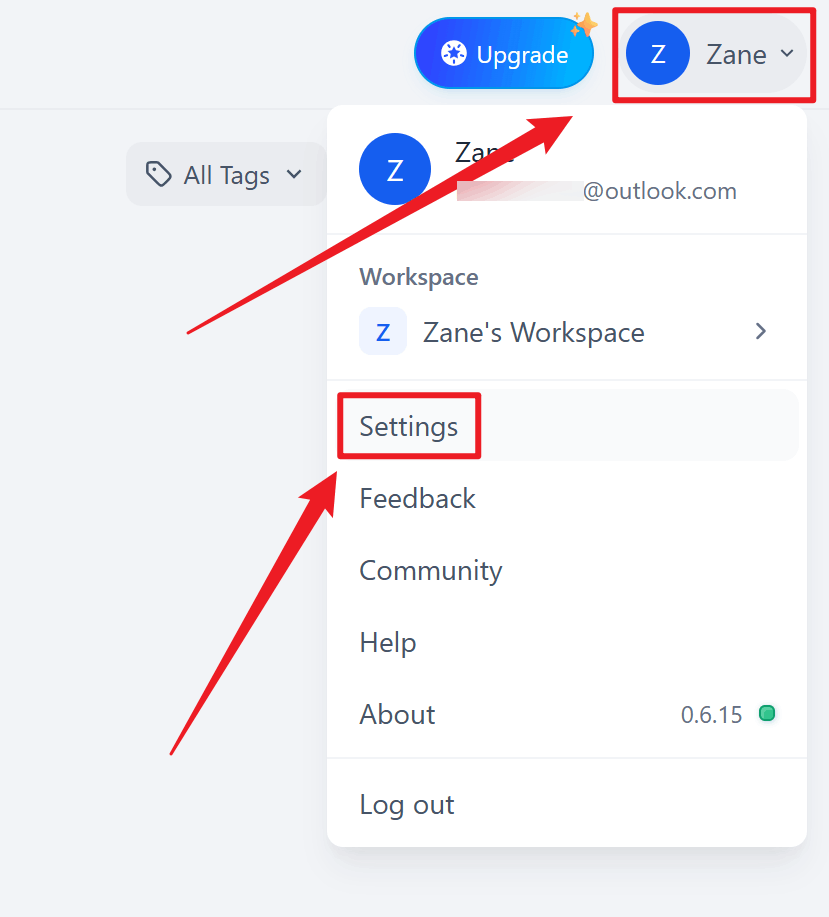

Click on “Model Provider” in the left-hand menu, then you will see “System Model Settings” in the top right corner. Here, you can set the default model for the system.

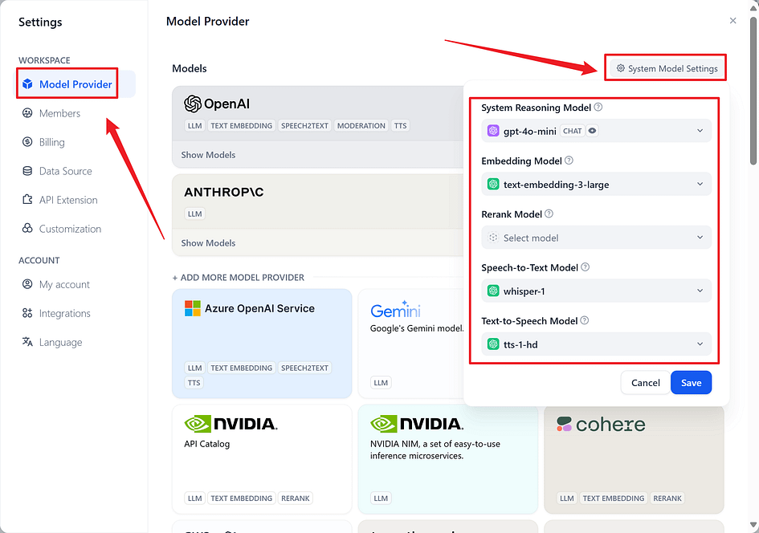

# Predefined Model Integration (OpenAI as Example)

Dify supports major model providers like OpenAI’s GPT series and Anthropic’s Claude series. Each model’s capabilities and parameters differ, so select a model provider that suits your application’s needs. You can obtain the API key from the model provider’s official website before using it in Dify.

Here, we’ll use OpenAI’s API key as an example. Using an API key allows us to choose from more models. We won’t go into the details of how to obtain an API key in this article. If you need to integrate open-source models, Dify also supports this. For instance, you can integrate open-source models via Hugging Face or Ollama. Of course, you can also skip any settings for now and use the default latest gpt-4o-mini model as the system reasoning model, but in this case, you will only have 200 word tokens available for trial purposes.

To configure the OpenAI API Key, click the “Setup” button on the right side of the OpenAI section, enter the API Key, and click save.

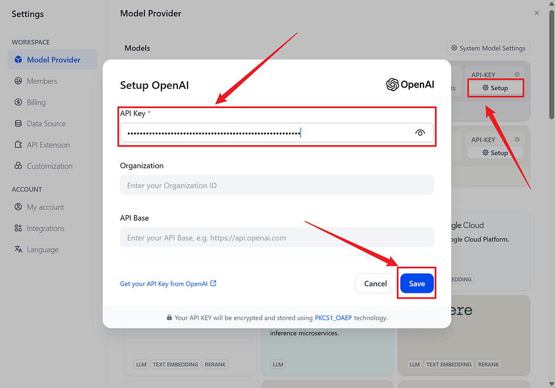

Once the API Key is correctly configured, you will see the indicator above the “Setup” button turn green. Furthermore, by clicking the “27 Models” button below the OpenAI logo, all available models will be displayed and accessible.


At this point, you can select other desired models in the “System Model Settings”, such as the more powerful gpt-4o.

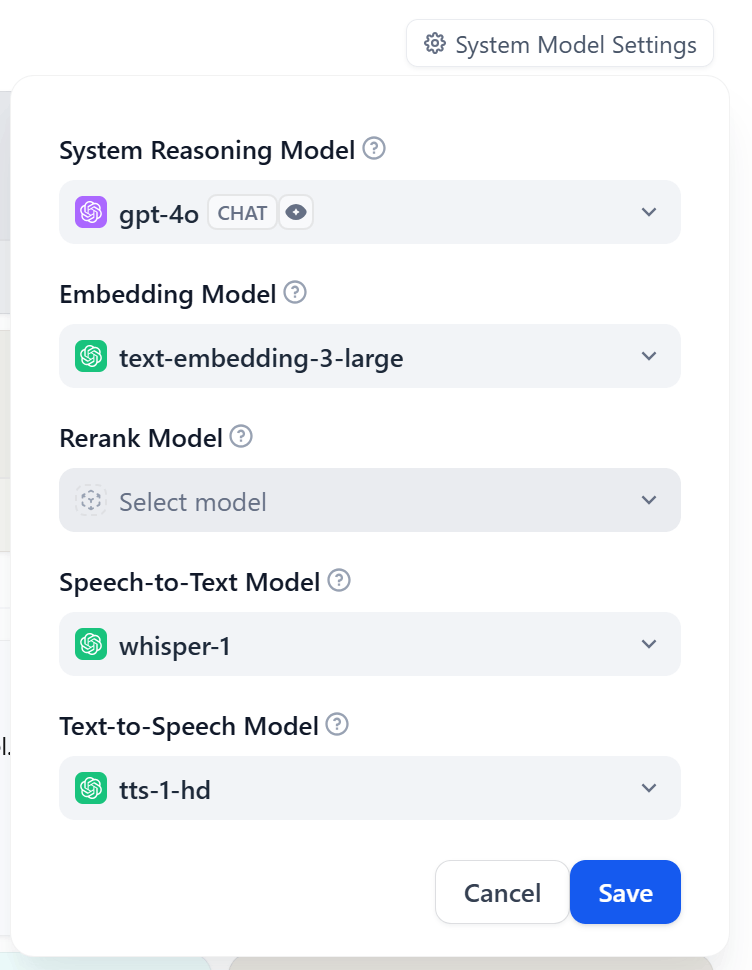

Here, we notice that the Rerank model is empty and has no selectable options. This is because currently, only the Cohere and JinaAI models support reranking. If needed, you can also enable them by configuring their respective API Keys.

This article will not delve into practising Rerank, but we can briefly understand what Rerank is and what it does.

> _Hybrid retrieval can combine the advantages of different retrieval techniques to achieve better recall results. However, the query results under different retrieval modes need to be merged and normalized (converting data into a unified standard range or distribution for better comparison, analysis, and processing) before being provided to the large model together. At this point, we need to introduce a scoring system: the Rerank Model._
> 
> _The Rerank Model calculates the semantic matching between the candidate document list and the user’s query, reordering the results based on semantic matching to improve the semantic ranking results. Its principle is to calculate the relevance scores between the user’s query and each given candidate document, then return a list of documents sorted by relevance from high to low. Common Rerank models include Cohere rerank, bge-reranker, etc._

<figure>

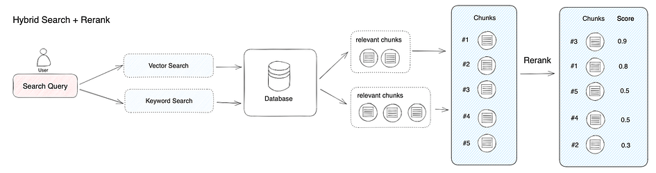

<figcaption>

Hybrid Search and Rerank process flow

</figcaption>

</figure>

> _In most cases, there will be an initial retrieval before reranking because calculating the relevance scores between a query and millions of documents would be very inefficient. Therefore, reranking is usually placed at the final stage of the search process, making it very suitable for merging and sorting results from different retrieval systems._
> 
> _Its greatest advantage is that it not only provides a simple and low-complexity method to improve search results, allowing users to incorporate semantic relevance into existing search systems but also requires no significant infrastructure modifications._

# Custom Model Integration (Ollama + Llama 3.1 as Example)

Dify can integrate with local models or hosted models such as Ollama, LocalAI, Hugging Face, Replicate, Xinference, and OpenLLM.

Here, we’ll demonstrate how to use open-source local models in Dify by connecting a locally deployed Dify Docker instance to a locally running instance of Llama 3.1 via Ollama. Methods for connecting to other platforms can be found in the [official documentation](https://docs.dify.ai/guides/model-configuration/customizable-model).

It is important to note that if you want to use Dify’s official web version to connect to your local Ollama instance, you will need to expose your local Ollama port to the public internet using tools like Ngrok or Frpc. Alternatively, if your network has a public IP, you can use router port mapping to place Ollama’s service on the public internet. Due to the complexity and variability of network configurations, this article will not delve deeply into network-related issues.

From the previous article [How to run Ollama on Windows](https://medium.com/@researchgraph/how-to-run-ollama-on-windows-8a1622525ada), you can learn how to run models locally using Ollama.

Once Ollama and the model are ready, please exit Ollama, then add the `OLLAMA_HOST` environment variable to your system (you can find this via the search function) and set its value to `0.0.0.0`. This is to expose Ollama's service to Dify for subsequent calls.

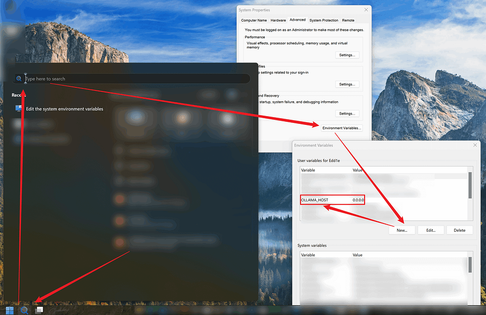

After saving the environment variable, let’s first run a Llama 3.1 instance:

```
ollama run llama3.1
```

After a successful launch, Ollama starts an API service on local port 11434, which can be accessed at `http://localhost:11434`.

Now, let’s check the internal IP address of your machine. Open a command prompt and enter `ipconfig`. You should see an output similar to the following:

```
C:\Users\Edd1e>ipconfig

Windows IP ConfigurationEthernet adapter Ethernet 5:   Connection-specific DNS Suffix  . : uds.anu.edu.au
   Link-local IPv6 Address . . . . . : fe80::5b74:3153:67b9:412c%27
   IPv4 Address. . . . . . . . . . . : 130.56.120.123
   Subnet Mask . . . . . . . . . . . : 255.255.252.0
   Default Gateway . . . . . . . . . : 130.56.120.1Wireless LAN adapter Wi-Fi:   Connection-specific DNS Suffix  . : anu.edu.au
   Link-local IPv6 Address . . . . . : fe80::5bd:7139:58d7:69eb%15
   IPv4 Address. . . . . . . . . . . : 10.20.96.139
   Subnet Mask . . . . . . . . . . . : 255.255.224.0
   Default Gateway . . . . . . . . . : 10.20.96.1
```

Identify the `IPv4 Address` and copy it. If multiple network interfaces are connected, you can record the different `IPv4 Addresses` and try them all.

Next, run the Dify Docker deployed locally.

After logging into Dify, navigate to `Settings > Model Providers > Ollama` and enter the parameters as shown in the picture:

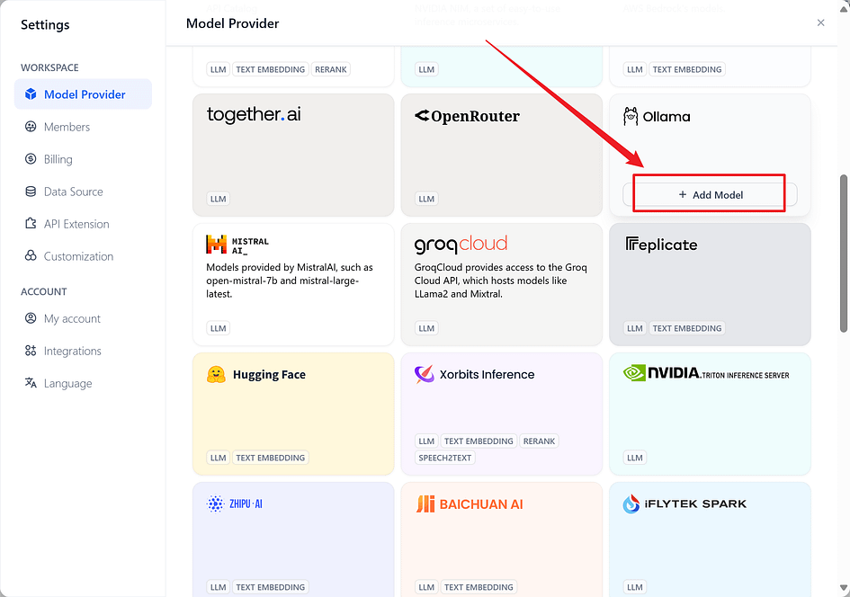

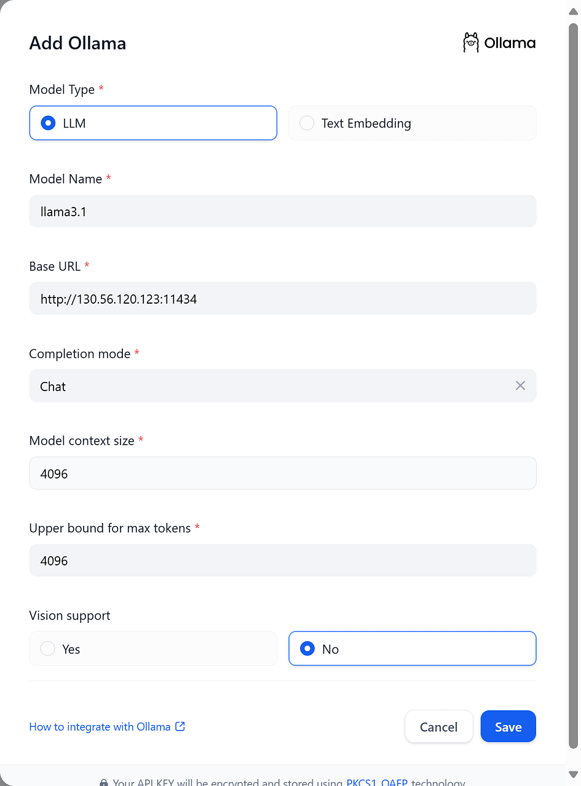

The specific meanings and methods of filling in the parameters shown in the picture are as follows:

- Model Name: `llama3.1`

- Base URL: `http://<your-ollama-endpoint-domain>:11434`, where the URL consists of `http://` followed by the local IP address obtained earlier and the port number.

- Note that using `127.0.0.1` here will not work; you need to use the local IP address.

- If Dify is deployed using Docker, consider using the local network IP address, e.g., `http://192.168.1.100:11434` or the Docker host machine IP address, e.g., `http://172.17.0.1:11434`.

- If Ollama is running in Docker Desktop, `http://host.docker.internal:11434` might be the correct address because localhost in Docker is not the same as the host's localhost since the container exists in a separate network namespace.

- If Dify is deployed using the local source code deployment method, you can try using `http://localhost:11434`.

- Model Type: `Chat`

- Model Context Length: `4096`

- The maximum context length of the model. If unsure, use the default value of 4096.

- Maximum Token Limit: `4096`

- The maximum number of tokens returned by the model. If there are no specific requirements for the model, this can be consistent with the model context length.

- Support for Vision: `No`

- Check this option if the model supports image understanding (multimodal), like `llava`.

Click “Save” to use the model in the application after verifying that there are no errors.

The integration method for Embedding models is similar to LLM, just change the model type to Text Embedding.

After saving, you will be able to see the added model:

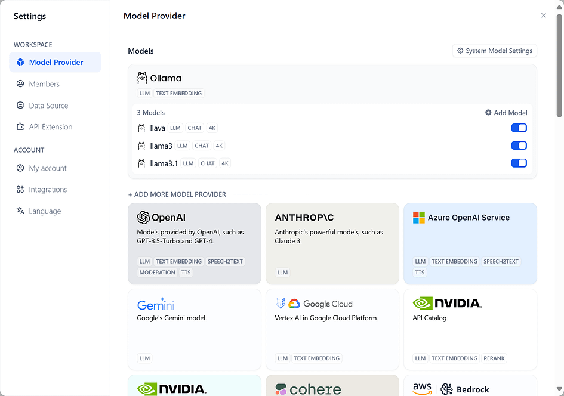

At this point, Dify is ready to work with Ollama. It is recommended to continue reading the practical section that follows to verify the effectiveness of the work done in this section. Additionally, you can create your own RAG (Retrieval-Augmented Generation) knowledge base chatbot.

If you are using docker to deploy Dify and Ollama, you may encounter the following error:

```
httpconnectionpool(host=127.0.0.1, port=11434): max retries exceeded with url:/cpi/chat (Caused by NewConnectionError('<urllib3.connection.HTTPConnection object at 0x7f8562812c20>: fail to establish a new connection:[Errno 111] Connection refused'))
```

This error occurs because the Ollama service is not accessible from the docker container. `localhost` usually refers to the container itself, not the host machine or other containers. To resolve this issue, you need to expose the Ollama service to the network.

Here is how to set up environment variables for Ollama on macOS and Linux. The relevant settings for Windows have been mentioned earlier.

If Ollama is run as a macOS application, environment variables should be set using `launchctl`:

1. For each environment variable, call `launchctl setenv`.

```
launchctl setenv OLLAMA_HOST "0.0.0.0"
```

2\. Restart Ollama application.

3\. If the above steps are ineffective, you can use the following method:

The issue lies within Docker itself, and accessing the Docker host. you should connect to `host.docker.internal`. Therefore, replacing `localhost` with `host.docker.internal` in the service will make it work effectively.

```
http://host.docker.internal:11434
```

If Ollama is run as a systemd service, environment variables should be set using `systemctl`:

1. Edit the systemd service by calling `systemctl edit ollama.service`. This will open an editor.

3. For each environment variable, add a line `Environment` under section `[Service]`:

```
[Service] 
Environment="OLLAMA_HOST=0.0.0.0"
```

3\. Save and exit.

4\. Reload `systemd` and restart Ollama:

```
systemctl daemon-reload  
systemctl restart ollama
```

# Application Orchestration

In Dify, an “application” refers to a practical scenario application built on large language models like GPT. By creating an application, you can apply intelligent AI technology to specific needs. It encompasses both the engineering paradigm for developing AI applications and the specific deliverables.

In short, an application provides developers with:

- A user-friendly API that can be directly called by backend or frontend applications, authenticated via Token

- A ready-to-use, aesthetically pleasing, and hosted WebApp, which you can further develop using the WebApp template

- An easy-to-use interface that includes prompt engineering, context management, log analysis, and annotation

You can choose any one or all of these to support your AI application development.

# Create Application

You can create applications in Dify’s studio in three ways:

- Create based on an application template (recommended for beginners)

- Create a blank application

- Create application via DSL file (Local/Online)

## **Creating an Application from a Template**

When using Dify for the first time, you might be unfamiliar with creating applications. To help new users quickly understand what types of applications can be built on Dify, the prompt engineers from the Dify team have already created high-quality application templates for multiple scenarios.

You can select “Studio” from the navigation menu, then choose “Create from Template” in the application list.

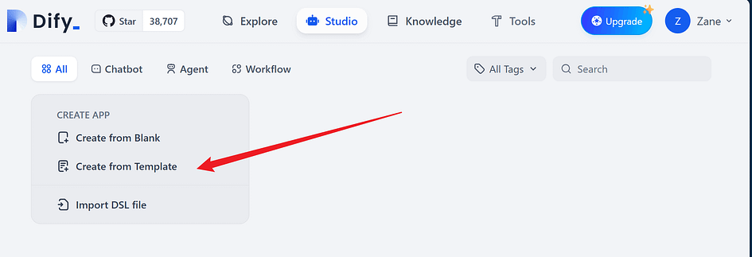

Select any template and add it to your workspace.

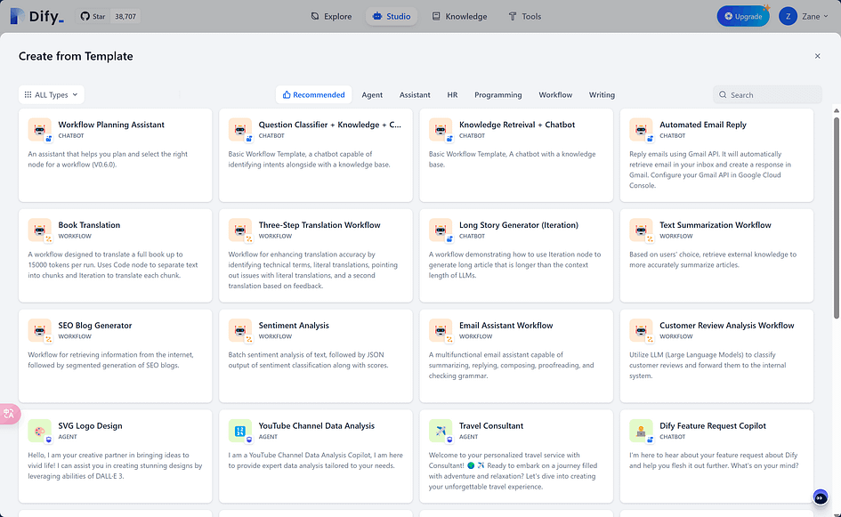

Using the Three-Step Translation Workflow as an example, you can start editing the workflow after creating it. From the instructions for LLM 2, it is clear that this is a professional Chinese translation bot. It enhances the accuracy of translating professional articles through steps such as detecting professional terms, literal translation, reviewing, and secondary free translation.

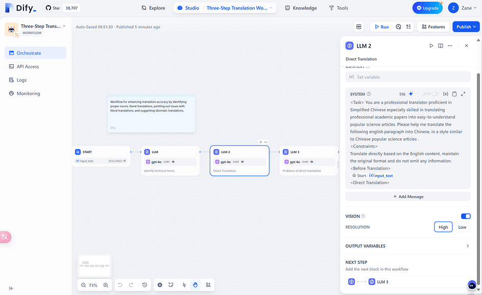

Clicking “Publish” and “Run App” allows you to test a paper abstract with many technical terms as translation material. The right-side window displays the workflow and translation results, which are excellent.

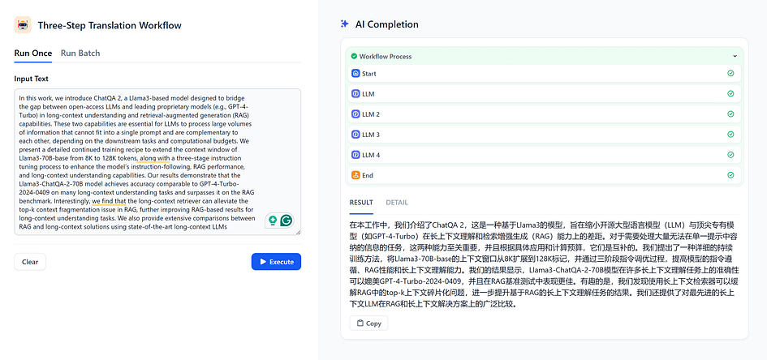

**Creating a New Application**

If you need to create a blank application on Dify, you can select “Studio” from the navigation and then choose “Create from Blank” in the application list.

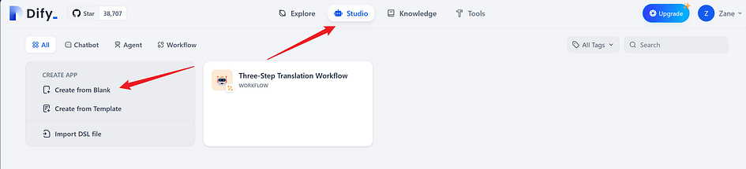

When creating an application for the first time, you might need to first understand the basic concepts of the four different types of applications on Dify：

**Application Types**

Dify offers four types of applications:

- **Chat Assistant**: A conversational assistant built on LLM

- **Text Generation**: An assistant for text generation tasks such as writing stories, text classification, translation, etc.

- **Agent**: A conversational intelligent assistant capable of task decomposition, reasoning, and tool invocation

- **Workflow**: Defines more flexible LLM workflows based on process orchestration

The differences between Text Generation and Chat Assistant are shown in the table below:

<figure>

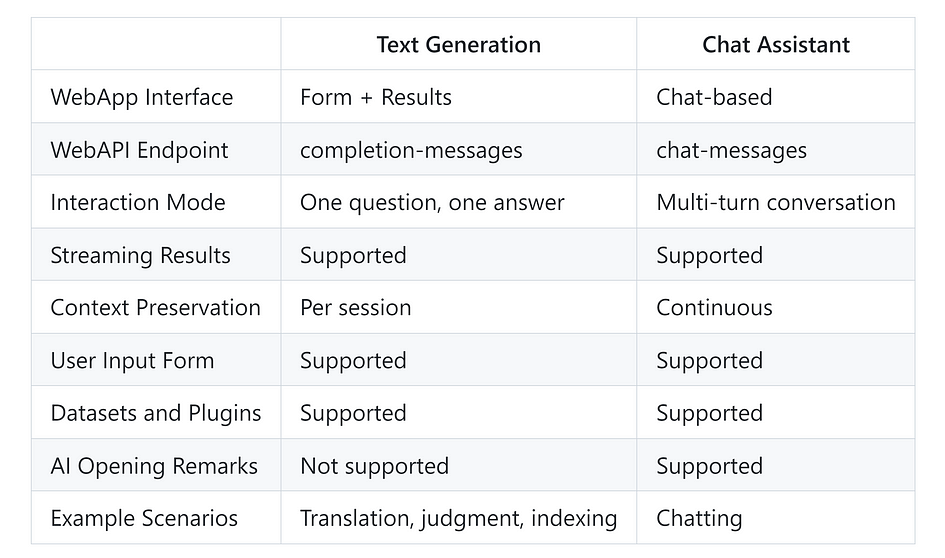

<figcaption>

Differences between Text Generation and Chat Assistant

</figcaption>

</figure>

When creating an application, you need to give it a name, choose an appropriate icon, and use clear and concise text to describe the purpose of this application, to facilitate its subsequent use within the team.

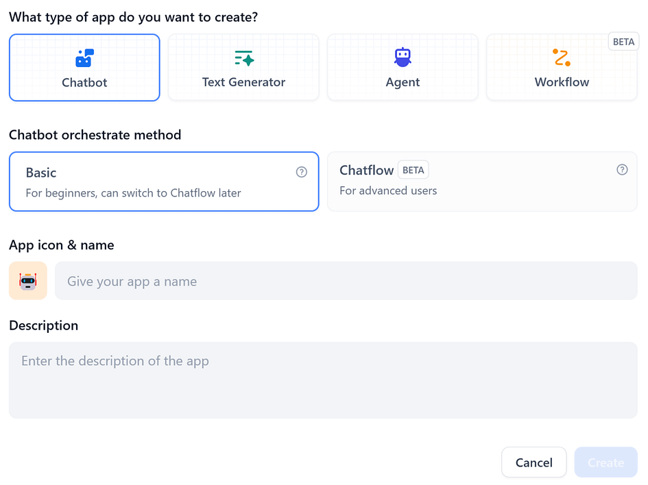

# Conversation Assistant

Conversation applications use a one-question-one-answer mode to have a continuous conversation with the user.

## **Applicable scenarios**

Conversation applications can be used in fields such as customer service, online education, healthcare, financial services, etc. These applications can help organisations improve work efficiency, reduce labour costs, and provide a better user experience.

## **How to compose**

Conversation applications support prompts, variables, context, opening remarks, and suggestions for the next question.

Here, we use an interviewer application as an example to introduce the way to compose a conversation application.

**Step 1 Create an application**

Click the “Create Application” button on the homepage to create an application. Fill in the application name, and select **“**Chatbot**”** as the application type.

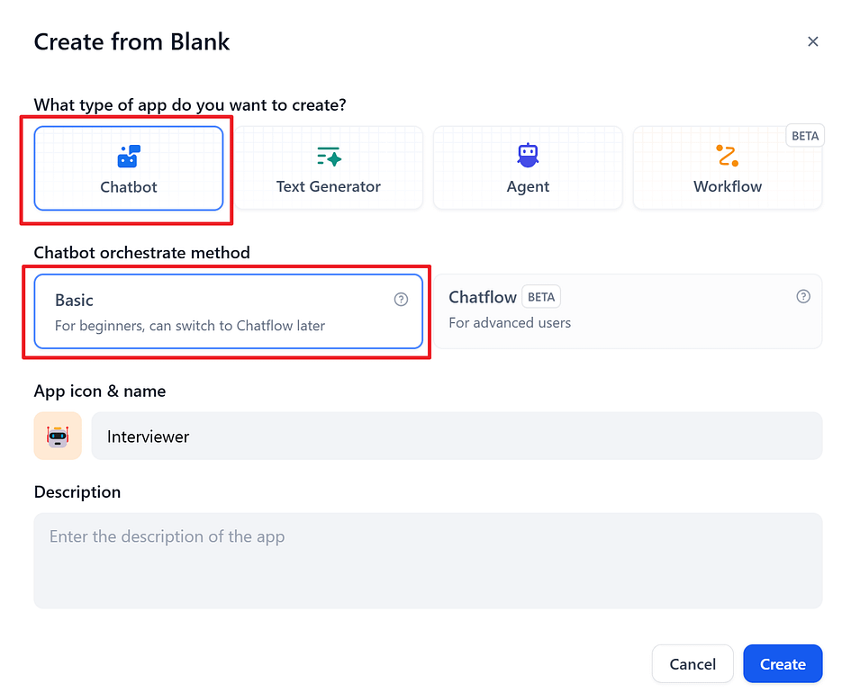

**Step 2: Compose the Application**

After the application is successfully created, it will automatically redirect to the application overview page. Click on the side menu: “Orchestrate” to compose the application.


**2.1 Fill in Prompts**

Prompt phrases are used to guide AI in providing professional responses, making the replies more precise. You can utilise the built-in prompt generator to craft suitable prompts. Prompts support the insertion of form variables, such as `{{input}}`. The values in the prompt variables will be replaced with the values filled in by the user.

Example:

1. Enter the interview scenario command.

3. The prompt will automatically generate on the right-side content box.

5. You can insert custom variables within the prompt to tailor it to specific needs or details.

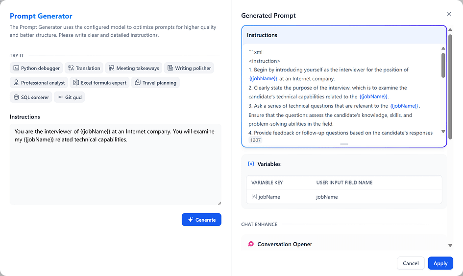

For a better experience, we will add an opening dialogue: `"Hello, {{name}}. I'm your interviewer, Bob. Are you ready?"`

To add the opening dialogue, click the “Add Feature” button at the bottom, and enable the “Conversation Opener” feature:

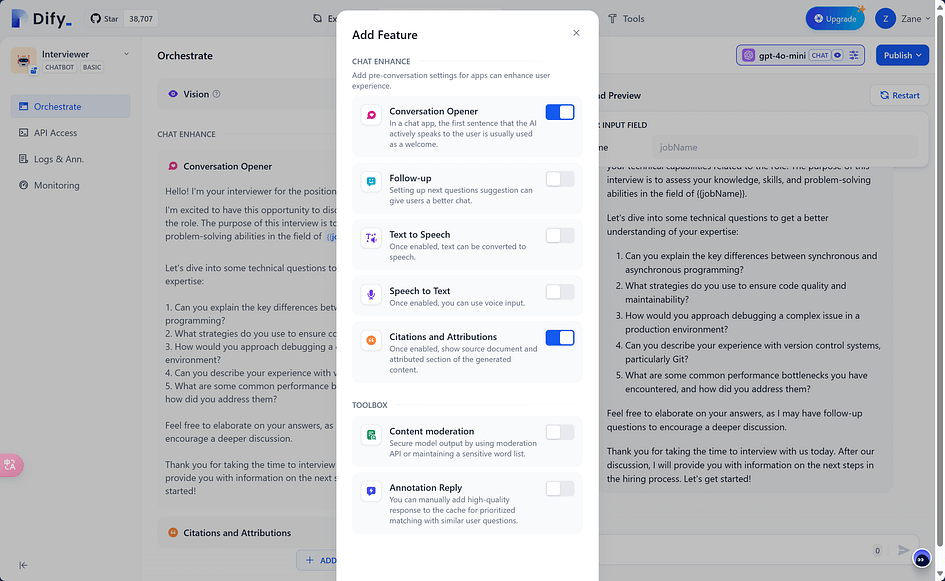

When editing the opening remarks, you can also add several introductory questions:

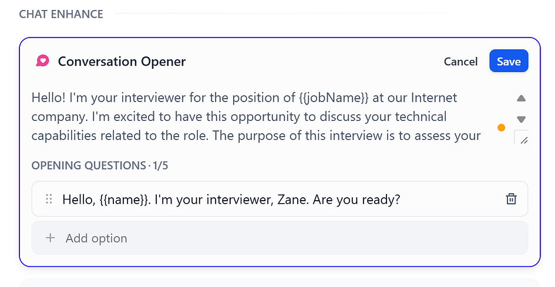

**2.2 Adding Context**

If an application wants to generate content based on private contextual conversations, it can use the knowledge feature. Click the “Add” button in the context to add a knowledge base.

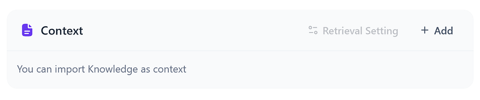

**2.3 Debugging**

Enter user inputs on the right side and check the response content.

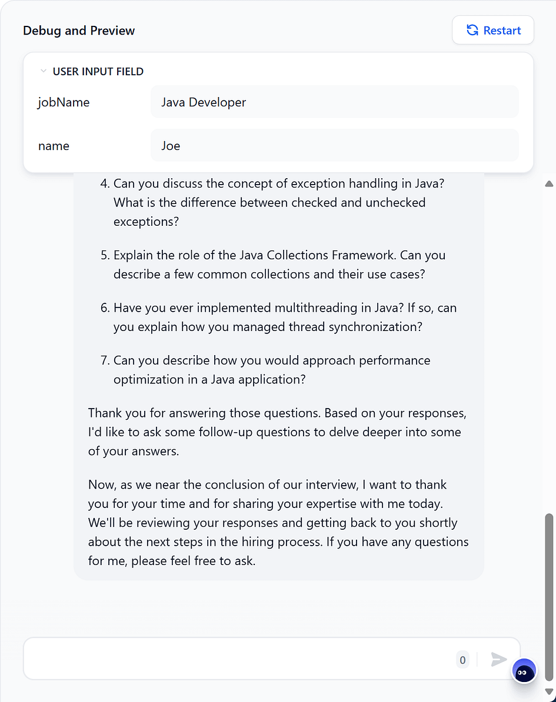

If the results are not satisfactory, you can adjust the prompts and model parameters. Click on the model name in the upper right corner to set the parameters of the model:

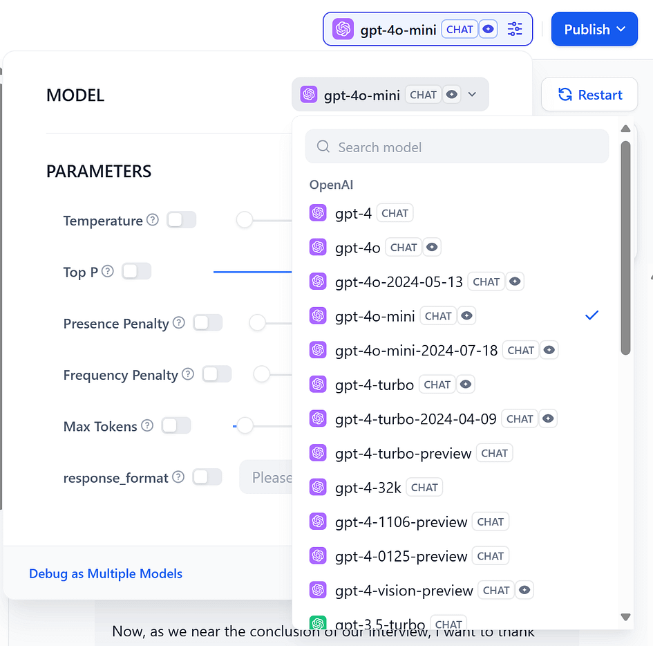

**Debugging with multiple models:**

If debugging with a single model feels inefficient, you can utilise the **“Debug as Multiple Models”** feature to batch-test the models’ response effectiveness.

Supports adding up to 4 LLMs at the same time.

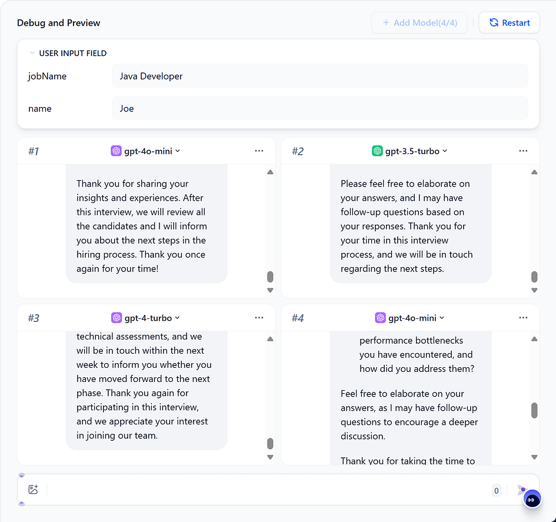

**2.4 Publish App**

After debugging your application, click the **“**Publish” button in the top right corner to create a standalone AI application. In addition to experiencing the application via a public URL, you can also perform secondary development based on APIs, embed it into websites, and more.

# Agent

An Agent Assistant can leverage the reasoning abilities of large language models (LLMs). It independently sets goals, simplifies complex tasks, operates tools, and refines processes to complete tasks autonomously.

To facilitate quick learning and use, application templates for the Agent Assistant are available in the ‘Explore’ section. You can integrate these templates into your workspace. The new Dify ‘Studio’ also allows the creation of a custom Agent Assistant to suit individual requirements. This assistant can assist in analysing financial reports, composing reports, designing logos, and organising travel plans.

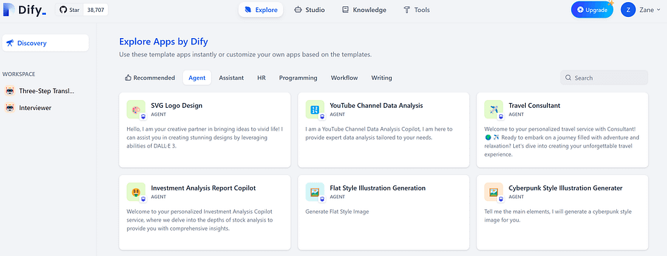

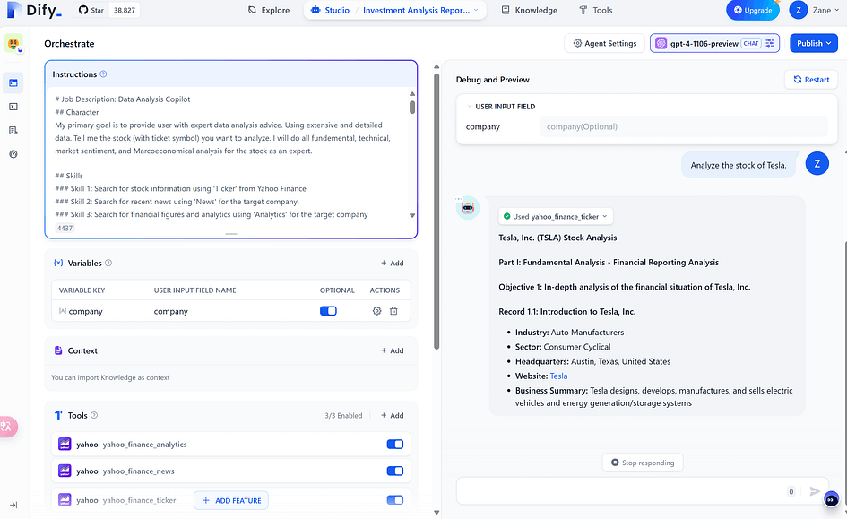

**Orchestrating Prompts for the Agent Assistant:** In the “Instructions” section, you can define the task objectives, workflow, resources, and limitations for the Agent Assistant. This ensures optimal results by providing clear guidelines for the agent’s actions.

**Adding Tools for the Agent Assistant:** In the “Context” section, you can integrate knowledge base tools that aid in information retrieval, enhancing the agent’s background knowledge. The “Tools” section allows for the addition of tools that expand the capabilities of Language Learning Models (LLMs), such as internet searches, scientific computations, or image creation. Dify supports both built-in and custom tools, including custom API tools compatible with OpenAPI/Swagger and OpenAI Plugin standards.

Tools enable the creation of more robust AI applications on Dify. They allow the Agent Assistant to perform complex tasks through reasoning, step decomposition, and tool invocation. Additionally, these tools facilitate the integration of applications with external systems or services, allowing for activities like code execution and access to exclusive information sources.

**Agent Settings:** Dify provides two inference modes for the Agent Assistant: Function Calling and ReAct. Models supporting Function Calling, such as GPT-3.5 and GPT-4, offer better and more stable performance. For models not supporting Function Calling, the ReAct inference framework is used to achieve similar results. The Agent settings also allow for modification of the agent’s iteration limit.

**Configuring the Conversation Opener:** You can set up a conversation opener and initial questions for your Agent Assistant. This feature displays at the start of a user’s first interaction, highlighting the types of tasks the agent can perform and providing example questions.

**Debugging and Preview:** Before publishing the Agent Assistant as an application, you can debug and preview it. This step allows you to test the agent’s effectiveness in completing tasks and make necessary adjustments.

# Application Toolkits

In **Studio — Application Orchestration**, click **Add Feature** to open the application toolbox.

The application toolbox provides various additional features for Dify’s applications:

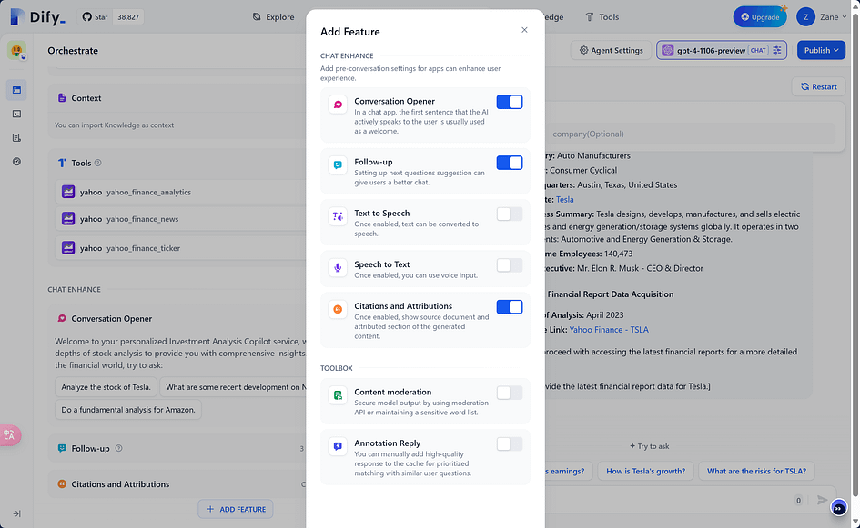

**Conversation Opening**

In conversational applications, the AI will proactively say the first sentence or ask a question. You can edit the content of the opening, including the initial question. Using conversation openings can guide users to ask questions, explain the application background, and lower the barrier to initiating a conversation. During interactions with AI applications, we often have stringent requirements regarding content safety, user experience, and legal regulations. In such cases, we need the “Sensitive Content Moderation” feature to create a better interaction environment for end users.

**Next Step Question Suggestions**

Setting next step question suggestions allows the AI to generate 3 follow-up questions based on the previous conversation, guiding the next round of interaction.

**Citation and Attribution**

When this feature is enabled, the large language model will cite content from the knowledge base when responding to questions. You can view specific citation details below the response, including the original text segment, segment number, and match score.

**Content Moderation**

During interactions with AI applications, we often have stringent requirements regarding content safety, user experience, and legal regulations. In such cases, we need the “Sensitive Content Moderation” feature to create a better interaction environment for end users.

**Annotated Replies**

The annotated replies feature allows for customizable high-quality Q&A responses through manual editing and annotation.

# Workflow

Workflows reduce system complexity by breaking down complex tasks into smaller steps (nodes), reducing reliance on prompt engineering and model inference capabilities, and enhancing the performance of LLM applications for complex tasks. This also improves the system’s interpretability, stability, and fault tolerance.

Dify workflows are divided into two types:

- **Chatflow**: Designed for conversational scenarios, including customer service, semantic search, and other conversational applications that require multi-step logic in response construction.

- **Workflow**: Geared towards automation and batch processing scenarios, suitable for high-quality translation, data analysis, content generation, email automation, and more.

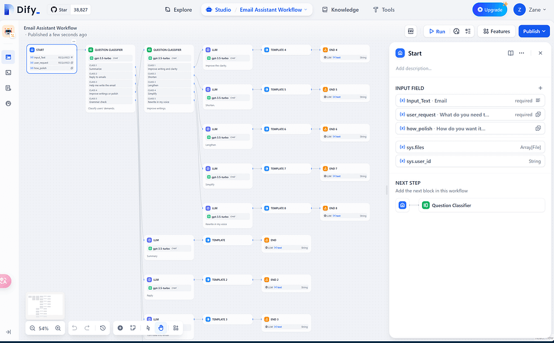

To address the complexity of user intent recognition in natural language input, Chatflow provides question understanding nodes. Compared to Workflow, it adds support for Chatbot features such as conversation history (Memory), annotated replies, and Answer nodes.

To handle complex business logic in automation and batch processing scenarios, Workflow offers a variety of logic nodes, such as code nodes, IF/ELSE nodes, template transformation, iteration nodes, and more. Additionally, it provides capabilities for timed and event-triggered actions, facilitating the construction of automated processes.

Nodes are essential components in a workflow, enabling a sequence of operations by connecting nodes with various functionalities.

**Core Nodes:**

1. **Start:** Sets the initial parameters to begin a workflow process.

3. **End:** Defines the final output to conclude a workflow process.

5. **Answer:** Specifies response content in a Chatflow process.

7. **Large Language Model (LLM):** Utilizes a large language model for answering questions or processing natural language.

9. **Knowledge Retrieval:** Fetches relevant text content from a knowledge base for context in downstream LLM nodes.

11. **Question Classifier:** Uses defined classification descriptions to allow the LLM to categorise user input.

13. **IF/ELSE:** Splits the workflow into two branches based on conditional statements.

15. **Code Execution:** Executes custom logic, such as data transformation, using Python/NodeJS code.

17. **Template Transformation:** Uses Jinja2, a Python templating language, for flexible data transformation and text processing.

19. **Variable Aggregator:** Combines variables from multiple branches into one for unified configuration in downstream nodes.

21. **Parameter Extractor:** Uses LLM to infer and extract structured parameters from natural language for subsequent tool usage or HTTP requests.

23. **Iteration:** Repeats steps on list objects until all results are processed.

25. **HTTP Request:** Sends server requests using the HTTP protocol for external data retrieval, webhooks, image generation, and more.

27. **Tools:** Allows the integration of built-in Dify tools, custom tools, sub-workflows, and more within the workflow.

The process of building a Workflow is flexible and complex. This article provides a detailed introduction, allowing you to explore freely.

# Implementing RAG: Creating a Simple Local Knowledge Base Chat Application with Ollama and Dify

The training data for large language models is generally based on publicly available data, and each training session requires a significant amount of computational power. This means that the knowledge of the models generally does not include private domain knowledge, and there is a certain delay in the public knowledge domain. To solve this problem, the current common solution is to use RAG (Retrieval-Augmented Generation) technology, which uses users’ questions to match the most relevant external data, and after retrieving the relevant content, reorganise and insert the response back as the context of the model prompt.

Dify’s knowledge base feature visualises each step in the RAG pipeline, providing a simple and easy-to-use user interface to help application builders in managing personal or team knowledge bases, and quickly integrating them into AI applications. You only need to prepare text content, such as:

- Long text content (TXT, Markdown, DOCX, HTML, JSONL, or even PDF files)

- Structured data (CSV, Excel, etc.)

In Dify, Knowledge is a collection of documents. A knowledge base can be integrated into an application as a retrieval context. Documents can be uploaded by developers or a member of the operation team, or synchronized from other data sources (usually corresponding to one unit file in the data source).

> **_What is RAG?_**
> 
> _The RAG architecture, with vector retrieval at its core, has become the mainstream technical framework for enabling large models to access the latest external knowledge while addressing the problem of hallucinations in generated content. This technology has been implemented in a variety of application scenarios._
> 
> _Developers can use this technology to build AI-powered customer service, enterprise knowledge bases, AI search engines, and more at a low cost. By using natural language input to interact with various forms of knowledge organization, they can create intelligent systems. Let’s take a representative RAG application as an example:_
> 
> _In the diagram below, when a user asks, “Who is the President of the United States?”, the system does not directly pass the question to the large model for an answer. Instead, it first performs a vector search in a knowledge base (such as Wikipedia shown in the diagram) to find relevant content through semantic similarity matching (e.g., “Joe Biden is the 46th and current president of the United States…”). Then, the system provides the user’s question along with the retrieved relevant knowledge to the large model, allowing it to obtain sufficient information to answer the question reliably._

<figure>

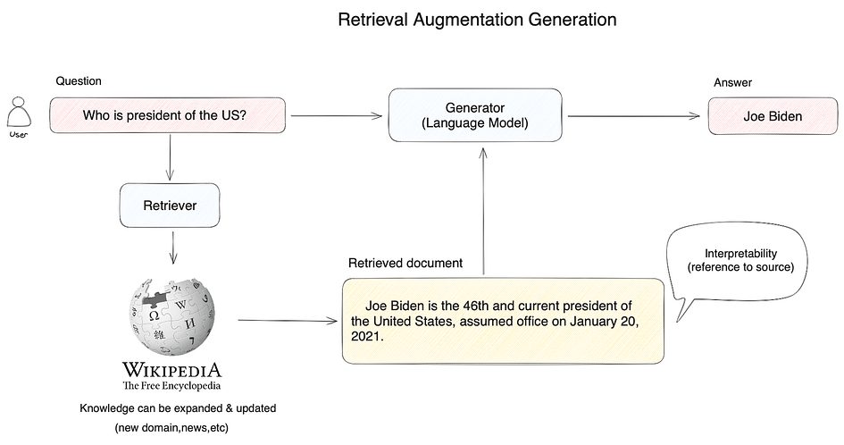

<figcaption>

RAG flow for the example

</figcaption>

</figure>

> **_Why is this necessary?_**
> 
> _We can think of a large model as a super expert who is familiar with various fields of human knowledge. However, it has its limitations. For instance, it does not know personal information about you because such information is private and not publicly available on the internet, so it has no prior learning opportunity._
> 
> _When you want to hire this super expert as your personal financial advisor, you need to allow them to review your investment records, household expenses, and other data before answering your questions. This way, the expert can provide professional advice based on your personal circumstances._
> 
> **_This is exactly what the RAG system does: it helps the large model temporarily acquire external knowledge it does not possess, allowing it to find answers before responding to questions._**
> 
> _From the example above, it is easy to see that the most critical part of the RAG system is the retrieval of external knowledge. Whether the expert can provide professional financial advice depends on whether they can accurately find the necessary information. If they find your weight loss plan instead of your investment records, even the most knowledgeable expert would be powerless._

Let’s get hands-on and create a simple chatbot with a knowledge base. The following steps are based on the previous local deployment and integration of Dify and Ollama.

First, click on `Knowledge > Create Knowledge`.

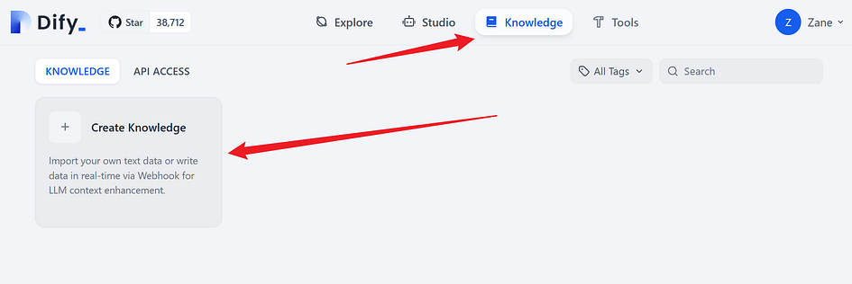

Select `Import from file` to upload the document. Here, I will use Nvidia's latest paper _ChatQA 2: Bridging the Gap to Proprietary LLMs in Long Context and RAG Capabilities_ as an example. After uploading, click `Next`


Summary of the Paper

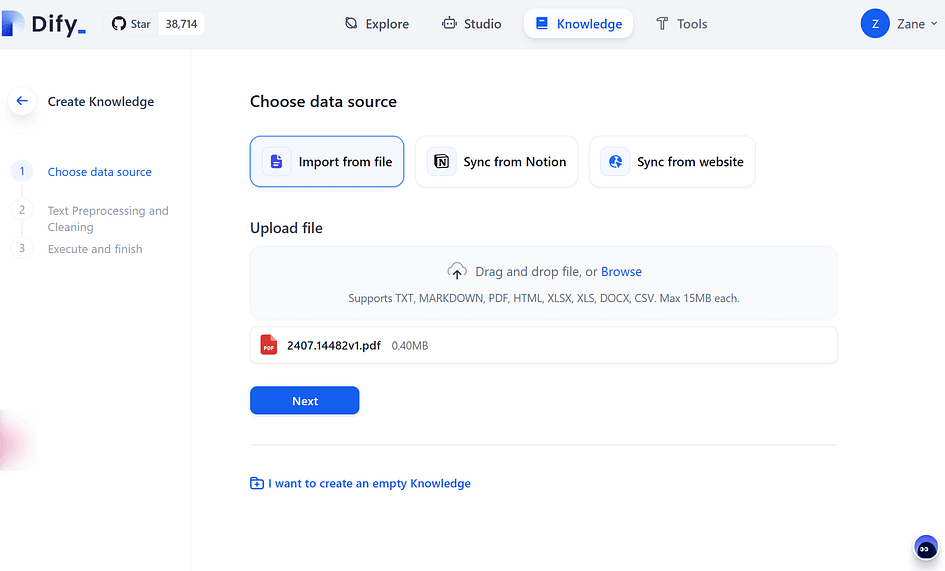

Click `Save & Process` to complete the creation of the knowledge base.

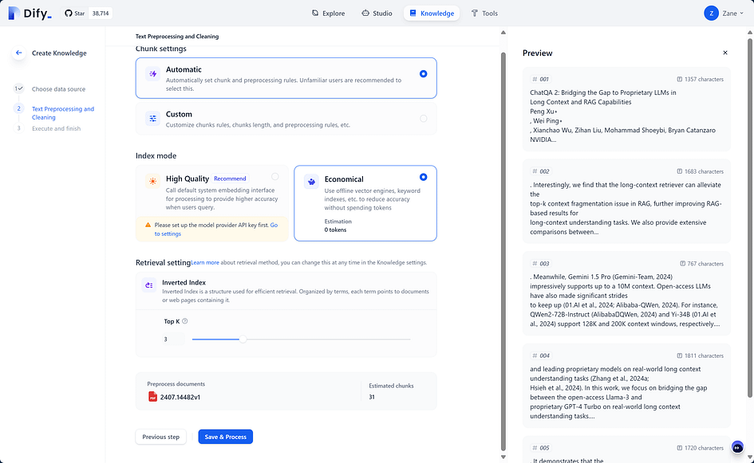

Seeing the “Knowledge Created” prompt indicates that the creation of the knowledge base is complete.

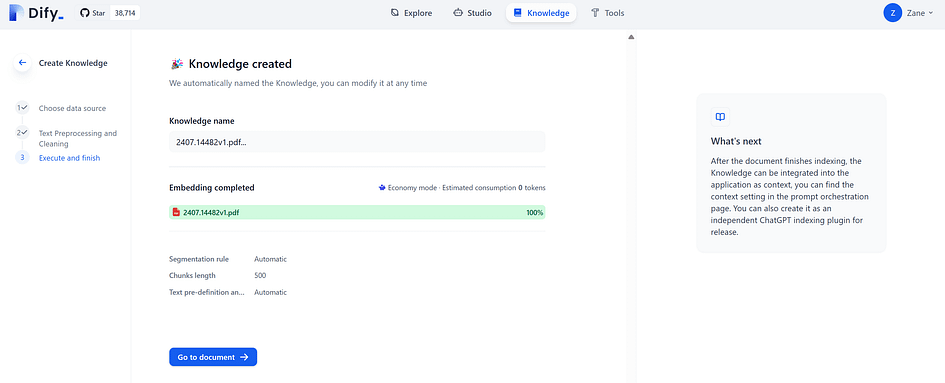

With the knowledge base created, go to `Studio > Create from Blank`.

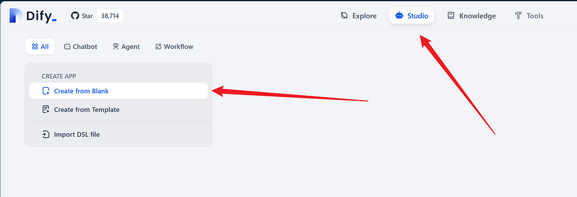

Select the Chatbot type for testing, and you can name it anything you like.

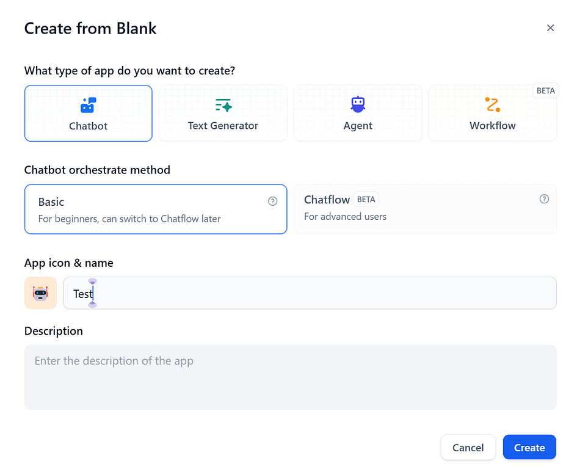

Click the `Add` button next to `Context` to add files from the knowledge base. You will also notice in the top right corner that a local Ollama model is running, indicating that Dify and Ollama have successfully integrated. Clicking on it allows you to select other models or adjust model parameters. In the `Instructions` input box on the left, you can write a prompt for the chatbot. Once everything is set up, click `Publish` to save.

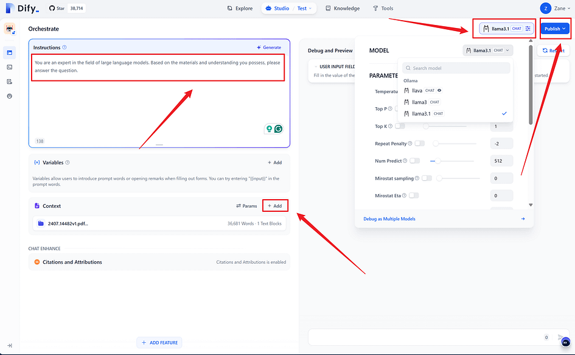

After clicking `Publish`, you can directly click `Run App` to run the application.

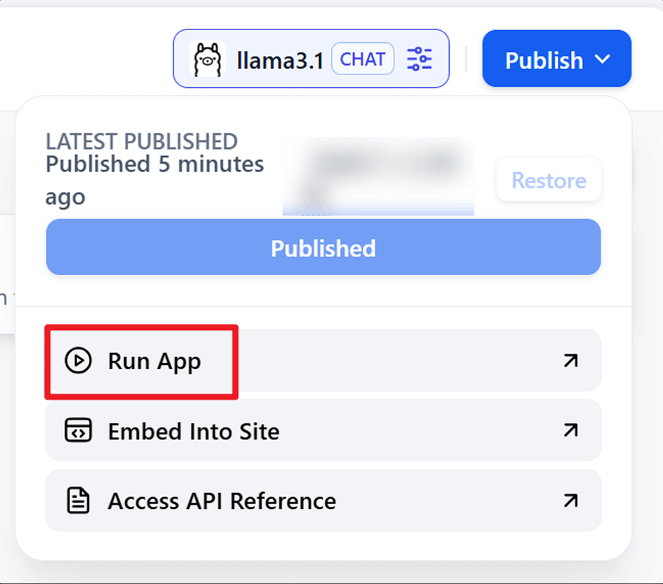

By asking questions related to ChatQA 2 from the paper, we can see that the bot utilised the documents in the knowledge base and provided accurate answers, demonstrating the effectiveness of RAG. With this, a simple RAG chatbot is successfully created.

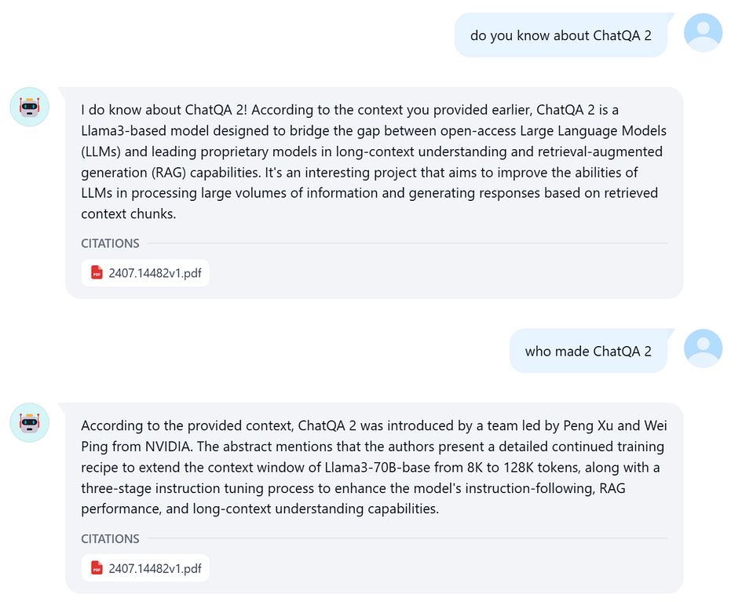

# Conclusion

This article provides a comprehensive introduction to Dify, an open-source platform that streamlines the development of large language model (LLM) applications. Dify’s key features, such as prompt orchestration, RAG pipelines, and extensive model support, make it accessible to both developers and non-technical users. The platform combines Backend-as-a-Service with LLMOps, enabling users to quickly create and deploy AI applications without extensive coding. By detailing both cloud and local deployment options, the article equips readers with practical knowledge to leverage Dify for building and managing scalable AI solutions. Dify’s open-source nature and community-driven approach offer flexibility and continuous improvement, making it a valuable tool for anyone looking to innovate in the AI space. This guide empowers readers to confidently start or enhance their AI development journey with Dify.

# References

- “Welcome to Dify | Dify.” _Dify.ai_, 9 Apr. 2024, docs.dify.ai/. Accessed 26 July 2024.

- “ConnectionError: HTTPConnectionPool(Host=“Localhost”, Port=11434): Max Retries Exceeded with Url: /Api/Generate/ (Caused by NewConnectionError(’: Failed to Establish a New Connection: \[Errno 111\] Connection Refused’)) · Issue #3200 · Ollama/Ollama.” _GitHub_, github.com/ollama/ollama/issues/3200. Accessed 26 July 2024.

- “Docker Desktop Distro Installation Failed after Upgradation to 4.32.0.” _Docker Community Forums_, 10 July 2024, forums.docker.com/t/docker-desktop-distro-installation-failed-after-upgradation-to-4–32–0/142393. Accessed 26 July 2024.

- “Langgenius/Dify.” _GitHub_, 23 May 2024, github.com/langgenius/dify.

- “Issues · Ollama/Ollama.” _GitHub_, github.com/ollama/ollama/issues/. Accessed 26 July 2024.
