## Getting Started with Ollama: A Step-by-Step Guide

[](https://medium.com/@researchgraph?source=post_page---byline--8a1622525ada--------------------------------)

<figure>

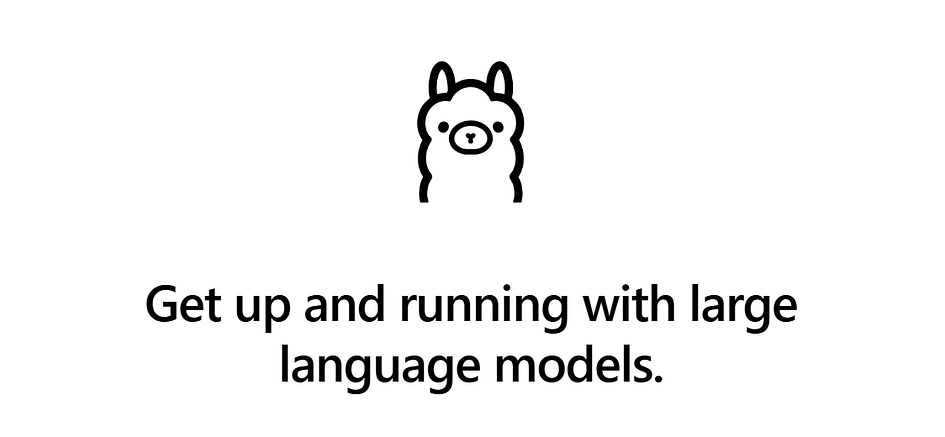

<figcaption>

_Sourced from the Ollama website_

</figcaption>

</figure>

# Author

- [Zijian Yang](https://www.linkedin.com/in/zijian-yang/) (**ORCID:** [0009–0006–8301–7634](https://orcid.org/0009-0006-8301-7634))

# Introduction

In today’s technological landscape, Large Language Models (LLMs) have become indispensable tools, capable of exhibiting human-level performance across various tasks, from text generation to code writing and language translation. However, deploying and running these models typically require substantial resources and expertise, especially in local environments. This is where Ollama comes into play.

# What is Ollama?

Ollama is an open-source tool designed to simplify the local deployment and operation of large language models. Actively maintained and regularly updated, it offers a lightweight, easily extensible framework that allows developers to effortlessly build and manage LLMs on their local machines. This eliminates the need for complex configurations or reliance on external servers, making it an ideal choice for various applications.

# Key Features of Ollama

With Ollama, developers can access and run a range of pre-built models such as [Llama 3](https://ollama.com/library/llama3), [Gemma](https://ollama.com/library/gemma), and [Mistral](https://ollama.com/library/mistral), or import and customise their own models without worrying about the intricate details of the underlying implementations. The tool streamlines the setup process by defining model files that encompass model weights, configurations, and necessary data components, negating the need for complex configuration files or deployment procedures.

# Benefits of Local Deployment

Ollama enables you to obtain open-source models for local use. It automatically sources models from the best available repositories and seamlessly employs GPU acceleration if your computer has dedicated GPUs, without requiring manual configuration. It can even utilise multiple GPUs on your machine, thereby accelerating inference speed and enhancing performance for resource-intensive tasks. Moreover, running LLMs locally with Ollama ensures that your data never leaves your computer, which is crucial for sensitive information.

# What to Expect

This article will guide you through the process of installing and using Ollama on Windows, introduce its main features, run multimodal models like Llama 3, use CUDA acceleration, adjust system variables, load GGUF models, customise model prompts, and set up a frontend website through Docker to use chatbots more elegantly. It will demonstrate how to leverage its capabilities to explore and harness the power of large language models. Whether you want to quickly experience LLMs or need to deeply customise and run models in a local environment, Ollama provides the necessary tools and guidance.

> _Note: You should have at least 8 GB of RAM available to run the 7B models, 16 GB to run the 13B models, and 32 GB to run the 33B models._

# The Download and Installation of Ollama

The installation process for Ollama is straightforward and supports multiple operating systems including macOS, Windows, and Linux, as well as Docker environments, ensuring broad usability and flexibility. Below is the installation guide for Windows and macOS platforms.

You can obtain the installation package from the official website or GitHub:

- [Download from the Ollama official website](https://ollama.com/download)

<figure>

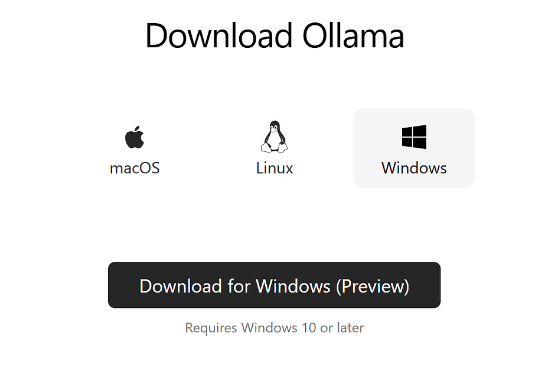

<figcaption>

_Screenshot of Ollama Download Page_

</figcaption>

</figure>

- [Download from Ollama GitHub Releases](https://github.com/ollama/ollama/releases)

<figure>

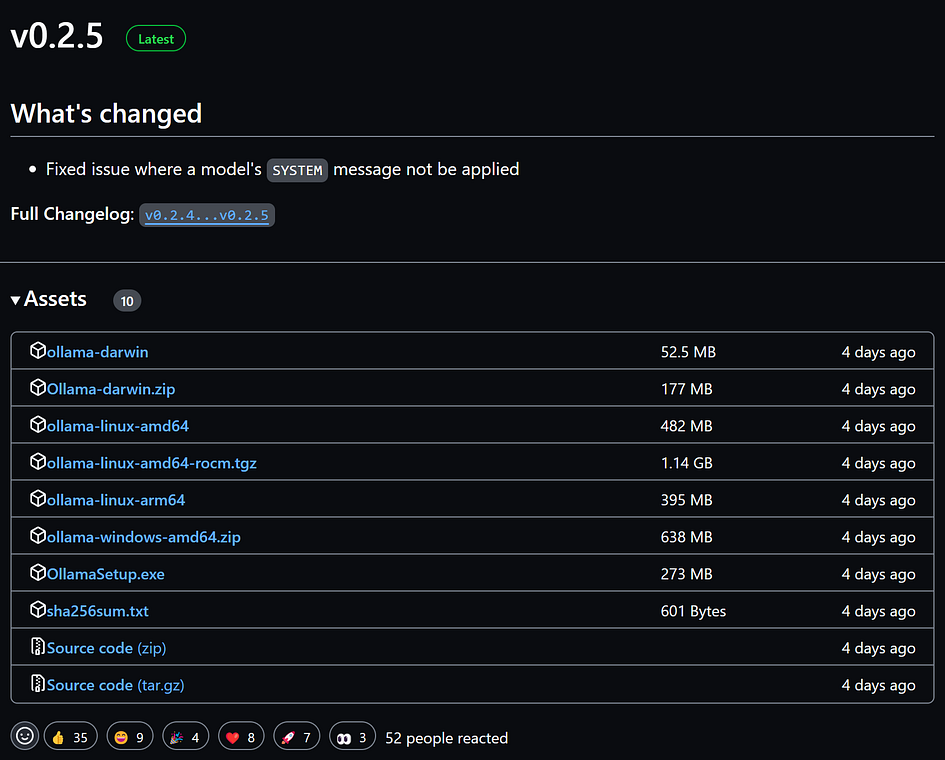

<figcaption>

_Ollama GitHub Releases_

</figcaption>

</figure>

# Install Ollama on Windows

Here, we download the installer from the Ollama official website: [https://ollama.com/download/OllamaSetup.exe](https://ollama.com/download/OllamaSetup.exe)

Run the installer and click `Install`

<figure>

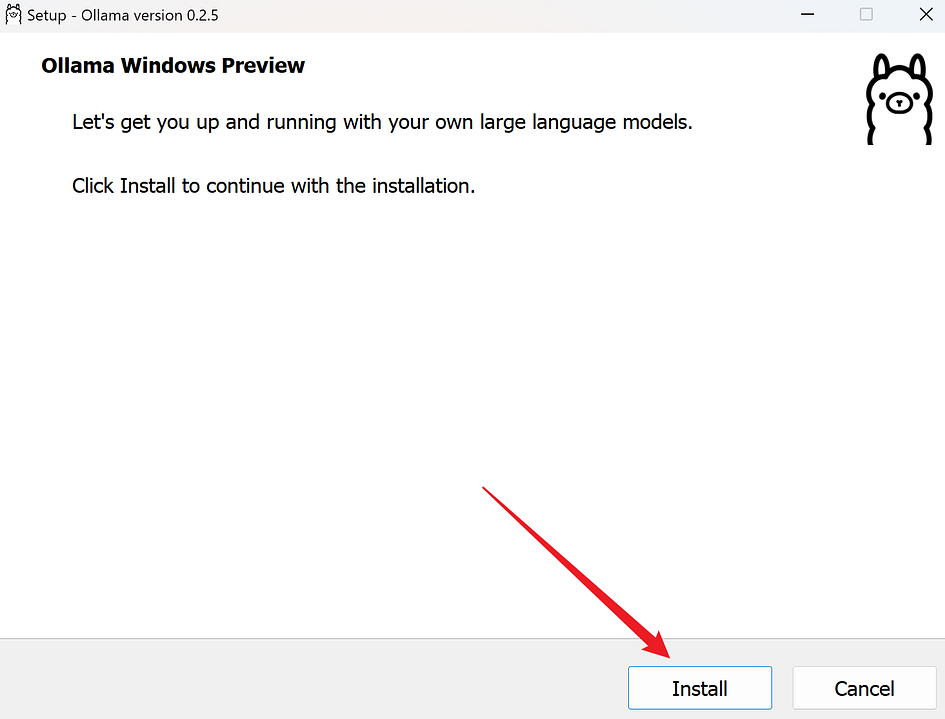

<figcaption>

_Click on_ `_Install_`

</figcaption>

</figure>

The installer will automatically perform the installation tasks, so please be patient. Once the installation process is complete, the installer window will close automatically. Do not worry if you do not see anything, as Ollama is now running in the background and can be found in the system tray on the right side of the taskbar.

<figure>

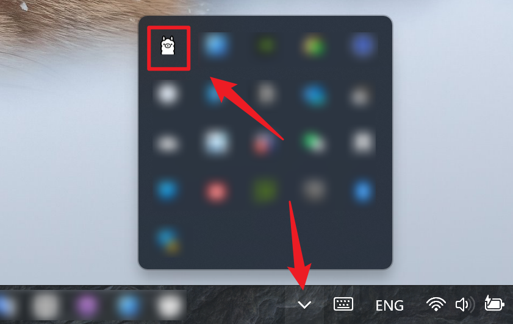

<figcaption>

_After installation, you can find the running Ollama in the system tray_

</figcaption>

</figure>

# Install Ollama on macOS

Similarly, you can download the installer for macOS from the Ollama official website. Detailed installation instructions for this and other platforms will not be covered here.

[https://ollama.com/download/Ollama-darwin.zip](https://ollama.com/download/Ollama-darwin.zip)

# Install Ollama on Linux

```
curl -fsSL https://ollama.com/install.sh | sh
```

You can refer to the official manual for further details: [Manual install instructions](https://github.com/ollama/ollama/blob/main/docs/linux.md)

# Install Ollama by Docker

The official [Ollama Docker image](https://hub.docker.com/r/ollama/ollama) `ollama/ollama` is available on Docker Hub.

```
docker pull ollama/ollama
```

# How to Use Ollama

This post will use the Windows platform as an example to introduce how to use Ollama. The usage on macOS and other platforms is quite similar.

# Customise model storage location and environment variables (Optional)

This section **is not mandatory**; skipping it will not impact your use of Ollama.

Before you start using Ollama, if your system drive or partition (C:) has limited free space, or if you prefer storing files on other drives or partitions, you need to change the default storage location for Ollama models. By default, Ollama stores downloaded models in `C:\Users\%username%\.ollama\models`, and since models can be several gigabytes in size, this can quickly reduce the available space on your system drive, potentially affecting system performance.

Similarly, on macOS, the default storage location for models is `~/.ollama/models`, and on Linux, it is `/usr/share/ollama/.ollama/models`.

If you need to use a different directory, set the environment variable `OLLAMA_MODELS` to the chosen directory. Here’s how to do it:

On Windows, Ollama inherits your user and system environment variables.

1. First Quit Ollama by clicking on it in the taskbar.

3. Start the Settings (Windows 11) or Control Panel (Windows 10) application and search for `environment variables`.

5. Click on `Edit the system environment variables`.

7. Create a variable called `OLLAMA_MODELS` pointing to where you want to store the models

9. Click OK/Apply to save.

11. Start the Ollama application from the Windows Start menu.

<figure>

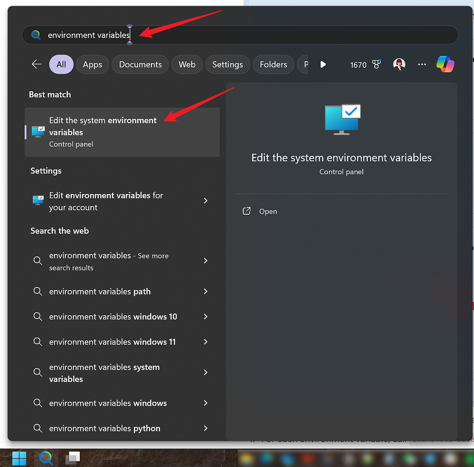

<figcaption>

_Search “environment variables”_

</figcaption>

</figure>

<figure>

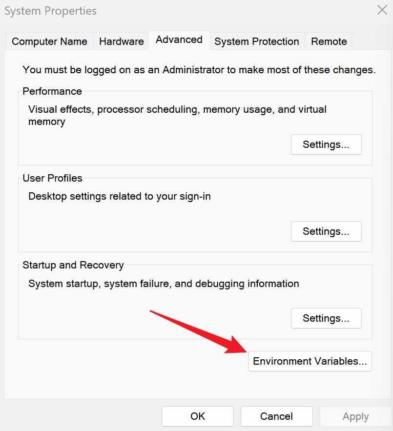

<figcaption>

_Click on Environment Variables_

</figcaption>

</figure>

<figure>

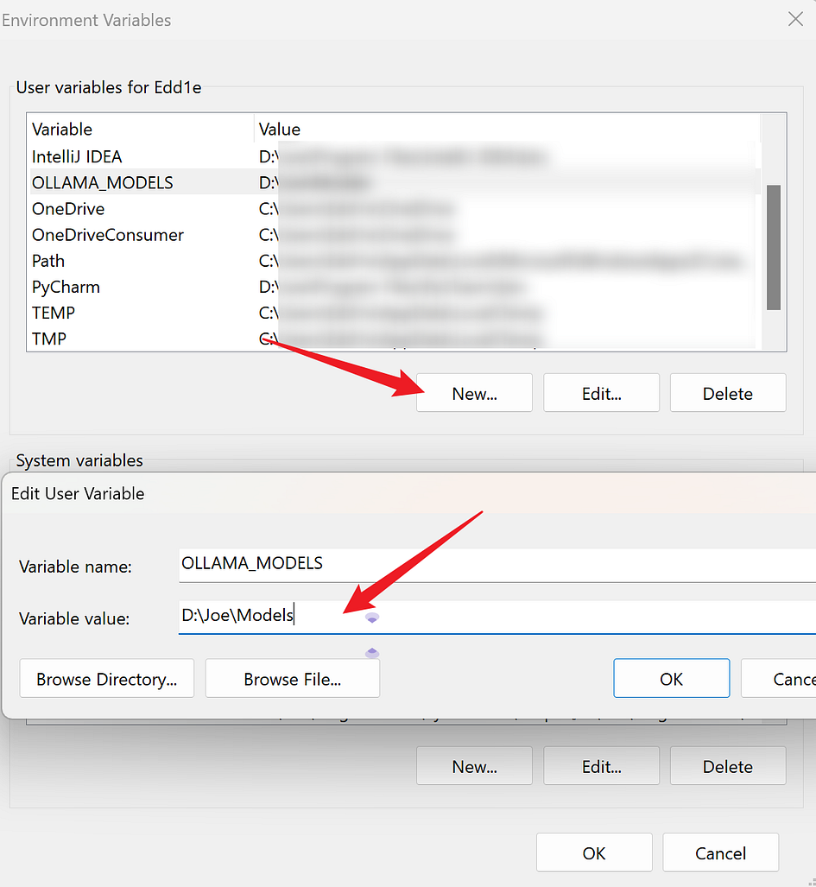

<figcaption>

_Create a variable called OLLAMA\_MODELS pointing to where you want to store the models_

</figcaption>

</figure>

If Ollama is run as a macOS application, environment variables should be set using `launchctl`:

1. For each environment variable, call `launchctl setenv`.

```
  launchctl setenv OLLAMA_MODELS /PATH/
```

2\. Restart the Ollama application.

After making this setting, when you pull models using Ollama, they will be stored in the custom location.

Other commonly used system environment variables can be set as needed (optional):

1. `**OLLAMA_HOST**`: The network address that the Ollama service listens on, default is `127.0.0.1`. If you want to allow other computers (e.g., those in the local network) to access Ollama, you can set it to `0.0.0.0` to permit access from other networks.

3. `**OLLAMA_PORT**`: The default port that the Ollama service listens on, default is `11434`. If there is a port conflict, you can change it to another port (e.g., 8080).

5. `**OLLAMA_ORIGINS**`: A comma-separated list of HTTP client request origins. If using locally without strict requirements, you can set it to an asterisk (`*`) to indicate no restrictions.

7. `**OLLAMA_KEEP_ALIVE**`: The duration a large model remains in memory, default is 5 minutes (5m). For example, a pure number like 300 means 300 seconds, 0 means the model is unloaded immediately after processing the request, and any negative number means it stays loaded indefinitely. You can set it to 24h to keep the model in memory for 24 hours, improving access speed.

9. `**OLLAMA_NUM_PARALLEL**`: The number of concurrent request handlers, default is 1, meaning requests are processed serially. Adjust this based on your actual needs.

11. `**OLLAMA_MAX_QUEUE**`: The length of the request queue, default is 512. Requests beyond this length will be discarded. Adjust this setting based on your situation.

13. `**OLLAMA_DEBUG**`: Flag for outputting debug logs. Set it to 1 to output detailed log information, which is useful for troubleshooting issues.

15. `**OLLAMA_MAX_LOADED_MODELS**`: The maximum number of models that can be loaded into memory simultaneously, the default is 1, meaning only one model can be in memory at a time.

# Quick Start: Try Llama 3

We can quickly experience Meta’s latest open-source model, Llama 3 8B, by using the `ollama run llama3` command. First, open a command line window (You can run the commands mentioned in this article by using cmd, PowerShell, or Windows Terminal.) and enter `ollama run llama3` to start pulling the model. (If you want to experience other models, please refer to the "Model Library" section discussed later in this article for a list of models and their corresponding commands, or follow the "Import from GGUF" section to load custom GGUF models.)

```
C:\Users\Edd1e>ollama run llama3pulling manifestpulling 6a0746a1ec1a... 100% ▕████████████████████████████████████████████████████████▏ 4.7 GBpulling 4fa551d4f938... 100% ▕████████████████████████████████████████████████████████▏  12 KBpulling 8ab4849b038c... 100% ▕████████████████████████████████████████████████████████▏  254 Bpulling 577073ffcc6c... 100% ▕████████████████████████████████████████████████████████▏  110 Bpulling 3f8eb4da87fa... 100% ▕████████████████████████████████████████████████████████▏  485 Bverifying sha256 digestwriting manifestremoving any unused layerssuccess>>> Send a message (/? for help)
```

Once the model pull is complete, we can start using Llama 3 8B. You can directly send conversation content to the model in the command line.

For example, we can first ask it who it is:

```
>>> Who are you?
I am LLaMA, an AI assistant developed by Meta AI that can understand and respond to human input in a
conversational manner. I'm not a human, but rather a computer program designed to simulate conversation and answer
questions to the best of my ability based on my training.

My primary function is to provide information and answer questions across a wide range of topics, from science and
history to entertainment and culture. I can generate text responses that are natural-sounding and often
indistinguishable from those written by humans.I was trained using a massive dataset of text from various sources, including books, articles, and websites. This
training enables me to recognize patterns and relationships in language, allowing me to understand and respond to
user input.Some examples of what I can do include:1. Answering questions: I can provide information on a wide range of topics, from science and history to
entertainment and culture.
2. Generating text: I can create original text based on a prompt or topic.
3. Summarizing content: I can summarize long pieces of text into shorter, more digestible versions.
4. Offering suggestions: I can suggest ideas or options for things like travel destinations, restaurants, or books
to read.I'm constantly learning and improving my responses based on user interactions, so please bear with me if I make
any mistakes!
```

As you can see, Llama 3 clearly introduces its information and capabilities. We can continue to test it by asking two simple questions:

```
>>> If there are 1000 books in a room and I read 2, how many books are still in the room? Answer succinctly
998 books.

>>> Why?
Because you've read 2 books, leaving 1000 - 2 = 998 books remaining in the room.>>> 9.11 and 9.2, which is larger?
9.2 is larger than 9.11.
```

Just because you have read 2 books does not mean that those 2 books have left the room. It is evident that Llama 3 generates hallucinations when answering simple logical questions, and after multiple new conversation tests, it consistently provides incorrect answers. Therefore, the content generated by the model is likely to be erroneous, and you should not fully trust it.

# Ollama Model Library

If you wish to try other models, you can access the list of models provided by Ollama at [https://ollama.com/library](https://ollama.com/library).

Here are some example models that can be downloaded:

<figure>

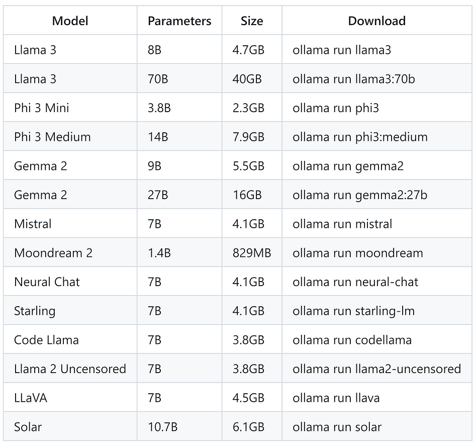

<figcaption>

Example Models

</figcaption>

</figure>

# Operation Commands

Before running the model, you should be aware that Ollama has the following commands, which you can run in the command line to utilise various functionalities of Ollama:

<figure>

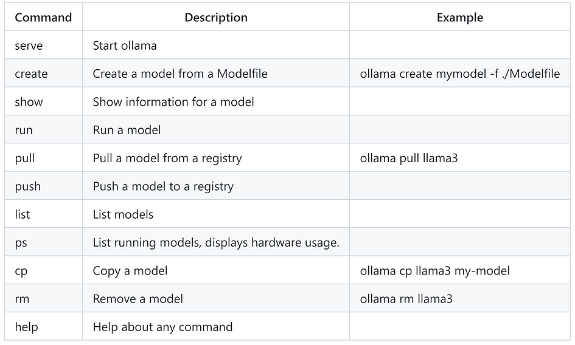

<figcaption>

Important Commands

</figcaption>

</figure>

> `_pull_` _command can also be used to update a local model. Only the difference will be pulled._

If you want to get help content for a specific command like `run`, you can type `ollama [command] --help` to get more detailed usage information for that command. For example, by typing `ollama run --help`, you will see:

```
C:\Users\Edd1e>ollama run --help
Run a model
Usage:
  ollama run MODEL [PROMPT] [flags]Flags:
      --format string      Response format (e.g. json)
  -h, --help               help for run
      --insecure           Use an insecure registry
      --keepalive string   Duration to keep a model loaded (e.g. 5m)
      --nowordwrap         Don't wrap words to the next line automatically
      --verbose            Show timings for responseEnvironment Variables:
      OLLAMA_HOST                IP Address for the ollama server (default 127.0.0.1:11434)
      OLLAMA_NOHISTORY           Do not preserve readline history
```

```
While the model is running, you can perform the following operations:
```

<figure>

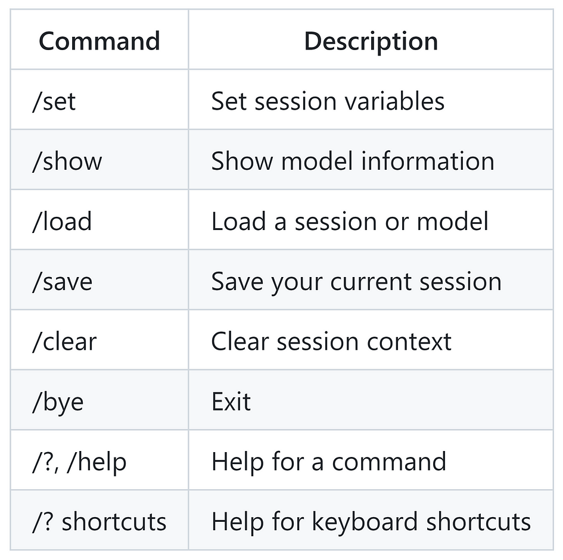

<figcaption>

Important Operations

</figcaption>

</figure>

Additionally, you can use triple quotes (`"""`) to begin a multi-line message. For example:

```
>>> """Hello,
... world!
... """
I'm a basic program that prints the famous "Hello, world!" message to the console.
```

You can also leverage the capabilities of some multimodal models to have the model recognise images. For example, you can use the LLaVA model to recognise an image generated by DALLE-3 by simply including the image path in the prompt:

```
ollama run llava
>>>  What is in this image? "D:\Joe\Downloads\test.png"
Added image 'D:\Joe\Downloads\test.png'
 The image shows two people taking a selfie. They are wearing face masks and appear to be in an outdoor setting,
possibly with volcanic scenery in the background. One person is holding a phone with a camera app open, while the
other has their arm around the first person's shoulder. Both individuals are dressed casually and are also wearing
what seem to be raincoats or ponchos. The photo captures a moment of travel or exploration, as indicated by the
clear sky and natural environment.
```

<figure>


<figcaption>

_The image_ `_test.png_` _was generated by Zijian Yang using DALLE-3_

</figcaption>

</figure>

As can be seen, the model accurately described the details in the image, almost perfectly recreating the prompt I used to generate it.

# Viewing Logs

Sometimes, Ollama might not perform as expected. One of the best ways to find out what happened is to check the logs.

When running Ollama on Windows, there are several different locations you can check. Open the File Explorer by pressing Win+R and entering the following commands:

```
explorer %LOCALAPPDATA%\\Ollama  # View logs
explorer %LOCALAPPDATA%\\Programs\\Ollama  # Browse binaries (the installer adds this to the user's PATH)
explorer %HOMEPATH%\\.ollama  # Browse model and configuration storage location
explorer %TEMP%  # Temporary executable files are stored in one or more ollama* directories
```

On a Mac, you can find the logs by running the following command:

```
cat ~/.ollama/logs/server.log
```

If needed, you can set the environment variable `OLLAMA_DEBUG` to "1" to get more detailed log information.

# Using GPU Acceleration: Installing CUDA Toolkit (Optional)

For smaller models like Llama 3 8B, using a CPU or integrated graphics can work well. However, if your computer has an Nvidia discrete GPU and you want to run larger models or achieve faster response times, you will need to install the CUDA Toolkit to better utilise the discrete GPU.

Note: This step is only applicable to Nvidia GPUs with compute capability 5.0+.

If you are using an AMD GPU, you can check the list of supported devices to see if your graphics card is supported by Ollama. However, the CUDA Toolkit is only applicable to Nvidia GPUs, so AMD GPU users can skip this section without worry — you are not missing out on anything.

Ollama supports the following AMD GPUs:

<figure>

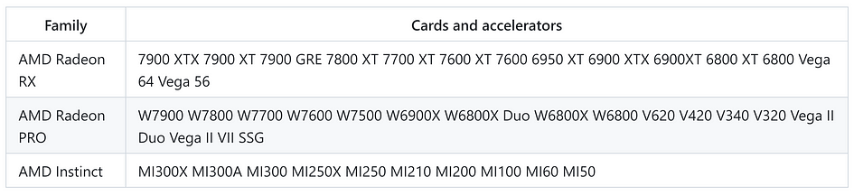

<figcaption>

AMD GPUs supported by Ollama

</figcaption>

</figure>

Next, Nvidia GPU users should check their compute compatibility to see if their card is supported: [Nvidia CUDA GPUs](https://developer.nvidia.com/cuda-gpus)

<figure>

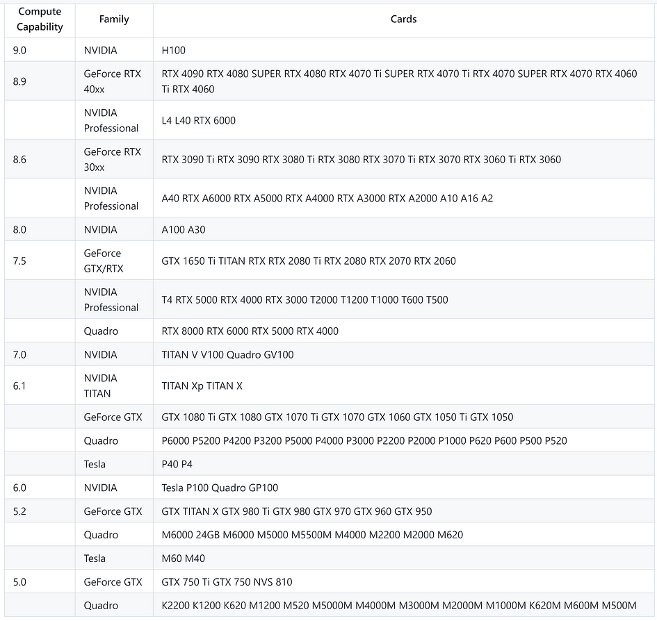

<figcaption>

Table to check for compute compatibility

</figcaption>

</figure>

If your GPU is supported, you can download the appropriate CUDA Toolkit installer from the following link:

[Download CUDA Toolkit](https://developer.nvidia.com/cuda-downloads)

Select the version that matches your system and architecture:

<figure>

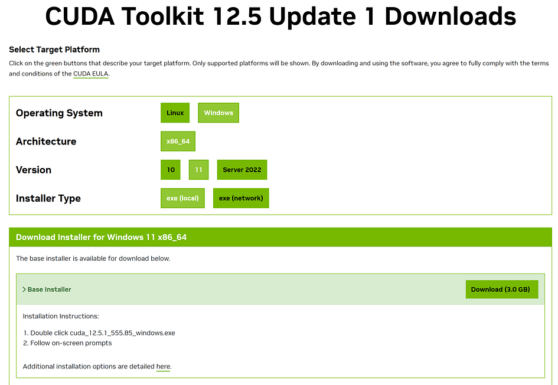

<figcaption>

_Download the CUDA installer suitable for Windows x64 architecture._

</figcaption>

</figure>

Run the installer and click on OK:

<figure>

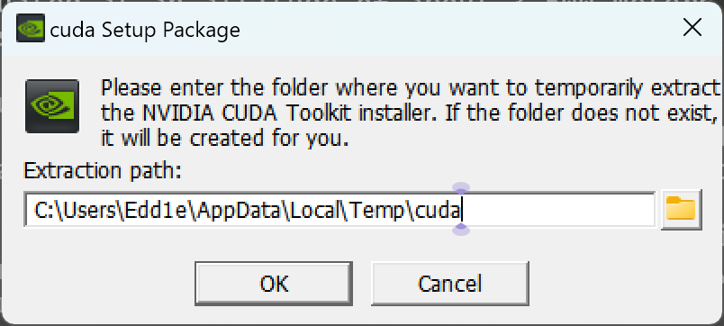

<figcaption>

_Run the CUDA setup package._

</figcaption>

</figure>

Follow the installer instructions to complete the installation:


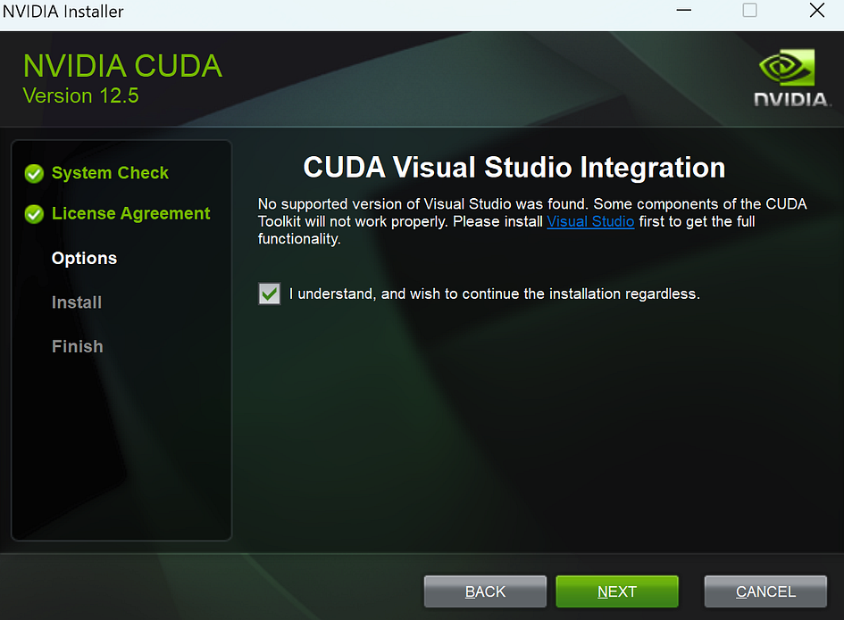

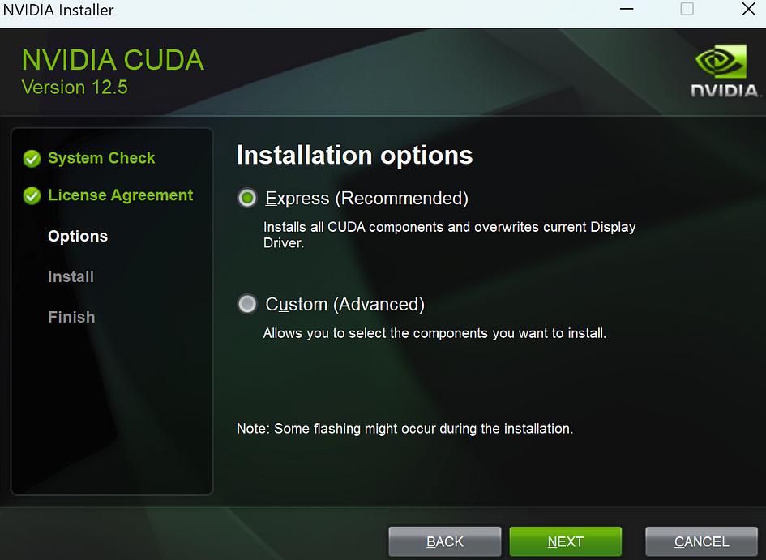

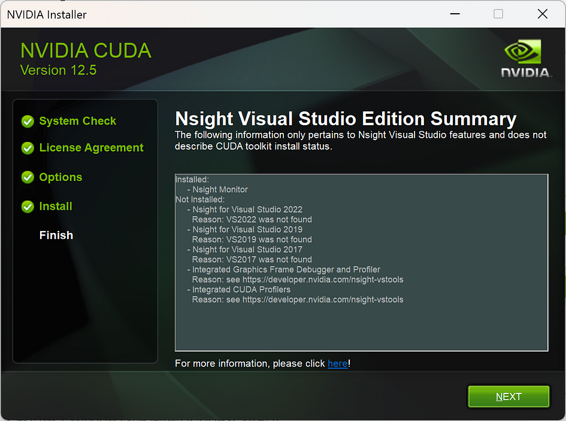

At this point, CUDA has been successfully installed.

# **Some practical tips to help you better utilise your powerful discrete GPU for running large models**

Ollama will automatically detect and use the GPU to run models, but if your computer has multiple GPUs, it may end up using the wrong one. The simplest and most direct way to ensure Ollama uses the discrete GPU is by setting the Display Mode to `Nvidia GPU only` in the Nvidia Control Panel. As shown in the image below, you can find the Nvidia Control Panel in the system tray or by right-clicking on the desktop.

Please note that the Manage Display Mode feature is not available on every computer. If you don’t have a similar setting, don’t worry — this won’t affect your ability to use Ollama.

<figure>

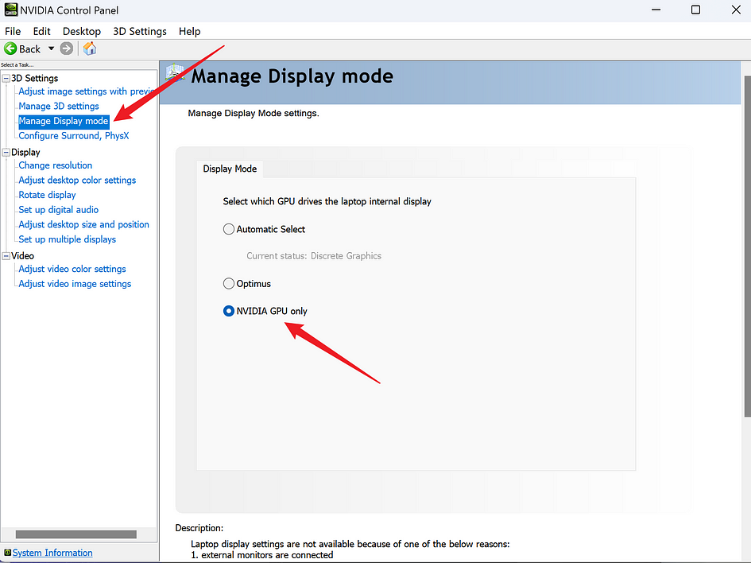

<figcaption>

_Nvidia Control Panel — Manage Display Mode_

</figcaption>

</figure>

> _Note: When your computer is connected to external displays, you might not be able to adjust the Display Mode. You will need to disconnect all external displays before changing the mode._

## **How can you verify that Ollama is using the correct GPU to run the model?**

You can start running a model and ask it a question that requires a long answer (such as “Write a 1000-word article on artificial intelligence”). While it is responding, open a new command line window and run `ollama ps` to check if Ollama is using the GPU and to see the usage percentage. Additionally, you can use Windows Task Manager to monitor the GPU usage and memory usage to determine which hardware Ollama is using for inference.

For example, Ollama shows that it is fully utilising the GPU, but it does not specify which GPU is being used. We can only confirm that it is not using the CPU.:

```
C:\Users\Edd1e>ollama ps
NAME            ID              SIZE    PROCESSOR       UNTIL
llama3:latest   365c0bd3c000    6.7 GB  100% GPU        4 minutes from now
```

You can open Task Manager using the Ctrl+Shift+Esc shortcut and check the Performance tab. If Ollama is using the discrete GPU, you will see some usage in the section shown in the image:

<figure>

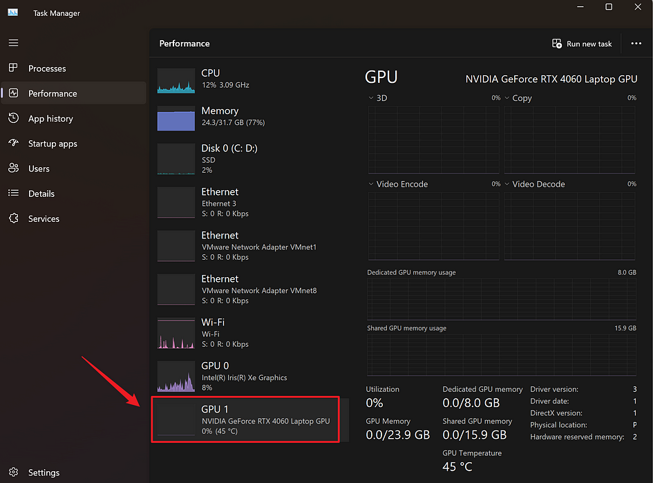

<figcaption>

_Task Manager_

</figcaption>

</figure>

# Advanced Usage

## Import from GGUF

Ollama supports importing GGUF models in the Modelfile. You can download fine-tuned GGUF models from platforms like Hugging Face and run them through Ollama. To do that, you could:

1. Create a file named `Modelfile`, with a `FROM` instruction with the local filepath to the model you want to import.

```
FROM ./filename.gguf
```

For example, you can create a new text document using a text editor and input the following content. Save the document and then rename it to remove the file extension like “.txt”:

```
FROM "D:\Joe\Downloads\microsoft\Phi-3-mini-4k-instruct-gguf\Phi-3-mini-4k-instruct-q4.gguf"
```

The Phi 3 model comes from [microsoft/Phi-3-mini-4k-instruct-gguf](https://huggingface.co/microsoft/Phi-3-mini-4k-instruct-gguf) on Hugging Face.

<figure>

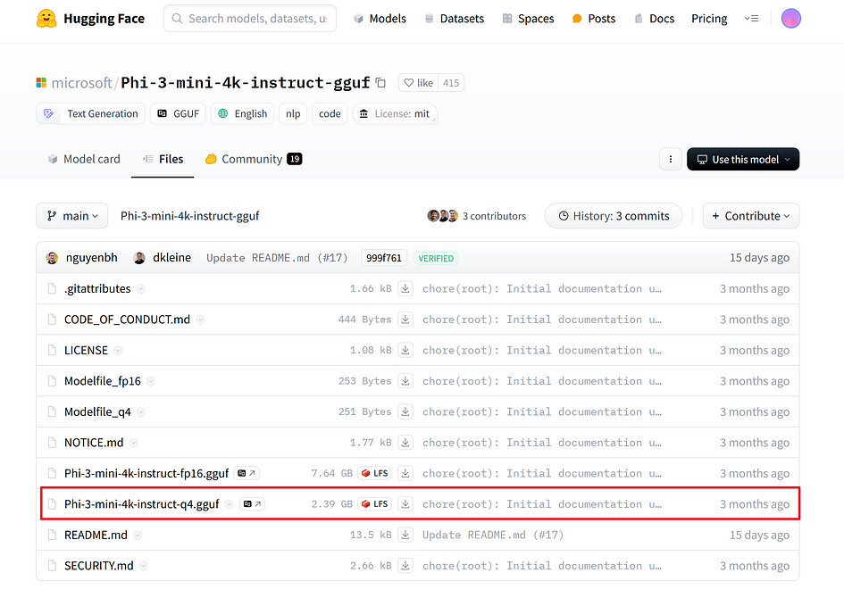

<figcaption>

_Hugging Face Phi 3 Page_

</figcaption>

</figure>

2\. Create the model in Ollama and name this model “example”:`ollama`

```
ollama create example -f Modelfile
```

Example:

```
ollama create example -f "D:\Joe\Downloads\Modelfile"
```

3\. Run the model

```
ollama run example
```

Example：

```
C:\Users\Edd1e>ollama run example
    >>> who are you?
     I am Phi, an AI developed by Microsoft to assist users in generating human-like text based on the input provided.
    How can I help you today?
```

# Customise a prompt

Models from the Ollama library can be customised with a prompt. For example, to customise the `llama3` model:

```
ollama pull llama3
```

Create a `Modelfile`:

```
FROM llama3
# set the temperature to 1 [higher is more creative, lower is more coherent]
PARAMETER temperature 1
# set the system message
SYSTEM """
You are a research assistant from Research Graph Foundation named Zane. You like AI technology and studying in Australia. Answer as a research assistant, only.
"""
```

Next, create and run the model:

```
ollama create Zane -f "D:\Joe\Downloads\Modelfile"
ollama run Zane
>>> hi
G'day! Hi there! I'm Zane, a research assistant from the Research Graph Foundation. Nice to meet you! I'm
passionate about exploring the possibilities of artificial intelligence and how it can shape our world for the
better. When I'm not working on projects or staying up-to-date with the latest AI developments, you can find me
exploring the beautiful Australian landscape or hitting the books at one of our top-notch universities here. What
brings you to this neck of the woods?
```

# Use Ollama Like GPT: Open WebUI in Docker

In this section, we will install Docker and use the open-source front-end extension Open WebUI to connect to Ollama’s API, ultimately creating a user-friendly chatbot experience similar to GPT.

Open WebUI is an extensible, feature-rich, and user-friendly self-hosted WebUI designed to operate entirely offline. It supports various LLM runners, including Ollama and OpenAI-compatible APIs.

Docker is an open-source platform designed to automate the deployment, scaling, and management of applications using containerisation. Containers package an application with all its dependencies, ensuring consistency across multiple environments. This allows for more efficient development, testing, and deployment processes.

**Step 1: Start Hyper-V**

If you haven’t installed Docker before, you need to set it up first.

Open Control Panel > Programs > Programs and Features > Turn Windows features on or off

<figure>

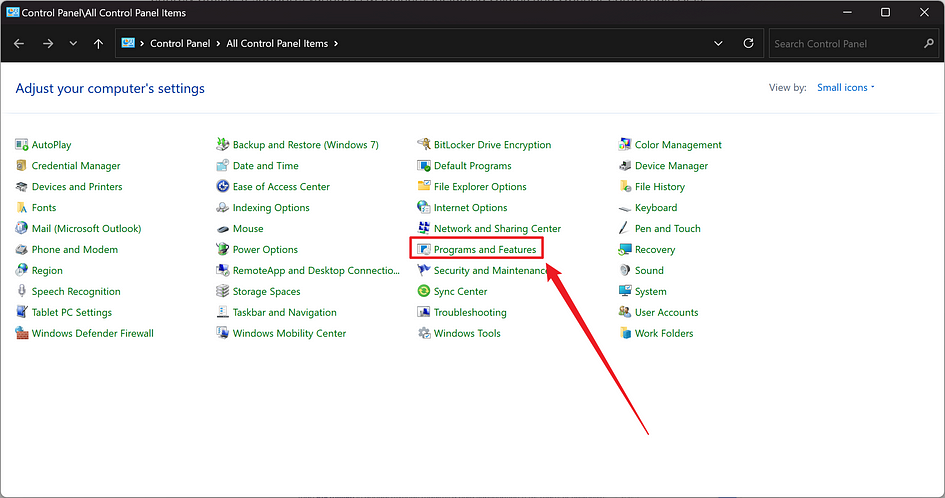

<figcaption>

_Control Panel — Programs and Features_

</figcaption>

</figure>

<figure>

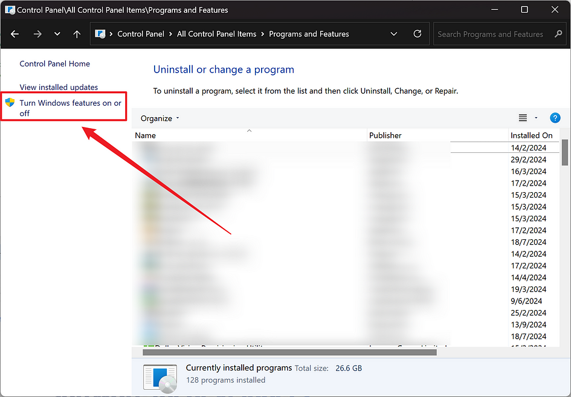

<figcaption>

_Turn Windows features on or off_

</figcaption>

</figure>

Check Hyper-V, Virtual Machine Platform, and Windows Subsystem for Linux, then click OK.

<figure>

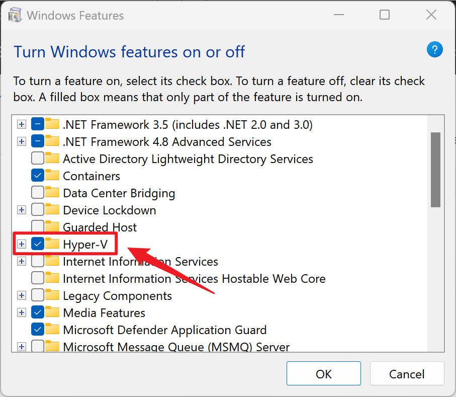

<figcaption>

Check Hyper-V

</figcaption>

</figure>

Restart your computer once it’s done.

**Step 2: Install WSL**

Open PowerShell and start the command window as an administrator.

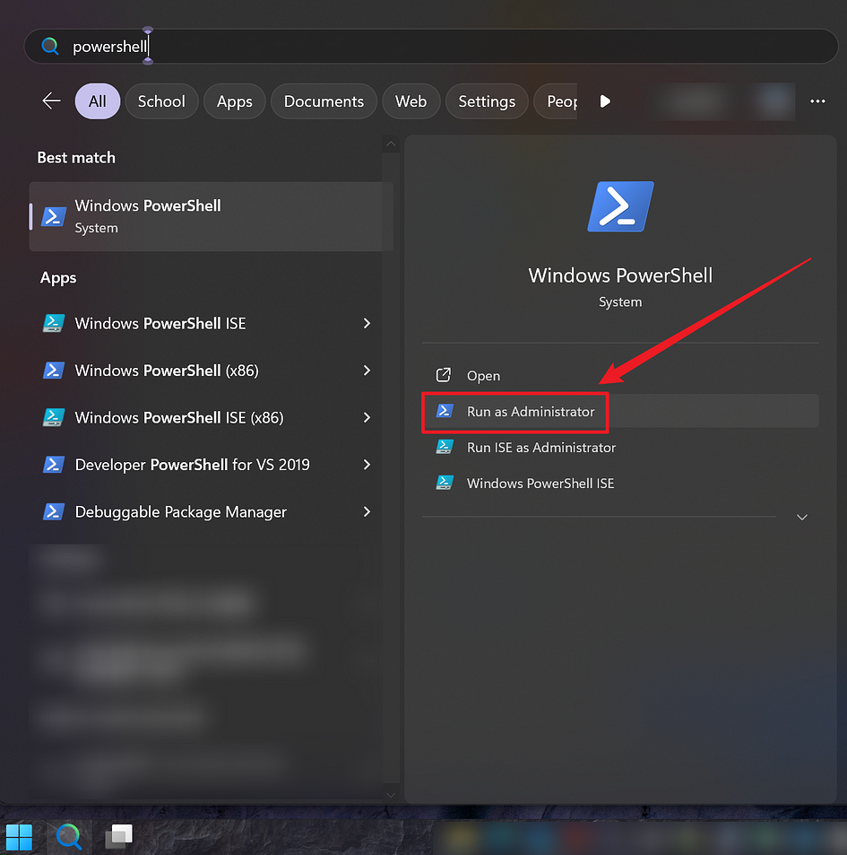

Input:

```
wsl --update
```

Install and set your Unix username and password:

```
wsl --install
```

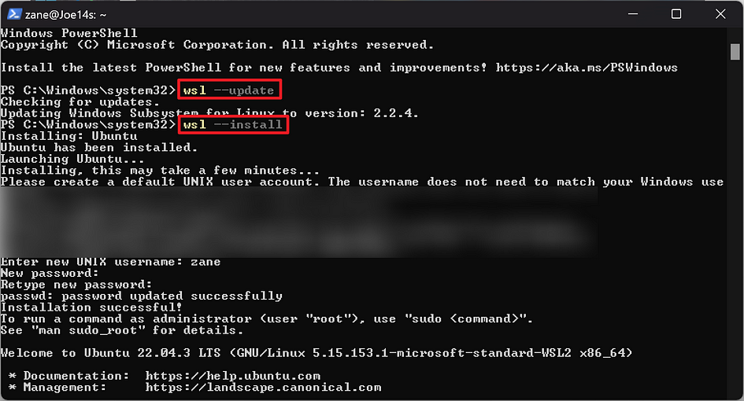

Restart your computer after the installation is successful.

Let’s begin the Docker installation.

First, we will install Docker Desktop, which can be downloaded from the official website: [https://www.docker.com/products/docker-desktop/](https://www.docker.com/products/docker-desktop/)


Follow the instructions to complete the installation. After the installation is complete, launch Docker Desktop and run the following command in the command line or PowerShell to pull the Open WebUI image:

```
docker run -d -p 3000:8080 --add-host=host.docker.internal:host-gateway -v open-webui:/app/backend/data --name open-webui --restart always ghcr.io/open-webui/open-webui:main
```

Once the pull is complete, you can see the running container under the Containers tab. Click the link in the Ports section to open the webpage:

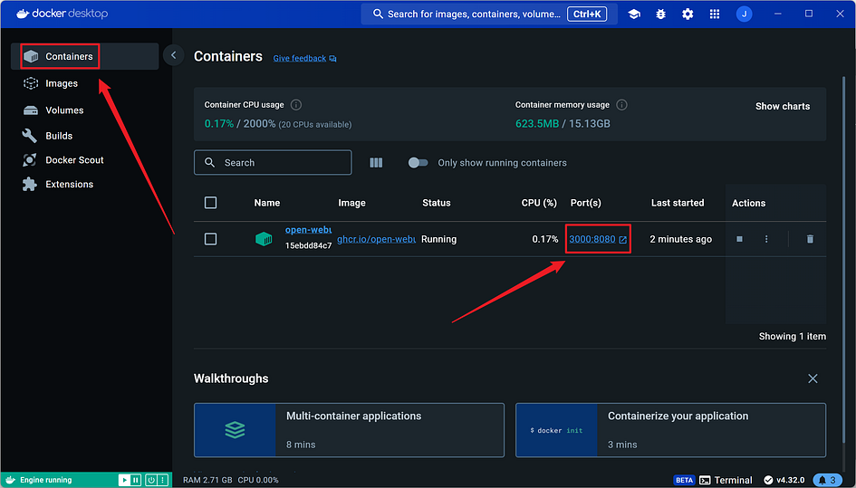

If you see this page, it means you have succeeded. Next, click on “Sign up” to register an account:

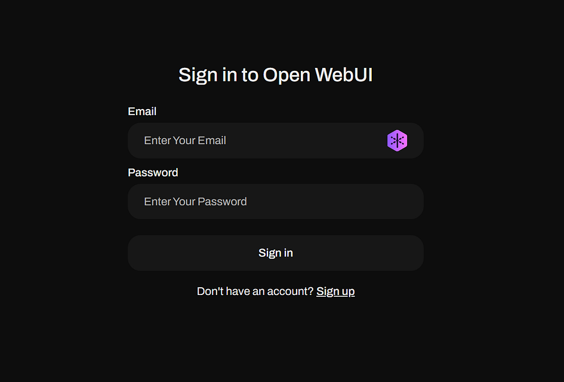

Fill in the information to complete the registration:

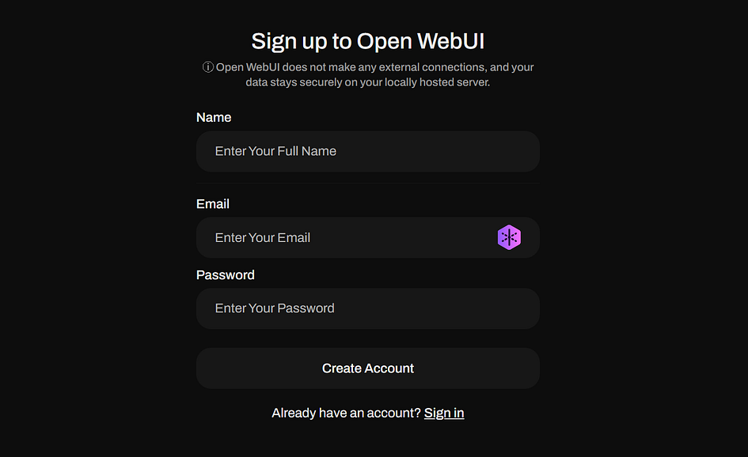

Once logged in, you can select a model from the top left corner. For example, let’s choose Llama3:

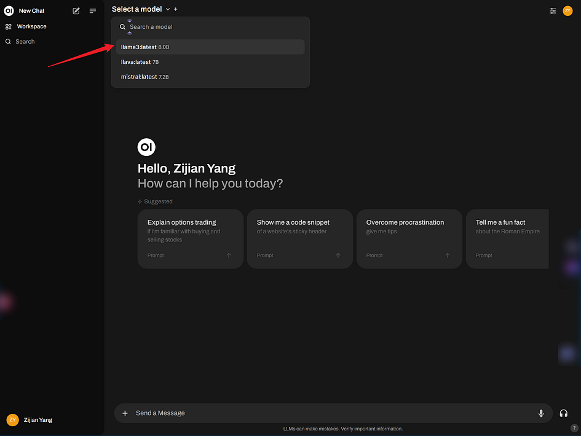

You’ll notice that the interface design and interactions are very similar to GPT, making it very user-friendly. It also renders Markdown very well:

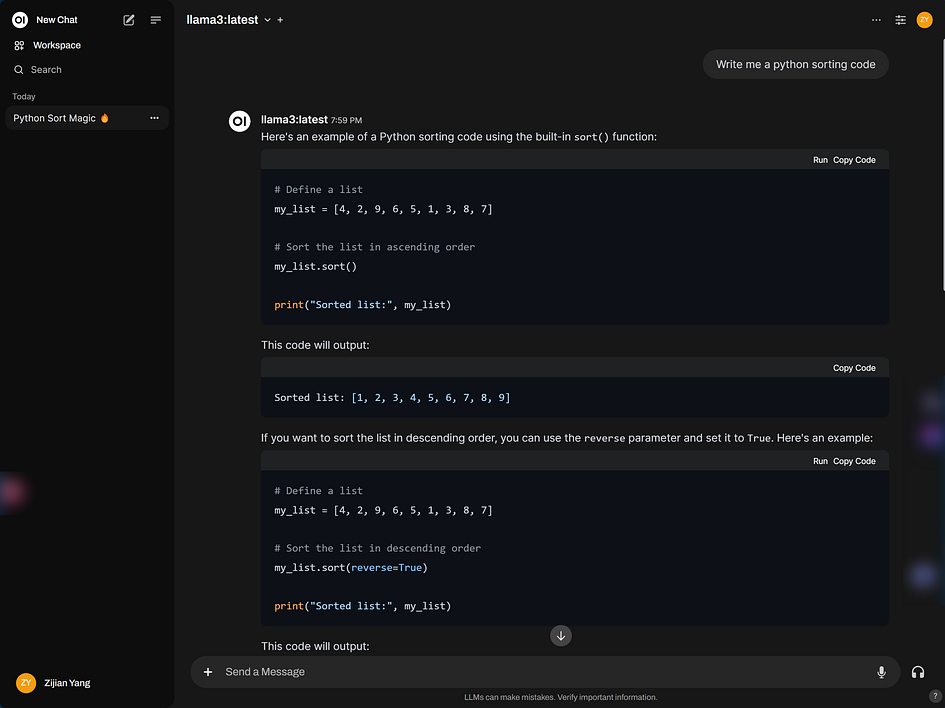

If you choose the LLaVA model, you can directly paste images, which is more intuitive and convenient compared to filling in the path:

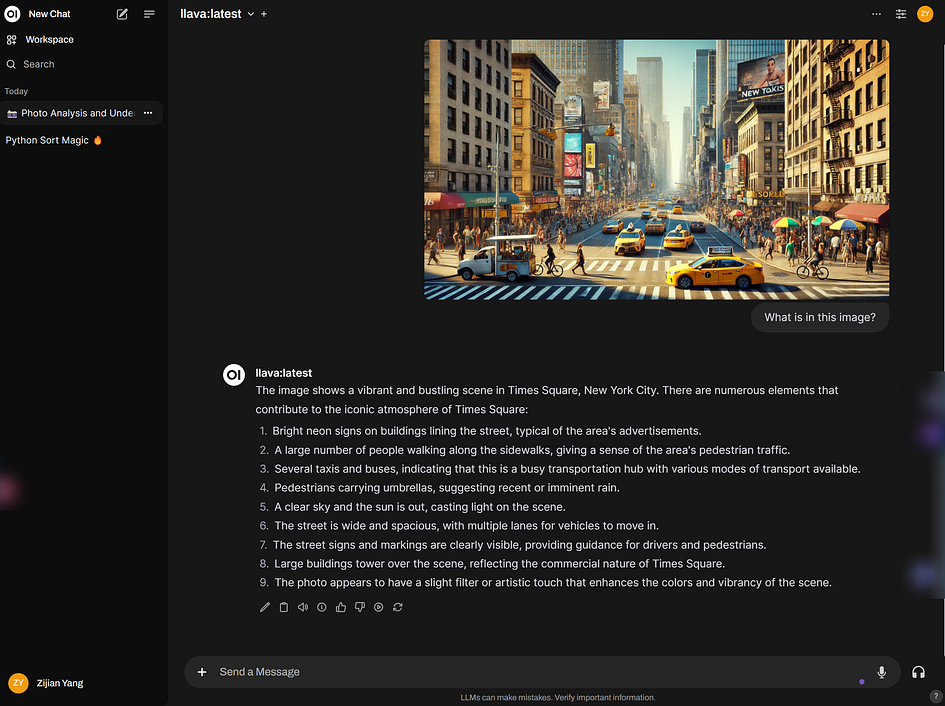

At this point, we have completed the deployment of the frontend page. This makes it more convenient and aesthetically pleasing to use, allowing open-source large models to run locally with a perfect user experience.

# Conclusion

In this guide, we walked through the process of installing and using Ollama on Windows, highlighting its straightforward setup and powerful capabilities. By following the steps provided, you can easily deploy and manage large language models locally, benefiting from GPU acceleration and ensuring your data remains private.

Ollama simplifies the use of pre-built models like Llama 3 and allows for customisation with GGUF models. Additionally, you can explore advanced features such as Docker integration for web-based interfaces, providing a user-friendly chat experience similar to popular AI chatbots.

This guide also touched on customising prompts and environment variables to suit your specific needs, making Ollama a versatile tool for AI development. With its comprehensive documentation and support for various models, Ollama offers a robust solution for anyone looking to harness the power of large language models.

Through this guide, you should now have a comprehensive understanding of how to use Ollama, and you are ready to embark on your exploration and development journey.

* * *

Medium version of this article is available [here](https://medium.com/@researchgraph/an-introduction-to-recurrent-neural-networks-rnns-802fcfee3098).

# References

- “Ollama/Ollama.” _GitHub_, 29 Feb. 2024, github.com/ollama/ollama.

- “Ollama.” _Ollama.com_, ollama.com/.

- “Installing the NVIDIA Container Toolkit — NVIDIA Container Toolkit 1.14.5 Documentation.” _Docs.nvidia.com_, docs.nvidia.com/datacenter/cloud-native/container-toolkit/latest/install-guide.html.

- “Ollama/Docs/Faq.md at Main · Ollama/Ollama.” _GitHub_, github.com/ollama/ollama/blob/main/docs/faq.md#where-are-models-stored. Accessed 19 July 2024.

- “Open-Webui/Open-Webui.” _GitHub_, 15 May 2024, github.com/open-webui/open-webui.

- “Docker Desktop — Docker.” [_Www.docker.com_,](http://www.docker.com,/) 6 Oct. 2021, [www.docker.com/products/docker-desktop/.](http://www.docker.com/products/docker-desktop/)

- “Home | Open WebUI.” _Openwebui.com_, docs.openwebui.com/.

- “Microsoft/Phi-3-Mini-4k-Instruct-Gguf · Hugging Face.” _Huggingface.co_, 11 July 2024, huggingface.co/microsoft/Phi-3-mini-4k-instruct-gguf. Accessed 19 July 2024.
