## A Step-by-Step Guide: Installation, Usage, and Troubleshooting

<figure>

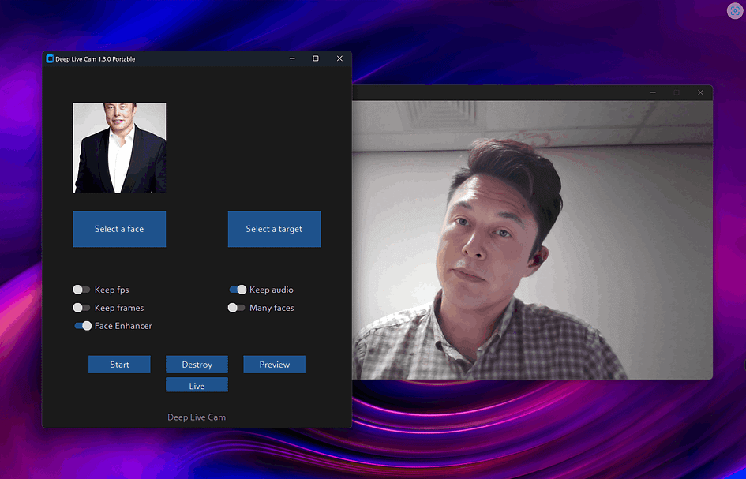

<figcaption>

Deep Live Cam Real-Time Face Swap created by Zijian Yang

</figcaption>

</figure>

# Author

- [Zijian Yang](https://www.linkedin.com/in/zijian-yang/) (**ORCID:** [0009–0006–8301–7634](https://orcid.org/0009-0006-8301-7634))

# Introduction

Although AI face swapping is not a new concept, the ability to “swap your face for live streaming with just one photo” has impressive results and has been made open-source — causing the project to become an instant hit.

It soared to the top of GitHub’s trending list, garnering over 1,600 stars in just 24 hours.

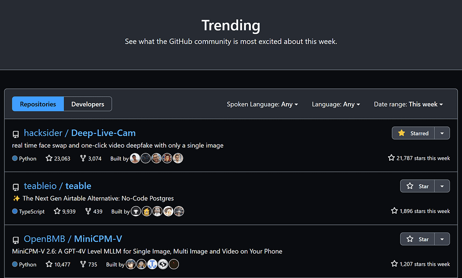

In the ever-evolving realm of digital technology, Deep Live Cam stands out as a groundbreaking tool for real-time face swapping, offering users the ability to transform live webcam feeds or static videos with just a single image.

This innovative software harnesses the power of artificial intelligence to seamlessly replace faces, making it a valuable asset for artists, content creators, and tech enthusiasts alike. By utilising Deep Live Cam, users can explore creative possibilities such as animating custom characters or testing new visual concepts, all while contributing to the burgeoning field of AI-generated media.

In this article, we will guide you through the installation process of Deep Live Cam on your local machine, ensuring you have the necessary tools and knowledge to unlock its full potential. Whether you’re looking to enhance your digital projects or simply experiment with cutting-edge technology, this tutorial will provide you with the insights needed to get started.

No worries! You can enjoy a smooth experience even without a GPU!

GitHub: [https://github.com/hacksider/Deep-Live-Cam](https://github.com/hacksider/Deep-Live-Cam)


# How to install Deep Live Cam?

# Preparations

## Installing Python 3.10

Go to the following page to download and install Python 3.10. Please make sure it is version 3.10, as newer versions like 3.12 may cause errors, which will be discussed later. If you already have other versions of Python installed, that’s perfectly fine; we can specify the Python 3.10 interpreter in subsequent steps.

[https://www.python.org/downloads/release/python-3100](https://www.python.org/downloads/release/python-3100)

If you are a Windows user, you can click the link below to start the download directly:

[https://www.python.org/ftp/python/3.10.0/python-3.10.0-amd64.exe](https://www.python.org/ftp/python/3.10.0/python-3.10.0-amd64.exe)

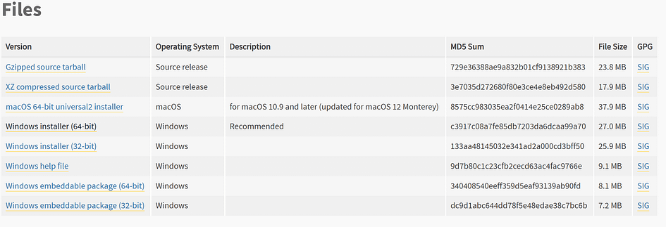

Select the installer that matches your system version.

If you are using a newer version of Python, you might encounter errors when installing dependencies. This is because some packages mentioned in the error message have been deprecated in the newer versions:

```
ModuleNotFoundError: No module named 'distutils'
```

Begin the installation of Python. Make sure to check “Add Python 3.10 to PATH,” then click “Install Now.” If you need to change the installation location or other parameters, click “Customize installation.”

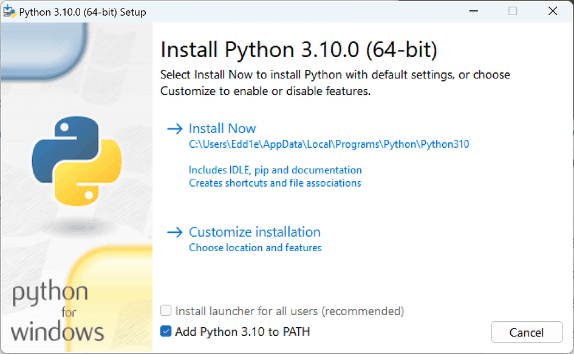

## Installing Python

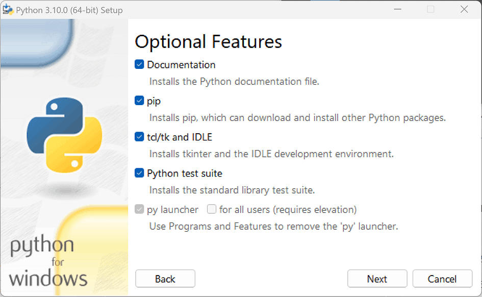

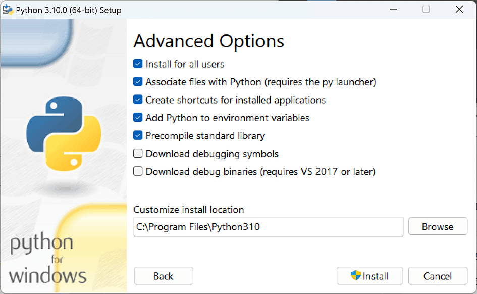

At this step, you can customise the installation path.

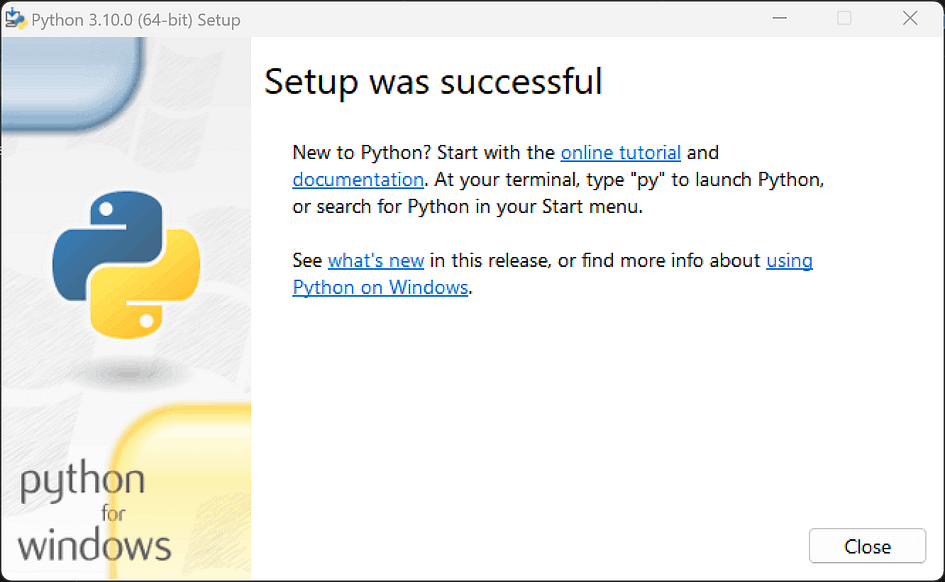

If you have multiple versions of Python installed, make sure to remember the installation path of version 3.10. You will need it later to run Python programs using the specified version.

To verify if Python is installed, you can run the following command in the terminal:

```
python --version
```

# Installing FFmpeg

Open the following FFmpeg download page. Here, we will demonstrate using the Windows version:

[https://www.ffmpeg.org/download.html](https://www.ffmpeg.org/download.html)

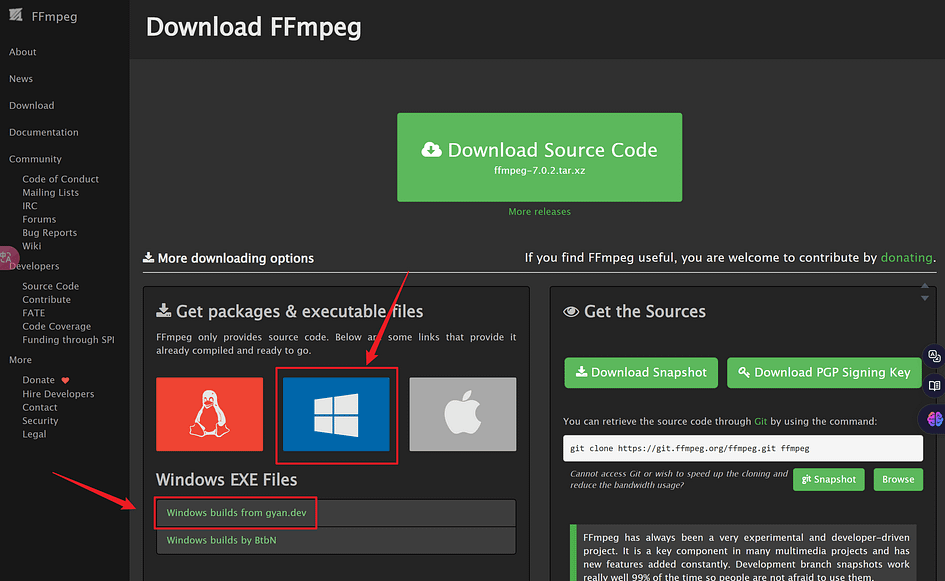

Select “release builds” on the left side, and the following content will appear on the right:

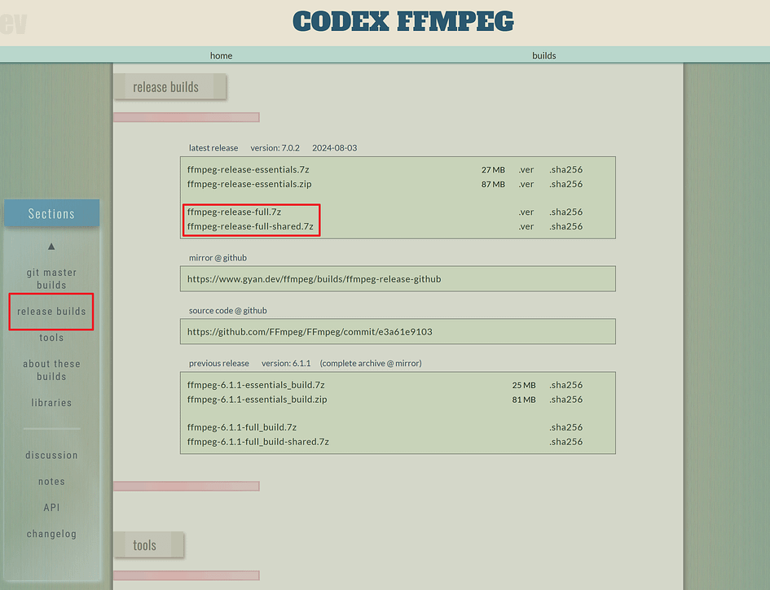

Download the latest version.

It doesn’t really matter if you choose the version with `shared` or without `shared`. Both versions have the exact same functionality.

The version with `shared` includes additional `include` and `lib` directories. In this version, the FFmpeg dependency modules are placed separately in the `lib` directory. The `ffmpeg.exe`, `ffplay.exe`, and `ffprobe.exe` files are the main executable entry points and have small file sizes. When running, they will call the necessary functionalities from the `lib` directory if needed.

In the version without `shared`, the `bin` directory contains the `ffmpeg.exe`, `ffplay.exe`, and `ffprobe.exe` executables. Each executable file is slightly larger because they have already compiled the necessary modules into the `exe` files.

Extract the downloaded 7z file and copy the path of the `bin` directory.


Search for “Edit the system environment variables.” In the “System Variables” section, add a new entry to the “PATH” variable. Paste the path you just copied and save it.

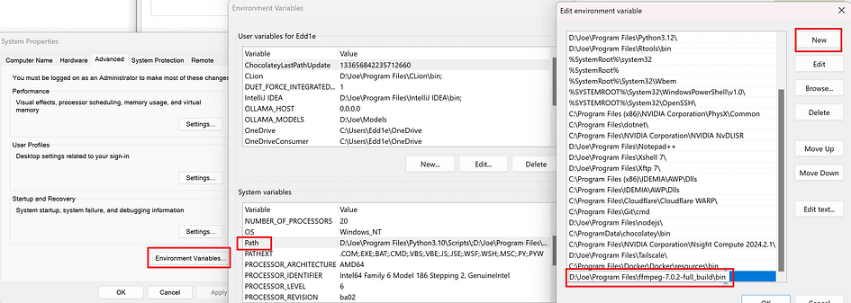

To verify if FFmpeg can be called correctly, open a command prompt window and enter: `ffmpeg -version`. If version information is displayed, the configuration is successful.

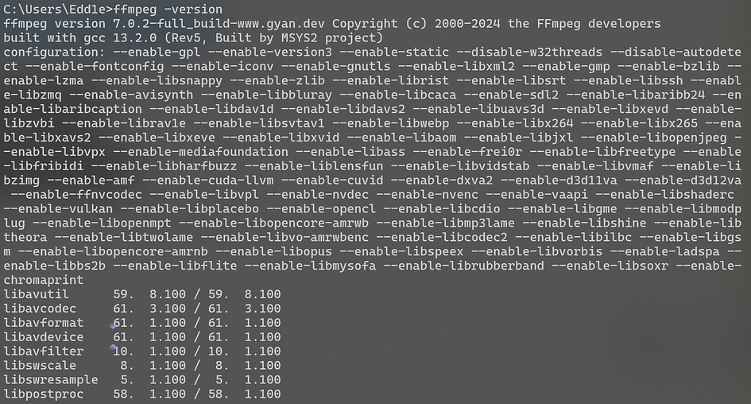

For Windows computers, you can also place the extracted files into the system’s `system32` directory. This way, you don't need to configure the environment variables.

# Clone Repository

Clone the project to your local machine.

(You can use commands like `cd` to navigate to your desired path before cloning the project.)

```
git clone https://github.com/hacksider/Deep-Live-Cam.git
```

After running, you will see the following output:

```
Microsoft Windows [Version 10.0.22631.4037]
(c) Microsoft Corporation. All rights reserved.
C:\Users\Edd1e>git clone https://github.com/hacksider/Deep-Live-Cam.git
Cloning into 'Deep-Live-Cam'...
remote: Enumerating objects: 283, done.
remote: Counting objects: 100% (150/150), done.
remote: Compressing objects: 100% (61/61), done.
remote: Total 283 (delta 126), reused 89 (delta 89), pack-reused 133 (from 1)
Receiving objects: 100% (283/283), 48.40 MiB | 1.72 MiB/s, done.
Resolving deltas: 100% (149/149), done.
```

If you don’t have Git installed, you can also download the entire project as a zip file and extract it locally.

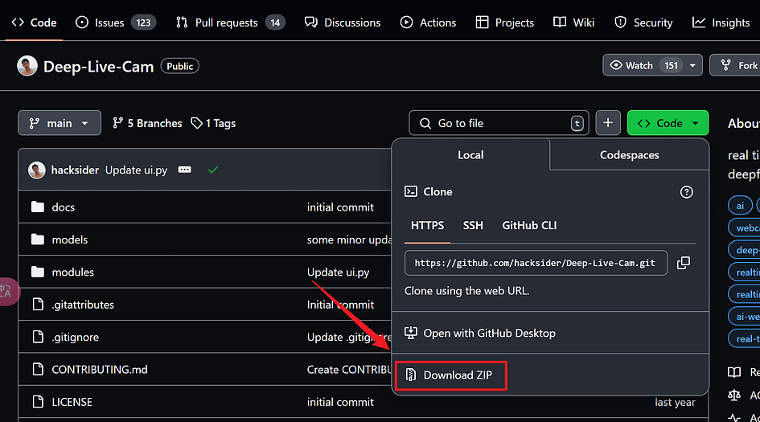

# Download Models

Download Models

1. [GFPGANv1.4](https://huggingface.co/hacksider/deep-live-cam/resolve/main/GFPGANv1.4.pth)

3. [inswapper\_128\_fp16.onnx](https://huggingface.co/hacksider/deep-live-cam/resolve/main/inswapper_128_fp16.onnx)

Then put those 2 files in the “models” folder

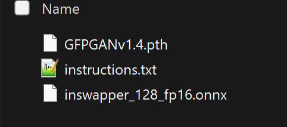

# Install dependency

Following the project’s recommendations, we will introduce using `venv` to complete the subsequent steps.

> **_What is_** `_venv_` **_?_**
> 
> `_venv_` _is an important tool in Python used for creating virtual environments. Here's the main information about_ `_venv_` _:_
> 
> **_Definition and Purpose of_** `_venv_`
> 
> `_venv_` _is a module in the Python standard library used to create lightweight, isolated Python environments. Its main purposes include:_
> 
> Creating isolated Python runtime environments to avoid package conflicts between different projects.
> 
> Allowing the use of different versions of Python packages and libraries on the same machine.
> 
> Ensuring that project dependencies don’t affect the system-wide Python installation.
> 
> **_How_** `_venv_` **_Works_**
> 
> _A virtual environment created by_ `_venv_` _is actually a directory with a specific file structure:_
> 
> It has a bin subdirectory containing links to the Python interpreter.
> 
> It also has subdirectories for storing packages specific to that virtual environment.
> 
> _When a virtual environment is activated, it modifies the system PATH to prioritise the Python interpreter in the virtual environment._
> 
> **_Advantages of Using_** `**_venv_**`
> 
> Project isolation: Each project can have its own dependencies without interfering with others.
> 
> Version control: You can use different versions of the same package in different projects.
> 
> Clean development environment: Avoids potential system conflicts from global package installations.
> 
> Easy project sharing: You can easily export a list of project dependencies for others to replicate the environment.

Please run the following command in the project’s root directory to create a new Python virtual environment named “venv” in the current directory:

```
python -m venv venv
```

If you have multiple versions of Python installed on your system, the simplest way to specify using version 3.10 is to include the full path in the command:

```
/path/to/python3.10 -m venv venv
```

After execution, a `venv` virtual environment folder will be created under the `Deep-Live-Cam` directory.

Next, let’s activate and enter the virtual environment:

For Windows users, please execute:

```
.\venv\Scripts\activate
```

On macOS/Linux, run:

```
source venv/bin/activate
```

At this point, the command line will change to (venv). Execute the following command to start installing dependencies:

```
pip install -r requirements.txt
```

When running, the download process will be displayed as follows. Please be patient, as this may take a few minutes:

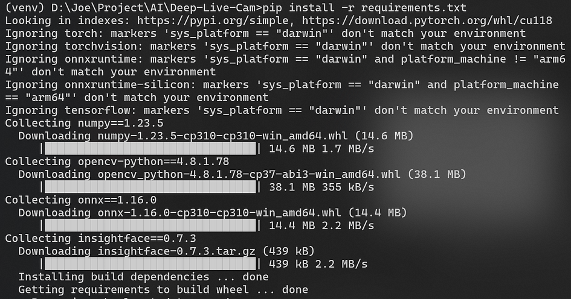

If you encounter the following error, please ensure that the Python version is 3.10, as `distutils` has been deprecated in later versions.

```
ModuleNotFoundError: No module named 'distutils'
```

Alternatively, you can try the following command to install `distutils`:

```
pip install setuptools
```

At this point, you should be able to run the program. If your computer does not have a GPU, you can start using the CPU to run the program by executing the following command:

```
python run.py
```

If you wish to use Nvidia’s GPU with the CUDA toolkit for acceleration, please proceed with the following steps.

> _Note: When you run this program for the first time, it will download some models ~300MB in size._

# Using Nvidia CUDA Acceleration

1. Install [CUDA Toolkit 11.8](https://developer.nvidia.com/cuda-11-8-0-download-archive)

3. Install dependencies:

```
pip uninstall onnxruntime onnxruntime-gpu
```

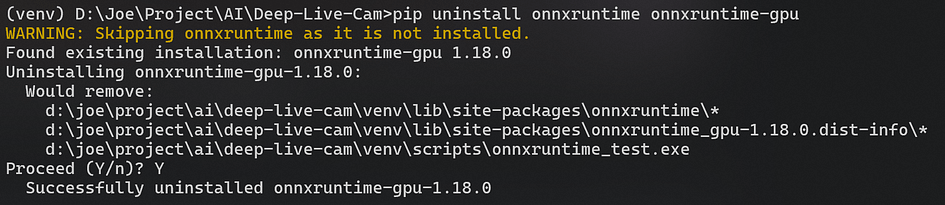

```
pip install onnxruntime-gpu==1.16.3
```

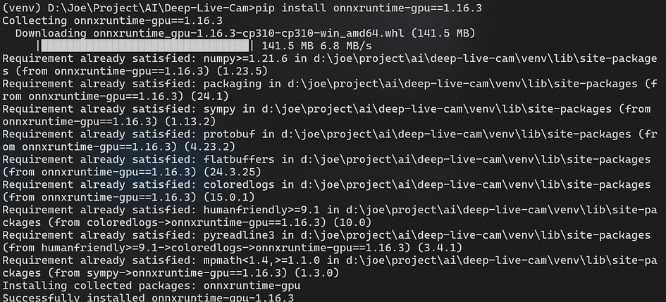

3\. Execute the following command to run the program using the GPU:

```
python run.py --execution-provider cuda
```

If you successfully see the program window open without any errors, you can skip the other acceleration methods below and proceed to the usage phase.

# CoreML Execution Provider (Apple)

For Apple Silicon users:

1. Install dependencies:

```
pip uninstall onnxruntime onnxruntime-silicon
pip install onnxruntime-silicon==1.13.1
```

2\. Usage in case the provider is available:

```
python run.py --execution-provider coreml
```

For Apple Legacy users:

1. Install dependencies:

```
pip uninstall onnxruntime onnxruntime-coreml
pip install onnxruntime-coreml==1.13.1
```

2\. Usage in case the provider is available:

```
python run.py --execution-provider coreml
```

# DirectML Execution Provider (Windows)

1. Install dependencies:

```
pip uninstall onnxruntime onnxruntime-directml
pip install onnxruntime-directml==1.15.1
```

2\. Usage in case the provider is available:

```
python run.py --execution-provider directml
```

# OpenVINO™ Execution Provider (Intel)

1. Install dependencies:

```
pip uninstall onnxruntime onnxruntime-openvino
pip install onnxruntime-openvino==1.15.0
```

2\. Usage in case the provider is available:

```
python run.py --execution-provider openvino
```

# How to use Deep Live Cam?

Executing `python run.py` command will launch this window:

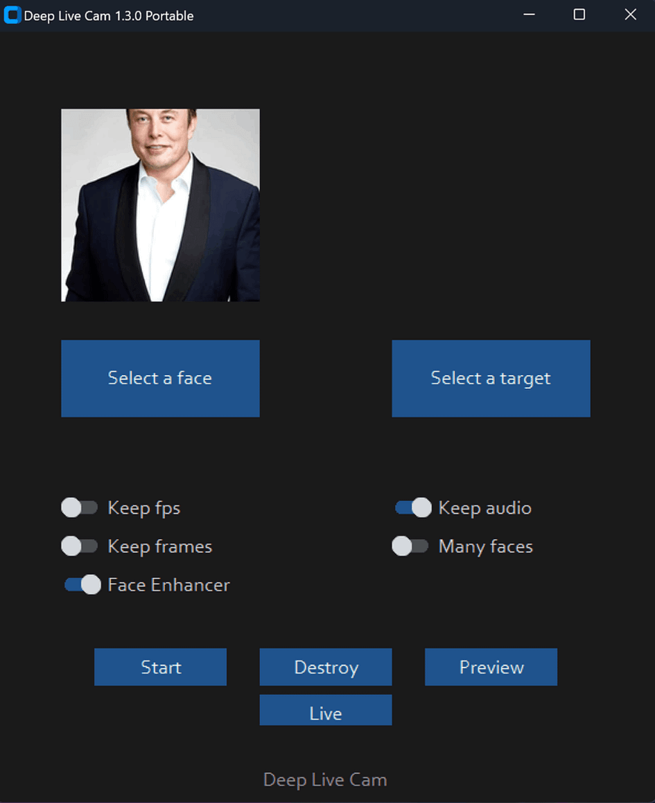

# Video/Image Face Swap Mode

Choose a face (image with the desired face) and the target image/video (image/video in which you want to replace the face) and click on Start. Open File Explorer and navigate to the directory you select your output to be in. You will find a directory named <video\_title> where you can see the frames being swapped in real time. Once the processing is done, it will create the output file.

# Webcam Mode

1. Select a face

3. Click live

5. Wait for a few seconds (it takes a longer time, usually 10 to 30 seconds before the preview shows up)

`Face Enhancer` will make the image very clear, but when the hardware performance is not strong enough, the video may become choppy.

Example:

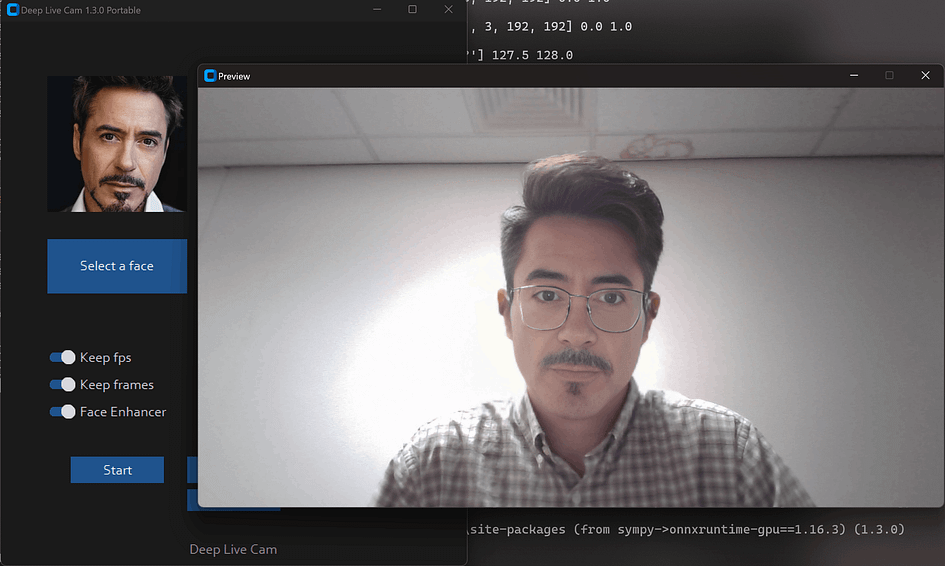

# Trouble Shooting: Face area showing black block?

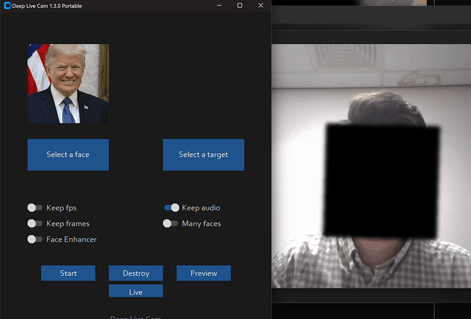

You can try the following commands and run the program again. Note that all instructions should be executed within the `venv` environment.

```
pip uninstall onnxruntime onnxruntime-gpu
pip install onnxruntime-gpu==1.16.3
```

For Mac users:

```
pip uninstall onnxruntime
pip install onnxruntime==1.16.3
```

Run:

```
python run.py
```

or:

```
python run.py --execution-provider cuda
```

# CLI Mode & Command Usage (Optional)

Using the `-s/--source` argument will make the run program in cli mode.

Additional command line arguments are given below.

```
options:
  -h, --help                                               show this help message and exit
  -s SOURCE_PATH, --source SOURCE_PATH                     select an source image
  -t TARGET_PATH, --target TARGET_PATH                     select an target image or video
  -o OUTPUT_PATH, --output OUTPUT_PATH                     select output file or directory
  --frame-processor FRAME_PROCESSOR [FRAME_PROCESSOR ...]  frame processors (choices: face_swapper, face_enhancer, ...)
  --keep-fps                                               keep original fps
  --keep-audio                                             keep original audio
  --keep-frames                                            keep temporary frames
  --many-faces                                             process every face
  --video-encoder {libx264,libx265,libvpx-vp9}             adjust output video encoder
  --video-quality [0-51]                                   adjust output video quality
  --max-memory MAX_MEMORY                                  maximum amount of RAM in GB
  --execution-provider {cpu} [{cpu} ...]                   available execution provider (choices: cpu, ...)
  --execution-threads EXECUTION_THREADS                    number of execution threads
  -v, --version                                            show program's version number and exit
```

# Set Up a Face-Swapped Camera in Zoom Using OBS

You can download OBS from the official website. It is a powerful and open-source live-streaming software:

[https://obsproject.com/download](https://obsproject.com/download)

After installation, add a `Window Capture` in the `Sources` section and select the Preview window where Deep Live Cam is running as the video source. Then, click on `Start Virtual Camera` on the right.

Next, let’s take Zoom as an example. In the settings-video, select the OBS virtual camera to display the real-time face-swapped image.

# Conclusion

Deep Live Cam is a powerful tool that brings the future of digital media into the present, offering unparalleled capabilities for real-time face swapping and video deepfakes with minimal setup. Whether you’re an artist, content creator, or tech enthusiast, this software opens up a world of creative possibilities, allowing you to explore new visual concepts and enhance your digital projects.

However, it’s essential to use this software responsibly and in accordance with local laws. If you are using the face of a real person, it is crucial to obtain their consent and to clearly state that the content is a deepfake when sharing it online. By following these guidelines, you can explore AI-driven creativity ethically while respecting the rights of others.

# References

- hacksider. “GitHub — Hacksider/Deep-Live-Cam: Real Time Face Swap and One-Click Video Deepfake with Only a Single Image.” _GitHub_, 24 July 2024, github.com/hacksider/Deep-Live-Cam. Accessed 16 Aug. 2024.

- “Hacksider/Deep-Live-Cam at Main.” _Huggingface.co_, 3 Oct. 2023, huggingface.co/hacksider/deep-live-cam/tree/main. Accessed 16 Aug. 2024.

- jeremy\_rutman. “No Module Named Distutils….But Distutils Installed?” _Stack Overflow_, 2024, stackoverflow.com/questions/69919970/no-module-named-distutils-but-distutils-installed. Accessed 16 Aug. 2024.

- “Python Release Python 3.10.0.” _Python.org_, [www.python.org/downloads/release/python-3100/.](http://www.python.org/downloads/release/python-3100/)

- “Download FFmpeg.” _Ffmpeg.org_, 2019, [www.ffmpeg.org/download.html.](http://www.ffmpeg.org/download.html.)
