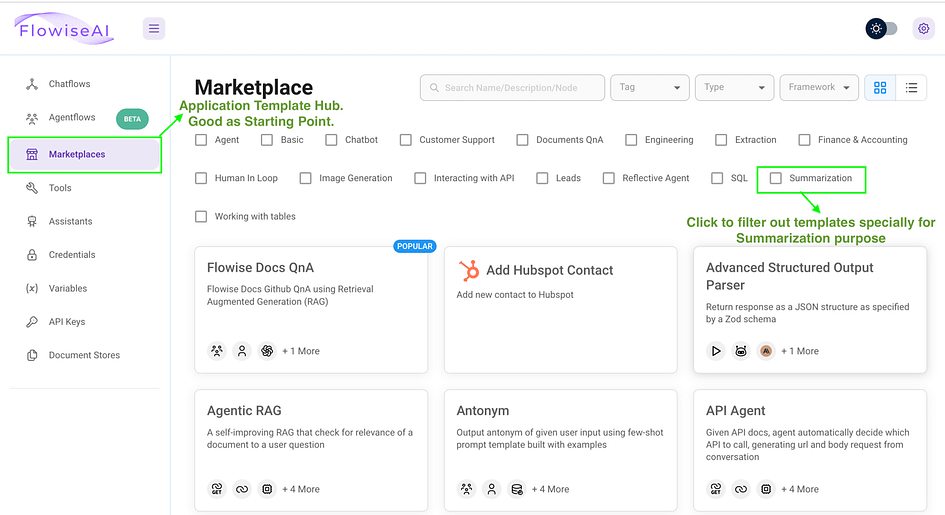

## A Comprehensive Guide[](https://medium.com/@researchgraph?source=post_page---byline--0bf21fc68b66--------------------------------)

<figure>


<figcaption>

Flowise Logo

</figcaption>

</figure>

# Introduction

Flowise is an open-source, low-code tool tailored for developers to build customised orchestration flows and AI agents for Large Language Models (LLMs). It simplifies the development cycle, enabling quick iterations and a smooth transition from testing to production. In this article, we will explore the primary use cases for Flowise.

# Get Started

Flowise provides two deployment choices: local installation or obtaining product access via their [official website](https://flowiseai.com/). We chose to proceed with a local deployment for our experimentation.

# Download with NodeJS

- Ensure NodeJS is installed on your system. Compatible versions include 18.15.0 or 20 and above.

- Install Flowise using npm:

```
npm install -g flowise
```

- Launch Flowise:

```
npx flowise start
```

- Access the interface by navigating to:

```
http://localhost:3000
```

- Download with Docker

- Clone the repository:

```
git clone https://github.com/FlowiseAI/Flowise.git
```

- Navigate to the Docker directory:

```
cd docker/
```

- Create a .env file by duplicating .env.example

- Launch the Docker container:

```
docker compose up -d
```

- Access Flowise at:

```
http://localhost:3000
```

- To stop the service:

```
docker compose stop
```

<figure>


<figcaption>

Docker Compose Command Running Interface

</figcaption>

</figure>

<figure>


<figcaption>

Docker Compose Command Result Interface

</figcaption>

</figure>

# Drag-And-Drop UI: Build Customised LLM Applications

Flowise empowers users to create custom applications that harness LLM capabilities for specific needs. This is achieved through a user-friendly drag-and-drop interface, simplifying the development process. To kickstart your LLM application creation, consider exploring the **_MarketPlace_** Section. There, you can select a pre-made template and tailor it to your requirements. Let’s explore this process with a step-by-step example.

1. First, once you access the interface, head over to the Marketplace tab. This page offers a selection of ready-to-use templates, complete with filters to search for specific use cases such as Customer Support.

<figure>



<figcaption>

Flowise Marketplace Tab

</figcaption>

</figure>

2\. For our demonstration, we chose the Conversational Retrieval QA Chain template to create a chatbot that responds to uploaded text files. To start using it, open the template and click on the “Use Template” button located in the right corner.

<figure>


<figcaption>

Flowise Template Page

</figcaption>

</figure>

3\. To streamline the process of acquiring an API key, we replaced the Mistral chat models with OpenAI chat models. Additionally, we substituted the FAISS library with Pinecone for vector data storage and retrieval (highlighted by green rectangles in the image). Here’s a concise overview of each node shown in the screenshot:

- `Recursive Character Text Splitter`: Breaks long text into smaller, 1000-character chunks for easier processing.

- Text File: Uploads and prepares a text file for use in the system.

- `OpenAI Embeddings`: Converts text into numbers that represent its meaning, using OpenAI's technology.

- `ChatOpenAI`: The AI language model that understands and responds to queries.

- `Pinecone`: A database that stores and retrieves the number representations of text.

- `Conversational Retrieval QA Chain`: Manages conversations by rewording questions and finding relevant answers from stored information.

<figure>


<figcaption>

Flowise Node Description

</figcaption>

</figure>

- After refining the workflow, the next step is to acquire the necessary API keys for specific components, such as OpenAI chat models and Pinecone. To obtain the OpenAI API key:

- Log into your OpenAI account

- Navigate to the API keys section on the [platform](https://platform.openai.com/api-keys)

- Generate a new secret key

- Copy this key to the ‘Connect Credential’ field in the OpenAI-related nodes

<figure>


<figcaption>

OpenAI API Creation

</figcaption>

</figure>

- Follow a similar process for the [Pinecone API key](https://app.pinecone.io/organizations), applying it to the Pinecone node. For Pinecone, an additional step is required: creating an index for storing and retrieving high-dimensional vectors. In the Pinecone index tab:

- Specify an index name

- Set the vector dimensions based on your chosen model

In this case, we’re using OpenAI’s `text-embedding-ada-002`, which produces embeddings with 1536 dimensions. Therefore, when creating the Pinecone index for these embeddings, set the dimension to 1536.

<figure>


<figcaption>

Pinecone Index Creation

</figcaption>

</figure>

With the API credentials in place, we can now proceed to upload our content into the workflow:

- Navigate to the Text File node and select the Upload File button.

- Choose a .txt file for processing. In this instance, we’re using [Flowise’s GitHub README file](https://github.com/FlowiseAI/Flowise/blob/main/README.md) as our example content.

- Save the entire workflow by clicking the purple button located in the upper right corner.

- To finalise the process, click on the green database icon. This action confirms and initiates the upload of vector embeddings to Pinecone.

<figure>


<figcaption>

Flowise Workflow Running Instructions

</figcaption>

</figure>

<figure>


<figcaption>

Flowise Document Upserted To Vector Database

</figcaption>

</figure>

4\. Your chatbot is now operational and ready for interaction. To begin:

- Locate the purple chat icon in the upper right corner of the interface.

- Click on this icon to open the chat window.

- Start asking questions about the content you’ve just uploaded.

<figure>


<figcaption>

Flowise Workflow Start Button

</figcaption>

</figure>

<figure>


<figcaption>

Flowise Chatbot Dialog Box

</figcaption>

</figure>

# API Integration: Extending Flowise Capabilities

Flowise offers a powerful API alongside its drag-and-drop interface. This API allows programmatic access to Flowise features, enabling automated workflows and custom integrations. It facilitates remote workflow management and expands AI integration possibilities. For instance, interacting with our chatbot can be achieved through a simple post request to the prediction endpoint.

```
import requests
API_URL = "http://localhost:3000/api/v1/prediction/e5b97012-5ac5-440b-b76c-2e7adfd88b86"
def query(payload):
    response = requests.post(API_URL, json=payload)
    return response.json()
output = query({
    "question": "What is this document about?",
})
```

<figure>


<figcaption>

Flowise API Call

</figcaption>

</figure>

# Conclusion

In conclusion, Flowise offers a versatile platform for building and deploying AI-powered applications. Whether you prefer the intuitive drag-and-drop interface for visual workflow creation or the powerful API for programmatic integration, Flowise provides the tools to bring your AI projects to life.

# References

- Flowise Getting Started Guide — Official documentation on setting up and starting with Flowise. [Read more.](https://docs.flowiseai.com/getting-started)

- Using Flowise — Comprehensive guide on utilizing Flowise features and capabilities. [Explore guide.](https://docs.flowiseai.com/using-flowise)

- Flowise GitHub Repository — Source code and technical documentation for Flowise. [Visit GitHub.](https://github.com/FlowiseAI/Flowise)

- Flowise Tutorial Video — Step-by-step visual guide on using Flowise. [Watch video.](https://www.youtube.com/watch?v=riXpu1tHzl0)
