## A Step-by-Step Guide to Using FLUX 1.1, FLUX Fill, Canny, Redux Tools, and Camera Filename Prompt Techniques for Creating or Editing Images in Any Style and Realism[](https://medium.com/@researchgraph?source=post_page---byline--745e5b78bc9c--------------------------------)


# Author

- [Zijian Yang](https://www.linkedin.com/in/zijian-yang/) (**ORCID:** [0009–0006–8301–7634](https://orcid.org/0009-0006-8301-7634))

# Introduction to FLUX 1.1

On October 4, 2024, Black Forest Labs launched the latest image generation model, FLUX 1.1 \[pro\], along with the BFL API, offering advanced image generation capabilities for developers and enterprises. From faster generation speeds to higher image quality, this version is poised to become another milestone in the field of image generation. Here are the key highlights of FLUX 1.1 \[pro\]:

- **Parameter Scale**: Boasting 12 billion parameters, significantly surpassing similar models.

- **Generation Speed**: Enhanced by **6 times** compared to the previous version, greatly improving efficiency.

- **Resolution Support**: Natively generates ultra-high-definition images of up to **2K** resolution.

- **BFL API**: Introduces a new API interface, supporting quick integration of image generation features.

- **Industry Recognition**: Achieved the highest Elo score in Artificial Analysis testing, with performance highly acclaimed.

<figure>

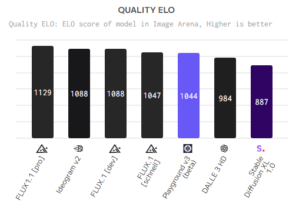

<figcaption>

[Source](https://artificialanalysis.ai/text-to-image)

</figcaption>

</figure>

Additionally, Black Forest Labs has open-sourced the FLUX series of tools:

- **FLUX.1 Fill**: An inpainting and outpainting model for partial redraws and image expansion.

- **FLUX.1 Depth & Canny**: The official ControlNet model.

- **FLUX.1 Redux**: Transforms image styles through prompts.

This article will guide you step-by-step through the new FLUX 1.1 AI drawing model and a suite of powerful drawing tools. With just a simple trick, you can remove the “AI smell” from images to achieve photo-level quality, whether for portraits or landscapes. All this can be accomplished with just a few clicks, making it accessible to complete beginners.

You can experience all the latest features by using [Flux.1 AI](https://flux1.ai/), where registering will give you 10 free credits.

# Generating Ultra-Realistic Images with Camera Filename Prompts

This technique is incredibly simple to use. You just need to mimic the file naming format of DSLR cameras in your prompts.

For instance, **“CR2”** is the raw image file format used by Canon cameras. By inputting **“IMG” + a random number + “.CR2”**, along with your desired content, you can create a realistic image.

For example, using “a cute cat” as a prompt, head over to the [FLUX 1.1 AI Image Generator](https://flux1.ai/flux1-1) to experience the latest and most powerful model. You don’t need to worry about anything else — simply paste the prompt, select the image size, and let the AI handle the rest.

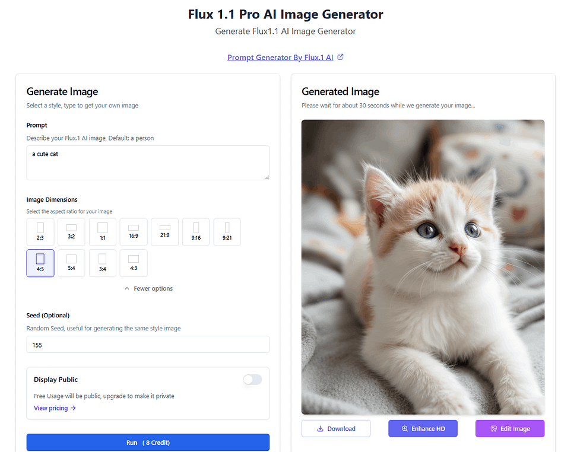

As you can see, the image is aesthetically pleasing, but there are still noticeable AI-generated styles and unrealistic elements. Now, let’s try using the same seed with the addition of a camera filename at the beginning of the prompt:

```
IMG_1018.CR2: a cute cat
```

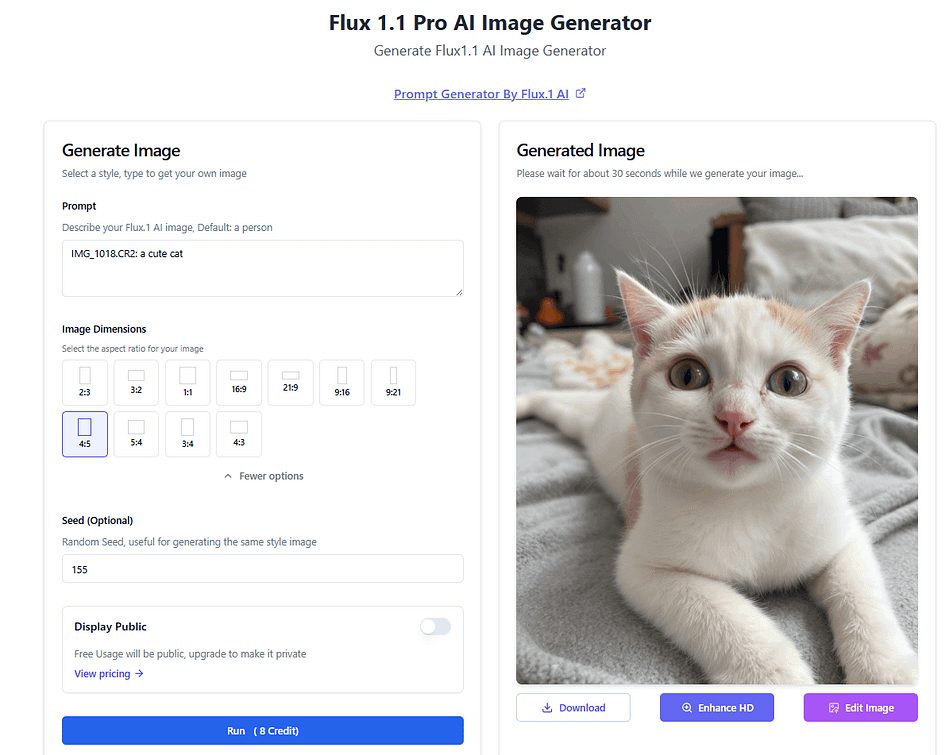

You can see that the photo looks much more realistic.

For example, when we input “selfie on The Great Wall,” the resulting image is already quite close to reality. However, the lighting and the people appear unnatural, and the distant landscape has a noticeable smudging effect.

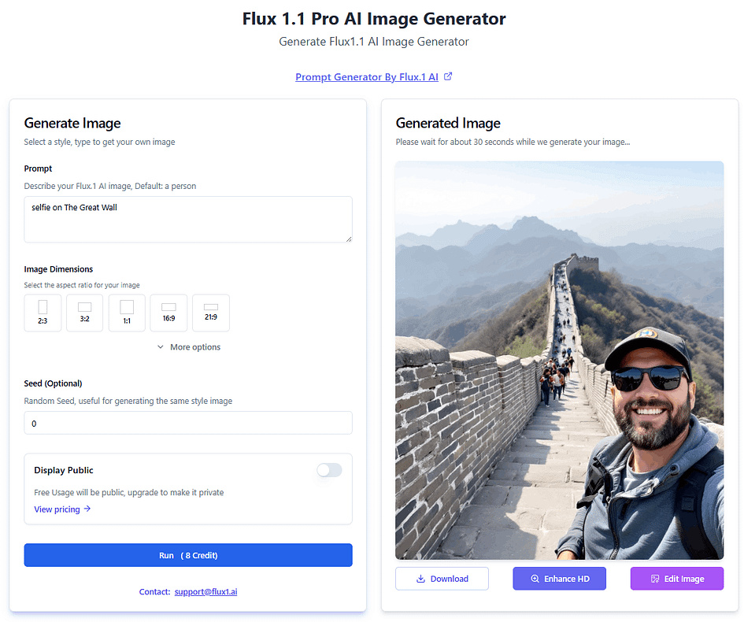

By modifying the prompt to include “IMG\_0314.cr2,” as in “IMG\_0314.cr2: selfie on The Great Wall,” you can see that the image appears significantly more natural and realistic.


Using this prompt technique, we can achieve a variety of styles.

# Vintage Film Style Prompt

**“IMG\_0143.CR2: candid photo of a group of friends at a 1970s outdoor festival”**

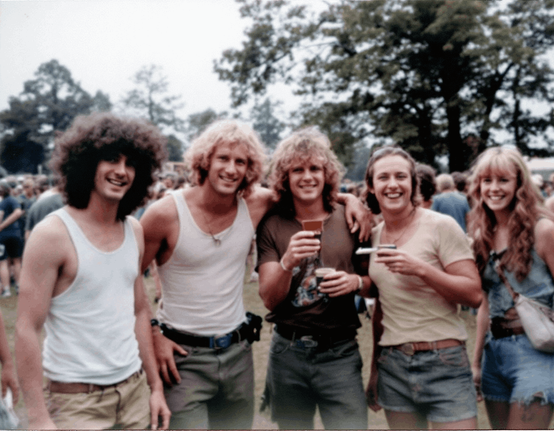

**“IMG\_1018.CR2: vintage black-and-white portrait of a man sitting at a typewriter in an old newsroom”**


# Modern Smartphone Photo Texture Prompt

**HEIC** is the file format used by Apple for iPhone photos, often characterised by high resolution and clarity typical of modern smartphone photography. By including an extension like **IMG\_1025.HEIC** in your prompt, you can generate snapshots that resemble natural photos taken with a smartphone. This filename is particularly effective, with notable results observed using numbers such as 134, 1025, and 2222.

**“IMG\_1025.HEIC: a family”**


**“IMG\_2222.HEIC Chinese family”**

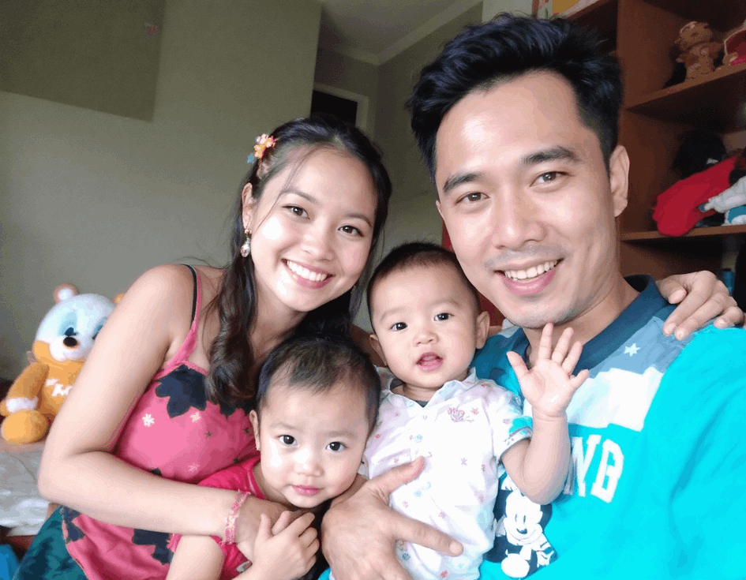

# Creating Early Internet Style with Photobucket Find Prompt

By including a structure like **Photobucket find, IMG\_0024.CR2,** in your prompt, you can simulate the style of photos shared on platforms like Photobucket from the early internet era. These images often have slight pixelation and compression artefacts.

**“Photobucket find, IMG\_0024.CR2, 2005: a grainy photo of friends at a high school prom”**

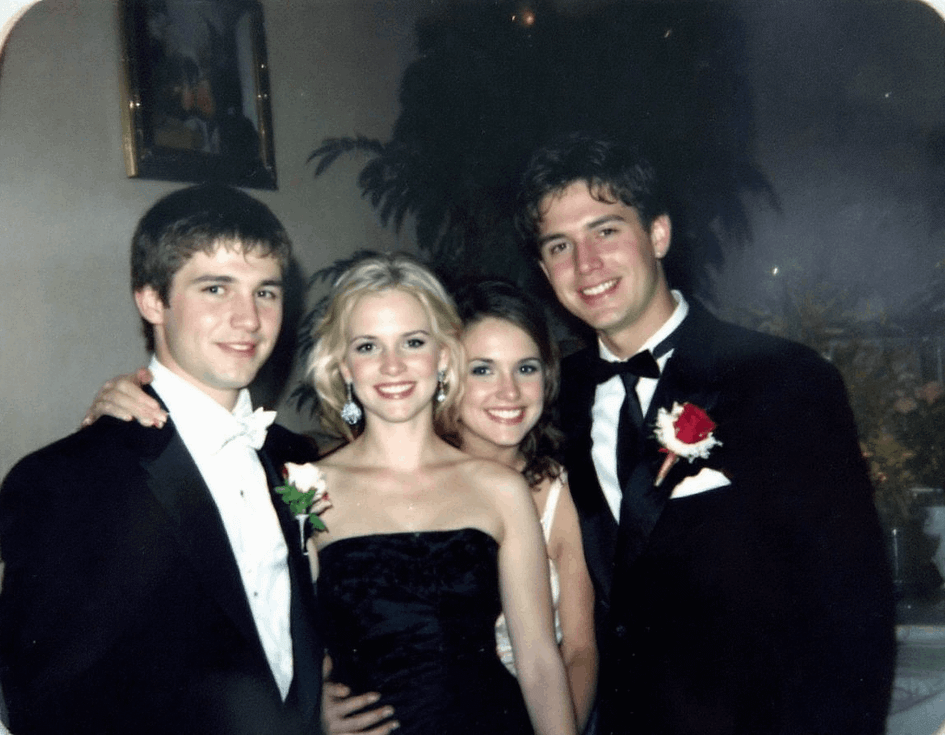

**“Photobucket find, IMG\_0024.CR2, 2006: a group of teenagers hanging out at a mall in the early 2000s”**

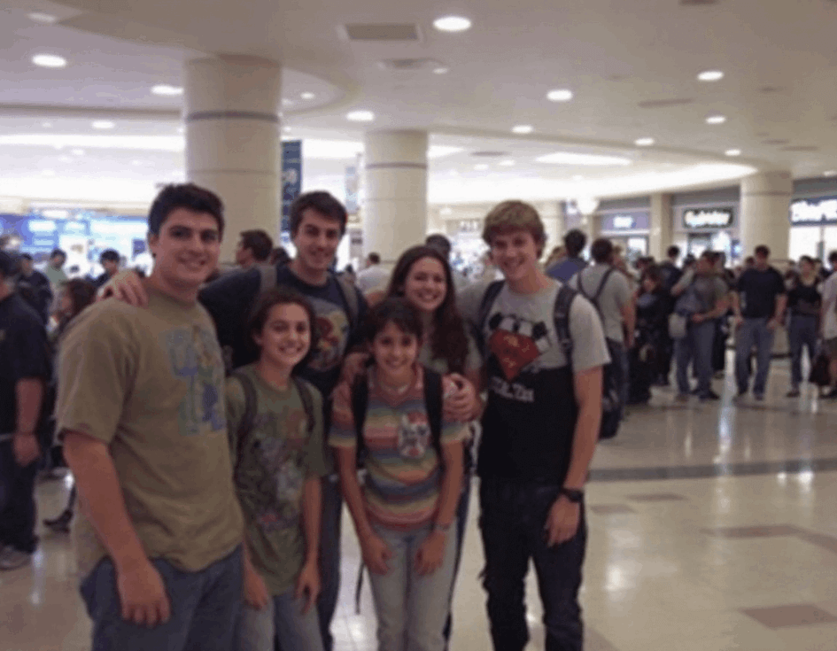

# Ordinary Everyday Snapshot Prompt

The **.jpg** extension typically represents compressed image files, making it suitable for generating every day, less polished snapshots. These images may appear slightly distorted but closely resemble the real-life records of an average person’s daily life.

**“IMG\_1018.jpg: casual photo of a street vendor in a busy market selling fruits”**


**“IMG\_1018.jpg: blurry photo of kids playing soccer in a neighbourhood street”**

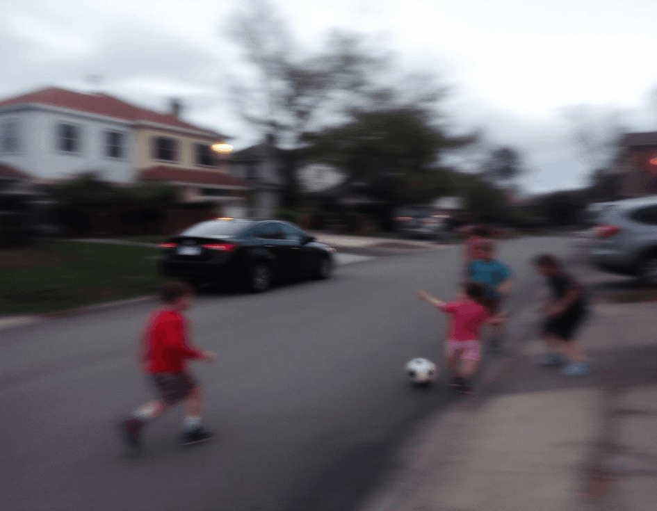

# Additional Extensions and Photography Equipment Prompts

In addition to CR2, HEIC, and JPG, other formats can simulate the effects of different photography equipment, further enhancing the realism of images.

- **TIFF**: This professional photography format produces higher-resolution images that may exhibit slight graininess, making it ideal for recreating mid-20th-century photographic styles.

**“IMG\_1120.TIFF: black-and-white portrait of a 1950s jazz musician playing a saxophone”**


**“IMG\_0456.TIFF: candid street photo of a woman walking in New York City during the 1960s”**

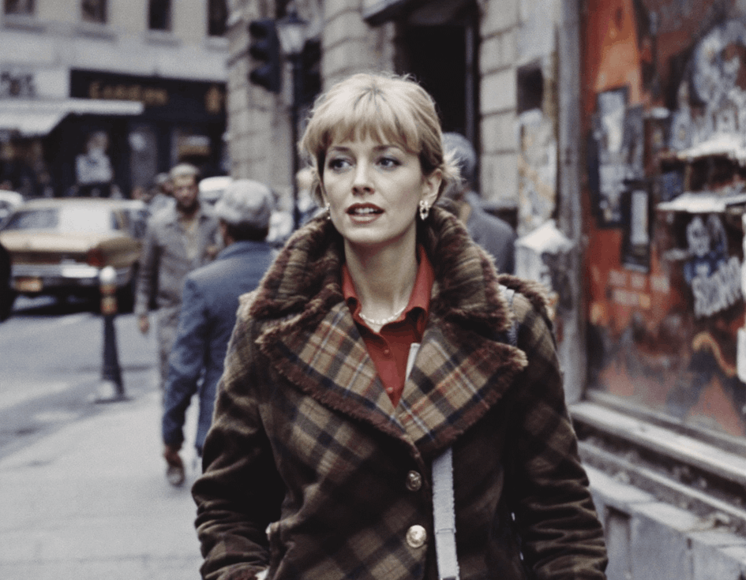

- **BMP**: A format used by early Windows operating systems, characterised by lower image quality and slight colour deviations, suitable for recreating digital photos from the 1990s.

**“IMG\_3345.BMP: photo of a family at a computer desk in 1998”**

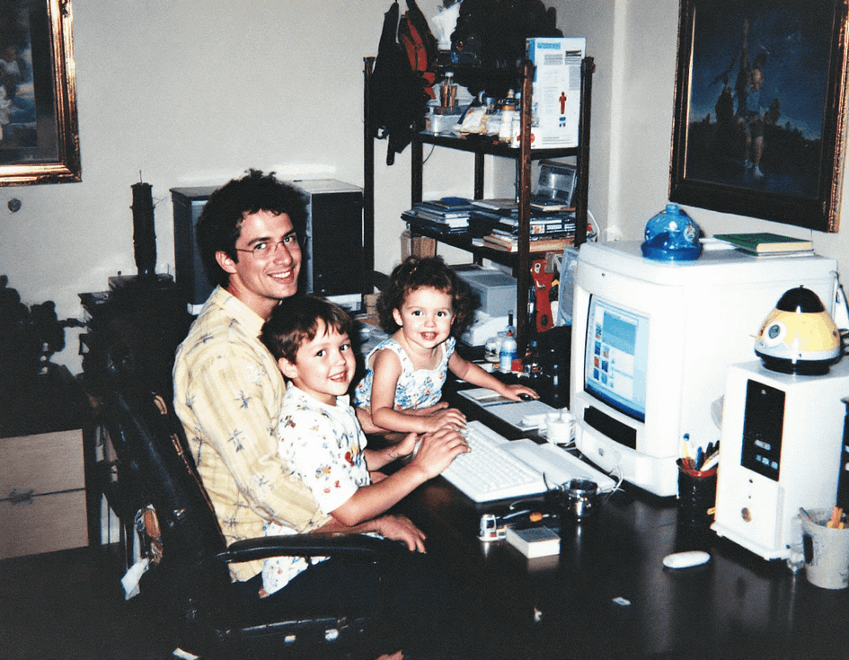

# FLUX Fill: Inpainting and Outpainting

FLUX Fill is a versatile image editing tool that uses cutting-edge inpainting and outpainting technology. It seamlessly integrates new content into existing images, maintaining a natural and cohesive appearance.

With FLUX Fill, users can extend images beyond their original borders, make precise edits, and even guide modifications using text prompts. These capabilities make it suitable for creative projects and professional workflows requiring high-quality results.

Let’s try out FLUX Fill at [https://flux1.ai/flux-fill](https://flux1.ai/flux-fill)

<figure>

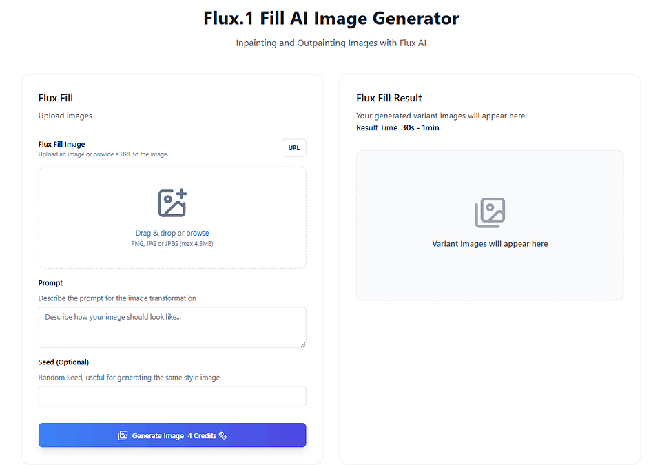

<figcaption>

Flux.1 Fill AI Image Generator

</figcaption>

</figure>

For example, using the FLUX Fill tool, we can transform a cat into a dog in an image. Simply upload the image, and a URL will be provided. Then, use the cursor to erase the cat, leaving a blank space. In the prompt section, enter “A dog on the table” and FLUX Fill will replace the cat with a dog while keeping the rest of the image unchanged.

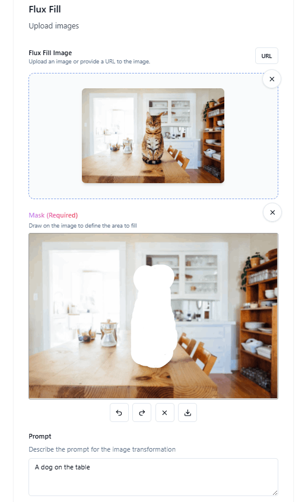


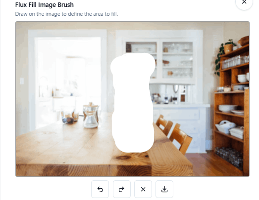


Alternatively, we can change the background of the image to place the cat on a beach and add sunglasses. First, erase the background around the cat, making it white, and also erase the cat’s face. Then, enter the prompt “A cat sitting on the beach wearing a pair of sunglasses.” The result will transform the scene accordingly.

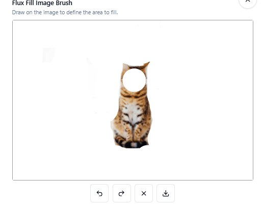


We can even change a person’s facial expression, such as transforming a sad face into a happy one.


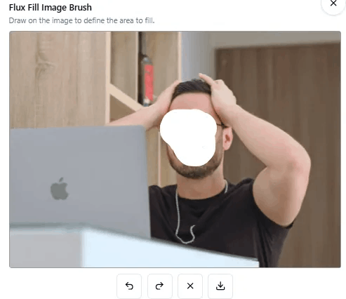


# FLUX Canny & Depth: Preserve structure while transforming content

FLUX Canny and FLUX Depth are advanced models designed to maintain structural integrity during image edits. FLUX Canny utilises edge detection to guide transformations, ensuring sharp, detail-oriented edits, while FLUX Depth uses depth maps to preserve spatial coherence, making it ideal for depth-aware tasks.

Both models support text-guided image modifications, allowing for precise retexturing and restyling while keeping the original composition intact.

You can find these two tools here:

[https://flux1.ai/flux-canny](https://flux1.ai/flux-canny)

[https://flux1.ai/flux-depth](https://flux1.ai/flux-depth)

For example, we can use Canny to transform an image of a man running into Iron Man running through a forest.

First, open [Flux Canny](https://flux1.ai/flux-canny), where you can upload an image of a man running. Then, in the prompt field below, enter “iron man is running in the forest” to achieve the desired effect.

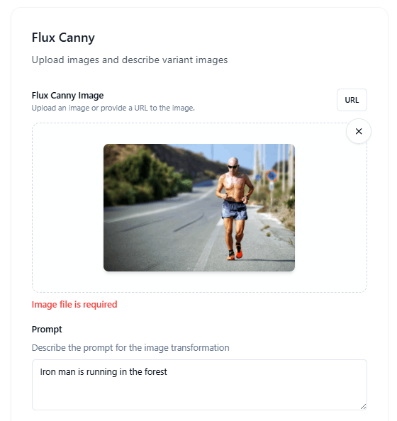


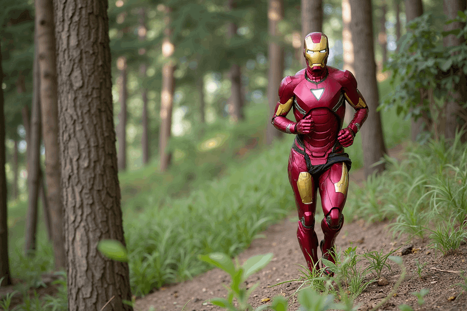

The principle of Canny can be understood through the following image, as it primarily captures edge information.  
The image below demonstrates how the Canny edge detection technique extracts edge information from the input image, generating an image that aligns with the text description while preserving the original structure.

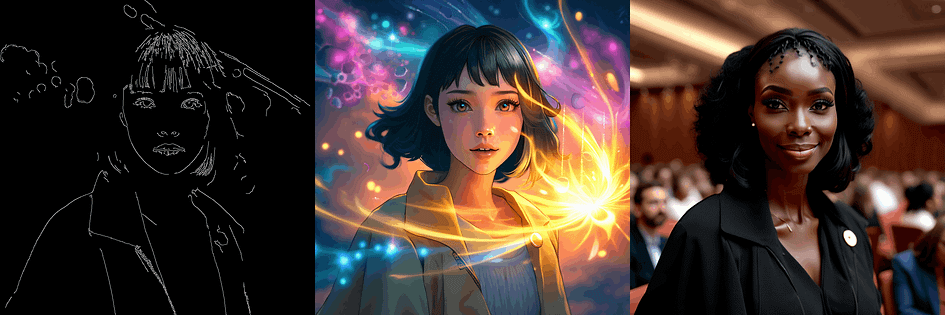

<figure>

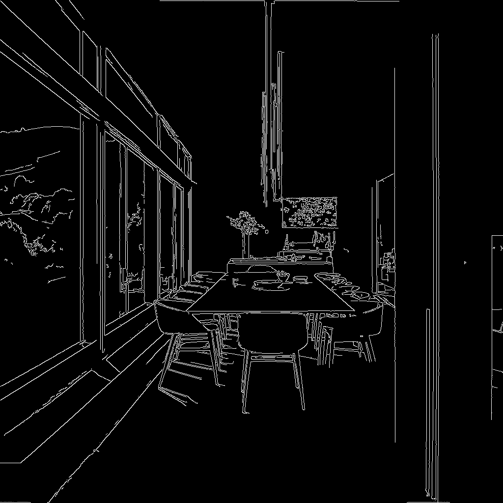

<figcaption>

[Source](https://huggingface.co/XLabs-AI/flux-controlnet-canny-v3)

</figcaption>

</figure>

We can also use the Depth feature to create new images by preserving the depth information of the original. For instance, we can transform a photo of a narrow alley into a cyberpunk world.

First, visit [FLUX Depth](https://flux1.ai/flux-depth), upload an image to provide the structural base, and then enter your desired prompt, such as “a cyberpunk street.” Click generate, and you’ll get results like the one shown below.

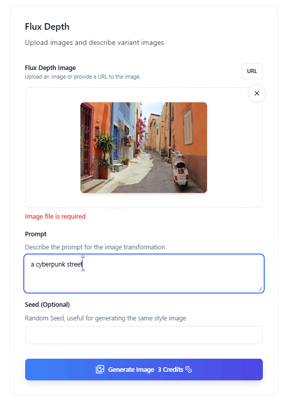


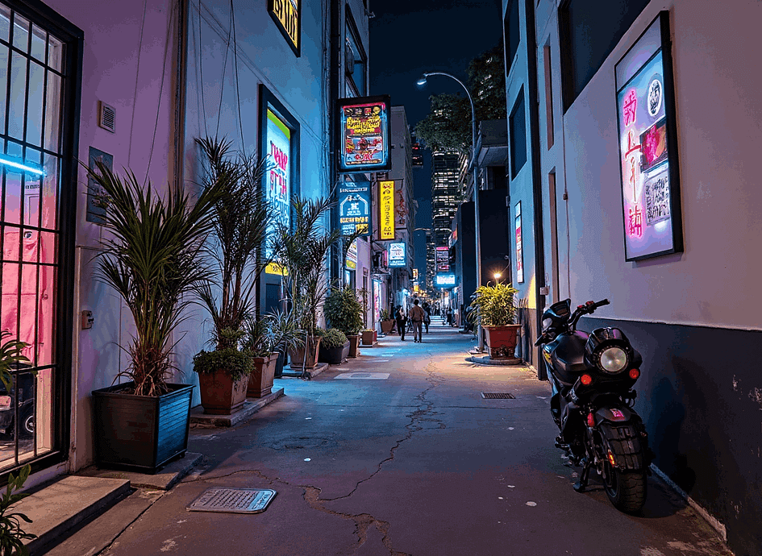

“Depth” utilises depth maps to analyse and preserve the three-dimensional structure of input images. By understanding spatial relationships, it enables precise, text-guided transformations while maintaining the original composition’s integrity. This approach ensures that generated images align with the intended structural layout, making it particularly effective for applications requiring accurate depth representation.

Here’s how FLUX Depth works.

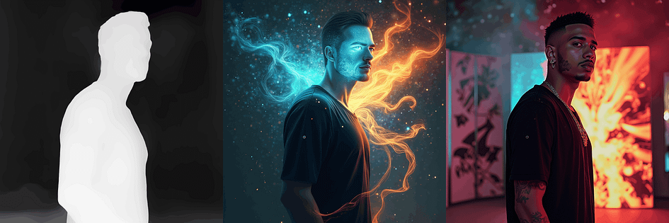

<figure>

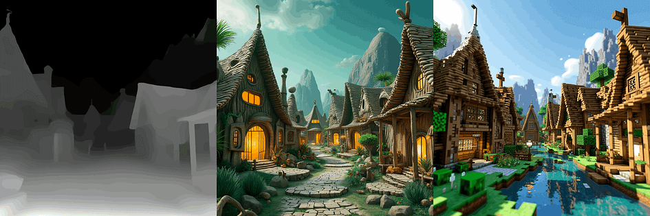

<figcaption>

[Source](https://huggingface.co/XLabs-AI/flux-controlnet-depth-v3)

</figcaption>

</figure>

# FLUX Redux

Flux Redux enables users to generate image variations and restyle existing images using text prompts. It maintains the core characteristics of input images while allowing for creative modifications, making it ideal for tasks like variation generation and guided restyling.

You can find FLUX Redux here: [https://flux1.ai/flux-redux](https://flux1.ai/flux-redux)

For example, if we input a portrait photo, Redux will output a variant image.


# FLUX LoRA

In addition to the tools mentioned above, we can also use different pre-trained LoRA models to achieve specific styles. For instance, in [**Flux Then And Now**](https://flux1.ai/flux-then-and-now), you can create images with a mix of contemporary and historical black-and-white photo styles using prompts.

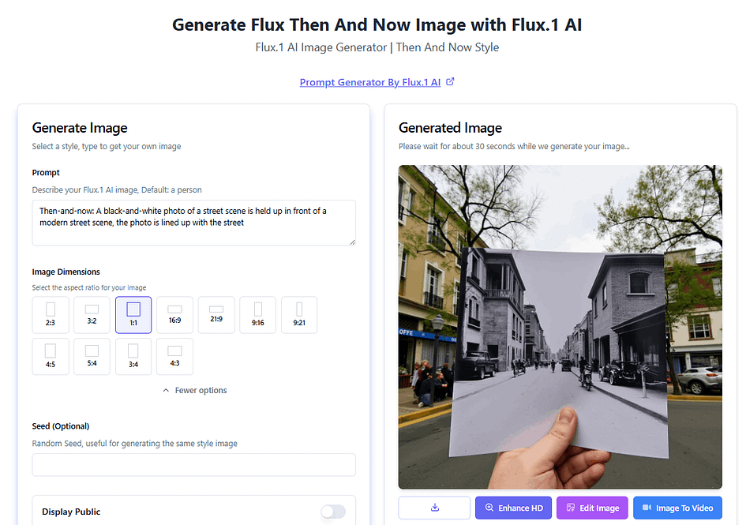

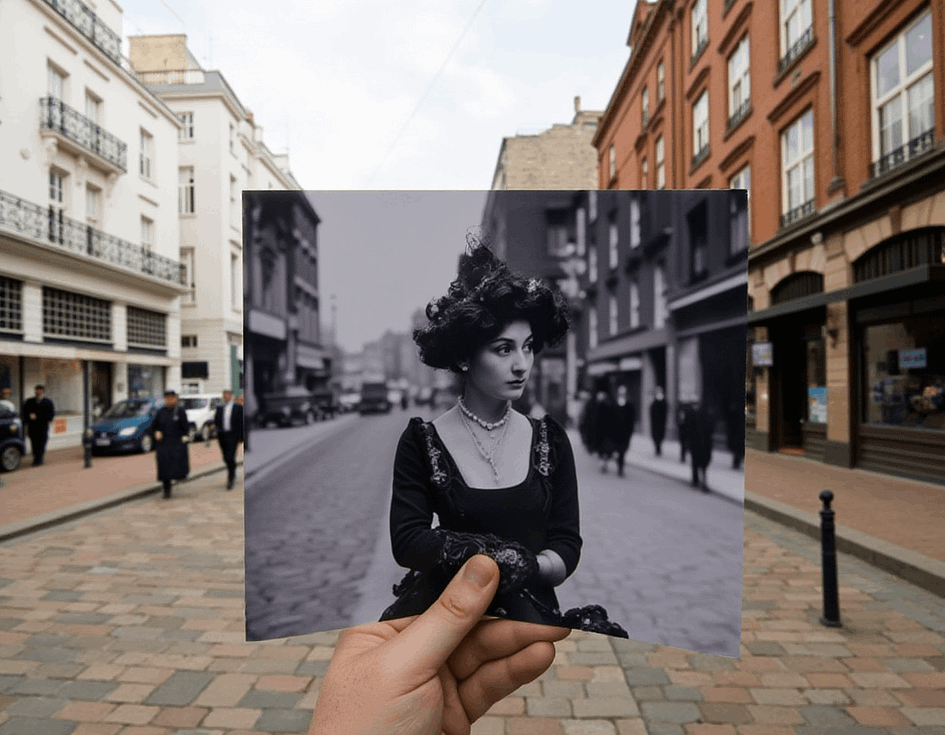

Alternatively, you can generate images in a [Cute 3D Style](https://flux1.ai/flux-cute-3d).


Or in a [Minecraft](https://flux1.ai/ai-minecraft) style.

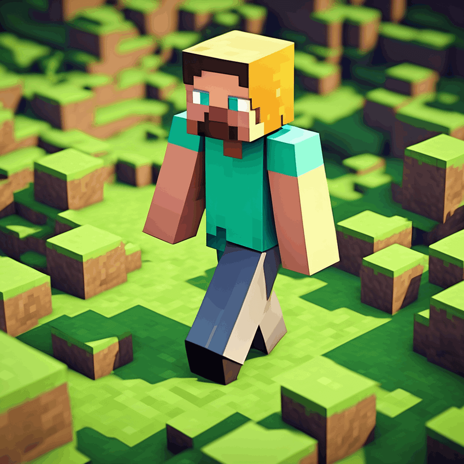

More style LoRAs and features are available for you to explore.

# Conclusion

I hope this guide has given you a clear understanding of how to make the most of FLUX 1.1 and its incredible suite of tools. From creating ultra-realistic images with filename-based prompts to exploring styles and edits with FLUX Fill, Canny, Depth, and Redux, the possibilities are endless. Whether you’re just starting or looking to push creative boundaries, FLUX 1.1 offers something for everyone. Give it a try, and see what amazing results you can achieve!

# References

- _Flux AI — Free Online Flux.1 AI Image Generator_. (2024). Flux1.Ai. [https://flux1.ai/](https://flux1.ai/)

- _Introducing FLUX1.1 \[pro\] Ultra and Raw Modes_. (2024, November 6). Black Forest Labs. [https://blackforestlabs.ai/flux-1-1-ultra/](https://blackforestlabs.ai/flux-1-1-ultra/)

[](https://medium.com/tag/ai?source=post_page-----745e5b78bc9c--------------------------------)
