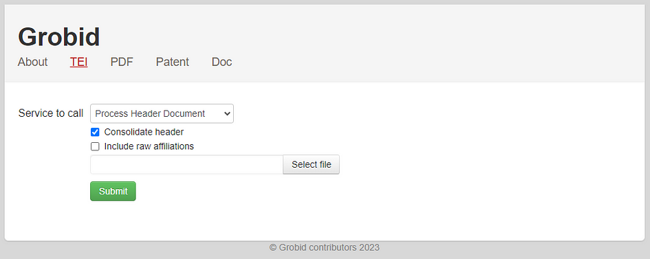

## Unlocking Knowledge Mining with Machine Learning and Python Integration[](https://medium.com/@researchgraph?source=post_page---byline--67df995b16fa--------------------------------)

<figure>


<figcaption>

Created using DALL.E on 13 Feb 2024

</figcaption>

</figure>

# Author

- Aland Astudillo (**ORCID:** [0009–0008–8672–3168](https://orcid.org/0009-0008-8672-3168))

# Introduction

GROBID is a powerful and useful tool based on machine learning that can extract text information from PDF files and other files to a structured format.

One of the key challenges in knowledge mining from academic articles is reading the content of PDF files. The ability to efficiently and accurately read the content of PDF documents using automated tools and transform this data into a structured model provides many opportunities for the integration of PDF collections to expert systems, and AI-assisted data pipelines such as chatbots.

In this article, we will discuss GROBID capabilities, explain how to install it, and explore how to use it in a Python script or Jupyter Notebook.

# **What is GROBID?**

GROBID stands for **GeneRation of Bibliographic Data** and is a machine learning library for extracting, parsing, and re-structuring raw documents such as PDF into structured XML/TEI encoded documents. It has a particular focus on technical and scientific publications. TEI stands for Text Encoding Initiative ([https://tei-c.org/Guidelines/](https://tei-c.org/Guidelines/)). It defines and documents a markup language for representing the structural, renditional, and conceptual features of texts.

# How it works?

GROBID is a machine-learning library that extracts information from PDF files. The goal of GROBID is to help the text mining process, information extraction, and semantic analysis of scientific publications by transforming them into machine-friendly, structured, representations with predictable structure.

Despite the large amount of PDF files and their extensive use among all fields, it is still a big challenge to process them because they are encoded in a vast variety of different publisher formats, often incomplete or inconsistent. In short, PDF files are difficult to exploit and use.

In a nutshell, GROBID uses a cascade of “sequence labelling models” to parse a document. Each model from the collection of models is in charge of identifying a small amount of labels to classify areas and information in the document. The final models produce 55 labels where each piece of identified information from the document will be structured. More information about how this library has been developed and the machine learning models are in this link: [https://grobid.readthedocs.io/en/latest/Principles/](https://grobid.readthedocs.io/en/latest/Principles/)

# How to install GROBID

Here we explain the installation of the GROBID tool as a service in a Linux machine (Ubuntu for example). The same steps apply to a Windows system using the Windows Subsystem for Linux tool (WSL version 2).

For Linux, in the terminal with super user (sudo) rights create a folder and once inside, proceed to download the last version of GROBID using the wget tool. The current version of GROBID is v 0.8.0. After that, unzip the file:

```
> wget https://github.com/kermitt2/grobid/archive/0.8.0.zip
> unzip 0.8.0.zip
```

For Windows, you can use Docker containers to install and run the GROBID service locally. More documentation is available at [https://grobid.readthedocs.io/en/latest/Run-Grobid/](https://grobid.readthedocs.io/en/latest/Run-Grobid/)

Note: At the time of writing this article, GROBID requires JAVA(JDK) and it works fine with JDK version 1.11 up to version JDK 1.17. Other recent JDK versions should work correctly. To check your JAVA installation, in the terminal use the following command:

```
> java -version
```

If you do not have any JAVA installed, proceed to install JAVA using the following line in the terminal.

```
> sudo apt install default-jdk
```

It is a good practice to check Java after installation to ensure the right version of Java is installed and ready to operate on your system.

# **How to run GROBID**

Once you downloaded and unzipped the “_grobid”_ file, proceed to the folder and run the grewed file. In the terminal ensure to use “./” before the command “_grewed”._

```
> cd grobid-0.8.0

> ./grewed run
```

The first time that you run the service, it will download and install all the required dependencies and then it will run the service. It will be completed by printing a message “**:grobid-service:run”** as presented in the following screenshot.


# **How to use GROBID**

After running the GROBID service, you can connect to the created server in the following direction using your browser:

[http://localhost:8070/](http://localhost:8070/)

This follows the default configuration, but you can change the port in the config file. The image below shows how it looks the first time that you access the web layout.


The TEI menu will allow you to choose among the different services to call and to upload a file with the button “Select file”. The following functionalities are available as a service:

- Header extraction and parsing

- References extraction and parsing

- Citation contexts recognition and resolution

- Full-text extraction and structuring

- PDF coordinates

- Parsing of references

- Parsing of names

- Parsing of affiliation and address

- Parsing of dates

- Consolidation and resolution of the extracted bibliographical references

- Extraction and parsing of patent and non-patent references in patent publications

- Extraction of funders and funding information

Once you upload a PDF document and choose the required service, you can press the Submit button



After a few seconds, the web will show you the XML structure of the output depending on what service you have selected. You can download the resulting XML structure in an XML file. The image below shows the result of processing the full-text document for a given paper. For example, in the image below we used the article _Pan et al., 2024 Unifying Large Language Models and Knowledge Graphs: A Roadmap. arXiv:2306.08302_ downloaded from arXiv ([https://arxiv.org/abs/2306.08302](https://arxiv.org/abs/2306.08302))


# **How to use GROBID Python Client**

The GROBID Python client is a handy tool that can process efficiently and concurrently a set of PDF files in a given folder using GROBID as a service without requiring the web option. It includes a command line for processing PDFs and writing the results in a given folder. It allows us to use this tool inside Python scripts. To use this client, It assumes that you are running GROBID service, as we saw in the previous steps.

The repository of this client is here [https://github.com/kermitt2/grobid\_client\_python/blob/master/grobid\_client/grobid\_client.py](https://github.com/kermitt2/grobid_client_python/blob/master/grobid_client/grobid_client.py)

To install the GROBID Python client to use in your scripts or Jupyter Notebook, in your Python environment, you can use the pip manager in a given environment:

```
!pip install grobid_client_python
```

If you want to use this client in a script or a Jupyter Notebook, you must import the GROBID client class. Remember that it assumes that the GROBID service is already running.

```
from grobid_client.grobid_client import GrobidClient

client = GrobidClient(config_path="./config.json")
```

Once the client connects to the service it will show you the following message.

```
"GROBID server is up and running"
```

# **How to analyse a bunch of PDF documents**

After checking the connection, you can call the process method to analyse a bunch of documents in a folder. The process method has 3 required parameters and other optional parameters. In the following example we are using the service “**processFulltextDocument**” for processing all the pdf files in the folder “**resources/test\_pdf**” and get the xml files output on the folder “**resources/test\_out/**”. Additionally, we set the consolidate citation option and the TEI coordinates to “true”.

```
client.process("processFulltextDocument", 
     "./resources/test_pdf", 
 output="./resources/test_out/", 
 consolidate_citations=True, 
 tei_coordinates=True, 
 force=True)
```

In the defined folder, the output will be the XML files for each PDF file with the re-structured information.

# **How to analyse a single PDF file**

For analysing one PDF file at a time, you can use the method **process\_pdf**, with similar parameters as the **process** method:

```
service_name = "processFulltextDocument"

pdf_file = "./pdf_examples/input/0046d83a-edd6-4631-b57c-755cdcce8b7f.pdf"

rsp = client.process_pdf(service_name, pdf_file, 
                         generateIDs=True, 
                         consolidate_header=True, 
                         consolidate_citations=True, 
                         include_raw_citations=True, 
                         include_raw_affiliations=True, 
                         tei_coordinates=True, 
                         segment_sentences=True)
```

The following text snippet shows the top section of the “rsp” variable that holds the results from the PDF processing.

```
('./pdf_examples/input/0046d83a-edd6-4631-b57c-755cdcce8b7f.pdf',
 200,
 '<?xml version="1.0" encoding="UTF-8"?> 
<TEI xml:space="preserve" xmlns="http://www.tei-c.org/ns/1.0"  
xmlns:xsi="http://www.w3.org/2001/XMLSchema-instance"  
xsi:schemaLocation="http://www.tei-c.org/ns/1.0 https://raw.githubusercontent.com/kermitt2/grobid/master/grobid-home/schemas/xsd/Grobid.xsd"  
xmlns:xlink="http://www.w3.org/1999/xlink"> 
  <teiHeader xml:lang="en"> 
    <fileDesc> 
      <titleStmt> 
        <title level="a" type="main" xml:id="_nrS3kCw">Multi-contact functional electrical stimulation for hand opening: electrophysiologically driven identification of the optimal stimulation site</title> 
        <funder ref="#_ZTFTHCu"> 
          <orgName type="full">German Federal Ministry for Education and Research [BMBF</orgName> 
        </funder> 
        <funder ref="#_xTkqs2w"> 
          <orgName type="full">German Research Council</orgName> 
        </funder> 
        <funder ref="#_dV4wQd4 #_dVJJnCd"> 
          <orgName type="full">Federal Ministry for Education and Research</orgName> 
        </funder> 
      </titleStmt> 
      <publicationStmt> 
        <publisher>Springer Science and Business Media LLC</publisher> 
        <availability status="unknown">
   <p>Copyright Springer Science and Business Media LLC</p> 
        </availability> 
        <date type="published" when="2016-03-08">2016-03-08</date> 
      </publicationStmt> 
      <sourceDesc> 
        <biblStruct> 
          <analytic> 
            <author> 
              <persName coords="1,56.69,234.15,85.88,9.71"><forename type="first">Cristiano</forename>
              <surname>De Marchis</surname></persName> 
              <email>cristiano.demarchis@uniroma3.it</email> 
              <affiliation key="aff0"> 
                <note type="raw_affiliation"><label>1</label> Division of Functional and Restorative Neurosurgery, Department of Neurosurgery, Eberhard Karls University, Otfried-Mueller-Str.45, 72076 Tübingen, Germany</note> 
                <orgName type="department" key="dep1">Division of Functional and Restorative Neurosurgery</orgName> 
                <orgName type="department" key="dep2">Department of Neurosurgery</orgName> 
                <orgName type="institution">Eberhard Karls University</orgName> 
                <address> 
                  <addrLine>Otfried-Mueller-Str.45</addrLine> 
                  <postCode>72076</postCode> 
                  <settlement>Tübingen</settlement> 
                  <country key="DE">Germany</country> 
                </address> 
              </affiliation> 
            </author> 
…
```

(Note: The result was truncated)

As you can see, the information is organised hierarchically, using standardised tags <tag> to identify each type of information of the publication. For instance, the tag _<titleStmt>_ contains sub-tags holding the title of the article.

```
<title level="a" type="main" xml:id="_nrS3kCw">
Multi-contact functional electrical stimulation for hand opening: electrophysiologically driven identification of the optimal stimulation site
</title>
```

Other tags contain information about authors, affiliations, and so on. For example, the identification of the organisation is in the tag _<orgName>_

```
<orgName type="full">
German Federal Ministry for Education and Research [BMBF
</orgName>
```

Information about the authors is inside the tags _<author>_ containing details of each author, complete name (<forename), last name (_<surname>_), email (_<email>_), affiliations (_<affiliation key=”aff0">_), and all other information like the address of the institution to which the author is affiliated (_<address>_), and all the information contained in the article about the author.

```
<author> 
  <persName coords="1,56.69,234.15,85.88,9.71">
    <forename type="first">Cristiano</forename>
    <surname>De Marchis</surname>
  </persName> 
  <email>cristiano.demarchis@uniroma3.it</email> 
  <affiliation key="aff0"> 
  <note type="raw_affiliation"><label>1</label> Division of Functional and Restorative Neurosurgery, Department of Neurosurgery, Eberhard Karls University, Otfried-Mueller-Str.45, 72076 Tübingen, Germany</note> 
    <orgName type="department" key="dep1">Division of Functional and Restorative Neurosurgery</orgName> 
    <orgName type="department" key="dep2">Department of Neurosurgery</orgName> 
    <orgName type="institution">Eberhard Karls University</orgName> 
    <address> 
      <addrLine>Otfried-Mueller-Str.45</addrLine> 
      <postCode>72076</postCode> 
      <settlement>Tübingen</settlement> 
      <country key="DE">Germany</country> 
    </address> 
  </affiliation> 
</author>
```

In the same way, we can retrieve information on the citations of the article in the tag for references. For example, an article in the list of references has the following structure

```
<biblStruct coords="8,319.75,636.26,214.89,6.62;8,319.75,645.27,210.17,6.62;8,319.75,654.28,118.20,6.62" xml:id="b0">
  <analytic>
    <title level="a" type="main">The influence of functional electrical stimulation on hand motor recovery in stroke patients: a review</title>
    <author>
      <persName xmlns="http://www.tei-c.org/ns/1.0">
        <forename type="first">Fanny</forename>
        <surname>Quandt</surname>
      </persName>
    </author>
    <author>
      <persName xmlns="http://www.tei-c.org/ns/1.0">
        <forename type="first">Friedhelm</forename>
        <forename type="middle">C</forename>
        <surname>Hummel</surname>
      </persName>
    </author>
    <idno type="DOI">10.1186/2040-7378-6-9</idno>
  </analytic>
  <monogr>
    <title level="j">Experimental & Translational Stroke Medicine</title>
    <title level="j" type="abbrev">Exp & Trans Stroke Med</title>
    <idno type="ISSNe">2040-7378</idno>
    <imprint>
      <biblScope unit="volume">6</biblScope>
      <biblScope unit="issue">1</biblScope>
      <biblScope unit="page">9</biblScope>
      <date type="published" when="2014-08-21"/>
      <publisher>Springer Science and Business Media LLC</publisher>
    </imprint>
  </monogr>
</biblStruct>
```

In which we can identify the title tag (_<title level=”a” type=”main”>_), authors information (_<author>_), DOI (_<idno type=”DOI”>_), and the journal details (_<monogr>_) of the referenced article.

Finally, to get each piece of information from this structure for further analysis, the next steps involves extracting the required information based on the tags of the XML structure, which can be done with different tools to match these tags in the text. That said, the text is ready for mining all the information.

# **Conclusion**

We have explored the important aspects of GROBID. With its simple installation process user interface, and scripts, we can put GROBID to work easier than ever. Whether you are facing mountains of PDFs or struggling to tame unruly bibliographic data, GROBID is your trusty companion on the path to research efficiency. Download GROBID today and unlock the door to a world of streamlined workflows, saving time, and deeper insights from your research endeavours.

## **Materials for further reading**

- [https://grobid.readthedocs.io/en/latest/](https://grobid.readthedocs.io/en/latest/)

- [https://github.com/kermitt2/grobid\_client\_python](https://github.com/kermitt2/grobid_client_python)
