## Evaluating Llama 3.1–405B and GPT-4o Across Key Performance Metrics to Determine the Superior AI Model for Users and Developers.[](https://medium.com/@researchgraph?source=post_page---byline--659662234b3e--------------------------------)

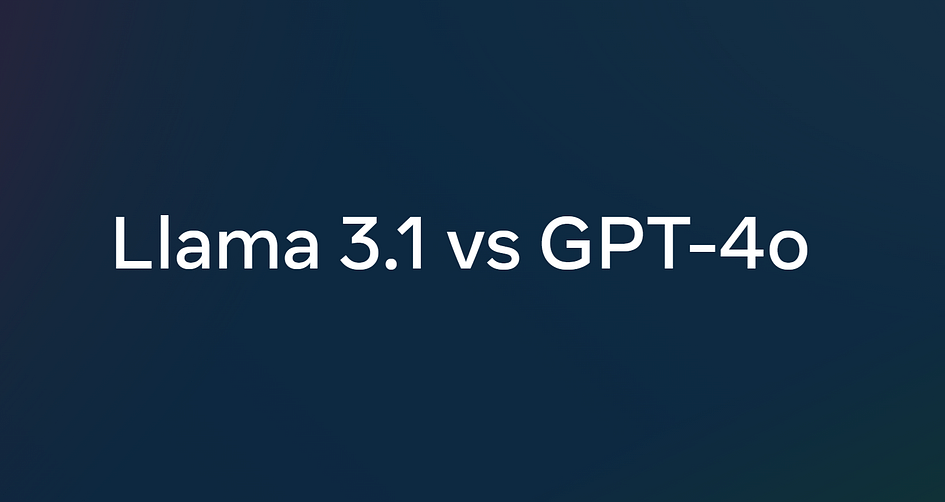

# Author

- [Zijian Yang](https://www.linkedin.com/in/zijian-yang/) (**ORCID:** [0009–0006–8301–7634](https://orcid.org/0009-0006-8301-7634))

# Introduction

To compare the strengths and intelligence of Llama-3.1–405B and GPT-4o from a practical usage perspective, this article designed test cases covering five scenarios: **mathematics, coding, tool usage, JSON extraction**, **and creative writing.** We conducted a comparison test between the strongest open-source and closed-source models.

Due to resource limitations, we tested Llama-3.1–405B-Instruct and GPT-4o-2024–08–06 on publicly available platforms [lmsys.org](https://chat.lmsys.org/) and [huggingface.co/chat/](https://huggingface.co/chat/).

# Introduction to the Llama 3.1 Model

On July 24, Meta officially open-sourced Llama 3.1, which includes versions with 8B, 70B, and 405B parameters. The specific information for the three models is detailed in the table below. In addition to the BF16 precision, the 405B model also has an FP8 quantised version. An extra content safety classification-tuned model, Llama-Guard-3–8B, was open-sourced for the 8B version. The models support a 128k context and are proficient in eight languages, including English, German, and French. The training process for Llama 3.1 includes two key stages: pre-training and post-training. During the pre-training stage, Llama 3.1 was trained on over 15 trillion tokens using a custom GPU cluster. The post-training stage involves Supervised Fine-Tuning (SFT), rejection sampling, and Direct Preference Optimization (DPO).

<figure>

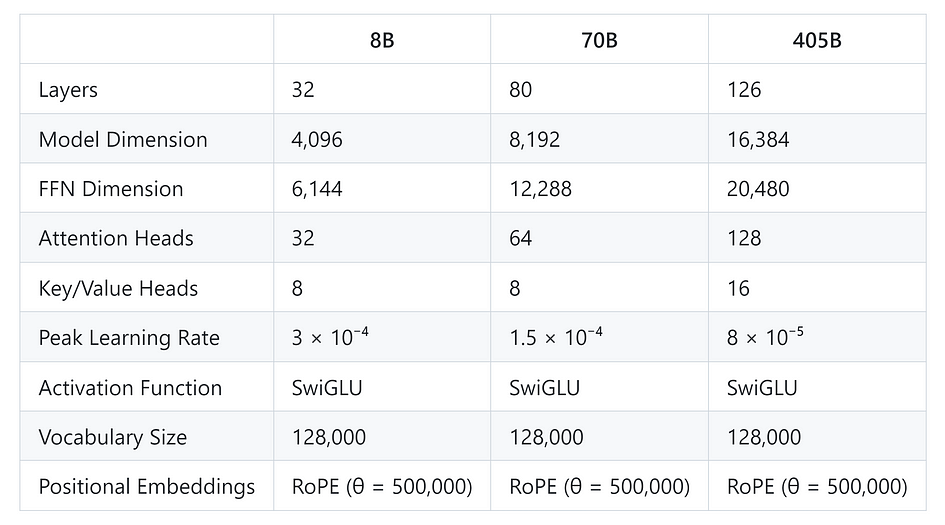

<figcaption>

_Specific Parameters of the Llama3.1 Model_

</figcaption>

</figure>

Notably, the SFT phase utilised high-quality synthetic data to enhance the model’s capabilities in coding, mathematical reasoning, and tool usage.

<figure>

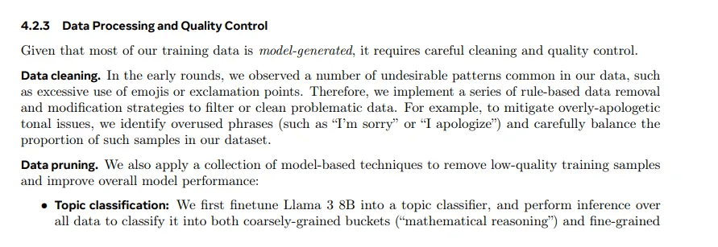

<figcaption>

Excerpt from the “Data Processing and Quality Control” section of the paper.

</figcaption>

</figure>

# Llama 3.1 vs Llama 3

From the respective papers on Llama 3.1 and Llama 3, it is evident that Llama 3.1 shows significant improvements. The 3.1 8B model outperforms the previous 70B model in math and coding.

<figure>

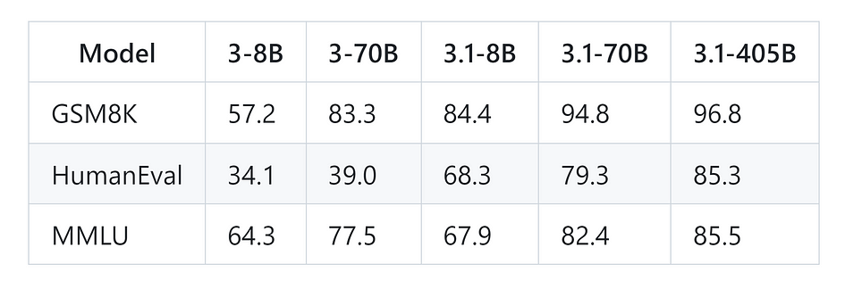

<figcaption>

_Performance metrics of different Llama models_

</figcaption>

</figure>

# Llama 3.1 vs GPT-4o vs Claude 3.5 Sonnet

The effectiveness of the Llama 3.1 model was tested across more than 50 datasets, along with human evaluations. Experiments show that the largest 405B model performs on par with the industry’s best closed-source models, such as GPT-4, GPT-4o, and Claude 3.5 Sonnet. The smaller 8B and 70B models are also competitive with closed-source models of similar parameter sizes.

As demonstrated by the benchmarks, Meta Llama 3.1 outperforms GPT-4o in several tests, including GSM8K, Hellaswag, boolq, MMLU-humanities, MMLU-other, MMLU-stem, and winograd. However, it falls behind GPT-4o in HumanEval and MMLU-social sciences.

<figure>

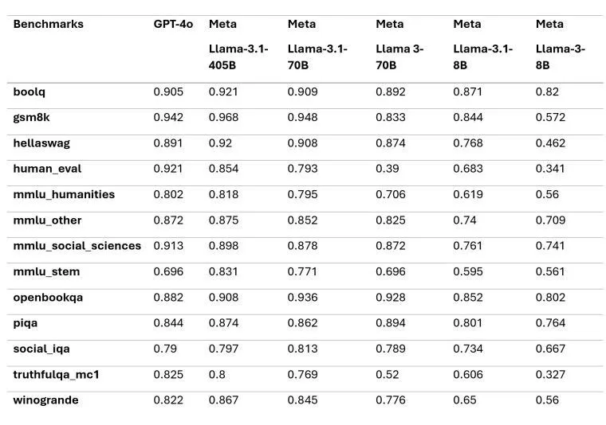

<figcaption>

Benchmarks

</figcaption>

</figure>

These results come from the base model of Llama 3.1, indicating that with further fine-tuning and optimisation, the model’s potential can be further unlocked, potentially achieving even higher performance in the aforementioned benchmarks.

<figure>

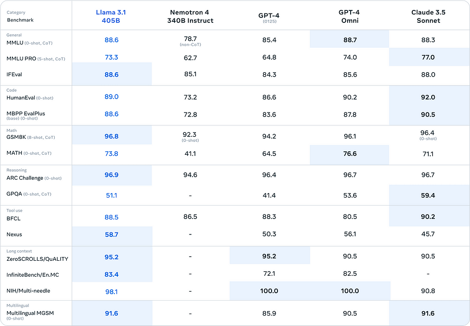

<figcaption>

Evaluation Results of the Llama 3.1 405B Dataset

</figcaption>

</figure>

<figure>

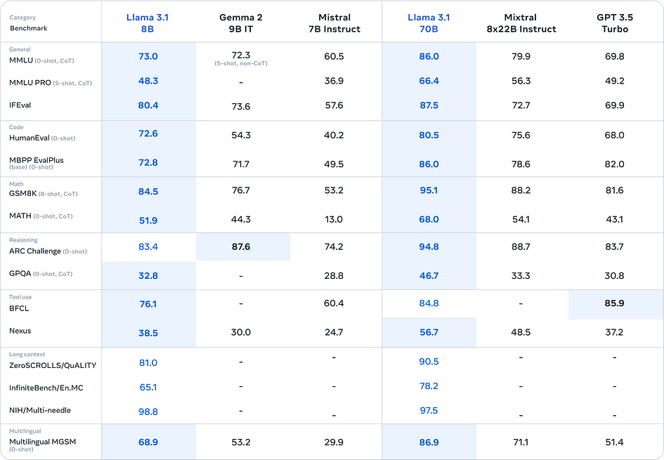

<figcaption>

Evaluation Results of the Llama 3.1 8B/70B Datasets

</figcaption>

</figure>

<figure>

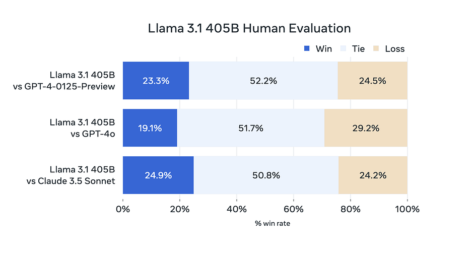

<figcaption>

Human Evaluation of Llama 3.1 405B

</figcaption>

</figure>

# Comparison of Mathematical Abilities

For testing mathematical capabilities, we used a popular question: “Which is greater, 9.9 or 9.11?” to evaluate the models. Additionally, we designed a composite function calculation problem to assess their performance. When comparing 9.9 and 9.11, Llama 3.1 405B incorrectly answered that 9.11 is greater than 9.9, while GPT-4o answered correctly. For the composite function calculation, both models accurately computed the result and provided clear steps.

# Which is greater, 9.11 or 9.9?

First, we tested the models by asking which is greater, 9.9 or 9.11? Llama-3.1–405B-Instruct incorrectly determined that 9.11 is greater than 9.9, whereas GPT-4o answered correctly.

Prompt:

```
Which is larger, 9.11 or 9.9?
```

<figure>

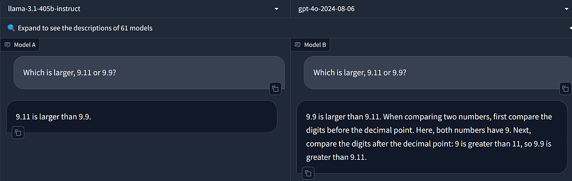

<figcaption>

On the left is Llama 3.1’s response, and on the right is GPT-4o’s response.

</figcaption>

</figure>

Why do models often make mistakes on mathematical problems? A significant reason is that large models do not tokenize numbers correctly during the tokenization stage. Numbers like 9.11 and 9.9 are split into their individual digits and decimal points. For instance, 9.11 might be tokenized into three tokens: “9”, “.”, and “11”, while 9.9 might be tokenized into three tokens: “9”, “.”, and “9”. This incorrect tokenization leads the model to erroneously compare 11 and 9, thus concluding that 9.11 is greater than 9.9.

# Composite Function Calculation

Next, we tested the models’ abilities to calculate composite functions. In our test problem, both Llama 3.1 405B Instruct and GPT-4o correctly computed the value of the composite function. Their responses included accurate and clear steps.

Prompt:

```
Given the functions \( f(x) = x^2 + 2x + 1 \) and \( g(x) = \sqrt{x} + 3 \), compute the composite function \( f(g(x)) \), i.e., \( f(g(x)) \). Find the value of the composite function \( f(g(x)) \) at \( x = 1 \).
```

<figure>

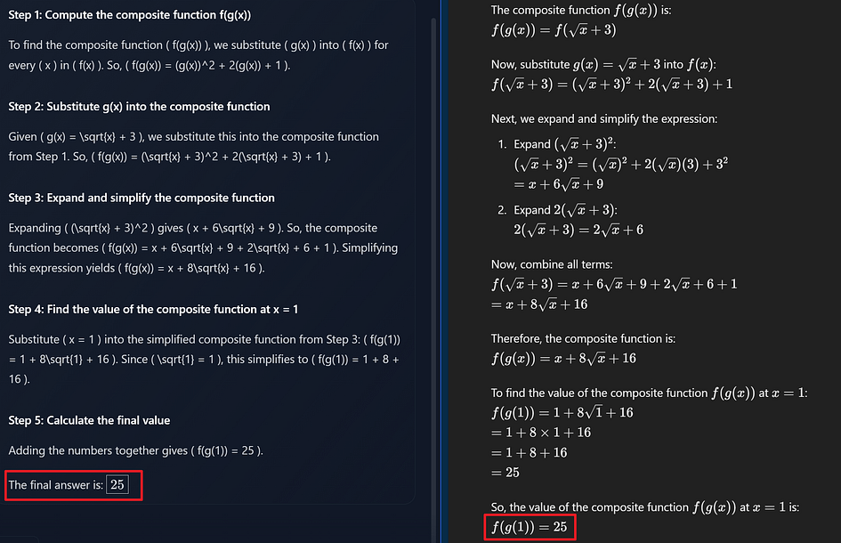

<figcaption>

On the left is Llama 3.1’s response, and on the right is GPT-4o’s response.

</figcaption>

</figure>

# Code Generation Capability: Writing a Tetris Game

To evaluate code generation capabilities, we chose the Tetris game as a test case to examine the completeness and accuracy of the generated code. Based on the execution results, Llama 3.1 was unable to generate a sufficiently complete game logic in one attempt. The blocks fell too quickly and couldn’t be moved or rotated, resulting in a game that, while technically running, was not playable. In contrast, GPT-4o’s game program ran perfectly.

Prompt:

```
Write a python Tetris game
```

<figure>

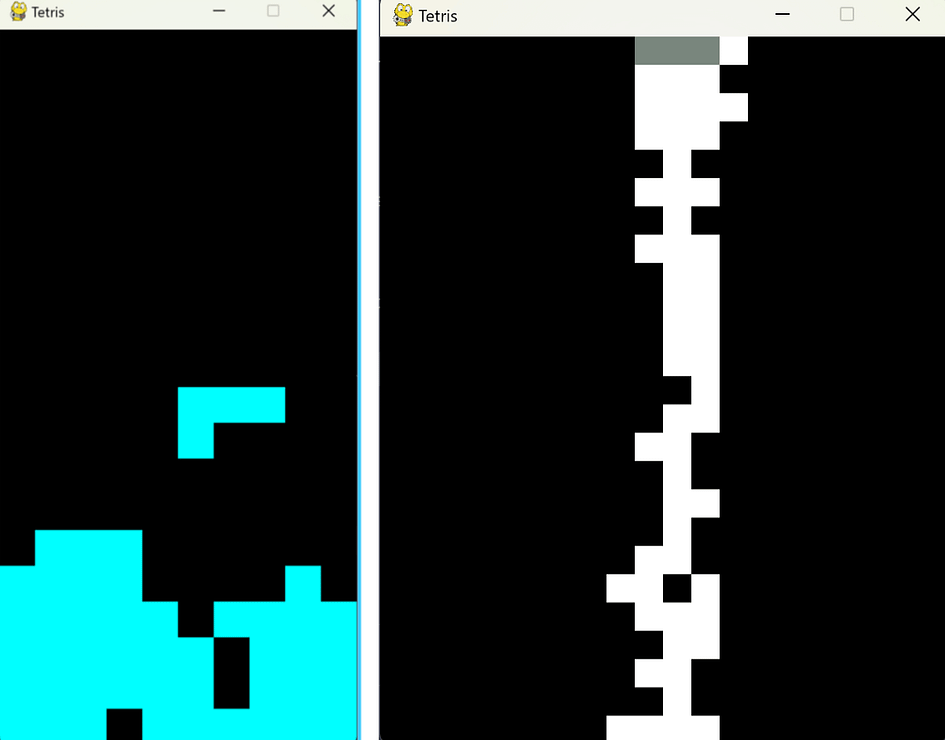

<figcaption>

On the left is the program execution result of GPT-4o, and on the right is the program execution result of Llama 3.1.

</figcaption>

</figure>

<figure>

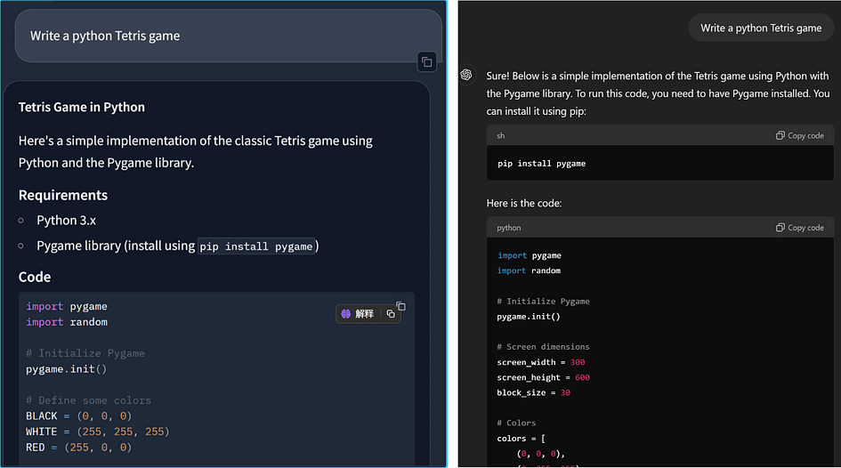

<figcaption>

On the left is Llama 3.1’s response, and on the right is GPT-4o’s response.

</figcaption>

</figure>

# Tool Utilisation Capability

By calling external tools, large models can perform more complex and diverse tasks. Here, we designed two test problems to evaluate the models’ ability to solve mathematical problems by calling tools. The conclusion is that both Llama 3.1 405B Instruct and GPT-4o can accurately determine the functions and parameter values when calling a single tool. However, when solving problems requiring the use of more than one function, especially when the second function needs the value from the first, errors occur.

## **1\. Calling Functions to Calculate Factorials**

In the first test problem, we set up three functions: calculating the factorial, finding the greatest common divisor (GCD) of two numbers, and determining if a number is prime. We asked the models to calculate the factorials of 10 and 8. Both Llama 3.1 405B Instruct and GPT-4o were able to accurately call the correct tool and provide the parameter values.

Llama 3.1 405B Instruct’s response was more precise, providing explicit parameter names and values, whereas GPT-4o directly provided the parameter values. This approach by Llama 3.1 is more accurate when assigning multiple parameters.

Prompt:

```
Write "Action:", followed by the list of actions you want to call, in the following format:
Action:
'''
[
    {
        "tool_name": "Tool name (choose from [calculate_factorial, calculate_gcd, is_prime])",
        "parameters": "Input parameters for the tool"
    }
]
'''
Please help me calculate the factorial of 10 and 8.
```

<figure>

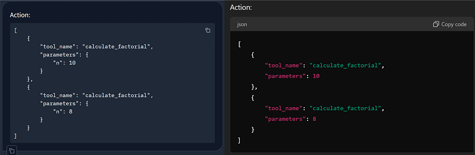

<figcaption>

On the left is Llama 3.1’s response, and on the right is GPT-4o’s response.

</figcaption>

</figure>

## **2\. Calling Functions to Calculate Factorials and Greatest Common Divisor**

Building on the first test problem, we increased the difficulty by requiring the models to find the greatest common divisor (GCD) after calculating the factorials. Both Llama 3.1 405B Instruct and GPT-4o were able to break down the task, first calling the factorial function and then the GCD function. However, the models made errors by failing to accurately pass the factorial values of 10 and 8 as parameters to the GCD function.

Prompt:

```
Write "Action:", followed by the list of actions you want to call, in the following format:
Action:
'''
[
    {
        "tool_name": "Tool name (choose from [calculate_factorial, calculate_gcd, is_prime])",
        "parameters": "Input parameters for the tool"
    }
]
'''
Please help me calculate the factorial of 10 and 8, and then further find their greatest common divisor (GCD).
```

<figure>

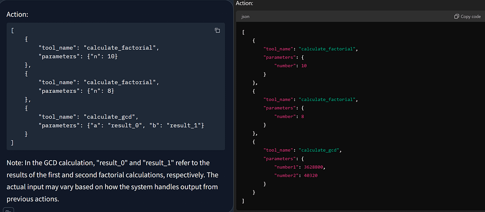

<figcaption>

On the left is Llama 3.1’s response, and on the right is GPT-4o’s response.

</figcaption>

</figure>

# JSON Information Extraction Capability

The application of JSON information extraction is crucial in scenarios like intelligent customer service systems, where key information such as product names and issue types needs to be extracted from user queries and output in JSON format for subsequent processing and response. I designed two questions: extracting information like company names and addresses from given text; and extracting medical terminology, entities, and relationships. Results show that both Llama 3.1 405B Instruct and GPT-4o excel in extracting key information. However, GPT-4o is more accurate and clear in extracting entities and relationships.

## **Key Information Extraction**

When extracting company names, establishment years, addresses, and other information from text, both Llama 3.1 405B Instruct and GPT-4o performed equally well, accurately and clearly extracting the key information.

Prompt:

```
Please extract the key information from the following text and output it in JSON format, including the following fields: Company Name, Year of Establishment, Headquarters Address, Main Business Areas, Number of Employees, Percentage of R&D Personnel, Annual Revenue, Contact Phone Number, and Email Address.
Tech Innovation Co., Ltd. was established in 2010 and is headquartered in the Timezone Technology Park in Melbourne. The company focuses on the fields of artificial intelligence and big data, with main businesses including the research and application of technologies such as intelligent speech recognition, computer vision, and natural language processing. Currently, it has more than 500 employees, with R&D personnel accounting for 70%. The company's annual revenue is approximately 200 million AUD, making it a leader in the industry. Contact information: phone 09812345678, email info@techcompany.com.
```

<figure>

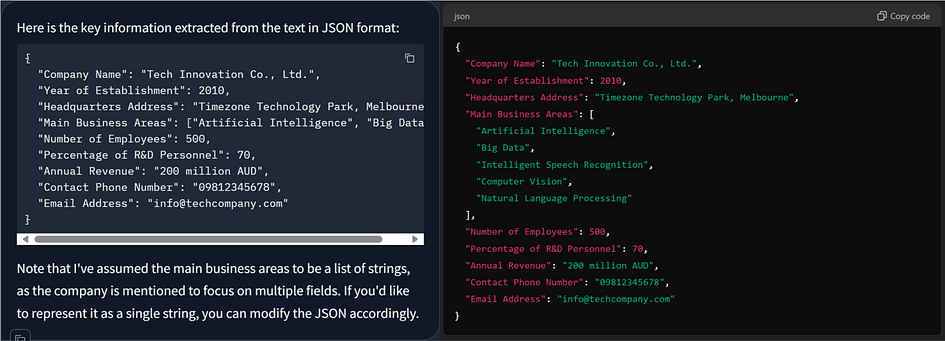

<figcaption>

On the left is Llama 3.1’s response, and on the right is GPT-4o’s response.

</figcaption>

</figure>

## **Medical Entity Extraction**

Large models, when combined with knowledge graphs, are widely used in medical scenarios. For example, large models can enhance the efficiency of constructing knowledge graphs. Here, we will test the models’ performance in extracting professional terms, entities, and relationships from patient diagnosis information.

The results show that Llama 3.1 405B Instruct performs well in extracting professional terms but is somewhat vague in extracting entities and relationships. It extracts fewer entities and includes some less relevant entities like “doctor” and “hospital.” GPT-4o, on the other hand, excels in structuring information and extracting relationships, better organising the text information into a clear JSON format.

Prompt:

```
From the following text, extract professional terms, entities, and relationships, and output in JSON format:
The patient Wang, male, 45 years old, was admitted to the hospital due to persistent chest pain for 3 days. He has a 5-year history of type 2 diabetes and is currently taking metformin to control his blood sugar. Physical examination shows blood pressure of 140/90 mmHg. The ECG indicates ST-segment elevation. Laboratory tests show elevated troponin I. The diagnosis is acute ST-segment elevation myocardial infarction (anterior wall). Aspirin and clopidogrel were administered for antiplatelet therapy, and percutaneous coronary intervention (PCI) was performed. After surgery, the symptoms were relieved, and the patient's condition stabilized.
```

<figure>

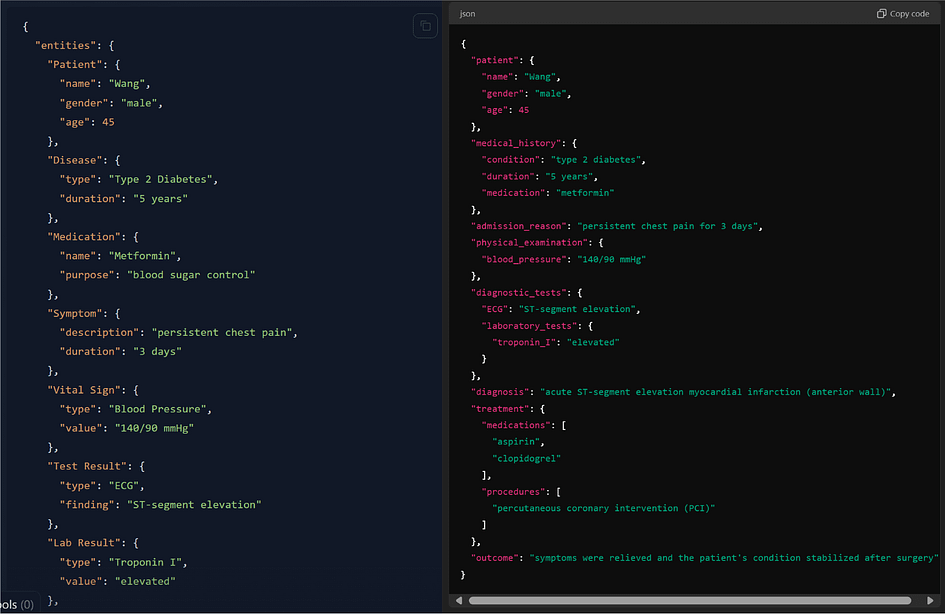

<figcaption>

On the left is Llama 3.1’s response, and on the right is GPT-4o’s response.

</figcaption>

</figure>

# Creative Writing Ability

To compare the creative writing abilities of Llama 3.1 405B Instruct and GPT-4o, we analysed their descriptions of the sunrise over the Alps. In this writing test, both Llama 3.1 and GPT-4o demonstrated good descriptive capabilities. However, GPT-4o provided richer and more detailed descriptions.

Prompt:

```
Description of the sunrise scenery in the Alps
```

<figure>


<figcaption>

Above is Llama 3.1’s response, and below is GPT-4o’s response.

</figcaption>

</figure>

# Conclusion

In conclusion, this study compares the open-source Llama-3.1–405B and the proprietary GPT-4o models across five scenarios: mathematics, code generation, tool invocation, JSON information extraction, and creative writing. **While Llama-3.1–405B stands as the strongest open-source model available, it slightly falls short compared to GPT-4o in overall performance.** For consumers and regular users, GPT-4o is the superior choice due to its lower hardware requirements for local use and its polished product experience, including advanced visual and speech capabilities. Llama-3.1–405B, being more academic and raw, serves better as a foundational model for further development and customization. In contrast, GPT-4o is a mature, stable, and powerful out-of-the-box product, making it the preferred option for most practical applications.

# References

- “Introducing Llama 3.1: Our Most Capable Models to Date.” _Meta.com_, 2024, ai.meta.com/blog/meta-llama-3–1/.

- Meta. “Llama.” _Llama_, llama.meta.com/.

- “Facebook.” _Facebook.com_, 2024, [www.facebook.com/4/posts/10115716861061241/?rdid=VE0wPWaJDdF21j32.](http://www.facebook.com/4/posts/10115716861061241/?rdid=VE0wPWaJDdF21j32.) Accessed 9 Aug. 2024.

- “Chat with Open Large Language Models.” _Gradio.app_, chat.lmsys.org/.

- “Meta-Llama/Meta-Llama-3.1–405B · Hugging Face.” _Huggingface.co_, 2 Aug. 2024, huggingface.co/meta-llama/Meta-Llama-3.1–405B. Accessed 9 Aug. 2024.

- “The Llama 3 Herd of Models | Research — AI at Meta.” _Meta.com_, 2024, ai.meta.com/research/publications/the-llama-3-herd-of-models/.[](https://medium.com/tag/llama-3-1-405b?source=post_page-----659662234b3e--------------------------------)
