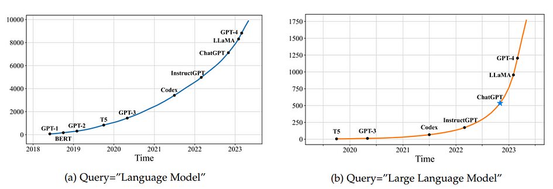

## Unlocking the Future of AI: The Transformative Journey of Large Language Models

<figure>

<figcaption>

Image generated using DALL.E-2

</figcaption>

</figure>

# Author

· Vaibhav Khobragade (**ORCID:** [0009–0009–8807–5982](https://orcid.org/0009-0009-8807-5982))

# **Introduction**

Human language development is innate and evolves throughout life. Machines lack this ability to evolve without advanced artificial intelligence (AI) algorithms. Since the Turing Test was proposed in the 1950s, efforts to master machine understanding of language have led from statistical to neural language models. Recently, scaling up pre-trained language models like Transformer models has significantly advanced AI’s ability in natural language processing (NLP) tasks by training on large datasets, enhancing model capacity and performance. The advancement of Large Language Models (LLMs) has profoundly influenced both the AI and broader public communities, promising a transformative shift in AI algorithm development and utilisation. This article explores the evolutionary journey of LLMs, their diverse applications, and inherent limitations, and outlines potential future directions for this technology.

Language modelling (LM) enhances machine language understanding by predicting the likelihood of word sequences based on previous text. For example: LM predicts “The cat is \_\_\_\_” with a high likelihood for “sleeping”, based on previous text data.

LM research has evolved through four stages, focusing on predicting future tokens (token means a single unit of text, typically a word or a piece of punctuation) in the text.

<figure>

<figcaption>

Figure 1: Depicts the evolution of language models (LM) over four generations in terms of task solving capacity. (Zhao et al., 2023) Article link: [https://arxiv.org/abs/2303.18223](https://arxiv.org/abs/2303.18223)

</figcaption>

</figure>

**Statistical Language Models (SLMs):** SLMs developed in the 1990s, utilise the Markov assumption to guess the next word based on a few words before it. These are called n-gram models, like ‘bigrams’ (looking at two words like ‘I am’) and ‘trigrams’ (looking at three words like ‘All is well’).

While SLMs were popular for tasks like finding information and understanding language, they had a major drawback. Predicting based on many past words (high-order models) became difficult because it necessitated estimating an exponential number of transition probabilities, which are numerical values between 0 and 1 that represent the probability of a specific word (**B**) appearing after another word (**A**) in a sequence, leading to data sparsity issues. To overcome this, researchers used smoothing techniques like [backoff and Good–Turing estimation](https://www.scaler.com/topics/nlp/backoff-in-nlp/) to improve their accuracy.

**Neural Language Models (NLMs):** Early language models were good at predicting word order, but they struggled to understand the deeper meaning of language. Newer models called Neural Language Models (NLMs) use powerful tools like neural networks like **MLPs** (Multilayer perceptron) and **RNNs** (Recurrent Neural Networks) to capture the relationships between words. Shallow networks like **word2vec** even create unique codes (vector representations) for each word, helping them understand the bigger picture. This shift towards understanding word meaning, not just order, has revolutionised how computers process language, allowing them to tackle a wider range of tasks like generating text and translating languages

**Pre-trained Language Models (PLMs):** PLMs refer to a model that has been trained on a large corpus of text data using unsupervised learning techniques. During pre-training, the model learns to understand and generate natural language by processing vast amounts of text data such as books, articles, websites, and other textual data available on the internet, typically without specific task labels or annotations before being fine-tuned for specific downstream tasks such as classification and text generation.

<figure>

<figcaption>

Figure 2: Fine-tuning on flower classification task by using pretrained model Resnet16

</figcaption>

</figure>

Pioneering models like **ELMo** (Embeddings from Language Models) and **BERT** (Bidirectional Encoder Representations from Transformers) revolutionised NLP by introducing context-aware word representations. These models leveraged pre-training with bidirectional architectures like Long Short-Term Memory (**LSTM**) and Transformers on vast text corpora. This pre-training allowed for learning contextual word embeddings. Subsequently, fine-tuning these pre-trained models on specific tasks significantly improved NLP performance. This ‘pre-training and fine-tuning’ paradigm became the foundation for subsequent models like **GPT-2** (Generative Pre-trained Transformer 2) and **BART** (Bidirectional and Auto-Regressive Transformers).

<figure>

<figcaption>

Figure 3: The cumulative counts of arXiv papers featuring the terms “language model” (from June 2018) and “large language model” (from October 2019) show distinct trends over time. (Zhao et al., 2023) Article link: [https://arxiv.org/abs/2303.18223](https://arxiv.org/abs/2303.18223)

</figcaption>

</figure>

After ChatGPT was released shown in figure 3, there was a notable surge: the average daily number of arXiv papers featuring “large language model” in their title or abstract increased from 0.40 to 8.58.

# **Large language models (LLMs)**

Researchers have found that making Pre-trained Language Models (PLMs) bigger, either by increasing model size or training data size, often improves their ability to perform various tasks. These large models, like **GPT-3** and **PaLM**, show different behaviors compared to smaller ones like **BERT** and **GPT-2** and they can solve complex tasks surprisingly well (called emergent ability). The research community calls these large models “large language models (LLMs),” and they’re getting a lot of attention. For instance, ChatGPT2, based on GPT models, impressively converse with humans.

Nowadays, LLMs are making a big impact on the AI community. With developments like ChatGPT and GPT-4, people are starting to think more about the potential of artificial general intelligence ([AGI](https://openai.com/blog/planning-for-agi-and-beyond)), a hypothetical AI with human-level or even surpassing intelligence, which holds the potential to enhance humanity by increasing resources, propelling economies, and accelerating scientific breakthroughs. OpenAI recently wrote an article called “Planning for AGI and beyond,” discussing how to approach AGI development responsibly, both in the short and long term. Some experts even say that GPT-4 could be an early version of AGI.

## **LLM Emergent Ability**

Emergent abilities of LLMs are described as capabilities that appear in large models but are not found in smaller ones. This is a key difference that sets LLMs apart from previous PLMs.

**In-context learning (ICL):** In-context learning refers to the ability of a language model to generate output based on given instructions or task demonstrations without requiring additional training or gradient updates. The focus is on the model’s ability to generate output based on contextual information. Instead of needing extra training, they can learn new things just by seeing examples and getting instructions.

For instance, consider the following context:

_Context: “You are a virtual assistant helping a user with math problems.”_

_Instruction: “Calculate the square root of 25.”_

In-context learning lets the assistant understand your request based on what you instructed, without needing to be specifically programmed for square roots.

**Instruction Following:** In Instruction Following, the language model is fine-tuned with a mixture of multi-task datasets formatted as natural language instructions comprising various tasks (e.g., text summarisation, question answering, translation) described in a way that mimics how humans might request the task to be done. This allows the model to perform well on unseen tasks that are also described in the form of instructions.

For instance: _“Calculate the average of three numbers: 10, 15, and 20.”_

With instruction following ability, the model should be able to understand this instruction and perform the task without further training. It would calculate the average of the given numbers (10, 15, and 20) and provide the output, which is 15.

**Step-by-step reasoning:** Chain-of-thought (CoT) prompting helps LLMs solve complex problems, like math word problems, by breaking them down into smaller, easier steps. This approach encourages the model to think through a problem step-by-step to reach the final answer, making it easier to handle tasks that require more than one reasoning step.

<figure>

<figcaption>

Table 1: Statistics of large language models (LLMs) (having a size larger than 10B in this survey) in recent years (Zhao et al., 2023) Article link: [https://arxiv.org/abs/2303.18223](https://arxiv.org/abs/2303.18223)

</figcaption>

</figure>

The above table includes:

- **Capacity evaluation**, pre-training data scale (either in the number of tokens or storage size) and hardware resource costs

- **Release Time**: indicates the date when the corresponding paper was officially released

- **Publicly Available**: means that the model checkpoints(core components used for making predictions) can be publicly accessible while “Closed Source” means the opposite.

- **Adaptation**: indicates whether the model has been trained further and fine-tuned after its initial creation. **IT**(instruction tuning) denotes the model was given extra training on specific instructions, like how to follow directions and **RLHF** denotes Reinforcement Learning with Human Feedback, in which the model is trained by rewarding it for good responses based on human input.

- **Evaluation**: indicates how well the model performed on specific tasks in the research paper that introduced it: ICL denotes in-context learning which checks if the model can learn new things based on instructions within a specific context and CoT denotes chain-of-thought which indicates if the model can explain its reasoning process, similar to showing its work in math. “\*” denotes the largest publicly available version

<figure>

<figcaption>

Figure 4: A timeline of existing large language models (LLMs) (having a size larger than 10B) in recent years. We mark the LLMs with publicly available model checkpoints in yellow colour. (Zhao et al., 2023) Article link: [https://arxiv.org/abs/2303.18223](https://arxiv.org/abs/2303.18223)

</figcaption>

</figure>

This figure shows a timeline of the development of LLMs that have more than 10 billion parameters, highlighting significant advancements and releases over recent years. This timeline visually represents the progress in the field, showing the rapid growth and evolution of LLMs, marked by key models and milestones that have pushed the boundaries of what these models can achieve.

<figure>

<figcaption>

Figure 5: A brief illustration of the technical evolution of GPT-series models (Zhao et al., 2023) Article link: [https://arxiv.org/abs/2303.18223](https://arxiv.org/abs/2303.18223)

</figcaption>

</figure>

The figure given above illustrates the progression of OpenAI’s models, showing how each subsequent version has built upon the last, improving capabilities such as multitasking, in-context learning, code generation, instruction following, human alignment, comprehensive ability, reasoning, and multimodal interaction.

# **Applications of LLM**

<figure>

<figcaption>

Figure 6: Illustrates the various research directions and downstream domains where Large Language Models (LLMs) find applications (Zhao et al., 2023) Article link: [https://arxiv.org/abs/2303.18223](https://arxiv.org/abs/2303.18223)

</figcaption>

</figure>

The applications of LLMs across research directions and domains are wide-ranging:

- **Classic NLP Tasks**: LLMs handle traditional natural language processing tasks like word/sentence-level tasks, sequence tagging, information extraction, and text generation, offering robust solutions for diverse linguistic challenges.

- **Information Retrieval (IR)**: LLMs are used both as models for retrieving information and to enhance existing IR models, improving the accuracy and relevance of search results.

- **Recommendation Systems**: They serve in recommendation engines, both as primary models and as enhancements to existing systems, simulating recommendations, and aligning closely with user preferences. For example recommendations in Netflix and YouTube.

- **Multimodal LLMs**: These models integrate and process information from different modalities, such as text and images, enhancing interaction and understanding across various formats.

- **Knowledge Graph (KG) Enhanced LLMs**: LLMs are augmented with knowledge from structured data sources like KGs, improving their ability to understand and generate contextually rich content.

# **New Scenarios**

- **LLM-based Agents**: These agents, equipped with capabilities for memory, planning, and execution, can autonomously perform tasks, adapting to user requests and environmental feedback.

- **LLM for Evaluation**: LLMs are used to evaluate and score other models or content, employing techniques like language-based evaluation and meta-evaluation.

# **Specific Domains**

LLMs find applications in specialised areas as follows:

- **Healthcare**: Med-PaLM models achieved expert-level performance on the US Medical Licensing Examination, gaining approval from physicians for answering medical questions​.

- **Education**: ChatGPT helped students perform better in computer security courses by generating or refining answers​.

- **Law**: GPT-4 scored in the top 10% on a simulated bar exam, demonstrating its powerful legal interpretation and reasoning abilities​.

- **Finance**: BloombergGPT showed remarkable performance across various financial tasks, maintaining competitive performance in general-purpose tasks​.

- **Scientific Research**: LLMs assisted in various stages of the scientific research pipeline, including literature surveys, hypothesis generation, data analysis, and paper writing​.

# **The limitations of LLMs**

- **Efficiency Issues**: As LLMs get bigger, they become harder to use widely, especially when lots of them need to work together. They also need better ways to communicate as they grow.

- **Technical Challenges for Agent Development**: Making LLMs that can do tasks on their own is hard. They struggle with following instructions over long texts and aren’t ready made for acting on their own without more work.

- **Biases in LLM-based Evaluators:** When LLMs are used to judge other models or content, they can be biased, preferring certain patterns or lengths of text. They don’t always understand their own writing, which can make it hard to trust their evaluations of complex tasks.

- **Knowledge Recency and Hallucination:** LLMs can make mistakes or come up with false information because they don’t always know the most recent facts. This is a problem even for advanced models like ChatGPT, which means there’s a need to adjust them and use additional tools to ensure they provide accurate information.

One realisation after writing this post is that the limit of my knowledge means the limit of my world, which is why every human has the goal of **_“cultivation of mind should be the ultimate aim of human existence” (Dr. B. R. Ambedkar)_**. The same principle applies to LLM: the more knowledge you feed; the better machines understand.

# **Conclusion**

The evolution of Large Language Models (LLMs) marks a transformative era in AI, expanding capabilities from basic language understanding to complex problem-solving across diverse domains. Despite their remarkable progress and potential, LLMs face limitations and challenges that necessitate ongoing research, ethical considerations, and technological advancements to fully realise their impact and pave the way for future innovations in artificial intelligence.

# References

- Zhao, W. X., Zhou, K., Li, J., Tang, T., Wang, X., Hou, Y., … & Wen, J.-R. (2023). A Survey of Large Language Models. arXiv. [https://arxiv.org/abs/2303.18223](https://arxiv.org/abs/2303.18223)

- DePeau-Wilson, M. (2023, March 14). Google AI performs at ‘expert’ level on U.S. medical licensing exam. MedPage Today. [https://www.medpagetoday.com/special-reports/exclusives/103522](https://www.medpagetoday.com/special-reports/exclusives/103522)
