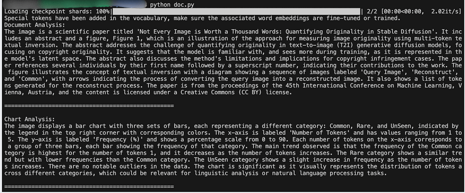

## Explained with Working Examples

<figure>


<figcaption>

The Phi3 model series and its variations (Source \[5\])

</figcaption>

</figure>

# Introduction

The field of artificial intelligence has taken another significant leap forward with the introduction of Phi-3.5-vision, a cutting-edge multimodal AI model developed by Microsoft. This lightweight yet powerful model represents a new frontier in machine learning, combining advanced natural language processing capabilities with sophisticated image understanding. Phi-3.5-vision stands out for its ability to handle both text and visual inputs with remarkable efficiency, making it a versatile tool for a wide range of applications in today’s increasingly visual digital landscape.

What sets Phi-3.5-vision apart is its impressive balance of performance and resource efficiency. With a context length of 128,000 tokens and an architecture optimised for both single and multi-image processing, this model opens up new possibilities for developers and researchers alike. From general image understanding and optical character recognition to complex tasks like chart interpretation and video summarisation, Phi-3.5-vision demonstrates capabilities that were once the domain of much larger, more resource-intensive models. As we delve deeper into this article, we’ll explore the key features, practical applications, and working examples that showcase the true potential of this innovative AI model.

# Understanding Phi-3.5-vision

# Key Features and Capabilities

Phi-3.5-vision stands out for its versatility and efficiency in processing both textual and visual information. Its capabilities extend across a wide range of tasks, making it a powerful tool for various applications.

## Key Features

1. Extensive context length: 128,000 tokens

3. Efficient performance in resource-constrained environments

5. Multimodal processing of text and images

## Main Capabilities

1. **Visual Processing**

- General image understanding and analysis

- Multi-image comparison and relationship detection

- Video clip summarisation (highlights) and key frame extraction

**2\. Text and Data Extraction**

- Advanced optical character recognition (OCR)

- Chart and table interpretation and data extraction

- Document layout analysis and structure recognition

**3\. Multimodal Integration**

- Text-to-image generation and manipulation

- Image captioning and description generation

- Visual question answering and reasoning

# How it Differs from Previous Models

Phi-3.5-vision represents a significant advancement over its predecessors, offering improved performance and broader applicability while maintaining a relatively compact size.

Key differences include:

1. **Enhanced Multimodal Processing**

- Superior multi-frame capabilities — Refers to the ability of a system, device, or software to efficiently handle, process, or display multiple frames of data or imagery simultaneously. This is particularly useful in handling animations, videos, or multi-camera setups.

- Advanced video summarisation techniques

2. **Performance and Efficiency**

- Competitive performance with larger models in certain benchmarks

- Enhanced balance between model size and capabilities

3. **Ethical Considerations**

- Improved safety measures

- Stronger focus on responsible AI development

4. **Versatility**

- Broader range of applications across various domains

- Improved adaptability to different tasks and data types

# Technical Specifications

The architecture of Phi-3.5-vision is designed to optimise performance while maintaining efficiency, allowing it to handle complex tasks with relatively modest computational requirements.

1. **Architecture Details**

- 4.2 billion parameters

- Four main components:

— Image encoder

— Connector

— Projector

— Phi-3 Mini language model

**2\. Training Specifications**

- Dataset: 500 billion tokens (visual and textual)

- Training duration: 6 days

- Hardware: 256 A100–80G GPUs

**3\. Training Techniques**

- Supervised fine-tuning

- Reinforcement learning from human feedback

# Environment Setup

# Hardware Requirements

Phi-3.5-vision is optimised for efficiency but requires specific hardware for optimal performance. The model has been tested and performs well on `NVIDIA A100`, `A6000`, and `H100` GPUs. Ensure your system has sufficient VRAM to handle the 4.2B parameter model.

# Dependencies Installation

To run Phi-3.5-vision locally, you’ll need to set up a Python environment with specific package versions. Follow these steps:

1. Create a new virtual environment using your preferred method (venv, conda, etc.).

3. Create a file named requirements.txt with the following content:

```
flash_attn==2.5.8
numpy==1.24.4 
Pillow==10.3.0 
Requests==2.31.0 
torch==2.3.0 
torchvision==0.18.0 
transformers==4.43.0 
accelerate==0.30.0
```

3\. Install the required packages using pip:

```
pip install -r requirements.txt
```

Note: Ensure that torch is installed with CUDA support for GPU acceleration. You may need to visit the PyTorch website to get the correct installation command for your specific CUDA version.

# Best Practices for Prompting

Once your environment is set up, using Phi-3.5-vision effectively involves crafting appropriate prompts. Here are some key guidelines:

1. Use the chat format: Phi-3.5-vision is optimised for chat-like interactions. Structure your prompts as follows: For single image tasks:

```
<|user|>\n<|image_1|>\n{prompt}<|end|>\n<|assistant|>\n
```

2\. For multi-image tasks:

```
<|user|>\n<|image_1|>\n{prompt_1}<|end|>\n<|assistant|>\n{response_1}
<|end|>\n<|user|>\n{prompt_2}<|end|>\n<|assistant|>\n
```

3\. Be specific: Clearly state what you want the model to analyse or describe in the image(s).

4\. Leverage multi-modal capabilities: Combine text and image prompts to fully utilise the model’s strengths.

5\. Adjust for task type:

- Use `num_crops=4` for multi-frame tasks

- Use `num_crops=16` for single-frame tasks

# Working Examples

# Single Image Analysis

One of the most fundamental tasks for a vision-language model is describing a single image. Let’s explore how Phi-3.5-vision handles this task with a practical example. For this demonstration, we’ll use an image of a dog and ask the model to describe it in detail.

<figure>


<figcaption>

Example Dog for Phi3.5 Single Image Analysis (Source \[3\])

</figcaption>

</figure>

Here’s the Python code for this example

```
from PIL import Image 
from transformers import AutoModelForCausalLM 
from transformers import AutoProcessor 

model_id = "microsoft/Phi-3.5-vision-instruct" 

# Note: set _attn_implementation='eager' if you don't have flash_attn installed
model = AutoModelForCausalLM.from_pretrained(
  model_id, 
  device_map="cuda", 
  trust_remote_code=True, 
  torch_dtype="auto", 
  _attn_implementation='flash_attention_2'    
)

# for best performance, use num_crops=4 for multi-frame, num_crops=16 for single-frame.
processor = AutoProcessor.from_pretrained(model_id, 
  trust_remote_code=True, 
  num_crops=16  # Changed to 16 for single-frame
) 

images = []
placeholder = ""

# Load local image
local_image_path = "dog.png"  # Replace with your actual image path
images.append(Image.open(local_image_path))
placeholder += "<|image_1|>\n"

messages = [
    {"role": "user", "content": placeholder+"Describe this image in detail, including the main subject, actions, and setting."},
]

prompt = processor.tokenizer.apply_chat_template(
  messages, 
  tokenize=False, 
  add_generation_prompt=True
)

inputs = processor(prompt, images, return_tensors="pt").to("cuda:0") 

generation_args = { 
    "max_new_tokens": 1000,
    "temperature": 0.7,  # Added some randomness
    "do_sample": True,  # Enable sampling
    "top_k": 50,  # Added top-k sampling
} 

generate_ids = model.generate(**inputs, 
  eos_token_id=processor.tokenizer.eos_token_id, 
  **generation_args
)

# remove input tokens 
generate_ids = generate_ids[:, inputs['input_ids'].shape[1]:]
response = processor.batch_decode(generate_ids, 
  skip_special_tokens=True, 
  clean_up_tokenization_spaces=False)[0] 

print("\nDesribing the image:")
print(response)
```

When we run this code with our dog image, Phi-3.5-vision generates the following description as seen in the terminal screenshot:

```
The image features a white dog, possibly a Poodle, in mid-air with a stick in its mouth, suggesting playful activity. The dog's fur is well-groomed and fluffy, and it has a happy, open-mouthed expression. The background is a grassy field with yellow flowers, indicating it is a sunny day. The lighting is soft and natural, with no harsh shadows.
```

<figure>


<figcaption>

Generated Image Description

</figcaption>

</figure>

This output demonstrates several impressive capabilities of Phi-3.5-vision:

1. **Object Recognition:** The model correctly identifies the main subject as a dog, even suggesting a specific breed (Poodle).

3. **Action Understanding:** It recognises that the dog is in mid-air and carrying a stick, inferring playful activity.

5. **Detail Observation:** The model notes specific details like the dog’s well-groomed fur and happy expression.

7. **Scene Comprehension:** It describes the background, mentioning the grassy field and yellow flowers.

# Multiple Image Analysis

Phi-3.5-vision’s ability to process and analyse multiple images simultaneously is a powerful feature that sets it apart from many other vision models. Let’s explore this capability with an example where the model describes two different pet images: the dog from the above example and a cat.

<figure>


<figcaption>

Example Cat for Phi3.5 Multi Images Analysis (Source \[4\])

</figcaption>

</figure>

Here’s the Python code for this example

```
from PIL import Image 
from transformers import AutoModelForCausalLM, AutoProcessor 

model_id = "microsoft/Phi-3.5-vision-instruct" 

model = AutoModelForCausalLM.from_pretrained(
  model_id, 
  device_map="cuda", 
  trust_remote_code=True, 
  torch_dtype="auto", 
  _attn_implementation='flash_attention_2'    
)

processor = AutoProcessor.from_pretrained(model_id, 
  trust_remote_code=True, 
  num_crops=4  # Use 4 for multi-frame tasks
) 

def generate_response(messages, images):
    prompt = processor.tokenizer.apply_chat_template(
      messages, 
      tokenize=False, 
      add_generation_prompt=True
    )

    inputs = processor(prompt, images, return_tensors="pt").to("cuda:0") 

    generation_args = { 
        "max_new_tokens": 500,
        "temperature": 0.7,
        "do_sample": True,
        "top_k": 50,
    } 

    generate_ids = model.generate(**inputs, 
      eos_token_id=processor.tokenizer.eos_token_id, 
      **generation_args
    )

    generate_ids = generate_ids[:, inputs['input_ids'].shape[1]:]
    response = processor.batch_decode(generate_ids, 
      skip_special_tokens=True, 
      clean_up_tokenization_spaces=False)[0] 

    return response

# Load images
image1 = Image.open("dog.png")
image2 = Image.open("cat.png")

# Multi-image prompt
multi_image_prompt = """
<|image_1|>
<|image_2|>
These two images show different pets. Please describe each image in detail, focusing on the animals, their actions, and their surroundings.
"""

conversation = [
    {"role": "user", "content": multi_image_prompt}
]

response = generate_response(conversation, [image1, image2])
conversation.append({"role": "assistant", "content": response})

# Print the conversation
for message in conversation:
    print(f"{message['role'].capitalize()}: {message['content']}\n")
```

When we run this code with our two pet images, Phi-3.5-vision generates the following response:

<figure>


<figcaption>

Generated Multiple Image Description.

</figcaption>

</figure>

This output demonstrates several impressive capabilities of Phi-3.5-vision in multi-image processing:

1. **Simultaneous Analysis**: The model can process and analyse multiple images at once, providing detailed descriptions for each without confusion.

3. **Inference of Intent**: The model goes beyond mere description, inferring that the dog is playing and the cat might be hunting, based on their postures and expressions.

# Multi-turn Conversation with Images

Phi-3.5-vision’s ability to engage in multi-turn conversations about multiple images showcases its versatility in visual analysis and comparison. Let’s explore this capability with an example dialogue involving two different images: the dog and the cat in the examples above.

Here’s the Python code for this example

```
from PIL import Image 
from transformers import AutoModelForCausalLM, AutoProcessor 

model_id = "microsoft/Phi-3.5-vision-instruct" 

model = AutoModelForCausalLM.from_pretrained(
  model_id, 
  device_map="cuda", 
  trust_remote_code=True, 
  torch_dtype="auto", 
  _attn_implementation='flash_attention_2'    
)

processor = AutoProcessor.from_pretrained(model_id, 
  trust_remote_code=True, 
  num_crops=16
) 

def generate_response(messages, images):
    prompt = processor.tokenizer.apply_chat_template(
      messages, 
      tokenize=False, 
      add_generation_prompt=True
    )

    inputs = processor(prompt, images, return_tensors="pt").to("cuda:0") 

    generation_args = { 
        "max_new_tokens": 300,
        "temperature": 0.7,
        "do_sample": True,
        "top_k": 50,
    } 

    generate_ids = model.generate(**inputs, 
      eos_token_id=processor.tokenizer.eos_token_id, 
      **generation_args
    )

    generate_ids = generate_ids[:, inputs['input_ids'].shape[1]:]
    response = processor.batch_decode(generate_ids, 
      skip_special_tokens=True, 
      clean_up_tokenization_spaces=False)[0] 

    return response

# Load images
image1 = Image.open("dog.png")
image2 = Image.open("cat.png")

# Multi-turn conversation
conversation = []

# Turn 1
conversation.append({"role": "user", "content": "<|image_1|>\nDescribe this image in detail."})
response1 = generate_response([conversation[-1]], [image1])
conversation.append({"role": "assistant", "content": response1})

# Turn 2
conversation.append({"role": "user", "content": "What breed do you think the dog is?"})
response2 = generate_response(conversation, [image1])
conversation.append({"role": "assistant", "content": response2})

# Turn 3
conversation.append({"role": "user", "content": "<|image_2|>\nNow, describe this new image and compare it to the previous one."})
response3 = generate_response(conversation, [image1, image2])
conversation.append({"role": "assistant", "content": response3})

# Print the conversation
for message in conversation:
    print(f"{message['role'].capitalize()}: {message['content']}\n")
```

The generated dialogue style output is shown in the following image:

<figure>


<figcaption>

Generated Dialogue and Comparative Analysis

</figcaption>

</figure>

This output demonstrates several impressive capabilities of Phi-3.5-vision:

1. **Memory and Context Retention**: The model remembers details from previous turns. When asked about the dog’s breed in the second turn, it confidently identifies it as a Poodle without needing to re-analyse the image.

3. **Multi-Image Processing**: The model can handle multiple images in a single conversation. It seamlessly transitions from discussing the dog image to analysing the new cat image.

5. **Comparative Analysis**: In the third turn, the model not only describes the new cat image but also compares it to the previous dog image, highlighting differences in coat type, species, and posture.

# Document Understanding

One of Phi-3.5-vision’s most impressive capabilities is its ability to understand and analyse complex documents, including scientific papers with charts and figures. This feature demonstrates the model’s potential for advanced OCR (Optical Character Recognition) and chart interpretation. Let’s explore this capability with an example using a scientific paper and a chart within it.

<figure>


<figcaption>

Academic Paper (Source \[2\]) Abstract and Introduction Section for Phi3.5 Document Analysis

</figcaption>

</figure>

<figure>


<figcaption>

Chart from Academic Paper (Source \[2\]) for Phi3.5 Chart Analysis

</figcaption>

</figure>

Here’s the Python code for this example

```
from PIL import Image 
from transformers import AutoModelForCausalLM, AutoProcessor 

model_id = "microsoft/Phi-3.5-vision-instruct" 

model = AutoModelForCausalLM.from_pretrained(
  model_id, 
  device_map="cuda", 
  trust_remote_code=True, 
  torch_dtype="auto", 
  _attn_implementation='flash_attention_2'    
)

processor = AutoProcessor.from_pretrained(model_id, 
  trust_remote_code=True, 
  num_crops=16  # Use 16 for single-frame tasks with complex images
) 

def generate_response(messages, images):
    prompt = processor.tokenizer.apply_chat_template(
      messages, 
      tokenize=False, 
      add_generation_prompt=True
    )

    inputs = processor(prompt, images, return_tensors="pt").to("cuda:0") 

    generation_args = { 
        "max_new_tokens": 1000,  # Increased for longer, more detailed responses
        "temperature": 0.7,
        "do_sample": True,
        "top_k": 50,
    } 

    generate_ids = model.generate(**inputs, 
      eos_token_id=processor.tokenizer.eos_token_id, 
      **generation_args
    )

    generate_ids = generate_ids[:, inputs['input_ids'].shape[1]:]
    response = processor.batch_decode(generate_ids, 
      skip_special_tokens=True, 
      clean_up_tokenization_spaces=False)[0] 

    return response

# Load document images
document_page = Image.open("paper.png")
chart_image = Image.open("chart.png")

# Analyze document page
document_prompt = """
<|image_1|>
This image is a page from a scientific paper. Please analyze the content of this page, including:
1. The title of the paper (if visible)
2. Section headers
3. Key points or findings mentioned in the text
4. Any references to figures or charts
5. Any visible citations or references

Please be as detailed as possible in your analysis.
"""

document_conversation = [
    {"role": "user", "content": document_prompt}
]

document_response = generate_response(document_conversation, [document_page])
document_conversation.append({"role": "assistant", "content": document_response})

print("Document Analysis:")
print(document_response)
print("\n" + "="*50 + "\n")

# Analyze chart
chart_prompt = """
<|image_1|>
This image shows a chart or figure from the scientific paper. Please analyze this chart in detail, including:
1. The type of chart (e.g., bar graph, line graph, scatter plot)
2. The title of the chart
3. What the x-axis and y-axis represent
4. Any legend or color coding
5. The main trends or patterns shown in the data
6. Any notable outliers or unusual data points

Please provide a comprehensive interpretation of what this chart is showing and its significance in the context of a scientific paper.
"""

chart_conversation = [
    {"role": "user", "content": chart_prompt}
]

chart_response = generate_response(chart_conversation, [chart_image])
chart_conversation.append({"role": "assistant", "content": chart_response})

print("Chart Analysis:")
print(chart_response)
print("\n" + "="*50 + "\n")
```

When we run this code with our scientific paper images, Phi-3.5-vision generates the following analyses:

<figure>



<figcaption>

Generated Document and Chart Analysis for Academic Paper

</figcaption>

</figure>

This output demonstrates several impressive capabilities of Phi-3.5-vision in document understanding:

1. **Text Recognition and Comprehension**: The model accurately reads and comprehends complex text, including the paper’s title, abstract content, and figure captions.

3. **Structure Understanding**: It identifies different sections of the paper, such as the abstract and figures, demonstrating an understanding of scientific paper structure.

5. **Chart Analysis**: For the bar chart, the model provides a comprehensive analysis, including axis labels, legend interpretation, and trend identification.

7. **Data Interpretation**: The model not only describes the chart’s visual elements but also interprets the data trends and their potential significance.

# Benchmark and Performance

Phi-3.5-vision has been evaluated on a variety of benchmarks to assess its performance in different aspects of vision-language tasks. Let’s review some of the key results and compare them with other prominent models in the field.

# Overview of Benchmarks

**MMMU (Multimodal Understanding) Benchmark**: Phi-3.5-vision score: 43.0 This benchmark tests the model’s ability to understand and reason about multimodal inputs.

**MMBench (Multimodal Benchmark):** Phi-3.5-vision score (dev-en): 81.9 MMBench evaluates the model’s performance on a wide range of multimodal tasks.

**ScienceQA (img-test):** Phi-3.5-vision score: 91.3 This benchmark tests the model’s ability to answer science-related questions based on images.

**MathVista (testmini):** Phi-3.5-vision score: 43.9 MathVista evaluates the model’s capability in visual mathematical reasoning.

**TextVQA (val):** Phi-3.5-vision score: 72.0 This benchmark assesses the model’s ability to answer questions about text in images.

**POPE (test):** Phi-3.5-vision score: 86.1 POPE tests the model’s ability to verify the presence of objects in images.

# Comparison with other models

<figure>


<figcaption>

Benchmark Result between Phi3.5 and Popular Models (Source \[1\])

</figcaption>

</figure>

Phi-3.5-vision demonstrates competitive performance when compared to other prominent vision-language models, including larger ones like InternVL-2, Gemini-1.5, GPT-4o-mini, and Claude-3.5-Sonnet. Despite its relatively small size of 4.2B parameters, Phi-3.5-vision holds its own across various benchmarks. It’s particularly noteworthy that on the TextVQA benchmark, which tests the model’s ability to understand text within images, Phi-3.5-vision outperforms all compared models, including those with significantly larger parameter counts.

While Phi-3.5-vision doesn’t consistently top every benchmark, its performance is remarkably balanced. It shows strong results in general multimodal understanding (MMMU, MMBench), specialised tasks like science question answering (ScienceQA), and object verification (POPE). This balanced performance, combined with its smaller size, makes Phi-3.5-vision an attractive option for applications where computational efficiency is a concern without significantly compromising capability.

# Limitations and Consideration

Phi-3.5-vision, while powerful, has limitations that users should be aware of. Its performance may vary across languages, and it can potentially generate inaccurate information or reflect biases present in its training data. The model’s scope for code generation is primarily limited to Python and common packages. When deploying Phi-3.5-vision, responsible AI practices are crucial. These include being transparent about AI-generated content, safeguarding privacy, implementing content moderation, preventing misuse, maintaining human oversight in critical applications, and ensuring legal and ethical compliance. Users should also be mindful of potential biases, especially in applications involving sensitive categories. Continuous evaluation of the model’s performance and impact in various contexts is essential for its responsible use. By acknowledging these limitations and adhering to responsible AI principles, users can effectively leverage Phi-3.5-vision’s capabilities while mitigating potential risks.

# Conclusion

Phi-3.5-vision represents a significant advancement in multimodal AI, offering impressive capabilities in image understanding, text analysis, and visual reasoning. Its balanced performance across various benchmarks, coupled with its relatively compact size, positions it as a versatile tool for a wide range of AI applications. From enhancing document analysis to powering more intuitive human-computer interactions, Phi-3.5-vision has the potential to drive innovation across industries. As research in this field continues to evolve, we can anticipate further improvements in efficiency, accuracy, and broader language support, opening up new possibilities for AI-powered solutions in an increasingly visual digital world.

# References

\[1\] Microsoft Phi-3.5-vision-instruct Model. [View Model.](https://huggingface.co/microsoft/Phi-3.5-vision-instruct)

\[2\] Not Every Image is Worth a Thousand Words: Quantifying Originality in Stable Diffusion. [Read Paper.](https://arxiv.org/abs/2408.08184)

\[3\] Dog Image Source: Encyclopædia Britannica. [View Source.](https://www.britannica.com/animal/dog)

\[4\] Cat Image Source: Purina. [View Source.](https://www.purina.co.uk/articles/cats/behaviour/understanding-cats/cat-body-language)

\[5\] Phi3.5-Mini: Overview. [Read Article.](https://unfoldai.com/microsofts-phi-3-5-mini-overview/)
