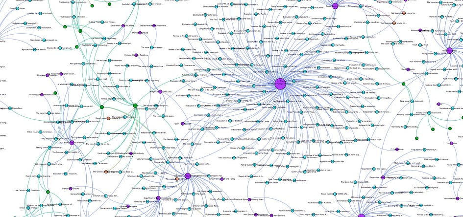
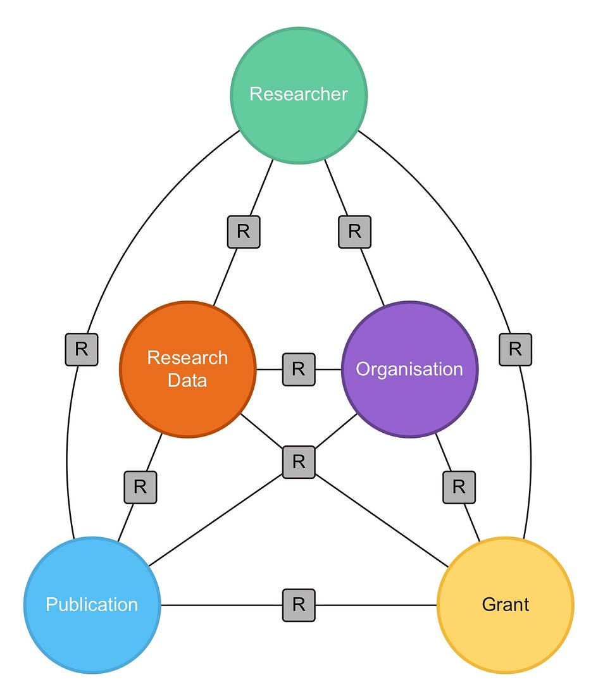
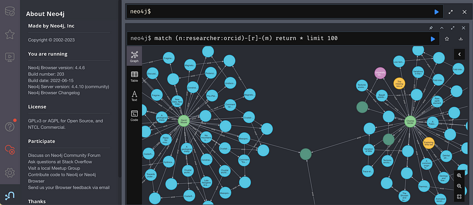

> Research Graph is a heterogeneous network that connects research outputs, research activities and researchers.

<figure>

<figcaption>

Image from [Source](https://blog.apo.org.au/2018/02/27/researchgraph-pilot-project)

</figcaption>

</figure>

# Author

- Amir Aryani (**ORCID**: [0000–0002–4259–9774](https://orcid.org/0000-0002-4259-9774))

# Introduction

In this article, we look at Research Graph as an information model, and an approach to connect and capture the connections between research outputs, researchers and research activities. We explore the metadata model, and we discuss how to capture this graph in a Neo4j Graph Database.

While scientific papers and research publications are key components of the research ecosystem, understanding the research and innovation ecosystem involves more than just studying research papers. For a young PhD student, the journey begins by reading academic papers to learn about their field, while established researchers use the latest publications to keep up with developments, discoveries, and innovations in their area of expertise. However, a thorough understanding of the research and innovation ecosystem involves more than just studying research papers. Researchers need to be aware of currently active projects in their field to avoid duplication and to identify collaboration opportunities. They should also learn from completed projects and their outcomes, engage with experts in their fields, and continuously seek potential funding and collaborative opportunities. Arguably, understanding this interconnected ecosystem is crucial for a successful academic career. The challenge for early career researchers lies in navigating this ecosystem in a way that provides insights into the best opportunities. Similarly, for governments, policymakers, and administrations, comprehending the dynamic components of innovation, staying abreast of the state of the art, and identifying research capabilities and expertise represent significant challenges.

Research Graph is composed of five primary node types:

- **Researcher**: An individual who conducts scientific or scholarly study, often within a specific field of knowledge. Their role involves creating new knowledge through research, which often includes running experiments, contributing to studies, and writing articles, books, or reports.

- **Publications**: Academic publications include journal articles, books, patents, conference abstracts, and theses, serving as the primary medium for disseminating research findings. Academic publications are often subject to a peer review process to ensure quality and validity. In the domain of humanities and social sciences (HASS), publications can form media pieces, performance arts, and other non-traditional research outputs. Publications are essential for sharing new knowledge and advancing scholarly discourse.

- **Research Data**: Data that is used or generated in the course of academic studies. They form the empirical basis for research in many disciplines, providing the raw information needed for analysis, conclusions, and validation of research hypotheses.

- **Grants**: Awards and grants are financial support provided by funding bodies (like government agencies, foundations, or institutions) to researchers or research projects. They are pivotal for enabling research by providing necessary resources, and they often influence the direction and scope of research activities. It is common for an awarded grant to support multiple projects or sub-projects to a hierarchical structure of research activities.

- **Organisations**: This encompasses institutions like universities, research institutes, and academic societies. Organisations play a crucial role in the research ecosystem by providing infrastructure, resources, and a collaborative environment for conducting research. They are also involved in disseminating research findings and may participate in the management of research projects and funding.

<figure>

<figcaption>

Image from [source](https://blog.apo.org.au/2018/02/27/researchgraph-pilot-project), RDA Plenary 11, when Research Graph announced a partnership with Australia Policy Observatory

</figcaption>

</figure>

# History

Research Graph formed as a project during the [Research Data Alliance Working Group on Data Registry Interoperability](https://www.rd-alliance.org/groups/data-description-registry-interoperability.html). The initial version of this project was providing the graph schema to a software platform called [Research Data Switchboard (RD-Switchboard)](https://github.com/rd-switchboard). This was an initial attempt by the Australian National Data Service (Australia), Dryad (United States), GESIS (Germany) and other partners to create a platform for creating links between research data collections across global data repositories. The graph schema later evolved to Research Graph as a meta model, and later formed the bases for a series of open source connected projects. Research Graph Foundation, a not-for-profit foundation, formed in Australia in 2018 to coordinate these projects. You can learn more about the foundation at [www.researchgraph.org](http://www.researchgraph.org/).

# Metadata

Research Graph nodes are connected by relationships such as authorship links between researchers and publications, employment links between researchers and organisations, and funder links between organisations and grants.

> In the context of this article, we refer to the node properties and structure of the relationships as **metadata**.

<figure>

<figcaption>

Research Graph Schema, [Source](https://researchgraph.org/schema)

</figcaption>

</figure>

The detailed list of properties for nodes and relationships are presented at [www.researchgraph.org/schema](http://www.researchgraph.org/schema). These nodes can be compared to tables in a database. However, it is important to highlight five main properties that applies to all nodes:

- **source**: A string value that shows the domain name of the source repository such as crossref.org, or orcid.org.

- **local\_id**: A string value that contains the local primary identifier of this node at the \*source\*. For example, if the source is orcid.org, the orcid ID would be the local\_id.

- **key**: A string value with the function as uniquely identifying the node across the global network of scholarly works. To achieve this, we combine the source [second-level domain](https://en.m.wikipedia.org/wiki/Second-level_domain)(e.g. crossref) and the local\_id.

- **type**: A string that represents the type of the node including “researcher”, ”organisation”, “publication”, ”dataset” and "grant".

- **last\_updated**: Date and time of the last update for the metadata of this node in this research graph.

Beyond these properties, all five node types have properties that further expand the information about each node. Some properties are optional and some mandatory. For example, **researcher** nodes have a mandatory property called “full\_name” that would contain the complete name of the researcher. However, it has several optional nodes such as “first\_name”, “last\_name”, “orcid”, “scopus\_author\_id”.

# Persistent Identifiers (PIDs)

A persistent identifier is a long-lasting reference to a digital resource. ORCID is an example of a persistent identifier for a person. Learn more about [persistent identifiers](http://www.ands.org.au/guides/persistent-identifiers-awareness). DOIs (digital object identifiers) are persistent identifiers for things or entities such as journal articles and datasets. [Crossref](https://www.crossref.org/) and [DataCite](https://www.datacite.org/) are the main organisations assigning DOIs in the academic ecosystem. We recommend learning about [the work of DataCite and Crossref](https://project-thor.readme.io/docs/who-are-datacite-and-crossref), [the organization identifier project](https://orcid.org/blog/2016/10/31/organization-identifier-project-way-forward), [Project THOR (Technical and Human infrastructure for Open Research](https://doi.org/10.5438/6423)), and [Metadata2020](http://www.metadata2020.org/) (the scholarly community’s group effort to advocate for richer shared metadata).

PIDs are essential components for connecting scholarly networks and forming a research graph. Most research graph nodes have PIDs as their main identifier. For metadata from ORCID, such as the node that represents https://orcid.org/0000-0002-4259-9774, the node properties include

- **source**: ”orcid.org”

- **local\_id**: “0000–0002–4259–9774”

- **Key**:“orcid/0000–0002–4259–9774”

- **orcid**:”0000–0002–4259–9774”

- **first\_name**: “Amir”

- **last\_name**: “Aryani”

- **full\_name**: “Amir Aryani”

- **scopus\_author\_id**: “35068996400”

Notice how “key” is formed as the result of concatenating the second level domain name from source (“orcid”) to the “local\_id” property. In this case, we use the orcid value as the “local\_id” of the node. In addition, there is a separate property called “orcid”. While this seems redundant, it provides consistency for nodes from other sources that might include ORCID identifiers for researchers such as open-access repositories.

<figure>

<figcaption>

Neo4j Browser, Screenshot from Australian National PID Graph, [Source](https://researchgraph.org/national-graph/)

</figcaption>

</figure>

# Why Neo4j?

For large research graph data, we need a database to capture and analyse the graph content. At the time of writing this article, there are several graph databases such as [ArangoDB](https://arangodb.com/), [Amazon Neptune](https://aws.amazon.com/neptune), and [Azure Cosmos DB](https://azure.microsoft.com/en-au/products/cosmos-db). However, Neo4j seems to be one of the most versatile options as it satisfies the following requirements:

- Neo4j open-source version enables free use and customisation for research.

- Neo4j has a large and active community with a lot of educational materials and active user groups.

- Easy-to-use Neo4j integration with Python, Java and other programming languages makes it very easy to start working with this graph database.

The most prominent advantage of Neo4j is the programming environment and user interface. It is highly accessible to novice programmers due to excellent integration with Java, Python and other programming languages. In addition, the graph explorer is easily usable by business analysts. The query language to interact with a Neo4j database is called Cypher.

You can find a comprehensive list of Cypher commands and useful tutorials at

- Getting Started with Cypher: [https://neo4j.com/docs/getting-started/appendix/tutorials/guide-cypher-basics/](https://neo4j.com/docs/getting-started/appendix/tutorials/guide-cypher-basics/)

- Cypher Cheat Sheet: [https://neo4j.com/docs/cypher-cheat-sheet/5/auradb-enterprise](https://neo4j.com/docs/cypher-cheat-sheet/5/auradb-enterprise)

- Cypher Basics: [https://vladbatushkov.medium.com/learn-neo4j-cypher-basics-in-30-minutes-94d68a52544](https://vladbatushkov.medium.com/learn-neo4j-cypher-basics-in-30-minutes-94d68a52544)

For more information on how to use Cypher queries to access graph databases using Research Graph schema, refer to this [post](https://researchgraph.org/blog/research-graph-102/).

# Neo4j Labels

A Neo4j graph is constituted by nodes and edges. Both nodes and edges have **properties** and **labels**. Properties store key information and are essential for querying specific nodes and relationships during information retrieval. Labels are key components of the graph that provide a level of classification. It enables grouping nodes and relationships and connecting them the same way we connect rows in an SQL database in a form or a table, or collect JSON objects in a MongoDB database in a collection. The main advantage of these labels is indexing. We can index properties against labels. Indexes in Neo4j are pairs of <property, index>, and that is essential for improving query performance while querying large graphs. Grouping nodes by labels and creating indexes at this level enables smaller, and faster indexes.

We have two major labels in a Research Graph Neo4j database:

- Source: these are labels that reference to the source Property such as “orcid”, “corssref”, and “datacite”.

- Type: these labels refer to five main node types including “publication”, “dataset”, “researcher”, “organisation”, and “grant”.

Note: Labels and properties are always lowercase, this enables us to have consistent cypher queries.

# Summary

Research Graph is a heterogeneous network that connects research outputs, research activities and researchers. This network provides insights into the digital footprint of research, and we can leverage Research Graph to analyse science and innovation networks such as citation networks, collaboration networks, and research communities. In addition, the Research Graph networks are the pathways to trace and analyse the impact of research funding and research projects. In this article, we explored the foundation of the Research Graph meta model, recommended the minimum metadata and we introduced Neo4j as the best approach to capture and link Research Graph nodes.

* * *

Medium version of this article is available [here](https://medium.com/@researchgraph/research-graph-101-0e1ab5df4497).
