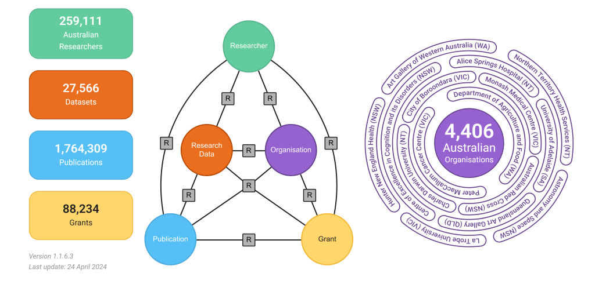
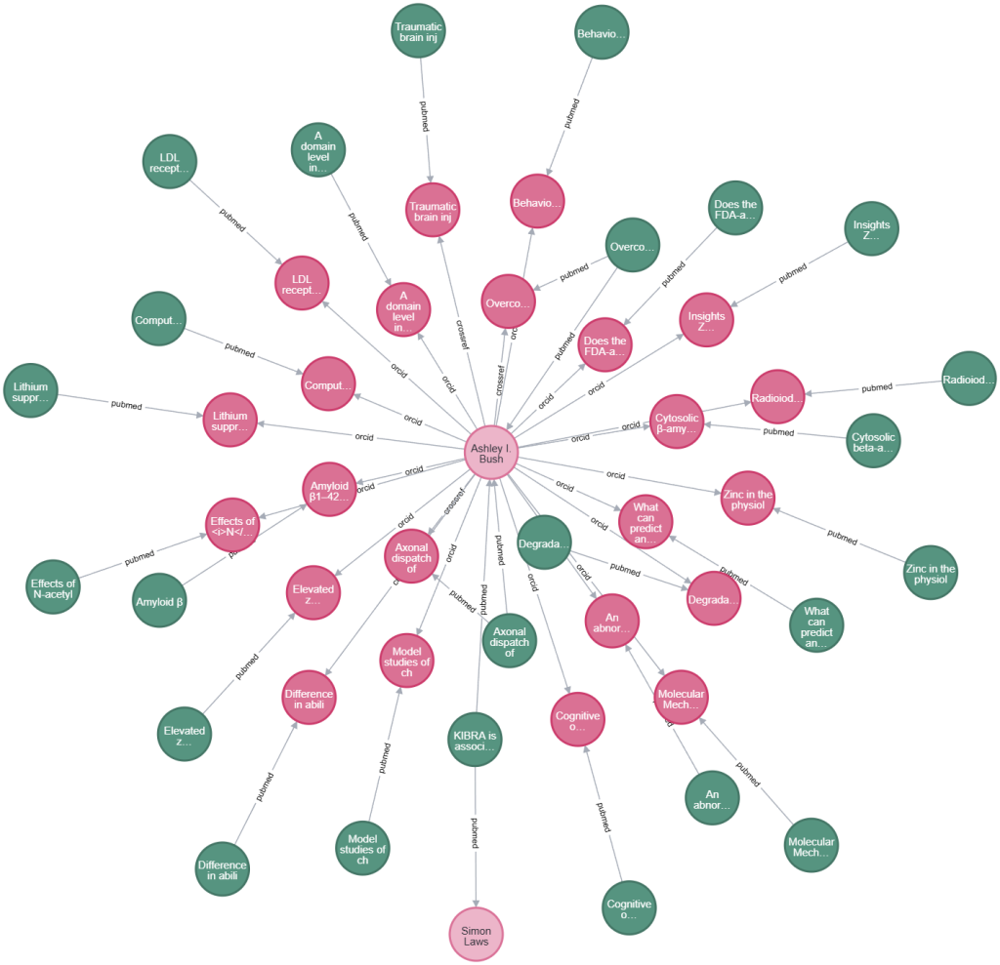
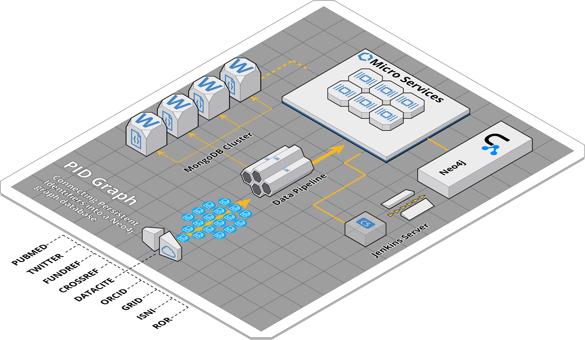
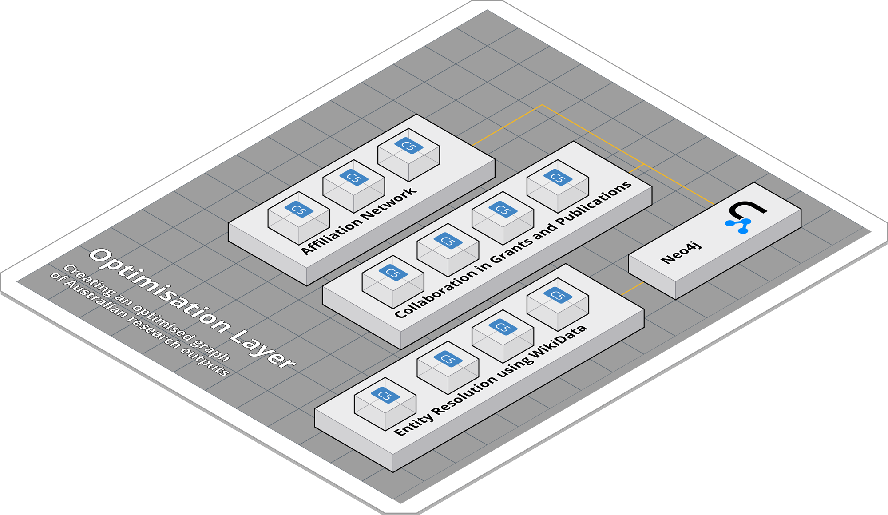
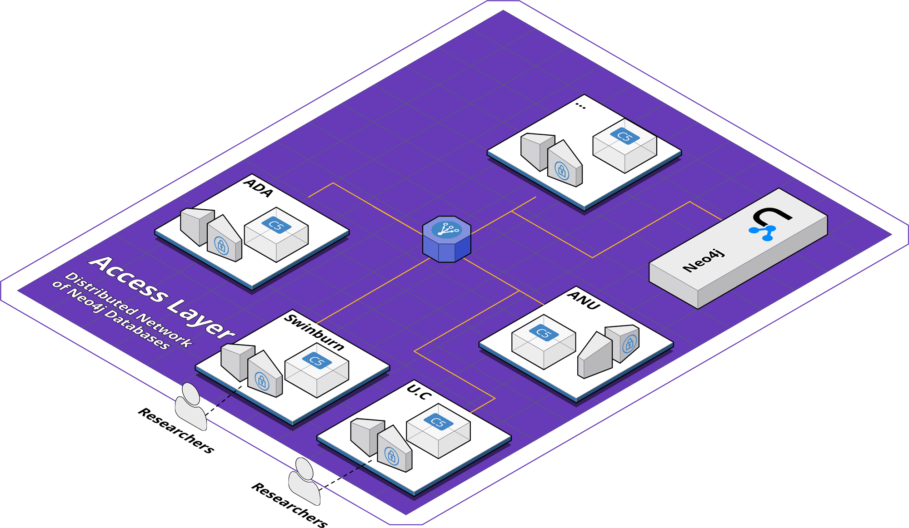
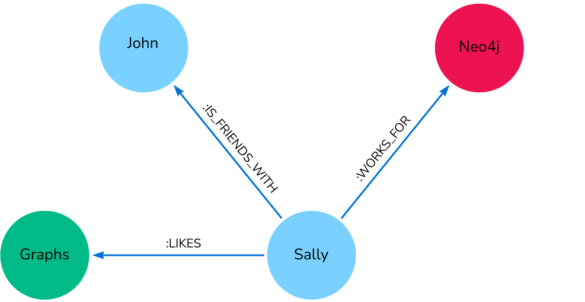

## Using Cypher to work with the Australian National Graph

> _The Australian National Graph is the first large-scale initiative to develop a national PID graph database. Using the Research Graph schema, it connects more than a thousand research organisations to their associated research outputs._

<figure>



<figcaption>

[Source](https://researchgraph.org/national-graph/)

</figcaption>

</figure>

# Introduction

In this article, we look at the graph database developed as part of the [National Graph project](https://researchgraph.org/national-graph/) and how to work with it using Cypher queries.

As of April 24, 2024, the Australian National Graph, the graph database developed as part of this project, included data on 259,111 Australian researchers, 27,566 datasets, 1,764,309 publications, 88,234 grants, and 4,406 Australian organisations. The data is accessible to Australian researchers under a Creative Commons Attribution-NonCommercial-ShareAlike 4.0 International License. This database uses the Research Graph schema to connect researchers, organisations and associated entities.[](https://researchgraph.org/national-graph/?utm_source=chatgpt.com)

* * *

PIDs, or Persistent Identifiers, are **unique codes** that identify digital objects, people, or concepts. Some of the major PIDs providers are Crossref, ORCID, and DataCite, among others. The National Graph project is a collaborative approach to building a national-level graph of persistent identifiers. This approach facilitates gaining insights into the collaborations between research institutions, industry, and international partners. The graph was constructed and deployed using Neo4j.

For more information about the Research Graph schema, refer to this [post](https://researchgraph.org/blog/research-graph-101/).

## Architecture

The National Graph uses a three-layer architecture to create, optimise and distribute the graph. This layered architecture allows for the separation of key components, enhancing efficiency and serviceability.

**PID Graph**: The data from major PID providers like ORCID, PubMed, Crossref etc are extracted using a data pipeline. In the pipeline, data is cleaned, special characters removed, deduplicated(meaning for example, the same researcher from PubMed and Crossref should only exist as one entry in the database, not two) and crosslinked(all the connected relationships of these deduplicated entities should still exist. For example, all the publications of the same researcher that came from PubMed should still be connected to them along with all the publications that came from Crossref). The data is stored in MongoDB and intermediate csv files of the data stored are generated. These files are then used to create the Neo4j graph using Microservices. This layer uses the Research Graph schema to connect the PIDs by applying metadata, text mining, and entity resolution algorithms.

<figure>



<figcaption>

The graph shows the publications connected to the researcher Ashley I. Bush. The red nodes represent the publications connected to ORCID. The green nodes represent the publications connected to PubMed.

</figcaption>

</figure>



**Optimisation Layer:** This is the layer where Australian research output gets converted to an optimised graph. It applies entity resolution, where for example, the nodes in the graph associated with The Australian National University and ANU will be combined since they refer to the same entity, meaningful links between Datasets, Researchers, Organisations, Grants and Publications are created and a network of associated organisations are also created.



**Access Layer:** This layer consists of a distributed network of Neo4j databases, enabling easy access to the National Graph content using the Neo4j Graph interface. This decentralised structure allows Australian researchers to utilise their own cloud infrastructures for managing and coordinating database access efficiently, allowing dynamic allocation of resources based on specific needs. This ensures flexible and scalable data management.



_**Note:** To gain access to the Australian National Graph, you need to be a partner of The Research Graph Foundation. The access will be provided on an agreement basis._

## Cypher

The Australian National Graph is deployed on Neo4j, and accessing its content requires having knowledge in Cypher. Cypher is Neo4j’s query language for interacting with graph databases.

Cypher is similar to SQL, but optimised for graphs. Its constructs are based on English prose and iconography. This makes queries easy to both read and write. Cypher also provides a visual way of matching patterns and relationships by having its own design based on ASCII-art type of syntax.

```
(:nodes)-[:ARE_CONNECTED_TO]->(:otherNodes)
```

Round brackets are used to represent `(:Nodes)`, and `-[:ARROWS]→` to represent a relationship between the `(:Nodes)`. With this query syntax, you can perform create, read, update, or delete (CRUD) operations on your graph.

<figure>



<figcaption>

A graph example involving four nodes and three relationships. [Source](https://neo4j.com/docs/getting-started/cypher/).

</figcaption>

</figure>

This graph could be translated into English as _Sally likes Graphs. Sally is friends with John. Sally works for Neo4j._

In Cypher, the same information would look like this:

```
(:Sally)-[:LIKES]->(:Graphs)
(:Sally)-[:IS_FRIENDS_WITH]->(:John)
(:Sally)-[:WORKS_FOR]->(:Neo4j)
```

With these basic building blocks in mind, the following cypher queries can be used to work with the Australian National Graph

## Graph Exploration

### Finding the number of grants for each source

```
cypher = '''MATCH (g:grant)
            RETURN g.source as source, count(g.local_id) as no_of_grants
            ORDER BY no_of_grants DESC LIMIT 10'''
```

| source | no\_of\_grants |
| --- | --- |
| "arc.gov.au" | 32338 |
| "orcid.org" | 29596 |
| "nhmrc.org" | 28547 |
| "crossref.org" | 49 |

- The top sources (ARC and NHMRC) are Australian national funding agencies, suggesting that publicly funded research is a major contributor to the database.

- ORCID is not a direct funding body, but its high count implies that many grants are linked to researcher profiles via ORCID.

### Finding the most common number of years a grant is given

```
cypher = '''MATCH (g:grant)
            WHERE g.start_year IS NOT NULL and g.end_year IS NOT NULL
            WITH g, toInteger(g.start_year) AS start_year, toInteger(g.end_year) AS end_year
            RETURN g.source as source, abs(end_year-start_year) as duration_of_years, COUNT(g.key) as no_of_grants
            ORDER BY no_of_grants DESC LIMIT 10'''
```

| **source** | **duration\_of\_years** | **no\_of\_grants** |
| --- | --- | --- |
| "arc.gov.au" | 3 | 12399 |
| "nhmrc.org" | 2 | 9584 |
| "orcid.org"    | 2 | 8694 |
| "arc.gov.au"    | 4 | 7527 |
| "orcid.org"    | 3 | 6493 |
| "nhmrc.org"    | 3 | 4778 |
| "orcid.org"    | 1 | 4448 |
| "arc.gov.au"    | 2 | 4392 |
| "arc.gov.au"    | 5 | 3770 |
| "orcid.org"    | 0 | 3655 |

- The most common grant duration is 3 years, from arc.gov.au (12,399 grants), orcid.org (6,493 grants), and nhmrc.org (4,778 grants).

- ARC (Australian Research Council) and NHMRC (National Health and Medical Research Council) appear multiple times in the top-funded durations, indicating that they are major funding sources.

## Finding the most common funder

```
cypher = '''MATCH (g:grant)
            RETURN DISTINCT g.source as source, g.funder as funder, COUNT(g.local_id) as count
            ORDER BY count DESC LIMIT 10'''
```

| source | funder | count |
| --- | --- | --- |
| "arc.gov.au" | "arc.gov.au" | 32338 |
| "nhmrc.org" | "National Health and Medical Research Council" | 28465 |
| "orcid.org" | "Australian Research Council" | 7980 |
| "orcid.org" | "National Health and Medical Research Council" | 4310 |
| "orcid.org" | "Canadian Institutes of Health Research" | 649 |
| "orcid.org" | "European Commission" | 513 |
| "orcid.org" | "Engineering and Physical Sciences Research Council" |    381 |
| "orcid.org" | "Japan Society for the Promotion of Science" | 367 |
| "orcid.org" | "Marsden Fund" |    254 |
| "orcid.org" | "National Natural Science Foundation of China" | 234 |

- Some non-Australian funders appear in the dataset like "European Commission", "Japan Society for the Promotion of Science" etc. This indicates that although this dataset is primarily focused on Australian funding, international collaborations are still present.

### Finding the funders giving the highest funding amount

```
cypher = '''MATCH (g:grant)
            WITH g.source as source, g.funder as funder, g.funding_currency as funding_currency, 
            CASE WHEN g.source = 'nhmrc.org' THEN sum(toInteger(g.nhmrc_funding_amount)) 
                 WHEN g.source = 'arc.gov.au' THEN sum(toInteger(g.arc_funding_at_announcement)) 
                 ELSE sum(toInteger(g.funding_amount)) END as funding_amount
            WITH source, funder, 
            CASE WHEN funding_currency = 'GBP' THEN funding_amount*1.9 
                 WHEN funding_currency = 'EUR' THEN funding_amount*1.64
                 ELSE funding_amount END as funding_amount,
            CASE WHEN funding_currency = 'GBP' THEN 'AUD'
                 WHEN funding_currency = 'EUR' THEN 'AUD'
                 ELSE funding_currency END as funding_currency
            RETURN DISTINCT source, funder, funding_currency, funding_amount
            ORDER BY funding_amount DESC LIMIT 10'''
```

| source | funder | funding\_currency | funding\_amount |
| --- | --- | --- | --- |
| "arc.gov.au"    | "arc.gov.au"    | null | 15987295944 |
| "nhmrc.org" | "National Health and Medical Research Council" | _null_ | 15663446606 |
| "nhmrc.org" | "Australian Research Council" | _null_ | 25980289 |
| "crossref.org" | "H2020 European Research Council" | "AUD" |    17801261.919999998 |
| "crossref.org" | "Wellcome Trust" | "AUD" |    13433207.1 |
| "crossref.org" | "Australian Research Data Commons" | "AUD" |    7002139 |
| "crossref.org" | "HORIZON EUROPE European Innovation Council" | "AUD" |    5817155.4399999995 |
| "crossref.org" | "Fundação para a Ciência e a Tecnologia" | "AUD" |    2926727.5999999996 |
| "crossref.org" | "HORIZON EUROPE Marie Sklodowska-Curie Actions" | "AUD" |    2408490.88 |
| "crossref.org" | "American Heart Association" | _null_ | 1285240 |

- ARC and NHMRC are the two government agencies that dominate funding in Australia, with ARC funding slightly exceeding NHMRC. This is reflective of the fact that ARC supports broader research areas, while NHMRC specialises in medical and health research.

- crossref.org being the source of some of the international funders is indicative of its global presence.

## Researcher exploration

### Finding the researchers who received multiple grants

```
cypher = '''MATCH (r:researcher)--(g:grant)
            WHERE g.source = 'orcid.org'
            RETURN r.source as source, r.full_name AS full_name, COUNT(r.orcid) AS count 
            ORDER BY count DESC LIMIT 10'''
```

| source | full\_name | count |
| --- | --- | --- |
| "orcid.org" | _null_ | 145 |
| "orcid.org" | "Peter von Dadelszen" | 92 |
| "orcid.org" | "Paul Scuffham" | 77 |
| "orcid.org" | "David Cooke" | 75 |
| "orcid.org" | "David Burt" | 72 |
| "orcid.org" | "Bruce Tonge" | 62 |
| "orcid.org" | "Meera Agar" | 59 |
| "orcid.org" | "Alexander Davies" | 59 |
| "orcid.org" | "Hui-yao Lan" | 55 |
| "orcid.org" | "Jonathan Carapetis" | 54 |

- All results are sourced from orcid.org, meaning ORCID is effectively used for linking researchers to funding data globally.

- Peter von Dadelszen, the top identified researcher, works in Global maternal health and Pregnancy Hypertension

### Finding the Countries with the highest number of researchers that have published or are yet to publish

```
cypher = '''MATCH (r:researcher)--(o:organisation)
            WHERE o.source = 'orcid.org'
            WITH o.source as source, o.country as country, COUNT(distinct r.orcid) AS count 
            RETURN distinct source, country, count 
            ORDER BY count DESC LIMIT 10'''
```

| source | country | count |
| --- | --- | --- |
| "orcid.org" | "AU" | 140968 |
| "orcid.org" | "US" | 125958 |
| "orcid.org" | "GB" | 88622 |
| "orcid.org" | "CN" | 46758 |
| "orcid.org" | "DE" | 38624 |
| "orcid.org" | "FR" | 26293 |
| "orcid.org" | "CA" | 24127 |
| "orcid.org" | "ES" | 23971 |
| "orcid.org" | "IT" | 23743 |
| "orcid.org" | "IN" | 22295 |

- Australia (AU) has the largest number of researchers registered in ORCID, showing higher counts than even the United States (US) and the United Kingdom (GB).

- Countries like China("CN") with large research outputs have lower ORCID registrations, perhaps due to a preference for a different researcher identification system.

## Publication Exploration

```
cypher = '''MATCH (p:publication)
            WITH p, CASE when p.source='orcid.org' then p.orcid_type
                         when p.source='crossref.org' then p.crossref_type
                         when p.source='datacite.org' then p.datacite_citeproc
                         when p.source='pubmed.gov' then 'journal'
                         when p.source='scopus.com' then p.scopus_aggregation_type
                         when p.source='twitter.com' then p.type
                    END as publication_type
            RETURN p.source as source, publication_type, count(p.key) as count
            order by count desc limit 10'''
```

| source | publication\_type | count |
| --- | --- | --- |
| "crossref.org" | "journal-article" | 1645479 |
| "scopus.com" | "Journal" | 948196 |
| "pubmed.gov" | "journal" | 559538 |
| "crossref.org" | "proceedings-article" | 91975 |
| "crossref.org" | "book-chapter" | 86193 |
| "scopus.com" | "Conference Proceeding" | 61598 |
| "crossref.org" | "posted-content" | 47917 |
| "orcid.org" | "journal-article" | 36130 |
| "scopus.com" | "Book" | 33057 |
| "scopus.com" | "Book Series" | 20585 |

- The most common publication type is "Journal"

- PubMed is focused solely on journals, reflecting its biomedical research domain.

- Scopus is widely used for conference and book publications, making it an important platform for engineering, computer science, and interdisciplinary research.

## Conclusion

The Australian National Graph serves as a comprehensive research infrastructure of Persistent Identifiers, providing valuable insights into funding allocation, researcher activity, and publication trends. The use of Cypher queries with Neo4j allows for efficient exploration and analysis of this data. By tracking researchers, grants, and publications, the graph helps identify key research contributors and partnerships. Additionally, the funding analysis helps institutions optimise resource allocation and identify underfunded research areas.
