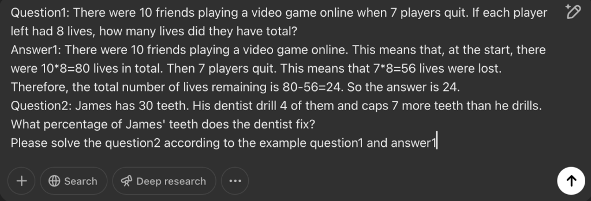
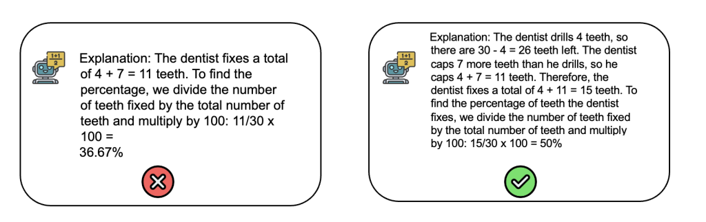
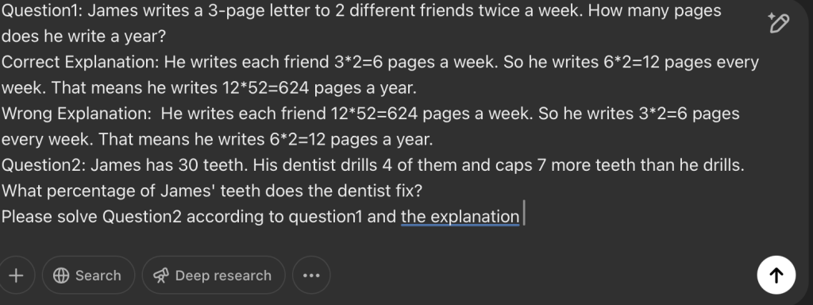
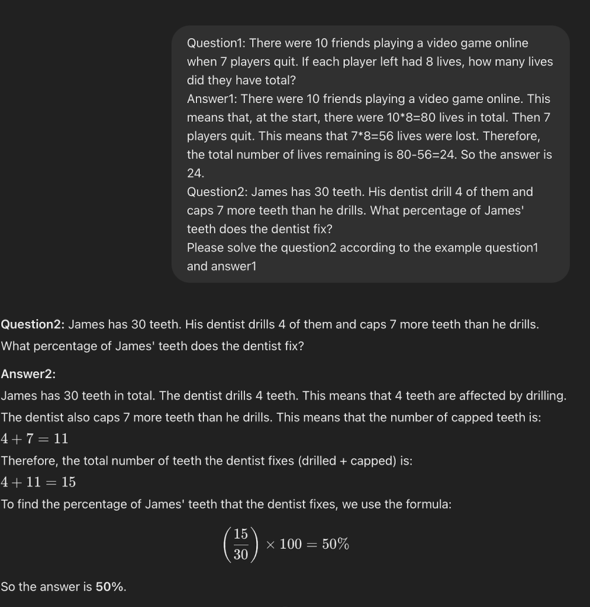
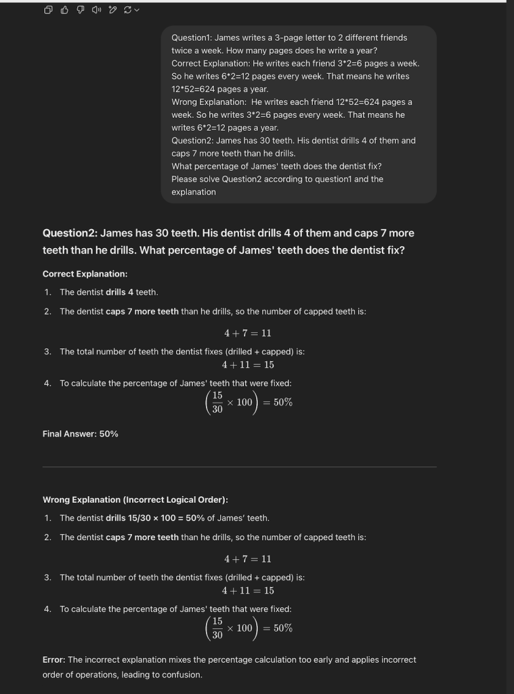

## Enhancing LLMs to Think Like Humans

```
This article is based on the paper Contrastive Chain-of-Thought Prompting by Yew Ken Chia and others.
```

<figure>


<figcaption>

_Image created by Dalle 3 on 20.2.2025_

</figcaption>

</figure>

## Introduction

In recent years, Large Language Models (LLMs) have demonstrated remarkable performance across a variety of natural language processing tasks. However, their ability to perform complex reasoning remains a key challenge. Unlike humans, who can reason step by step and learn from both correct and incorrect examples, LLMs often struggle with logical consistency and generalisation beyond seen data.

To address these limitations, researchers have explored **Chain-of-Thought (CoT) prompting**, a technique that enhances reasoning capabilities by explicitly breaking down problems into intermediate steps. While effective, standard CoT approaches primarily focus on correct reasoning paths, neglecting the potential learning benefits of incorrect demonstrations. This limitation inspired the development of **Contrastive Chain-of-Thought (Contrastive CoT) prompting**, a novel framework that leverages both positive (correct) and negative (incorrect) reasoning examples to refine model performance.

This article explores the principles behind Contrastive CoT prompting, compares it with standard CoT, and highlights its advantages in improving LLM reasoning. We also present experimental results demonstrating the effectiveness of this approach across various arithmetic reasoning benchmarks.

## What is Chain of thought?

For the standard prompting, we ask the model a question, and the model will give us an output, but for the CoT, when we ask a question, the model will not only give us the answer but also give us the intermediate steps during thinking.

- Standard Format: <input → output>

- CoT Format: <input → intermediate steps → output>

For example, if we ask a question like: There were 10 friends playing a video game online, and then 7 players quit. If each player left had 8 lives, how many lives did they have in total? For the Chain of Thought, it will give you the thinking process like: There were 10 friends playing a video game online. This means that, at the start, there were 10 x 8 = 80 lives in total. Then, 7 players quit. This means that 7 x 8 = 56 lives were lost. Therefore, the total number of lives remaining is 80 - 56 = 24. The answer is 24.

## Standard Chain of Thought Prompting

The **Standard Chain of Thought (CoT) prompting** is a method used in large language models (LLMs) to enhance their reasoning ability by breaking down complex problems into intermediate steps. Instead of providing a direct answer, the model is guided to generate a sequence of logical steps that lead to the solution. This structured approach improves model performance on reasoning tasks by mimicking human-like problem-solving processes.

<figure>



<figcaption>

_Standard Chain of Thought Prompting_

</figcaption>

</figure>

Compared to the standard prompting method, traditional chain thinking prompts solve problems by guiding AI models to reason step by step. Although this method is good, it usually only focuses on the correct reasoning path and ignores the potential value of the wrong path for learning. It will also make many mistakes. For example, in some research, it was shown that even demonstrations with invalid reasoning can lead to similar performance compared to valid demonstrations.

<figure>



<figcaption>

_Mistakes the model makes(Image by Author)_

</figcaption>

</figure>

## Contrastive chain of thought

This technique was inspired by how humans can learn from positive as well as negative examples. For instance, when solving a complex task, it is useful to learn the correct steps from positive demonstrations, as well as avoiding faults in negative demonstrations. There is a new technique called **_contrastive chain of thought_**, which provides both positive and negative demonstrations to enhance the reasoning of language models. This method allows models to gain a more comprehensive understanding of problems, thereby improving their decision-making accuracy by effectively avoiding mistakes.

<figure>



<figcaption>

_Contrastive Chain-of-Thought Prompting(Image by Author)_

</figcaption>

</figure>

Also, we don't need to create these wrong explanations manually, we can automatically construct them from the correct reasoning steps. Concretely, we can extract objects such as numbers and equations from a given chain-of-thought rationale. Then, we randomly shuffle the position of the objects within the explanation, thus constructing many different wrong explanations. As shown in the image above, we shuffle the position for _**3\*2**, **6\*2** and **12\*52**\=624._

To assess the effectiveness of the Contrastive Chain of Thought,  the method was tested mainly on datasets based on arithmetic reasoning, including [GSM8K](https://github.com/openai/grade-school-math) , [AQuA](https://github.com/google-deepmind/AQuA) , [GSM-Hard](https://huggingface.co/datasets/reasoning-machines/gsm-hard) , [SVAMP](http://xcar.com.cn) , and [ASDIV](https://github.com/chaochun/nlu-asdiv-dataset) . The main findings are as follows:

|  | **_GSMK8_** | **_AQuA_** | **_GSM-Hard_** | **_SVAMP_** | **_ASDIV_** |
| --- | --- | --- | --- | --- | --- |
| Standard | 27.4 | 29.5 | 11.2 | 69.3 | 75.8 |
| CoT | 69.2 | 53.5 | 33.8 | 67.2 | 70.8 |
| Contrastive CoT | 79.0(+9.8) | 57.5(+3.9) | 44.2(+10.4) | 81.6(+14.4) | 84.4(+13.6) |

The results show that compared with the traditional Chain of Thought, the Contrastive Chain of Thought has made significant progress in improving reasoning accuracy. These results not only verify the effectiveness of contrastive chain thinking but also demonstrate its potential in dealing with complex reasoning tasks.

## Testing

I tried to use the Standard Chain of Thought Prompting and Contrastive Chain of Thought Prompting on the question I mentioned above about James' teeth using GPT-4o. But I found both of the methods gave the right answer.

<figure>



<figcaption>

_Result using standard chain of thought prompting_

</figcaption>

</figure>

<figure>



<figcaption>

_Result using Contrastive Chain of Thought Prompting_

</figcaption>

</figure>

I also tried various other examples, but both prompting techniques continued to give the same answer. If **Contrastive Chain of Thought (Contrastive CoT) Prompting** and **Standard Chain of Thought (CoT) Prompting** get the same results, I think several possible reasons could explain this phenomenon:

### **1\. The Task is Too Simple to Differentiate the Two Methods**

Contrastive CoT is designed to enhance reasoning in **complex** tasks. However, in **simple arithmetic or logical problems**, Standard CoT might already be sufficient to arrive at the correct answer. If the problem is not challenging enough, **Standard CoT alone** can guide the model to a correct solution, making the additional benefits of Contrastive CoT negligible.

### **2\. The Model's Performance Has Already Reached Its Limit**

The primary benefits of Contrastive CoT include:

- Helping the model avoid **erroneous reasoning paths**.

- Providing **fine-grained feedback** on complex problems.

- Improving **generalisation** to more difficult reasoning tasks.

However, if the task is already **well-handled by Standard CoT**, or the model’s accuracy is already **very high**, Contrastive CoT might not provide further improvements.

### **3\. Negative Samples Do Not Significantly Affect Model Learning**

Contrastive CoT improves reasoning by introducing both **positive (correct reasoning)** and **negative (incorrect reasoning)** examples. However, in some cases:

- The **negative samples are too obvious** and do not provide additional learning value.

- The **negative samples are not properly constructed**, failing to effectively contrast with positive reasoning.

- The **relationship between positive and negative samples is weak**, meaning the contrastive learning mechanism does not contribute much.

If the model **does not effectively learn from the negative samples**, the results from Contrastive CoT and Standard CoT may be identical.

## Conclusion

The Contrastive Chain of Thought prompting technique provides a new perspective for the design of future AI systems. With this approach, we can design more intelligent and adaptive AI that can make more accurate decisions in various situations. Future research will explore how to further optimise the generation of contrast examples and how to extend this method to more types of AI applications.

## References

- Chia, Y.K., Chen, G., Tuan, L.A., Poria, S. and Bing, L. (2023). _Contrastive Chain-of-Thought Prompting_. \[online\] arXiv.org. Available at: https://arxiv.org/abs/2311.09277.
