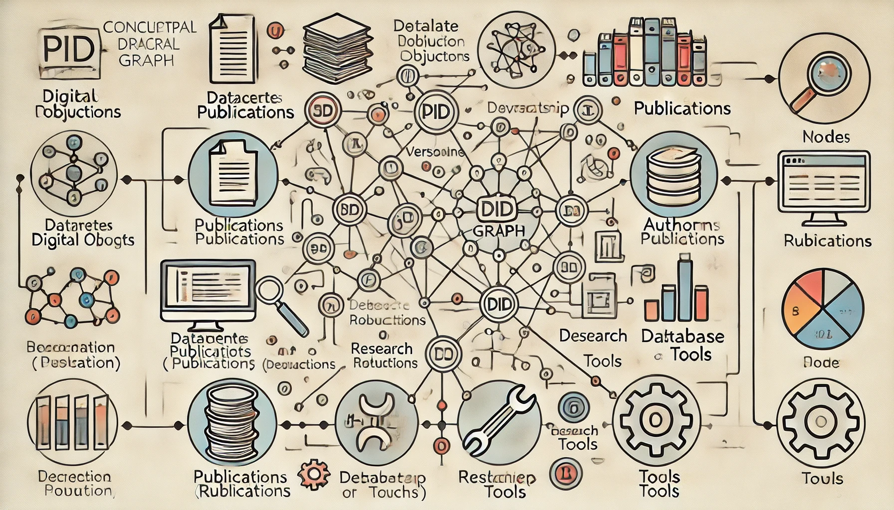
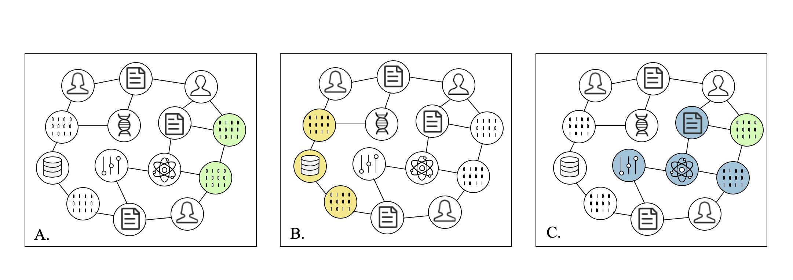

## A way to optimise scientific research data management

<figure>



<figcaption>

_Concept image for PID graph_(generated by Dalle3)

</figcaption>

</figure>

## Introduction

This article is based on the article [**Introducing the PID Graph**](https://datacite.org/blog/introducing-the-pid-graph/) published on DataCite.

In the field of scientific research, every discovery, paper, and dataset is an important part of the knowledge base. With the explosive growth of scientific research data, how to effectively manage this data has become a big challenge. **The persistent identifier (PID**) graph is an innovative solution driven by this demand. This article will explore the concept and implementation of the PID graph and its potential impact on the field of scientific research.

## Importance and Shortcomings of PID

Persistent identifiers (PIDs) are unique identifiers for resources such as scientific publications, datasets, and researchers. These identifiers not only help distinguish and cite various scientific outputs, but also clearly link related scientific resources such as articles, datasets, and researchers themselves through their metadata. For example, with PIDs, we can easily find all the research results of a scientist or track the citations of a paper.

Some of the more complex but still important use cases can’t be addressed by simply collecting and aggregating links between two persistent identifiers, including

- Aggregate the citations for all versions of a dataset or software source code

- Aggregate the citations for all datasets hosted in a particular repository, funded by a particular funder, or created by a particular researcher.

- Aggregate all citations for a [research object](http://www.researchobject.org/): a publication, the data underlying the findings in the paper, and the software, samples, and reagents used to create those datasets.

## Definition and Function of PID Graph

The PID graph is a graph-theory-based model used to describe and manage resources identified by PIDs and their relationships with each other. In this graph, nodes represent scientific research resources (such as papers, datasets, and researchers), while edges represent links between these resources (such as citations, author relationships, and dataset version relationships). The implementation of the PID graph can help researchers manage complex data relationships more effectively, such as the relationship between different versions of a dataset, or the reference chain between different research outputs.

The following image shows digital objects connected by PIDs, showing three use cases: A: Different versions of software code, B: Datasets hosted by a particular repository, C: All digital objects connected to a research object.

<figure>



<figcaption>

PID Graphs(Created by Author)

</figcaption>

</figure>

## Implementation of PID Graph

Building a persistent identifier (PID) graph is a multi-step process that aims to capture and display the complex relationships between research outputs. The following is the basic framework and detailed steps for building a PID map:

#### Collecting Events Data

The first working PID Graph implementation is provided by [DataCite](https://datacite.org/eventdata.html). Initially it focused on social media mentions and data citations.

- In the context of a PID graph, an event refers to any form of association or interaction that occurs between two resources, such as references, dataset updates, versioning, etc.

- Event data can be collected from various data sources, such as academic databases (DataCite, Crossref, etc.), which record events such as citations, social media mentions, etc.

#### Include metadata about resources

Do this by optionally including the metadata for the **subj** and **obj** (the resources linked via the event) in Event Data via an extra query parameter.

- Metadata provides necessary contextual information for each node in the PID graph, such as publication date, author information, institution information, etc.

- Add more detailed metadata from the original PID source through the API. For example, use DataCite's API to obtain detailed metadata about the dataset, such as the creator of the dataset, keywords, DOI, etc.

DataCite's Event Data Service is a typical example of a PID graph application. The service provides a platform for connecting different PIDs and resources, initially focusing on social media mentions and data citations. By introducing metadata about resources, DataCite makes the process of building a PID graph simpler and more direct. For example, researchers can use DataCite's API to query the citations of all versions or derivatives of a specific dataset, thereby gaining a deeper understanding of the impact and scope of application of the dataset.

#### Include implicit relations

Metadata for resources contain a lot of information about connected PIDs.Specifically, we include these relations and associated PIDs:

- Version, e.g. dataset A **isVersionOf** dataset B.

- Granularity, e.g. dataset A **isPartOf** dataset B or dataset A **isSupplementTo** article B.

- Funding, e.g. dataset A **isFundedBy** funder B.

- Author, e.g. dataset A **isAuthoredBy** author B

#### Include more types of events

The initial focus in Event Data was on social media mentions and data citations. DataCite has added author-resource links and funder-resource links, using ORCID and Crossref Funder ID as PIDs, respectively. 

## Application examples of PID Graph

The following is an example of a query using the PID graph. You can access the query URL directly in a web browser, or use a Python script to make a different query by simply changing the URL parameters.

```
import requests

url = "https://api.datacite.org/events?include=subj,obj"
response = requests.get(url)
data = response.json()

print(data)
```

#### Examples

```
https://api.datacite.org/events?include=subj,obj&orcid=0000-0002-4259-9774In this example, we used ORCID ID (orcid=0000-0002-4259-9774) to query research results. Similarly, you can query different types of scientific research data by changing the URL parameters. For example, use DOI to query specific research results, use ROR ID to query the results of a research institution, use Funder ID to query research funded by a funding agency, or use Dataset ID to track the citation of a dataset. This flexible query method enables PID graphs to meet a variety of scientific research data management needs, allowing researchers to more deeply analyze the relevance of academic resources.Here is one output, and the highlight part is the most important information in this output.
```

```
{"id":"d0d6b211-a777-4541-a398-f301c66adace","type":"events","attributes":{"subj-id":"https://doi.org/10.6084/m9.figshare.155650","obj-id":"https://orcid.org/0000-0002-4259-9774","source-id":"datacite-orcid-auto-update","relation-type-id":"is-authored-by","total":1,"message-action":"create","source-token":"7b09eda9-0024-4e26-9f01-6d8d5a1028d7","license":"https://creativecommons.org/publicdomain/zero/1.0/","occurred-at":"2019-08-02T01:25:57.000Z","timestamp":"2019-08-02T01:28:06.946Z"},"relationships":{"subj":{"data":{"id":"https://doi.org/10.6084/m9.figshare.155650","type":"objects"}},"obj":{"data":{"id":"https://orcid.org/0000-0002-4259-9774","type":"objects"}}}},
```

#### Analysis of the output

- **Subject (subj-id)**: DOI https://doi.org/10.6084/m9.figshare.155650, representing a research output.

- **Object (obj-id)**: ORCID https://orcid.org/0000-0002-4259-9774, representing the author's ORCID.

- **Event type (relation-type-id)**: is-authored-by, indicating that this is an "authorship" relationship, that is, the work identified by the DOI was created by the author identified by the ORCID.

- **Event time (occurred-at)**: 2019-08-02T01:25:57.000Z.

- **Event record time (timestamp)**: 2019-08-02T01:28:06.946Z.

## Looking ahead: the potential impact of PID graphs

With the further improvement and application of PID graphs, their role in scientific research data management and open science practice will become increasingly obvious. PID graphs can not only help researchers track the source and impact of research results, but also optimize the use of scientific research funds and improve the transparency and efficiency of scientific research. In addition, with the participation of more research institutions and funding agencies, PID graphs are expected to become a shared resource for the global scientific research community, promoting scientific research cooperation and the rapid dissemination of knowledge.

## Conclusion

In today's data-driven research environment, it is essential to efficiently manage and relate massive amounts of research results. The PID graph builds structured relationships through persistent identifiers (PIDs) to organically connect papers, datasets, authors, and funding information, which not only improves citation tracking and data version management, but also helps researchers deeply understand the relationship between scientific research data.

And with the advancement of artificial intelligence and linked data technologies, PID graphs are expected to further promote changes in scientific research management and provide smarter and more accurate support for the global scientific research ecosystem.
