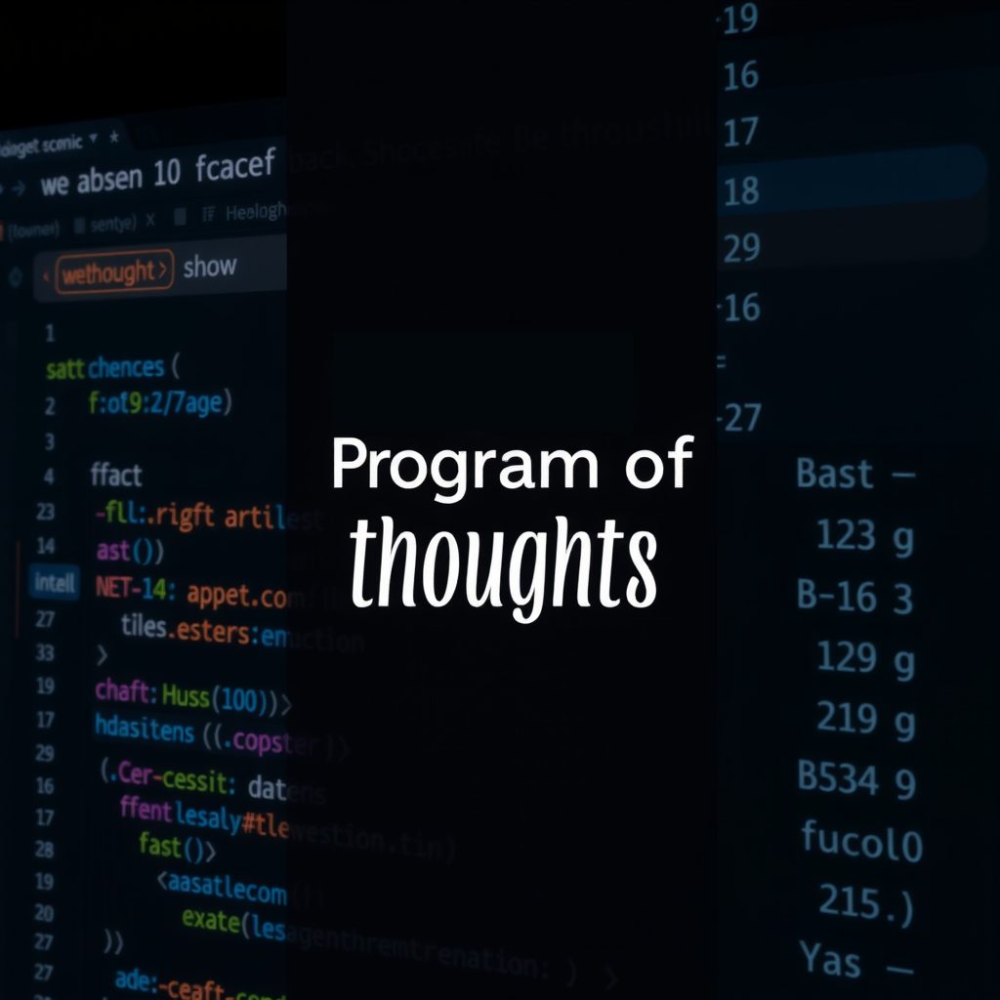

## **The Evolution of Numerical Reasoning in AI: The Power of Program of Thoughts (PoT)**

_This article is based on the paper **[Program of Thoughts Prompting: Disentangling Computation from Reasoning for Numerical Reasoning Tasks](https://arxiv.org/abs/2211.12588)** by Wenhu Chen and others._

<figure>



<figcaption>

The above image was generated using [Source: DALLE-3](https://openai.com/index/dall-e-3) on 20/02/2025 using prompt "Generate an image highlighting "program of thoughts" that is allocated to external interpreter."

</figcaption>

</figure>

## Author

- Harshitha Thoram (**ORCID:** 0009-0007-4527-7926)

## Introduction

Artificial Intelligence has made significant strides in solving complex numerical reasoning tasks. Traditional approaches focused on training models from scratch or fine-tuning them to demonstrate reasoning step by step. However, these methods often required extensive datasets and training with manually crafted reasoning steps.  
With advancements in machine learning, particularly large language models, researchers have explored new techniques to enhance reasoning capabilities. Among these, Chain of Thought (CoT) and Program of Thoughts (PoT) prompting have emerged as innovative approaches to improving numerical problem-solving. This blog discusses about PoT technique, its advantages over CoT, and its real-world applications.

This blog is written based on the article published called [Program of Thoughts Prompting: Disentangling Computation from Reasoning for Numerical Reasoning Tasks](https://arxiv.org/pdf/2211.12588)

## The Chain of Thought Approach

Chain of Thought Prompting encourages an LLM to explicitly lay out intermediate steps before giving a final answer. This step-by-step reasoning can be guided by examples within the prompt, a strategy known as In-Context Learning (ICL). Although CoT often outperforms “direct answer” prompting and achieves state-of-the-art performance on various benchmarks, it can still stumble in the following areas:

1. **Arithmetic Mistakes**: Even small errors in multi-step calculations can lead to incorrect final answers.

3. **Complex Expressions**: Polynomial, differential, or other higher-level equations strain the model’s capacity for error-free symbolic manipulation.

5. **Inefficient Iterations**: Repetitive tasks, such as summing large ranges or performing lengthy sequences of calculations, become cumbersome when done purely in text form.

These shortcomings highlight the need for a more robust approach—namely, the Program of Thoughts.

## What is Program of Thoughts(PoT)?

Program of Thoughts (PoT) is a technique that enables LLMs to solve mathematical problems by generating a program that carries out the necessary computations. Unlike CoT, which requires the LLM to perform both reasoning and computation, PoT delegates the computational workload to an external program interpreter, such as Python. This approach reduces arithmetic errors and enhances efficiency, particularly for complex mathematical expressions.

## PoT in Action

- Zero-shot PoT: The model is asked to generate a program to solve a problem without prior examples.

- Few-shot PoT: The model is shown a few examples before generating a program for a new problem.

- Self-Consistency Decoding**:** A technique used by the model to improve accuracy by generating multiple solutions and selecting the most frequent one.

Under all the above conditions, i.e. zero-shot PoT, few-shot PoT, and self-consistency decoding, PoT has consistently outperformed CoT on average by 12 per cent, demonstrating its superiority in numerical reasoning tasks when tested with math problem sets and financial QA datasets.  

## Application of PoT

Program of Thoughts (PoT) excels at handling both numeric calculations and symbolic manipulation. On the numeric side, it can reliably perform large-sum evaluations, iterative algorithms, and floating-point operations by generating executable code that reduces human error. In parallel, it leverages libraries like Sympy for symbolic tasks—factoring polynomials, expanding expressions, and solving equations in exact form—without substituting numeric values prematurely. This dual capability allows PoT to address a wide spectrum of mathematical challenges with precision and efficiency.

Beyond pure mathematics, PoT proves invaluable for financial computations. By generating scripts that handle compound interest, amortization, and other complex calculations, it significantly lowers the risk of arithmetic slip-ups and produces results that are both accurate and transparent. Additionally, for data analysis, PoT can produce Python code incorporating libraries such as NumPy and Pandas to compute means, medians, regressions, and correlation coefficients. This programmatic approach scales effectively, ensuring consistent results even when working with large or intricate datasets.

## Example: Solving a Fibonacci Sequence Problem  

**Question: In the Fibonacci sequence, each number is the sum of the two preceding ones. Assuming the first two numbers are 0 and 1, what is the 50th number in the sequence?**

_**Chain of Thought Approach**_

The first number is 0, the second number is 1. The third number is 0+1=1. The fourth number is 1+1=2. The fifth number is 1+2=3, and so on. Repeating this process manually for 50 iterations leads to errors and inefficiencies.

Incorrect result: 32,432,268,459 (due to propagation of manual errors)

_**Program of Thought Approach**_

```
import numpy as np
length_of_fibonacci_sequence = 50
fibonacci_sequence = np.zeros(length_of_fibonacci_sequence)
fibonacci_sequence[0] = 0
fibonacci_sequence[1] = 1 
for i in range(2, length_of_fibonacci_sequence):
   fibonacci_sequence[i] = fibonacci_sequence[i-1] + fibonacci_sequence[i-2]
ans = fibonacci_sequence[-1]
```

Output: 12,586,269,025 (Correct result with efficient computation). The PoT approach efficiently computes the correct Fibonacci number, avoiding the errors caused by manual calculations in CoT.

## Example: Solving a Financial Problem

You take out a $300,000 loan at an annual interest rate of 4.0%, compounded monthly. You make a monthly payment of $2,000 starting one month after the loan origination. At the start of Year 2 (i.e., right after the 12th payment), you make an extra lump-sum principal payment of $5,000 and the interest rate changes to 4.5% (still compounded monthly) for the remaining term. How many total months does it take to pay off the loan, and how much total interest do you pay by the time it’s fully settled?

When I present this loan scenario to openAI model, it tends to generate Python code that offloads the calculations to an external interpreter and results in an answer following the Program of Thought approach


When the icon next to the $132,340.34 in the above image is expanded, it gives the python code used to generate the answer as shown below

```
import numpy as np

# Given loan parameters
loan_amount = 300000  # Initial loan amount
initial_rate = 4.0 / 100  # Initial annual interest rate
new_rate = 4.5 / 100  # New annual interest rate after Year 1
monthly_payment = 2000  # Regular monthly payment
extra_payment = 5000  # Extra lump sum payment at start of Year 2
months_per_year = 12

# Convert annual rates to monthly rates
initial_monthly_rate = initial_rate / months_per_year
new_monthly_rate = new_rate / months_per_year

# Simulate the loan repayment for the first year (12 months at initial interest rate)
remaining_balance = loan_amount
total_interest_paid = 0
months_elapsed = 0

for _ in range(months_per_year):
    interest = remaining_balance * initial_monthly_rate
    total_interest_paid += interest
    principal_payment = monthly_payment - interest
    remaining_balance -= principal_payment
    months_elapsed += 1

# Apply the extra lump sum payment at the start of Year 2
remaining_balance -= extra_payment

# Continue repaying at the new interest rate (4.5% annually)
while remaining_balance > 0:
    interest = remaining_balance * new_monthly_rate
    total_interest_paid += interest
    principal_payment = monthly_payment - interest
    
    if principal_payment > remaining_balance:
        # Final payment case
        total_interest_paid -= (principal_payment - remaining_balance) * new_monthly_rate / new_monthly_rate  # Adjust overpayment
        remaining_balance = 0
    else:
        remaining_balance -= principal_payment
    
    months_elapsed += 1

# Display the results
months_elapsed, round(total_interest_paid, 2)
```

However, when I give the same question to Gemini, it often tries to solve the problem purely through step-by-step reasoning (Chain of Thought). While it occasionally arrives at the correct answer, it also sometimes miscalculates key steps—like monthly interest updates or the lump-sum payment—which leads to an incorrect result.

## Challenges and Limitations of PoT

While PoT is highly effective, it has some limitations:

Running generated code could pose security risks if malicious commands are included. For example, a model-generated script might contain the command import os; os.system('rm -rf /'), which could delete critical system files. To mitigate this, models should be restricted to predefined modules, and execution environments should enforce strict security protocols to prevent harmful operations.

From the article results it was observed that in complex algebraic problems, PoT achieves only 58% accuracy on the AQuA dataset, primarily because the dataset consists of multiple-choice questions. The model often struggles to convert a numerical solution into the correct multiple-choice option or corresponding text. This highlights the need for improved generalisation techniques that allow PoT to handle diverse answer formats effectively, ensuring it can map numerical outputs to the expected answer representations

One challenge in zero-shot PoT is ensuring that the model produces executable code instead of adding non-executable comments. LLMs sometimes generate explanations in comment form (e.g., # This variable stores the interest rate), which do not contribute to execution. To address this, researchers apply **logit suppression**, a technique that lowers the probability of generating specific unwanted tokens (like #) during output generation. By guiding the model to output functional code rather than commentary, logit suppression enhances the usability and accuracy of PoT-generated programs.

## Conclusion

Program of Thoughts (PoT) represents a major breakthrough in AI-driven numerical reasoning. By offloading computations to an external interpreter, it reduces arithmetic errors, improves efficiency, and enhances interpretability. While challenges remain, PoT sets a new benchmark for solving complex mathematical problems with AI.

PoT already plays a key role in today’s large language models, enabling them to handle complex computations in fields like finance and scientific research. By combining structured reasoning with specialized computation, PoT pushes the boundaries of what AI can accomplish.

## References

Chen, W., Ma, X., Wang, X. and Cohen, W.W. (2023). Program of Thoughts Prompting: Disentangling Computation from Reasoning for Numerical Reasoning Tasks. _Transactions on Machine Learning Research_. \[online\] Available at: [https://openreview.net/forum?id=YfZ4ZPt8zd](https://openreview.net/forum?id=YfZ4ZPt8zd).

OpenAI (2024). _DALL·E 3_. \[online\] Openai.com. Available at: [https://openai.com/index/dall-e-3/.](https://openai.com/index/dall-e-3/.)

Gemini. (n.d.). _‎Gemini – chat to supercharge your ideas_. \[online\] Available at: [https://gemini.google.com/app?hl=en-AU.](https://gemini.google.com/app?hl=en-AU.)
