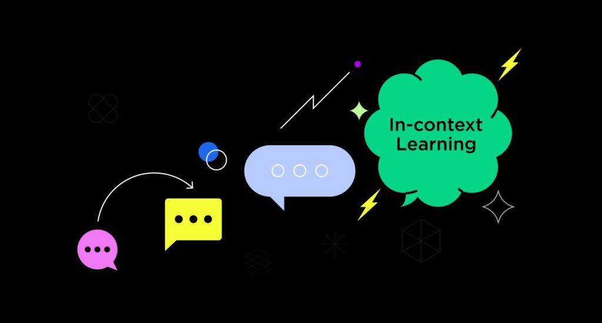
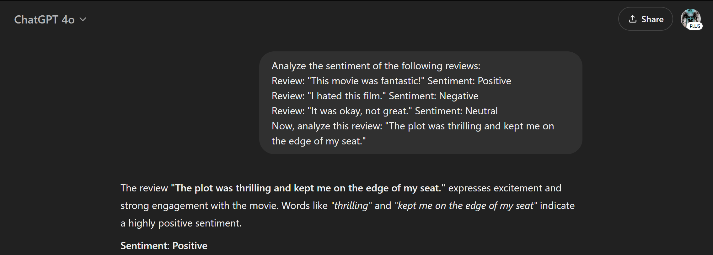
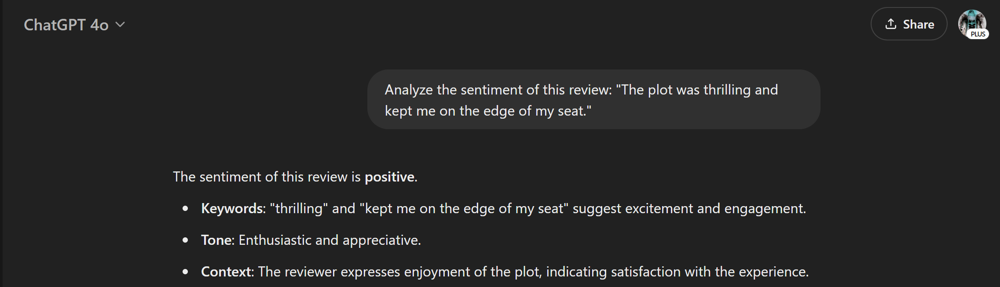
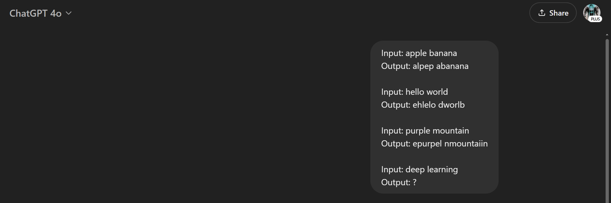
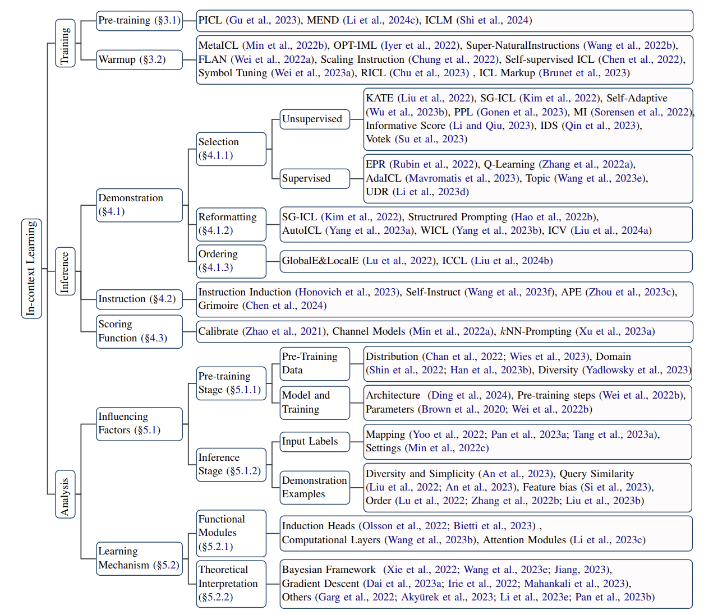

## A Comprehensive Survey

_This article explores and analyses the paper [_"A Survey on In-Context Learning"_ by Dong et al. (2024)](https://arxiv.org/pdf/2301.00234)_

_In-Context Learning Visualization. This image is sourced from [Eeswar Chamarthi](https://www.linkedin.com/pulse/in-context-learning-eeswar-chamarthi/) on \[Linkedin\]_

## Author

- Immanuel Alvaro Bhirawa **ORCID ID: 0009-0009-3354-7794**

## Introduction

In the rapidly evolving field of natural language processing (NLP), **In-Context Learning (ICL)** has emerged as a transformative capability of large language models (LLMs). The paper [_"A Survey on In-Context Learning"_ by Dong et al. (2024)](https://arxiv.org/pdf/2301.00234) offers a comprehensive exploration of this paradigm, which enables LLMs to adapt to tasks using only a few examples provided in the input prompt \[1\]. This survey is a critical resource, systematically reviewing the growing body of ICL research and providing a structured framework to understand its mechanisms, applications, and challenges. In this blog, we dive into the survey’s insights, illustrate ICL with practical examples, and highlight its significance in advancing our interaction with LLMs.

## What is In-Context Learning?

In-context learning allows LLMs to perform tasks by learning from examples embedded directly in the prompt, without requiring traditional parameter updates or fine-tuning. According to Dong et al. (2024), ICL is formally defined as _"a paradigm that allows language models to learn tasks given only a few examples in the form of demonstration"_ \[1\]. Unlike supervised learning, which relies on extensive labelled datasets and gradient-based training, ICL leverages the model’s pre-trained knowledge to interpret patterns in the provided examples and apply them to new inputs. This flexibility makes ICL a powerful tool for rapid task adaptation, especially in scenarios where training data is scarce or real-time responsiveness is needed.

**Real Examples of In-Context Learning with GPT**

To demonstrate ICL and compare it with Zero Shot learning as per Dong et. al.'s paper mentioned, let’s use a GPT model (e.g., GPT-4) for a sentiment analysis task. Below are practical examples showcasing how ICL works, its strengths, its limitations, and how it differs from Zero Shot approaches.

#### **In-Context Learning Example**

Here, we provide the model with a few labeled examples in the prompt to guide its understanding:

In-Context Learning demonstration screenshot from ChatGPT 4o, example 1 (Made

by author)

**Expected Output:** The model should infer that the sentiment is **Positive**, leveraging the pattern established by the examples (e.g., positive adjectives like "fantastic" and "thrilling" correlate with positive sentiment).

#### **Zero-Shot Learning Example**

In contrast, we ask the model directly without any examples:

Zero Shot Learning d/emonstration screenshot from ChatGPT 4o, example 1 (Made

by author)

**Expected Output:** The model still identifies the sentiment as **Positive**, relying solely on its pre-trained knowledge of language and sentiment cues.

#### **Comparison**

- **ICL Advantage:** In the ICL example, the model uses the provided demonstrations to refine its predictions, which can improve accuracy and confidence, especially for nuanced or domain-specific tasks. For instance, if the task involved movie-specific jargon, the examples could clarify the context.

- **Zero Shot Trade-off:** Zero Shot learning is faster and requires no prompt engineering, but it may falter in cases where the task is ambiguous or deviates from the model’s pre-training data. ICL’s reliance on examples makes it more adaptable when context is critical.

#### **Example Where ICL Might Fail**

ICL’s effectiveness depends on the clarity and relevance of the examples. Consider this pattern recognition task:

In-Context Learning demonstration screenshot from ChatGPT 4o, example 2 (Made

by author)

**Expected Output:** edeep glearninb

**Possible Output:** The model might incorrectly guess "deepp dkearngni" or "edep inglearn," especially if the examples don’t sufficiently clarify the rule. Ambiguous or sparse demonstrations can lead ICL astray, highlighting the importance of well-designed prompts.

**Actaul Output:** **"edep elarnniing"**

## Key Components of In-Context Learning

The survey by Dong et al. (2024) categorises ICL research into five key areas, each expanded here for deeper insight.

#### **1\. Model Training Strategies**

Training techniques enhance a model’s ICL capabilities:

- **Pre-training Approaches:** These involve structuring pre-training data to emphasise contextual reasoning. For example, aggregating related contexts (e.g., grouping similar tasks or topics) helps models learn to connect demonstrations effectively during inference.

- **Warmup Strategies:** Methods like **instruction tuning** (fine-tuning with natural language task descriptions) and **symbol tuning** (adjusting token representations) prepare models for ICL by aligning their pre-trained knowledge with prompt-based learning. These strategies reduce the gap between static pre-training and dynamic inference.

#### **2\. Demonstration Design**

The quality of examples in the prompt is pivotal:

- **Selection:** Choosing relevant examples, such as those most similar to the query (e.g., via top-k nearest neighbors), boosts ICL performance. The survey notes that methods like "topk," "votek," and "mdl" vary in effectiveness depending on the model, underscoring model-specific optimisation.

- **Reformatting:** Adjusting how examples are presented (e.g., changing input-output pair formats) can influence learning efficiency.

- **Ordering:** Sequencing examples strategically—such as starting with simpler cases—helps the model build understanding progressively.

#### **3\. Scoring Functions**

These methods evaluate how well predictions align with the task:

- **Direct Method:** Uses conditional probability (P(answer|input, demonstrations)) to rank candidate answers.

- **Perplexity (PPL):** Measures the model’s confidence in predicting the entire sequence, which is useful for open-ended tasks.

- **Channel Models:** Reverses the probability (P(input|label)), offering an alternative perspective on likelihood.

Each method balances computational cost, answer coverage, and prediction stability differently.

#### **4\. Understanding ICL Mechanisms**

The survey explores why ICL works:

- **Functional Modules:** Components like "induction heads" in Transformer attention layers enable pattern recognition across examples, acting as key drivers of ICL.

- **Theoretical Interpretations:** ICL aligns with **Bayesian inference** (updating beliefs with new evidence) and mimics **gradient descent** via attention mechanisms, suggesting that Transformers simulate optimisation during inference.

#### **5\. Beyond Text Applications**

ICL extends beyond NLP:

- **Visual ICL:** Uses techniques like masked auto-encoders for image-based tasks, learning from visual demonstrations.

- **Multi-modal ICL:** Integrates vision and language (e.g., image-caption pairs for visual question answering).

- **Speech ICL:** Applies ICL to audio tasks like speech synthesis, using sound samples as prompts.

## Challenges and Future Directions

Dong et al. (2024) highlight persistent challenges in ICL \[1\]:

- **Efficiency and Scalability:** More demonstrations increase computational demands, and LLMs’ fixed context windows limit example capacity.

- **Generalisation:** ICL performs better in high-resource settings (e.g., English) than low-resource ones (e.g., rare languages), revealing a generalisation gap.

- **Long-context ICL:** Adding more examples doesn’t always improve results and can degrade performance, necessitating smarter context management.

Future research could focus on efficient example selection, scalable architectures, and improved generalisation across diverse tasks and languages.

**Taxonomy of In-Context Learning Approaches**

_Taxonomy of in-context learning approaches. This figure is sourced from Dong et al. (2024) in "A Survey on In-Context Learning"._

## Conclusion

The survey by Dong et al. (2024) is a landmark contribution to ICL research, offering a detailed roadmap for understanding this paradigm’s current state and future potential \[1\]. By categorising approaches, providing real-world insights, and addressing challenges, it equips researchers and practitioners to push ICL forward. As LLMs evolve, ICL’s ability to learn from minimal examples remains a cornerstone of their power, making this survey an essential guide for navigating and advancing the field.

**References:**

\[1\] Dong, Q., Li, L., Dai, D., Zheng, C., Ma, J., Li, R., Xia, H., Xu, J., Wu, Z., Liu, T., Chang, B., Sun, X., Li, L., & Sui, Z. (2024). A survey on in-context learning. _arXiv_. https://doi.org/10.48550/arXiv.2301.00234
