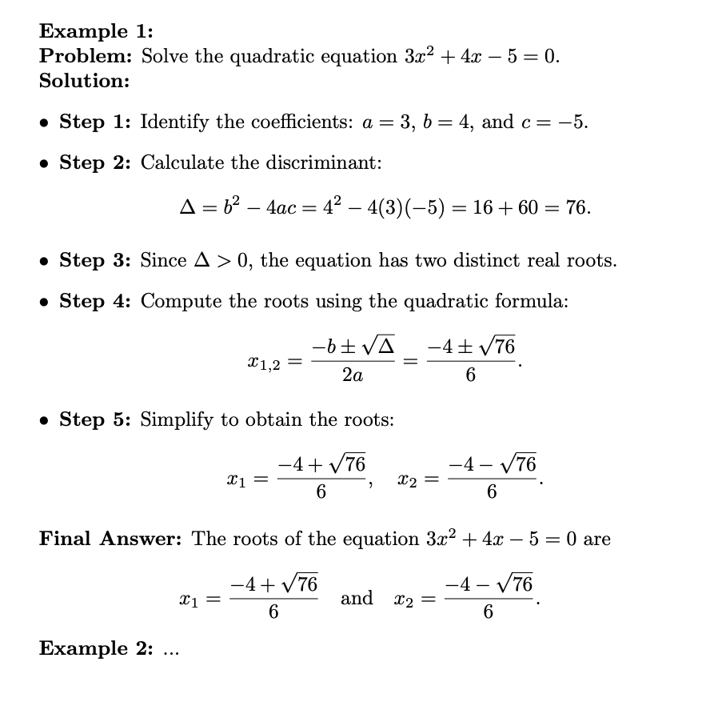
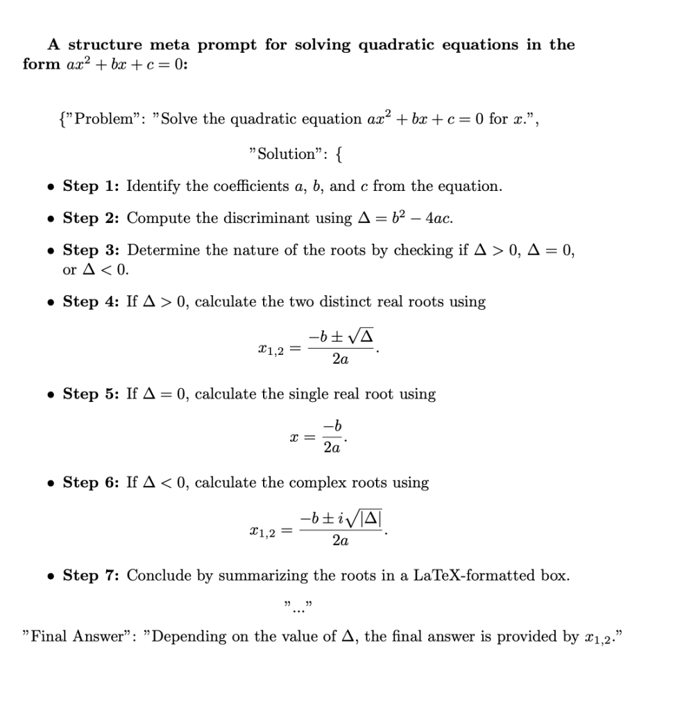
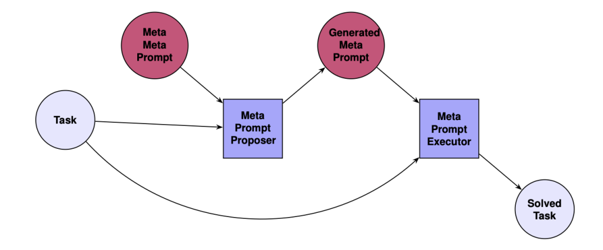

## A New Way to Teach AI How to Think, Not Just Respond

<figure>

<figcaption>

Image generated using Grok on April 10, 2025, using the prompt "Creative image of a prompt engineering concept, illustrating meta prompting with abstract visual elements"

</figcaption>

</figure>

This article is based on the paper **[Meta Prompting for AI Systems](https://arxiv.org/pdf/2311.11482)**, published by Tsinghua University and Shanghai Qi Zhi Institute.

* * *

## Introduction

The rapid advancement of Large Language Models (LLMs) has revolutionised artificial intelligence, enabling powerful text understanding and generation capabilities. However, despite their strengths, LLMs often struggle with complex reasoning tasks requiring deep abstraction. A new paradigm known as **Meta Prompting (MP)** emerges as a promising technique to enhance LLM efficiency and cognitive depth. The paper _**"Meta Prompting for AI Systems**"_ by Yifan Zhang, Yang Yuan, and Andrew Chi-Chih Yao explores this novel approach, aiming to improve LLM performance in complex problem-solving through a structured, syntax-driven methodology.

## The Fundamentals of Meta Prompting

Unlike traditional few-shot prompting that relies on content-specific examples, Meta Prompting shifts the focus to structure and syntax. Inspired by **category theory and type theory**, this approach establishes a formal relationship between tasks and prompts, enabling a systematic and flexible way to guide large language models through complex reasoning tasks.

Imagine you want a model to solve quadratic equations. Instead of showing it a few solved examples, you give it a step-by-step scaffold:

<figure>

<figcaption>

_An example of a few-shot prompt for solving quadratic equations with detailed steps(Created by author using LaTex)_

</figcaption>

</figure>

<figure>

<figcaption>

_A structured meta prompt for solving quadratic equations(Created by author using LaTex)_

</figcaption>

</figure>

This lets the model **generalise better** across similar problems—just like a human learning a formula rather than memoizing answers.

## The Benefits of Meta Prompting

The authors formalise Meta Prompting by mapping problem-solving tasks (categorized as objects in a mathematical category) to structured prompts, ensuring a coherent transformation between reasoning steps. This shift from content-oriented prompting to a **meta-structural approach** introduces three key advantages:

- **Improved Token Efficiency**: By focusing on systematic structuring rather than exhaustive example-based training, token consumption is reduced.

- **Fairer Model Comparisons**: Minimizing reliance on external examples allows for unbiased evaluation of models.

- **Enhanced Problem Decomposition**: Complex reasoning tasks are broken down into more manageable sub-problems, improving task solvability.

## Recursive Meta Prompting (RMP) and Its Impact

**Recursive Meta Prompting** is an important concept introduced in the paper, designed to allow large language models (LLMs) to improve their reasoning process autonomously by recursively generating and optimising prompts.

#### Basic Concept of Recursive Meta Prompting

In traditional prompting methods, prompts are usually static — that is, the user provides a predefined task and set of steps for the model to follow. However, **Recursive Meta Prompting** introduces a dynamic process, where the model not only performs the task but also **generates and refines** its own prompts.

#### How the Recursive Process Works

- **Initial Prompt**: First, the model receives a task and a structured initial prompt, which serves as a standard framework for solving a certain type of problem.

- **Model Execution and Feedback**: The model performs reasoning under this framework, but as it works, it **modifies and improves** its prompt structure based on the complexity of the task and the results of the reasoning.

- **Self-Improvement**: This process of modification and improvement is recursive, meaning that the model continually generates more suitable prompts based on its existing experience, until it can solve the problem more efficiently.

#### Example

Let’s say you ask the model to solve a mathematical problem, and initially, you provide it with a standard solution framework. The model may perform somewhat averagely the first time, but then it analyzes this process and generates a new prompt template to better handle similar problems. In this way, through continuous feedback and optimisation, the model's reasoning ability is enhanced.

#### Why is this Approach Important?

- **Strong Adaptability**: The model can generate adaptive prompts based on specific problems without human intervention, increasing its flexibility and adaptability.

- **Avoidance of Excessive Example Dependency**: By recursively generating new prompts, the model can more effectively solve different types of problems without relying on a large number of example inputs.

- **Enhances Autonomous Reasoning**: This method enables the model to better understand the structure of tasks and make more rational, systematic decisions when solving problems.

<figure>

<figcaption>

_Recursive Meta Prompting: A single recursion step_

</figcaption>

</figure>

## Empirical Validation: Meta Prompting in Action

The research demonstrates the efficacy of Meta Prompting through empirical experiments, particularly in mathematical problem-solving tasks. Using the Qwen-72B base model, the authors benchmark MP against conventional prompting techniques. Key findings include:

- **46.3% accuracy** on MATH problems (outperforming fine-tuned models and GPT-4's earlier versions).

- **83.5% accuracy** on GSM8K, showcasing superior reasoning without additional instruction tuning.

- **100% success rate** in solving the _Game of 24_ with GPT-4, indicating strong in-context learning capabilities.

These results underscore MP's effectiveness in enhancing structured reasoning, outperforming fine-tuned models in zero-shot settings.

## Future Directions: Expanding Meta Prompting Applications

The potential applications of Meta Prompting extend beyond mathematical reasoning to areas like:

- **Symbolic AI and theorem proving** - Improving automated reasoning in formal logic.

- **Multi-modal AI** - Adapting structured prompting for vision-language models.

- **Autonomous AI agents** - Enhancing LLM-driven agents in decision-making environments.

As LLMs continue evolving, Meta Prompting offers a promising pathway toward **greater cognitive alignment, improved interpretability, and enhanced adaptability** in AI systems.

## Conclusion

Meta Prompting is more than just a clever trick—it’s a shift in how we think about teaching AI. Instead of training it endlessly or giving it more examples, we guide it to **think structurally**.

In a world increasingly powered by large models, this kind of approach may be what takes us from good performance to truly intelligent behaviour.

> _The Medium version of this article can be found [here](https://medium.com/@researchgraph/meta-prompting-for-ai-systems-8759bc93b508)._

## Reference code：

[https://github.com/meta-prompting/meta-prompting](https://github.com/meta-prompting/meta-prompting)
