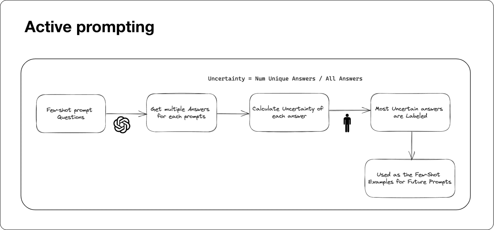
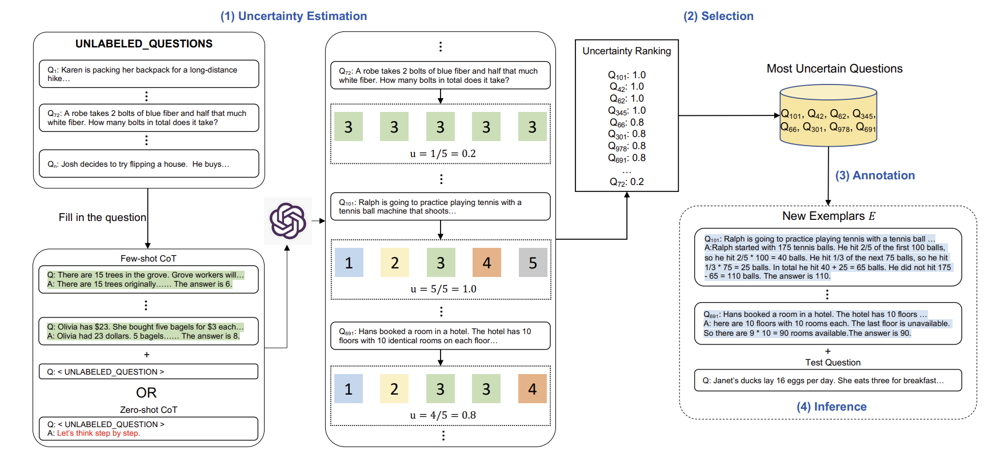
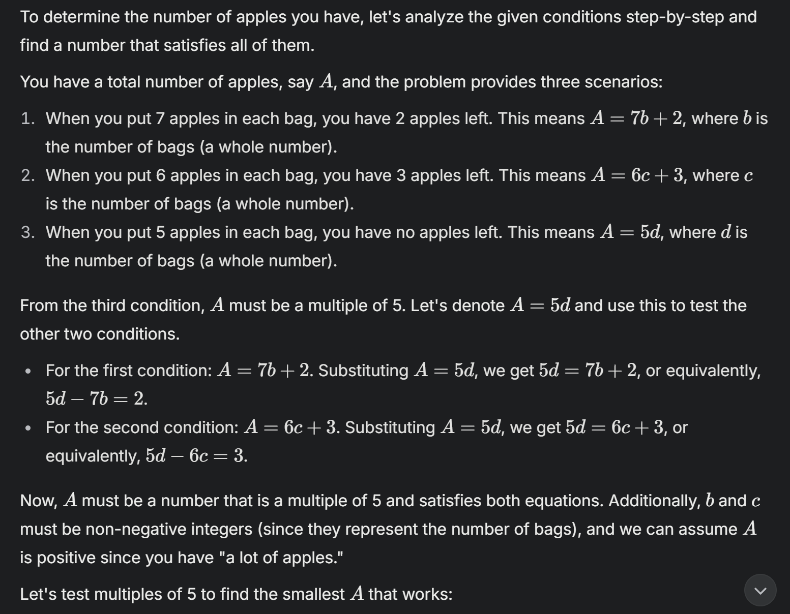
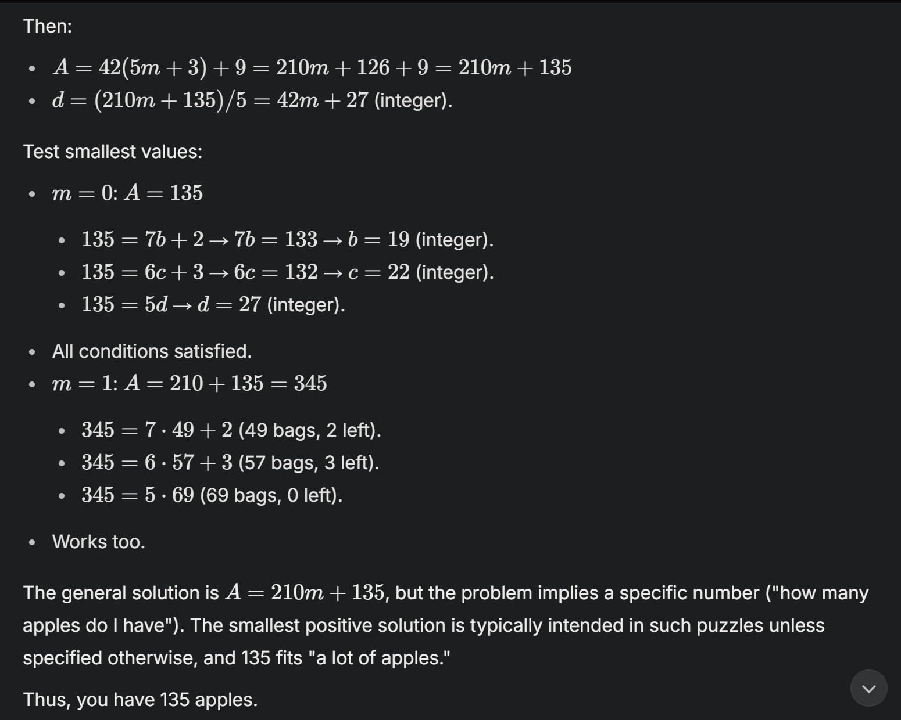
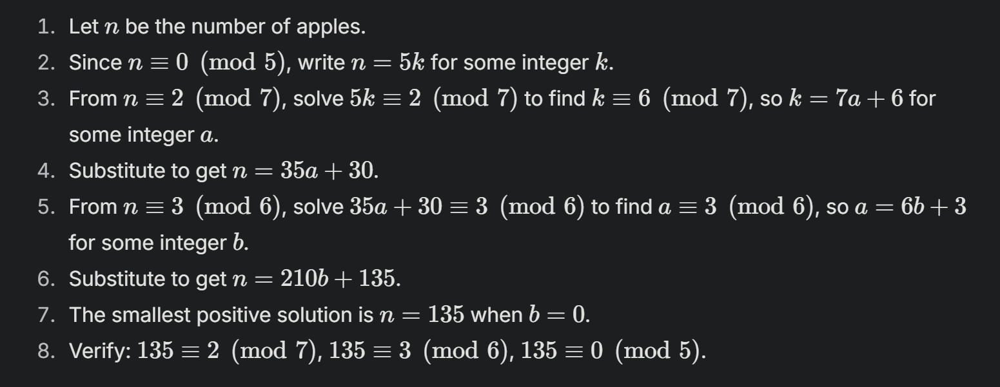
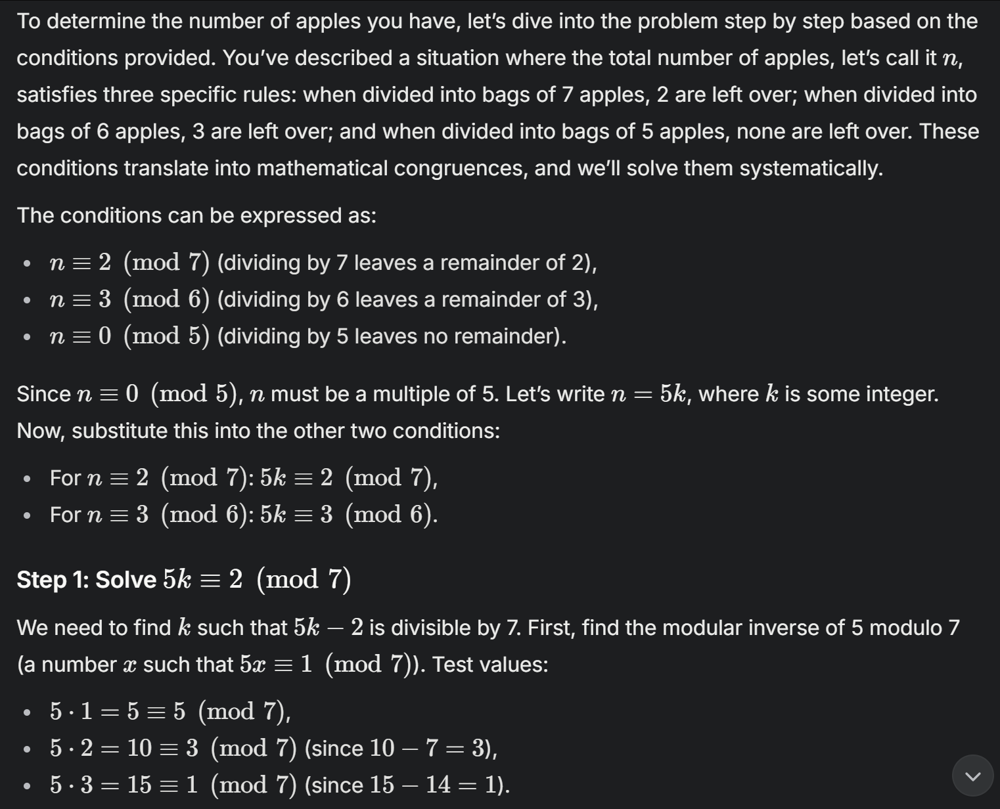
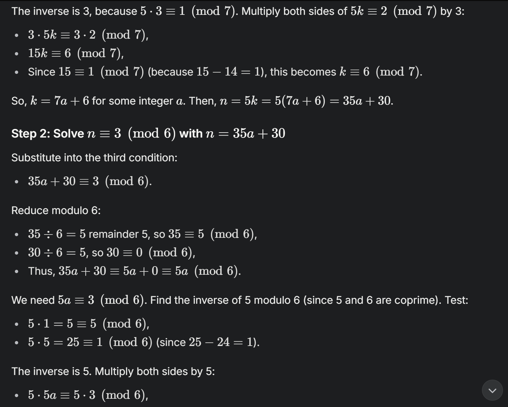
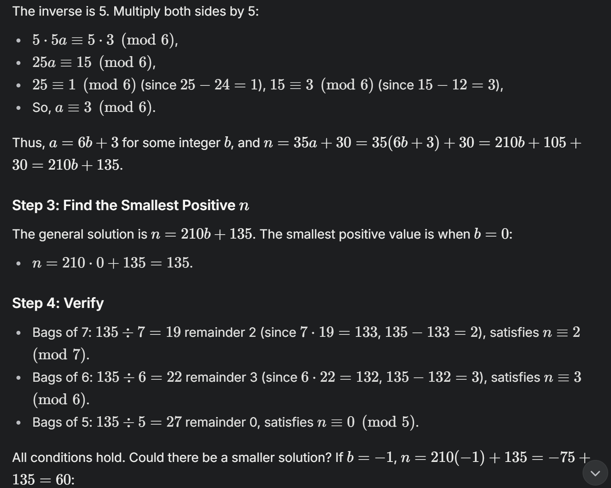
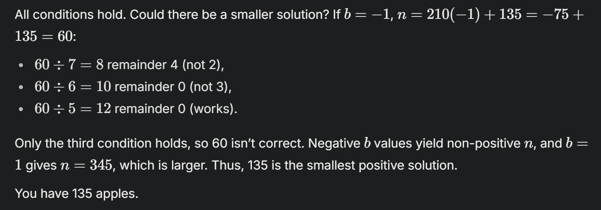

_Superwise.ai. (n.d.). Active prompting diagram \[Illustration\]. In Making sense of prompt engineering. Superwise.ai Blog. [https://superwise.ai/blog/making-sense-of-prompt-engineering/](https://superwise.ai/blog/making-sense-of-prompt-engineering/)_

## Introduction

Large language models (LLMs) like ChatGPT have transformed how we use artificial intelligence, excelling at tasks like writing essays, answering questions, and even holding conversations. But when it comes to complex reasoning—think solving math problems, tackling commonsense puzzles, or working with symbols—these models often hit a wall. To help them, researchers have developed **chain-of-thought (CoT) prompting**, a technique where models are given examples that show step-by-step reasoning. This has improved their performance, but there’s a problem: the examples are usually chosen randomly or based on guesswork. Are they really the best ones to teach the model?

Enter **Active-Prompt**, a new method introduced in a study from researchers at The Hong Kong University of Science and Technology, the University of Toronto, The University of Hong Kong, and the University of Illinois Urbana-Champaign. Published on arXiv as _"Active Prompting with Chain-of-Thought for Large Language Models"_ ([https://arxiv.org/pdf/2302.12246](https://arxiv.org/pdf/2302.12246)), this approach uses a clever trick: it figures out which questions confuse the model most and focuses human effort on annotating those. By targeting the model’s weak spots, Active-Prompt makes it smarter at reasoning—without needing mountains of examples.

In this article, we’ll break down how Active-Prompt works, look at its impressive results across different tasks, and explore what it means for the future of AI. We’ll keep it simple but dig deeper into the details, so you’ll see why this method could be a big deal for making AI not just powerful, but truly intelligent.

* * *

## Unpacking Active-Prompt: A Smarter Way to Teach AI

### The Trouble with Old-School Prompting

LLMs learn “in-context,” meaning they use a few examples (called exemplars) to figure out how to respond. For reasoning tasks, CoT prompting has been a game-changer. Instead of just giving the answer, exemplars show the model how to think through a problem step by step—like a teacher guiding a student. But here’s the catch: these exemplars are often picked without much strategy. Sometimes they work, sometimes they don’t. It’s like handing a student random homework problems and hoping they cover everything they need to learn.

The Active-Prompt team saw this flaw and asked: _What if we could pick the most helpful questions to annotate?_ Their answer is a method that uses “uncertainty”—a measure of how confused the model is—to choose questions that will teach it the most.

### How Active-Prompt Works

Active-Prompt has four straightforward steps that mix AI smarts with a little human help:

1. **Spotting Uncertainty**
    - Start with a bunch of questions related to a task—like math problems or yes/no riddles. The model answers each question multiple times (say, 10 times), showing its reasoning each time.
    
    - The researchers then measure how much the answers vary using different “uncertainty metrics”:
        - **Disagreement**: Counts how many different answers the model gives. If it says “5” five times and “6” five times, that’s high disagreement—like a friend who can’t make up their mind.
        
        - **Entropy**: Measures how unpredictable the answers are. If they’re all over the place (e.g., “5,” “10,” “50”), entropy is high. It’s like gauging how chaotic a situation is.
        
        - **Variance**: For number-based questions, this checks how spread out the answers are. If the model guesses “10” one time and “100” the next, that’s high variance and a sign of confusion.
        
        - **Self-Confidence**: The model rates how sure it is of its answer. But the study found models often act too confident even when wrong, so this metric didn’t work as well.
    
    - Questions where the model’s answers flip-flop a lot are labeled “high uncertainty” and flagged for attention.

3. **Picking the Tough Ones**
    - From all the questions, the top _n_ most uncertain ones (e.g., 8 for math tasks) are chosen. These are the trickiest for the model, so they’re the most valuable to fix.

5. **Adding Human Wisdom**
    - Humans step in to write clear, step-by-step explanations and correct answers for these questions, creating top-notch exemplars.

7. **Using the Lessons**
    - The model uses these exemplars to tackle new questions, often paired with a trick called “self-consistency” (generating multiple answers and picking the most common one) to get even better results.

_Active-Prompt Approach Illustration \[Digital image\]. From Figure 1 in "Active Prompting with Chain-of-Thought for Large Language Models" by Diao et al. (2023) \[[https://arxiv.org/pdf/2302.12246](https://arxiv.org/pdf/2302.12246)\]._

This process is laid out in the paper’s Figure 1 above, showing how uncertainty drives everything. Unlike random guessing, Active-Prompt zeroes in on the model’s blind spots, making it a smarter way to teach.

### A Real-World Example

Let’s see it in action with a math problem using **Grok xAI**: _“I have a lot of apples. If I can put seven apples in each bag, I will have two apples left. If I put six apples in each bag, I will have three apples left. If I put five apples in each bag, I will have no apples left. How many apples do I have?”_

Without help, although Grok was managed to guess the answer correctly, it went on a "trying to figure it out" phase going through an extensive reasoning to get the answer, as shown below.

* * *

_Demonstration, without using Active Prompting. using Grok xAI (Made_ by Author)

There's 5 more images of the processes that was taken by grok, so for brevity, will skip to the end.

...

...

...

_Demonstration, without using Active Prompting using Grok xAI (Made by Author)_

* * *

**Analysis of the uncertainty error the result above has:**

The uncertainty in the prompt result is characterized as **disagreement** or **entropy**, stemming from the model's systematic trial-and-error process. It evaluates multiple potential solutions—such as testing different multiples of 5—to determine the correct answer, like the number of apples. This exploration of various options reflects **disagreement**, as different possibilities are weighed, while the unpredictability of the steps introduces **entropy**. Though structured and methodical, not random, this approach underscores the dual nature of the uncertainty.

**Active-Prompt** notices this confusion (high disagreement or entropy), flags the question, and a human annotates it as such:

_Active prompt that is used using Grok xAI (Made by Author)_

And the result of this addition of active prompt is as such:

_Active prompting result #1 using Grok xAI (Made by Author)_

_Active prompting result #2 using Grok xAI (Made by Author)_

_Active prompting result #3 using Grok xAI (Made by Author)_

_Active prompting result #4 using Grok xAI (Made by Author)_

**Result comparison between the examples of with and without using Active prompting:**

Active Prompting with Chain-of-Thought (CoT) enhances the performance of large language models (LLMs) like the one solving the apple problem by strategically selecting and annotating task-specific exemplars, improving reasoning over the original prompt. In the original CoT approach (without Active Prompting), the solution relies on a trial-and-error method with fixed human-annotated examples, systematically testing multiples (e.g., A=5,10,15,… A = 5, 10, 15, \\ldots A=5,10,15,…) and eventually using modular arithmetic to deduce A=135, but it lacks optimization in exemplar choice, leading to a less efficient process. Active Prompting, however, introduces an uncertainty-based selection strategy (e.g., disagreement or entropy metrics) to identify the most informative questions from a pool, annotating only the most uncertain ones with human-designed CoT reasoning. This refines the model's ability to generalize and reason, as evidenced in the thinking trace, where a more structured use of the Chinese Remainder Theorem (CRT) efficiently confirms N=135 (modulo 210), aligning with the Diao et. al.'s findings of superior performance. By focusing on high-uncertainty cases, Active Prompting reduces human effort and boosts accuracy, making the solution both faster and more reliable compared to the original’s broader, less targeted approach.

* * *

## The Results: Active-Prompt Delivers

The researchers tested Active-Prompt on eight datasets across three types of reasoning: arithmetic (e.g., GSM8K for math, AQuA for algebra), commonsense (e.g., CommonsenseQA, StrategyQA for yes/no questions), and symbolic (e.g., combining last letters of words). They compared it to other methods like standard CoT, self-consistency, Auto-CoT (automated exemplars), and Random-CoT (randomly picked questions).

### What They Found

- **Big Wins**
    - With the code-davinci-002 model, Active-Prompt scored an average accuracy of **81.6%** using entropy, beating self-consistency’s **79.4%** by **1.8%**. With text-davinci-002, it jumped to **74.9%**—a **7.0%** edge over 67.9%.
    
    - On GSM8K (grade-school math), it hit **83.4%** accuracy, topping self-consistency’s 78.0% by **4.2%**. For a problem like “A store has 15 apples and sells 3 per day. How many days until they’re gone?” Active-Prompt picks questions where the model stumbles on division, ensuring it learns the right steps (15 ÷ 3 = 5 days).

- **Best Metrics**
    - Disagreement and entropy worked best across tasks. Variance was great for math but less so elsewhere, and self-confidence flopped because models often bluff.

- **No Examples? No Problem**
    - Even starting with zero examples (using a prompt like “Let’s think step by step”), Active-Prompt scored **82.2%** on GSM8K—almost as good as with exemplars, showing its flexibility.

- **Sharing the Love**
    - Exemplars from GSM8K helped on related datasets like ASDiv and SVAMP (more math problems), proving the method teaches general reasoning tricks, not just specific answers.

- **Commonsense Boost**
    - On StrategyQA (e.g., “Can a penguin live in a desert?”), Active-Prompt picked questions where the model was unsure about facts (like penguin habitats), improving its ability to reason implicitly.

The paper by Diao et. al. lays out these wins, showing Active-Prompt consistently outshining rivals. Extra tests—like changing the number of questions or using different annotators—confirmed the method’s strength comes from smart selection.

* * *

## Why It’s a Big Deal

Active-Prompt isn’t just about better scores—it’s about making AI work smarter. Here’s why it matters:

- **Saves Time**: By focusing on a few key questions, it cuts down on the work needed to train the model.

- **Works Anywhere**: Its success with no starting examples and across tasks makes it handy for all sorts of uses—like AI tutors explaining algebra or chatbots untangling tricky customer questions.

- **Teaches Us Something**: The link between uncertainty and mistakes (see Appendix Figure 3) shows that fixing confusion is the key to better reasoning—a clue for future AI upgrades.

Imagine an AI tutor using Active-Prompt to spot where a student (or the model itself) gets lost in math, then giving just the right examples to clear things up. Or a customer service bot that learns to handle weird, complex queries by focusing on its toughest cases.

* * *

## The Catch: Limits and Next Steps

Active-Prompt isn’t perfect yet:

- **Human Help**: It needs people to write those exemplars, which takes time and money. The team suggests trying automated answers (like zero-shot CoT) to lighten the load.

- **Model Limits**: Tests focused on big models like code-davinci-002. It worked on Llama-2 too, but we don’t know how it fares with smaller or newer models.

- **Task Range**: It’s great for reasoning, but what about writing stories or coding? That’s uncharted territory.

Even with these hurdles, Active-Prompt points to a future where AI learns more like we do—by tackling its weaknesses head-on.

* * *

## Conclusion

Active-Prompt is a fresh take on making LLMs better at reasoning. By using uncertainty to pick the right questions, it beats out older methods and delivers results across math, commonsense, and symbol tasks. It’s a step toward AI that’s not just bigger, but smarter—showing us that sometimes, the best way to teach is to focus on what’s hardest.

* * *

> _The Medium version of this article cam be found [here](https://medium.com/@researchgraph/active-prompting-with-chain-of-thought-3656078e4a74)._

## References

- Diao, S., et al. (2023). _Active Prompting with Chain-of-Thought for Large Language Models_. arXiv:2302.12246.

- Wei, J., et al. (2022). _Chain-of-Thought Prompting Elicits Reasoning in Large Language Models_. arXiv:2201.11903.

- Wang, X., et al. (2022). _Self-Consistency Improves Chain of Thought Reasoning_. arXiv:2203.11171.
