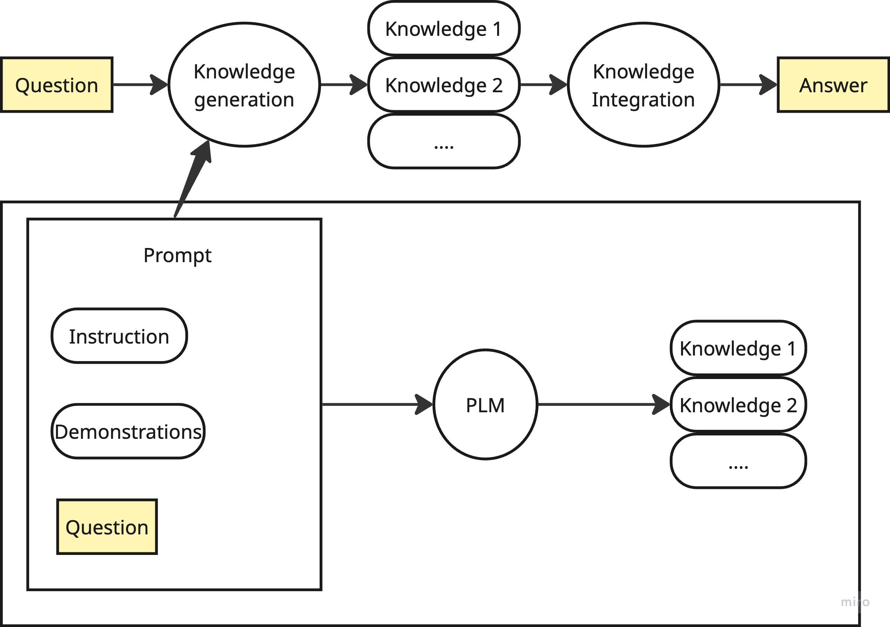
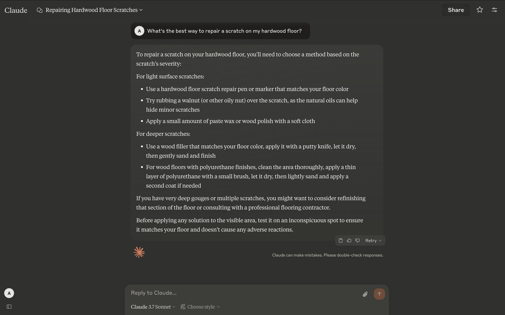
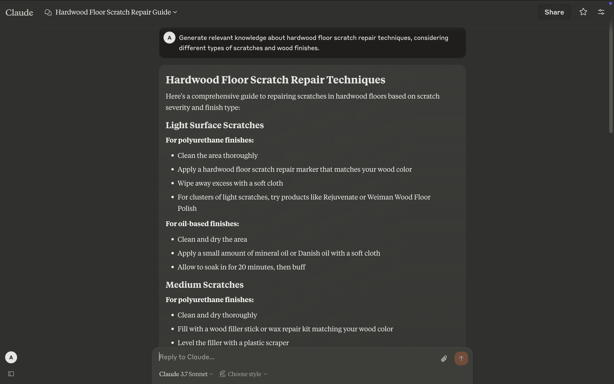
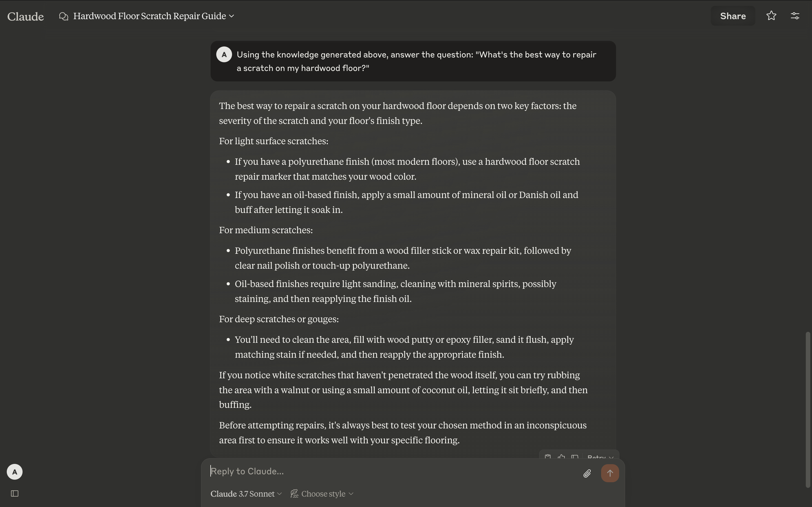

_Created using Gemini 2.5 Pro on 17 April 202_5 for the Prompt "Generated Knowledge Prompting: Enhancing LLM Responses with Self-Generated Context"

## Introduction

Generated Knowledge Prompting is a prompt engineering technique designed to enhance the performance of large language models (LLMs) by leveraging their ability to generate relevant knowledge dynamically. By first generating useful knowledge related to the task, the model can better understand the context and provide more accurate, adaptable, and contextually rich answers. This blog post provides a detailed analysis of the concept, its working, benefits and experimental insights from the paper [Generated Knowledge Prompting for Commonsense Reasoning](https://arxiv.org/pdf/2110.08387).

Generated Knowledge Prompting was first documented in the above mentioned paper, published in 2022 and is particularly effective for tasks requiring deep contextual understanding, or answering complex queries. It involves prompting the LLM to generate knowledge relevant to the task before incorporating that knowledge into the final prompt alongside the original question or task description. This approach leverages the LLM’s extensive knowledge base, trained on virtually all text available on the internet, to retrieve and generate specific information, reducing the risk of misinterpretation due to poorly worded prompts.

## Mechanics and Process

The process begins with prompting the LLM to generate knowledge related to the task. This is typically achieved by providing instructions and a few demonstrations (examples) of how to generate such knowledge for similar questions. The demonstrations can be human-written or generated by an LLM, but they need verification to ensure accuracy. For instance, the model might be shown how to generate knowledge via few-shot prompting, where it is given example inputs and their corresponding knowledge, then prompted to generate new knowledge for a given question.

Fig. 1 Knowledge generated in prompt 1, and included as context in prompt 2

Figure above illustrates this process, showing how a question leads to knowledge generation, which is then integrated to produce an answer. The bottom part of the flowchart highlights how the prompt, including instructions and fixed demonstrations, along with the question, is fed into a pre-trained language model (PLM) to generate knowledge by sampling, producing multiple knowledge pieces (e.g., Knowledge 1, Knowledge 2, etc.). These pieces are then integrated through a "Knowledge Integration" step to produce the final answer.

Table below provides examples of prompts used for two tasks: Numerical Common sense (NumberSense) and scientific common sense (QASC). For NumberSense, the prompt asks to generate numerical facts about objects, with examples like "penguins have wings" and the knowledge "Birds have two wings. Penguin is a kind of bird." For QASC, it involves generating knowledge about the input question, such as "What type of water formation is formed by clouds?" with knowledge "Clouds are made of water vapor." These examples demonstrate how the model is directed to generate task-specific knowledge.

| **Task** | **NumberSense** | **QASC** |
| --- | --- | --- |
| Prompt | Generate some numerical facts about objects. Examples:   Input: **penguins have <mask> wings.**   Knowledge: Birds have two wings. Penguin is a kind of bird.      ….      Input: **a typical human being has <mask> limbs**.   Knowledge: Human has two arms and two legs.      Input: **{question}**Knowledge: (blank)    | Generate some knowledge about the input. Examples:   Input: **What type of water formation is formed by clouds?**   Knowledge: Clouds are made of water vapor.      ….      Input: **The process by which genes are passed is**   Knowledge: Genes are passed from parent to offspring.      Input: **{question}**   Knowledge: (blank) |

## Implementation Examples

**Customer Query:** "What's the best way to repair a scratch on my hardwood floor?"

**Traditional Approach:**

User: What's the best way to repair a scratch on my hardwood floor?

Here's a traditional approach to answering this query:

Fig. 2: Response for user query using traditional approach

### **Generated Knowledge Approach:**

Step 1: Generate Knowledge

Prompt: Generate relevant knowledge about hardwood floor scratch repair techniques, considering different types of scratches and wood finishes.

Fig. 3: Generating Knowledge

Step 2: Answer with Context

Prompt: Using the knowledge generated above, answer the question: "What's the best way to repair a scratch on my hardwood floor?"

Fig. 4: Response using Generated knowledge

## Benefits and Advantages

Generated Knowledge Prompting offers several benefits, as highlighted in the provided information (PromptHub, n.d.):

- **Higher Accuracy**: The additional context helps the model provide more precise and relevant answers, reducing errors due to misinterpretation.

- **Adaptability**: It enables models to adapt to new information quickly without needing extensive retraining or fine-tuning, as the knowledge is generated on the fly based on the prompt.

- **Depth of Understanding**: With proper guardrails, models can explore topics in greater depth, leading to more comprehensive responses, especially for complex tasks.

These benefits make it particularly useful for applications requiring deep contextual understanding, such as technical support, legal analysis, or scientific research, where accuracy and depth are crucial.

## **Experimental Results and Comparisons**

The experimental results, although quite old, compare Generated Knowledge Prompting against several baselines across various datasets, including Numerical Common sense (NumberSense), General Common sense (CSQA), Common senseQA 2.0 (CSQA2), and scientific common sense (QASC). The baselines include:

- **No Knowledge (Ø)**: The vanilla baseline, with no additional techniques.

- **Random Sentences (R)**: Sampling random sentences from the LLM without tailoring to the question.

- **Context Sentences (C)**: Generating sentences that logically follow the question’s content.

- **Template-generated Knowledge (T)**: Using manually-designed templates to extract knowledge statements.

- **Retrieval-based Knowledge (IR)**: Retrieving knowledge from external sources like Wikipedia or Google.

- **Answers (A)**: Directly prompting the model to generate answers instead of generating knowledge, using single or multiple answers for comparison.

The results, summarized in the following table, show the performance across different datasets and models:

| **Method** | **NumberSense (T5****\-11b dev)** | **CSQA (T5****\-11b dev)** | **CSQA2 unicorn****\-ft dev)** | **QASC (TS-11b dev)** | **QASC (UQA-11b-ft dev)** |
| --- | --- | --- | --- | --- | --- |
| Vanilla baseline (∅) | 67.5 | 39.89 | 69.9 | 48.16 | 81.75 |
| Random sentences (R) | 68.5 | 21.79 | 70.37 | 49.35 | 82.18 |
| Context sentences (C) | 70.5 | 42.51 | 70.92 | 55.83 | 82.61 |
| Template-based (T) | \- | 45.37 | \- | \- | \- |
| Retrieval-based (IR) | \- | \- | 74.0 | 76.89 | 90.06 |
| Answers (A) | 73.0 | 51.84 | 69.22 | 52.48 | 81.53 |
| GKP (K) | 78.0 | 47.26 | 72.37 | 58.32 | 84.02 |
| Few shot GPT-3 | 60.5 | \- | 53.80 | \- | 66.09 |

**Key Takeaways from Experiments**:

- In zero-shot settings, Generated Knowledge Prompting (K) shows solid improvements of 7% to 10% across NumerSense, CSQA, and QASC.

- It outperforms few-shot prompting, with improvements of 14% to 20% across commonsense reasoning tasks, as seen in higher scores compared to the Answers (A) baseline.

- Compared to retrieval-based knowledge (IR), it shows better performance in most cases, with improvements of up to ~9%, except on QASC, where IR outperforms with 76.89 on TS-11b dev and 90.06 on UQA-11b-ft dev, due to highly relevant knowledge from a gold-standard knowledge base specifically designed for the dataset.

- The quantity of knowledge statements affects performance, with a bar chart shown below indicating that performance generally increases with more knowledge, but the majority of gains come from including any knowledge statements, similar to the effect of increasing examples in few-shot prompting. The performance starts decreasing with more than 20 knowledge statements, potentially due to added noise.

Fig. 5: AI model response performance with respect to Knowledge quantity

These results, while based on experiments using GPT-3 (the top OpenAI model at the time of the study), provide insights into the method’s effectiveness, though they may be slightly outdated given advancements in newer models.

## Conclusion

Generated Knowledge Prompting is a powerful technique that enhances LLMs by utilizing their ability to generate relevant knowledge dynamically. This approach not only improves accuracy and adaptability but also enables deeper contextual understanding, making it a valuable tool in prompt engineering for a wide range of applications. The experimental results confirm its superiority over many baselines, with notable exceptions where retrieval-based methods excel due to highly relevant knowledge bases.

> _For the Medium version of this article, please click this [link](https://medium.com/@researchgraph/generated-knowledge-prompting-44f53bf54fcd)._

## References:

Liu, J., Liu, A., Lu, X., Welleck, S., West, P., Le Bras, R., Choi, Y., & Hajishirzi, H. (2021). Generated Knowledge Prompting for Commonsense Reasoning. ​

PromptHub. (2025). Generated Knowledge Prompting.
