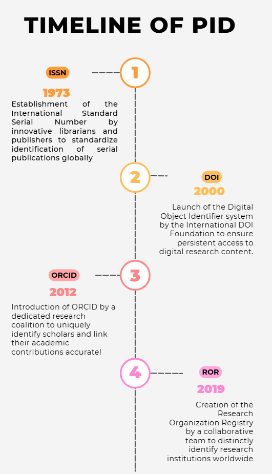
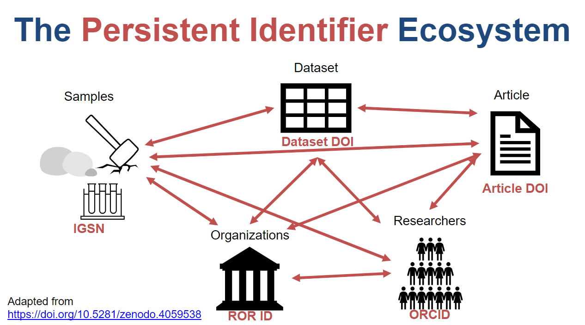

_**Museum Front-Face Visualization.** This image is sourced from ChatGPT's DALL·E image generation._

## Introduction

Imagine a world where every piece of research—every article, dataset, researcher, and institution—is seamlessly connected, no matter where it resides or how the digital landscape shifts. This isn’t a distant dream; it’s the reality being forged by persistent identifiers (PIDs). These unassuming strings of characters are revolutionizing how we create, share, and build upon knowledge. Drawing from Digital Science’s insightful exploration of PIDs, this blog traces their journey from a modest beginning in 1973 to their pivotal role in today’s scholarly ecosystem. Let’s dive into how PIDs bridge gaps, foster collaboration, and transform research—and why they matter to you.

* * *

## A Brief History of PIDs: From 1973 to the Digital Age

The story of persistent identifiers begins in 1973, when the National Library of Medicine (NLM) introduced a citation identifier linked to the newly established ISSN (International Standard Serial Number). This wasn’t just about tagging journals; it was a pioneering effort to connect citations across databases and time. Though the NLM’s specific identifier faded by 1979, its legacy endured in tools like PubMed IDs, which remain essential for navigating medical literature today.

The real game-changer came with the internet’s rise. By 1995, as the World Wide Web opened to the public, digital content faced a new challenge: staying findable amidst shifting URLs. Enter the Digital Object Identifier (DOI), launched in 2000 by the International DOI Foundation (IDF) and championed by registration agencies like Crossref. Unlike earlier identifiers, DOIs didn’t just label content—they bundled it with metadata (often in standards like JATS-XML) and provided a permanent link, ensuring articles remained accessible even as websites evolved.

__Timeline of PID_ \[Digital image\]. Created using Canva (Made by Author). \[[https://www.canva.com/design/DAGh4DXbreM/3Fp5lBFwDyTx1zlaabpeoQ/edit](https://www.canva.com/design/DAGh4DXbreM/3Fp5lBFwDyTx1zlaabpeoQ/edit)_\]

This evolution from print-based identifiers to digital connectors set the stage for a broader PID ecosystem, linking not just publications but people and places too.

* * *

## Key Players in the PID Landscape

Today, PIDs form a network of identifiers, systems, and standards that work together to make research more discoverable and interconnected. Here’s a closer look at the major players and how they fit into this ecosystem.

### DOIs: Linking Publications Reliably

Managed by agencies like Crossref and DataCite, DOIs assign unique identifiers to digital objects—articles, datasets, even software. A DOI (e.g., 10.1000/xyz123) ensures that a publication remains findable, even if its hosting platform changes. Beyond linking, DOIs encapsulate rich metadata, adhering to standards that make content machine-readable and interoperable. For instance, a researcher in Berlin can cite a DOI-linked paper from a journal in Tokyo, confident it will lead others to the same source.

### ORCIDs: Identifying Researchers Uniquely

Launched in 2012, ORCID (Open Researcher and Contributor ID) gives researchers a unique identifier (e.g., 0000-0001-2345-6789). This solves the problem of name ambiguity—think of all the “John Smiths” in academia. By linking a researcher’s publications, grants, and affiliations, ORCID creates a persistent thread of their scholarly identity. It’s a personal PID that integrates with systems like publisher workflows and institutional repositories.

### ROR IDs: Connecting Institutions Globally

The Research Organization Registry (ROR) emerged to tackle institutional disambiguation. ROR IDs (e.g., 01rv9gx93) identify organizations like universities or labs, using algorithmic matching to connect them to their outputs. While not always 100% certain, this system enables cross-platform analysis—imagine tracking a university’s research impact without relying on a single database. ROR complements DOIs and ORCIDs by anchoring the “where” of research.

### Emerging PIDs: RAiD and Beyond

Newer players like RAiD (Research Activity Identifier) push boundaries further. Developed in Australia, RAiD tracks entire research projects—participants, outputs, and activities—in real time. Unlike static DOIs, RAiD offers a dynamic record of the research process. While still maturing (not yet globally adopted as of 2023), it hints at a future where PIDs capture the journey, not just the destination.

_**PID Ecosystem Visualization.** This image is sourced from the United States Geological Survey (USGS) at [https://www.usgs.gov/media/images/pid-ecosystem](https://www.usgs.gov/media/images/pid-ecosystem)._

These PIDs don’t exist in isolation. They rely on systems (e.g., Crossref’s registration infrastructure) and standards (e.g., metadata schemas) to function cohesively, creating a web of trust and interoperability.

* * *

## Transformation in Action: How PIDs Are Changing Research

So, how do these identifiers transform the scholarly landscape? First, they unify a once-fragmented field. A DOI links a paper to its authors (via ORCID) and their institutions (via ROR), making collaboration effortless across borders. Consider a global team studying climate change: PIDs ensure their shared dataset, published findings, and contributor credits remain connected and citable.

PIDs also power open science. DOIs facilitate open-access publishing by making content universally accessible, while ORCIDs help researchers showcase their work transparently. Practically, this means a student in Nairobi can access a DOI-linked study, trace its authors via ORCID, and contact their ROR-identified institution—all with a few clicks.

For researchers, PIDs are tools of efficiency. Registering an ORCID takes minutes (visit orcid.org) and streamlines grant applications, while citing a DOI ensures precision in bibliographies. Institutions benefit too—ROR IDs help funding agencies track outputs consistently.

* * *

## The Road Ahead: Future Possibilities and Challenges

The PID story is far from over. Future innovations might integrate PIDs with technologies like blockchain for enhanced security or create a universal identifier spanning all research entities. Yet challenges remain: ensuring global adoption (especially in under-resourced regions), managing the proliferation of PID types, and maintaining system reliability.

What’s clear is that PIDs are more than technical tools—they’re enablers of a connected, collaborative research future. Whether you’re a researcher, librarian, or student, engaging with PIDs (e.g., claiming your ORCID or citing DOIs) plugs you into this evolving network.

**Reference**s

Digital Science. (n.d.). _Exploring research transformation through the lens of persistent identifiers_. TL;DR. [https://www.digital-science.com/tldr/article/exploring-research-transformation-through-the-lens-of-persistent-identifiers/](https://www.digital-science.com/tldr/article/exploring-research-transformation-through-the-lens-of-persistent-identifiers/)
