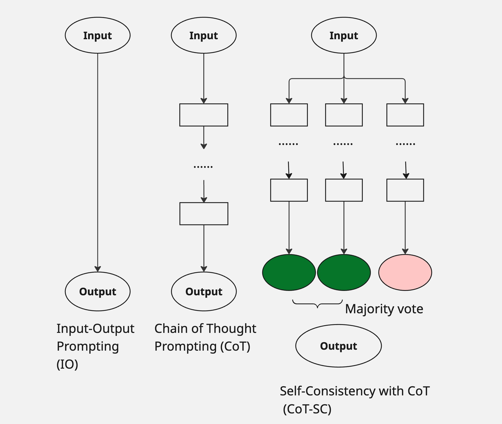
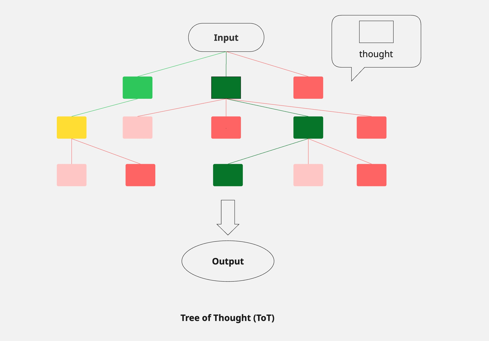

## System 1 vs. System 2: Bringing Deliberate Thinking to AI

<figure>


<figcaption>

Figure 1: Gemini 2.5 Pro 17-04-2025 - A visually striking image representing the 'Tree of Thought'

</figcaption>

</figure>

**Author's Note:** This article summarizes research from "[Tree of Thoughts: Deliberate Problem Solving with Large Language Models](https://proceedings.neurips.cc/paper_files/paper/2023/file/271db9922b8d1f4dd7aaef84ed5ac703-Paper-Conference.pdf)" by Shunyu Yao, Dian Yu, Jeffrey Zhao, Izhak Shafran, Thomas L. Griffiths, Yuan Cao, and Karthik Narasimhan from Princeton University and Google DeepMind. The original paper was presented at the 37th Conference on Neural Information Processing Systems (NeurIPS 2023).

## Introduction

Large language models like GPT-4 have become remarkably capable at solving a wide range of problems, but they still face a fundamental limitation: they generate text token by token, making decisions linearly without the ability to explore multiple paths or backtrack when needed. This is similar to how humans sometimes need to think deeply about problems, explore different options, and occasionally reconsider our approach when we hit a dead end.

A team of researchers from Princeton University and Google DeepMind has proposed a fascinating solution to this constraint called "Tree of Thoughts" (ToT). This approach allows language models to explore multiple reasoning paths simultaneously, evaluate different options, and even backtrack when necessary – much like how humans solve complex problems requiring deliberate thought.

In this article, we'll explore:

- How Tree of Thoughts builds upon and extends existing prompting techniques

- The technical framework that makes this possible

- Real-world examples showing significant performance improvements

- Practical considerations for when and how to use ToT

Whether you're a developer, researcher, or just curious about the evolving capabilities of AI, understanding Tree of Thoughts offers valuable insights into making language models more effective problem solvers.

## From Chain-of-Thought to Tree-of-Thought

To understand why Tree of Thoughts represents an important advancement, let's first review how we currently prompt LLMs to solve problems:

<figure>



<figcaption>

Figure 2: Schematic illustrating various approaches to problem solving with LLMs. Each rectangle box represents a _thought_, which is a coherent language sequence that serves as an intermediate step toward problem solving. Adapted by author from Yao et al., (2023).

</figcaption>

</figure>

**Standard Input-Output Prompting**

The most basic approach is simply asking a language model to solve a problem directly:

```
Human: Use four numbers (4, 9, 10, 13) and basic operations to reach exactly 24.

AI: (13-9)*(10-4) = 4*6 = 24
```

This works for simple problems, but fails when complex reasoning is required, as the model must generate the entire solution in a single pass without exploring alternatives.

**Chain-of-Thought Prompting**

Chain-of-Thought (CoT) prompting, introduced in 2022, improved this by asking models to show their work:

```
Human: Use four numbers (4, 9, 10, 13) and basic operations to reach exactly 24.

AI: Let me solve this step by step:

1. First, I can calculate 13-9 = 4

2. Next, 10-4 = 6

3. Finally, 4*6 = 24

Therefore, (13-9)*(10-4) = 24
```

This approach dramatically improved performance on reasoning tasks by giving the model space to work through intermediate steps. However, it still operates linearly – the model commits to each step without considering alternatives or backtracking when stuck.

**Self-Consistency with CoT**

An extension of CoT is to sample multiple thought chains and take the most frequent answer. This adds diversity but still lacks deliberate exploration and evaluation of promising paths.

## **Tree of Thoughts: A New Paradigm**

Tree of Thoughts expands these approaches by structuring problem-solving as an explicit search over a tree:

<figure>



<figcaption>

Figure 3: Schematic illustrating Tree of Thought prompting. Each rectangle box represents a _thought_, which is a coherent language sequence that serves as an intermediate step toward problem solving. Adapted by author from Yao et al., (2023).

</figcaption>

</figure>

Tree of Thoughts takes problem-solving to a new level by enabling language models to:

1. **Generate multiple possible next steps** at each point in the reasoning process

3. **Evaluate how promising each option is** using the language model itself

5. **Choose which paths to explore further** based on those evaluations

7. **Backtrack and try different paths** when a particular approach isn't working

This approach mirrors how humans solve complex problems—we consider options, evaluate progress, change course when needed, and sometimes return to earlier decision points to try different approaches.

The paper's authors draw inspiration from human cognition research, particularly the distinction between "System 1" (fast, automatic) and "System 2" (slow, deliberate) thinking. Standard LLM generation resembles System 1, while ToT implements a System 2-like process of exploring a combinatorial problem space.

## How Tree of Thoughts Works

<figure>


<figcaption>

Figure 4: Demonstration of how Tree of Thought works

</figcaption>

</figure>

**1\. Thought Decomposition**

First, we need to decide how to break down the reasoning process into meaningful "thoughts." Unlike CoT, which doesn't explicitly define the granularity of thoughts, ToT carefully chooses appropriate units for each problem:

- For **Game of 24**, a thought is a single equation step (e.g., "13-9=4")

- For **Creative Writing**, a thought might be a paragraph-length writing plan

- For **Mini Crosswords**, a thought could be filling in a specific word

The key is finding the right size – thoughts should be small enough that the model can generate diverse, high-quality candidates, but large enough that the model can meaningfully evaluate their progress toward solving the problem.

**2\. Thought Generation**

For each state in the reasoning process, ToT generates multiple candidate next thoughts. This can happen in two ways:

```
# Sample independent thoughts

thoughts = [model.generate(prompt + previous_thoughts) for _ in range(k)]

# Or propose multiple thoughts at once

thoughts = model.generate(prompt + previous_thoughts + "List k different approaches:")
```

This creates branches in our reasoning tree, allowing exploration of different approaches simultaneously.

**3\. State Evaluation**

This is perhaps the most innovative aspect of ToT. Instead of requiring pre-programmed heuristics to evaluate progress, ToT uses the language model itself to assess which paths are promising:

```
# Value-based evaluation

def evaluate_state(state):

    evaluation_prompt = f"Evaluate if this approach can solve the problem: {state}"

    assessment = model.generate(evaluation_prompt)

    return convert_to_score(assessment)  # e.g., "Very promising" → 0.9

# Voting-based evaluation

def vote_best_state(states):

    comparison_prompt = f"Compare these approaches and select the most promising: {states}"

    selection = model.generate(comparison_prompt)

    return extract_selected_state(selection)
```

This allows the model to deliberate about its own reasoning process, asking questions like "Can these numbers reach 24?" or "Is this writing plan coherent?"

For Game of 24, the evaluator might determine:

```
"13-9=4 (left: 4, 4, 10)" → "Sure, we can reach 24 with 4, 4, 10"
"10-4=6 (left: 6, 9, 13)" → "Sure, we can reach 24 with 6, 9, 13"
"4+9=13 (left: 10, 13, 13)" → "Impossible to reach 24 with these numbers"
```

**4\. Search Algorithm**

Finally, ToT uses classical search algorithms to navigate the tree:

- **Breadth-First Search (BFS)** explores the most promising states at each level before moving deeper

- **Depth-First Search (DFS)** explores promising paths fully before backtracking

These algorithms incorporate lookahead and backtracking, allowing the model to make more global decisions rather than committing to the first path it generates.

Here's a simplified implementation of ToT with BFS:

```
def tree_of_thoughts_bfs(problem, model, breadth=5, max_steps=3):

    # Start with initial state

    states = [problem]

    # For each step in our reasoning

    for step in range(max_steps):

        next_states = []

        # For each current state

        for state in states:

            # Generate candidate next thoughts

            candidates = generate_thoughts(state, model, k=breadth)

            # Evaluate candidates

            scored_candidates = [(c, evaluate_state(c, model)) for c in candidates]

            # Keep the most promising ones

            best_candidates = sorted(scored_candidates, key=lambda x: x[1], reverse=True)[:breadth]

            next_states.extend([c for c, _ in best_candidates])

        # Update states for next iteration

        states = next_states

    # Return best final state

    return max(states, key=lambda s: evaluate_state(s, model))
```

This framework is remarkably flexible, allowing different instantiations for different problem types.

## Real-World Applications and Results

The paper demonstrates the effectiveness of Tree of Thoughts on three challenging tasks that require different types of reasoning and planning. Let's examine each one:

**Game of 24: Mathematical Reasoning**

The Game of 24 challenges you to use four numbers and basic arithmetic operations to reach exactly 24. For example, with (4, 9, 10, 13), one solution is (13-9)\*(10-4) = 24.

This task requires mathematical reasoning and exploring different combinations of operations. The traditional left-to-right generation of language models struggles here because early mistakes cascade—if your first step leads to a dead end, you can't recover.

**Results:**

<figure>

.png)

<figcaption>

Figure 5: Success rate of different prompting techniques in Game of 24

</figcaption>

</figure>

- GPT-4 with standard prompting: 7.3% success rate

- GPT-4 with Chain-of-Thought: 4.0% success rate

- GPT-4 with Tree of Thoughts: 74% success rate

The dramatic improvement occurs because ToT can evaluate intermediate equations, recognize dead ends, and backtrack to try different approaches. For example, after generating "13-9=4", it might also consider "4+9=13" and compare which path is more promising.

**Creative Writing: Open-Ended Generation**

This task involved creating a coherent four-paragraph passage where each paragraph had to end with a specified random sentence. This challenges the model's ability to plan ahead and maintain coherence.

**Results:**

- GPT-4 coherency scores: IO (6.19), CoT (6.93), ToT (7.56)

- Human preference study: Humans preferred ToT outputs over CoT by a ratio of 41:21

In this task, ToT first generates multiple writing plans, evaluates which one is most promising, then generates multiple full passages based on the selected plan, and finally selects the best one. This two-level planning approach mimics how human writers often work—planning before writing, and revising when necessary.

**Mini Crosswords: Constrained Search**

The crossword puzzle task represents a classic constraint satisfaction problem. The model needs to fill a 5×5 grid where words must satisfy both horizontal and vertical clues.

**Results:**

- IO/CoT methods: ~15% word success rate, rarely solving entire puzzles

- ToT: 60% word success rate, solving 20% of puzzles completely

For crosswords, ToT uses depth-first search with backtracking—filling in words one by one, evaluating if the current state makes remaining words impossible to fill, and backtracking when necessary. This is almost exactly how humans solve crosswords: trying a word, seeing if it conflicts with other constraints, and changing it if necessary.

## What Makes Tree of Thoughts Special?

What's fascinating about ToT is how it implements human-like problem-solving strategies with language models:

1. **It mirrors human deliberate reasoning**: The ability to consider multiple options, plan ahead, and revise approaches when needed reflects how humans tackle complex problems.

3. **The model evaluates itself**: Rather than requiring external evaluation mechanisms, ToT uses the language model to assess its own progress.

5. **It combines neural and symbolic approaches**: ToT bridges neural network-based language models with classical symbolic AI search algorithms.

7. **It's adaptable to different problem types**: By adjusting the thought decomposition, generation strategy, and search algorithm, ToT can be adapted to various reasoning tasks.

## Putting Tree of Thoughts to the Test

### Game of 24: A Test Case with Claude 3.7 Sonnet

The article used the Game of 24 with the numbers (4, 5, 6, 10). The goal is to use all four numbers exactly once with basic arithmetic operations to reach exactly 24.

### What Standard Approaches Produced

Interstingly, when using standard **input-output prompting** and **Chain-of-Thought**, the model quickly found a correct solution.

IO prompting: "Use the numbers 4, 5, 6, 10 to obtain exactly 24 using addition, subtraction, multiplication, and division. You must use each number exactly once."

CoT prompting: "Use the numbers 4, 5, 6, and 10 to obtain exactly 24 using addition, subtraction, multiplication, and division. You must use each number exactly once. Please solve this step-by-step, showing your reasoning as you explore different combinations. After each step, note which numbers remain and continue until you find a solution that equals 24."

### Tree of Thoughts Implementation

A simplified version of ToT was implemented:

1. Generated multiple potential operations at each step
    - Prompt: "Given the numbers \[4, 5, 6, 10\], your goal is to reach exactly 24. Propose THREE different next operations I could perform (using only +, -, \*, /). For each operation, show the calculation and the remaining numbers."

3. Evaluated how promising each path was
    - Prompt: "On a scale from 1-10, how promising is each approach to reach exactly 24? Give your rating and a brief explanation."

5. Explored the most promising paths first
    - Prompt: "Choose the most promising path and give 3 options for the next step, and evaluate each option."

7. Backtracked when necessary
    - Prompt: "Go back to explore other initial approaches or combinations."

The Tree of Thoughts approach likewise reached a correct answer. However, it took significantly longer, requiring multiple steps of generating options, evaluating them, and following the most promising paths.

### The Reality Check

This highlights an important observation: as language models continue to improve, simpler approaches like standard prompting and Chain-of-Thought are becoming increasingly effective. The latest models can often solve problems correctly without needing the extensive deliberation process that ToT provides.

This raises an interesting point about the evolution of problem-solving methods. The paper was published at a time when models might have benefited more from structured exploration. As models advance, the performance gap between different prompting techniques may narrow for many tasks.

### Honest Assessment

The testing revealed that ToT shines in specific scenarios:

- Problems with multiple valid paths that need exploration

- Situations where early decisions can lead to dead ends requiring backtracking

- Tasks where systematic evaluation of options is beneficial

However, ToT isn't a silver bullet:

- It uses significantly more computational resources

- For problems with straightforward solutions, it may be unnecessarily complex

- As models improve, simpler approaches are often sufficient

- Its effectiveness depends heavily on well-designed prompts and evaluation mechanisms

### Real-World Takeaways

1. **Choose the right problems**: ToT is most valuable for complex reasoning tasks that benefit from exploration and backtracking.

3. **Balance cost and benefit**: The increased computational cost might be justified for critical problems where accuracy is paramount.

5. **Careful prompt engineering matters**: The quality of generated thoughts and evaluations depends heavily on well-crafted prompts.

7. **Transparent tracking is essential**: Keeping careful track of state, especially for math problems, is crucial for reliable results.

9. **Evaluation can be inconsistent**: Sometimes the model would overestimate dead-end paths or underestimate good ones. Averaging multiple evaluations might help.

For developers working with LLMs, ToT represents another useful tool in the toolkit—not a replacement for other approaches, but a valuable complement for the right types of reasoning challenges.

The key insight is knowing when to deploy which approach. For simple problems with clear paths to solutions, standard prompting or Chain-of-Thought may be more efficient. Reserve ToT for complex reasoning tasks where the ability to explore multiple paths and backtrack is truly needed—especially for particularly challenging problems that even advanced models struggle with using simpler approaches.

## Limitations and Future Directions

While the results are impressive, there are some important considerations:

1. **Computational cost**: ToT requires significantly more computation than standard prompting, running many more model calls to explore different paths.

3. **Problem-specific design**: Each application requires carefully designing the thought structure and evaluation prompts.

5. **Not always necessary**: For simpler tasks where standard prompting already works well, the additional complexity of ToT may not be justified.

The Tree of Thoughts approach also opens several exciting research directions:

### 1\. Advanced Search Algorithms

The current paper explores only basic BFS and DFS algorithms. Future work could integrate more sophisticated approaches:

- Monte Carlo Tree Search (like AlphaGo)

- A\* search with more sophisticated heuristics

- Genetic algorithms for evolving multiple solution candidates

### 2\. Hybrid Approaches

Combining ToT with other techniques could be powerful:

- Retrieval-augmented ToT for knowledge-intensive tasks

- Tool-using agents that incorporate ToT for planning

- Multi-agent ToT where different LMs specialize in generation vs. evaluation

### 3\. Training Improvements

Instead of using ToT only at inference time, future models could be trained to:

- Generate diverse, high-quality candidate thoughts

- Accurately evaluate the promise of different reasoning paths

- Learn domain-specific search heuristics

### 4\. Application to New Domains

ToT could be extended to new problem domains:

- Programming (exploring different implementation approaches)

- Scientific discovery (generating and testing hypotheses)

- Strategic planning (business strategy, game playing)

- Dialogue (planning conversational strategies)

## Conclusion: A New Paradigm for Problem-Solving with LLMs

As language models continue to advance, frameworks like Tree of Thoughts will be crucial for unlocking their full problem-solving potential. By augmenting the "System 1" capabilities of LLMs with "System 2" deliberate reasoning, we're moving closer to AI systems that can tackle the kinds of complex problems that have traditionally required human thought.

### Key Takeaways

1. **Beyond linear thinking**: ToT breaks free from the left-to-right generation constraints of traditional LLM prompting, allowing models to explore multiple possibilities and backtrack when needed.

3. **LMs as their own critics**: Rather than requiring external evaluation, ToT leverages the language model's own capabilities to judge which reasoning paths are most promising.

5. **Flexibility and adaptability**: The framework can be adapted to diverse problem types by changing the thought granularity, evaluation criteria, and search algorithms.

7. **Computational tradeoff**: While ToT requires more computation than standard prompting, it often achieves better results with fewer total tokens than brute-force approaches.

## What's Next?

If you're interested in implementing Tree of Thoughts for your own applications:

1. Start with a well-defined problem where standard prompting struggles

3. Design appropriate thought units for your domain

5. Create evaluation prompts that reliably assess progress

7. Experiment with different search strategies

The authors have released [code](https://github.com/princeton-nlp/tree-of-thought-llm) to help get started, and the approach is flexible enough to adapt to many different use cases.

> _The Medium version of this article can be found at this [link](https://medium.com/@researchgraph/tree-of-thoughts-a-new-way-to-unlock-problem-solving-in-large-language-models-cd50189e59a1)._

## References

Yao, S., Yu, D., Zhao, J., Shafran, I., Griffiths, T., Cao, Y., & Narasimhan, K. (2023). Tree of thoughts: Deliberate problem solving with large language models. _Advances in neural information processing systems_, _36_, 11809-11822.
