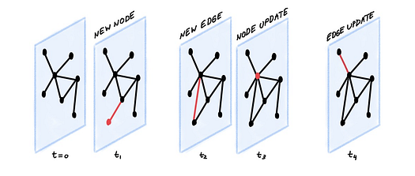
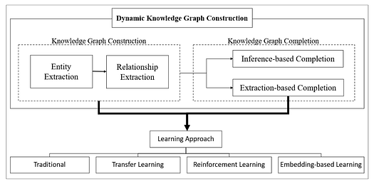
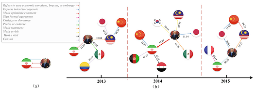

## Integrating temporal data into static knowledge graphs

<figure>

<figcaption>

Photo by Djim Loic on [Unsplash](https://unsplash.com/photos/analog-clock-at-12-am-ft0-Xu4nTvA?utm_content=creditShareLink&utm_medium=referral&utm_source=unsplash)

</figcaption>

</figure>

# Introduction

Knowledge graphs (KGs) have proven to be an effective method of data representation that is increasingly popular. In KGs, entities and concepts are represented as nodes, while the relationships between nodes are depicted as edges. Thus, KGs can effectively capture the semantic meanings of nodes. For instance, Google’s Knowledge Graph distinguishes between different meanings of a word by identifying its context via its neighbours.

Recently, there has been more discourse suggesting that traditional, static KGs are insufficient as they only capture knowledge up to the current point in time. KGs used for online search must update as new entities and knowledge emerge or words adopt new meanings. In social media platforms, KGs that capture user data and relationships have to update dynamically as new users are created and follow other accounts. In this article, we will introduce knowledge graphs that incorporate temporal information, namely dynamic knowledge graphs (DKGs) and temporal knowledge graphs (TKGs). We briefly describe DKG construction techniques and the two definitions of TKGs. Then, we will review a series of DKG and TKG applications in existing literature.

# The Distinction Between Dynamic and Temporal Knowledge Graphs

Before diving in, there is an important distinction that should be noted. During research, the terms “dynamic knowledge graph” and “temporal knowledge graph” kept turning up, but the distinction between them was blurry, at least for me. This is what I discovered upon further research.

**DKGs** primarily focus on understanding structural changes in graphs over time. They rely on evolving datasets to add or update nodes and edges. This learning of meta-knowledge seeks to shed light on the evolution of the graph’s structural and semantic properties, rather than specific content within individual nodes and edges.

On the other hand, **TKGs** are a special subset of DKGs. They have an added capability of storing event timestamps, ensuring data consistency with regards to time. Research involving TKGs focuses on studying individual nodes and edges, which is useful for link prediction and time prediction that aim to anticipate events between entities and the time of their occurrences.

It is important to note that DKGs and TKGs are by no means mutually exclusive. Some studies may focus solely on updating dynamic graphs or studying graph structures, whilst others focus on link and time predictions. There are also works that encompass a mix of these tasks. Research goals depend heavily on domain and applications. Nonetheless, there is a common thread across approaches of maintaining the validity of data over time.

# Dynamic Knowledge Graphs

## **Motivation for DKGs**

<figure>

<figcaption>

Dynamic knowledge graphs allow for updates to the graph’s nodes and edges at different time steps. Source: [https://blog.x.com/engineering/en\_us/topics/insights/2021/temporal-graph-networks](https://blog.x.com/engineering/en_us/topics/insights/2021/temporal-graph-networks)

</figcaption>

</figure>

The world, along with our knowledge of it, is dynamic. Therefore, our representations of the world should also reflect this dynamism and evolve over time. Much of the data we generate already includes timestamps, laying the groundwork for a seamless transition from KGs to DKGs. Consider, for example, a social media network like X (formerly known as Twitter), where users can be represented as nodes with relationships like “User A follows User B.” With reference to the image above, DKGs can be updated with every new event, such as the creation of a new account (new node), a user following another user (new edge), or a user updating their profile (node update). These updates allow for a more complete and accurate representation of our evolving world knowledge.

## **DKG Construction**

<figure>

<figcaption>

A pipeline showing the process of DKG construction. Source: Farghaly et al., 2024 [https://doi.org/10.1109/access.2024.3378514](https://doi.org/10.1109/access.2024.3378514)

</figcaption>

</figure>

The construction of DKGs is not vastly different from that of standard KGs. Standard KGs are formed in the KG construction phase, which involves entity and relationship extraction that can be further broken down into various natural language processing subtasks. For DKGs, an additional KG completion phase is employed. This phase is responsible for dynamically updating or adding new nodes and relations to an existing KG and can be achieved in two ways:

1. **Inference-based completion**: New knowledge is derived from studying the existing graph and added into the KG.

3. **Extraction-based completion**: A new KG is constructed with external data sources, then linked to the existing KG, thereby fusing the knowledge sources.

Both of these approaches ensure that the knowledge in DKGs remains up-to-date.

# Temporal Knowledge Graphs

## **Motivation for TKGs**

In the previous section, we mentioned that TKGs incorporate timestamps of events. The lack of temporal data can make the representation confusing. Consider panel (a) in the image below, where three relations–_Praise or endorse, Make optimistic comment_ and _Criticise or denounce_–are shown between _Barack Obama_ and _Iran_. Together, these actions seem contradictory and incoherent.

<figure>

<figcaption>

Standard knowledge graphs in panel (a) may be confusing, thus requiring the integration of temporal data as shown in panel (b). Source: Zhang et al., 2023 [https://doi.org/10.1007/978-3-031-46664-9\_4](https://doi.org/10.1007/978-3-031-46664-9_4)

</figcaption>

</figure>

When we introduce temporal data, for instance in the image above in panel (b), we see that Obama’s actions toward Iran occurred in three distinct years from 2013 to 2015 and were tied to actions by other countries. This added context makes the information a lot more understandable.

## **How is temporal data added into KGs?**

Traditional KG data is commonly expressed as a triple comprising a subject, predicate, and object. The subject and object form two separate nodes, while the predicate is a relation connecting them. In the earlier example, _Barack Obama_ and _Iran_ would be two nodes connected by a relation _Praise or endorse_.

There are two distinct definitions of TKGs:

1. **Temporal Knowledge Graphs (TKGs)**

Instead of a triple, TKG data is typically represented as quadruples consisting of the subject, predicate, object, and timestamp. In the same example as before, this would be _(Barack Obama, Make optimistic comment, Iran, 2014–12–29)_. Some implementations might extend this further to quintuples where there is a time range, such as _(Donald Trump, President of, United States, 2017, 2021)_.

1. **Discrete Time Dynamic Graphs (DTDGs)**

DTDGs, unlike TKGs, are a series of static KGs that use the standard triple representation. This definition allows for easier temporal analysis and meta-knowledge mining, which focuses on the graph’s structural and semantic properties rather than the individual nodes and edges themselves.

# Applications

## **Dynamic Knowledge Graphs**

The powerful ability of DKGs to capture semantics and relationships dynamically offer advantages in numerous domains, including question-answering, linguistics, finance, fake review detection in e-commerce, robotics, smart cities and Internet of Things, animations, and more. Another field of research termed [Temporal Graph Learning](https://towardsdatascience.com/temporal-graph-learning-in-2023-d28d1640dbf2#f7ab) also attempts to learn from evolving TKGs and has applications in disease modelling, anomaly detection and detecting misinformation. We will discuss some applications below.

1. **Detecting emerging communities of knowledge**

Aparicio et al. (2024) constructed DTDGs from publications in the Conference on Knowledge Discovery and Data Mining (KDD) to analyse research trends within the conference over the years. A series of knowledge graphs were created for every year from 2013 to 2021. Comparing graph structures across the years allowed them to identify trends such as increased focus on topics like “graph” and “e-commerce” and emerging publications emphasising interconnected topics rather than single topics. These valuable insights into research trends which allows researchers to anticipate future research directions and allows organisations to get a glimpse of possible industry developments.

**2\. Linguistics — Updating graphs with neologisms**

Neologisms involve the coining of new words or assignment of new meanings to existing words, and reflect the evolution of language across generations. Since KGs aim to capture the knowledge we have about the world, they should be dynamically updated to reflect these new words and meanings. This was the goal of the auto-growing KG, PolarisX (Polaris Expander), which crawled news sites and social media, extracted information using the BERT large language model, and added new knowledge to KGs. Conversational chatbots, sentiment analysis systems, search engines, and other applications can benefit from these KGs through more effective understanding of user intent and semantics.

## **Temporal Knowledge Graphs**

Tasks achieved using TKGs are entity prediction, relation prediction, and time prediction. If TKG data is represented as quadruples _(s, r, o, t)_, then entity prediction can be modelled by queries like _(?, r, o, t)_ or _(s, r, ?, t)_, while relation and time prediction can be modelled as _(s, ?, o, t)_ and _(s, r, o, ?)_. These TKG reasoning tasks can be categorised into two settings given that we have data within a certain time range:

1. **Interpolation** focuses on predicting missing facts within the time range by learning embeddings for entities and relations.

One interpolation task is TKG completion, aimed at inferring missing entities or relations within TKGs to fill in missing facts. Existing literature for TKG completion is often more mathematical as relations are modelled by rotations and translations in space. Initially, entities, relations, and times were encoded in real space. Later, this was extended to complex space, and then to hypercomplex space. Cai et al. (2024) used quaternions to represent information in hypercomplex space, which have one real part and three imaginary parts as compared to standard complex numbers that have one real part and one imaginary part, thus allowing more information to be expressed.

**2\. Extrapolation** predicts facts beyond the time range by reasoning over a series of graph snapshots at each timestamp.

Extrapolation is slightly more interesting as it is akin to predicting the future. To predict whether and when an event might occur, Trivedi et al. (2017) presented Know-Evolve. It employed a recurrent neural network to learn the historical evolution of entities while using a bilinear relationship score to understand temporal dependencies between entities.

# TKG Forecasting with Large Language Models

Recently, Lee et al. (2023) used in-context learning (ICL) with large language models (LLMs) to perform the future link prediction task. The authors highlighted that prior forecasting techniques using TKGs required special model architectures, large training datasets with comprehensive historical information, and posed challenges in model selection. In response, they performed ICL on LLMs, a process which entails providing a few examples to the LLM so it can learn to perform on unseen tasks.

Their approach utilised a three-stage pipeline. Initially, relevant facts were retrieved from a TKG to serve as context. This context was transformed into a prompt and fed to the LLM. The LLM’s output was then converted into probabilities, where the most probable entity was selected as the forecasted answer. In this way, their method could predict events without time-consuming training or custom model architectures. Remarkably, it was shown that LLMs performed as well as current TKG techniques, even without explicit modules designed to capture associations within the data. Moreover, the model could learn patterns from historical data and the LLM was not simply predicting based on the most common or recent facts given in the context. This unveils the potentials of LLMs to be studied with TKGs.

# Conclusion

In conclusion, we started off by clarifying the distinction between temporal knowledge graphs (TKGs) and dynamic knowledge graphs (DKGs), both of which are forms of knowledge graphs that accommodate temporal changes to data. We discussed the motivation for exploring DKGs and TKGs, together with a brief description of DKG construction techniques. We introduced two distinct definitions of TKGs, Temporal Knowledge Graphs and Discrete Time Dynamic Graphs.

A review of existing DKG and TKG applications was conducted. In particular, DKGs can be utilised in a number of industries and applications, including detecting communities of knowledge and aiding in linguistics. TKG applications focus on entity, relation or time prediction tasks, which are broadly categorised into interpolation or extrapolation methods. Examples include TKG completion and future event prediction respectively.

Finally, we reviewed a recent study where large language models (LLMs) were employed for TKG prediction. This introduces questions about the necessity of specially designed and sophisticated TKG models and the potential for LLMs to revolutionise this field. However, given the current limitations of LLMs, it is conceivable that the relationship between TKGs and LLMs may evolve similarly to that between traditional KGs and LLMs from a competitive to a complementary relationship.

# **References**

- Wang, A. (2020, November 20). Difference Between Temporal KG and Dynamic KG. Medium. [https://audreywongkg.medium.com/difference-between-temporal-kg-and-dynamic-kg-7b25a8075df3#:~:text=Temporal%20knowledge%20graph%20embedding%20methods%20are%20trained%20on%20stationary%20datasets](https://audreywongkg.medium.com/difference-between-temporal-kg-and-dynamic-kg-7b25a8075df3#:~:text=Temporal%20knowledge%20graph%20embedding%20methods%20are%20trained%20on%20stationary%20datasets)

- Farghaly, M., Mounir, M., Aref, M., & Moussa, S. M. (2024). Investigating the Challenges and Prospects of Construction Models for Dynamic Knowledge Graphs. In IEEE Access (Vol. 12, pp. 40973–40988). Institute of Electrical and Electronics Engineers (IEEE). [https://doi.org/10.1109/access.2024.3378514](https://doi.org/10.1109/access.2024.3378514)

- Aparicio, J. T., Arsenio, E., Santos, F., & Henriques, R. (2024). Using dynamic knowledge graphs to detect emerging communities of knowledge. In Knowledge-Based Systems (Vol. 294, p. 111671). Elsevier BV. [https://doi.org/10.1016/j.knosys.2024.111671](https://doi.org/10.1016/j.knosys.2024.111671)

- Yoo, S., & Jeong, O. (2020). Automating the expansion of a knowledge graph. In Expert Systems with Applications (Vol. 141, p. 112965). Elsevier BV. [https://doi.org/10.1016/j.eswa.2019.112965](https://doi.org/10.1016/j.eswa.2019.112965)

- Cai, L., Mao, X., Wang, Z., Zhao, S., Zhou, Y., Wu, C., & Lan, M. (2024). Temporal Knowledge Graph Completion with Time-sensitive Relations in Hypercomplex Space (Version 1). arXiv. [https://doi.org/10.48550/ARXIV.2403.02355](https://doi.org/10.48550/ARXIV.2403.02355)

- Trivedi, R., Dai, H., Wang, Y., & Song, L. (2017). Know-Evolve: Deep Temporal Reasoning for Dynamic Knowledge Graphs (Version 3). arXiv. [https://doi.org/10.48550/ARXIV.1705.05742](https://doi.org/10.48550/ARXIV.1705.05742)

- Lee, D.-H., Ahrabian, K., Jin, W., Morstatter, F., & Pujara, J. (2023). Temporal Knowledge Graph Forecasting Without Knowledge Using In-Context Learning (Version 3). arXiv. [https://doi.org/10.48550/ARXIV.2305.10613](https://doi.org/10.48550/ARXIV.2305.10613)
