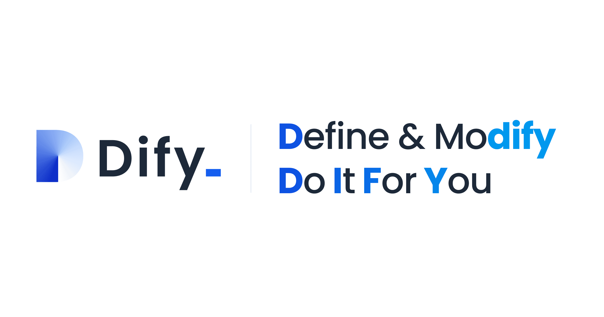
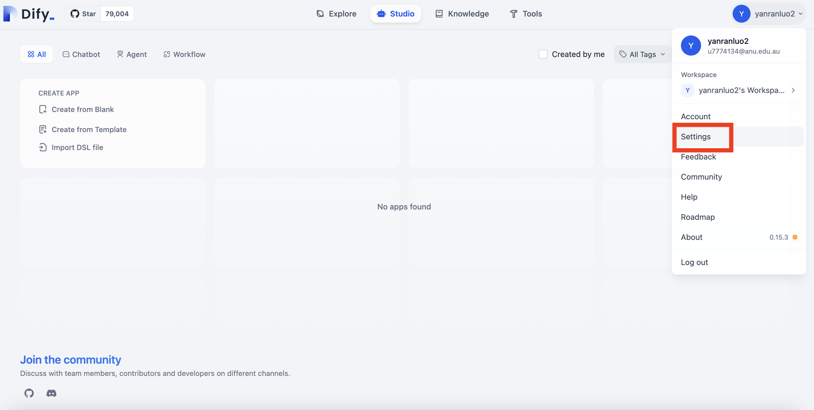
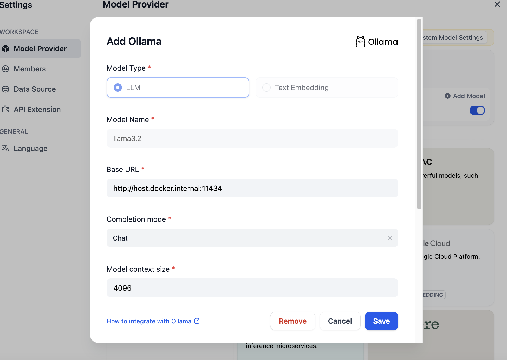

## How to create a functional documentation assistant without writing code

<figure>



<figcaption>

By Dify.ai, retreived from [https://dify.ai/blog/open-source-llmops-platform-define-your-ai-native-apps](https://dify.ai/blog/open-source-llmops-platform-define-your-ai-native-apps)

</figcaption>

</figure>

## Introduction

Large Language Models (LLMs) have transformed how we build intelligent applications, but implementing production-ready AI systems often requires navigating complex infrastructure, managing model deployments, and building custom interfaces. Many developers face a challenging choice: use simple but limiting no-code platforms that hide the complexity, or build everything from scratch with code-heavy frameworks.

Dify.ai offers a compelling middle ground. As an open-source LLM application development platform, it combines the ease of a visual interface with the flexibility and power typically reserved for custom code solutions. When paired with Ollama—a tool for running models locally—you can create sophisticated AI applications that run entirely on your own hardware.

This tutorial will guide you through setting up a complete LLM pipeline on your Mac using Dify.ai, Ollama, and optionally GPT. By the end, you'll have a fully functional Retrieval-Augmented Generation (RAG) system capable of answering questions based on your own documents—all running locally with privacy and control.

## What You'll Learn

- Installing Dify.ai on Mac using Docker

- Setting up Ollama with Llama3 for local model inference

- Connecting OpenAI's GPT models as a fallback

- Building a documentation assistant with RAG (Retrieval Augmented Generation)

- Testing and optimising your application

## Prerequisites

Before we begin, ensure your Mac meets these requirements:

- macOS Monterey (12) or newer

- At least 8GB RAM (16GB recommended)

- 20GB+ free disk space

- Administrator privileges

- [Docker Desktop for Mac](https://www.docker.com/products/docker-desktop/)

- [Ollama](https://ollama.com/download)

- OpenAI API key

## Step 1: Set Up Docker on Your Mac Up Your Environment

Docker is essential for running Dify, as it encapsulates all the necessary components in containers.

1. Download and install Docker Desktop from the [official website](https://www.docker.com/products/docker-desktop/)

3. Launch Docker Desktop and wait for it to fully start

5. Verify installation by opening Terminal and running:

```
docker --version
```

You should see output similar to:

```
Docker version 27.4.0, build bde2b89
```

**Note for M1/M2/M3 Mac users**: Make sure Docker Desktop is configured for your ARM architecture. This happens automatically during installation, but you can verify in Settings → General that "Use virtualization framework" is enabled.

## Step 2: Install and Configure Ollama

Ollama lets you run large language models locally on your Mac.

1\. Download and install Ollama from [ollama.com/download](https://ollama.com/download)

2\. Launch Ollama from your Applications folder

3\. Open Terminal and pull the Llama3 model:

```
ollama run llama3.2
```

This will download the model (~4GB), which might take several minutes depending on your internet connection.

4\. Set up Ollama to listen on all interfaces (needed for Docker to connect to it):

```
# Create or edit the Ollama environment variables
touch ~/.ollama/.env
echo "OLLAMA_HOST=0.0.0.0" >> ~/.ollama/.env

# Restart Ollama to apply changes
killall ollama
open -a Ollama
```

## Step 3: Install Dify.ai Using Docker

Now, let's get Dify running:

1\. Create a new directory for your Dify installation:

```
mkdir ~/dify
cd ~/dify
```

2\. Clone the Dify repository:

```
git clone https://github.com/langgenius/dify.git
cd dify/docker
```

3\. Set up the configuration:

```
cp .env.example .env
```

4\. Start the Dify services:

```
docker compose up -d
```

This will pull all necessary Docker images and start the Dify services. It might take 5-10 minutes on the first run.

5\. Verify that all containers are running:

```
docker compose ps
```

You should see all services (including api, web, worker, db, redis, etc.) in the "running" state.

**Pipeline Component Check**: At this point, we've set up the infrastructure that will host our vector database, embedding service, and orchestration layer. Dify uses a combination of services to manage different aspects of the RAG pipeline:

- **Weaviate**: Vector database for storing document embeddings

- **Redis**: For caching and message queuing

- **PostgreSQL**: For structured data storage

## Step 4: Configure Dify

1\. Open your browser and navigate to:

```
http://localhost
```

2\. Follow the on-screen instructions to create an admin account.

3\. After logging in, click on your profile icon in the top right corner, then select "Settings".



4\. Go to "Model Providers" in the sidebar.


#### Connect Ollama

1. Find the Ollama provider and click "Add Model".

3. Enter the following details:
    - Model Name: llama3
    
    - Base URL: http://\[YOUR\_IP\_ADDRESS\]:11434 (replace with your Mac's IP)
    
    - If Ollama is running in Docker Desktop, use `host.docker.internal` instead of your IP address as localhost in Docker is not the same as the host’s localhost since the container exists in a separate network namespace
    
    - Model Type: Chat
    
    - Model Context Size: 4096
    
    - Maximum Token Limit: 4096



3. Click "Save" and ensure the connection test passes.

#### Connect OpenAI

1. Find the OpenAI provider and click "Setup".

3. Enter your OpenAI API key.


1. Click "Save".

3. In "System Model Settings", select models for each purpose:
    - System Reasoning Model: gpt-4o-mini or gpt-3.5-turbo
    
    - Embedding Model: text-embedding-3-large


**Pipeline Component Addition**: We've now added two critical components to our pipeline:

1. **The Inference Engine** (Ollama with Llama3.2)

3. **The Embedding Service** (either Ollama or OpenAI)

This configuration allows Dify to route different parts of the pipeline to the appropriate service. For example, document embeddings might be handled by OpenAI's powerful embedding model, while actual query responses could be generated locally by Llama3.2.

## Step 5: Understanding the RAG Pipeline Flow

Before we build our application, let's understand how data flows through our RAG pipeline:

1. **Document Ingestion**:
    - Documents are uploaded to Dify
    
    - Dify splits them into smaller chunks
    
    - Each chunk is processed for embedding

3. **Embedding Creation**:
    - Text chunks are sent to the embedding model
    
    - The model converts each chunk into a vector representation
    
    - These vectors capture the semantic meaning of the text

5. **Vector Storage**:
    - Embeddings are stored in the vector database
    
    - The database indexes these for efficient similarity search

7. **Query Processing**:
    - When a user asks a question:
        - The question is embedded using the same model
        
        - This query embedding is compared to document embeddings
        
        - The most similar chunks are retrieved

9. **Context Assembly**:
    - Retrieved document chunks are combined with the system prompt
    
    - This creates a complete prompt that includes relevant context

11. **Response Generation**:
    - The complete prompt is sent to the LLM (Llama3 via Ollama)
    
    - The LLM generates a response based on the prompt and context
    
    - The response is returned to the user

This entire flow is orchestrated by Dify, with different components handling specific parts of the process.

## Step 6: Create a Documentation Assistant

Now, let's build a practical application: a documentation assistant for Python's Pandas library.

#### Prepare the Knowledge Base

1. Download the Pandas documentation:

[https://pandas.pydata.org/pandas-docs/stable](https://pandas.pydata.org/pandas-docs/stable)

2\. In Dify, navigate to "Knowledge" and click "Create Knowledge".


3\. Name it "Pandas Documentation".

4\. Click "Import from file" and upload the HTML files from the user guide folder of the Pandas documentation you downloaded.


5\. Click "Next" to process the document.

6. Review the processing settings and click "Save & Process".

Wait for the knowledge base to be processed. This might take a few minutes depending on the size of the documentation.

**Behind the Scenes**: During this processing step, Dify is:

1. Extracting text from the files

3. Splitting it into manageable chunks

5. Creating embeddings for each chunk

7. Storing these embeddings in the vector database

#### Create the Chatbot Application

1. Navigate to "Studio" and click "Create from Blank".


2\. Select "Chatbot" as the application type.

3\. Name it "Pandas Assistant" and provide a brief description.

4\. Click "Create".

#### Configure the Chatbot

1. In the "Orchestrate" tab, add a prompt in the instructions:

```
You are a helpful Python Pandas expert. Your role is to provide accurate, informative answers about the Pandas library based on its official documentation. When answering:

1. Be concise yet thorough
2. Include code examples when appropriate
3. Explain concepts clearly for users of all skill levels
4. If uncertain about something, acknowledge the limitation
5. When providing solutions, explain why they work
```


2. In the "Context" section, click "Add" and select your "Pandas Documentation" knowledge base.

4. Configure the retrieval settings:
    - Retrieval Method: Hybrid (recommended)
    
    - Top k: 5
    
    - Score Threshold: 0.5

4. In the top-right, click the model dropdown and select "llama3" (our Ollama model).

6. Click "Publish" to save your changes.

**Pipeline Configuration**: These settings determine how the retrieval component of our pipeline works:

- **Hybrid retrieval** combines keyword and semantic search for better results

- **Top k: 5** means the system will retrieve the 5 most relevant chunks

- **Score threshold: 0.5** sets a minimum relevance score for retrieved chunks

## Step 7: Testing Your Pipeline

Click "Run App" to test your chatbot.


Try asking questions about Pandas, such as:

- "How do I filter rows in a DataFrame?"

- "Explain what a GroupBy operation does"

- "What's the difference between loc and iloc?"

**Observing the Pipeline in Action**:

1. When you submit a question, you can see a "thinking" indicator as Dify processes your query

3. Behind the scenes, your question is being:
    - Embedded into a vector
    
    - Compared against document chunks
    
    - Relevant chunks are being retrieved
    
    - A prompt is being assembled with these chunks
    
    - The prompt is sent to Llama3.2 via Ollama
    
    - Llama3.2 generates a response
    
    - The response is returned to you

If you've connected both Ollama and OpenAI, you can compare responses by switching between models in the dropdown menu.

#### Response Comparison: Ollama vs OpenAI

This comparison shows how different models handle the same query with the same context. You might notice:

- **Response quality differences**: OpenAI models might provide more polished responses

- **Speed differences**: Local models might be slower but don't have network latency

- **Detail level**: Different models might focus on different aspects of the documentation

<figure>


<figcaption>

gpt-4o response

</figcaption>

</figure>


## Step 8: Advanced Implementation: Creating a Workflow-Based Assistant

After building your basic documentation assistant, you might want to explore more sophisticated approaches. Dify's workflow functionality allows you to create multi-step processes with branching logic and specialised handling for different query types.

#### Why Use a Workflow Instead of a Simple Chatbot?

While the chatbot approach works well for straightforward question-answering, workflows offer several advantages:

- **Specialised handling** for different types of queries

- **Multi-step processing** for complex tasks

- **Conditional logic** to take different actions based on inputs

- **Transparency** in how inputs are processed into outputs

Let's create an enhanced version of our Pandas assistant using Dify's workflow capabilities:

#### Creating a Workflow Application

1. In Dify, navigate to "Studio" and click "Create from Blank".

3. Select "Workflow" as the application type.

5. Name it "Pandas Advanced Assistant" and provide a brief description.

7. Click "Create".


#### Building the Workflow Pipeline

You'll be presented with the workflow canvas where you can visually design your pipeline:

1. Start with the default "Start" node, which receives the initial user input.

3. Add an "LLM" node for query classification:
    - Connect it to the Start node
    
    - Configure with:
        - Name: "Query Classifier"
        
        - Instructions:

```
Classify the following query about Pandas into one of these categories:
1. DataFrame Operations
2. Data Selection
3. Data Manipulation
4. Statistics & Analysis
5. Other

Return ONLY the category number and nothing else.
```


- Model: Select "llama3.2" (our Ollama model)

3\. Add an "IF/ELSE" node:

- Connect it to the Query Classifier

- Set condition: `{{llm_output}} == "1"`

4\. For the "True" path (DataFrame Operations):

- Add a "Knowledge Retrieval" node:
    - Connect it to the "True" path
    
    - Select your Pandas documentation knowledge base
    
    - Filter for "DataFrame operations" related content

- Add another "LLM" node for specialized responses:
    - Connect it to the Knowledge Retrieval node
    
    - Configure with:
        - Name: "DataFrame Expert"
        
        - Instructions:

```
You are a Pandas expert specializing in DataFrame operations.

User Query: {{input}}

Relevant Documentation:
{{knowledge}}

Provide a detailed response with example code showing how to perform this DataFrame operation. Include explanations of any parameters or options mentioned.
```

- Model: Select "llama3"


5\. Repeat steps 3-4 for other categories, creating separate paths for Data Selection, Data Manipulation, etc.

6\. Finally, connect all response generators to an "End" node to complete the workflow.

This creates a pipeline that:

1. Receives user input

3. Classifies the type of question

5. Retrieves relevant documentation based on the category

7. Generates a specialised response using a prompt tailored to that category

#### Testing Your Advanced Pipeline

When you run this workflow-based assistant, you'll notice several improvements:

1. **More Precise Responses**: By specialising prompts for different query types, responses are more focused and relevant.

3. **Clearer Explanations**: Category-specific response generators can provide more detailed explanations for their domains.

5. **Better Code Examples**: Specialised prompts can include requirements for code examples that fit the particular type of operation.

Try it with the same questions you used with the basic assistant and compare the results:

- "How do I filter rows in a DataFrame?"

- "What's the difference between loc and iloc?"

- "How can I calculate the mean of each column?"

## Step 9: Performance Optimisation for Mac

To get the best performance on your Mac:

#### Adjust Docker Resources:

1. Open Docker Desktop → Settings → Resources

3. Allocate at least 4GB of RAM and 2 CPUs

5. For Apple Silicon Macs, allocate 6GB+ for better performance

#### Configure Ollama Memory Usage:

Create a file at ~/.ollama/config with:

{  
"gpu\_layers": 0,  
"cpu\_threads": 4  
}  

Adjust cpu\_threads based on your Mac's capabilities (generally 1-2 less than total CPU cores).

#### Network Optimisation:

If experiencing slowdowns, try using host.docker.internal instead of your IP address in the Ollama configuration.

## Step 10: Extending Your Pipeline

Now that you've built a basic documentation assistant, let's explore how to extend your LLM pipeline:

#### Add Multiple Knowledge Sources

You can create additional knowledge bases for different documentation sources:

- Python standard library

- NumPy documentation

- Matplotlib documentation

This creates a comprehensive programming assistant that can pull from multiple sources.

#### Implement Tool Calling

Dify supports integrating external tools, allowing your pipeline to:

- Execute code snippets

- Fetch real-time data

- Generate visualizations

This transforms your assistant from a static knowledge base to an interactive tool.

### Troubleshooting Common Issues

#### "Connection refused" when connecting to Ollama

**Solution**: Ensure Ollama is running, and check that OLLAMA\_HOST=0.0.0.0 is properly set. Verify that port 11434 is not blocked by your firewall.

#### Dify containers failing to start

**Solution**: Try the following:

```
cd ~/dify/dify/dockerdocker compose down
docker compose pull
docker compose up -d
```

#### Slow performance with large documents

**Solution**: Split your knowledge base into smaller chunks and use a higher-powered OpenAI model for embedding if available.

## Conclusion

You've now built a complete LLM pipeline using Dify.ai, Ollama, and optionally GPT on your Mac. This setup gives you:

1. **Full control** over your data and models

3. **Privacy** by keeping everything local when needed

5. **Flexibility** to use cloud models when appropriate

7. **Scalability** to add more knowledge bases and features

The combination of Dify's intuitive interface and Ollama's local inference capabilities creates a powerful system for building AI applications without cloud dependencies. You can further customize this pipeline by:

- Fine-tuning models for your specific domain

- Adding custom tools and integrations

- Scaling up with more powerful hardware

- Deploying to production environments

The open-source nature of these tools means you're not locked into any single vendor, giving you the freedom to adapt as your needs evolve.

> _For Medium version of this article, please visit this [link](https://medium.com/@researchgraph/the-30-minute-guide-to-your-first-ai-application-dify-ai-ollama-chatgpt-on-mac-fcacb1739337)._

## References

- [Dify.ai Documentation](https://docs.dify.ai/)

- [Ollama GitHub Repository](https://github.com/ollama/ollama)

- [RAG Pipeline Principles](https://arxiv.org/abs/2005.11401)

- [Vector Database Concepts](https://weaviate.io/blog/vector-search-tutorial)

- [Prompt Engineering Guide](https://www.promptingguide.ai/)

- [Pandas documentation](https://pandas.pydata.org/pandas-docs/stable/)
