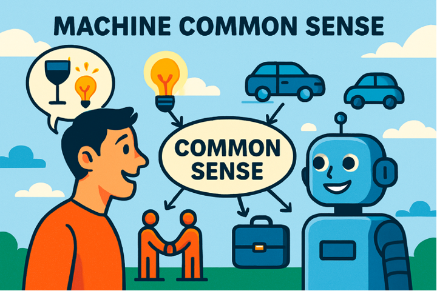
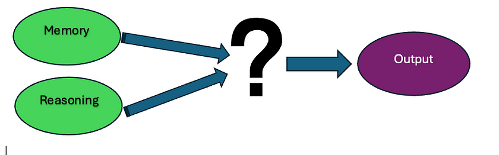

## The Key to Achieving Artificial Intelligence

<figure>

<figcaption>

Image created by Dalle3

</figcaption>

</figure>

> _This article explores and analyses the paper ‘[Can AI have common sense? Finding out will be key to achieving machine intelligence](https://www.nature.com/articles/d41586-024-03262-z#ref-CR4)’ by Mayank Kejriwal and colleagues. The paper was published in 2024._

# Introduction

As artificial intelligence (AI) continues to evolve, one of the most interesting challenges researchers face is determining whether machines can possess something like human consciousness — or, at the very least, human-like reasoning. While we’ve made remarkable strides with models like GPT-4, which powers ChatGPT, a fundamental question still remains: **Can machines develop common sense**?

For humans, common sense is our intuitive understanding of the world around us — knowing that glass breaks easily, chairs are for sitting, and that vegetarian friends may not like meat-based meals. For machines, common sense is a more difficult goal to achieve. Despite their ability to process large amounts of data and answer questions quickly and accurately, AI systems such as LLMs (large language models) often fail at some basic reasoning tasks, which raises an important question: How do we measure whether AI truly understands the world like humans?

# Current Status: AI’s Shortcomings

Over the past few years, LLMs like GPT-4 have given us amazing capabilities. They can generate text, pass medical and bar exams, and even compose poetry. However, they still struggle with tasks that require basic reasoning. For example, when asked a simple question: “Riley felt pain. How did Riley feel afterwards?” the model’s best answer was “aware,” not “painful.” This disconnect suggests that while the model is able to mimic human responses, it doesn’t truly understand emotions or physical sensations — core aspects of common sense.

These failures are not trivial. They reveal a deeper problem: most AI systems today are very good at memorising facts, but often fail at reasoning tasks that require flexible adaptation to real-world situations. Common sense often involves dealing with ambiguity, coping with uncertainty, and making new decisions based on experience. This is where humans can intuitively adjust their reasoning based on context, and AI still can’t replicate that.

<figure>

<figcaption>

How does AI reach its conclusions?

</figcaption>

</figure>

# Why existing testing methods are insufficient

<figure>

<figcaption>

Example of a Multiple Choice Question AI is tested on

</figcaption>

</figure>

Traditionally, AI’s common sense is tested with multiple-choice questions (MCQs). These tests may seem adequate, but in reality, they don’t really measure a machine’s reasoning ability. While these questions assess a model’s factual recall, they don’t assess whether the model understands the reasoning behind its response. For example, a machine may know that a cup of coffee gets cold when left out, but does it understand the concepts of heat transfer and thermal balance?

More importantly, MCQs often overlook the subtlety and context-dependency of common sense. Humans are able to intuitively process these questions when faced with these contexts. For example: ‘Should we serve cake when they visit? I think Lina and Michael are on a diet.’ But if more information is added — like, ‘But I know they have a cheat day’ — the context of the decision changes completely. For AI, handling this kind of ambiguity and changing context is a huge challenge.

# The Importance of Reasoning: More Than Just Memorising Facts

For a machine to exhibit common sense, it must do more than just memorise facts — it needs to infer new information from existing knowledge and apply it appropriately to different contexts. This is where many AI systems fail. They excel at pattern recognition and fact retrieval, but they often fail to draw new, plausible conclusions when faced with ambiguous or incomplete information.

To address this, researchers are pushing for better ways to evaluate AI reasoning. One possible improvement is to **require AI models to explain their reasoning.** If an AI model can logically explain why a cup of coffee cools, rather than simply recalling “because the heat dissipated into the surrounding air,” then we have reason to believe that the model is not just looking up information from its large training corpus, but is reasoning in a meaningful way.

<figure>

<figcaption>

Reasoning explanation by GPT-4o

</figcaption>

</figure>

# The road ahead: new common sense assessment benchmarks

The path to machine common sense is not simple and involves rethinking how we measure reasoning. Current assessment benchmarks are too narrow and often fail to capture human-like reasoning abilities. Researchers argue that AI systems should be assessed on a broad range of reasoning skills, such as understanding physical properties, social interactions, and causal relationships.

To make substantial progress, we must design theory-driven tests that should not be limited to multiple-choice questions but should focus **on practical tasks that require multi-step reasoning**. For example, planning or strategy tasks, such as collecting energy tokens on a chessboard, may be a good way to test whether an AI can reason in a dynamic environment. Humans may not always find the optimal solution, but we are able to make reasonable decisions based on common sense. The fact that AI still performs poorly in this environment suggests that it still struggles with more complex, real-world problems.

# Embodied Common Sense: Thinking Beyond Language

Another key step in developing machine common sense is to go beyond language. LLMs perform very well on language-related tasks, but true common sense involves understanding the physical world, social cues, and human experience — all of which are not just linguistic constructs.

**Embodied common sense** means that machines can not only “understand” the linguistic description of the world, but also perceive and interact with the real world. For example, understanding and responding to physical conditions in the environment (such as the movement of objects, weather changes, etc.), as well as understanding and responding to the emotions or behaviours of others. Embodied common sense is essential to building machines that can make decisions in complex environments. Simply put, the machine not only needs to “know” what common sense is, but also be able to interact with the environment and understand the actual world it lives in.

Embodied common sense is necessary for machines to truly demonstrate human-like reasoning abilities. For example, as babies grow up, they first learn how to understand the world by sensing their environment and interacting with people. Similarly, machines need to learn common sense by sensing and interacting with the physical world. Currently, machines are in the early stages of acquiring this “physical intelligence,” just like babies, but progress is being made.

<figure>

<figcaption>

AI is evolving like humans

</figcaption>

</figure>

# Conclusion: The Future of Machine Common Sense

The road to machine common sense is long and challenging. Despite impressive progress in AI, we still have a long way to go to create machines that can exhibit human-like consciousness and reasoning. As AI becomes more commonplace in a variety of fields, common sense reasoning will be key to ensuring the reliability and ethics of these systems.

The future of AI is not just about creating systems that can recall facts, but about creating systems that can reason, understand, and adapt to a complex world. Advances in this process may not only improve the capabilities of AI systems but also provide deeper cognition for ourselves. Machine common sense may not only revolutionise technology, but also help us more deeply understand the nature of human thinking and reasoning.

In the long run, the science of machine common sense may not only drive a technological revolution, but may also provide us with deep insights into how we think and reason.

> _The Medium version of this article can be found [here](https://medium.com/@researchgraph/exploring-machine-common-sense-8808ef5856ab)._

# References

Mayank Kejriwal, Santos, H, Mulvehill, AM, Shen, K, McGuinness, DL & Lieberman, H 2024, ‘Can AI have common sense? Finding out will be key to achieving machine intelligence’, _Nature_, vol. 634, Nature Portfolio, no. 8033, pp. 291–294.
