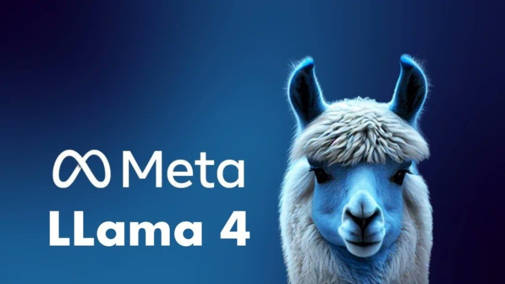
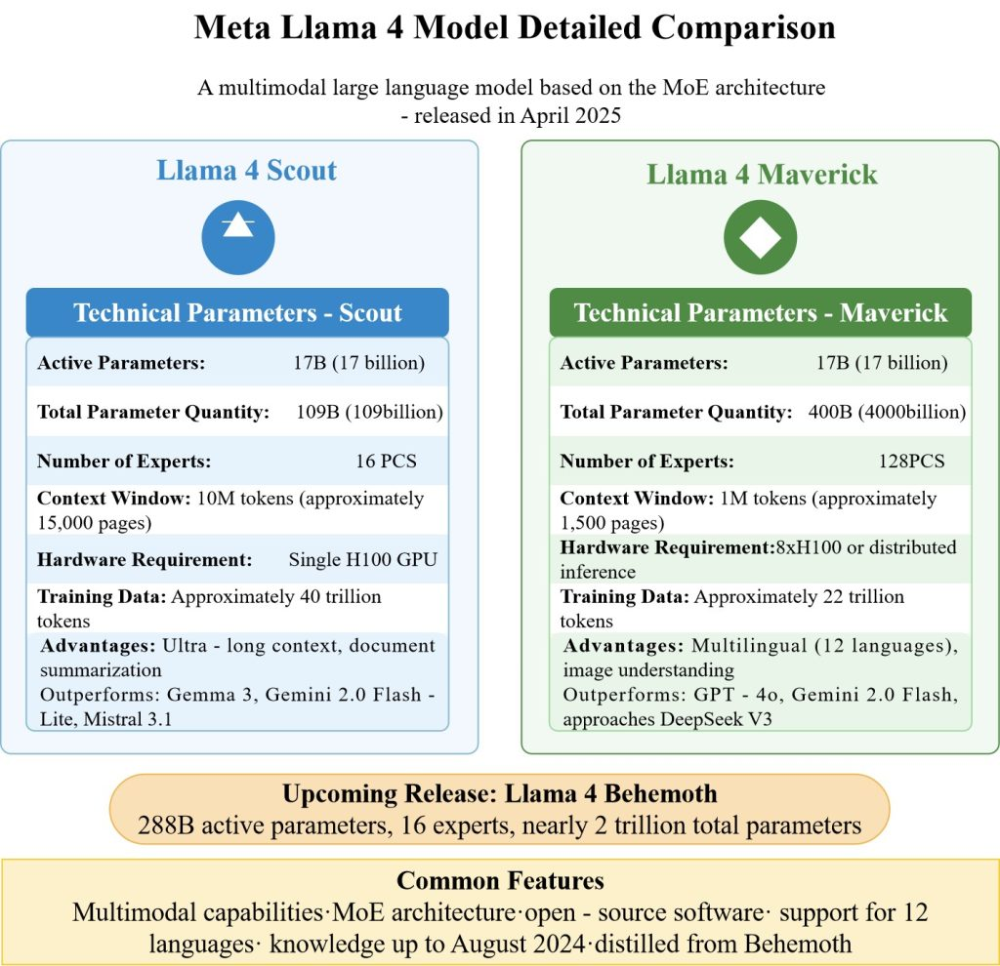
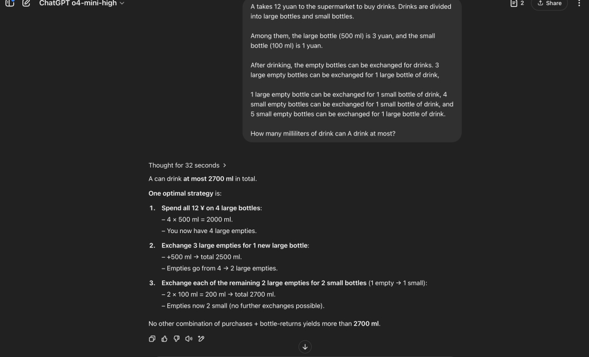
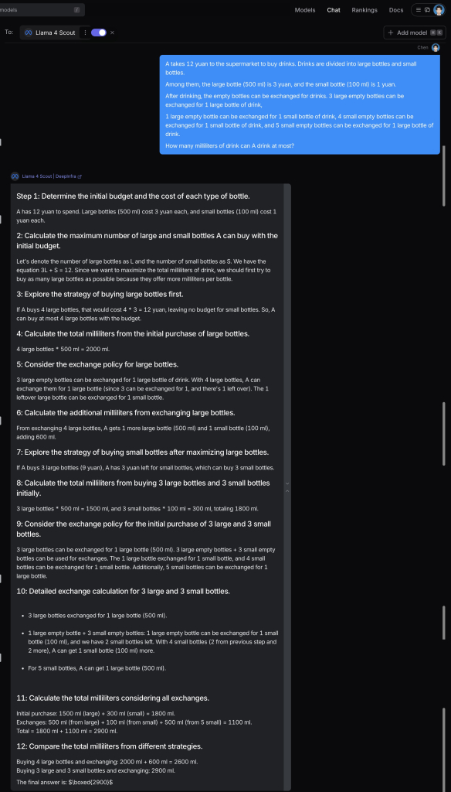
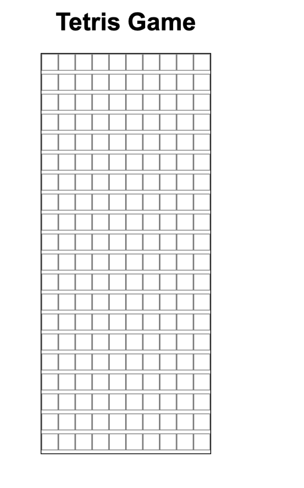

## A Deep Dive into Meta’s Latest AI Breakthrough

Author: Yao Chen (ORCID:0009-0007-1385-3343)



### Introduction

In April 2025, Meta AI released Llama 4, the latest iteration of its open-weight large language model (LLM) family. Building on the success of its predecessors, Llama 4 introduces groundbreaking features like native multimodal capabilities, an innovative Mixture of Experts (MoE) architecture, and an unprecedented context window of up to 10 million tokens. This blog explores what Llama 4 is, its key features, how it compares to other models, and why it matters for developers, businesses, and researchers.

### What is Llama 4?

Llama 4 is a suite of large language models developed by Meta AI, designed to push the boundaries of open-source AI. Released on April 6, 2025, it includes three main variants: Llama 4 Scout, Llama 4 Maverick, and Llama 4 Behemoth (still in training). Unlike earlier Llama models, which were primarily text-based, Llama 4 is natively multimodal, meaning it can process text, images, and potentially other data types like video, making it a versatile tool for a wide range of applications.

The Llama 4 models are “open-weight,” meaning their model weights are available for download (outside the EU due to regulatory restrictions) under licenses that allow research and some commercial use. This accessibility distinguishes Llama 4 from closed-source models like GPT-4o or Claude 3.7 Sonnet, offering developers and organisations the ability to fine-tune and deploy AI on their own infrastructure.

### Llama 4 Version : Scout, Maverick, and Behemoth

- **Llama 4 Scout**: A lightweight, efficient model with 17 billion active parameters, optimized for single-GPU deployment. It’s ideal for tasks like multi-document summarization, long-form reasoning, and edge applications. Its 10-million-token context window is a standout feature.

- **Llama 4 Maverick**: A general-purpose model with 400 billion total parameters and 128 experts, designed for sophisticated applications like multilingual chatbots, image understanding, and enterprise assistants. It’s more resource-intensive but offers high-quality outputs.

- **Llama 4 Behemoth**: Still in training, this model is Meta’s most powerful, with 2 trillion total parameters. It’s used as a “teacher” model to distill knowledge into Scout and Maverick and is expected to rival top-tier models like Claude 3.7 Sonnet and GPT-4.5 upon release.

<figure>



<figcaption>

**_Comparison of different version of llama4(created by author)_**

</figcaption>

</figure>

### Key Features of Llama 4

#### **1\. Mixture of Experts (MoE) Architecture**

Llama 4 adopts a Mixture of Experts (MoE) design, a significant departure from the dense architectures of previous Llama models. In an MoE model, only a subset of parameters (called “experts”) is activated for each task, improving efficiency during training and inference. For example:

- **Llama 4 Scout**: 17 billion active parameters, 16 experts, 109 billion total parameters.

- **Llama 4 Maverick**: 17 billion active parameters, 128 experts, 400 billion total parameters.

- **Llama 4 Behemoth**: 288 billion active parameters, 16 experts, 2 trillion total parameters.

This architecture allows Llama 4 to deliver high performance while using fewer computational resources, making it more accessible for deployment on standard hardware like a single NVIDIA H100 GPU for Scout.

#### 2\. Native Multimodal Capabilities

Unlike Llama 3, which had limited or no multimodal support, Llama 4 is trained from the ground up to handle text and images (and potentially video) using an early-fusion backbone. This enables tasks like:

- **Visual Question Answering**: Answering questions about images, such as interpreting charts or describing scenes.

- **Image Captioning**: Generating descriptions for images.

- **Context-Aware Generation**: Combining text and visual inputs for richer outputs.

For instance, Llama 4 Maverick excels in image reasoning, scoring 73.4 on the MMMU benchmark and 90.0 on Chart QA, making it competitive with models like GPT-4o.

#### 3\. Massive Context Window

Llama 4 Scout boasts a 10-million-token context window, the largest of any publicly released model, equivalent to roughly 7–8 million words. Maverick supports a 1-million-token window, still surpassing many competitors. This allows Llama 4 to:

- Summarize multi-thousand-page documents.

- Analyze entire codebases for debugging or reasoning.

- Maintain context over extended conversations or user activity histories.

However, developers have noted challenges in utilizing the full 10-million-token window due to memory constraints, with some third-party providers limiting context to 128,000–328,000 tokens.

### Simple Question **Tests**

I prepared some questions for testing, and found that llama4 did not perform well on some basic questions.

First one is a simple question **"how many r in the word strawberry"**, we can see that llama4 gives me the wrong answer but GPT-4o gives the correct answer.

<figure>


<figcaption>

**_wrong answer given by llama4_**

</figcaption>

</figure>

<figure>


<figcaption>

**_correct answer given by gpt-4o_**

</figcaption>

</figure>

Second one is also a simple question **9.12 and 9.9 which is bigger**, we can see that llama4 still gives me the wrong answer but GPT-4o gives the correct answer.

<figure>


<figcaption>

**_wrong answer given by llama4_**

</figcaption>

</figure>

<figure>


<figcaption>

**_correct answer given by gpt-4o_**

</figcaption>

</figure>

The third question is a slightly more complex question **“Drop a steel ball into a red wine glass, then turn the glass upside down on the table, then pick up the glass and fill it with water, then put the glass in the refrigerator for 10 minutes. Where is the steel ball now?“**. This time both llama4 and GPT-4o gave the correct answer.


Next one is a math problem **"You can use any symbols but you cannot change the position of the numbers. How do you make this equation true? 6 5 4 1 24"**, llama4 seems failed to solve this question and start saying nonsense, while gpt-4o solve the question correctly.

<figure>


<figcaption>

**_Answer Given by llama4_**

</figcaption>

</figure>

<figure>


<figcaption>

**_Answer given by GPT-4o_**

</figcaption>

</figure>

### Practical Task Tests

#### Task1. Planning task

The first task is a Planning task. Here is the prompt.

```
A takes 12 yuan to the supermarket to buy drinks. Drinks are divided into large bottles and small bottles.

Among them, the large bottle (500 ml) is 3 yuan, and the small bottle (100 ml) is 1 yuan.

After drinking, the empty bottles can be exchanged for drinks. 3 large empty bottles can be exchanged for 1 large bottle of drink,

1 large empty bottle can be exchanged for 1 small bottle of drink, 4 small empty bottles can be exchanged for 1 small bottle of drink, and 5 small empty bottles can be exchanged for 1 large bottle of drink.

How many millilitres of drink can A drink at most?
```

The result is GPT-4o solve the problem correctly and llama4 failed to solve it.  

<figure>



<figcaption>

**_Correct answer by gpt-4o_**

</figcaption>

</figure>

<figure>



<figcaption>

**_Wrong answer by llama4_**

</figcaption>

</figure>

#### Task2. solar system simulation

Here is the prompt for this task

```
Create a **single HTML file** containing CSS and JavaScript to generate a **solar system simulation**.

The simulation should visualize the **eight planets** orbiting the **sun**, with different orbital paths and speeds.
The animation should include:

- **Sun**: a glowing, pulsating sphere at the center.
- **Eight planets**: Mercury, Venus, Earth, Mars, Jupiter, Saturn, Uranus, and Neptune,
each with an appropriate size, distance, and orbital speed.
- **Satellites**: some planets (such as Earth's Moon, Jupiter's Galilean moons, and Saturn's Titan) should have their own orbital motion.
- **Asteroid belt**: a **randomly moving group of asteroids** between Mars and Jupiter.
- **Background stars**: add a background of stars to enhance the cosmic atmosphere.

**Feature requirements:**
- The animation should use **CSS and JavaScript** to achieve **smooth orbital motion**.
- Provide **zoom and drag** controls for better viewing.
- Allow users to **turn orbit display on/off** for better visualization.
- Provide an optional **info panel** that displays the name and related information of a planet when clicked.

Please provide all HTML, CSS, and JavaScript code in a **single HTML file** to make the simulation visually appealing and as consistent with scientifically plausible proportions and motion as possible.

```

Here is the result given by gpt :

Here is the result given by llama4:

We can find that with only one prompt, the GPT‘s result is undoubtedly more satisfactory and meets the requirements.

#### Task3. Implement a simple and cute Tetris game in an HTML file

Here is the performance of GPT-4o, It successfully implemented a playable game with the basic elements of the Tetris game.

But the llama4 failed to generate a playable game.



### Conclusion

After testing and real-world usage, Llama 4 falls short of the hype surrounding its release, with inconsistent performance in tasks like coding and reasoning compared to competitors like GPT-4o. Despite its innovative MoE architecture, multimodal capabilities, and massive context window, these limitations highlight the gap between benchmark scores and practical utility.

However, Llama 4’s open-weight model and cost efficiency still make it a valuable tool for developers and researchers. With Meta actively refining the model and the upcoming release of Llama 4 Behemoth, future iterations hold promise for addressing these shortcomings and delivering on the potential of open-source AI. Stay tuned for updates, and explore Llama 4 to see how it fits your AI projects!
