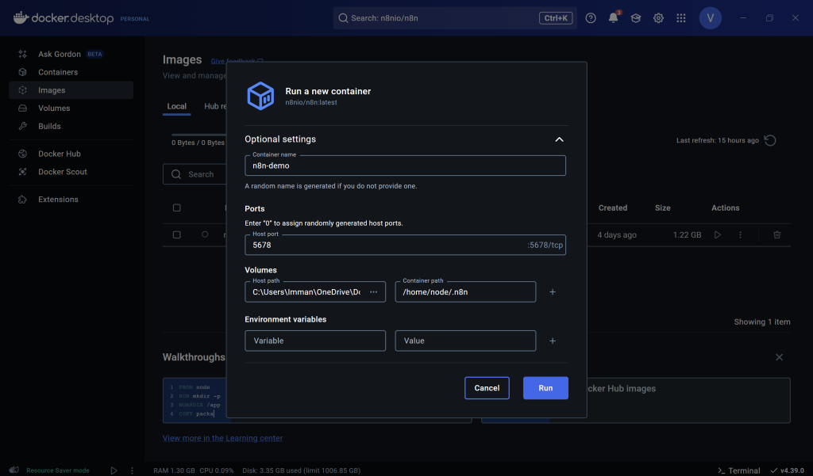

## Tutorial for Windows Users


_This image is generated by the author using ChatGPT 4o \[_[https://chatgpt.com/share/681056e3-9f28-800c-be8a-d8e98543d391](https://chatgpt.com/share/681056e3-9f28-800c-be8a-d8e98543d391)\]_._

**Author:** Immanuel Alvaro Bhirawa **ORCID ID: 0009-0009-3354-7794**

**Introduction**

Large language models (LLMs) are transforming the way we engage with technology, delivering remarkable capabilities in natural language understanding and generation. However, incorporating these models into your projects can feel overwhelming due to challenges like managing dependencies and ensuring compatibility across systems. In this blog post, we offer a detailed guide to installing **n8n**, a versatile workflow automation tool, and building an LLM pipeline using **Ollama** and **Docker** on a Windows environment. By the end of this tutorial, you’ll have a fully operational setup that lets you run LLMs locally and automate tasks seamlessly through n8n’s intuitive interface. Whether you’re a seasoned developer or a curious beginner, this step-by-step journey will equip you with the tools and insights to tap into the power of LLMs for your workflows. Let’s get started!

**Before we start**, **What exactly is n8n?**

n8n is an open-source workflow automation tool designed to simplify the process of connecting apps, services, and APIs without extensive coding. Pronounced "nodemation," it allows users to create complex workflows through an intuitive, visual interface where nodes represent actions—like triggering events, processing data, or integrating with tools like Ollama for LLMs. In this tutorial, we’re using n8n to orchestrate our LLM pipeline, enabling us to automate tasks such as feeding prompts to a language model and handling outputs efficiently. Its flexibility, extensive library of pre-built integrations, and ability to run locally make it an ideal choice for developers and hobbyists alike who want to harness the power of automation on a Windows setup with Docker.

**What exactly is Ollama and why do we need it?**

Ollama is an open-source tool that simplifies running and managing large language models (LLMs) locally on your machine. It provides an easy-to-use framework to download, configure, and interact with powerful LLMs, like LLaMA or other supported models, without relying on cloud services. In this tutorial, we’re using Ollama because it allows us to integrate LLMs into our n8n workflows seamlessly via Docker, giving us full control over the models and their outputs right from our Windows setup. This local approach not only boosts privacy and reduces latency but also eliminates dependency on external APIs, making it perfect for experimenting with or deploying LLMs in a cost-effective, self-contained pipeline.

**Lastly, what exactly is Docker and why it is so good for self-hosting**

Docker is an open-source platform that uses containerisation to package applications and their dependencies into lightweight, portable units called containers. These containers run consistently across different environments, making Docker a game-changer for self-hosting projects like our LLM pipeline. Why is it so good? Docker ensures that n8n, Ollama, and our LLMs operate in isolated, reproducible environments, avoiding conflicts between software versions or system settings. This portability means you can host everything on your Windows machine with confidence, knowing it’ll work the same elsewhere. Plus, its efficiency in resource use and ease of deployment make self-hosting simpler, more secure, and scalable—all key for running powerful tools locally without the headache.

Now that we’ve covered the essentials—n8n for automation, Ollama for LLMs, and Docker for a rock-solid foundation—let’s dive into the hands-on part. Below, we’ll walk through each step to get this pipeline up and running on your Windows system, starting with setting up Docker. Ready? Here we go!

**First Step: Installing Docker**

To kick off our journey of building an LLM pipeline with n8n and Ollama, the first step is installing Docker—a powerful platform that lets us develop, ship, and run applications inside containers. But why are we using Docker for this? The answer lies in its ability to streamline and stabilise our setup. Docker packages all the necessary components—code, libraries, and configurations—into containers, ensuring that our pipeline works the same way on any machine, whether it’s your local Windows computer or a cloud server. This consistency eliminates frustrating compatibility issues, like the infamous "it works on my machine" problem. Beyond that, Docker keeps the different parts of our pipeline, such as n8n and Ollama, isolated from each other. This isolation means that if one component runs into trouble, it won’t derail the others, making it easier to manage and fix issues. Plus, Docker’s containerisation makes deployment a breeze and offers the flexibility to scale up or replicate our setup later on. In essence, Docker provides a portable, reliable foundation that sets us up for success with our LLM project.

Now, let's see how to install Docker in your wonder machine!

1. Go to the Docker Website here! and download Docker Desktop as shown in the image below. After your download is done, don't forget to run the .exe file


_This image was created by the author and sourced from Docker on \[Docker\] ([https://www.docker.com](https://www.datacamp.com/tutorial/local-ai)) Docker Website_

2. After the .exe is run, the result should look like this. Restart your PC!


_This image was generated by the author_

3. After the docker is installed, you should open the docker app if it hasn't already opened by itself, and just follow the recommended settings. Once that's done, you should be in this page and you should connect your account as below, and that's it for Docker installation!


_This image was generated by the author_

**Second step: Installing n8n**

After installing docker, the next step is installing n8n and then Ollama. Because we installed Docker, the following steps should be straightforward!

1. So the first step would be to go to your images and in your search bar you type n8nio/n8n as such. Make sure the tag is latest, and then what you have to do is click on pull. This will pull the image to your Docker.


_This image was generated by the author_

2. After the pull process is done, go back to the image section within docker and run the n8nio/n8n image that you just pulled. At this stage, there are additional settings that you need to keep in mind. Aside from putting in the container name (this can be up to your choosing), you need to enter the Host port number and Volumes' Host path as well as the Container Path as such. A few things to note,

- For the host port number, if you don't know much about ports, put the number as `5678` as the number and Docker should work fine!

- Additionally, for the Host path for volumes, that basically acts as the storage folder for your n8n container to store files to, so you can use any folder that you like!

- Lastly, for the Container path, make sure to put specifically "/home/node/.n8n". What this does is, it will ensure the data in your host machine is synced to n8n's directory inside this Docker container. This will ensure all the data is saved in the correct area.

- Environment variables are optional for now, so we can skip them.

So, after all the settings have been set, you are free to run it!



_This image was generated by the author_

3. After everything is done, the Docker should look like this. All you have to do is copy the localhost URL to access your n8n localhost server, and you're done! The next final step is to set up your n8n account, and you can use it promptly! Follow the steps that are listed when you are setting up n8n, such as your email address, full name, etc. And **don't forget** to activate the activation key that you will get from your email address. Then you're done with n8n!


_This image was generated by the author_

**Third Step: Installing Ollama**

1. To install Ollama to self-host LLMs in your local machine in n8n, the first step that you need to take is to go to this github repository -> [n8n Self Hosted AI Starter Kit Github Respository](https://github.com/n8n-io/self-hosted-ai-starter-kit) and scroll down until you find the "For Nvidia GPU users code block as shown below


_This image was generated by the author_

2. You copy that code block and paste it to your Docker terminal as such, and press enter to run it. If your Windows machine does not use Nvidia as it's GPU, you can do the following code blocks instead:

- To host Ollama using your machine's GPU

```
git clone https://github.com/n8n-io/self-hosted-ai-starter-kit.git
cd self-hosted-ai-starter-kit
docker compose --profile gpu up
```

- To host Ollama using your machine's CPU

```
git clone https://github.com/n8n-io/self-hosted-ai-starter-kit.git
cd self-hosted-ai-starter-kit
docker compose --profile cpu up
```

- To host Ollama using your machine'sNPU

```
git clone https://github.com/n8n-io/self-hosted-ai-starter-kit.git
cd self-hosted-ai-starter-kit
docker compose --profile npu up
```


_This image was generated by the author_

3. After this stage, your n8n self hosted AI starter kit which includes: Ollama, Qdrant and Postgress should be available to be used in your n8n environment. Next, before you can actually create an LLM pipeline, you would need to download said LLM through Ollama's website -> [Ollama website](https://ollama.com) as shown below. **Before that** however, make sure to download Ollama from the website first for Windows of course!


_This image is sourced from Ollama on \[Ollama\] ([https://www.ollama.com](https://www.datacamp.com/tutorial/local-ai)) Ollama Website._

4. Here in Ollama's website, you can select any LLM model that is available. For this article's example, I tried the qwen2.5:1.5b model (1.5b means 1.5 billion parameters) as my LLM. To do this, you need to go to the Search models bar, and search for the model itself as shown below


_This image is sourced from Ollama on \[Ollama\] ([https://www.ollama.com](https://www.datacamp.com/tutorial/local-ai)) Ollama Website._

5. And then, select the model version that you want. For my case, again, it's the 1.5 billion parameter. After you select the model version that you want, copy the text on the right side (i.e., in this case, "ollama run qwen2.5:1.5b"). Afterwards, paste it into your Docker terminal.


_This image is sourced from Ollama on \[Ollama\] (_[https://ollama.com/library/qwen2.5:1.5b](https://ollama.com/library/qwen2.5:1.5b)_) Ollama Qwen2.5 library._

6. After you select the model version that you want, copy the text on the right side (i.e., in this case, "ollama run qwen2.5:1.5b"). Afterwards, paste it into your Docker terminal and it will pull the model to Docker.


_This image was generated by the author_

7. After the installation is finished, all of the set ups have been finished and you can start making LLM pipelines in n8n! You can go back to n8n and make a new workflow. Afterwards, you can use the installed LLM model from Ollama for your n8n pipeline. An example is as such:


_This image was generated by the author_

8. In the example above, it is a basic LLM chain in n8n. The Basic LLM Chain node in n8n integrates large language models into workflows, taking text input, sending it to an LLM for processing, and generating a natural language output for use in subsequent nodes. To set an LLM to be used on this pipeline, you need to click the + icon on Model and select the model that you want to choose, for our example, it is qwen2.5:1.5b, as shown below.


_This image was generated by the author_

And that should be it! You have now made your own LLM pipeline in n8n. You can build upon this current workflow and made cooler feature like for example, make the LLM pipeline to send emails, book calendar events, and many more! Happy building engineers!

> _The Medium version of this article can be found [here](https://medium.com/@researchgraph/how-to-install-n8n-and-create-an-llm-pipeline-using-ollama-docker-6459fe9ca181)._

## References

- [https://www.docker.com](https://www.docker.com
    )

- [https://github.com/n8n-io/self-hosted-ai-starter-kit](https://github.com/n8n-io/self-hosted-ai-starter-kit)

- [https://ollama.com](https://ollama.com)

- [https://ollama.com/library/qwen2.5:1.5b](https://ollama.com/library/qwen2.5:1.5b)
