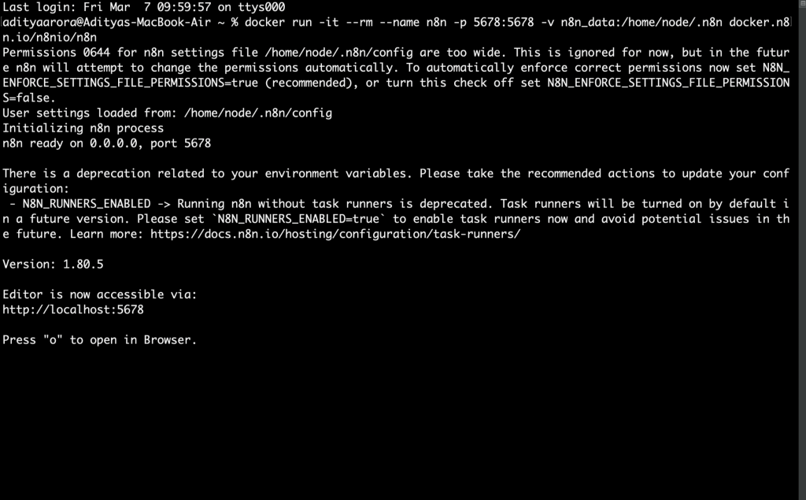
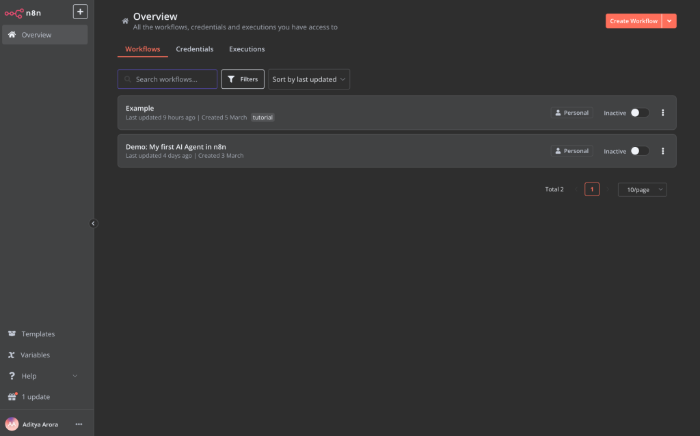
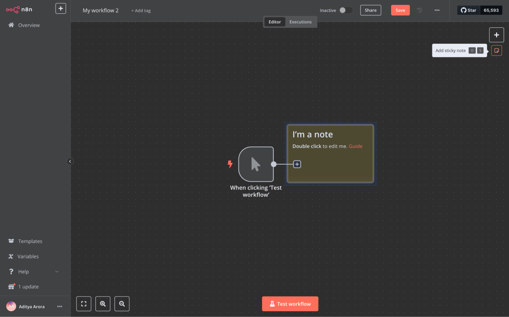
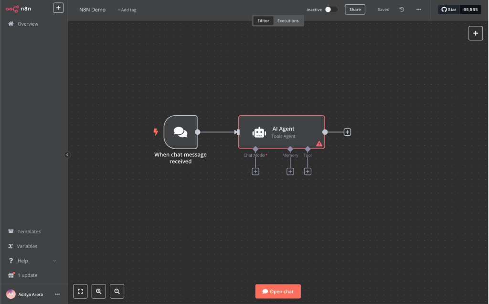

<figure>


<figcaption>

_Created using DALL.E on 10 March 202_5

</figcaption>

</figure>

## Author

- Aditya Arora (**ORCID:** [0009-0006-5800-1198](https://orcid.org/0009-0006-5800-1198))

## Introduction

In this comprehensive guide, we will walk through creating an intelligent AI calendar assistant which will combine n8n's workflow automation with OpenAI's powerful GPT models. The best part? We'll be running everything locally on your Mac, with full control over your data and no monthly subscription fees.

n8n stands for “nodemation” and is a powerful open-source workflow automation tool that connects various apps and services through an intuitive visual interface. Think of it as building with digital Lego blocks—each block (or node) represents a specific action or service that you can connect to create complex automations. What makes n8n particularly valuable is its ability to run locally while still offering enterprise-grade capabilities.

By integrating OpenAI's GPT into our n8n workflow, we will create a natural language pipeline that transforms simple requests like "Schedule a meeting with Mark next Tuesday afternoon" into actual calendar events. Your AI assistant will check your availability, suggest suitable times, and handle the calendar mechanics for you—all through conversational interactions.

Although this blog focuses on Mac, the steps should be similar for Windows. Also, before we proceed, ensure you have the following:

- **Docker Installed:** Docker Desktop on Mac/Windows or Docker Engine on Linux.

- **API Credentials:**
    - An OpenAI API key (for GPT).
    
    - Google Cloud API credentials to integrate Calendar functionalities.

## Part 1: Installing n8n Locally with Docker

There are benefits of using Docker to install n8n:

- Simplified setup: Docker makes it easy to install and run n8n and its necessary dependencies.

- Portability: Docker containers can easily move between different operating systems, avoiding compatibility issues and making it easy to migrate to various hosts or deploy to servers.

From your terminal, run the following code:

```
docker volume create n8n_data
docker run -it --rm --name n8n -p 5678:5678 -v n8n_data:/home/node/.n8n docker.n8n.io/n8nio/n8n
```

This command creates a volume to store persistent data, downloads the required n8n image, and starts your container, exposed on port 5678. To save your work between container restarts, it also mounts a docker volume, n8n\_data, to persist your data locally.

Once running, you can access n8n by opening: [http://localhost:5678](http://localhost:5678)\[1\]

For every subsequent run, just type the second command in the terminal.

<figure>



<figcaption>

commands running on terminal to run n8n locally

</figcaption>

</figure>

<figure>



<figcaption>

n8n dashboard

</figcaption>

</figure>

### Understanding the n8n Interface

Before diving into building our AI agent, let's get familiar with the n8n interface:

- **Canvas**: The central area where you'll build your workflows

- **Nodes**: Building blocks of any workflow (triggers, actions, etc.)

- **Editor/Executions tabs**: Toggle between building and monitoring your workflow

- **Save button**: Located at the top to save your progress

- **Sticky notes**: Optional notes to keep your workflow organised

<figure>



<figcaption>

n8n Interface

</figcaption>

</figure>

## Part 2: Creating an LLM Pipeline Using the GPT API

### Building a Basic AI Agent

Now let's create an AI agent that can understand natural language requests and respond intelligently using GPT:

**Step 1: Set Up the Trigger**

1. Click the plus button in the middle of the canvas

3. In the search bar, type "chat" and select "Chat Trigger" from the results

5. This creates a trigger node that will act as the starting point for your workflow

7. You can rename this node by clicking the three dots and selecting "Rename"

9. The Chat Message trigger creates a native chat interface within n8n where we can test our agent

**Step 2: Configure the AI Agent**

1. Click the plus button after the Chat Message node to add a new node

3. Navigate to the "Advanced AI" section (or search for "AI Agent")

5. Select "AI Agent" from the options

7. You'll notice that the node expands to show three sections:
    - Chat Model (the LLM that powers your agent)
    
    - Memory (how your agent remembers previous interactions)
    
    - Tools (what capabilities your agent will have)

<figure>



<figcaption>

workflow with chat trigger and AI Agent

</figcaption>

</figure>

**Step 3: Set Up the Chat Model**

1. Click on the "Chat Model" option

3. Select "OpenAI" from the dropdown menu

5. You now need to connect your OpenAI account:
    - Click "Select Credentials" then "Create New Credential"
    
    - Navigate to [platform.openai.com](https://platform.openai.com)
    
    - Sign up or log in to your account
    
    - Go to Settings → [Billing](https://platform.openai.com/settings/organization/billing/overview) to set up payment (add $5-10 for testing)
    
    - Navigate to Settings → [API Keys](https://platform.openai.com/settings/organization/api-keys)
    
    - Click "Create new secret key"
    
    - Name it (e.g., "n8n Agent") and select your project
    
    - Copy the generated API key (you won't be able to see it again)

7. Paste your API key into n8n's credential form

9. Name your credential (e.g., "n8n Agent") and click Save

11. Back in the Chat Model section, select your preferred model:
    - For testing on a budget, choose "gpt-4o-mini"
    
    - For more complex tasks, consider "gpt-4.5 Preview" (more expensive but more capable)

<figure>


<figcaption>

open ai platform to create new api key

</figcaption>

</figure>

<figure>


<figcaption>

n8n node to setup gpt credentials

</figcaption>

</figure>

**Step 4: Add Memory Capability**

1. Click on the "Memory" option in your AI Agent node

3. Select "Window Buffer Memory" - this is the simplest memory type to get started with

5. Keep the default "Context Window Length" of 5 (this controls how many past messages the agent remembers)

7. The "Session ID Source" should automatically be set to pull from the Chat Message node

9. This memory configuration will allow your agent to maintain context throughout a conversation


basic memory configuration for AI Agent

**Step 5: Add a Basic Tool for Testing**

1. Click the plus button in the Tools section

3. For a simple test, search for and select "Calculator"

5. No configuration is needed for this basic tool

7. Save your workflow by clicking the Save button at the top of the screen

9. Click "Chat" to test your agent with some basic questions:
    - Try a question that doesn't need calculation, like "What's your favourite city?"
    
    - Then try a calculation question like "What is 2+5?"

11. You can click on the execution flow to see exactly how the agent processed your request

<figure>


<figcaption>

basic workflow with calculation capability

</figcaption>

</figure>

### Creating a Calendar Assistant

Now let's transform our basic agent into a powerful calendar assistant by connecting it to Google Calendar:

**Step 1: Configure Google Cloud for API Access**

1. Remove the Calculator tool from your agent

3. Following the [documentation](https://docs.n8n.io/integrations/builtin/credentials/google/oauth-single-service/), go to [Google Cloud Console](https://console.cloud.google.com)

5. Create a new project:
    - Click on the project dropdown at the top of the page
    
    - Select "New Project"
    
    - Name it "N8N Demo" (or something memorable)
    
    - Click "Create"

7. Make sure your new project is selected in the dropdown

9. Enable the Google Calendar API:
    - In the left sidebar, navigate to "APIs & Services" → "Library". Enable APIs and Services
    
    - Search for "Google Calendar API" and select it
    
    - Click "Enable"

11. Set up the consent screen:
    - Fill in required app information (name, support email, developer contact)
    
    - Skip optional fields and continue through the setup
    
    - For OAuth Client ID Application type, select “Web Application” and give it a name
    
    - Paste “[http://localhost:5678/rest/oauth2-credential/callback](http://localhost:5678/rest/oauth2-credential/callback)” in the “Authorised Redirect URLs” section

13. Click the “Edit OAuth Client” button and copy the “client secret key” and “client id”

<figure>


<figcaption>

google cloud console setup

</figcaption>

</figure>


<figure>


<figcaption>

client id and secret credentials

</figcaption>

</figure>

**Step 2: Add Calendar Event Creation Tool**

1. Click the plus button in the Tools section of your AI Agent

3. Search for and select "Google Calendar Tool"

5. Click "Select Credentials" → "Create New Credential"

7. Paste in your Client ID and Client Secret from Google Cloud that we copied earlier

9. Click "Sign in with Google" and follow the authorization flow

11. Once connected, configure the tool:
    - Set "Resource" to "Event"
    
    - Set "Operation" to "Create"
    
    - Select your calendar from the dropdown
    
    - For "Start Date" click "Expression" and enter: {{ $fromAI('start\_date') }}
    
    - For "End Date" click "Expression" and enter: {{ $fromAI('end\_date') }}
    
    - Under Additional Fields, click "Add Field" to add "Summary"
        - Select "Expression" and enter: {{ $fromAI('summary') }}
    
    - Click "Add Field" to add "Description"
        - Select "Expression" and enter: {{ $fromAI('description') }}

13. For "Tool Description," you can click "Set Manually" and enter: "This tool is used to create calendar events"

15. Rename the node to "Create Event" for clarity

<figure>


<figcaption>

create event node configuration

</figcaption>

</figure>

**Step 3: Add Calendar Availability Search Tool**

1. Add another Google Calendar tool to your agent

3. This tool will use the same Google credentials you already set up

5. Configure it as follows:
    - Set "Resource" to "Calendar"
    
    - Set "Operation" to "Availability"
    
    - Select your calendar from the dropdown
    
    - For "Start Time" click "Expression" and enter: {{ $fromAI('start\_time') }}
    
    - For "End Time" click "Expression" and enter: {{ $fromAI('end\_time') }}
    
    - Set "Output Format" to "Raw" (this gives the most complete data)
    
    - Set "Time Zone" to your local time zone (e.g., "Australia/Canberra")

7. For "Tool Description," enter: "This tool is for searching for available time slots in my calendar"

9. Rename the node to "Search Availability"

<figure>


<figcaption>

search availability node configuration

</figcaption>

</figure>

### Troubleshoot:

While trying to sign in with google above, you may encounter the below error:

```
Client authentication failed (e.g., unknown client, no client authentication included, or unsupported authentication method). More details {"error":"invalid_client","error_description":"Unauthorized"} Failed to connect. The window n8n can be closed now.
```

To solve this issue, go to the “Audience” page and add your email address under “Test users”.

<figure>


<figcaption>

adding test user

</figcaption>

</figure>

**Step 4: Create a Detailed System Message**

1. Click on the main AI Agent node

3. Click "Add Option" and select "System Message"

5. This is where you give your agent its personality and instructions

7. Enter a detailed system message:

```
Your role is my calendar assistant. Your primary responsibilities are:

1. Helping me find available time slots in my calendar

2. Creating new calendar events when requested

3. Managing my schedule efficiently

When I ask about availability, use the Search Availability tool to check my calendar first. When I ask to schedule something, first check if the time is available before creating an event.

Always confirm the details with me before creating a new event, including:

- The exact date and time

- Duration of the event

- Summary (title) of the event

- Any additional description needed

Be conversational and helpful in your responses.

Today is {{ $now.format('cccc') }} the {{ $now.format('yyyy-MM-dd HH:mm') }}.

Be conversational and helpful in your responses.

Note: The date expression ensures the agent always knows the current date and time, which is crucial for calendar operations
```

**Step 5: Save and Test Thoroughly**

1. Save your workflow by clicking the Save button

3. Click "Chat" to open the testing interface

5. Test availability searches with queries like:
    - "What's my availability for tomorrow?"
    
    - "Do I have any free time next Tuesday afternoon?"
    
    - "Show me my available slots for the rest of the week"

7. Test event creation with queries like:
    - "Schedule a meeting with John tomorrow at 2 PM"
    
    - "Create a dentist appointment next Wednesday at 10 AM"
    
    - "Add a team stand-up every Monday at 9 AM for the next 4 weeks"

<figure>


<figcaption>

testing our workflow

</figcaption>

</figure>

<figure>


<figcaption>

testing our workflow

</figcaption>

</figure>

Common Issues and Solutions:

- **Wrong Date/Time**: Make sure your system message includes the current date expression

- **No Available Slots**: Check the output format in the Search Availability node

- **API Errors**: Verify your Google Calendar permissions are set correctly

## Conclusion and Next Steps

Congratulations! You now have a working AI calendar assistant. Here are some ways to extend it:

- Add more tools for rescheduling or canceling events

- Improve the system message with more specific instructions

- Connect it to other communication channels like email or Slack

By combining n8n's workflow automation with OpenAI's GPT models, you've created a powerful AI assistant that saves you time on calendar management. The possibilities for extending this approach to other areas of your work are endless!

> _For the Medium version of this article, click [here](https://medium.com/@researchgraph/how-to-install-n8n-on-mac-and-create-an-llm-pipeline-using-gpt-api-2e2ec367aed0)._

## References

- [https://docs.n8n.io/hosting/installation/docker/](https://docs.n8n.io/hosting/installation/docker/)

- [https://docs.n8n.io/integrations/builtin/credentials/google/oauth-single-service/#create-a-google-cloud-console-project](https://docs.n8n.io/integrations/builtin/credentials/google/oauth-single-service/#create-a-google-cloud-console-project)
