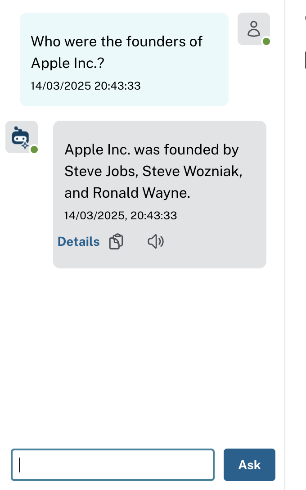

## LLM-Graph-Builder: Converting Data into a Knowledge Graph

[Source: DALLE-3](https://openai.com/index/dall-e-3)

## Author

- Harshitha Thoram (**ORCID:** 0009-0007-4527-7926)

## Introduction

Creating structured graphs out of unstructured text can be both exciting and challenging. At its core, you’re transforming free-form sentences into connected entities and relationships—effectively turning text into a network of information that’s much easier to analyse and query.

This concept of extracting knowledge from text and structuring it as graphs isn’t entirely new; however, the rise of Large Language Models (LLMs) has propelled it into the mainstream. As LLMs continue to mature, they provide increasingly sophisticated ways to capture entities, attributes, and relationships from raw text sources.

## Why Build a Knowledge Graph from Text?

One primary motivation is to support Retrieval-Augmented Generation (RAG). Using text embedding models on unstructured data can sometimes work well, but falls short with complex, multi-hop queries or questions requiring filtering, sorting, or aggregations across multiple entities. When you convert text into a knowledge graph, you gain a structured framework that is:

- **Highly Queryable**: Graph databases allow for easy querying of relationships between entities, enabling precise retrieval.

- **Scalable**: New information or data sources can be integrated without disrupting existing structures.

- **Adaptable to Complex Questions**: With a graph, you can chain multiple relationships and properties to answer queries that would be difficult (or impossible) with unstructured text alone.

## The LLM Graph Transformer

Over the past year, developers and researchers—including contributors to LangChain—have experimented with using LLMs to build knowledge graphs. These experiments revealed insights into the best practices for converting large amounts of text into meaningful, linked entities. As a result, a component called the **LLM Graph Transformer** was added to LangChain, simplifying the process of extracting structured knowledge from text.

## Building your Graph Using Neo4j (Web version)

Neo4j is a popular graph database known for its flexibility and robust tooling.

- Set up a Free Neo4j Instance Aura(Hosted)

1. Sign Up: Go to [Neo4j Aura](https://neo4j.com/product/auradb/?utm_source=GSearch&utm_medium=PaidSearch&utm_campaign=Evergreen&utm_content=APAC-Search-SEMBrand-Evergreen-None-SEM-SEM-NonABM&utm_term=aura%20db&utm_adgroup=auradb&gad_source=1&gclid=CjwKCAjwp8--BhBREiwAj7og1x0I1SyB1lGGw2l71btjTSqR7KyvpR6mO_iPK_ga6UGHi6C4TFJlYRoC-i0QAvD_BwE) and create an account (there’s a free tier available).

3. From the Aura dashboard, click **“New Instance”** and select the **Free** tier.

5. Give your database a name, choose a region, and wait for it to spin up.

7. Once your database is live, click on “Connection” or “Details” to find the Bolt URL, username, and password.

9. The URL often looks like `neo4j+s://<your_db_id>.databases.neo4j.io`.

11. Keep these credentials safe for the next step.

- Configure llm-graph-builder for Neo4J

Open the [LLM-Knowledge Graph Builder](https://llm-graph-builder.neo4jlabs.com/)

Whether you installed Neo4j locally or you’re using a hosted solution like Neo4j Aura (free tier or paid), you’ll need to capture your connection details like uri, username and password for llm-graph-builder.

Once an instance is connected, we can upload or link to text documents, articles, websites—whatever unstructured text you want as shown in the image

Below is a simple demonstration of how you might take a Wikipedia article, load it into your LLM-Knowledge Graph Builder connected to Neo4j, and then run a quick question-answering session against the generated knowledge graph.. This will show you end-to-end how to **ingest** unstructured text, **build** a graph, and finally **query** that graph via the integrated chat interface.

For this example, we’ll use the Wikipedia page for **Apple Inc.** (just as an illustrative sample).

Navigate to web sources and choose wikipedia. Then enter the link [Apple inc](https://en.wikipedia.org/wiki/Apple_Inc.) to upload the wikipedia information on apple

You’ll typically see the document’s “Name” and “Status” columns. Once uploaded, the Status may indicate “Uploaded” or “Ready.”

**Generating the Graph**

Once your text or data source is uploaded to the LLM-Knowledge Graph Builder, the process of creating the graph begins:

**Extraction via LLM**: The builder sends the text in batches to the selected LLM (e.g., “OpenAI GPT-4”), which identifies potential entities (people, organizations, products, dates, etc.) and the relationships between them (founded\_by, created, headquartered\_in, etc.). This step relies on a specialised prompt that guides the model to focus on relevant information.

**Node and Edge Creation:** As the model identifies entities and relationships, the tool automatically creates nodes (for entities) and edges (for relationships) in the connected Neo4j database. In many cases, a structured preview is provided, allowing verification before finalizing. The process generated **621 nodes** and **1,728 relationships** as shown, highlighting just how much information can be extracted from what might seem like a “basic” text source.

**Note**: If you’re using LangChain or a similar framework programmatically, you can specifically set the entities or relationships to look for. For instance, you might only want People, Companies, Founding Years, and Headquarters. However, in the current web version of the LLM-Knowledge Graph Builder, these extraction rules aren’t yet customizable—you simply rely on the model’s generic extraction capabilities.

There is also LLM-Knowledge Graph Chat panel on the right as shown in the above image that allows you to pose natural-language queries about the ingested documents or videos. For instance:

  

The tool arrives at this answer by traversing the knowledge graph for any nodes related to “Apple Inc.” via `FOUNDED_BY` (or a similarly labeled edge), collecting those person nodes, and then constructing a natural-language response for you.

Instead of a single-hop question (like founders), you can chain relationships. For example, “Which products were introduced by Apple after 2007?” or “What roles did Steve Jobs hold at the company?”

By following these steps, you can quickly turn public (or internal) text sources into an interactive knowledge graph.

## Conclusion

As textual data (or even video transcripts, audio metadata, articles, etc.) grows in volume and complexity, building a knowledge graph allows for efficient querying, filtering, and analysis. Instead of searching through disorganized blocks of text, you have a structured, interconnected data model. This is particularly important for Retrieval-Augmented Generation (RAG) workflows, where LLMs benefit from being able to quickly reference precise, interconnected facts rather than scanning large, unstructured documents.

> _The Medium version of this article can be found [here](https://medium.com/@researchgraph/an-introduction-to-llm-graph-builder-f309920fd2c1)._

## References

- [https://en.wikipedia.org/wiki/Apple\_Inc](https://en.wikipedia.org/wiki/Apple_Inc).
