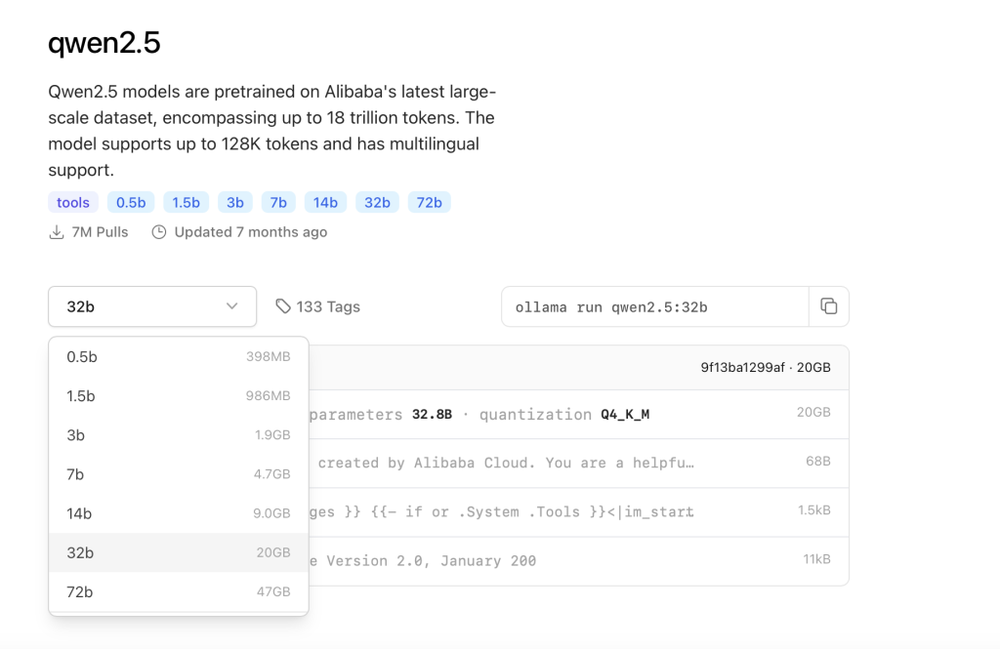

<figure>


<figcaption>

Image Created by GPT-4o

</figcaption>

</figure>

## Introduction

This article presents my hands-on experience with **Qwen2.5-MAX**, an advanced open-source large language model developed by Alibaba. I set up and explored this model on my personal computer to evaluate its capabilities against GPT-4.5, a recognised leader in AI technology. Through practical tests involving diverse prompts, this exploration provides insights into Qwen2.5-MAX's strengths and comparative performance in technical, creative, and logical reasoning tasks.

**Qwen2.5-Max** is the most powerful version of the Qwen2.5 series, developed by Alibaba Cloud. It represents the highest-capacity model variant, designed for tasks requiring advanced reasoning, creative generation, and deep contextual understanding. With **72 billion parameters**, Qwen2.5-Max is pretrained on a massive 18-trillion-token multilingual and multi-domain dataset, supporting context windows of up to **128,000 tokens**.

## Installation and Setup

### Step1: Install Ollama Platform

Because Qwen2.5-MAX is not free and open source, I will provide you with guidance on how to deploy Qwen2.5 locally. I installed **Qwen2.5** on my personal computer using the **Ollama platform**, which provided an efficient, user-friendly environment for deploying and managing local AI models. Ollama simplified the installation process significantly, allowing rapid setup and immediate testing.

Download Ollama from [https://ollama.com](https://ollama.com), Choose the appropriate version according to your operating system.


#### Step2: Install Qwen2.5 locally

Find the models list on Ollama website, And you can find Qwen2.5 in the list.


Qwen2.5 offers various model sizes ranging from 0.5B to 72B parameters, allowing users to choose the most suitable version based on their device's available resources. For example, the 32B variant, which I selected, requires approximately 20GB of storage space and offers a good balance between performance and resource demand.




You can copy the command and run it in your terminal


After you download the model to your local machine you can check using **ollama list**


Then you can use **ollama run qwen2.5:7b** to chat with the model


Also you can use the Qwen-Max model on the official website [https://chat.qwen.ai](https://chat.qwen.ai/c/299d52cc-950a-43a5-8a22-64b010246a6d)

### Comparative Analysis Using Prompts

To deeply evaluate the practical performance of **Qwen2.5-Max**, I conducted several tests comparing its responses to those of **GPT-4.5** across multiple types of tasks. Below are the prompts used, followed by a summary of the observed performance differences.

#### Logical Reasoning

**Prompt:**"Three friends, Alex, Bob, and Carol, have apples. Alex has three times as many apples as Bob, and Carol has half as many apples as Alex. If Bob has 4 apples, how many apples do they have in total?”

<figure>


<figcaption>

**_Answer by GPT4.5_**

</figcaption>

</figure>

<figure>


<figcaption>

**_Answer by Qwen 2.5_**

</figcaption>

</figure>

We can see that both models get the correct results, but we can find that Qwen 2.5 has an extra step to define variables. I think this shows that Qwen 2.5 has stronger generalization ability, that is, it can solve similar problems of the same type, while GPT 4.5 focuses more on the current problem.

#### Concept Explanation

**Prompt:**"Explain quantum computing in simple terms within 200words”

<figure>


<figcaption>

**_Answer by GPT4.5_**

</figcaption>

</figure>


We can find that both models provide good answers to some of the latest scientific and technological concepts.

#### Solving practical coding task

**1\. Art painting task:** First task is about generate a dynamic art painting. Here is the prompt:

```
Write a program to generate a dynamic art painting. Multiple points are randomly generated on the canvas. These points will move according to certain rules (such as random walk, mutual repulsion, following the mouse, etc.) and leave tracks. Finally, a dynamic art work that changes over time is generated.
```

Here is the result given by Qwen2.5-Max:

And here is the result given by GPT-o4-mini-high;

We can see that they both completed the task successfully, but in my opinion, Qwen2.5-Max's result is more in line with the requirement of "art painting". The result given by gpt is very messy, just some randomly generated points and lines. So I think Qwen2.5-Max is the one with better performance.

**2\. 2D physics simulation system task**: the second task is about a 2D physical system. Here is the prompt:  

```
# Python 2D physics simulation system test questions - cross-rotating regular hexagons

## Basic requirements
Design a 2D physics simulation system to implement the following specific scenarios:

### Geometric system:
- Two regular hexagons of the same size, cross-overlapping each other
- The regular hexagon on the left rotates counterclockwise (fixed speed)
- The regular hexagon on the right rotates clockwise (fixed speed)
- The cross-overlapping part of the two regular hexagons accounts for about half of their respective areas
- The initial position of a red ball is at the center of the overlapping area of ​​the two regular hexagons

### Physical characteristics:
- Implement basic Newtonian mechanics (gravity, collision)
- The collision between the ball and the boundary of the regular hexagon needs to consider the influence of angular momentum (the rotating surface applies tangential force to the ball)
- The ball must have an appropriate elastic coefficient so that it can continue to bounce in the overlapping area
- The direction of gravity is fixed downward
- The ball cannot fall out or pop out of the cross-overlapping part of the two regular hexagons

### Operation mechanism:
- The system automatically runs the physical simulation after startup
- Two regular hexagons rotate towards each other at a fixed speed
- The red ball moves in the overlapping area under the influence of collision, gravity and angular momentum of the rotating surface

### Visualization:
- Use any Python graphics library (such as Pygame, Pyglet or Tkinter)
- The regular hexagon on the left is represented by a blue line
- The regular hexagon on the right is represented by a green line
- The overlapping area is displayed in different colors (such as purple or light gray)
- Display the movement trajectory of the red ball (the trajectory gradually disappears)
- Optional display of current physical parameters (such as ball speed, acceleration)

## Technical requirements:
- Correctly implement the creation and rotation of geometric shapes
- Accurately calculate the collision detection between the regular hexagon boundary and the ball
- Correctly handle the influence of the rotating surface on the angular momentum of the ball
- Maintain the physical stability of the system so that the simulation can run for a long time

## Submission requirements:
- Complete Python code, including necessary comments
- A brief document describing the implementation ideas
- Explanation of key physical algorithms

Make sure the red ball can continue to move in the overlapping area of ​​two rotating regular hexagons
and be affected by two regular hexagons rotating in opposite directions, showing interesting physical motion trajectories.
```

This time Qwen2.5-Max successfully meets all the requirements but GPT-o4-mini-high failed the core part of the task.

Here is the result by GPT-o4-mini-high:  

Here is the result by Qwen2.5-Max:

### Conclusion

After comparing Qwen2.5-Max with other mainstream models like GPT-4o, I found that for **basic and straightforward tasks**, such as factual Q&A or simple logical problems, **there is little noticeable difference** in performance between them. However, when it comes to **more complex coding tasks or advanced reasoning problems**, **Qwen2.5-Max consistently demonstrated stronger capabilities**, producing more accurate and structured responses. This makes it a highly competitive choice, especially for developers and researchers seeking a powerful open-source alternative that can run locally with sufficient hardware support.

Ultimately, my experience with Qwen2.5-Max highlights the impressive progress of open-source language models in recent years. Its ability to perform on par with, and in some cases outperform, commercial models like GPT-4o—especially in technical domains—demonstrates its real-world applicability. With flexible deployment via platforms like Ollama and support for various model sizes, Qwen2.5 provides users with both power and adaptability. For anyone interested in AI development, local experimentation, or cost-effective alternatives to commercial APIs, Qwen2.5-Max is undoubtedly worth exploring.
