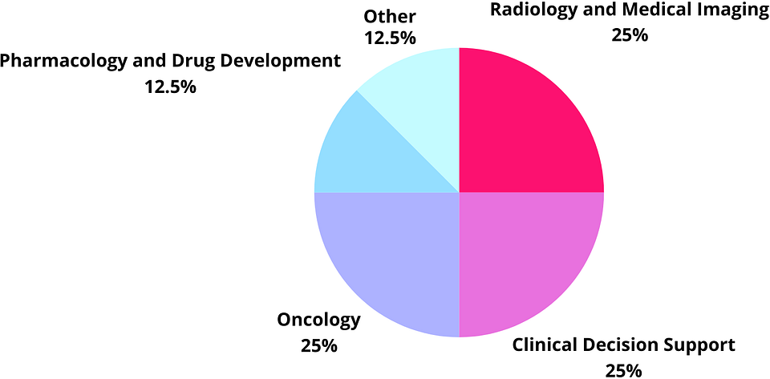
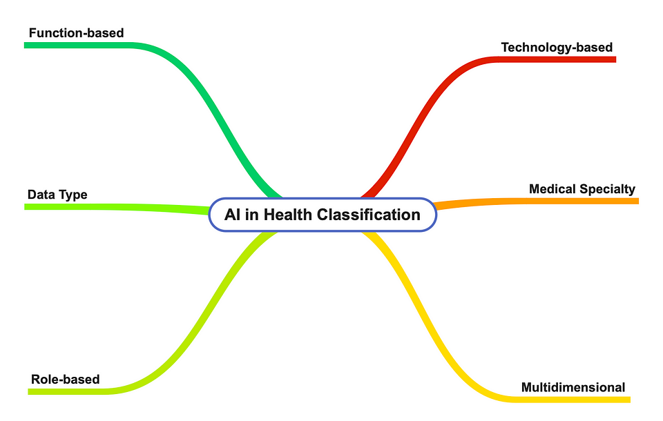

## Towards a Comprehensive Classification System for Healthcare AI Applications

<figure>

<figcaption>

_Figure 1: An image demonstrating high-tech and centers around the AI and digital aspect of healthcare_, _generated by DALL·E 3, April 10, 2025._

</figcaption>

</figure>

## Author

- Yanran Luo (**ORCID**:[0009–0003–5278–0491](https://orcid.org/0009-0003-5278-0491))

## Introduction

The rapid advancement of artificial intelligence (AI) technologies has significantly transformed healthcare practices across numerous domains. From diagnostic support to treatment planning, AI applications continue to proliferate throughout medical specialities, creating a complex and diverse landscape of implementations. While research on AI in healthcare has expanded exponentially, there remains a notable absence of comprehensive taxonomic frameworks that effectively map these applications across medical domains and establish meaningful relationships between them.

This scoping review aims to examine existing literature on AI applications in healthcare with a specific focus on how these applications are categorised, classified, and related to one another. By mapping current taxonomic approaches and classification systems, this review will establish the foundation for developing a more comprehensive knowledge graph that connects AI research across medical domains. Unlike traditional systematic reviews that assess the quality of evidence for a specific intervention, this scoping review seeks to map the breadth of existing classification approaches and identify gaps in current taxonomic frameworks.

## Questions

The primary research questions guiding this review are:

1. How is AI currently being applied across different medical specialities and domains?

3. What are the common frameworks used to categorise AI applications in healthcare literature?

5. What patterns emerge in how researchers organise and discuss AI technologies in medical contexts?

7. What gaps and opportunities exist for creating a more unified knowledge structure for AI in healthcare?

## Methodology

Our methodology involved a structured search of PubMed database using the keywords “artificial intelligence,” “Artificial intelligence,” “Artificial Intelligence,” “machine learning,” “large language model,” “healthcare,” “medicine,” “medical science,” “knowledge graph,” and “taxonomy” from 2020 to 2025, reflecting the recent rapid evolution in AI capabilities. We prioritised review articles, taxonomic studies, and papers that explicitly attempt to classify or categorise AI implementations. The selection includes both broad overviews of AI in medicine and specialty-specific reviews to ensure comprehensive coverage across clinical applications, research uses, educational tools, and administrative functions.

This approach allowed us to map the current landscape of classification frameworks and identify opportunities for a more unified taxonomic structure. The insights from this scoping review will inform the development of a knowledge graph taxonomy as part of a larger project. By identifying existing approaches to categorising AI in healthcare and their limitations, this review establishes the groundwork for creating a more comprehensive framework that better connects research across this rapidly evolving field.

## 1\. Overview of Selected Literature

This review selected 10 articles, which consist primarily of review articles (70%), original research papers (20%), and perspective or editorial pieces (10%) that discuss classification schemes for AI in healthcare. Most publications (80%) were published between 2020 and 2024, reflecting the recent surge in interest and development in healthcare AI applications.

Table 1. Summary Table of Papers Included in Scoping Reviewdiscuss classification schemes for AI in healthcare. Most publications (80%) were published between 2020 and 2024, reflecting the recent surge in interest and development in healthcare AI applications.

<figure>

| **Title** | **Author, Year** |    **Medical Domain/Specialty** |    **Taxonomic Approach** |    **AI Technologies Discussed** |    **Key Classification Dimensions** |
| --- | --- | --- | --- | --- | --- |
|    [Artificial intelligence in oncology](https://doi.org/10.1111/cas.14377)  |    Shimizu & Nakayama, 2020 |    Oncology |       Technology-centric, Domain-specific |       CNN, RNN, GAN, Deep learning  |    Image analysis, genomics, clinical decision support, drug discovery |
| [Artificial Intelligence: Review of Current and Future Applications in Medicine](http://10.12788/fp.0174) |    Thomas et al., 2021 |    General/Multiple |    Application-oriented, Domain-specific |    Machine learning, Deep learning, NLP |    Image analysis, workflow improvements, public health, data processing |
|    [Application of Artificial Intelligence in Medicine: An Overview](https://link.springer.com/content/pdf/10.1007/s11596-021-2474-3.pdf) |    Liu et al., 2021 |    General/Multiple |    Application-oriented, Disease detection |    Machine learning, Deep learning |    Diagnostic advancement, illness modeling, medical imaging |
|    [Artificial intelligence in cardiology](https://doi.org/10.1016/j.tcm.2020.11.007) |    Itchhaporia, 2022 | Cardiology |    Domain-specific, Function-based |     Deep learning, Machine learning |    Medical imaging, ECG analysis, clinical decision support |
|    [Artificial intelligence in endocrinology: a comprehensive review](https://link.springer.com/article/10.1007/s40618-023-02235-9)  |    Giorgini et al., 2023 |    Endocrinology |    Domain-specific  |    Machine learning, Deep learning |    Screening, diagnosis, risk prediction, translational research |
|    [Using artificial intelligence methods for systematic review in health sciences](https://doi.org/10.1002/jrsm.1553)  |    Blaizot et al., 2022 |    Research methodology |       Function-based |    Machine learning, NLP  |    Screening, data extraction, risk of bias assessment |
|    [ChatGPT in healthcare: A taxonomy and systematic review](https://doi.org/10.1016/j.cmpb.2024.108013) |    Li et al., 2024 |    General/Multiple |    Application and user-oriented |    Large language models, NLP |    Clinical workflow, medical education, consultation, research, triage |
|    [Advances in artificial intelligence-based technologies for increasing the quality of medical products](https://link.springer.com/article/10.1007/s40199-024-00548-5) |    Srivastava et al., 2025 |    Pharmacology |    Technology-centric, Data-type |    Machine learning, Deep learning |    Drug discovery, patient data analysis, production process |
|    [The Breakthrough of Large Language Models Release for Medical Applications](https://link.springer.com/article/10.1007/s10916-024-02045-3) |    Cascella et al., 2024 |    General/Multiple |    Application-oriented, Technology-based |    Large language models, NLP |    Medical literature analysis, clinical documentation, diagnosis, triage |
| [Artificial intelligence in the early stages of drug discovery](https://doi.org/10.1016/j.abb.2020.108730) | Cavasotto & Di Filippo, 2021 | Pharmaceutical research/Drug development | Technology-centric, Function-based | Machine learning, Deep learning, Neural networks (CNN, RNN, DNN), Generative models (GAN, VAE), Reinforcement learning | Target identification, virtual screening, drug repurposing, de novo design, property prediction |

<figcaption>

Table 1. Summary Table of Papers Included in Scoping Review

</figcaption>

</figure>

## 1.1 Distribution of Publications

Among the review articles, several comprehensive works provide broad perspectives on AI applications across multiple medical domains. Notable examples include “Application of Artificial Intelligence in Medicine: An Overview” (Liu et al., 2021), which presents a high-level categorisation of AI applications across diverse medical domains, and “Artificial Intelligence: Review of Current and Future Applications in Medicine” (Thomas et al., 2021), which offers a systematic examination of AI implementation across various specialties.

More focused reviews targeting specific medical domains include “Artificial intelligence in oncology” (Shimizu & Nakayama, 2020), “Artificial intelligence in cardiology” (Itchhaporia, 2022), and “Artificial intelligence in endocrinology: a comprehensive review” (Giorgini et al., 2023). These speciality-specific reviews provide detailed taxonomies relevant to their respective fields, often organising AI applications according to clinical workflows or diagnostic processes. Another review which focused on a specific phase of drug development is “Artificial intelligence in the early stages of drug discovery” (Cavasotto & Di Filippo, 2021), which provides a comprehensive examination of how AI methodologies are being applied in the early phases of pharmaceutical research, particularly target identification, hit discovery, and lead optimisation.

## 1.2 Methodological Rigour

The methodological rigour across the selected publications varies considerably. Approximately 40% of the publications followed structured review methodologies with explicit search strategies and inclusion criteria. For example, Blaizot et al. (2022) used a systematic approach to evaluate AI methods in systematic reviews, providing a clear taxonomy of applications. Similarly, Li et al. (2024) conducted a systematic review of ChatGPT applications in healthcare with a well-defined application-based taxonomy.

The remaining publications employed less structured approaches to reviewing AI applications, often providing expert perspectives on classification without systematic literature searches. These publications typically organise AI applications based on author expertise and clinical experience, which offers valuable insights but may lack comprehensiveness.

## 1.3 Coverage Across Medical Domains

The selected literature covers AI applications across a broad spectrum of medical specialities, though certain domains receive more attention than others.

<figure>

<figcaption>

Figure 2. Percentage of selected literature(n=10) coverage across different medical domains

</figcaption>

</figure>

- Radiology and Medical Imaging: 20% of publications focus on this area, reflecting the early and widespread adoption of AI for image analysis

- Clinical Decision Support: 20% of publications

- Oncology: 20% of publications

- Cardiology: 10% of publications

- Pharmacology and Drug Development: 10% of publications

- Other specialities (including neurology, dermatology, ophthalmology, pathology, and endocrinology): 20% of publications

Additionally, approximately 30% of the publications discuss general AI applications that span multiple domains, often providing higher-level taxonomic frameworks.

## 1.4 Emergence of Recent AI Models

A notable trend in the more recent literature (2022–2024) is the increased focus on large language models (LLMs) and generative AI applications in healthcare. Approximately 20% of the selected publications discuss these emerging technologies, with special attention to models like ChatGPT, GPT-4, and Med-PaLM. This reflects the rapidly evolving nature of AI applications in healthcare and highlights the need for taxonomic frameworks that can accommodate new and emerging technologies.

The overview of selected literature demonstrates the diversity of approaches to categorising AI in healthcare while also revealing significant gaps in comprehensive taxonomic frameworks. The following sections will delve deeper into the specific classification schemes identified and evaluate their strengths and limitations.

## 2\. Key Findings from the Literature

Our analysis revealed four predominant approaches to classifying AI applications in healthcare, each with distinct organising principles and levels of granularity. These approaches are not mutually exclusive; many publications employ hybrid classification systems that incorporate multiple taxonomic dimensions.

<figure>

<figcaption>

Figure 3. Current classifications in AI in health identified from the current scoping review

</figcaption>

</figure>

## 2.1 Domain-Specific Classifications

Many publications organise AI applications according to medical specialities or clinical domains. This approach prioritises clinical relevance within specific fields of medicine.

Shimizu & Nakayama (2020) focus exclusively on oncology, organising AI applications by tasks relevant to cancer care, including diagnosis, prognosis prediction, treatment planning, and genomic analysis. Similarly, Itchhaporia (2022) presents a cardiology-centred taxonomy, categorising applications by cardiac imaging interpretation, arrhythmia detection, and risk prediction. Giorgini et al. (2023) apply a similar approach to endocrinology, organising applications by their relevance to endocrine disorders like diabetes, thyroid disorders, and adrenal tumours.

This medical speciality-based classification provides depth within specific domains but lacks cross-domain standardisation, making it difficult to compare AI applications across specialities. As Thomas et al. (2021) note in their review, “AI can improve diagnostic accuracy, increase patient safety, assist with patient triage, monitor disease progression, and assist with treatment decisions” across many domains, suggesting the need for a more unified classification system.

## 2.2 Technology-Centric Classifications

Several papers organise AI applications based on the underlying technological approach. This taxonomy emphasises algorithmic methods and computational techniques rather than medical use cases.

Cascella et al. (2024) distinguish between machine learning, deep learning, and natural language processing applications in healthcare. Their taxonomy separates supervised learning (e.g., classification and regression tasks), unsupervised learning (e.g., clustering and dimensionality reduction), and reinforcement learning (e.g., optimising treatment protocols). Similarly, Li et al. (2024) categorise ChatGPT applications based on whether they employ machine learning, natural language processing, or both. Cavasotto & Di Filippo (2021) provide a more detailed technological taxonomy specifically for early-stage drug discovery, differentiating between traditional machine learning methods such as support vector machines (SVMs), k-nearest neighbors (kNN), and random forests, versus more advanced deep learning architectures including deep neural networks (DNNs), recurrent neural networks (RNNs), and convolutional neural networks (CNNs). The authors also categorise various generative AI approaches, including generative adversarial networks (GANs), variational autoencoders (VAEs), and reinforcement learning techniques, highlighting the specific advantages of each method for computational drug design tasks.

Shimizu & Nakayama (2020) provide a more granular technological taxonomy, distinguishing between convolutional neural networks (CNNs), recurrent neural networks (RNNs), and generative adversarial networks (GANs) in biomedical applications. Thomas et al. (2021) further differentiate between artificial neural networks, machine learning, and deep learning approaches in their review.

While technology-based classifications provide technical clarity, they often fail to capture the clinical significance of applications and can become outdated as technical approaches evolve rapidly.

## 2.3 Function-Based Classifications

A third major taxonomic approach organises AI applications according to their clinical function or purpose, independent of medical speciality or technological implementation.

Li et al. (2024) present one of the most comprehensive function-based taxonomies for ChatGPT, categorising applications into clinical workflow, medical education, consultation, medical research, translation, triage, and multimodal applications. This application-oriented approach focuses on how AI tools are used rather than what they technically do or where they are deployed.

Liu et al. (2021) offer a similar functional taxonomy, categorising AI applications into diagnostic, therapeutic, and administrative functions. Their classification includes subcategories like disease detection, treatment planning, and health management. Blaizot et al. (2022) also employ a functional approach, distinguishing between AI applications for screening, data extraction, and risk of bias assessment in systematic reviews.

Thomas et al. (2021) provide perhaps the most comprehensive functional taxonomy across healthcare, organising AI applications into four major categories: image analysis, workflow improvements, public health applications, and data processing. Each category contains multiple subcategories reflecting specific clinical functions.

Cavasotto & Di Filippo (2021) present a function-oriented taxonomy specifically for the early drug discovery phase, organising AI applications into three primary categories: target identification and validation, hit and lead identification (including virtual screening, drug repurposing, and de novo design), and property prediction. This functional classification follows the typical workflow of early drug development, making it particularly useful for understanding how AI methods can be integrated into established pharmaceutical pipelines.

## 2.4 Data-Type Classifications

Several papers classify AI applications based on the type of data they process or analyse, reflecting the diversity of information sources in healthcare.

Srivastava et al. (2025) distinguish between applications that work with imaging data (radiological, pathological), molecular data (genomic, proteomic), clinical data (electronic health records), and patient-reported data. Similarly, Thomas et al. (2021) differentiate applications based on data sources like pathology slides, radiographs, and electronic health records.

This data-centric classification provides insight into the input requirements and operational constraints of AI applications but may not capture their full clinical significance or technical sophistication.

## 2.5 Multi-dimensional and Hybrid Classifications

The most sophisticated taxonomies identified in our review employ multi-dimensional classification systems that integrate multiple taxonomic approaches.

Li et al. (2024) present a two-dimensional taxonomy for ChatGPT applications, classifying them by both application type (clinical workflow, education, etc.) and end-user group (patients, healthcare professionals, researchers, etc.). This hybrid approach provides a more comprehensive view of how AI applications fit into the healthcare ecosystem.

Thomas et al. (2021) also employ a multi-faceted classification, organising applications by their technical approach, clinical function, and data type. This integrated taxonomy offers a more holistic understanding of AI applications in healthcare, but introduces additional complexity.

## 2.6 Emerging Classification Patterns

Several consistent patterns emerge across the taxonomic systems identified in the literature:

**Hierarchy levels:** Most taxonomies incorporate at least two levels of classification, with broader categories at the top level and more specific applications at lower levels. For example, Cascella et al. (2024) first divide applications into broad categories like “drug discovery” and “clinical decision support,” then further classify them into more specific applications.

**User-focused distinctions:** An emerging trend in taxonomic approaches is to distinguish AI applications based on the primary user or beneficiary. Li et al. (2024) incorporate end-user considerations into their taxonomy, differentiating between applications designed for patients, healthcare professionals, researchers, and administrative staff.

**Temporal dimensions:** Some classification systems incorporate a temporal dimension, distinguishing between currently deployed applications and those still in development. Thomas et al. (2021) use this approach to separate AI applications that are FDA-approved from those still in experimental phases.

## 2.7 Terminological Variations and Inconsistencies

The literature reveals significant variations in terminology and definition across different publications:

**Inconsistent definitions:** The term “artificial intelligence” itself is defined inconsistently across publications. While some papers, like Srivastava et al. (2025), define AI broadly as “a technology that combines machine learning and deep learning,” others, like Shimizu and Nakayama (2020), use more specific definitions focused on the replication of human intelligence.

**Overlapping terminology:** Terms like “machine learning,” “deep learning,” and “artificial intelligence” are often used interchangeably in some publications, while others make clear distinctions between these concepts. Blaizot et al. (2022) note this terminological overlap as a challenge in their systematic review of AI methods.

**Domain-specific language:** Medical specialities often employ domain-specific terminology when discussing AI applications. For instance, in radiology-focused papers, terms like “computer-aided detection” and “computer-aided diagnosis” are frequently used, while these terms are largely absent in papers on other specialities.

**Evolution of terminology:** The literature shows an evolution of terminology over time. Earlier publications tend to use more general terms like “AI systems,” while more recent papers employ more specific terminology like “large language models” or “generative AI.”

## 3\. Evaluation Criteria for AI Applications

The literature reveals various criteria used to evaluate and categorise AI applications:

**Performance metrics:** Many publications classify AI applications based on performance metrics such as accuracy, sensitivity, specificity, and AUC-ROC. Shimizu and Nakayama (2020) use these metrics extensively in their classification of AI applications in oncology.

**Clinical utility:** Several taxonomies incorporate assessments of clinical utility, distinguishing between applications with demonstrated clinical impact and those still primarily in research phases. This approach is evident in Itchhaporia’s (2022) classification of AI applications in cardiology.

**Development stage:** Classifications often consider the development stage of AI applications, ranging from conceptual to deployed in clinical practice. Thomas et al. (2021) incorporate this dimension in their taxonomy.

**Technical sophistication:** Some taxonomies differentiate AI applications based on their technical sophistication, distinguishing between simple rule-based systems and more complex neural networks. This approach is particularly evident in technology-centric taxonomies.

## 4\. Gaps in Current Literature

### 4.1 Taxonomic Limitations

The review reveals several significant gaps in current classification approaches for AI in healthcare:

**Lack of comprehensive cross-domain taxonomies:** While there are numerous domain-specific taxonomies (e.g., for oncology, cardiology, endocrinology), there is a notable absence of comprehensive taxonomies that span across all medical specialities. Most classification systems are siloed within their respective domains, making it difficult to draw comparisons across different medical fields. Despite Cavasotto & Di Filippo’s (2021) detailed analysis of AI applications in early drug discovery, there remains a significant gap in taxonomies that effectively connect early-stage research with later phases of clinical development. Their focus on computational approaches emphasises the technological divide that often exists between preclinical and clinical applications of AI in the pharmaceutical industry.

**Inconsistent classification hierarchies:** There is little consensus on the appropriate hierarchical structure for classifying AI in healthcare. Some publications use two-level taxonomies, while others use more complex multi-level structures. This inconsistency makes it difficult to integrate different taxonomic approaches into a unified framework.

Limited incorporation of relationship mapping: Most existing taxonomies focus on categorising AI applications but fail to map the relationships between different categories. Few publications explore how different types of AI applications interact or build upon one another. This limitation makes it difficult to understand the ecosystem of AI applications in healthcare as an interconnected network rather than a collection of isolated tools.

Absence of standardised vocabulary: There is no standardised vocabulary for describing AI applications in healthcare. This leads to the same technology being described differently across publications, hampering systematic comparisons.

### 4.2 Coverage Gaps in Medical Domains

The literature review identified several medical domains with limited coverage in existing taxonomic work:

**Public health and epidemiology:** While Thomas et al. (2021) briefly discuss AI applications in public health, there is limited taxonomic work comprehensively addressing how AI is being used in population health management, disease surveillance, and outbreak prediction.

**Palliative and end-of-life care:** Applications of AI in palliative medicine and end-of-life care are rarely addressed in existing taxonomies, despite emerging work in this field.

**Paediatrics and geriatrics:** Age-specific considerations in AI applications are largely absent from existing taxonomies. Few publications address how AI applications may differ when applied to paediatric or geriatric populations, despite the unique challenges and opportunities in these demographics.

**Allied health professions:** Most taxonomies focus on physician-oriented AI applications, with limited coverage of AI used by other healthcare professionals such as nurses, pharmacists, physical therapists, and occupational therapists.

### 4.3 Gaps in AI Application Types

Several types of AI applications are underrepresented in current taxonomic frameworks:

**Administrative and operational applications:** While clinical applications are well-covered, AI applications for healthcare administration, revenue cycle management, and operational efficiency are often overlooked in existing taxonomies.

**Patient-facing applications:** Most taxonomies focus on AI applications used by healthcare professionals, with less attention to patient-facing applications such as symptom checkers, health coaches, and self-management tools.

**Ethical and regulatory frameworks:** Few taxonomies incorporate classifications based on ethical considerations or regulatory frameworks, despite the growing importance of these dimensions.

**Multimodal applications:** AI applications that integrate multiple data modalities (e.g., combining imaging, clinical notes, and genomic data) are not adequately represented in current taxonomies, which tend to categorise applications by single data types.

**Temporal aspects of healthcare:** Applications supporting longitudinal health monitoring and predictive analytics over time are not well-classified in existing taxonomies, which often focus on point-in-time applications like diagnosis or treatment decisions.

### 4.4 Methodological Gaps

The literature review identified several methodological limitations in current taxonomic approaches:

**Limited empirical validation:** Most taxonomies are developed based on expert opinion or literature review, with limited empirical validation of their utility or comprehensiveness.

**Insufficient attention to interdisciplinary perspectives:** Many taxonomies are developed from either a clinical or technical perspective, with limited integration of perspectives from other relevant disciplines such as ethics, law, social sciences, and patient advocacy.

**Lack of user-centred taxonomies:** Few taxonomies are developed with explicit consideration of how they will be used and by whom. This limits their practical utility for stakeholders such as healthcare administrators, policymakers, and technology developers.

**Absence of taxonomic evolution frameworks:** Given the rapid pace of AI development, existing taxonomies lack mechanisms for systematic evolution and updating as new technologies emerge.

### 4.5 Knowledge Graph Implications

The identified gaps have significant implications for knowledge graph development:

**Entity disambiguation challenges:** The inconsistent terminology across publications creates challenges for entity disambiguation in knowledge graph development. Without standardised terms, it becomes difficult to determine when different sources are referring to the same AI application or concept.

**Relationship modelling complexity:** The limited attention to relationships between different AI applications in existing taxonomies means that relationship modelling in a knowledge graph will require significant original work rather than being able to build on established frameworks.

**Hierarchical structure uncertainty:** The varying approaches to hierarchical classification create uncertainty about the optimal structure for organising entities in a knowledge graph, potentially requiring multiple parallel hierarchies to accommodate different perspectives.

**Coverage planning difficulties:** The identified gaps in coverage of certain medical domains and application types highlight areas where additional literature sources or expert input may be needed to ensure comprehensive coverage in the knowledge graph.

## 5\. Conclusion and Future Directions

This scoping review has identified a diverse range of taxonomic approaches to classifying AI applications in healthcare, each with distinct strengths and limitations. While domain-specific, technology-centric, function-based, and data-type classifications each provide valuable perspectives, no single approach fully captures the complexity of AI applications across the healthcare ecosystem.

The gaps identified in this review underscore the need for a more comprehensive, systematically developed taxonomic approach to classifying AI applications in healthcare — one that spans across medical domains, incorporates diverse perspectives, and explicitly maps relationships between different types of applications. Such a framework would significantly enhance our ability to understand, evaluate, and advance AI applications in healthcare.

Future work should focus on developing a unified taxonomic framework that:

1. Integrates multiple classification dimensions (technology, function, domain, and data type)

3. Explicitly maps relationships between different AI applications

5. Employs standardised terminology with clear definitions

7. Expand on current medical domains (psychiatry, public health, and pediatrics) and application types

9. Incorporates mechanisms for evolution as technologies advance

By addressing these needs:

- Researchers could use it to identify unexplored areas and potential collaborations across domains.

- Healthcare administrators might leverage it to evaluate AI implementations against organisational needs.

- Policymakers could use it to identify regulatory gaps across the AI landscape.

- Developers might use it to position their applications within the broader ecosystem and identify integration opportunities.

> _For the open-source version of this post, please click this [link](https://medium.com/@researchgraph/ai-in-health-a-brief-scoping-review-6974afebbbb6)._

## References

Srivastava, N., Verma, S., Singh, A., Shukla, P., Singh, Y., Oza, A. D., … & Yadav, A. N. (2024). Advances in artificial intelligence-based technologies for increasing the quality of medical products. _DARU Journal of Pharmaceutical Sciences_, _33_(1), 1.

Blaizot, A., Veettil, S. K., Saidoung, P., Moreno‐Garcia, C. F., Wiratunga, N., Aceves‐Martins, M., … & Chaiyakunapruk, N. (2022). Using artificial intelligence methods for systematic review in health sciences: A systematic review. _Research Synthesis Methods_, _13_(3), 353–362.

Cascella, M., Semeraro, F., Montomoli, J., Bellini, V., Piazza, O., & Bignami, E. (2024). The breakthrough of large language models release for medical applications: 1-year timeline and perspectives. _Journal of Medical Systems_, _48_(1), 22.

Cavasotto, C. N., & Di Filippo, J. I. (2021). Artificial intelligence in the early stages of drug discovery. _Archives of biochemistry and biophysics_, _698_, 108730.

Giorgini, F., Di Dalmazi, G., & Diciotti, S. (2024). Artificial intelligence in endocrinology: a comprehensive review. _Journal of endocrinological investigation_, _47_(5), 1067–1082. 
Itchhaporia, D. (2022). Artificial intelligence in cardiology. _Trends in cardiovascular medicine_, _32_(1), 34–41.

Li, J., Dada, A., Puladi, B., Kleesiek, J., & Egger, J. (2024). ChatGPT in healthcare: a taxonomy and systematic review. _Computer Methods and Programs in Biomedicine_, _245_, 108013.

Liu, P. R., Lu, L., Zhang, J. Y., Huo, T. T., Liu, S. X., & Ye, Z. W. (2021). Application of artificial intelligence in medicine: an overview. _Current Medical Science_, _41_(6), 1105–1115.

Shimizu, H., & Nakayama, K. I. (2020). Artificial intelligence in oncology. _Cancer science_, _111_(5), 1452–1460.
