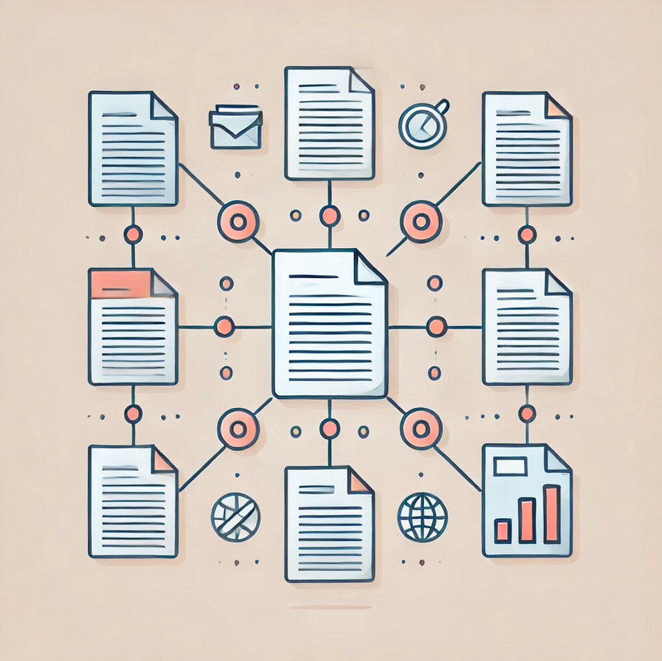
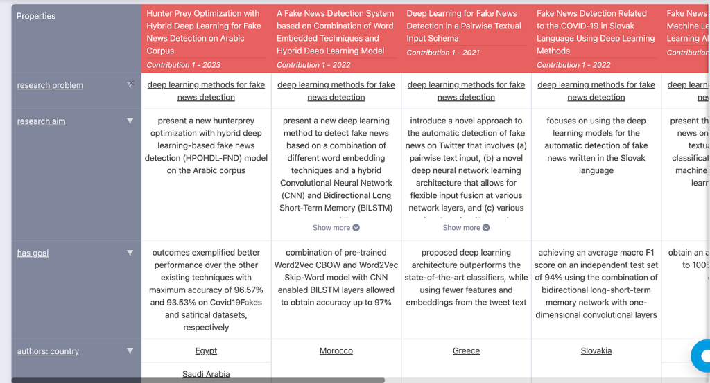

## Persistent Identification and Machine-Actionable Knowledge

<figure>

<figcaption>

[Source: DALL-E-3](https://openai.com/index/dall-e-3)

</figcaption>

</figure>

## Author

- Harshitha Thoram (ORCID: 0009–0007–4527–7926)

> _This article explores and analyses the paper ‘[Persistent Identification and Interlinking of FAIR Scholarly Knowledge](https://arxiv.org/pdf/2209.08789)’ by Muhammad Haris, Markus Stocker and Sören Auer from ML3S Research Center, Leibniz University Hannover. The paper was published in 2022._

## Introduction

#### The Problem with Traditional Research Papers

Every year, millions of research papers are published across various disciplines. But there’s a problem: most of these papers exist in static PDF format, making it difficult for researchers to find, compare, and analyse them efficiently. Traditional search engines rely on keyword matching, which is often imprecise and fails to capture the actual meaning behind research topics. Imagine trying to find every paper on “virus transmission” when different studies use varied terminology like “pathogen spread” or “infectious disease dynamics.”

Now, what if we could make research machine-actionable, allowing computers to automatically categorise, compare, and interlink knowledge across disciplines? This process involves structuring scholarly knowledge semantically, assigning persistent identifiers, and sharing metadata with global research infrastructures like DataCite and OpenAIRE to ensure research is findable, citable, and accessible worldwide.

## What is ORKG and why does it matter?

The Open Research Knowledge Graph (ORKG) is a platform designed to transform traditional research articles into structured, machine-readable knowledge. Instead of treating research papers as static PDFs, ORKG enables their conversion into a semantic format that computers can process, analyse, and interlink with other research outputs.

- It extracts key information from research papers and structures it into a format that is machine-understandable.

- It interconnects research findings, making it easier to compare different studies.

- It enhances discoverability by linking papers to related datasets, software, and institutions.

**Example:** Suppose you are researching deep learning methods for detecting fake news. Traditionally, you would read through numerous PDFs to compare models, datasets, and results. With ORKG, the platform can automatically extract, compare, and summarise key findings in structured tables, graphs, or knowledge maps. This eliminates manual data gathering and speeds up literature reviews.

<figure>

<figcaption>

S[ource](https://orkg.org/comparison/R739984) : Image illustrating comparison of different papers

</figcaption>

</figure>

## Persistent Identification: DOI Assignment

Ensuring that machine-actionable research papers remain findable, citable, and accessible is crucial. Each paper in ORKG is assigned a Digital Object Identifier (DOI) — a permanent, unique identifier that leads to the current location of the research resource.

It is necessary because:

- Unlike standard web links, which may become broken over time, a DOI always resolves to the current location of the research paper

- Since each DOI is unique, it eliminates confusion when citing or referencing scholarly work.

- Research papers with DOIs are indexed in major scholarly databases, making them easier to find and track.

The original research paper (PDF) typically receives a DOI from Crossref, which makes it citable in its published form. When that research is converted into an ORKG Paper, this is also assigned a new DOI via DataCite. The DOI of the ORKG Paper is linked to the DOI of the original research paper, which allows researchers to trace the machine-actionable version back to the original study

## Interlinking Machine Actionable Research

As introduced before, unlike PDFs, machine-actionable research papers don’t exist in isolation. They are linked to other research objects like datasets, softwares or different publications, which enhances discoverability and usability for researchers and automated systems. This interconnected approach ensures that relevant resources are easy to find and reference.

When a research paper is linked to a dataset, it allows researchers to access the raw data used in the study. This enables replication, validation, and further analysis, strengthening the reliability of the research. Similarly, linking to software used for data analysis ensures that researchers can find and use the same tools, maintaining consistency in methodology and making it easier to reproduce findings. Additionally, including ORCID IDs for authors and ROR IDs for institutions ensures that research contributions are correctly attributed, making it simpler to track a researcher’s work across multiple publications.

## Sharing MetaData to Scholarly Infrastructures

[DataCite](https://datacite.org/), [OpenAIRE](https://www.openaire.eu/), and [ORCID](https://orcid.org/) are vital infrastructures for managing and disseminating research outputs. By sharing ORKG metadata with these services, papers gain broader visibility and remain persistently accessible.

**ORCID**: Connects research to author profiles. Metadata sharing ensures that each author’s contributions are recognised, making it easier to track scholarly impact.

**DataCite**: Registers DOIs for persistent access. As explained earlier, integrating ORKG metadata enhances the discoverability and citability of machine-actionable research.

**OpenAIRE**: Aggregates metadata to increase the visibility of open-access research. ORKG Papers indexed in OpenAIRE reach a wider scholarly community.

## Version Control: Keeping Track of Updates Over Time

One major flaw of traditional PDFs is their static nature and if a researcher finds a mistake in a paper or wants to update findings, they typically publish a new paper, making it difficult to track changes.

A machine-actionable system solves this with version control — each update to a structured research paper gets a new DOI and is linked to previous versions, creating a complete version history.

How Versioning Works:

1️⃣ Version 1: Researcher submits an ORKG Paper on AI bias in medical diagnostics (DOI: 10.1234/orkg-v1).

2️⃣ Version 2: Researcher adds new findings and creates an updated version (DOI: 10.1234/orkg-v2).

3️⃣ Version 3: Another author corrects a mistake in dataset references, generating a new version (DOI: 10.1234/orkg-v3).

All versions are linked in a provenance chain, allowing researchers to track the evolution of research over time.

## Conclusion

The current research ecosystem suffers from information overload, disconnected data, and poor accessibility. A structured, machine-actionable approach to persistent identification, metadata sharing of these ORKG papers to scholarly infrastructures would lead to interlinking research objects, providing a better way to manage, compare, and build upon scientific knowledge.

> _The Medium version of this post can be found [here](https://medium.com/@researchgraph/future-of-research-e151efac880d)._

## References

- Haris, M., Stocker, M. and Auer, S. (2022) _Persistent identification and interlinking of fair scholarly knowledge_, _arXiv.org_. Available at: [https://arxiv.org/abs/2209.08789](https://arxiv.org/abs/2209.08789)

- Orkg.org. (2025). _Open Research Knowledge Graph_. \[online\] Available at: [https://orkg.org/comparison/R739984](https://orkg.org/comparison/R739984).

- OpenAI (2024). _DALL·E 3_. \[online\] Openai.com. Available at: [https://openai.com/index/dall-e-3/.](https://openai.com/index/dall-e-3/)

- datacite.org. (n.d.). _Welcome to DataCite_. \[online\] Available at: [https://datacite.org/](https://datacite.org/).

- Iatropoulou, K. (n.d.). _OpenAIRE_. \[online\] OpenAIRE. Available at: [https://www.openaire.eu/.](https://www.openaire.eu/)

- ORCID (2019). _ORCID_. \[online\] Orcid.org. Available at: [https://orcid.org/](https://orcid.org/).
