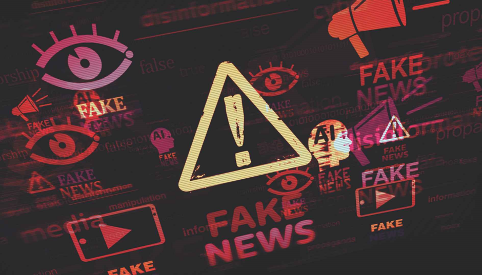

_GenAI and the Battle Against Misinformation. This insight is sourced from Duke Corporate Education on \[_[_https://www.dukece.com/insights/genai\_and\_the\_battle\_against\_misinformation/_](https://www.dukece.com/insights/genai_and_the_battle_against_misinformation/)\]

**Author:** Immanuel Alvaro Bhirawa (**ORCID ID:** 0009-0009-3354-7794)

## Introduction

I’ve been exploring how artificial intelligence is transforming our lives. It’s doing incredible things—think better medical diagnoses or self-driving cars—but there’s a darker side that’s tough to overlook. AI is being weaponized to create and spread misinformation, especially in politics, and it’s a growing problem.

I stumbled upon research in _Nature_ by Garimella and Chauchard (2024) that really opened my eyes. They examined the full data and profiles of 500 WhatsApp users in India—messages, pictures, videos, you name it—across various factors to gauge the scope of this issue. (Note: They stripped out Personally Identifiable Information for ethical reasons.) Their findings? AI is churning out political content that’s misleading or flat-out fake. And because it’s AI-made, it often looks legit—altered videos, edited images, or messages that pass the eye test but don’t hold up under scrutiny.

## Why This Is a Big Deal

In India, WhatsApp isn’t just a messaging app—it’s a lifeline for news and info for millions. When fake content hits there, it spreads like wildfire, hopping from user to user. But this isn’t just an India problem; it’s global. Social media platforms everywhere are at risk.

The real issue? When you can’t trust what you see or read, it shakes faith in everything—news, leaders, even everyday chats. Research published in _Nature_ calls this an “urgent concern,” and it’s not hard to see why. Imagine getting a WhatsApp video of a politician saying something wild, only to find out later it’s AI-fabricated. Or scrolling past a post that seems real but was built to deceive. This isn’t hypothetical—it’s happening now.

## Unpacking the Research: How Misinformation Takes Root

The findings paint a grim picture of how misinformation digs in online. In India, WhatsApp’s encrypted groups and messaging features make it a perfect breeding ground for AI-generated content. It often starts small—in private chats—before snowballing into bigger networks, nearly impossible to track or debunk. AI’s knack for mimicking human communication only makes it trickier to spot the fakes. And since these platforms are closed-off, fact-checks lag way behind the spread.

## Real-World Examples: AI’s Misinformation in Action

AI can churn out misinformation in sneaky ways, sometimes even by accident. Take “hallucination”—when AI generates believable but totally false info because it’s missing context or data. To someone unfamiliar with AI—like many in India—it looks true, even when it’s not. A fake news story or doctored photo can slip by, especially if it fits what people already believe or fear. This kind of unintended spread can still shape opinions and sway big decisions.

## The Stakes Are High

This isn’t just about a few bogus messages—it’s about democracy itself. When AI pumps out convincing lies at scale, it can shift public opinion, mess with voters, or even undermine elections. The research shows how, in India, where WhatsApp is a go-to info source, AI content can hijack political narratives fast, outpacing fact-checkers. That loss of trust? It can fracture society, making agreement on facts a pipe dream. And it’s not just elections—it hits the core of how we talk and decide as a democracy.

But the damage doesn’t stop there. Over time, AI-driven misinformation can widen divides, stir cultural tensions, and shred the shared reality democracies need. In a place as diverse as India—or anywhere—false stories can breed mistrust, spark chaos during crises, or tank economic stability. The findings warn that as AI gets easier to use, crafting and spreading these lies will only get simpler, piling pressure on systems already stretched thin by the digital era.

## What Can Be Done?

So, what’s the fix? First, we’ve got to get savvier online. If something looks off or too good to be true, double-check it before buying in or sharing. Tech companies could step up with tools to spot and flag misinformation early. Governments might mull rules to curb AI misuse, though it’s a tightrope—nobody wants to kill innovation.

Then there’s the big picture: AI’s future. It’s racing ahead so fast that soon, telling real from fake might be a lost cause. Ideally, AI should solve big problems and lift society, not sow deceit. Pushing for responsible tech development could point us the right way.

## A Personal Reflection: Caught in the Web

I’ve been duped by AI myself, and I use it a lot. Sometimes it’s the AI “hallucinating,” other times it’s me not giving it enough context—so I’ve learned to double-check everything. But it’s not just when I’m using AI tools. Online, I’ve run into “facts” in posts that turned out to be AI-spun lies. If I hadn’t fact-checked (which I usually skip for random stuff), my views would’ve shifted, even on junk info. It’s a quiet reminder of how easily these fakes can sneak in and tweak how we see the world.

## Summary

In the end, AI’s power is mind-blowing, but it cuts both ways. The research makes it clear: it’s already warping our view of reality, and that’s something we can’t brush off.

**References:**  
Garimella, K., & Chauchard, S. (2024). How prevalent is AI misinformation? What our studies in India show so far. _Nature_, 630(8015), 32-34. https://doi.org/10.1038/d41586-024-01588-2
