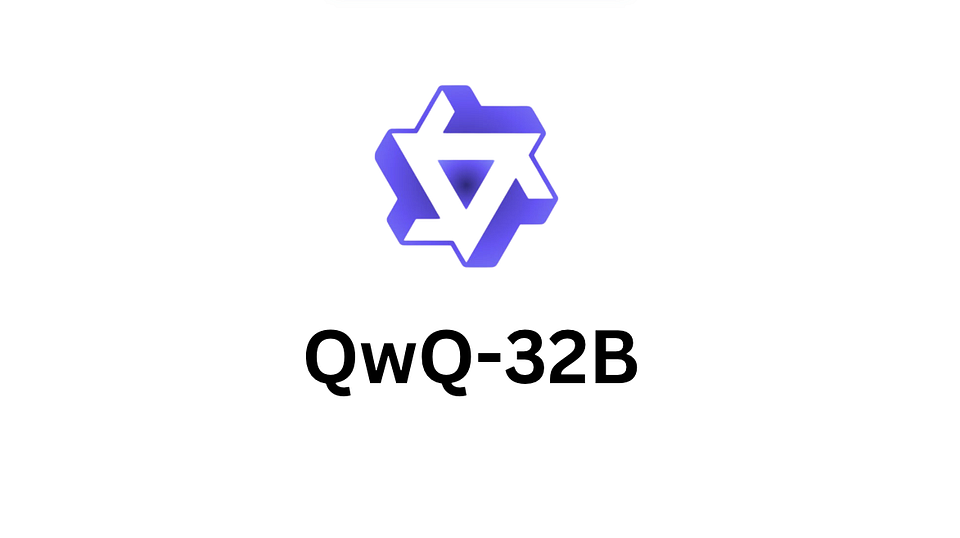
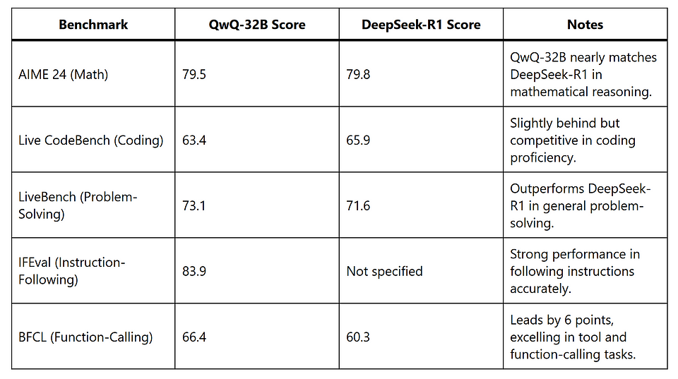

## Exploring QwQ-32B: Alibaba’s Compact Reasoning Model

<figure>

<figcaption>

_This image is sourced from_ [_Medium_](https://medium.com/@amdadAI/alibabas-qwq-32b-launch-is-it-better-than-deepseek-r1-e91523cb003e) _on QwQ-32B._

</figcaption>

</figure>

**Author:** Immanuel Alvaro Bhirawa (**ORCID ID:** 0009-0009-3354-7794)

## Introduction

In the rapidly evolving field of artificial intelligence, Alibaba’s Qwen team has introduced QwQ-32B, a 32-billion-parameter reasoning model designed to tackle complex tasks such as mathematical problem-solving and coding. Launched in March 2025, QwQ-32B stands out for its compact size and open-source availability, offering performance comparable to much larger models like DeepSeek-R1, which boasts 671 billion parameters. This blog post provides a literature review of QwQ-32B, exploring its features, performance, use cases, and community experiences, drawing from a variety of sources, including official announcements, technical blogs, and user feedback.

## Background and Development

QwQ-32B, part of Alibaba’s Qwen series, builds on the Qwen2.5–32B model and is tailored for reasoning tasks. Unlike traditional instruction-tuned models, QwQ-32B leverages reinforcement learning (RL) to enhance its ability to think critically and solve hard problems. According to the [Alibaba Cloud Community](https://www.alibabacloud.com/blog/alibaba-cloud-unveils-qwq-32b-a-compact-reasoning-model-with-cutting-edge-performance_602039), the model was developed to deliver cutting-edge performance with reduced computational requirements, making it accessible for deployment on consumer-grade hardware. Its open-source release under the Apache 2.0 license on platforms like [Hugging Face](https://huggingface.co/Qwen/QwQ-32B) and [ModelScope](https://modelscope.cn/models/Qwen/QwQ-32B) reflects Alibaba’s commitment to advancing AI research and democratisation.

## Key Features

QwQ-32B is distinguished by several technical and operational features that make it a compelling choice for reasoning-focused applications:

- **Parameter Size:** With 32 billion parameters, QwQ-32B is significantly smaller than competitors like DeepSeek-R1, yet it achieves comparable performance.

- **Architecture:** Built on Qwen2.5–32B, it uses a transformer architecture with Rotary Position Embedding (RoPE), SwiGLU activation, RMSNorm, and Attention QKV bias. It features 64 layers and Grouped Query Attention (GQA) with 40 query heads and 8 key-value heads ([Hugging Face](https://huggingface.co/Qwen/QwQ-32B)).

- **Context Length:** Supports a context window of 131,072 tokens, suitable for processing long inputs, though some sources note this is smaller than competitors like Google Gemini 2.0’s 2 million tokens ([VentureBeat](https://venturebeat.com/ai/alibabas-new-open-source-model-qwq-32b-matches-deepseek-r1-with-way-smaller-compute-requirements/)).

- **Training Method:** Employs a multi-stage RL approach, initially focusing on math and coding with accuracy verifiers and code execution servers, followed by general capability enhancement using reward models and rule-based verifiers ([Qwen Blog](https://qwenlm.github.io/blog/qwq-32b/)).

- **Open-Source Availability:** Freely accessible on [Hugging Face](https://huggingface.co/Qwen/QwQ-32B) and [ModelScope](https://modelscope.cn/models/Qwen/QwQ-32B), with support for fine-tuning and deployment via tools like vLLM.

- **Compute Efficiency:** Requires only 24 GB of vRAM, compared to DeepSeek-R1’s over 1500 GB, enabling deployment on high-end consumer GPUs like the Nvidia H100 ([VentureBeat](https://venturebeat.com/ai/alibabas-new-open-source-model-qwq-32b-matches-deepseek-r1-with-way-smaller-compute-requirements/)).

These features position QwQ-32B as an efficient and versatile model for reasoning-intensive tasks.

## Performance Evaluation

QwQ-32B has been rigorously evaluated across multiple benchmarks, showcasing its strengths in reasoning tasks. The following table summarises its performance compared to DeepSeek-R1 and other models, based on data from [DataCamp](https://www.datacamp.com/blog/qwq-32b) and [Alibaba Cloud Community](https://www.alibabacloud.com/blog/alibaba-cloud-unveils-qwq-32b-a-compact-reasoning-model-with-cutting-edge-performance_602039):

Additional insights from [VentureBeat](https://venturebeat.com/ai/alibabas-new-open-source-model-qwq-32b-matches-deepseek-r1-with-way-smaller-compute-requirements/) indicate that QwQ-32B outperforms OpenAI’s o1-preview in mathematical benchmarks like AIME and MATH, and in scientific reasoning tasks like GPQA. However, it initially struggled with programming benchmarks like LiveCodeBench. The [Medium article by Tahir Balarabe](https://medium.com/%40tahirbalarabe2/alibabas-qwq-32b-the-compact-ai-model-that-rivals-deepseek-r-0d7b57d585e2) notes a 59.5% score on GPT-QA Diamond for scientific reasoning, compared to DeepSeek-R1’s 71%, suggesting room for improvement in some domains. Controversially, the same article cites Artificial Analysis benchmarks that question the Qwen team’s performance claims, highlighting the need for independent verification.

## Use Cases

QwQ-32B is tailored for applications requiring structured reasoning and critical thinking. Key use cases include:

- **Mathematical Problem-Solving:** Its strong performance on AIME 24 makes it suitable for educational tools, research in mathematics, and competitive programming ([DataCamp](https://www.datacamp.com/blog/qwq-32b)).

- **Coding and Software Development:** QwQ-32B can generate, verify, and debug code, supporting developers in creating robust software solutions ([Alibaba Cloud Community](https://www.alibabacloud.com/blog/alibaba-cloud-unveils-qwq-32b-a-compact-reasoning-model-with-cutting-edge-performance_602039)).

- **Scientific Research and Data Analysis:** The model’s reasoning capabilities are valuable for analysing complex datasets and verifying multi-step solutions in fields like physics and finance ([DataCamp](https://www.datacamp.com/blog/qwq-32b)).

- **AI Agents and Tool Utilisation:** With agent-related capabilities, QwQ-32B excels in tasks involving tool calling and dynamic reasoning adjustments, making it ideal for building intelligent agents ([Groq Guide](https://groq.com/a-guide-to-reasoning-with-qwen-qwq-32b/)).

- **Real-Time Applications:** Its speed (approximately 450 tokens per second on Groq) supports applications requiring quick iterations, such as interactive debugging or live problem-solving ([Medium](https://medium.com/%40tahirbalarabe2/alibabas-qwq-32b-the-compact-ai-model-that-rivals-deepseek-r-0d7b57d585e2)).

The [DataCamp blog](https://www.datacamp.com/blog/qwq-32b) emphasises that QwQ-32B is not suited for general text generation tasks like writing or brainstorming, but rather for technical domains requiring logical workflows.

## Community Experiences and Feedback

The AI community has responded positively to QwQ-32B, particularly for its efficiency and open-source nature, though some challenges have been noted. Below is a synthesis of experiences from various sources:

- **Official Sources:** The [Qwen Blog](https://qwenlm.github.io/blog/qwq-32b/) and [Alibaba Cloud Community](https://www.alibabacloud.com/blog/alibaba-cloud-unveils-qwq-32b-a-compact-reasoning-model-with-cutting-edge-performance_602039) highlight QwQ-32B’s breakthrough in scaling Reinforcement Learning (RL), with the model’s ability to match larger models attributed to its robust pretraining and RL-driven optimisation. They provide detailed benchmark results and deployment instructions.

- **Technical Blogs:** The [DataCamp blog](https://www.datacamp.com/blog/qwq-32b) praises QwQ-32B’s performance and accessibility, noting its potential to usher in an era of “small reasoning models.” It provides practical guidance on accessing the model via Qwen Chat or local deployment. Similarly, [VentureBeat](https://venturebeat.com/ai/alibabas-new-open-source-model-qwq-32b-matches-deepseek-r1-with-way-smaller-compute-requirements/) underscores the model’s compute efficiency and early community excitement for its one-click deployment on Hugging Face.

- **User Guides and Troubleshooting:** The [Unsloth blog](https://unsloth.ai/blog/qwq-32b) addresses common issues like infinite loops, token errors, and fine-tuning challenges, offering bug fixes such as updating the PAD token to “<|vision\_pad|>” and using dynamic 4-bit quantisation for improved accuracy. It reports that QwQ-32B can be fine-tuned with under 20 GB of vRAM, making it accessible for researchers with modest hardware. The [Groq Guide](https://groq.com/a-guide-to-reasoning-with-qwen-qwq-32b/) provides best practices for reasoning tasks, such as prompting to avoid Chinese characters and managing output-heavy responses, and highlights the model’s strength in function-calling tasks, as evidenced by its performance on the Berkeley Function-Calling Leaderboard.

- **Community Discussions:** X posts reflect varied user engagement. For instance, a post by @skygecko\_ ([X Post](https://x.com/skygecko_/status/1914222864800063664)) mentions experimenting with QwQ-32B on Hyperbolic Labs, indicating interest in its capabilities. Another by @zaidmukaddam ([X Post](https://x.com/zaidmukaddam/status/1911858883045605534)) notes its integration into the SciraAI platform, suggesting practical adoption. However, a post by @daken\_in\_market ([X Post](https://x.com/daken_in_market/status/1912803581536989450)) criticises some parties for potentially misrepresenting QwQ-32B’s origins, reflecting ethical concerns in the community.

- **Critical Perspectives:** The [Medium article by Tahir Balarabe](https://medium.com/%40tahirbalarabe2/alibabas-qwq-32b-the-compact-ai-model-that-rivals-deepseek-r-0d7b57d585e2) offers a balanced view, praising QwQ-32B’s speed and agent-based capabilities but noting limitations like excessive token consumption during reasoning and a smaller context window (132k tokens). It also cites Artificial Analysis benchmarks that challenge the Qwen team’s performance claims, suggesting a need for further scrutiny.

These experiences collectively highlight QwQ-32B’s potential as a powerful reasoning model, tempered by practical challenges that require careful configuration and optimisation.

## Practical Considerations and Best Practices

Deploying QwQ-32B effectively requires attention to specific guidelines and configurations:

- **Usage Guidelines:** The [Hugging Face page](https://huggingface.co/Qwen/QwQ-32B) recommends starting prompts with “\\n” to ensure thoughtful output and using `apply_chat_template` with `add_generation_prompt=True`. For long inputs (>8,192 tokens), enable YaRN scaling by modifying the `config.json` file. Optimal sampling parameters include a temperature of 0.6, top-p of 0.95, and top-k of 20-40.

- **Deployment:** The model can be accessed online via [Qwen Chat](https://chat.qwen.ai/) or deployed locally using Hugging Face or ModelScope weights. Local deployment requires a GPU with at least 24 GB of vRAM, though quantisation can reduce this at the cost of performance ([DataCamp](https://www.datacamp.com/blog/qwq-32b)).

- **Best Practices for Reasoning:** The [Groq Guide](https://groq.com/a-guide-to-reasoning-with-qwen-qwq-32b/) advises prompting for concise responses, setting `max_completion_tokens` to 131,072 to avoid truncation, and excluding reasoning chains from conversation history to maintain output quality. For tasks requiring English-only responses, explicitly prompt to avoid Chinese character output, a known issue in complex interactions.

- **Fine-Tuning:** The [Unsloth blog](https://unsloth.ai/blog/qwq-32b) details fine-tuning with QLoRA on a 20 GB vRAM GPU, achieving 2x speed and 70% less vRAM usage. It recommends using the Alpaca dataset and specific batch configurations for optimal results.

These considerations ensure that users can maximise QwQ-32B’s performance while mitigating common pitfalls.

## Limitations and Future Directions

Despite its strengths, QwQ-32B has limitations that warrant attention:

- **Performance Variability:** Some benchmarks, like GPT-QA Diamond, show QwQ-32B trailing DeepSeek-R1 (59.5% vs. 71%), and Artificial Analysis reports suggest performance may not fully align with claims ([Medium](https://medium.com/%40tahirbalarabe2/alibabas-qwq-32b-the-compact-ai-model-that-rivals-deepseek-r-0d7b57d585e2)).

- **Token Consumption:** The model’s extensive “thinking” process can consume significant tokens, impacting efficiency in token-limited environments ([Medium](https://medium.com/%40tahirbalarabe2/alibabas-qwq-32b-the-compact-ai-model-that-rivals-deepseek-r-0d7b57d585e2)).

- **Language Mixing:** The [Hugging Face Preview page](https://huggingface.co/Qwen/QwQ-32B-Preview) notes occasional language mixing or code-switching, which can affect response clarity, particularly in multilingual contexts.

- **Context Window:** At 131,072 tokens, the context window is substantial but smaller than some competitors, potentially limiting its use in very long-context applications ([VentureBeat](https://venturebeat.com/ai/alibabas-new-open-source-model-qwq-32b-matches-deepseek-r1-with-way-smaller-compute-requirements/)).

- **Common Sense Reasoning:** The preview version struggled with common sense reasoning and nuanced language understanding, though improvements are noted in the final release ([Hugging Face Preview](https://huggingface.co/Qwen/QwQ-32B-Preview)).

Future research directions include integrating agents with RL for long-horizon reasoning and exploring inference-time scaling techniques like Chain of Draft to optimise token usage ([Medium](https://medium.com/%40tahirbalarabe2/alibabas-qwq-32b-the-compact-ai-model-that-rivals-deepseek-r-0d7b57d585e2)). The Qwen team also aims to combine stronger foundation models with scaled RL to advance toward artificial general intelligence ([Ollama](https://ollama.com/library/qwq:32b)).

## Conclusion

QwQ-32B represents a significant milestone in the development of efficient, reasoning-focused AI models. By leveraging reinforcement learning on a robust 32-billion-parameter foundation, Alibaba’s Qwen team has created a model that rivals larger competitors like DeepSeek-R1 and OpenAI’s o1-mini in tasks such as mathematical reasoning, coding, and function-calling. Its open-source availability, low compute requirements, and strong community support make it an attractive option for researchers, developers, and engineers working on technical applications. However, challenges like token consumption, occasional language mixing, and performance variability underscore the need for careful configuration and further refinement. As the AI community continues to explore QwQ-32B’s capabilities, it is poised to drive innovation in reasoning-intensive domains, paving the way for more accessible and powerful AI solutions.

> _The Medium version of this blog post can be found [here](https://medium.com/@researchgraph/exploring-qwq-32b-alibabas-compact-reasoning-model-e3870c5f9441)._

## **References**

- [Alibaba Cloud Unveils QwQ-32B: A Compact Reasoning Model with Cutting-Edge Performance](https://www.alibabacloud.com/blog/alibaba-cloud-unveils-qwq-32b-a-compact-reasoning-model-with-cutting-edge-performance_602039)

- [Qwen/QwQ-32B Model Details and Usage Guidelines on Hugging Face](https://huggingface.co/Qwen/QwQ-32B)

- [QwQ-32B: Embracing the Power of Reinforcement Learning by Qwen](https://qwenlm.github.io/blog/qwq-32b/)

- [GitHub Repository for QwQ Reasoning Model Series by QwenLM](https://github.com/QwenLM/QwQ)

- [Alibaba’s QWQ 32B: Compact AI Model Rivals DeepSeek R1](https://medium.com/%40tahirbalarabe2/alibabas-qwq-32b-the-compact-ai-model-that-rivals-deepseek-r-0d7b57d585e2)

- [Alibaba’s Open-Source QwQ-32B Matches DeepSeek-R1 with Less Compute](https://venturebeat.com/ai/alibabas-new-open-source-model-qwq-32b-matches-deepseek-r1-with-way-smaller-compute-requirements/)

- [QwQ-32B: Features, Access, and DeepSeek-R1 Comparison by DataCamp](https://www.datacamp.com/blog/qwq-32b)

- [Guide to Reasoning with Qwen QwQ-32B by Groq](https://groq.com/a-guide-to-reasoning-with-qwen-qwq-32b/)

- [Run and Finetune QwQ-32B with Bug Fixes by Unsloth](https://unsloth.ai/blog/qwq-32b)

- [Qwen/QwQ-32B-Preview Experimental Research Model on Hugging Face](https://huggingface.co/Qwen/QwQ-32B-Preview)

- [QwQ-32B Reasoning Model Overview on Ollama](https://ollama.com/library/qwq:32b)

- [User Experimenting with QwQ-32B on Hyperbolic Labs](https://x.com/skygecko_/status/1914222864800063664)

- [QwQ-32B Integration into SciraAI Platform](https://x.com/zaidmukaddam/status/1911858883045605534)[Criticism of QwQ-32B Misrepresentation Concerns](https://x.com/daken_in_market/status/1912803581536989450)
