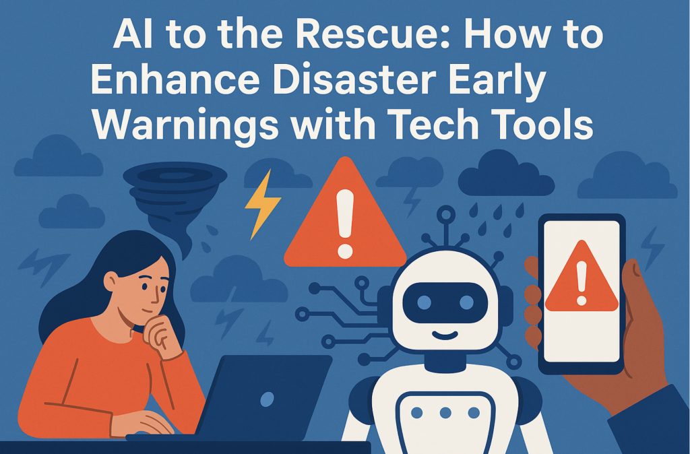

Image generated using DALL-E on 2nd May 2025

## Introduction 

Natural disasters have become more frequent and intense, causing significant threats to the society. **Early-warning systems (EWS)** are critical for mitigating these impacts by providing timely alerts, allowing time for preparation and evacuation. The United Nations' Early Warnings for All Initiative, launched to ensure every person on Earth is protected by EWS by 2027, tells the urgency of this issue. However, as of 2023, only around half of the nations had access to such systems, with coverage dropping to less than 50% in less developed countries and around 39% in small island states, highlighting a significant gap, particularly in regions most vulnerable to disasters.

Artificial intelligence is increasingly seen as a transformative technology for enhancing EWS, offering improvements in prediction accuracy, real-time monitoring, and communication efficiency. Yet, its implementation brings challenges, such as data biases and the need for robust international standards, which are primarily what we will be discussing in this blog post. 

## Understanding Early Warning Systems 

Early warning systems represent complex networks of tools and processes, designed to detect potential hazards before they evolve into disasters. These systems typically encompass four key components: risk knowledge and assessment, monitoring and forecasting capabilities, warning dissemination mechanisms, and community preparedness for appropriate response. 

Traditionally, early warning systems have relied heavily on ground-based monitoring networks, meteorological stations, and human analysis—approaches that often struggle with geographical coverage gaps and processing delays. Many regions, particularly in developing nations, lack the robust infrastructure and resources necessary to maintain comprehensive monitoring networks. 

## Role of AI in Enhancing Early-Warning Systems 

AI's potential in disaster management is vast, and it can enhance EWS in several key areas: 

1. **Prediction and Forecasting**: AI models, such as those developed by Google DeepMind, Huawei, and Nvidia in 2023, have shown superior performance in medium-range weather forecasting, particularly for small-scale events like thunderstorms, which can lead to extreme rainfall or tornadoes. These models analyse vast datasets to predict precipitation patterns and hazard impacts, often outperforming conventional tools in speed and precision. 

3. **Monitoring and Detection**: AI processes real-time data from diverse sources, including satellite imagery, drone footage, and sensor networks. For instance, companies like Pano AI, Fireball Information Technologies, Dryad Networks, and OroraTech use AI to detect smoke in images, contributing to timely wildfire warnings. AI also monitors extreme precipitation by integrating with telecommunication networks or traffic-camera feeds, enhancing flood detection. 

5. **Risk Assessment and Mapping**: AI analyses historical and current data to create detailed risk maps, identifying vulnerable areas and populations. This is crucial for planning evacuation routes and allocating resources.

7. **Monitor Infrastructure**: An international research group has trained an AI system to optimise the placement of traffic sensors in a hurricane-prone city in Florida to avoid excessive congestion during an evacuation. And start-up firm QuakeSaver in Germany is using smart seismic sensors with embedded AI to detect earthquakes and find vulnerabilities in buildings and other structures. 

9. **Communication and Dissemination**: AI-driven tools, such as chatbots and translation systems, improve warning dissemination. The US National Weather Service partnered with Lilt to automate translations of forecasts, while UNESCO’s AI chatbot, used in 2021 for flood and drought information in East Africa, provided real-time assistance to affected communities by answering their questions.

Research suggests AI can reduce loss and damage by up to 30% when warnings are issued within 24 hours, emphasising its potential to save lives and livelihoods.

## The Need for International Standards 

The above shows proof of concept of AI being useful in Disaster Warning systems. But AI tools created without robust international standards risk keeping biases, creating compatibility problems, and ultimately failing the communities they aim to serve. 

A concerning discovery by the Focus Group on AI for Natural Disaster Management revealed that among 42 publicly available standards addressing digital technologies and disaster risk reduction, only four mentioned AI. This gap highlights the urgent need for guidelines governing everything from data collection and handling to algorithm training and implementation. 

Several key considerations must guide the development of these standards: 

**Regional Diversity:** Standards must incorporate perspectives from diverse global regions, acknowledging different values, priorities, and disaster contexts. This inclusive approach not only strengthens the standards themselves but also encourages their incorporation into national policies. 

**Interoperability and Scalability:** Early warning systems must function cohesively across different nations. Standards should enable AI solutions developed for one context to be appropriately adapted and scaled for use in regions currently lacking adequate warning systems. 

**Trustworthiness and Transparency:** For communities to trust and act upon AI-generated warnings, the underlying models must be interpretable and explainable. People need to understand not just what action to take, but why the system is recommending it. 

The European Union has taken a significant step forward by categorising AI in early warning systems as "high risk" under its AI Act, subjecting these technologies to strict regulations before market entry.

## Reflection and Personal Insights 

I believe AI has tremendous potential to improve early warning systems for disasters worldwide. What makes this application so valuable is that it could save countless lives, especially in vulnerable communities that currently lack adequate warning systems.

Natural disasters don't recognise national borders. A hurricane, flood, or wildfire can affect multiple countries at once. This is why international cooperation on these systems is so important. When nations work together and follow shared standards, we create systems that can communicate seamlessly across borders and provide reliable warnings to everyone at risk.

However, I think it's crucial to maintain a balanced view of technology's role. AI-enhanced warning systems are powerful tools, but they're still just tools. They should never completely replace human judgment or local knowledge. The most effective approach combines advanced technology with practical preparedness at both the individual and community levels.

We shouldn't become overly dependent on technology alone. Even the most sophisticated AI system can fail, especially during the chaotic conditions of a disaster. This is why everyone should maintain basic disaster preparedness skills and knowledge, regardless of technological advances.

## **Conclusion** 

Artificial intelligence holds immense promise for enhancing disaster early warning systems—making them more accurate, efficient, and accessible. From detecting wildfires in their earliest stages to predicting flood patterns beneath cloud cover, AI tools are already demonstrating their value in protecting communities worldwide. 

However, as the authors of the article correctly emphasise, "We run a risk of certain countries and regions benefiting from AI-based systems, while others are left behind. Standards are the solution, we must not wait." The development of robust international standards represents a crucial step toward ensuring that these powerful technologies serve humanity equitably and ethically. 

As we approach the UN's 2027 deadline for universal early warning coverage, the path forward is clear: we must embrace AI's potential while simultaneously developing the frameworks to govern its use. In doing so, we can harness the power of artificial intelligence to build a world where everyone—regardless of geography or economic status—receives the timely warnings they need to prepare for and survive natural disasters. 

## References

- [https://www.nature.com/articles/d41586-024-03149-z](https://www.nature.com/articles/d41586-024-03149-z)
