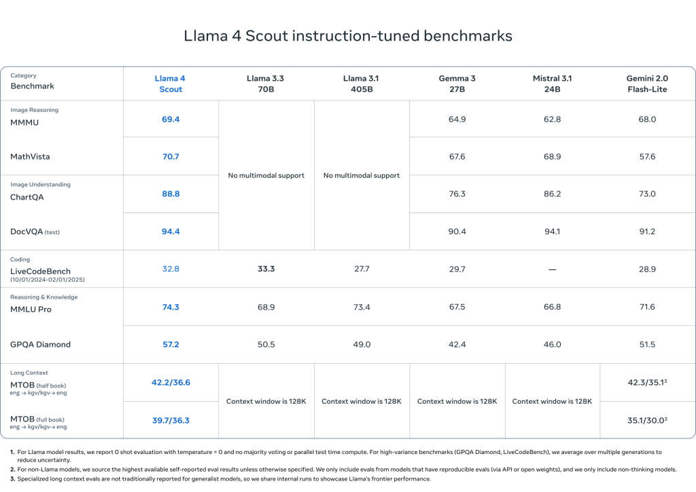

<figure>


<figcaption>

**_Image Created by GPT_**

</figcaption>

</figure>

## Author

- Yao Chen(**ORCID**: [0009–0007–1385–3343](https://orcid.org/0009-0007-1385-3343))

## Introduction

Code generation powered by large language models is reshaping how developers write software. OpenAI’s GPT series and Meta’s open-source Llama 4 are two leading options in this space. In this blog post, I will share my firsthand experience using both models and compare their strengths and weaknesses in code generation tasks.

## Background

In this blog I will compare the coding ability GPT-o4-mini-high which is claimed to be great at coding.

<figure>


<figcaption>

**_Ability of GPT-o4-mini-high_**

</figcaption>

</figure>

**OpenAI's GPT-o4-mini-high:** GPT-o4-mini-high builds on the core o4-mini architecture—a compact, efficient reasoning transformer with a 200 K token context window—by allocating more compute per request to tackle challenging problems such as multi-step coding tasks, advanced math, and logical inference.

**Meta's Llama 4**: Llama 4 is Meta’s latest open-source large language model family, released in early April 2025, built on a novel Mixture-of-Experts (MoE) architecture to deliver state-of-the-art performance across reasoning, coding, and emerging multimodal tasks. It comprises three variants—Scout, Maverick, and Behemoth—differentiated by active versus total parameter counts and expert configurations, and has been extensively benchmarked to outperform predecessors and competitors on diverse NLP and specialised challenges. The following image is the performance of Llama4 Scout and Maverick compare to other models.




## Practical Experience

This section provides a detailed examination of the coding abilities of GPT-4 and Llama 4.

### Task1: Code explanation and polish

In order to test the code understanding and interpretation of the model, I chose a very complicated and chaotic piece of code.

```
main(_){_^448&&main(-~_);putchar(--_%64?32|-~7[__TIME__-_/8%8][">'txiZ^(~z?"-48]>>";;;====~$::199"[_*2&8|_/64]/(_&2?1:8)%8&1:10);}
```

This code's name "A clock in one line" and it is the champion of 19th IOCCC (International Chaos C Language Code Competition), It is a famous international programming competition that has been held for 22 sessions so far. The purpose of the competition is to write the most creative and incomprehensible C language code.

This code's function is to print the current time when you compile this code. And I ask the models to explain this piece of code for me.

<figure>


<figcaption>

Explanation Given by GPT

</figcaption>

</figure>

<figure>


<figcaption>

Explanation Given by Llama4

</figcaption>

</figure>

Both have given correct answers to the functions of this code, but I think the answer given by GPT includes each step of the process, which is clearer.

Then I want to know how to compile and run this piece of code. Here is the solution given by two models

<figure>


<figcaption>

Solution given by GPT

</figcaption>

</figure>

<figure>


<figcaption>

Solution Given by Llama4

</figcaption>

</figure>

We can find that GPT provides detailed compilation and operation methods based on the code format and the C language version used, while Llama4 only gives a common method to compile C language files. And after trying this two methods only GPT's method can run this code correctly.


Then I ask the models to give me a clear version for this code.

- **Code generated by Llama4:** [https://drive.google.com/file/d/1gxI9Xw25mF5fGGg1\_kNPsK9LW72XoJWT/view?usp=sharing](https://drive.google.com/file/d/1gxI9Xw25mF5fGGg1_kNPsK9LW72XoJWT/view?usp=sharing)

- **Code generated by GPT:** [https://drive.google.com/file/d/1f17tD-WIVMJEyljdfFLCh6pkYVwn5Uyi/view?usp=sharing](https://drive.google.com/file/d/1f17tD-WIVMJEyljdfFLCh6pkYVwn5Uyi/view?usp=sharing)

After running the code I found that Llama4 still not performed well in this task.

<figure>


<figcaption>

Result Given by GPT

</figcaption>

</figure>

<figure>


<figcaption>

Result given by Llama4

</figcaption>

</figure>

### Task2: Simulate bouncing ball

The first task is a classic testing task for the coding ability for large language model. Here is the prompt:

```
Write a Python program that shows a ball bouncing inside a rotating hexagon. The ball should be affected by gravity and must realistically bounce off the rotating walls.
```

Here is the result given by GPT-o4-mini-high after one time of prompt:

We ca see GPT solve this task perfectly. Then is the result given by Llama4 with one time of prompt.

We can see at the first time Llama4 failed the task, in order to fix the problem I give it another prompt "sometimes the ball is outside the hexagon". Here is the result:

We can see that llama4 didn't fix the problem before for me and the problem became worse. The ball is outside the hexagon and bouncing in the window. After a few more prompts, Llama4 failed to solve this problem at last.

## Conclusion

Although Meta positions Llama 4 as outperforming GPT-4 in marketing materials, my personal experience tells a different story: its promise of superior code generation and reasoning often falls short. The code Llama4 gives often fails to meet my actual need. In contrast, GPT-4 delivers reliable, well-commented code, robust edge-case handling, and a stable hosted API experience. Therefore, despite its hype and cost advantages, Llama 4’s actual performance can be disappointing compared to the proven capabilities of GPT-4 in everyday development scenarios.
