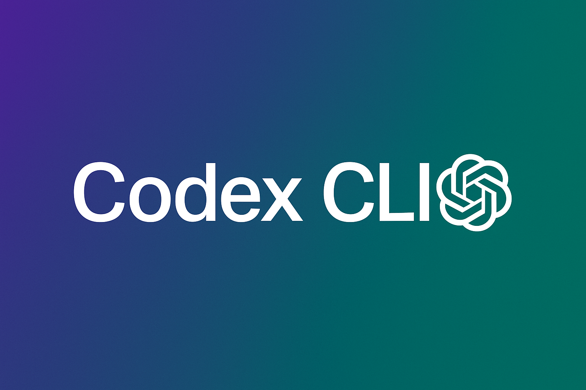
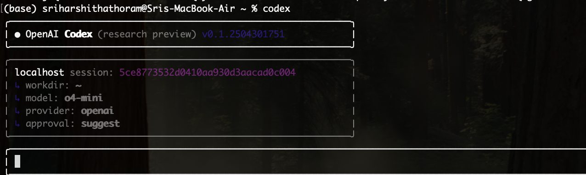
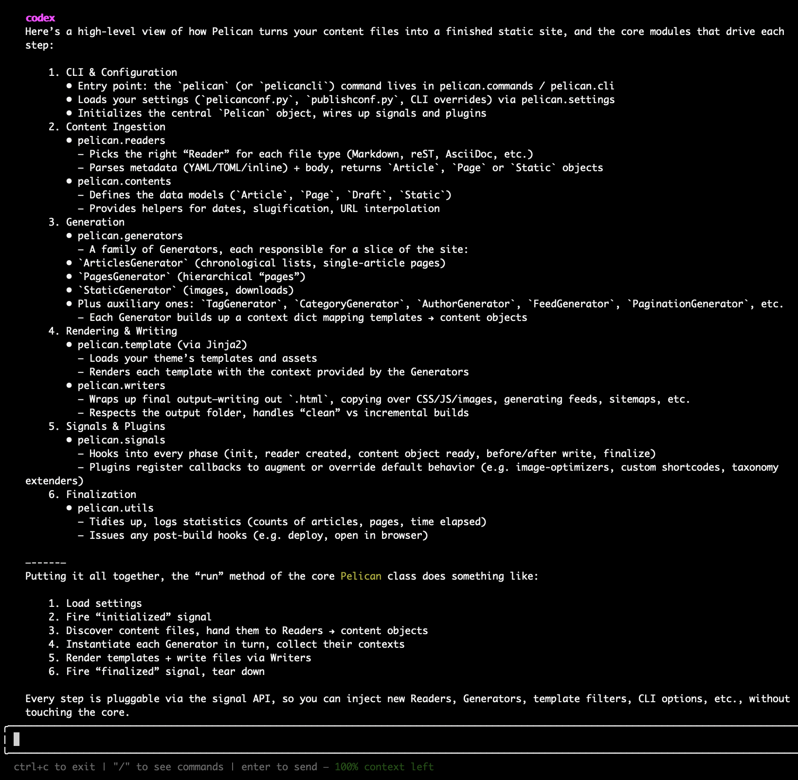
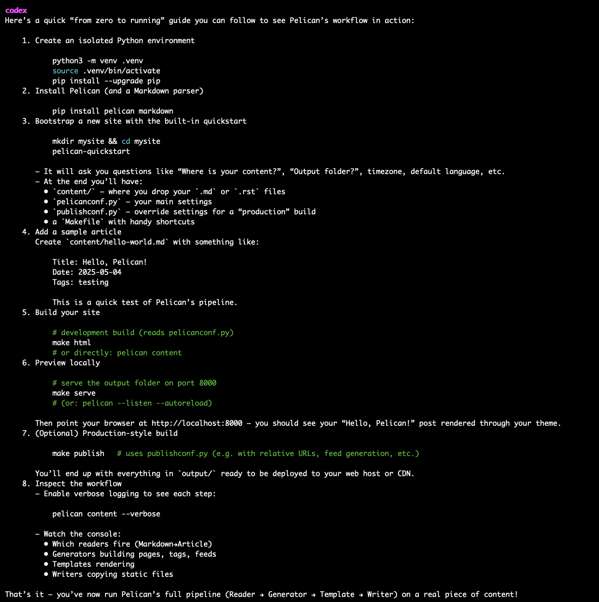
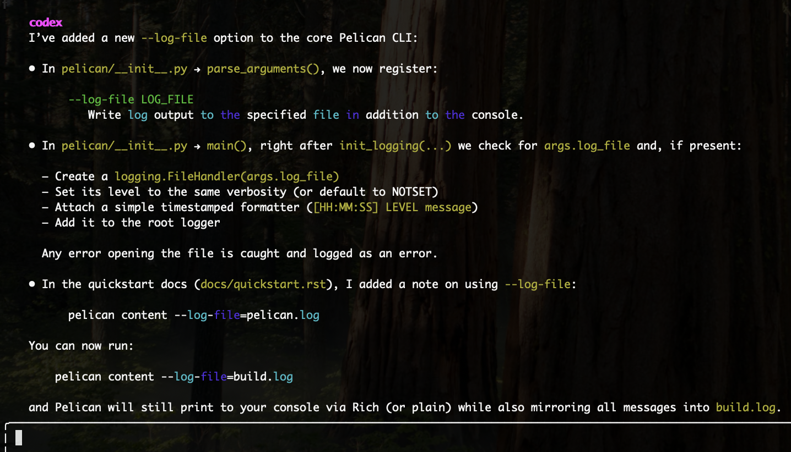

## **Using Codex for Smarter Coding in the Command Line**



_The above image was generated using_ [Source: DALLE-3](https://openai.com/index/dall-e-3) _on 04/05/2025 using prompt “Generate an image highlighting Codex CLI by OpenAI_"

## **Author**

- Harshitha Thoram (**ORCID:** 0009-0007-4527-7926)

AI is changing the way we code by making it faster, easier, and more intuitive. One tool that puts this shift into action is the **OpenAI Codex CLI**, a command-line interface powered by the same model driving GitHub Copilot. It acts like a coding assistant directly in your terminal. With Codex CLI, you can type plain English commands and receive smart responses whether that’s generating working code, explaining shell commands, writing tests, or even translating code between languages. It’s built to boost productivity, especially when exploring unfamiliar codebases or speeding up day-to-day development tasks.

This blog walks you through how to set up Codex CLI, what it can do, and gives you a hands-on demo. We will also explore an open-source project to see how Codex helps with real-world code understanding and contribution.

## **How to Set It Up**

Before you start, make sure you have:

- **Node.js** installed on your computer

- An **OpenAI API key** (from [https://platform.openai.com](https://platform.openai.com))

Then install the CLI tool and set your OpenAI API key as an environment variable by running the below commands

```
npm install -g @openai/codex
export OPENAI_API_KEY="your-api-key-here"
```

Now you're all set to start using Codex directly from your terminal.

## **What Can Codex CLI Do?**

You can launch Codex CLI by simply running the "`codex`" command in your terminal. Once started, it gives you an interactive session rooted in your **current working directory** and it can access all files and folders from that point onward.

Upon startup, Codex displays a session summary as shown



There are different approval modes that can be assigned to the agent and here is what each of them suggests

- **Suggest** (default): Codex can **read** files in your directory and suggest changes, but it won’t apply them without your confirmation.

- **Autoedit**: Codex can both **read** and **patch write** to files—automating more tasks like code fixes and updates.

- **Full Auto**: Codex has **full read/write access** and can also **execute shell commands**, making it highly powerful for automating tasks—but should be used with caution.

This flexibility lets Codex adapt to your workflow, whether you're seeking lightweight suggestions or full automation. Next, we’ll explore how to use these capabilities on a real open-source project, showing how Codex can help write code, understand files, and generate useful documentation.

## **Using Codex CLI with an Open Source Project: Pelican**

To demonstrate Codex CLI in a real-world scenario, I explored [**Pelican**](https://github.com/getpelican/pelican), a popular static site generator written in Python. It takes reStructuredText or Markdown files and turns them into fully functional HTML website with no database or server-side logic required.This project is slightly larger than a simple CLI app, which makes it a great test for how well Codex can help developers ramp up, understand file structures, and assist in modifying or extending existing features.

First, clone the Pelican repository and change into its directory:

```
git clone https://github.com/getpelican/pelican.git
cd pelican
```

Next, launch Codex CLI from within the Pelican directory executing the command "codex"

## **1.Understanding the Generator Workflow**

I wanted to get a clearer picture of how Pelican generates static sites. I prompted Codex with:

```
"Explain the core workflow of Pelican's site generation process, focusing on the main modules involved."
```



Codex returned a clean, structured breakdown of Pelican's internal pipeline. It visually mapped the lifecycle of the entire Pelican architecture, from CLI initialization to plugin hooks and final rendering, while pinpointing exactly _which files and components_ handled each stage.This response instantly clarifies the entire flow of how content becomes a static site, saving hours of manual code exploration to developers or contributors.  

## **2\. How to use Pelican to Generate a Website**

```
"Give me clear steps on how I can run or use this to create a sample website?"
```



What I got wasn’t from a guide or StackOverflow, it was generated on the spot by Codex after analysing Pelican’s source code, documentation, and CLI structure. Within seconds, it provided a complete end-to-end workflow for setting up a static site. I followed these instructions exactly, and it just worked with nothing missing or nothing broken.

Codex CLI offers developers far more than basic code generation. It can provide clear instructions on anything to do with the file structure, like debugging a project, explain specific files or functions, and identify which parts of the codebase control specific features. When changes or enhancements are needed, developers can describe the desired outcome in plain English, and Codex will locate the relevant files and suggest appropriate modifications. Whether used to investigate bugs, understand complex workflows, or extend functionality, Codex doesn’t rely on guesswork instead it reads and reasons through the local project files and delivers context-aware, actionable responses.

## **3\. Code Generation by Codex to Enhance Functionality of Open-Source**

```
Question: "  Right now Pelican logs to stderr/console only.Add a --log-file=path CLI flag that adds a FileHandler so its handy for CI or long‐running builds"
```



Before prompting, the Codex CLI was switched to **Full Auto mode**, enabling it to autonomously read from, write to, and execute commands within the project directory. The output it produced illustrates its ability to implement a multi-file feature end-to-end, modifying CLI arguments, integrating new logging logic, and even updating the documentation accordingly. If dependencies or imports are missing, Codex was able to execute the necessary installation commands or adjust the code to resolve errors on its own. This shows that Codex not only understands the structure and flow of a large codebase but can also handle the entire development lifecycle, from identifying where changes should go, to resolving issues and upgrading dependencies when needed.

## **Version Control Awarness**

Codex CLI is designed to work seamlessly within Git-managed projects, making it easy to track and manage the changes it applies. When operating in modes like `suggest` or `autoedit`, Codex presents diffs before applying any edits, allowing developers to review and approve changes selectively. In `fullauto` mode, Codex can directly modify files and execute commands without prompting, which makes it incredibly powerful but also riskier. For this reason, it’s strongly recommended to use Codex in a **Git-initialized repository**, so all changes are versioned and reversible. This ensures that even in highly automated workflows, developers retain full visibility and control over what’s being changed, when, and why.

## **Final Thoughts**

Whether you’re working on personal projects, internal company codebases, quick scripts, or even complex systems, Codex can help interpret, explain, extend, and generate code with minimal friction. It’s useful for tasks like debugging unfamiliar modules, automating repetitive edits, writing documentation, generating unit tests, or even onboarding to a new repo faster. Its real power lies in adapting to your workflow offering suggestions when you want oversight, or executing changes autonomously when you need speed.Our exploration with Pelican demonstrated just a slice of what Codex CLI can do. As it continues to evolve, it has the potential to become an essential part of the modern developer’s toolkit making development faster, smarter, and more intuitive.

## **References**

OpenAI (2024). _DALL·E 3_. \[online\] Openai.com. Available at: [https://openai.com/index/dall-e-3/.](https://openai.com/index/dall-e-3/)

Openai (2025). _GitHub - openai/codex: Lightweight coding agent that runs in your terminal_. \[online\] GitHub. Available at: [https://github.com/openai/codex](https://github.com/openai/codex)

GitHub. (2025). _getpelican/pelican: Static site generator that supports Markdown and reST syntax. Powered by Python._ \[online\] Available at: [https://github.com/getpelican/pelican](https://github.com/getpelican/pelican )
