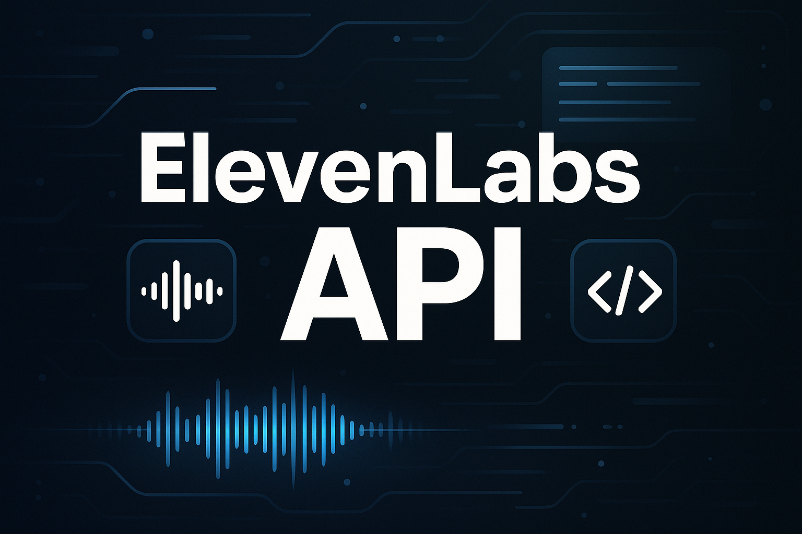

# ElevenLabs

## How to Use the ElevenLabs API in a Simple Python Application: A Tech Demo



Text-to-speech (TTS) has come a long way: what used to require expensive hardware or clunky server-side setups can now be driven by a few lines of code calling a cloud API. ElevenLabs.io offers one of the most realistic, expressive TTS engines available today, complete with multilingual voices, SSML support and studio-grade prosody. In this demo you’ll learn how to:

- Install and authenticate the ElevenLabs Python SDK
- Write a minimal terminal script to convert your own text into an MP3
- Wrap that same functionality in a lightweight Flask microservice
- Understand when and why you’d choose code over the web UI
- Practices on SSML and batching

By the end, you’ll have a reusable pattern you can drop into podcasts, accessibility tools, chatbots or anything that needs lifelike speech at the push of an API call.

## Why Choose Code Over the Web UI?

**Automation & Integration**  
A one-off voice clip? The web UI is fine. But once you need to generate audio dynamically, batch convert articles, feed user input, or spin up on-demand narration, manual downloads don’t scale. Code lets you tie TTS into your CI/CD pipeline, message queues or real-time services.

**Version Control & Reproducibility**  
Scripts in Git mean you can pin SDK versions, lock model IDs and ensure that “Today’s voice” doesn’t mysteriously change tomorrow.

**Customization & Error Handling**  
Embedded error checks, retries, fallbacks to offline voices or caching layers—none of that is possible through a point-and-click UI.

## Getting Started

Sign up at [elevenlabs.io](http://elevenlabs.io/) and grab API key from account dashboard.

Install Python 3.7+ and the ElevenLabs SDK:

```bash
pip install elevenlabs
```

(Alternatively, install `requests` if you prefer raw HTTP calls.)

Store your key:

```bash
export ELEVENLABS_API_KEY="YOUR_KEY"
```

## Minimal Python Script Demo

Here’s a lean terminal app, launch it, pick a voice, type your text, and get back an `output.mp3`:

```python
import os
from dotenv import load_dotenv
from elevenlabs.client import ElevenLabs
from elevenlabs import save

def main():
    load_dotenv()
    client = ElevenLabs()

    resp = client.voices.get_all()
    voices = resp.voices
    print("Available voices:", [v.name for v in voices])

    voice_name = input("Pick a voice name: ")
    voice = next((v for v in voices if v.name == voice_name), None)
    if not voice:
        raise ValueError(f"Voice '{voice_name}' not found")

    text = input("Enter text to speak: ")

    audio_bytes = client.text_to_speech.convert(
        text=text,
        voice_id=voice.voice_id,
        model_id="eleven_monolingual_v1",
        output_format="mp3_44100_128"
    )

    out_file = "output.mp3"
    save(audio_bytes, out_file)
    print(f"Saved speech to {out_file}")

if __name__ == "__main__":
    main()
```

**How it works:**
- `client.voices.get_all()` returns all installed voices.
- `convert()` streams raw bytes of the generated speech.
- `save()` writes those bytes to disk.

## Turning it into a Flask Micro-Service

To expose your TTS as an HTTP endpoint, usable by other apps or browser clients, wrap it in Flask:

```python
import os
from io import BytesIO
from flask import Flask, request, send_file, abort, jsonify
from elevenlabs.client import ElevenLabs

app = Flask(__name__)

if not os.getenv("ELEVENLABS_API_KEY"):
    raise RuntimeError("Missing ELEVENLABS_API_KEY")

client = ElevenLabs()

@app.route("/voices", methods=["GET"])
def list_voices():
    all_voices = client.voices.get_all().voices
    return jsonify([v.name for v in all_voices])

@app.route("/tts", methods=["POST"])
def tts():
    data = request.get_json(force=True)
    text = data.get("text")
    name = data.get("voice", "Roger")
    if not text:
        abort(400, '"text" field is required')

    voices = client.voices.get_all().voices
    voice = next((v for v in voices if v.name == name), None)
    if not voice:
        abort(404, f"Voice '{name}' not found")

    chunk_iter = client.text_to_speech.convert(
        text=text,
        voice_id=voice.voice_id,
        model_id="eleven_monolingual_v1",
        output_format="mp3_44100_128",
    )
    audio_bytes = b"".join(chunk_iter)

    return send_file(
        BytesIO(audio_bytes),
        mimetype="audio/mpeg",
        as_attachment=True,
        download_name="speech.mp3"
    )

if __name__ == "__main__":
    app.run(host="0.0.0.0", port=5001)
```

**Key points:**
- One global `ElevenLabs()` client keeps connections pooled.
- `/voices` returns a JSON list of available voice names.
- `/tts` expects a JSON body with `"text"` (required) and optional `"voice"`.

## Consuming TTS server

Once Flask app is running on `http://localhost:5001`, any client can connect to it. Here is an example using cURL:

```bash
curl -X POST http://localhost:5001/tts      -H "Content-Type: application/json"      -d '{"text": "Hello, ElevenLabs!", "voice": "Roger"}'      --output hello_Roger.mp3
```

## Workflow Comparison: Web UI vs. API-Driven Service

| Aspect            | Web UI                         | API + Code                                       |
|-------------------|----------------------------------|--------------------------------------------------|
| Speed (single clip)| Instant via browser            | ~200 ms–1 s per 1k characters                    |
| Automation         | None                            | Fully scriptable, schedulable, integratable      |
| Versioning         | No record of past settings      | Config in code, in Git, reviewable               |
| Error Handling     | Manual retry                    | Try/except, logging, alerts                      |
| Batching           | Impossible                      | Loop over files/messages, parallelize            |
| Deployment         | None                            | Dockerize, serverless functions, microservices   |

## Best Practices

### SSML & Prosody

SSML is an XML-style markup language that enhances speech quality by controlling prosody.

```xml
<speak>
  Welcome to our demo!<break time="300ms"/>
  This is <emphasis level="strong">ElevenLabs</emphasis> TTS, with control at your fingertips.
</speak>
```

Just pass this SSML string to `convert()` instead of plain text.

### Batching and Concurrency

Batching means looping over a list of texts. Concurrency means doing multiple conversions in parallel to save time.

```python
from concurrent.futures import ThreadPoolExecutor

def synthesize(text):
    return client.text_to_speech.convert(text=text, ...)

with ThreadPoolExecutor(max_workers=5) as exec:
    futures = [exec.submit(synthesize, t) for t in texts]
    for i, f in enumerate(futures):
        audio = f.result()
        save(audio, f"out_{i}.mp3")
```

## Conclusion

You now have a complete, end-to-end pattern for generating studio-quality speech in Python—on the terminal, in a microservice, and from any HTTP client. Whether you’re building accessibility tools, dynamic content pipelines or voice-enabled apps, this demo gives you the building blocks. Go ahead, fork your own TTS service, experiment with SSML, and bring your next project to life with ElevenLabs.

## References

- [ElevenLabs](https://elevenlabs.io/) - Generative AI Text to Speech & Voice Cloning  
- [ChatGPT](https://chatgpt.com/)