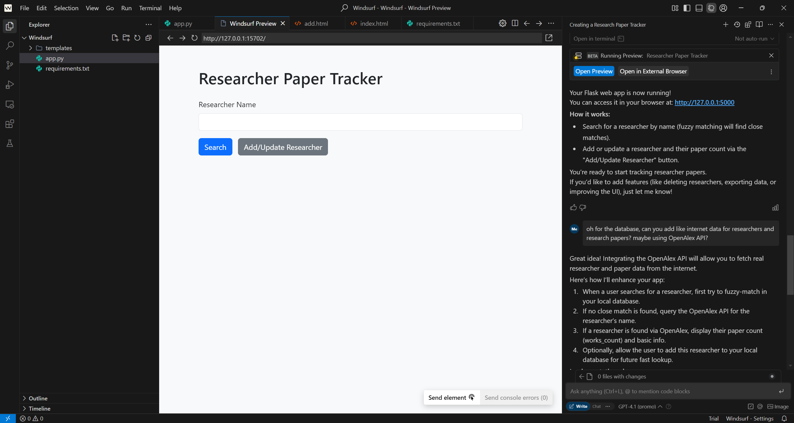

## How to Use and set up Windsurf: Personal Experience & Tips for Beginners (In Windows)


This image is sourced from Windsurfjournal on \[[Windsurfjournal]( https://www.windsurfjournal.com/article,news,windsurf-ai-artificial-intelligence,10827,en/)\]

**Author:** Immanuel Alvaro Bhirawa (**ORCID ID:** 0009-0009-3354-7794)
## Introduction
Windsurf is an innovative AI-powered Integrated Development Environment (IDE) designed to enhance the coding experience by keeping developers in flow. Formerly known as Codeium,
Windsurf integrates advanced AI capabilities to understand your intent, manage complex codebases, and provide intelligent assistance throughout the development process. In this blog
post, I’ll share insights on using Windsurf, a simulated personal experience, tips for beginners, and an example of leveraging an AI assistant to build a web application.

## Getting Started with Windsurf
### Installation
To begin, download Windsurf from the official website (Windsurf). It’s available for Mac, Windows, and Linux, requiring a minimum OS version like OS X Yosemite for Mac users. The download process is straightforward, and the installer guides you through the setup.


This image is sourced from Windsurf on \[[Windsurf](https://windsurf.com)\]

### Setup
After installation, Windsurf offers an onboarding flow where you can import settings from Visual Studio Code or Cursor, select an editor theme, and sign up or log in to a free account. This setup ensures your environment is tailored to your preferences, making it easy to start coding. More or less just follow the default settings that was offer for the Windsurf installation and you should be good to go. There’s not much things that you need to configure yourself that is not by default already, so don’t worry and just go with the installation flow. Once the installation is done, you can just click run windsurf!

### Basic Usage
Once set up, Windsurf functions like a traditional IDE but with powerful AI enhancements. You can open existing projects or create new ones, write code, and use features like Cascade, an AI assistant that suggests code, detects issues, and provides real-time guidance. The interface is intuitive, blending familiar IDE elements with AI-driven tools to streamline development.

## **Personal Experience Using Windsurf**: 
### Building a Simple WebApp to list out Research papers from a researcher using Flask + OpenAlex (for Researchers Data API)

For my personal experience developing Apps using Windsurf, for this blog’s example, I had decided to try telling Windsurf to build a Simple WebApp to list out research papers given a researcher’s name. This project would be done using Flask + OpenAlex. OpenAlex itself is a free, open-source bibliographic database of global scholarly research, so I used OpenAlex to get the researcher and research paper’s data.

So the following were the step-by-step on my experience on building said project using Windsurf.

#### **Step 1: Open a Workspace in Windsurf (after signing in to Windsurf)**

#### Step 1.1 After you open Windsurf the first time, it should look like this


This image is made by the Author from Windsurf Desktop.

#### Step 1.2 Afterwards, just follow the default setup. I used VS code as my key bindings.


This image is made by the Author from Windsurf Desktop.

#### Step 1.3 For the editor theme, choose whatever your preference is, mine is “Dark”.


This image is made by the Author from Windsurf Desktop.

#### Step 1.4 Log in to Windsurf, I personally used my google account.


This image is made by the Author from Windsurf Desktop.

#### Step 1.5 Once the setup is done, click “Open Folder” and go to any directory that you want the app to be built on using Windsurf.


This image is made by the Author from Windsurf Desktop.

#### Step 1.6 Should look like this, note I named my directory “Windsurf”


This image is made by the Author from Windsurf Desktop.

#### **Step 2: Start building the App!**

To Start building the App using Windsurf, you can start writing in it’s chat. Like the picture shown below. Note, from my personal experience using Windsurf, I highly recommend changing the LLM used. You can change this through the drop down menu that is highlighted by the red arrow. By default. Windsurf uses **Cascade** , but I have found this to be quite bad in development. Instead, for my usage, I am using **GPT 4.1** as shown there. Either **GPT 4.1** or **Claude 3.7** are good
options!


This image is made by the Author from Windsurf Desktop.

So, for the prompt to start building, here is the prompt that I used:

```
Can you help me create a simple app that can track how many papers does a researcher have? complete with the fuzzy matching algorithm for the researcher's name
```

and then click “send”. Here are the results of the prompt


This image is made by the Author from Windsurf Desktop.

It’s asking for additional prompt for preferences, so I typed “A web app would be good, and using Flask would be great as well I think”


This image is made by the Author from Windsurf Desktop.

Now when you see these kind of Confirmation prompts, all you need to do is just to click “Accept” for all of the confirmation prompts that are available.


This image is made by the Author from Windsurf Desktop.

Continuation of the prompt result are as follows, again, as a reminder, always click the accept button!


This image is made by the Author from Windsurf Desktop.


This image is made by the Author from Windsurf Desktop.

Now, Windsurf has finally able to finish building the app and there’s the Open Preview button, click that!


This image is made by the Author from Windsurf Desktop.

Now after clicking the Open Preview and trying to give a researcher’s name, it had an error as there was no data in the database. So I had told it “oh for the database, can you add like internet data for researchers and research papers? maybe using OpenAlex API?”. So that the App’s database is connected to OpenAlex’s database which contains a the researchers’ data. And so, the prompt’s result continue as follows


This image is made by the Author from Windsurf Desktop.


This image is made by the Author from Windsurf Desktop.

And there you go! That is my personal experience when using Windsurf to build an app using Flask and OpenAlex as the database.


## Conclusion
Windsurf is a game-changer for developers, offering AI-driven features that simplify coding and boost productivity. By following the setup steps, exploring its tools like Cascade and GPT 4.1, and applying beginner tips, you can harness its full potential. The example of building a research paper app with an AI assistant illustrates how such tools, combined with Windsurf, can streamline development tasks. I encourage you to try Windsurf for your next project and experience its benefits firsthand.

**References:** 
- https://windsurf.com
- https://openalex.org

