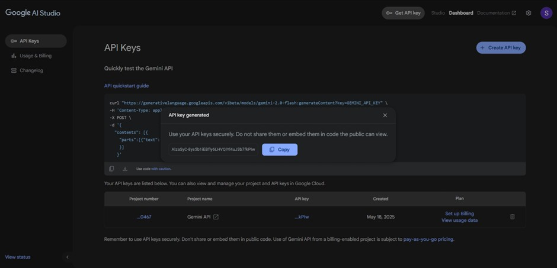
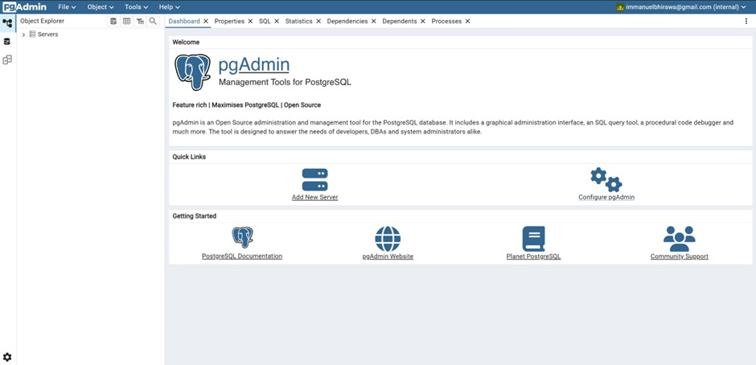

## How AI Helps Business Owners Understand Their Businesses’ Needs Through RAG and Automation


This image is generated by Author using ChatGPT on \[[ChatGPT]( https://chatgpt.com/share/682a6337-2e88-800c-ab3e-70fe85ea7be9/)\]

**Author:** Immanuel Alvaro Bhirawa (**ORCID ID:** 0009-0009-3354-7794)
## Introduction
In today’s competitive market, small business owners need to make quick, informed decisions to stay ahead. Artificial Intelligence (AI) offers powerful tools to analyse data and uncover insights, helping owners understand their businesses’ needs. One such technique, Retrieval-Augmented Generation (RAG), combines data retrieval with natural language generation to provide accurate, context-specific answers. When paired with automation, RAG can streamline data collection and reporting, saving time and effort.

This blog explores how to build a system using PostgreSQL with pgvector, pgadmin, n8n, Gemini’s Large Language Model (LLM) 2.5 pro, and Square API to help business owners gain insights into sales and customer feedback. By automating data workflows and leveraging AI, this setup delivers actionable reports, such as weekly sales summaries, tailored to your business.

RAG is widely used across industries, from healthcare for medical assistance to finance for market analysis (AWS RAG Explanation). Here, we focus on its application for small businesses, particularly in retail, using sales data from Square’s point of sale system.

A quick heads-up before we start, this tutorial does require some technical background in IT, slightly more than the beginner. And for our businesses example for this blog, we will be using a bubble tea shop.


## Overview of Tools
The following tools form the backbone of our AI-driven system:

| Tool                       | Role                                                                     |
| -------------------------- | ------------------------------------------------------------------------ |
| PostgreSQL with pgvector   | Stores business data and supports vector similarity searches for RAG.    |
| PGAdmin                    | Manages the PostgreSQL database with a user-friendly interface.          |
| n8n                        | Automates workflows, such as fetching data from Square API and storing it. |
| Gemini LLM 2.5 pro         | Generates natural language reports based on retrieved data.              |
| Square API                 | Provides access to sales and payment data from Square’s platform.        |

	
•	**PostgreSQL with pgvector**: PostgreSQL is a robust database, and pgvector adds vector storage for AI embeddings, enabling similarity searches.

•	**PGAdmin**: A local tool for managing PostgreSQL databases, installed on your machine.

•	**n8n**: An open-source automation platform that connects services like Square API to your PostgreSQL database.

•	**Gemini LLM 2.5 pro**: The Large Language Model that we will be using for our RAG.

•	**Square API**: Offers endpoints to retrieve sales transactions and customer data.

## Assumptions
-	**Docker** and **n8n** are already set up, with n8n being installed in your docker.
-	Knowledge about setting up **PostgreSQ**L is not needed but good to have in this tutorial
-	Knowledge about **APIs** is not needed but good to have in this tutorial
-	Knowledge about **n8n** is not needed but good to have in this tutorial
-	We are using **Square API** as our business’ Point of Sales or Payment Gateway as it is quite common in Australia.

Now that our overview and assumptions are handled, let’s begin!

In the beginning, it is good to know what the tools and environments that we will be dealing before we start. Below is an image for the workflow that we will be using. The file is also attached, and you just need to download it and import it in your n8n instance for now to follow this tutorial.


This image is made by the Author from n8n localhost.

So, attached above is the main workflow of the tutorial! It is split to 2 parts: 
-	Input Data from Square to PostgreSQL (the workflow that starts with the Schedule Trigger)

This image is made by the Author from n8n localhost.

- Chat workflow using RAG
- 
This image is made by the Author from n8n localhost.

Further explanation about each workflow are as follows:
-	**Input Data from Square to PostgreSQL**
    -	**Schedule Trigger**
        
        This would trigger at the end of every business day’s   working hours to act as a signal to retrieve all the data on that day from Square

	- **Get Current Date from Schedule Trigger**

        Get the current date

	- **Getting the Data from the business' Square account**

        Retrieve all of the businesses’ orders from the start of the day up to the time of the schedule trigger (i.e., at the end of the day)

    - 	**Split Out the items from square**
        
        This is a spit out function to sort of split out all of the items from the Square data that was retrieved.
    
    -	**Loop over items**

        Looping is needed to iterate over all of the items from the Square data

    -	**Top branch of the loop**

        -	**Get payment status**

            The workflow starts with the top branch first, checking whether the payment status is successful or not.

        -	**Parse Data that revolves with the money** 

            Parse the attributes such as total_money_amount , total_tax_money 

        -	**Insert data to PostgreSQL Database**

            Insert those attributes to the database

After successfully running the top loop, then the workflow immediately goes to the bottom branch of the loop. Afterwards, the whole loop starts over with the top branch for a new item.

  - **Bottom branch of the loop**
  
    - **Spit out every item from each order from Square**

        Splits out every item that was purchased from each order from square. Like for example item 1 would be Milk tea, Item 2 would be Cake, etc.

    - **Parse Data that revolves with the money** 
        
        Parse the attributes such as total_money_amount , total_tax_money 

    - **Insert data to PostgreSQL Database**

        Insert those attributes to the database

That’s basically the rundown of the **Input Data from Square to PostgreSQL workflow** done! Next is the **Chat workflow using RAG**.

-	**Chat workflow using RAG**

    - 	**When chat message received**

        The trigger for the n8n user where they can ask any question to the AI Agent, and then the AI Agent can answer said questions using RAG-powered knowledge base.
    - **AI Agent**

        The AI Agent consists of the following:

      - **LLM Model**
    
        The LLM model that is used is using Google’s Gemini 2.5 pro as that is the best model for long context, perfect for RAG.

      - **Memory**

        We use simple memory as to have a simple memory that stores the previous 3 chat history as context. Nothing too special here.

      - **Tools**

        We are using PostgreSQL as our main database, thus we are using the SQL Vector store as our RAG tool, whilst using Gemini’s embedding model since we are using Gemini as our LLM model. In this part, we also have execute query subworkflow where the AI Agent can call that tool to make SQL queries and execute them. We are using this approach since we are dealing with mostly financial data. Since LLM at the moment is still bad in handling large quantities of number computations and understanding, we are instead telling the AI Agent to make SQL queries to handle the number computations from our knowledge base.

      - **AI Agent’s prompt that we used**

        ```
        # Role
        Act as a Business Accounting Automation Agent, designed to assist business owners by retrieving and analyzing accounting data from PostgreSQL databases based on their queries.

        # Task
        Respond to business owners' inquiries about their accounting data, such as total profits on specific dates, sales of specific products, and comparisons of average order values over different periods. Use SQL queries to extract and calculate the requested information from the orders and line_items tables within the PostgreSQL databases. Present the findings in a clear, concise, and business-friendly manner.

        ## Specifics
        - Understand the business owner's query and determine the most relevant SQL query to execute.
        - If order_state is null, it means the customer have not paid yet
        - Use the "Invoice_vector" to retrieve invoice data from postgre vector store.
        - Use the "Get Table" tool to familiarize yourself with the database schema if necessary before formulating complex queries.
        - Execute the formulated SQL query using the "Execute Query" tool to retrieve the requested data.
        - Present the data in a professional, approachable manner, offering brief insights or context where appropriate.
        - Directly acknowledge the business owner's question before providing the answer, don't use programming jargon.

        # Tools
        You have access to two tools to assist in data retrieval and analysis:
        1. **Get Table**: Use this tool to retrieve table structure and sample data from the PostgreSQL databases to understand the schema of the orders and line_items tables.
        2. **Execute Query**: After formulating the appropriate SQL query, use this tool to run the query against the PostgreSQL databases and retrieve the requested information.
        3. **Invoice Vector**: Use this tool to retrieve business spending from pgvector.

        # Database Structure
        1. orders table with columns: id, customer_name, order_date, order_state, total_amount, total_tax, total_discount, payment_type

        2. line_items table with columns: id, order_id, product_name, variation_name, quantity, base_price, total_price, total_tax

        # Examples
        Q: What was our total profit for January 25, 2025?
        A: I've analyzed the transactions from January 25, 2025. The total profit for that day was $3,842.75, calculated from 47 orders with 126 line items. This represents a 12% increase compared to the previous day.

        Q: How many units of our premium product did we sell last week?
        A: I've checked the sales data for the past week (January 15-21, 2025). Your premium product "Ultra Widget Pro" sold 78 units, generating $15,600 in revenue. This accounts for approximately 22% of your total revenue for the week.

        Q: What's our average order value for this month compared to last month?
        A: I've calculated your average order values:
        - Current month (January 2025): $127.50 per order
        - Previous month (December 2024): $112.80 per order

        This represents a 13% increase in average order value. The increase appears to be driven by higher sales of your premium product line, which has grown by 18% compared to last month.

        # Notes
        Style and Tone:
        - Maintain a professional but approachable demeanor, akin to a helpful financial analyst.
        - Use clear, concise language to explain financial data, ensuring it is easy for the business owner to understand.
        - Organize numerical information neatly, making it straightforward to read and interpret.
        - Provide direct answers to the business owner's questions, followed by any relevant insights or context regarding the data.
        - For additional context, here is the current date / time: {{ $now }}

        Behaviors to Avoid:
        - Refrain from using complex database or SQL jargon when presenting results.
        - Avoid offering business advice unless explicitly requested by the business owner.
        - Do not speculate on financial data not present in the database.
        - Ensure sensitive financial information is only communicated to the authorized business owner.
        - Avoid performing calculations that require data outside the orders and line_items tables.
        - Keep explanations of SQL query constructions brief and only provide them if asked.
        - Do not adopt a casual or informal tone when discussing financial information.

        ```

Lastly, there’s the **Execute Query** sub-workflow that was previously mentioned, that one is also attached below and it’s basically just one SQL node that execute SQL Queries on the database. Why this is split to another workflow is to off-load the data between workflows so that our main workflow doesn’t get overloaded with data.


This image is made by the Author from n8n localhost.

Now that we know how the workflow is, let’s start setting up the environments that are needed.

**Setting Up the Environment**

Assuming Docker and n8n are already set up on your local machine, follow these steps to configure the remaining components and credentials for the n8n workflow.

**Step 1: Get your Google Gemini API key (it’s free) for your Google Gemini LLM model for RAG and AI Agent.**

This step is quite straightforward, all you have to do is go to this link -> https://aistudio.google.com/u/1/apikey and login with your gmail account. It should look like this 


This image is sourced from Google AI Studio on \[[Google AI Studio](https://aistudio.google.com/apikey)\]

All you have to do is click **Create API Key**


This image is sourced from Google AI Studio on \[[Google AI Studio](https://aistudio.google.com/apikey)\]

And then just copy it and go to n8n and create a Google credential there! (This step is skipped as it is assumed knowledge).

**Step 2: Setting up your PostgreSQL Database**
Setting up our database takes some additional steps to go through.

**2.1 Set up PGVector in docker**

For this step, all you have to do is go to Docker and go to the search bar that Is located top of your screen, middle area and search **PGVector**. Afterwards, click run.


This image is made by the Author from docker.

There are additional settings that you need to keep in mind, namely the **Port** number and **Environment Variables**. For port number, make sure its **5432**. For Environment Variables, make sure you add 2 variables, **POSTGRES_USER** & **POSTGRES_PASSWORD**. This is for your PostgreSQL’s database user credentials that you will need later. Afterwards just click run.


This image is made by the Author from docker.

Once the container is run, you need to click the container again and go to **Inspect**. There, scroll down until you get to the **NetworkSetting** part and copy the **IPAddress**.


This image is made by the Author from docker.

2.2 **Set up PGAdmin in docker**

Same as PGVector setup, go to your docker desktop, and go to the search bar in the top-middle part of the screen and search for specifically **dpage/pgadmin4**. Because dpage is the developer of PGAdmin, hence why we are using this version. Afterwards, click run.


This image is made by the Author from docker.

For the additional settings for PGAdmin, more or less it is the same as PGVector where you only need to pay attention for **Port** & **ENVIRONMENT VARIABLES**. The port numbers need to be 443 80 for default port settings. And the Environment variables need 2, **PGADMIN_DEFAULT_EMAIL** and **PGADMIN_DEFAULT_PASSWORD**. Both of which, are up to your choosing for the value. Then click run.


This image is made by the Author from docker.

Afterwards, you either go to http://localhost:443 or http://localhost:80 to access PGAdmin. For me it was http://localhost:80. In here, you would login using your email and password for PGAdmin, like so. 


This image is made by the Author from PGAdmin localhost on \[[PGAdmin localhost](http://localhost:80)\].

After you log in, go to **Add New Server**


This image is made by the Author from PGAdmin localhost on \[[PGAdmin localhost](http://localhost:80)\].

Here, fill in the **name**


This image is made by the Author from PGAdmin localhost on \[[PGAdmin localhost](http://localhost:80)\].

And the **Host name/address** that you fill in from the IPAddress that we found out before (`172.17.0.4`) along with the PostgreSQL **user** and **password** that you made before during PGVector, and then save. Your screen should look like below


This image is made by the Author from PGAdmin localhost on \[[PGAdmin localhost](http://localhost:80)\].


This image is made by the Author from PGAdmin localhost on \[[PGAdmin localhost](http://localhost:80)\].

Now that’s done, we need to create our SQL tables for our database. So we just have to open **Test > Database > postgres > Schemas > Tables** and right click tables. And then click create > table


This image is made by the Author from PGAdmin localhost on \[[PGAdmin localhost](http://localhost:80)\].

Here, we need to make 2 tables, namely **order** and **line_Items**.


This image is made by the Author from PGAdmin localhost on \[[PGAdmin localhost](http://localhost:80)\].


This image is made by the Author from PGAdmin localhost on \[[PGAdmin localhost](http://localhost:80)\].

Now for each tables, we have to make a variety of columns. For this, you just have to right click on the the table that you want to make the column on and then Create > Column. 


This image is made by the Author from PGAdmin localhost on \[[PGAdmin localhost](http://localhost:80)\].

For the table **order** we need to make the following columns
```
Id (Data type: text), customer_name (Data type: text), order_date (Data type: date), order_state (Data type: text), total_amount (Data type: numeric), total_tax (Data type: numeric), payment_type (Data type: text), total_discount (Data type: numeric)
```


This image is made by the Author from PGAdmin localhost on \[[PGAdmin localhost](http://localhost:80)\].

And for the table **line_items** we need to make the following columns
```
Id (Data type: text), order_id (Data type: text), product_name (Data type: text), variation (Data type: text), quantity (Data type: integer), base_price (Data type: numeric), total_price, total_tax
```


This image is made by the Author from PGAdmin localhost on \[[PGAdmin localhost](http://localhost:80)\].

And that’s it! We have now made our database in PostgreSQL. Last thing to do for SQL is to put the same credentials in n8n’s SQL node too! 

**Host** 172.17.0.4 

**User** postgres

**Password** testpostgres

**Port** 5432


This image is made by the Author from n8n localhost.

And you’re done!

Now we go to the last step of setting up and that is to go to the **Square API**!

**Step 3: Setting up your businesses’ Square API**

Quickly, we go to this web -> https://app.squareup.com/signup and sign up a new account.


This image is made by the Author from Square on \[[Square Signup](https://app.squareup.com/signup)\].

After making an account, you can come to this link -> https://developer.squareup.com/apps/sq0idp-ZVGy8_o6mJzrc215VwLnVg/settings and copy the **Sandbox Access Token**. This will be your api key that you need to paste later on in n8n.

Now the current account is a sandbox account, for this blog’s purposes, we will not be dealing with production-level account, but don’t worry, the processes are the same regardless.

Now, for the bubble tea shop, we need to make a few items that the shop sells. You can make them here -> https://app.squareupsandbox.com/dashboard/items/library#.


This image is made by the Author from Square on \[[Square Sandbox](https://app.squareupsandbox.com/dashboard/items/library#)\].


This image is made by the Author from Square on \[[Square Sandbox](https://app.squareupsandbox.com/dashboard/items/library#)\].

To make an item, you can just follow the flow from square, it should be straightforward. Just remember to add the price for each item. Like so


This image is made by the Author from Square on \[[Square Sandbox](https://app.squareupsandbox.com/dashboard/items/library#)\].

After the items have been established, now we need to make orders, you can do so through this link -> https://app.squareupsandbox.com/dashboard/orders/overview.


This image is made by the Author from Square on \[[Square Sandbox](https://app.squareupsandbox.com/dashboard/orders/overview)\].

First order 4 cheesecake and 1 bubble tea paid by cash


This image is made by the Author from Square on \[[Square Sandbox](https://app.squareupsandbox.com/dashboard/orders/overview)\].

Second order 3 cheesecakes


This image is made by the Author from Square on \[[Square Sandbox](https://app.squareupsandbox.com/dashboard/orders/overview)\].

And that’s done! All that’s left is to put in the **Square Sandbox Access** Token


This image is made by the Author from n8n localhost.


This image is made by the Author from n8n localhost.

And that’s it! Your workflow now is all set up and you can ask your n8n workflow questions about your business such as below.

## Usage Example
Click the **Test Workflow** button to input all of your data from **Square** to the **PostgreSQL** database.


This image is made by the Author from n8n localhost.

Then all you have to do is Click the **Open Chat** button and start chatting with your businesses' financial data! Example being as below. With the question being 
```
what is the total sales so far?
```

this should result in 77$ based on the orders that we have inputted just now. Below is the result.


This image is made by the Author from n8n localhost.

That's done!

## Conclusion
This setup leverages RAG and automation to transform raw data into actionable insights, helping business owners make informed decisions. While powerful, it requires technical setup and possibly API costs. For small businesses, this system can be a game-changer, aligning with trends in AI-driven analytics.
