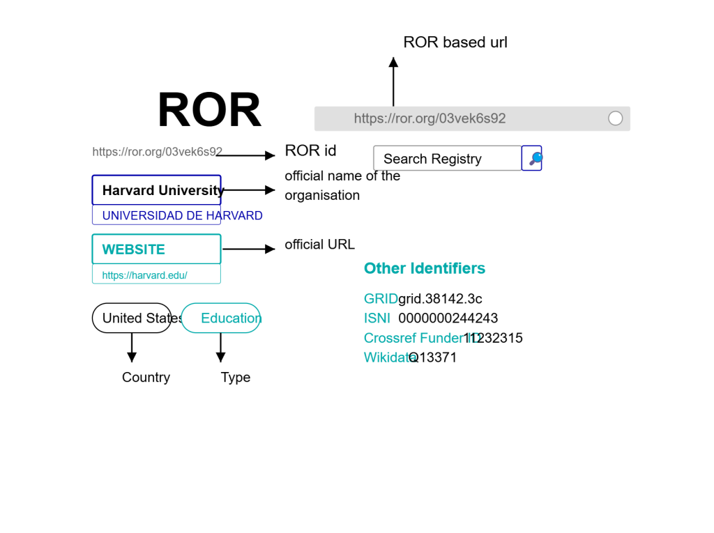

## Understanding How the Research Organisation Registry is Used Across the Web

_Created using DALL.E on 2 March 202_5

## Author

- Aditya Arora (**ORCID:** [0009-0006-5800-1198](https://orcid.org/0009-0006-5800-1198))

## Introduction

In today's digital research landscape, finding, accessing, and connecting scholarly information has become increasingly complex. How do we reliably identify research outputs, the people who create them, and the organisations where this work takes place? This is where persistent identifiers (PIDs) come into play.

Persistent identifiers are unique, permanent digital references to a document, webpage, file, or any other entity. We have DOIs (Digital Object Identifiers) which are used to identify publications like journals or articles and ORCID IDs to identify researchers.

However, we needed a comprehensive, open system for identifying research organisations themselves. This gap has now been addressed by ROR – the Research Organisation Registry.

Launched in 2019 as a community-led collaboration between Crossref, California Digital Library, DataCite, and Digital Science, ROR creates unique identifiers for research organisations worldwide. These identifiers enable clear connections between researchers, their affiliated institutions, and their outputs.

In this blog post, we'll explore the research paper "[Measuring web connectivity between research organisations through ROR identifiers](https://arxiv.org/abs/2209.10821)" that examines how ROR identifiers are being used across the web. Based on the study by the authors, we'll look at the adoption patterns of ROR, who is linking to these identifiers, and what this tells us about the evolution of the scholarly web. Understanding these patterns provides valuable insights into how research information is being connected and how the academic ecosystem is adapting to this relatively new but important identification system.

## What is ROR and Why Does it Matter?

ROR's journey began in 2016 through a series of collaborative workshops where representatives from publishers, libraries, and metadata services met to address this challenge. After defining governance recommendations and product principles, ROR was officially launched in 2019.

Initially, ROR was built upon Digital Science's GRID database, using it under a CC0 licence (a public domain dedication that allows unrestricted reuse without attribution) to create a foundation of organisational records. In September 2021, GRID completed its final update and was retired from public space. Since then, ROR has been maintained independently as the leading open organisation identifier registry.

What makes ROR particularly valuable is its integration with existing identifier systems. Each organisation in the registry receives a unique ROR ID that can be embedded in a URL (e.g., [https://ror.org/03vek6s52](https://ror.org/03vek6s52)). These ROR-based URLs link to customised webpages (ROR cards) containing basic information about the organisation. Additionally, ROR maps its IDs to other identifiers for the same organisation, including GRID, ISNI, Wikidata, and Crossref's Funder ID.

Fig 1: Example of ROR ID Card

As stated in the paper, "The main objective of this exploratory work is to measure the degree and type of use of ROR identifiers by the online scientific and academic ecosystem through link-based indicators. The specific research goals are set below:

a) How much are ROR-based URLs used? That is, which percentage of ROR ids is linked? Are there differences by country or type of research organisation?

b) Who links to ROR-based URLs? That is, which websites (either research or non-research institutions) link to ROR ids?

c) Why ROR-based URLs are linked? That is, which are the main uses for the creation of links to ROR ids?" \[1\]

## Key Findings of the Current State of ROR Usage

How widely has ROR been adopted, and which types of organisations are leading the charge? The study offers fascinating insights into the current state of ROR implementation across the web.

To analyse ROR implementation, the researchers used Majestic, a professional link intelligence tool, to collect data on links to ROR-based URLs. This methodology allowed them to examine linking patterns across the web.

**Global Distribution of ROR Identifiers**

ROR has created identifiers for organisations across 220 countries, but distribution is heavily concentrated - just 20 countries account for over 80% of all ROR IDs. The United States leads with 30%, followed by the United Kingdom at 7.16%, while adoption remains low across Africa, Latin America, and parts of Asia.

**Linking Patterns Across Countries and Organisation Types**

When examining which ROR identifiers are actually being used online (defined as being linked at least once), the study found that 51.6% of all active ROR identifiers have received at least one link. However, this percentage varies dramatically by country.

Norway stands out as a leader, with 70.6% of its ROR IDs having been linked (among countries with at least 1,000 ROR IDs). In contrast, Chinese and Japanese ROR IDs show much lower rates of linking (35.8% and 39.6% respectively).

Organisation type also influences linking patterns. While companies represent the largest category of organisations with ROR IDs (28.77%), educational institutions show the highest rate of linking, with 60.1% of their ROR IDs receiving at least one link. Archives (39%), non-profit organisations (44.5%), and companies (48.4%) lag behind in this metric.

When examining the volume of links rather than just the presence of links, educational institutions dominate, receiving 64,404 links from 162 unique referring domains. This suggests that the academic sector has embraced ROR more enthusiastically than other sectors.

| Type | No. ROR IDs registered | Distribution (%) | No. RORs linked | Linkage (%) | No. Links received | No. Referring domains |
| --- | --- | --- | --- | --- | --- | --- |
| Company | 29,508 | 28.77 | 14,287 | 48.4 | 15,477 | 26 |
| Education | 19,370 | 19.37 | 11,930 | 60.1 | 64,407 | 162 |
| Non-profit | 13,817 | 13.48 | 6,146 | 44.5 | 8,888 | 53 |
| Healthcare | 12,978 | 12.7 | 6,500 | 50.1 | 6,831 | 25 |
| Facility | 9,330 | 9.1 | 5,258 | 56.4 | 32,748 | 72 |
| Other | 8,130 | 7.93 | 3,279 | 40.3 | 4,668 | 26 |
| Government | 6,066 | 5.9 | 3,098 | 51.1 | 12,009 | 54 |
| Archive | 2,833 | 2.76 | 1,116 | 39.4 | 2,018 | 46 |
| Blank | 31 | 0.03 | 18 | 58.1 | 18 | 11 |
| TOTAL | 102,559 | 100 | 51,632 | 50.3 | 147,064 | \*242 |

Table 1: Type of research organisations and link distribution

\* Unique referring domains

**Notable Patterns and Outliers**

Interestingly, the study found that link patterns are often heavily concentrated around specific institutions. For example, the Keldysh Institute of Applied Mathematics, a Russian research facility, received 9,676 links – the highest number for any single organisation. However, these links came almost exclusively from the institute's own website, with 9,675 links originating from keldysh.ru.

Similar patterns of concentrated linking from a few sources appear among other highly-linked institutions, suggesting that broad adoption across many referring domains remains limited. The presence of several Russian and German institutions among the most linked ROR-based URLs helps explain the strong overall showing of these countries in the link analysis.

These findings reveal that while ROR has established a substantial presence in the research infrastructure ecosystem, its adoption remains uneven across geographic regions and organisation types. The concentration of links around specific institutions and from limited sources suggests that ROR has yet to achieve the broad integration seen with other persistent identifiers like DOIs.

**Who Links to ROR?**

Most links to ROR identifiers (60.1%) come from non-research organisations rather than research institutions themselves. These 147,154 links originate from just 242 unique domains, suggesting concentrated rather than widespread adoption.

Three major sources dominate, accounting for nearly 70% of all links:

GRID (grid.ac): 54,978 links

Pangaea data repository: 32,256 links

Benjamins academic publishing: 21,370 links

The flow analysis reveals that 69.2% of links come from non-research organisations, 21.6% from other research organisations, and only 9.1% are self-links (organisations linking to their own ROR ID).

**How ROR IDs Are Being Used**

The study identified several primary uses for ROR identifiers:

1. **Bibliographic Records** (51.4% of links): Embedding ROR IDs in publications and datasets to connect research outputs with their originating institutions.

3. **Organisation Records** (36%): Including ROR identifiers in organisational databases and registries.

5. **Documentation Examples** (6.2%): Using ROR IDs in blogs and technical documentation to demonstrate implementation.

These findings indicate that while ROR is becoming integrated into scholarly information systems, adoption remains uneven and concentrated among certain regions, organisation types, and referring domains. The integration with existing systems like GRID demonstrates ROR's potential to enhance connectivity in the scholarly ecosystem, though widespread adoption is still developing.

## Challenges and Limitations

The study of ROR identifier usage reveals several challenges and limitations that affect both the current implementation and evaluation of this system.

**Adoption Barriers**

Despite its potential, ROR faces adoption hurdles. With only 51.6% of ROR identifiers linked at least once, there's significant room for growth. The uneven distribution across countries and organisation types suggests that awareness and implementation of ROR varies widely across the global research landscape.

Educational institutions have embraced ROR more readily than archives or companies, indicating sector-specific adoption patterns. Geographic disparities are also evident, with organisations in North America and Western Europe showing stronger implementation than those in regions like Africa, Latin America, and parts of Asia.

**Measurement Challenges**

The researchers identified several methodological limitations that affect how we understand ROR usage:

1. **Web Dynamism**: The constant change of web content results in links being deleted, which means link counts are unstable and represent only a snapshot at the time of data collection.

3. **Data Source Limitations**: Results depend on the coverage of the link intelligence tool used (Majestic in this case), and other tools might show different patterns.

5. **Alternative Uses**: ROR identifiers can be implemented without links (e.g., "ROR 04q93ds34"), potentially underrepresenting actual usage.

7. **Duplicate Content**: Language variations and duplicate pages may artificially inflate link counts for some organisations.

These limitations highlight the complexity of evaluating the implementation of infrastructure components like persistent identifiers across the web.

## Future of ROR

The future of ROR appears promising as scholarly infrastructure continues to evolve. Several key developments are likely to shape its trajectory:

- **Integration with existing systems**: As the connectivity between DOIs, ORCIDs, and ROR identifiers strengthens, we can expect more comprehensive mapping of the relationships between researchers, publications, and institutions.

- **Broader adoption**: While currently concentrated in certain regions and organisation types, ROR adoption will likely expand as more journals, repositories, and databases incorporate ROR identifiers into their workflows.

- **Enhanced search functionality**: Implementation of ROR-specific search capabilities (similar to DOI or ORCID searches) will drive further usage and utility within scholarly systems.

As the paper notes, ROR's integration into bibliographic databases remains limited but is expected to grow substantially, creating new opportunities for bibliometric analysis and institutional performance tracking.

## Conclusion

The study of ROR implementation provides valuable insights into how this relatively new persistent identifier system is being adopted across the scholarly landscape. With just over half of all ROR identifiers having been linked at least once, ROR has established a foothold in the research ecosystem but has significant room for growth.

The concentration of links around specific institutions and from limited sources suggests that broad integration is still developing. Educational institutions are leading adoption, with 60.1% of their ROR IDs receiving links, compared to lower rates for archives, non-profits, and companies.

Despite methodological limitations related to web dynamism and measurement tools, the research demonstrates that analysing ROR usage patterns can effectively map the implementation of organisational identifiers across scientific information systems.

As ROR continues to mature, its potential to enhance interoperability, improve attribution accuracy, and support FAIR (findability, accessibility, interoperability, and reusability) data principles will likely drive increased adoption across the global research community. The interconnection of researchers, organisations, and outputs through persistent identifiers represents a fundamental shift in how we organise and access scholarly information in the digital age.

## References

1. Orduña-Malea, E., & Bautista-Puig, N. (2022). Measuring web connectivity between research organizations through ROR identifiers. _STI 2022 From Global Indicators to Local Applications_.
